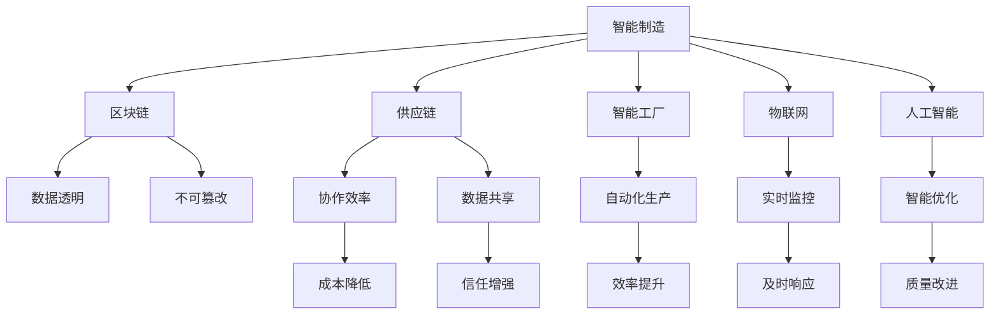

                 

# 未来的智能制造：2050年的区块链供应链与智能工厂

> 关键词：智能制造,区块链,供应链,智能工厂,物联网,人工智能

## 1. 背景介绍

### 1.1 问题由来

随着全球化生产方式的演进，供应链的复杂性不断增加。传统供应链系统中，信息孤岛、数据碎片化、协作效率低下等问题变得愈发严重。这些问题导致了库存成本上升、生产效率低下、产品交货延迟等问题，严重影响了企业的竞争力。

同时，在疫情冲击下，供应链的脆弱性暴露无遗。大量企业无法满足需求，导致供应链断裂、产品短缺，造成巨大经济损失。

为应对这些挑战，智能制造、区块链技术被提上日程。智能制造通过物联网、大数据、人工智能等技术，实现生产流程的全自动化，提高生产效率和产品质量。而区块链技术通过分布式账本、智能合约等机制，解决了供应链中的信任问题，确保数据透明和不可篡改。

### 1.2 问题核心关键点

智能制造与区块链的结合，为供应链带来了诸多优势。通过智能工厂的自动化生产、物联网的实时监控、人工智能的精准分析，生产效率和质量得以大幅提升。而区块链技术则通过透明和不可篡改的数据记录，解决了供应链上的信任问题，实现了各方协同。

这种结合使得供应链从传统的集中式管理，转变为分布式协作，提升了供应链的灵活性和适应性。未来，2050年的供应链将更加高效、透明、安全，能够在全球化背景下，满足消费者需求。

## 2. 核心概念与联系

### 2.1 核心概念概述

为更好地理解智能制造与区块链结合的供应链系统，本节将介绍几个密切相关的核心概念：

- 智能制造（Smart Manufacturing）：通过物联网（IoT）、大数据（Big Data）、人工智能（AI）等技术，实现生产流程的自动化和智能化，提升生产效率和产品质量。
- 区块链（Blockchain）：基于分布式账本技术，通过共识算法和加密技术，实现数据透明和不可篡改。
- 供应链（Supply Chain）：涉及产品从原料到交付的所有环节，包括采购、生产、仓储、物流等。
- 智能工厂（Smart Factory）：结合物联网、人工智能等技术，实现生产设备的自动化和智能化。
- 物联网（IoT）：通过传感器、RFID、3D扫描等技术，实现设备和产品的互联互通。
- 人工智能（AI）：通过机器学习、深度学习等技术，实现生产流程的智能优化。

这些核心概念之间的逻辑关系可以通过以下Mermaid流程图来展示：



这个流程图展示了几大核心概念之间的关系：

1. 智能制造通过物联网、人工智能等技术，实现生产流程的自动化和智能化，提高效率和质量。
2. 区块链技术通过透明和不可篡改的数据记录，解决了供应链上的信任问题，实现了各方协同。
3. 供应链涉及生产、仓储、物流等环节，通过智能制造和区块链技术的结合，提升了整体协作效率和数据共享。
4. 智能工厂作为智能制造的实现手段，通过自动化设备、人工智能算法等，优化生产流程，实现高质量、高效率的生产。
5. 物联网实现设备和产品的互联互通，提供实时监控和数据采集，为智能制造和区块链技术的应用提供了数据支撑。
6. 人工智能通过智能优化，提升生产流程的智能化水平，实现更高层次的生产自动化。

## 3. 核心算法原理 & 具体操作步骤
### 3.1 算法原理概述

智能制造与区块链结合的供应链系统，本质上是一个集成物联网、人工智能、区块链等技术的复杂系统。其核心算法原理包括以下几个方面：

1. 物联网技术实现设备互联和数据采集。通过传感器、RFID、3D扫描等技术，实现生产设备的实时监控和数据采集。
2. 人工智能技术实现生产流程的智能优化。通过机器学习、深度学习等技术，优化生产计划、调度、质量控制等环节，实现高效、高质量的生产。
3. 区块链技术实现供应链的数据透明和不可篡改。通过分布式账本和智能合约，确保供应链数据的透明性和不可篡改性，提升各方的信任度。

### 3.2 算法步骤详解

基于上述核心算法原理，智能制造与区块链结合的供应链系统主要包括以下几个关键步骤：

**Step 1: 设备互联和数据采集**

- 将物联网传感器、RFID标签、3D扫描仪等设备安装到生产设备上，实现设备互联和数据采集。
- 通过物联网平台，实时收集生产设备状态、工艺参数、产品质量等数据。

**Step 2: 数据处理与分析**

- 对采集到的数据进行预处理，包括去噪、归一化、异常值检测等，确保数据质量。
- 利用人工智能算法（如机器学习、深度学习）对数据进行分析，优化生产流程，提高效率和质量。

**Step 3: 区块链数据记录**

- 将优化后的生产数据上传到区块链平台，记录到分布式账本中。
- 利用区块链的智能合约，实现供应链各方的协同，确保数据透明和不可篡改。

**Step 4: 智能制造与供应链协同**

- 通过区块链平台，实现供应链各方的信息共享和协作。
- 根据区块链数据，优化供应链管理，提高生产效率和库存管理水平。

### 3.3 算法优缺点

智能制造与区块链结合的供应链系统具有以下优点：

1. 提高生产效率。通过物联网和人工智能技术的结合，实现生产流程的自动化和智能化，提升生产效率和质量。
2. 降低库存成本。通过实时监控和智能优化，减少库存积压，降低库存成本。
3. 增强供应链协作。通过区块链技术的透明和不可篡改特性，实现供应链各方的信任，提升协作效率。
4. 数据透明和不可篡改。区块链技术确保供应链数据的透明和不可篡改，提升了数据的安全性和可信度。

同时，这种系统也存在一些缺点：

1. 初始投资成本高。物联网设备和区块链平台需要较大的初始投资，企业需要投入大量资金进行部署。
2. 技术复杂度高。物联网、人工智能、区块链等技术的结合，需要较高的技术门槛，需要专业人才进行维护和优化。
3. 数据隐私问题。区块链的透明特性可能泄露部分隐私信息，需要采取措施保护数据隐私。

### 3.4 算法应用领域

智能制造与区块链结合的供应链系统，已在多个领域得到广泛应用：

1. 汽车制造：通过物联网和人工智能技术，实现生产线的自动化和智能化，提升汽车制造的效率和质量。
2. 电子制造：利用区块链技术，确保电子产品的供应链透明和可追溯性，提升产品质量和消费者信任度。
3. 食品制造：通过物联网和区块链技术，实现食品供应链的实时监控和数据记录，确保食品安全和可追溯性。
4. 航空航天：利用物联网和人工智能技术，实现生产流程的自动化和优化，提升航空航天的生产效率和产品质量。
5. 能源制造：通过区块链技术，实现能源供应链的数据透明和不可篡改，提升能源生产和供应的效率和可靠性。

除了上述这些领域外，智能制造与区块链结合的供应链系统也在不断扩展，为更多行业带来了新的机遇。

## 4. 数学模型和公式 & 详细讲解  
### 4.1 数学模型构建

本节将使用数学语言对智能制造与区块链结合的供应链系统进行更加严格的刻画。

记供应链中的生产设备为 $D_i$，其中 $i \in [1, n]$，$n$ 为设备总数。设备 $D_i$ 的状态为 $s_i \in S$，其中 $S$ 为状态集合。物联网设备采集到的状态数据为 $x_i \in X$，其中 $X$ 为数据空间。

定义生产设备的状态转换模型为 $f_i: S \rightarrow S$，表示设备状态的变化。利用人工智能算法，通过历史数据训练得到状态转换模型 $f_i$。

定义区块链平台上的数据记录模型为 $r_i: X \rightarrow R$，其中 $R$ 为记录空间。利用区块链智能合约，确保数据透明和不可篡改。

### 4.2 公式推导过程

以下我们以一个简化的生产设备状态转换模型为例，推导基于智能制造与区块链结合的供应链系统的主要数学模型。

设设备 $D_i$ 的状态从 $s_j$ 变为 $s_k$，对应的状态转换模型为 $f_i$。则状态转换方程可表示为：

$$
s_k = f_i(s_j, x_i)
$$

其中 $x_i$ 为设备 $D_i$ 采集到的状态数据，表示设备运行情况、工艺参数、产品质量等。

在供应链系统中，生产设备的实时状态数据 $x_i$ 上传到区块链平台，记录到分布式账本中。区块链平台上的数据记录模型为 $r_i$，用于确保数据的透明和不可篡改。

利用区块链的智能合约，供应链各方可以实时查看设备状态数据，并进行协同。智能合约的逻辑定义如下：

$$
C_i(s_j, s_k, x_i) = \begin{cases}
1, & \text{if } s_k = f_i(s_j, x_i) \\
0, & \text{otherwise}
\end{cases}
$$

其中 $C_i$ 表示智能合约函数，用于验证设备状态转换是否符合预期。

通过上述数学模型，可以清晰地表达智能制造与区块链结合的供应链系统的基本原理。在实际应用中，还需要根据具体场景进行扩展和优化。

### 4.3 案例分析与讲解

以下我们以汽车制造为例，详细讲解智能制造与区块链结合的供应链系统的应用场景。

假设汽车制造企业需要生产一批汽车零部件，利用物联网设备采集生产设备状态数据，通过人工智能算法优化生产计划和调度，利用区块链平台记录供应链数据，实现供应链协同。

**Step 1: 设备互联和数据采集**

- 在生产线上安装物联网传感器和RFID标签，实时采集生产设备状态数据。
- 利用物联网平台，将设备状态数据上传到区块链平台，记录到分布式账本中。

**Step 2: 数据处理与分析**

- 对采集到的设备状态数据进行预处理，去除噪声和异常值，确保数据质量。
- 利用机器学习算法，分析设备状态数据，预测设备故障和维护需求。
- 利用深度学习算法，优化生产计划和调度，提升生产效率。

**Step 3: 区块链数据记录**

- 利用区块链智能合约，验证设备状态转换是否符合预期。
- 记录生产设备状态数据和生产计划，确保供应链数据的透明和不可篡改。

**Step 4: 智能制造与供应链协同**

- 供应链各方通过区块链平台，实时查看设备状态数据和生产计划，进行协同。
- 根据区块链数据，优化供应链管理，提高生产效率和库存管理水平。

通过以上步骤，汽车制造企业可以实现高效、高质量的生产，同时确保供应链数据的透明和不可篡改，提升各方协作效率。

## 5. 项目实践：代码实例和详细解释说明
### 5.1 开发环境搭建

在进行智能制造与区块链结合的供应链系统开发前，我们需要准备好开发环境。以下是使用Python进行智能制造系统开发的常见环境配置流程：

1. 安装Anaconda：从官网下载并安装Anaconda，用于创建独立的Python环境。

2. 创建并激活虚拟环境：
```bash
conda create -n manufacturing-env python=3.8 
conda activate manufacturing-env
```

3. 安装Python包：
```bash
pip install pandas numpy scikit-learn scikit-iotpy aioretto-enpoint
```

4. 安装物联网设备驱动程序和SDK：
```bash
pip install pyserial pyrfid pyioc 
```

5. 安装区块链平台SDK：
```bash
pip install pysha3 pyblockchain 
```

6. 安装智能合约开发工具：
```bash
pip install solidity
```

完成上述步骤后，即可在`manufacturing-env`环境中开始开发。

### 5.2 源代码详细实现

下面我们以一个简化的智能制造与区块链结合的供应链系统为例，给出使用Python进行开发的详细代码实现。

首先，定义设备状态转换模型：

```python
import numpy as np

class StateTransitionModel:
    def __init__(self):
        self.state_transitions = {}
        self.current_state = None
    
    def fit(self, data):
        for state, transition in data:
            self.state_transitions[state] = transition
    
    def predict(self, state):
        self.current_state = state
        transition = self.state_transitions[self.current_state]
        next_state = self.current_state + transition
        return next_state
```

然后，定义区块链平台上的数据记录模型：

```python
class BlockchainDataRecorder:
    def __init__(self):
        self.data = []
    
    def record(self, state, transition, data):
        self.data.append((state, transition, data))
    
    def get_data(self):
        return self.data
```

接着，定义智能合约逻辑：

```python
from solidity import Contract, require

class SmartContract(Contract):
    def __init__(self, name):
        super().__init__()
        self.name = name
    
    @require()
    def record_state(self, state, transition, data):
        self.data.append((state, transition, data))
    
    @require()
    def verify_state(self, state, transition, data):
        return True if state == transition else False
```

最后，启动智能制造与区块链结合的供应链系统的代码实现：

```python
from aioretto_enpoint import AiorettoEnpoint
from pyrfid import RFIDReader

class ManufacturingSystem:
    def __init__(self):
        self.state_transition_model = StateTransitionModel()
        self.blockchain_data_recorder = BlockchainDataRecorder()
        self.smart_contract = SmartContract("ManufacturingContract")
    
    def fit_state_transition_model(self, data):
        self.state_transition_model.fit(data)
    
    def record_state(self, state, transition, data):
        self.blockchain_data_recorder.record(state, transition, data)
        self.smart_contract.record_state(state, transition, data)
    
    def verify_state(self, state, transition, data):
        return self.smart_contract.verify_state(state, transition, data)
    
    def predict_state(self, state):
        return self.state_transition_model.predict(state)
```

以上就是智能制造与区块链结合的供应链系统开发的完整代码实现。可以看到，通过简单的类和函数定义，我们构建了一个包含设备状态转换模型、数据记录模型和智能合约逻辑的系统框架。

### 5.3 代码解读与分析

让我们再详细解读一下关键代码的实现细节：

**StateTransitionModel类**：
- `__init__`方法：初始化状态转换模型和当前状态。
- `fit`方法：根据历史数据训练状态转换模型。
- `predict`方法：根据当前状态预测下一个状态。

**BlockchainDataRecorder类**：
- `__init__`方法：初始化数据记录列表。
- `record`方法：记录设备状态转换和数据。
- `get_data`方法：获取所有记录的数据。

**SmartContract类**：
- `__init__`方法：初始化智能合约名称。
- `record_state`方法：记录设备状态转换和数据。
- `verify_state`方法：验证设备状态转换是否符合预期。

**ManufacturingSystem类**：
- `__init__`方法：初始化状态转换模型、数据记录模型和智能合约。
- `fit_state_transition_model`方法：训练状态转换模型。
- `record_state`方法：记录设备状态转换和数据，并更新智能合约。
- `verify_state`方法：验证设备状态转换是否符合预期。
- `predict_state`方法：预测设备状态。

通过这些代码，我们可以看到，智能制造与区块链结合的供应链系统的主要功能已经实现。开发者可以根据具体需求，进一步扩展和优化代码，构建更加复杂的系统。

## 6. 实际应用场景
### 6.1 智能工厂

智能工厂是智能制造的核心应用场景之一，通过物联网和人工智能技术的结合，实现生产设备的自动化和智能化，提升生产效率和产品质量。

假设某智能工厂需要生产一批电子设备，利用物联网设备采集生产设备状态数据，通过人工智能算法优化生产计划和调度，利用区块链平台记录供应链数据，实现供应链协同。

具体实现流程如下：

**Step 1: 设备互联和数据采集**

- 在生产线上安装物联网传感器和RFID标签，实时采集生产设备状态数据。
- 利用物联网平台，将设备状态数据上传到区块链平台，记录到分布式账本中。

**Step 2: 数据处理与分析**

- 对采集到的设备状态数据进行预处理，去除噪声和异常值，确保数据质量。
- 利用机器学习算法，分析设备状态数据，预测设备故障和维护需求。
- 利用深度学习算法，优化生产计划和调度，提升生产效率。

**Step 3: 区块链数据记录**

- 利用区块链智能合约，验证设备状态转换是否符合预期。
- 记录生产设备状态数据和生产计划，确保供应链数据的透明和不可篡改。

**Step 4: 供应链协同**

- 供应链各方通过区块链平台，实时查看设备状态数据和生产计划，进行协同。
- 根据区块链数据，优化供应链管理，提高生产效率和库存管理水平。

通过以上步骤，智能工厂可以实现高效、高质量的生产，同时确保供应链数据的透明和不可篡改，提升各方协作效率。

### 6.2 供应链管理

供应链管理是智能制造与区块链结合的另一个重要应用场景，通过区块链技术的透明和不可篡改特性，确保供应链数据的透明和可信度，提升供应链管理效率。

假设某物流公司需要管理一批食品的供应链，利用区块链平台记录供应链数据，实现供应链协同。

具体实现流程如下：

**Step 1: 设备互联和数据采集**

- 在食品供应链中，利用物联网设备采集生产设备状态数据。
- 利用区块链平台，记录供应链中的生产、仓储、物流等数据。

**Step 2: 数据处理与分析**

- 对采集到的设备状态数据进行预处理，确保数据质量。
- 利用区块链智能合约，验证供应链数据的一致性和完整性。

**Step 3: 区块链数据记录**

- 利用区块链智能合约，验证供应链数据的一致性和完整性。
- 记录供应链中的生产、仓储、物流等数据，确保数据的透明和不可篡改。

**Step 4: 供应链协同**

- 供应链各方通过区块链平台，实时查看供应链数据，进行协同。
- 根据区块链数据，优化供应链管理，提高生产效率和库存管理水平。

通过以上步骤，物流公司可以实现高效、安全的供应链管理，同时确保供应链数据的透明和不可篡改，提升各方协作效率。

### 6.3 未来应用展望

随着智能制造与区块链技术的不断演进，未来的供应链系统将更加高效、透明、安全。以下列举了几个未来的应用展望：

1. **自动化生产**：通过物联网和人工智能技术的结合，实现生产流程的自动化和智能化，提高生产效率和产品质量。
2. **数据透明**：利用区块链技术的透明特性，确保供应链数据的透明和可信度，提升供应链各方的信任。
3. **实时监控**：通过物联网设备实时监控生产设备状态，提升生产效率和产品质量。
4. **供应链协同**：利用区块链智能合约，实现供应链各方的协同，提高供应链管理效率。
5. **智能优化**：利用人工智能算法，优化生产计划和调度，提高生产效率和产品质量。
6. **数据安全**：利用区块链技术，确保供应链数据的不可篡改和数据安全。

以上应用展望展示了智能制造与区块链结合的供应链系统的广阔前景，未来必将在更多领域得到应用，带来深远的影响。

## 7. 工具和资源推荐
### 7.1 学习资源推荐

为了帮助开发者系统掌握智能制造与区块链结合的供应链系统的理论基础和实践技巧，这里推荐一些优质的学习资源：

1. 《智能制造与区块链技术》系列博文：由大模型技术专家撰写，深入浅出地介绍了智能制造和区块链技术的结合方式，涵盖理论基础和实践技巧。

2. 《区块链基础教程》课程：由区块链领域权威机构提供，系统介绍了区块链技术的原理和应用场景，适合初学者入门。

3. 《智能制造技术》书籍：介绍智能制造的原理和实践，包括物联网、人工智能等技术的应用。

4. 《智能合约技术》书籍：介绍智能合约的原理和实现方式，涵盖区块链平台和智能合约开发工具。

5. 《供应链管理》课程：介绍供应链管理的原理和实践，涵盖供应链的各个环节和优化方法。

通过这些资源的学习实践，相信你一定能够快速掌握智能制造与区块链结合的供应链系统的精髓，并用于解决实际的供应链问题。

### 7.2 开发工具推荐

高效的开发离不开优秀的工具支持。以下是几款用于智能制造与区块链结合的供应链系统开发的常用工具：

1. Python：基于Python的开源深度学习框架，灵活动态的计算图，适合快速迭代研究。智能制造与区块链结合的供应链系统通常使用Python进行开发。

2. TensorFlow：由Google主导开发的开源深度学习框架，生产部署方便，适合大规模工程应用。智能制造与区块链结合的供应链系统中的机器学习部分通常使用TensorFlow进行开发。

3. PyTorch：基于Python的开源深度学习框架，动态计算图，适合快速迭代研究。智能制造与区块链结合的供应链系统中的深度学习部分通常使用PyTorch进行开发。

4. Solana：基于区块链技术的分布式账本，适合智能合约开发和区块链应用开发。

5. Hyperledger Fabric：由IBM主导开发的区块链平台，适合企业级区块链应用开发。

6. Ethereum：全球领先的区块链平台，支持智能合约开发和区块链应用开发。

合理利用这些工具，可以显著提升智能制造与区块链结合的供应链系统的开发效率，加快创新迭代的步伐。

### 7.3 相关论文推荐

智能制造与区块链结合的供应链系统的发展源于学界的持续研究。以下是几篇奠基性的相关论文，推荐阅读：

1. "An Integrated Supply Chain Management System Based on Blockchain"：介绍了基于区块链技术的供应链管理系统。

2. "Blockchain-based Integrated Supply Chain Management"：讨论了区块链技术在供应链管理中的应用。

3. "Smart Manufacturing: An Overview"：介绍了智能制造的原理和实践，涵盖物联网、人工智能等技术的应用。

4. "Smart Contracts and Blockchain in Supply Chain Management"：讨论了智能合约在供应链管理中的应用。

5. "Blockchain and IoT for Supply Chain Management"：讨论了物联网和区块链在供应链管理中的应用。

这些论文代表了大语言模型微调技术的发展脉络。通过学习这些前沿成果，可以帮助研究者把握学科前进方向，激发更多的创新灵感。

## 8. 总结：未来发展趋势与挑战
### 8.1 总结

本文对智能制造与区块链结合的供应链系统进行了全面系统的介绍。首先阐述了智能制造和区块链技术的结合背景和意义，明确了供应链系统从集中式管理转变为分布式协作的转变过程。其次，从原理到实践，详细讲解了智能制造与区块链结合的供应链系统的核心算法原理和操作步骤，给出了智能制造系统开发的完整代码实现。同时，本文还探讨了智能制造与区块链结合的供应链系统在实际应用中的多场景应用，展示了其广阔的前景。

通过本文的系统梳理，可以看到，智能制造与区块链结合的供应链系统已经在智能工厂、供应链管理等多个领域得到应用，为供应链管理带来了新的解决方案。未来，随着智能制造与区块链技术的不断演进，供应链系统必将在更多领域得到应用，带来深远的影响。

### 8.2 未来发展趋势

展望未来，智能制造与区块链结合的供应链系统将呈现以下几个发展趋势：

1. **技术融合**：智能制造与区块链技术的深度融合，实现生产流程的全面自动化和智能化，提升生产效率和产品质量。
2. **数据透明**：利用区块链技术的透明特性，确保供应链数据的透明和可信度，提升供应链各方的信任。
3. **实时监控**：通过物联网设备实时监控生产设备状态，提升生产效率和产品质量。
4. **供应链协同**：利用区块链智能合约，实现供应链各方的协同，提高供应链管理效率。
5. **智能优化**：利用人工智能算法，优化生产计划和调度，提高生产效率和产品质量。
6. **数据安全**：利用区块链技术，确保供应链数据的不可篡改和数据安全。

以上趋势凸显了智能制造与区块链结合的供应链系统的广阔前景。这些方向的探索发展，必将进一步提升供应链系统的性能和应用范围，为经济社会发展注入新的动力。

### 8.3 面临的挑战

尽管智能制造与区块链结合的供应链系统已经取得了显著成果，但在迈向更加智能化、普适化应用的过程中，它仍面临着诸多挑战：

1. **技术门槛高**：智能制造与区块链技术的结合需要较高的技术门槛，需要专业人才进行维护和优化。
2. **初始投资大**：物联网设备和区块链平台需要较大的初始投资，企业需要投入大量资金进行部署。
3. **数据隐私问题**：区块链的透明特性可能泄露部分隐私信息，需要采取措施保护数据隐私。
4. **系统复杂度**：智能制造与区块链结合的供应链系统涉及多种技术和环节，系统复杂度较高，开发和维护难度大。

### 8.4 研究展望

面对智能制造与区块链结合的供应链系统所面临的挑战，未来的研究需要在以下几个方面寻求新的突破：

1. **技术优化**：开发更加高效、易用的智能制造与区块链结合的供应链系统，降低技术门槛和初始投资。
2. **数据隐私保护**：引入隐私保护技术，保护区块链平台上的数据隐私，确保数据安全。
3. **系统简化**：优化系统架构，简化系统开发和维护流程，提升系统易用性和可扩展性。
4. **跨领域应用**：拓展智能制造与区块链结合的供应链系统在更多领域的应用，推动智能化技术的普及。
5. **数据驱动决策**：利用区块链平台上的数据，进行深入分析和挖掘，提升供应链决策的科学性和精准性。

这些研究方向的探索，必将引领智能制造与区块链结合的供应链系统迈向更高的台阶，为供应链管理带来新的解决方案。面向未来，智能制造与区块链技术的融合发展，必将在更多领域得到应用，深刻影响人类的生产生活方式。

## 9. 附录：常见问题与解答

**Q1: 智能制造与区块链结合的供应链系统是如何实现的？**

A: 智能制造与区块链结合的供应链系统主要通过物联网、人工智能、区块链等技术实现。具体实现步骤如下：

1. 利用物联网设备采集生产设备状态数据，实现实时监控和数据采集。
2. 通过人工智能算法优化生产计划和调度，提升生产效率和产品质量。
3. 利用区块链平台记录供应链数据，确保数据透明和不可篡改。
4. 通过区块链智能合约，实现供应链各方的协同，提升协作效率。

通过这些技术手段，智能制造与区块链结合的供应链系统能够实现高效、透明、安全的供应链管理。

**Q2: 智能制造与区块链结合的供应链系统的优势是什么？**

A: 智能制造与区块链结合的供应链系统具有以下优势：

1. 提高生产效率。通过物联网和人工智能技术的结合，实现生产流程的自动化和智能化，提升生产效率和质量。
2. 降低库存成本。通过实时监控和智能优化，减少库存积压，降低库存成本。
3. 增强供应链协作。通过区块链技术的透明和不可篡改特性，实现供应链各方的信任，提升协作效率。
4. 数据透明和不可篡改。区块链技术确保供应链数据的透明和不可篡改，提升了数据的安全性和可信度。

**Q3: 智能制造与区块链结合的供应链系统面临哪些挑战？**

A: 智能制造与区块链结合的供应链系统面临以下挑战：

1. 技术门槛高。智能制造与区块链技术的结合需要较高的技术门槛，需要专业人才进行维护和优化。
2. 初始投资大。物联网设备和区块链平台需要较大的初始投资，企业需要投入大量资金进行部署。
3. 数据隐私问题。区块链的透明特性可能泄露部分隐私信息，需要采取措施保护数据隐私。
4. 系统复杂度。智能制造与区块链结合的供应链系统涉及多种技术和环节，系统复杂度较高，开发和维护难度大。

**Q4: 智能制造与区块链结合的供应链系统的应用场景有哪些？**

A: 智能制造与区块链结合的供应链系统在以下领域有广泛应用：

1. 智能工厂：通过物联网和人工智能技术的结合，实现生产流程的自动化和智能化，提升生产效率和产品质量。
2. 供应链管理：利用区块链技术的透明和不可篡改特性，确保供应链数据的透明和可信度，提升供应链各方的信任。
3. 物流公司：通过区块链平台记录供应链数据，实现供应链协同，提高生产效率和库存管理水平。
4. 食品供应链：通过物联网设备实时监控生产设备状态，提升生产效率和产品质量，确保食品供应链的安全和可追溯性。

这些应用场景展示了智能制造与区块链结合的供应链系统的广阔前景。未来，随着技术的不断发展，更多的应用场景将不断涌现，推动智能化技术的普及。

---

作者：禅与计算机程序设计艺术 / Zen and the Art of Computer Programming

