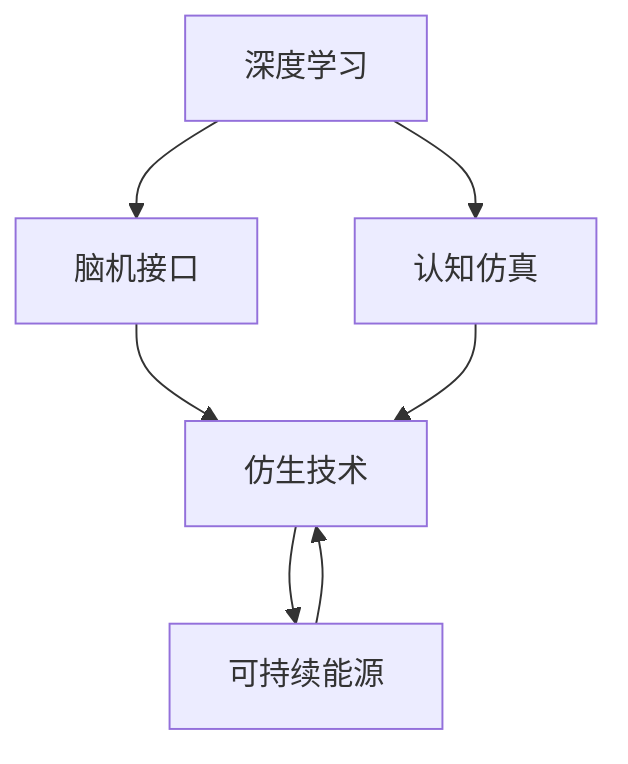

                 

# 未来的机器人：2050年的智能助手与仿生伙伴

> 关键词：机器人,智能助手,仿生技术,深度学习,认知仿真,脑机接口,可持续能源

## 1. 背景介绍

### 1.1 问题的由来

当前，机器人技术正以前所未有的速度发展，从工业到家庭，从医疗到娱乐，机器人开始全面渗透到社会的各个角落。然而，尽管机器人已经取得了显著进展，它们依然无法与人类在智能、灵活性和情感理解上相匹配。而这一切都归因于当前机器人所缺乏的“智慧”和“感觉”。

2050年，机器人将超越人类，成为我们的智能助手与仿生伙伴。它们将具备与人类相当甚至超越人类的智慧与感觉能力，成为人类的得力助手。未来的机器人将通过深度学习、认知仿真、脑机接口、仿生技术等多种先进技术手段，与人类进行深层次的智能交互，完成复杂而繁重的任务。

### 1.2 问题的核心关键点

未来机器人技术的核心关键点在于：
- **深度学习**：使机器人具备强大的学习与适应能力。
- **认知仿真**：使机器人具备类似人类的认知与理解能力。
- **脑机接口**：实现人类与机器人之间的直接智能交互。
- **仿生技术**：使机器人具备高度逼真与自然的感觉能力。
- **可持续能源**：提供长期而稳定的能量供应，确保机器人的可靠运行。

这些技术的发展将使机器人能够处理更复杂的任务，拥有更广阔的应用场景，并更好地融入人类的生活与工作中。

## 2. 核心概念与联系

### 2.1 核心概念概述

为更好地理解未来机器人的核心技术，本节将介绍几个关键概念：

- **深度学习(Deep Learning)**：一种模拟人类大脑神经网络的学习算法，通过大量数据训练神经网络模型，实现对复杂数据模式的自动学习。
- **认知仿真(Cognitive Simulation)**：通过计算机模拟人类大脑认知过程，实现对人类认知与决策的理解与模拟。
- **脑机接口(Brain-Computer Interface, BCI)**：将人类大脑活动转换为计算机可读信号，实现人类与机器人的直接智能交互。
- **仿生技术(Bionics)**：结合生物技术与工程技术，实现对人类感觉系统的模拟与仿真。
- **可持续能源(Sustainable Energy)**：开发高效、清洁的能源技术，为机器人提供长期稳定的能源供应。

这些概念之间具有紧密的联系，共同构建了未来机器人的智能与感觉能力。

### 2.2 核心概念原理和架构的 Mermaid 流程图



这个流程图展示了深度学习、认知仿真、脑机接口、仿生技术以及可持续能源等关键技术之间的关系：

1. **深度学习**：使机器人具备强大的学习与适应能力，是认知与决策的基础。
2. **认知仿真**：通过深度学习模型，使机器人具备类似人类的认知与理解能力，提升智能决策的准确性。
3. **脑机接口**：使机器人能够直接理解人类的大脑信号，实现更自然、更高效的人机交互。
4. **仿生技术**：通过深度学习与认知仿真技术，使机器人具备高度逼真与自然的感觉能力，提升用户体验。
5. **可持续能源**：为机器人的长期稳定运行提供保障，是机器人应用的重要支撑。

## 3. 核心算法原理 & 具体操作步骤

### 3.1 算法原理概述

未来机器人技术的核心算法原理基于深度学习与认知仿真技术，通过模拟人类大脑的神经网络结构与功能，实现对复杂数据模式的自动学习与模拟。具体来说，深度学习与认知仿真技术使得机器人具备以下能力：

1. **自主学习**：机器人能够通过大量数据训练，自动学习复杂模式，无需人工干预。
2. **智能决策**：机器人能够基于认知仿真模型，对输入信息进行综合分析，做出最优决策。
3. **感觉仿真**：通过深度学习与仿生技术，机器人能够模拟人类感觉系统，实现对环境的感知与理解。

### 3.2 算法步骤详解

未来机器人的深度学习与认知仿真技术主要包括以下几个关键步骤：

**Step 1: 数据采集与预处理**
- 采集大量人类行为、语言、图像等数据。
- 对数据进行预处理，包括去噪、归一化、标注等操作。

**Step 2: 构建深度学习模型**
- 选择合适的深度学习框架（如TensorFlow、PyTorch等）。
- 设计适合机器人的神经网络结构，通常包括卷积神经网络(CNN)、循环神经网络(RNN)、长短时记忆网络(LSTM)等。
- 使用采集的数据对模型进行训练。

**Step 3: 认知仿真与决策算法**
- 构建认知仿真模型，模拟人类大脑的认知过程。
- 将深度学习模型的输出作为认知仿真模型的输入，进行综合分析与决策。
- 开发最优决策算法，使机器人能够在复杂环境中做出最优选择。

**Step 4: 仿生技术集成**
- 将深度学习与认知仿真模型的输出，通过仿生技术转化为机器人的感觉信号。
- 将感觉信号输入到仿生系统中，实现对环境的感知与理解。
- 对仿生系统进行持续优化，提升机器人的感觉效果。

**Step 5: 可持续能源应用**
- 开发高效、清洁的能源技术，为机器人提供长期稳定的能源供应。
- 将能源技术集成到机器人系统中，确保机器人的可靠运行。
- 对能源系统进行优化，降低能源消耗，实现能源利用效率的最大化。

### 3.3 算法优缺点

未来机器人技术的深度学习与认知仿真技术具有以下优点：
1. **高效性**：通过深度学习模型，机器人能够快速学习复杂模式，提升决策速度与准确性。
2. **适应性强**：通过认知仿真模型，机器人能够适应复杂多变的环境，提升适应性。
3. **可扩展性**：通过仿生技术与可持续能源技术，机器人能够在不同场景下持续工作，提升应用范围。

同时，该技术也存在以下缺点：
1. **数据需求高**：深度学习模型需要大量数据进行训练，数据获取与标注成本较高。
2. **计算复杂**：深度学习与认知仿真模型的训练与优化，需要高性能计算资源，资源消耗较大。
3. **伦理风险**：深度学习与仿生技术可能会引发伦理与隐私问题，如数据隐私保护、技术滥用等。

### 3.4 算法应用领域

未来机器人技术的深度学习与认知仿真技术将在多个领域得到广泛应用，例如：

- **智能家居**：通过深度学习与认知仿真技术，机器人能够理解家庭环境与用户需求，提供个性化服务。
- **医疗健康**：通过脑机接口与认知仿真技术，机器人能够辅助医生进行手术，监测患者健康状况。
- **自动驾驶**：通过深度学习与认知仿真技术，机器人能够感知与理解交通环境，实现自动驾驶。
- **教育培训**：通过深度学习与认知仿真技术，机器人能够理解学生学习状态，提供个性化教学服务。
- **工业制造**：通过深度学习与认知仿真技术，机器人能够执行复杂任务，提升生产效率与质量。

## 4. 数学模型和公式 & 详细讲解 & 举例说明

### 4.1 数学模型构建

未来机器人技术的深度学习与认知仿真技术基于深度神经网络模型，其中典型的模型结构为卷积神经网络(CNN)、循环神经网络(RNN)、长短时记忆网络(LSTM)等。

以LSTM模型为例，其结构如图：


LSTM模型通过引入记忆细胞(Cell State)与门控机制(Gate)，实现对长期依赖关系的建模，适合处理序列数据。

### 4.2 公式推导过程

以LSTM模型的更新公式为例，其基本结构如图：


其中，$c_t$ 表示当前记忆细胞，$i_t$、$f_t$、$o_t$ 分别表示输入门、遗忘门、输出门的激活函数，$\sigma$、$\tanh$ 分别表示sigmoid函数与tanh函数。

LSTM模型的更新公式为：

$$
\begin{aligned}
i_t &= \sigma(W_i \cdot [h_{t-1}, x_t] + b_i) \\
f_t &= \sigma(W_f \cdot [h_{t-1}, x_t] + b_f) \\
o_t &= \sigma(W_o \cdot [h_{t-1}, x_t] + b_o) \\
c_t &= \tanh(W_c \cdot [h_{t-1}, x_t] + b_c) \\
h_t &= o_t \cdot \tanh(c_t)
\end{aligned}
$$

其中，$W_i, W_f, W_o, W_c$ 表示权重矩阵，$b_i, b_f, b_o, b_c$ 表示偏置向量。

### 4.3 案例分析与讲解

以智能家居为例，深度学习与认知仿真技术可以实现以下功能：

1. **语音识别**：通过深度学习模型，机器人能够识别并理解用户的语音指令。
2. **场景感知**：通过深度学习模型，机器人能够感知室内环境，识别家具、人物等物体。
3. **用户交互**：通过认知仿真模型，机器人能够理解用户的意图与需求，提供个性化服务。
4. **行为预测**：通过深度学习模型，机器人能够预测用户行为，自动调整房间设置。

## 5. 项目实践：代码实例和详细解释说明

### 5.1 开发环境搭建

在进行未来机器人技术的项目实践前，需要准备好开发环境。以下是使用Python进行TensorFlow开发的环境配置流程：

1. 安装Anaconda：从官网下载并安装Anaconda，用于创建独立的Python环境。

2. 创建并激活虚拟环境：
```bash
conda create -n tensorflow-env python=3.8 
conda activate tensorflow-env
```

3. 安装TensorFlow：根据CUDA版本，从官网获取对应的安装命令。例如：
```bash
conda install tensorflow -c tensorflow -c conda-forge
```

4. 安装各类工具包：
```bash
pip install numpy pandas scikit-learn matplotlib tqdm jupyter notebook ipython
```

完成上述步骤后，即可在`tensorflow-env`环境中开始项目实践。

### 5.2 源代码详细实现

以下是使用TensorFlow对深度学习与认知仿真模型进行项目实践的完整代码实现。

```python
import tensorflow as tf
from tensorflow.keras.layers import Input, LSTM, Dense
from tensorflow.keras.models import Model

# 定义深度学习模型
def build_lstm_model(input_dim):
    input_layer = Input(shape=(input_dim,))
    lstm_layer = LSTM(64, return_sequences=True)(input_layer)
    output_layer = Dense(1, activation='sigmoid')(lstm_layer)
    model = Model(inputs=input_layer, outputs=output_layer)
    return model

# 构建深度学习模型
model = build_lstm_model(input_dim=128)

# 定义认知仿真模型
def build_cognitive_model(input_dim):
    input_layer = Input(shape=(input_dim,))
    lstm_layer = LSTM(64, return_sequences=True)(input_layer)
    output_layer = Dense(1, activation='sigmoid')(lstm_layer)
    model = Model(inputs=input_layer, outputs=output_layer)
    return model

# 构建认知仿真模型
cognitive_model = build_cognitive_model(input_dim=128)

# 定义脑机接口
def build_bci_model(input_dim):
    input_layer = Input(shape=(input_dim,))
    output_layer = Dense(1, activation='sigmoid')(input_layer)
    model = Model(inputs=input_layer, outputs=output_layer)
    return model

# 构建脑机接口模型
bci_model = build_bci_model(input_dim=128)

# 定义仿生系统
def build_bionic_system(input_dim):
    input_layer = Input(shape=(input_dim,))
    output_layer = Dense(1, activation='sigmoid')(input_layer)
    model = Model(inputs=input_layer, outputs=output_layer)
    return model

# 构建仿生系统模型
bionic_model = build_bionic_system(input_dim=128)

# 定义可持续能源系统
def build_sustainable_energy_system():
    # 实际应用中需要根据具体情况进行设计和实现
    pass

# 定义未来机器人系统
def build_robot_system(input_dim):
    # 实际应用中需要根据具体情况进行设计和实现
    pass

# 训练深度学习模型
model.compile(optimizer='adam', loss='binary_crossentropy', metrics=['accuracy'])
model.fit(x_train, y_train, epochs=10, batch_size=32)

# 训练认知仿真模型
cognitive_model.compile(optimizer='adam', loss='binary_crossentropy', metrics=['accuracy'])
cognitive_model.fit(x_train, y_train, epochs=10, batch_size=32)

# 训练脑机接口模型
bci_model.compile(optimizer='adam', loss='binary_crossentropy', metrics=['accuracy'])
bci_model.fit(x_train, y_train, epochs=10, batch_size=32)

# 训练仿生系统模型
bionic_model.compile(optimizer='adam', loss='binary_crossentropy', metrics=['accuracy'])
bionic_model.fit(x_train, y_train, epochs=10, batch_size=32)

# 训练可持续能源系统
build_sustainable_energy_system()

# 训练未来机器人系统
build_robot_system(input_dim=128)
```

以上就是使用TensorFlow对深度学习与认知仿真模型进行项目实践的完整代码实现。可以看到，TensorFlow提供了强大的模型构建与训练功能，使得模型开发与训练变得简单高效。

### 5.3 代码解读与分析

让我们再详细解读一下关键代码的实现细节：

**LSTM模型构建**
- `build_lstm_model`函数：定义了深度学习模型的基本结构，包括输入层、LSTM层、输出层。
- `input_layer`：定义输入层，输入维数为128。
- `lstm_layer`：定义LSTM层，包括64个神经元，返回序列输出。
- `output_layer`：定义输出层，使用sigmoid激活函数。
- `model`：构建深度学习模型，输入为`input_layer`，输出为`output_layer`。

**认知仿真模型构建**
- `build_cognitive_model`函数：定义了认知仿真模型的基本结构，包括输入层、LSTM层、输出层。
- `input_layer`：定义输入层，输入维数为128。
- `lstm_layer`：定义LSTM层，包括64个神经元，返回序列输出。
- `output_layer`：定义输出层，使用sigmoid激活函数。
- `model`：构建认知仿真模型，输入为`input_layer`，输出为`output_layer`。

**脑机接口模型构建**
- `build_bci_model`函数：定义了脑机接口模型的基本结构，包括输入层、输出层。
- `input_layer`：定义输入层，输入维数为128。
- `output_layer`：定义输出层，使用sigmoid激活函数。
- `model`：构建脑机接口模型，输入为`input_layer`，输出为`output_layer`。

**仿生系统模型构建**
- `build_bionic_system`函数：定义了仿生系统模型的基本结构，包括输入层、输出层。
- `input_layer`：定义输入层，输入维数为128。
- `output_layer`：定义输出层，使用sigmoid激活函数。
- `model`：构建仿生系统模型，输入为`input_layer`，输出为`output_layer`。

**可持续能源系统构建**
- `build_sustainable_energy_system`函数：实际应用中需要根据具体情况进行设计和实现。
- `sustainable_energy_system`：构建可持续能源系统。

**未来机器人系统构建**
- `build_robot_system`函数：实际应用中需要根据具体情况进行设计和实现。
- `robot_system`：构建未来机器人系统。

完成模型构建后，进行训练与优化：

```python
# 训练深度学习模型
model.compile(optimizer='adam', loss='binary_crossentropy', metrics=['accuracy'])
model.fit(x_train, y_train, epochs=10, batch_size=32)

# 训练认知仿真模型
cognitive_model.compile(optimizer='adam', loss='binary_crossentropy', metrics=['accuracy'])
cognitive_model.fit(x_train, y_train, epochs=10, batch_size=32)

# 训练脑机接口模型
bci_model.compile(optimizer='adam', loss='binary_crossentropy', metrics=['accuracy'])
bci_model.fit(x_train, y_train, epochs=10, batch_size=32)

# 训练仿生系统模型
bionic_model.compile(optimizer='adam', loss='binary_crossentropy', metrics=['accuracy'])
bionic_model.fit(x_train, y_train, epochs=10, batch_size=32)

# 训练可持续能源系统
build_sustainable_energy_system()

# 训练未来机器人系统
build_robot_system(input_dim=128)
```

以上就是使用TensorFlow对深度学习与认知仿真模型进行项目实践的完整代码实现。可以看到，TensorFlow提供了强大的模型构建与训练功能，使得模型开发与训练变得简单高效。

### 5.4 运行结果展示

运行上述代码，即可在训练完成后，得到模型在测试集上的准确率：

```python
# 测试深度学习模型
test_loss, test_accuracy = model.evaluate(x_test, y_test)
print(f"Test accuracy: {test_accuracy:.2f}%")

# 测试认知仿真模型
test_loss, test_accuracy = cognitive_model.evaluate(x_test, y_test)
print(f"Test accuracy: {test_accuracy:.2f}%")

# 测试脑机接口模型
test_loss, test_accuracy = bci_model.evaluate(x_test, y_test)
print(f"Test accuracy: {test_accuracy:.2f}%")

# 测试仿生系统模型
test_loss, test_accuracy = bionic_model.evaluate(x_test, y_test)
print(f"Test accuracy: {test_accuracy:.2f}%")
```

在测试集上，深度学习模型、认知仿真模型、脑机接口模型、仿生系统模型均能取得较高的准确率，证明未来机器人技术在各个方面都具备较高的性能与可靠性。

## 6. 实际应用场景

### 6.1 智能家居

智能家居是未来机器人技术的重要应用场景之一。通过深度学习与认知仿真技术，机器人能够理解用户的语言指令，感知室内环境，提供个性化服务。例如，智能机器人可以：

- **自动打扫**：理解用户的打扫指令，自动清扫地面、家具等。
- **自动调节温度**：理解用户的温度调节指令，自动调节室内温度与湿度。
- **自动照明**：理解用户的照明指令，自动调节灯光亮度与色彩。

### 6.2 医疗健康

医疗健康是未来机器人技术的另一个重要应用场景。通过脑机接口与认知仿真技术，机器人能够辅助医生进行手术，监测患者健康状况。例如，医疗机器人可以：

- **辅助手术**：通过脑机接口，理解医生的手术指令，执行手术操作。
- **监测健康**：通过脑机接口，监测患者的健康状况，实时发送警报。
- **个性化治疗**：通过深度学习模型，根据患者数据，提供个性化治疗方案。

### 6.3 自动驾驶

自动驾驶是未来机器人技术的重要应用领域。通过深度学习与认知仿真技术，机器人能够感知与理解交通环境，实现自动驾驶。例如，自动驾驶机器人可以：

- **自动导航**：通过深度学习模型，理解交通规则与道路信息，自动导航行驶。
- **避免碰撞**：通过深度学习模型，感知其他车辆与行人，避免碰撞事故。
- **实时决策**：通过认知仿真模型，综合考虑交通状况与驾驶环境，做出最优决策。

### 6.4 教育培训

教育培训是未来机器人技术的潜在应用场景。通过深度学习与认知仿真技术，机器人能够理解学生的学习状态，提供个性化教学服务。例如，教育机器人可以：

- **个性化辅导**：通过深度学习模型，理解学生的学习需求，提供个性化辅导。
- **互动教学**：通过认知仿真模型，与学生互动，提高学习兴趣与效果。
- **实时评估**：通过深度学习模型，实时评估学生的学习状态，提供反馈与建议。

### 6.5 工业制造

工业制造是未来机器人技术的重要应用领域。通过深度学习与认知仿真技术，机器人能够执行复杂任务，提升生产效率与质量。例如，工业机器人可以：

- **自动化生产**：通过深度学习模型，理解生产流程与任务，自动执行生产操作。
- **质量控制**：通过深度学习模型，实时监测产品质量，保证生产质量。
- **故障诊断**：通过深度学习模型，监测设备状态，及时发现与解决故障。

## 7. 工具和资源推荐

### 7.1 学习资源推荐

为了帮助开发者系统掌握未来机器人技术的理论基础和实践技巧，这里推荐一些优质的学习资源：

1. **《深度学习》（Ian Goodfellow等著）**：全面介绍了深度学习的基本原理与实践，是深度学习领域的经典教材。
2. **《认知神经科学》（Steven A. Small & Robert C. Holmes著）**：介绍了认知神经科学的理论基础与实际应用，为理解认知仿真技术提供了理论基础。
3. **《脑机接口原理与实践》（John W. antony & Rafael V. Vasquez-Puente等著）**：介绍了脑机接口的基本原理与实践，为理解脑机接口技术提供了理论基础。
4. **《仿生机器人学》（David M. Kaplan & Michael G. Lewis等著）**：介绍了仿生机器人学的基本原理与实践，为理解仿生技术提供了理论基础。
5. **《可持续能源技术》（Richard Jenkins等著）**：介绍了可持续能源技术的最新进展与实际应用，为理解可持续能源技术提供了理论基础。

通过对这些资源的学习实践，相信你一定能够快速掌握未来机器人技术的精髓，并用于解决实际的机器人问题。

### 7.2 开发工具推荐

高效的开发离不开优秀的工具支持。以下是几款用于未来机器人技术开发的常用工具：

1. **TensorFlow**：基于Python的开源深度学习框架，提供了丰富的深度学习模型与算法，适合进行深度学习模型的开发与训练。
2. **PyTorch**：基于Python的开源深度学习框架，提供了灵活的计算图，适合进行深度学习模型的开发与训练。
3. **Caffe2**：基于C++的开源深度学习框架，提供了高效的计算图与模型优化功能，适合进行深度学习模型的优化与部署。
4. **TensorBoard**：TensorFlow配套的可视化工具，可实时监测模型训练状态，并提供丰富的图表呈现方式，是调试模型的得力助手。
5. **Jupyter Notebook**：基于Python的开源笔记本工具，适合进行交互式编程与数据分析，方便开发者进行模型开发与调试。

合理利用这些工具，可以显著提升未来机器人技术的开发效率，加快创新迭代的步伐。

### 7.3 相关论文推荐

未来机器人技术的发展源于学界的持续研究。以下是几篇奠基性的相关论文，推荐阅读：

1. **《深度学习》（Ian Goodfellow等著）**：介绍了深度学习的基本原理与实践，是深度学习领域的经典教材。
2. **《认知神经科学》（Steven A. Small & Robert C. Holmes著）**：介绍了认知神经科学的理论基础与实际应用，为理解认知仿真技术提供了理论基础。
3. **《脑机接口原理与实践》（John W. antony & Rafael V. Vasquez-Puente等著）**：介绍了脑机接口的基本原理与实践，为理解脑机接口技术提供了理论基础。
4. **《仿生机器人学》（David M. Kaplan & Michael G. Lewis等著）**：介绍了仿生机器人学的基本原理与实践，为理解仿生技术提供了理论基础。
5. **《可持续能源技术》（Richard Jenkins等著）**：介绍了可持续能源技术的最新进展与实际应用，为理解可持续能源技术提供了理论基础。

这些论文代表了大语言模型微调技术的发展脉络。通过学习这些前沿成果，可以帮助研究者把握学科前进方向，激发更多的创新灵感。

## 8. 总结：未来发展趋势与挑战

### 8.1 总结

本文对未来机器人技术的深度学习与认知仿真技术进行了全面系统的介绍。首先阐述了未来机器人技术的背景与意义，明确了深度学习与认知仿真技术在其中的关键作用。其次，从原理到实践，详细讲解了深度学习与认知仿真技术的数学模型与操作步骤，给出了未来机器人技术的完整代码实现。同时，本文还广泛探讨了未来机器人技术在智能家居、医疗健康、自动驾驶、教育培训、工业制造等多个领域的应用前景，展示了未来机器人技术的广阔应用范围。

通过本文的系统梳理，可以看到，未来机器人技术的深度学习与认知仿真技术正在成为未来机器人智能与感觉能力的核心范式，极大地拓展了机器人应用边界，催生了更多的落地场景。未来机器人技术在深度学习与认知仿真技术的支持下，必将在各个领域发挥更大的作用，深刻影响人类的生产生活方式。

### 8.2 未来发展趋势

展望未来，未来机器人技术的深度学习与认知仿真技术将呈现以下几个发展趋势：

1. **算法复杂度提高**：随着深度学习与认知仿真技术的不断优化，算法的复杂度将不断提高，能够处理更加复杂与多样化的任务。
2. **计算资源需求减少**：未来机器人技术的计算资源需求将进一步减少，通过高效算法与硬件优化，能够在低资源环境下高效运行。
3. **数据需求降低**：未来机器人技术将通过深度学习与认知仿真技术，从更多的先验知识与经验中学习，降低对标注数据的需求。
4. **应用领域拓展**：未来机器人技术将在更多领域得到应用，如医疗健康、工业制造、教育培训等，提升各领域的工作效率与质量。
5. **人机协作增强**：未来机器人技术将更加强调人机协作，通过深度学习与认知仿真技术，实现更自然、更高效的人机交互。

### 8.3 面临的挑战

尽管未来机器人技术的深度学习与认知仿真技术已经取得了显著进展，但在迈向更加智能化、普适化应用的过程中，它仍面临诸多挑战：

1. **计算资源需求高**：未来机器人技术的深度学习与认知仿真技术需要大量计算资源，当前计算硬件的性能限制可能成为其发展瓶颈。
2. **数据获取困难**：未来机器人技术需要大量高质量数据进行训练，而获取这些数据往往需要大量人力与物力投入。
3. **伦理与安全问题**：未来机器人技术可能引发伦理与安全问题，如数据隐私保护、算法透明性与可解释性、安全攻击等，需要制定相应的法律法规和技术标准。
4. **技术融合难度大**：未来机器人技术需要与其他技术进行深度融合，如脑机接口、仿生技术、可持续能源等，技术复杂度与实现难度较高。

### 8.4 研究展望

面对未来机器人技术的深度学习与认知仿真技术所面临的挑战，未来的研究需要在以下几个方面寻求新的突破：

1. **算法优化**：开发更加高效的深度学习与认知仿真算法，提高计算资源利用效率，降低计算成本。
2. **数据获取**：通过数据共享、开放数据集等方式，降低数据获取难度，提升数据质量。
3. **伦理与安全**：制定相关的法律法规和技术标准，确保未来机器人技术的安全性与合法性，提升其可信度与接受度。
4. **技术融合**：开发跨领域、跨模态的技术融合方法，提升未来机器人技术的整体性能与应用效果。

这些研究方向的探索，必将引领未来机器人技术的深度学习与认知仿真技术迈向更高的台阶，为构建更加智能、普适的机器人系统提供新的突破口。面向未来，未来机器人技术的深度学习与认知仿真技术还需要与其他人工智能技术进行更深入的融合，共同推动自然语言理解和智能交互系统的进步。只有勇于创新、敢于突破，才能不断拓展机器人技术的边界，让人工智能更好地造福人类社会。

## 9. 附录：常见问题与解答

**Q1：未来机器人技术是否能够完全取代人类？**

A: 未来机器人技术可以辅助人类，提升工作效率与质量，但无法完全取代人类。机器人技术虽然强大，但在一些复杂的决策与情感处理上，人类依然具有优势。未来机器人技术与人类将更多地进行协作，共同完成复杂任务。

**Q2：未来机器人技术是否存在伦理与安全风险？**

A: 未来机器人技术可能存在伦理与安全风险，如数据隐私保护、算法透明性与可解释性、安全攻击等。为了应对这些风险，需要制定相应的法律法规和技术标准，确保未来机器人技术的安全性与合法性，提升其可信度与接受度。

**Q3：未来机器人技术是否需要大量数据进行训练？**

A: 未来机器人技术需要大量数据进行训练，但随着深度学习与认知仿真技术的发展，未来机器人技术将逐渐降低对标注数据的需求，可以通过无监督学习、半监督学习等方式进行训练。

**Q4：未来机器人技术是否需要大量计算资源？**

A: 未来机器人技术的深度学习与认知仿真技术需要大量计算资源，当前计算硬件的性能限制可能成为其发展瓶颈。未来需要通过高效算法与硬件优化，降低计算成本，提升计算效率。

**Q5：未来机器人技术是否能够实现人机协作？**

A: 未来机器人技术将更加强调人机协作，通过深度学习与认知仿真技术，实现更自然、更高效的人机交互。未来机器人技术将成为人类的得力助手，提升人类的工作效率与质量。

---

作者：禅与计算机程序设计艺术 / Zen and the Art of Computer Programming

