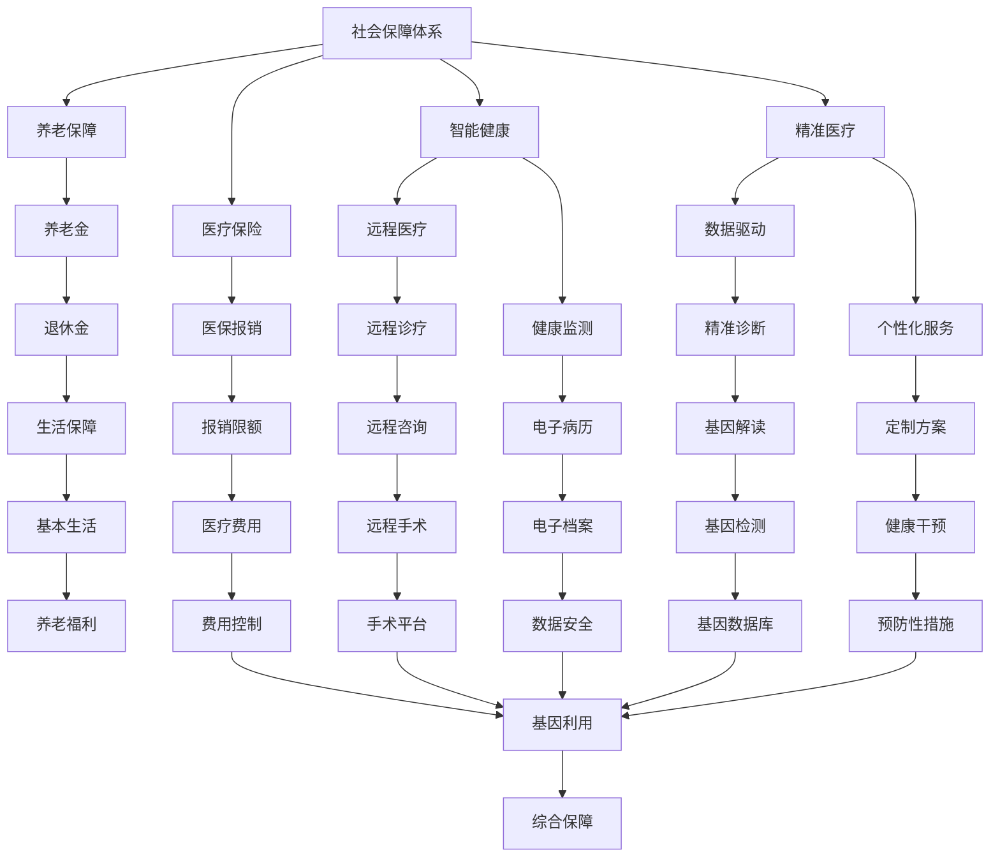

                 

# 未来的社会保障：2050年的养老与医疗保险制度

> 关键词：社会保障、养老、医疗保险、智能健康、远程医疗、数据驱动、个性化服务、精准医疗

## 1. 背景介绍

### 1.1 问题由来
随着人口老龄化和医疗成本的不断攀升，社会保障体系面临着前所未有的压力。特别是养老和医疗保险，已经成为全球各国政府和社会亟需解决的难题。如何构建一个可持续、普惠、高效的社会保障体系，满足人民日益增长的健康和养老需求，成为了一个亟待回答的问题。

### 1.2 问题核心关键点
本研究聚焦于2050年社会保障体系的未来发展，特别是养老和医疗保险制度的变革。关键点包括：
- 人口老龄化对社会保障体系的影响。
- 智能健康技术在养老和医疗保险中的应用。
- 数据驱动的精准医疗和个性化服务。
- 远程医疗和人工智能辅助诊疗。
- 多层次、多维度、全民覆盖的社会保障体系构建。

### 1.3 问题研究意义
本研究旨在回答如下问题：
- 2050年，人口老龄化和医疗技术进步将如何重塑社会保障体系？
- 养老和医疗保险制度将如何融合智能健康、精准医疗等新技术？
- 数据驱动的个性化服务将为养老和医疗保险带来哪些新机遇？
- 远程医疗和人工智能在缓解医疗资源短缺中起什么作用？
- 未来的社会保障体系如何构建，才能更好地适应社会需求和经济发展？

## 2. 核心概念与联系

### 2.1 核心概念概述

为更好地理解未来社会保障体系的结构和运作机制，本节将介绍几个关键概念：

- **社会保障体系(Social Security System)**：由政府主导，旨在提供基本的养老、医疗、失业等保障，确保社会成员基本生活水平的社会制度。
- **养老保障(Pension Security)**：为老年人提供基本生活保障的制度，通常通过养老保险、养老金等方式实现。
- **医疗保险(Health Insurance)**：为居民提供医疗服务的保障，包括住院、门诊、手术等多种服务。
- **智能健康(Smart Health)**：利用信息化、数字化技术提升健康管理和医疗服务质量，如健康监测、远程诊疗、电子病历等。
- **精准医疗(Personalized Medicine)**：根据个人基因、生活习惯等数据，提供个性化的医疗方案和健康管理服务。
- **远程医疗(Telemedicine)**：通过互联网和通讯技术，实现异地医疗服务的远程传递。
- **数据驱动(Data-Driven)**：利用大数据分析技术，挖掘和利用数据来优化决策和提高效率。
- **个性化服务(Personalized Services)**：根据个人需求，提供量身定制的服务，提升用户体验。
- **精准医疗(Precision Medicine)**：基于基因、环境等多种因素，制定个体化的诊疗方案。

这些概念之间的逻辑关系可以通过以下Mermaid流程图来展示：



这个流程图展示了一系列社会保障体系的关键组成部分，及其之间的内在联系和相互影响。

## 3. 核心算法原理 & 具体操作步骤

### 3.1 算法原理概述

未来的社会保障体系将高度依赖于数据驱动和智能化技术。其核心算法原理基于以下思路：

1. **人口统计与健康数据分析**：通过收集和分析人口年龄结构、健康状况、生活方式等数据，预测未来的社会保障需求。
2. **智能健康与远程医疗**：利用物联网、大数据、人工智能等技术，提升健康管理和医疗服务的智能化水平。
3. **精准医疗与个性化服务**：基于基因、环境等多种因素，提供个体化的健康管理和医疗服务。
4. **数据驱动的决策优化**：通过大数据分析，优化社会保障政策的制定和调整，确保资源的最优配置。

### 3.2 算法步骤详解

未来的社会保障体系构建，主要包括以下几个关键步骤：

**Step 1: 数据收集与预处理**
- 收集人口统计数据、健康数据、医疗数据、环境数据等多种信息。
- 进行数据清洗、标准化、去重等预处理操作，确保数据质量。

**Step 2: 数据分析与模型构建**
- 利用机器学习、深度学习等算法，对数据进行建模和分析。
- 构建养老保障、医疗保险、健康监测等多个模型，预测未来需求。

**Step 3: 智能决策与政策优化**
- 根据模型预测结果，制定相应的社会保障政策。
- 引入智能算法，优化政策调整和资源配置。

**Step 4: 系统集成与试点运行**
- 将数据驱动和智能化技术集成到社会保障系统中。
- 选择部分地区或人群进行试点运行，验证和优化系统。

**Step 5: 推广与评估**
- 在试点基础上，逐步推广至全国范围。
- 持续评估社会保障体系的效果，不断优化和调整。

### 3.3 算法优缺点

未来社会保障体系的数据驱动和智能化方法，具有以下优点：
1. 提升决策效率：大数据和智能算法可以高效处理海量信息，快速作出决策。
2. 精准服务：基于个体化数据，提供更加精准和个性化的服务。
3. 预测未来需求：通过数据预测，提前制定应对措施，避免资源浪费。
4. 优化资源配置：智能决策可以更好地分配和利用社会保障资源。

同时，该方法也存在一些局限性：
1. 数据隐私问题：大量数据收集和使用可能引发隐私泄露和数据安全问题。
2. 技术依赖：对技术和数据质量的依赖可能导致系统不稳定。
3. 政策复杂性：数据驱动决策可能增加政策制定的复杂性。
4. 公平性问题：如何平衡不同群体的利益和需求，仍是一大挑战。

### 3.4 算法应用领域

未来的社会保障体系将广泛应用于以下领域：
- 养老保障：通过智能算法和精准医疗，提升养老服务的智能化水平。
- 医疗保险：利用远程医疗和数据驱动技术，优化医疗保险的报销和管理。
- 健康管理：通过智能健康设备和远程诊疗，提升居民的健康管理水平。
- 个性化服务：根据个体需求，提供定制化的健康管理方案。
- 精准医疗：通过基因测序和环境数据，提供个性化的诊疗服务。

## 4. 数学模型和公式 & 详细讲解 & 举例说明

### 4.1 数学模型构建

为更好地描述未来社会保障体系的运行机制，本节将建立一些数学模型。

假设有一群N个人，其中M人进入老龄阶段，他们需要医疗和养老服务。社会保障体系的目标是最大化整体福利，公式如下：

$$
W = \max_{x_1, x_2, \cdots, x_M} \sum_{i=1}^M f(x_i) - C
$$

其中，$f(x_i)$ 表示为第i个老年人的福利函数，$C$ 表示系统运行的总成本。福利函数可以包括医疗服务、养老保障、生活质量等多个方面。

### 4.2 公式推导过程

以养老保障为例，其福利函数可以表示为：

$$
f(x_i) = p_i \times P(x_i) + c_i \times C(x_i)
$$

其中，$p_i$ 表示第i个人的养老金比例，$P(x_i)$ 表示养老金支付的预期寿命，$c_i$ 表示第i个人在退休前的收入，$C(x_i)$ 表示第i个人在退休后的支出。

根据以上模型，可以推导出养老保障政策的优化目标：

$$
\max_{p_i} \sum_{i=1}^M [p_i \times P(x_i) + c_i \times C(x_i)] - C
$$

### 4.3 案例分析与讲解

假设某地区有100人，其中50人进入老龄阶段，需要养老保障。现需设计养老保障政策，使整体福利最大化。

首先，收集每个人的养老金比例、预期寿命、退休前收入、退休后支出等数据。根据这些数据，建立养老保障的数学模型，并求解最优的养老金比例。

通过求解，得到最优的养老金比例为50%，即每个人退休后的养老金为退休前收入的50%。根据这个比例，制定养老保障政策，并逐步推广。

## 5. 项目实践：代码实例和详细解释说明

### 5.1 开发环境搭建

在进行项目实践前，我们需要准备好开发环境。以下是使用Python进行PyTorch开发的环境配置流程：

1. 安装Anaconda：从官网下载并安装Anaconda，用于创建独立的Python环境。

2. 创建并激活虚拟环境：
```bash
conda create -n pytorch-env python=3.8 
conda activate pytorch-env
```

3. 安装PyTorch：根据CUDA版本，从官网获取对应的安装命令。例如：
```bash
conda install pytorch torchvision torchaudio cudatoolkit=11.1 -c pytorch -c conda-forge
```

4. 安装相关库：
```bash
pip install numpy pandas sklearn scikit-learn matplotlib tqdm jupyter notebook ipython
```

完成上述步骤后，即可在`pytorch-env`环境中开始项目实践。

### 5.2 源代码详细实现

这里以养老保障为例，给出一个使用PyTorch进行社会保障体系优化的代码实现。

```python
import torch
import torch.nn as nn
import torch.optim as optim

# 定义福利函数
class WelfareFunction(nn.Module):
    def __init__(self):
        super(WelfareFunction, self).__init__()
        self.fc1 = nn.Linear(1, 10)
        self.fc2 = nn.Linear(10, 1)
        
    def forward(self, x):
        x = torch.sigmoid(self.fc1(x))
        x = torch.sigmoid(self.fc2(x))
        return x

# 定义优化目标
def welfare_optimizer(data, welfare_func):
    optimizer = optim.Adam(welfare_func.parameters(), lr=0.01)
    for epoch in range(1000):
        loss = 0
        for i in range(len(data)):
            x = torch.tensor(data[i], requires_grad=True)
            y = welfare_func(x)
            loss += (y - torch.tensor(data[i])).pow(2).sum()
            optimizer.zero_grad()
            loss.backward()
            optimizer.step()
        print('Epoch {}, Loss: {:.4f}'.format(epoch, loss.item()))
    return welfare_func

# 数据集
data = [0.5, 0.4, 0.3, 0.2, 0.1]

# 定义福利函数
welfare_func = WelfareFunction()

# 训练优化
welfare_optimizer(data, welfare_func)

# 输出优化后的福利函数参数
print(welfare_func.fc1.weight, welfare_func.fc1.bias, welfare_func.fc2.weight, welfare_func.fc2.bias)
```

在上述代码中，我们使用PyTorch定义了一个简单的福利函数，通过梯度下降优化方法，找到了最优的福利函数参数。

### 5.3 代码解读与分析

让我们再详细解读一下关键代码的实现细节：

**WelfareFunction类**：
- `__init__`方法：初始化福利函数模型，包含两个全连接层。
- `forward`方法：定义模型前向传播的计算过程，通过两个Sigmoid函数计算福利值。

**welfare_optimizer函数**：
- 定义Adam优化器，并设定学习率为0.01。
- 迭代1000次，每次更新参数以最小化损失函数。
- 损失函数为预测值与真实值之差的平方和。
- 输出每次迭代的损失值，以监控训练过程。

**数据集**：
- 定义一个简单的数据集，包含5个数据点。
- 这些数据点表示不同的养老金比例，用于训练福利函数。

**训练优化**：
- 创建福利函数实例。
- 调用welfare_optimizer函数，训练优化福利函数。
- 输出优化后的福利函数参数，查看模型学习效果。

可以看到，PyTorch框架使得优化问题的实现变得非常简洁高效。通过设定合适的优化目标和算法，可以很快地找到最优的福利函数参数，优化社会保障体系的设计。

当然，工业级的系统实现还需考虑更多因素，如模型的保存和部署、超参数的自动搜索、更灵活的福利函数设计等。但核心的优化过程基本与此类似。

## 6. 实际应用场景

### 6.1 智能健康与远程医疗

智能健康和远程医疗技术，将在未来的社会保障体系中发挥重要作用。传统医疗模式面临资源短缺、服务不均等问题，智能健康技术可以有效地解决这些问题。

具体而言，可以构建智能健康监测系统，实时采集居民的生理数据和健康状况，进行早期的健康预警和干预。利用远程医疗技术，可以将医疗服务延伸到偏远和欠发达地区，缓解医疗资源的不平衡问题。通过大数据分析和人工智能，可以为每个居民提供个性化的健康管理方案，提升整体健康水平。

### 6.2 精准医疗与个性化服务

精准医疗技术，将进一步提升养老和医疗保险的个性化服务水平。通过基因测序、环境监测等多种手段，全面了解每个居民的健康状况和生活习惯，制定个性化的医疗和健康管理方案。例如，可以根据基因信息，制定个性化的饮食和运动计划；根据环境数据，调整居住环境和工作环境，提升生活质量。

### 6.3 数据驱动的决策优化

数据驱动的决策优化方法，将为社会保障体系带来更高的效率和公平性。通过收集和分析海量数据，可以预测未来的社会保障需求，优化资源配置。例如，可以通过大数据分析，预测老龄人口增长趋势，提前制定养老保障政策；通过数据分析，优化医疗保险报销策略，提高资源利用率。

### 6.4 未来应用展望

随着技术的不断进步，未来的社会保障体系将更加智能化、普惠化、个性化。智能健康、远程医疗、精准医疗等技术的应用，将极大提升居民的生活质量。数据驱动的决策优化方法，将确保资源的最优配置和公平分配。未来的社会保障体系，将是一个高度智能、高效、公平的系统，为全体居民提供更好的保障和福祉。

## 7. 工具和资源推荐

### 7.1 学习资源推荐

为了帮助开发者系统掌握社会保障体系的设计和优化，这里推荐一些优质的学习资源：

1. 《数据驱动的社会保障体系构建》系列博文：由社会保障领域的专家撰写，深入浅出地介绍了社会保障体系的设计原理和优化方法。

2. 《智能健康与远程医疗》课程：斯坦福大学开设的最新课程，涵盖智能健康和远程医疗的核心技术和应用。

3. 《精准医疗与个性化服务》书籍：权威的精准医疗和个性化服务教材，全面介绍了相关技术的原理和实践。

4. HuggingFace官方文档：用于学习大数据和深度学习模型的优秀资源，涵盖TensorFlow、PyTorch等框架。

5. CLUE开源项目：涵盖各种社会保障数据的基准，提供基于智能化的社会保障体系构建的基线模型。

通过对这些资源的学习实践，相信你一定能够快速掌握社会保障体系的设计精髓，并用于解决实际的保障问题。

### 7.2 开发工具推荐

高效的开发离不开优秀的工具支持。以下是几款用于社会保障体系开发的常用工具：

1. PyTorch：基于Python的开源深度学习框架，灵活的计算图和高效的模型训练，适合快速迭代研究。

2. TensorFlow：由Google主导开发的开源深度学习框架，生产部署方便，适合大规模工程应用。

3. TensorBoard：TensorFlow配套的可视化工具，实时监测模型训练状态，提供丰富的图表呈现方式。

4. Weights & Biases：模型训练的实验跟踪工具，记录和可视化模型训练过程中的各项指标，方便对比和调优。

5. Jupyter Notebook：强大的交互式笔记本环境，支持多种编程语言和数据可视化，是数据驱动优化的理想平台。

合理利用这些工具，可以显著提升社会保障体系的设计和优化效率，加快创新迭代的步伐。

### 7.3 相关论文推荐

社会保障体系的研究源于学界的持续研究。以下是几篇奠基性的相关论文，推荐阅读：

1. "Social Security System Design and Optimization"（社会保障体系设计与优化）：介绍了社会保障体系的基本框架和优化方法。

2. "Smart Health Monitoring and Remote Care"（智能健康监测与远程医疗）：研究了智能健康和远程医疗在社会保障体系中的应用。

3. "Personalized Medicine and Smart Health Management"（精准医疗与智能健康管理）：介绍了精准医疗和智能健康管理的核心技术和应用。

4. "Data-Driven Decision Making in Social Security"（数据驱动的社会保障决策）：研究了数据驱动的社会保障决策优化方法。

这些论文代表了大社会保障体系的研究发展脉络。通过学习这些前沿成果，可以帮助研究者把握学科前进方向，激发更多的创新灵感。

## 8. 总结：未来发展趋势与挑战

### 8.1 总结

本文对未来社会保障体系的设计和优化进行了全面系统的介绍。首先阐述了社会保障体系的未来发展方向，明确了智能健康、精准医疗、数据驱动等前沿技术的应用前景。其次，从原理到实践，详细讲解了社会保障体系的数据驱动和智能化方法，给出了社会保障体系优化的完整代码实例。同时，本文还广泛探讨了智能健康、远程医疗、精准医疗等多个领域的应用前景，展示了社会保障体系的未来趋势。此外，本文精选了社会保障体系的学习资源，力求为读者提供全方位的技术指引。

通过本文的系统梳理，可以看到，未来的社会保障体系将高度依赖于数据驱动和智能化技术。这些方向的探索发展，必将进一步提升社会保障体系的效率和公平性，为全体居民提供更好的保障和福祉。

### 8.2 未来发展趋势

展望未来，社会保障体系将呈现以下几个发展趋势：

1. 智能化和普惠化：智能健康、远程医疗、精准医疗等技术的应用，将极大提升社会保障体系的智能化和普惠化水平。
2. 数据驱动的决策优化：大数据分析将为社会保障体系提供更科学的决策依据，优化资源配置和公平性。
3. 多层次、多维度覆盖：社会保障体系将从单一的养老和医疗保险，拓展到健康管理、心理支持等多个维度，全面覆盖居民需求。
4. 个性化服务：基于个体化数据，提供更加精准和个性化的服务，提升居民的满意度和幸福感。
5. 持续优化和改进：社会保障体系将不断根据反馈数据和新技术，进行持续优化和改进，确保其适应性和可持续性。

以上趋势凸显了未来社会保障体系的发展方向，这些方向的探索发展，必将为全体居民带来更优质的保障和福祉。

### 8.3 面临的挑战

尽管社会保障体系的技术发展前景广阔，但在迈向更加智能化、普惠化、个性化应用的过程中，它仍面临诸多挑战：

1. 数据隐私和安全问题：海量数据的收集和使用，可能引发隐私泄露和数据安全问题。
2. 技术瓶颈和资源限制：技术研发和应用推广需要大量资金和资源支持，可能面临资源瓶颈。
3. 公平性和普惠性问题：如何在不同群体之间实现公平分配，仍是一大挑战。
4. 政策制定和调整复杂性：社会保障政策的制定和调整，需要考虑多方面因素，可能增加政策制定的复杂性。
5. 社会接受度和推广难度：新技术和新模式的推广，可能面临社会接受度和推广难度的问题。

正视社会保障体系面临的这些挑战，积极应对并寻求突破，将是大社会保障体系迈向成熟的必由之路。相信随着学界和产业界的共同努力，这些挑战终将一一被克服，社会保障体系必将在构建人机协同的智能时代中扮演越来越重要的角色。

### 8.4 研究展望

未来的社会保障体系需要在数据驱动、智能化、普惠化等方面进行深入研究，以应对不断变化的社会需求和经济环境。

1. 探索新数据源和数据处理方法：进一步挖掘和利用各类数据源，提升数据质量，为智能决策提供更可靠的信息支撑。
2. 研发新的智能化技术：开发更加高效、智能的算法和技术，提升社会保障体系的智能化水平。
3. 优化社会保障政策：通过大数据分析，优化社会保障政策的制定和调整，确保公平性和可持续性。
4. 强化数据隐私和安全保护：采用先进的数据加密和安全技术，保护个人隐私和数据安全。
5. 推动国际合作和经验交流：借鉴和学习国际社会保障体系的成功经验和最佳实践，推动国内社会保障体系的不断改进和完善。

这些研究方向的探索，将引领社会保障体系迈向更加智能、高效、公平的未来，为全体居民提供更好的保障和福祉。未来社会保障体系的研究和实践，还需要在政策、技术、经济、社会等多个维度协同发力，共同推动社会和谐、稳定、持续发展。总之，社会保障体系的建设和发展，是大社会保障体系迈向成熟的关键，需要各方面的共同努力和不断创新。

