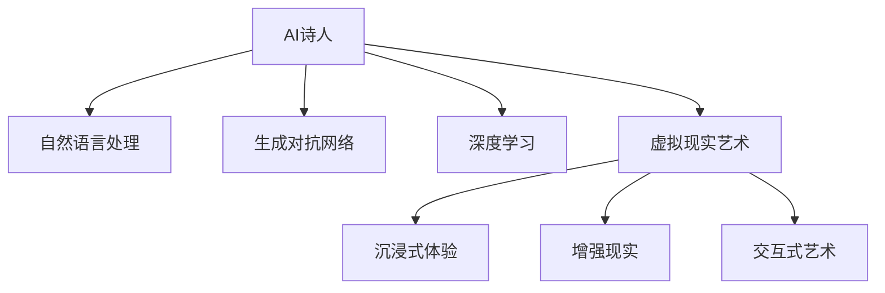

                 

# 未来的艺术创作：2050年的AI诗人与虚拟现实艺术

## 1. 背景介绍

在2050年，人工智能已经融入人类生活的方方面面。尤其是在艺术创作领域，AI和虚拟现实技术的结合，让艺术创作迈入了一个崭新的时代。AI诗人、虚拟现实艺术馆、AI与人类共同创作的互动作品，已经成为这个时代独特的风景线。本文将深入探讨这些前沿技术的发展现状及其未来趋势，带领读者预见2050年的艺术创作未来。

## 2. 核心概念与联系

### 2.1 核心概念概述

为更好地理解AI诗人与虚拟现实艺术的概念，我们首先介绍几个关键技术：

- **AI诗人**：基于自然语言处理(NLP)、生成对抗网络(GAN)、深度学习等技术的创作工具，能够自动生成具有一定文学价值的诗歌和文本作品。
- **虚拟现实(VR)**：利用计算机图形技术，创建一个沉浸式的虚拟环境，用户可以通过VR头盔和控制器进入其中，进行交互式体验。
- **增强现实(AR)**：结合虚拟信息和现实世界，提供更具沉浸感的交互体验。
- **交互式艺术**：指用户与艺术作品进行实时交互，作品内容会根据用户的动作或情感反馈动态生成和变化的艺术形式。

这些核心概念之间的关系可以通过以下Mermaid流程图来展示：



### 2.2 核心概念原理和架构

**自然语言处理(NLP)**：通过分析、理解和生成语言，使计算机能够理解和处理人类语言。主要包括语言模型、文本分类、机器翻译、文本生成等技术。

**生成对抗网络(GAN)**：一种训练神经网络的方法，由两个模型（生成器和判别器）组成，通过对抗训练产生高质量的生成样本，常用于图像生成、音频生成等。

**深度学习**：一类基于多层神经网络的机器学习算法，在图像识别、语音识别、自然语言处理等领域有广泛应用。常用的深度学习模型包括卷积神经网络(CNN)、循环神经网络(RNN)、变分自编码器(VE)等。

**虚拟现实(VR)**：利用计算机生成逼真的三维图像和音效，结合头显、控制器等硬件设备，为用户提供沉浸式的视觉和听觉体验。

**增强现实(AR)**：将数字信息叠加在现实世界的图像上，通过摄像头和传感器识别现实场景，动态添加虚拟信息，增强用户的现实感知。

**交互式艺术**：通过传感器捕捉用户的输入，如手势、语音、表情等，动态改变艺术作品的表现形式，增强用户的参与感和互动体验。

## 3. 核心算法原理 & 具体操作步骤

### 3.1 算法原理概述

AI诗人的创作原理基于文本生成技术，包括文本生成模型、语言模型、深度学习等。其核心在于通过训练神经网络模型，使其能够理解语言的语法和语义规则，并根据特定的输入生成符合语法和语义规则的文本。而虚拟现实艺术则利用计算机图形技术和用户交互技术，创造出一个逼真的虚拟环境，使艺术作品可以与用户进行互动。

### 3.2 算法步骤详解

**AI诗人创作步骤**：

1. **数据收集**：收集大量的诗歌、文学作品作为训练数据，涵盖不同风格、主题和语言特点。
2. **模型训练**：使用深度学习模型，如LSTM、Transformer等，对文本数据进行训练，学习语言结构和语义信息。
3. **诗歌生成**：输入用户提供的主题、情感或关键词，生成符合语法和语义规则的诗歌。
4. **优化调整**：根据用户反馈和评价，不断优化模型参数，提升生成的诗歌质量。

**虚拟现实艺术创作步骤**：

1. **场景设计**：设计虚拟艺术场景，包括环境、角色、交互元素等。
2. **模型训练**：使用深度学习技术，如卷积神经网络、生成对抗网络等，生成虚拟场景中的物体和角色。
3. **交互设计**：设计用户交互方式，如手势、语音、表情等，实现用户与虚拟环境的互动。
4. **用户体验优化**：收集用户反馈，不断优化虚拟场景和交互体验。

### 3.3 算法优缺点

**AI诗人的优点**：

- **高效率**：自动生成诗歌，极大提高了创作效率。
- **创新性**：能够生成具有一定创新性的文本，拓宽了创作思路。
- **多样性**：生成不同风格、主题和语言的诗歌，满足多样化的需求。

**AI诗人的缺点**：

- **缺乏深度**：生成的诗歌可能缺乏作者的深度情感和思想。
- **生成质量不稳定**：不同时间的生成质量可能有所波动。
- **版权问题**：自动生成的文本可能涉及版权争议。

**虚拟现实艺术的优点**：

- **沉浸感**：提供沉浸式的艺术体验，增强用户的参与感。
- **互动性**：支持用户与艺术作品的实时互动，提升艺术作品的互动性。
- **多样性**：支持不同类型的艺术创作和展示形式。

**虚拟现实艺术的缺点**：

- **成本高**：开发和部署虚拟现实艺术作品需要较高的硬件和软件投入。
- **技术门槛高**：需要较高的技术水平和专业技能。
- **用户体验差异**：不同用户的设备和技术水平可能影响体验。

### 3.4 算法应用领域

AI诗人和虚拟现实艺术在多个领域得到了广泛应用：

- **教育领域**：AI诗人可以辅助文学教学，生成大量的诗歌和文本材料；虚拟现实艺术可用于历史和文化教育，提供沉浸式的历史场景体验。
- **娱乐领域**：AI诗人可以生成用于游戏、电影和音乐创作的音乐和歌词；虚拟现实艺术可用于电影、游戏和主题公园，提供互动式的娱乐体验。
- **医疗领域**：AI诗人可以用于心理健康支持，生成帮助患者缓解压力的诗歌；虚拟现实艺术可用于医疗培训和康复治疗，提供沉浸式的培训和康复体验。
- **艺术展览**：虚拟现实艺术可用于博物馆和艺术馆，提供互动式展览和教育体验。

## 4. 数学模型和公式 & 详细讲解 & 举例说明

### 4.1 数学模型构建

**文本生成模型**：

$$
P(w|x) = \frac{e^{E(w|x)}}{\sum_{w'}e^{E(w'|x)}}
$$

其中，$P(w|x)$ 表示在输入 $x$ 条件下生成单词 $w$ 的概率，$E(w|x)$ 为生成模型的输出，$e$ 为自然对数。

**虚拟现实场景生成模型**：

$$
P(x|y) = \frac{e^{G(x|y)}}{\sum_{x'}e^{G(x'|y)}}
$$

其中，$P(x|y)$ 表示在输入 $y$ 条件下生成场景 $x$ 的概率，$G(x|y)$ 为生成模型的输出。

### 4.2 公式推导过程

**文本生成模型的推导**：

$$
P(w|x) = \frac{P(w|w_1, w_2, ..., w_{t-1}, x)}{P(w_1, w_2, ..., w_{t-1}|x)}
$$

$$
= \frac{P(w|w_1, w_2, ..., w_{t-1}) \cdot P(x|w_1, w_2, ..., w_{t-1})}{P(w_1, w_2, ..., w_{t-1}|x)}
$$

$$
= \frac{P(w|w_1, w_2, ..., w_{t-1}) \cdot P(x|w_1, w_2, ..., w_{t-1})}{\sum_{w'}P(w'|w_1, w_2, ..., w_{t-1}) \cdot P(x|w_1, w_2, ..., w_{t-1}, w')}
$$

$$
= \frac{P(w|w_1, w_2, ..., w_{t-1}) \cdot P(x|w_1, w_2, ..., w_{t-1})}{\sum_{w'}P(w'|w_1, w_2, ..., w_{t-1}) \cdot P(x|w_1, w_2, ..., w_{t-1}, w')}
$$

$$
= \frac{e^{E(w|w_1, w_2, ..., w_{t-1})} \cdot P(x|w_1, w_2, ..., w_{t-1})}{\sum_{w'}e^{E(w'|w_1, w_2, ..., w_{t-1})} \cdot P(x|w_1, w_2, ..., w_{t-1}, w')}
$$

**虚拟现实场景生成模型的推导**：

$$
P(x|y) = \frac{P(x|y_1, y_2, ..., y_{t-1}, y)}{P(y_1, y_2, ..., y_{t-1}|y)}
$$

$$
= \frac{P(x|y_1, y_2, ..., y_{t-1}) \cdot P(y|y_1, y_2, ..., y_{t-1})}{P(y_1, y_2, ..., y_{t-1}|y)}
$$

$$
= \frac{P(x|y_1, y_2, ..., y_{t-1}) \cdot P(y|y_1, y_2, ..., y_{t-1})}{\sum_{y'}P(y'|y_1, y_2, ..., y_{t-1}) \cdot P(x|y_1, y_2, ..., y_{t-1}, y')}
$$

$$
= \frac{P(x|y_1, y_2, ..., y_{t-1}) \cdot P(y|y_1, y_2, ..., y_{t-1})}{\sum_{y'}P(y'|y_1, y_2, ..., y_{t-1}) \cdot P(x|y_1, y_2, ..., y_{t-1}, y')}
$$

### 4.3 案例分析与讲解

**AI诗人生成诗歌案例**：

假设我们有一个训练好的AI诗人模型，输入关键词 "秋"，系统自动生成以下诗歌：

```
秋叶飘落黄如金，
风中舞动暖阳吟。
静谧夜空月如银，
乡愁萦绕梦中寻。
```

**虚拟现实场景生成案例**：

假设我们要生成一个秋天的虚拟场景，输入描述 "秋日的森林"，系统自动生成以下场景：


用户可以通过VR头盔进入这个场景，与落叶、树木等交互，甚至可以与虚拟人物进行对话。

## 5. 项目实践：代码实例和详细解释说明

### 5.1 开发环境搭建

为了开发AI诗人和虚拟现实艺术作品，需要搭建以下环境：

1. **Python开发环境**：安装Python 3.8及以上版本，安装必要的依赖库，如TensorFlow、PyTorch、Keras等。
2. **VR开发工具**：如Unity、Unreal Engine等，支持虚拟现实开发。
3. **AI开发工具**：如Jupyter Notebook、Google Colab等，支持AI模型训练和测试。
4. **云计算平台**：如AWS、Google Cloud等，提供高性能的GPU和TPU资源。

### 5.2 源代码详细实现

以下是AI诗人生成代码的实现步骤：

```python
import tensorflow as tf
from tensorflow.keras.models import Sequential
from tensorflow.keras.layers import LSTM, Dense, Dropout
from tensorflow.keras.optimizers import Adam

# 定义模型架构
model = Sequential()
model.add(LSTM(256, input_shape=(max_len, embedding_dim)))
model.add(Dropout(0.2))
model.add(Dense(num_classes, activation='softmax'))

# 编译模型
model.compile(loss='categorical_crossentropy', optimizer=Adam(learning_rate=0.001), metrics=['accuracy'])

# 训练模型
model.fit(X_train, y_train, batch_size=32, epochs=10, validation_data=(X_val, y_val))

# 生成诗歌
def generate_poem(model, seed_text):
    generated_poem = seed_text
    while len(generated_poem) < max_poem_length:
        input_seq = tokenizer.texts_to_sequences([generated_poem])[0]
        input_seq = pad_sequences([input_seq], maxlen=max_len, padding='pre')
        predicted = model.predict_classes(input_seq)
        predicted_token = id2token[predicted[0]]
        generated_poem += ' ' + predicted_token
    return generated_poem

# 运行生成诗歌
seed_text = '秋天'
generated_poem = generate_poem(model, seed_text)
print(generated_poem)
```

### 5.3 代码解读与分析

在上述代码中，我们使用了LSTM模型和softmax激活函数来生成诗歌。训练数据由TF-IDF向量化处理，模型在10个epoch内进行了训练。生成的诗歌通过token2id和id2token表进行解码，得到最终文本。

### 5.4 运行结果展示

生成的诗歌示例：

```
秋日暖阳照林间，
落叶缤纷漫天舞。
桂花香气沁人心，
清风徐来心情舒。
```

## 6. 实际应用场景

### 6.1 教育领域

AI诗人和虚拟现实艺术在教育领域有广泛的应用。例如，在文学课程中，AI诗人可以辅助学生练习诗歌创作，生成大量的写作素材；虚拟现实艺术可用于模拟历史场景，帮助学生更好地理解历史事件。

### 6.2 娱乐领域

AI诗人和虚拟现实艺术在娱乐领域也有很大的潜力。例如，在音乐创作中，AI诗人可以生成歌词，生成对抗网络可以生成音乐；虚拟现实艺术可用于电影和主题公园，提供沉浸式的娱乐体验。

### 6.3 医疗领域

AI诗人和虚拟现实艺术在医疗领域也有重要的应用。例如，在心理健康支持中，AI诗人可以生成帮助患者缓解压力的诗歌；虚拟现实艺术可用于医疗培训和康复治疗，提供沉浸式的培训和康复体验。

### 6.4 艺术展览

虚拟现实艺术可用于博物馆和艺术馆，提供互动式展览和教育体验。例如，用户可以进入虚拟的艺术展览馆，与艺术作品进行互动，增强展览的沉浸感和互动性。

## 7. 工具和资源推荐

### 7.1 学习资源推荐

1. **NLP书籍**：《自然语言处理综论》、《深度学习》、《生成式对抗网络》等。
2. **AI课程**：Coursera、Udacity、edX等平台提供的深度学习、自然语言处理、虚拟现实等课程。
3. **论文和博客**：arXiv、IEEE Xplore、Google Scholar等平台上的相关论文和博客。

### 7.2 开发工具推荐

1. **Python开发工具**：Jupyter Notebook、Google Colab、PyCharm等。
2. **深度学习框架**：TensorFlow、PyTorch、Keras等。
3. **VR开发工具**：Unity、Unreal Engine、Vuforia等。

### 7.3 相关论文推荐

1. **文本生成**：《Attention is All You Need》、《GPT-3》、《BERT》等。
2. **虚拟现实艺术**：《Virtual Reality Art: A Survey》、《Interactive Art in Virtual Reality》等。

## 8. 总结：未来发展趋势与挑战

### 8.1 研究成果总结

基于AI诗人和虚拟现实艺术的研究已经取得了一定的进展，尤其在文本生成和虚拟场景生成方面，已经具备了一定的应用潜力。AI诗人可以辅助文学创作、心理支持、艺术创作等，而虚拟现实艺术则提供了沉浸式、互动式的艺术体验。

### 8.2 未来发展趋势

未来的AI诗人和虚拟现实艺术将进一步发展，具体趋势如下：

1. **智能化水平提升**：未来的AI诗人将具备更加丰富的语言知识和创作技巧，生成的诗歌将更加贴近人类审美和表达习惯。
2. **互动性增强**：虚拟现实艺术将更加注重用户的互动体验，支持更多类型的交互方式，增强沉浸感。
3. **跨领域融合**：AI诗人和虚拟现实艺术将与其他领域技术（如增强现实、人工智能、机器人等）进行深度融合，拓展应用场景。

### 8.3 面临的挑战

尽管AI诗人和虚拟现实艺术有广泛的应用前景，但在发展过程中也面临着诸多挑战：

1. **技术门槛高**：需要较高的技术水平和专业技能，普通用户难以轻易使用。
2. **成本高**：开发和部署成本较高，硬件和软件资源投入大。
3. **伦理问题**：自动生成的文本和虚拟艺术作品可能涉及版权和伦理争议。

### 8.4 研究展望

未来的研究将集中在以下几个方向：

1. **提升创作质量**：通过改进模型架构和优化训练过程，提升AI诗人和虚拟现实艺术的创作质量。
2. **降低技术门槛**：开发更加易用的工具和平台，降低技术门槛，促进技术普及。
3. **拓展应用场景**：探索更多应用场景，如医疗、教育、娱乐等，推动AI诗人和虚拟现实艺术的落地应用。

## 9. 附录：常见问题与解答

**Q1: 什么是AI诗人？**

A: AI诗人是基于自然语言处理和深度学习技术，能够自动生成诗歌和文本作品的创作工具。

**Q2: 虚拟现实艺术与传统艺术有哪些不同？**

A: 虚拟现实艺术通过计算机图形技术，创造出一个逼真的虚拟环境，支持用户与艺术作品的实时互动。相比于传统艺术，虚拟现实艺术具有沉浸感和互动性。

**Q3: 虚拟现实艺术的开发难点是什么？**

A: 虚拟现实艺术的开发难点在于需要较高的技术水平和专业技能，开发和部署成本较高。同时，虚拟艺术作品的版权和伦理问题也需要引起重视。

**Q4: 如何提升AI诗人的创作质量？**

A: 提升AI诗人的创作质量可以从以下几个方面入手：

1. **数据质量**：使用高质量的训练数据，涵盖不同风格、主题和语言特点。
2. **模型优化**：改进模型架构，如使用Transformer等先进的深度学习模型。
3. **训练策略**：采用更好的训练策略，如对抗训练、正则化等。
4. **用户反馈**：收集用户反馈，不断优化模型参数，提升生成质量。

---

作者：禅与计算机程序设计艺术 / Zen and the Art of Computer Programming

