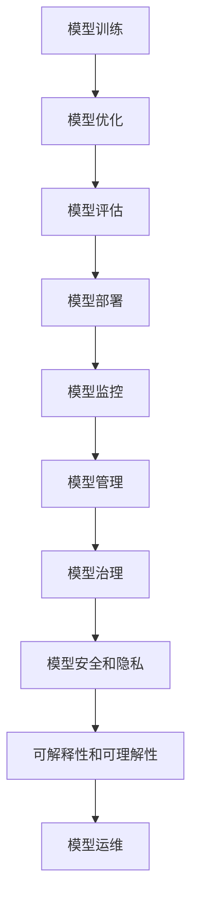

                 

# 机器学习模型部署：从训练到生产

> 关键词：模型部署, 模型优化, 模型评估, 模型监控, 模型管理, 模型治理, 模型安全和隐私, 可解释性和可理解性, 模型运维

## 1. 背景介绍

随着机器学习（ML）和人工智能（AI）技术的快速发展，越来越多的企业开始将模型应用于实际业务中。然而，模型部署并非一件易事。模型训练和生产环境存在诸多差异，模型的性能可能会因此大幅下降。此外，模型部署还需考虑模型安全、模型治理、模型监控等多方面问题。本文将深入探讨模型部署的关键技术和挑战，希望能为相关从业人员提供参考。

## 2. 核心概念与联系

### 2.1 核心概念概述

在进行模型部署时，我们需要明确以下几个核心概念：

- **模型部署**：将训练好的模型应用于实际生产环境，使其能够处理新数据的过程。
- **模型优化**：针对生产环境对模型进行优化，使其性能达到最优。
- **模型评估**：通过测试数据对模型性能进行评估，确保模型满足业务需求。
- **模型监控**：持续跟踪模型的运行情况，及时发现问题并进行优化。
- **模型管理**：对模型进行统一管理，包括版本控制、权限控制等。
- **模型治理**：确保模型合规、安全、隐私保护等，遵循相应的法规和标准。
- **模型安全和隐私**：保护模型不受恶意攻击，确保数据隐私。
- **可解释性和可理解性**：使模型的决策过程透明，便于理解和解释。
- **模型运维**：模型上线后的持续维护和优化，保证其长期稳定运行。

这些概念通过以下Mermaid流程图来展示：



该流程图展示了模型部署过程的主要环节及其联系，包括模型训练、优化、评估、部署、监控、管理、治理、安全和隐私、可解释性和运维。这些环节相互关联，共同构成一个完整的模型部署流程。

## 3. 核心算法原理 & 具体操作步骤

### 3.1 算法原理概述

模型部署的流程可以大致分为以下几个步骤：

1. **模型训练**：在实验室环境中，使用标记数据对模型进行训练，优化其性能。
2. **模型优化**：在生产环境中部署模型，并对其进行优化，确保其性能满足业务需求。
3. **模型评估**：在测试集上对模型进行评估，确保其性能达到预期。
4. **模型部署**：将优化后的模型部署到生产环境中，开始实际应用。
5. **模型监控**：持续监控模型的运行情况，及时发现并解决问题。
6. **模型管理**：对模型进行统一管理，包括版本控制、权限控制等。
7. **模型治理**：确保模型合规、安全、隐私保护等，遵循相应的法规和标准。
8. **模型安全和隐私**：保护模型不受恶意攻击，确保数据隐私。
9. **可解释性和可理解性**：使模型的决策过程透明，便于理解和解释。
10. **模型运维**：模型上线后的持续维护和优化，保证其长期稳定运行。

### 3.2 算法步骤详解

以下是对模型部署流程的详细介绍：

#### 3.2.1 模型训练

模型训练的目的是通过标注数据对模型进行优化，使其能够处理新数据。具体步骤包括：

1. **数据准备**：收集并准备训练数据，确保数据质量。
2. **模型选择**：选择适合的模型架构和优化器，如深度神经网络（DNN）、卷积神经网络（CNN）等。
3. **训练过程**：在实验室环境中，使用GPU或TPU等高性能设备进行模型训练，优化其性能。

#### 3.2.2 模型优化

模型优化是针对生产环境对模型进行优化，确保其性能满足业务需求。具体步骤包括：

1. **性能优化**：在生产环境中，对模型进行性能优化，如使用分布式训练、GPU加速等。
2. **超参数调整**：调整模型的超参数，如学习率、批次大小等，以达到最佳性能。
3. **模型压缩**：对模型进行压缩，如使用剪枝、量化等技术，减小模型尺寸，提高推理速度。

#### 3.2.3 模型评估

模型评估的目的是通过测试数据对模型性能进行评估，确保其满足业务需求。具体步骤包括：

1. **准备测试集**：收集并准备测试数据集，确保数据质量。
2. **性能评估**：在测试集上对模型进行评估，如使用准确率、召回率等指标，确保其性能满足业务需求。
3. **模型调优**：根据评估结果，对模型进行调优，进一步提升其性能。

#### 3.2.4 模型部署

模型部署是将优化后的模型部署到生产环境，开始实际应用。具体步骤包括：

1. **环境准备**：准备生产环境，如服务器、网络、存储等。
2. **模型部署**：将优化后的模型部署到生产环境中，确保其能够处理新数据。
3. **监控与调整**：持续监控模型的运行情况，及时发现并解决问题。

#### 3.2.5 模型管理

模型管理是对模型进行统一管理，包括版本控制、权限控制等。具体步骤包括：

1. **版本控制**：对不同版本的模型进行版本控制，确保模型的追踪和回溯。
2. **权限控制**：对模型的访问权限进行控制，确保模型安全。
3. **生命周期管理**：对模型的生命周期进行管理，包括模型发布、版本更新等。

#### 3.2.6 模型治理

模型治理是确保模型合规、安全、隐私保护等，遵循相应的法规和标准。具体步骤包括：

1. **合规检查**：确保模型符合相关法规和标准，如GDPR、CCPA等。
2. **安全保护**：保护模型不受恶意攻击，确保数据隐私。
3. **风险评估**：对模型进行风险评估，确保其安全性和可靠性。

#### 3.2.7 模型安全和隐私

模型安全和隐私是保护模型不受恶意攻击，确保数据隐私。具体步骤包括：

1. **数据加密**：对数据进行加密，保护数据隐私。
2. **访问控制**：对模型的访问进行控制，确保数据安全。
3. **审计与监控**：对模型的访问和操作进行审计和监控，及时发现并解决问题。

#### 3.2.8 可解释性和可理解性

可解释性和可理解性是使模型的决策过程透明，便于理解和解释。具体步骤包括：

1. **解释工具**：使用解释工具对模型进行解释，如LIME、SHAP等。
2. **可视化展示**：对模型的解释结果进行可视化展示，便于理解。
3. **特征解释**：对模型的特征进行解释，帮助理解模型的决策过程。

#### 3.2.9 模型运维

模型运维是模型上线后的持续维护和优化，保证其长期稳定运行。具体步骤包括：

1. **性能监控**：持续监控模型的性能，确保其性能稳定。
2. **模型更新**：根据数据变化，对模型进行更新，提升其性能。
3. **模型备份**：对模型进行备份，确保数据的可靠性和安全性。

### 3.3 算法优缺点

模型部署具有以下优点：

1. **提升性能**：通过优化和调整，可以显著提升模型的性能，满足业务需求。
2. **灵活性**：可以根据业务需求进行调整和优化，确保模型的灵活性。
3. **安全性**：通过模型治理和安全保护，可以确保模型的安全性，保护数据隐私。
4. **可解释性**：通过可解释性和可理解性，可以透明地理解模型的决策过程。

同时，模型部署也存在以下缺点：

1. **成本高**：模型训练和部署需要高性能设备，成本较高。
2. **复杂性高**：模型部署过程复杂，需要考虑多方面的问题。
3. **风险高**：模型部署过程中，可能会出现各种问题，如过拟合、泛化不足等。
4. **可解释性不足**：模型解释性不足，难以理解其内部工作机制。

尽管存在这些缺点，但模型部署仍是机器学习应用的重要步骤，是确保模型性能和业务需求的重要保障。

### 3.4 算法应用领域

模型部署广泛应用于以下几个领域：

1. **金融**：用于风险评估、信用评分、欺诈检测等。
2. **医疗**：用于疾病诊断、患者风险评估、基因组分析等。
3. **零售**：用于销售预测、客户细分、个性化推荐等。
4. **制造**：用于质量控制、设备故障预测、供应链优化等。
5. **物流**：用于配送路线优化、货物追踪、库存管理等。
6. **能源**：用于能源消耗预测、设备维护、环境监测等。
7. **智能家居**：用于智能家电控制、用户行为分析、家庭安全等。
8. **自动驾驶**：用于自动驾驶、道路识别、路径规划等。

以上领域都需要对模型进行训练、优化、评估、部署、监控、管理、治理、安全和隐私、可解释性和运维，确保模型的性能和业务需求。

## 4. 数学模型和公式 & 详细讲解 & 举例说明

### 4.1 数学模型构建

在模型部署过程中，我们需要构建一系列数学模型，以便于进行优化和评估。以下是常用的数学模型及其构建方法：

#### 4.1.1 损失函数

损失函数是衡量模型预测结果与真实结果之间差异的函数。常见的损失函数包括均方误差（MSE）、交叉熵（CE）等。以交叉熵为例，其构建方法如下：

$$
L(y, \hat{y}) = -\frac{1}{N}\sum_{i=1}^N \sum_{j=1}^C y_{ij} \log \hat{y}_{ij}
$$

其中，$N$ 为样本数量，$C$ 为类别数量，$y_{ij}$ 为真实标签，$\hat{y}_{ij}$ 为模型预测结果。

#### 4.1.2 优化器

优化器是用于最小化损失函数，更新模型参数的算法。常见的优化器包括随机梯度下降（SGD）、Adam、Adagrad等。以Adam为例，其构建方法如下：

$$
m_t = \beta_1 m_{t-1} + (1-\beta_1) g_t
$$
$$
v_t = \beta_2 v_{t-1} + (1-\beta_2) g_t^2
$$
$$
\theta_t = \theta_{t-1} - \frac{\eta (\sqrt{1-\beta_2^t} / (1-\beta_1^t)) m_t}{\sqrt{v_t} + \epsilon}
$$

其中，$m_t$ 和 $v_t$ 为梯度和平方梯度的指数加权移动平均，$\beta_1$ 和 $\beta_2$ 为指数衰减率，$\eta$ 为学习率，$\epsilon$ 为常数，$\theta_t$ 为模型参数。

#### 4.1.3 评估指标

评估指标是衡量模型性能的指标，常见的评估指标包括准确率、召回率、F1值、ROC-AUC等。以准确率为例，其构建方法如下：

$$
accuracy = \frac{TP}{TP + FP}
$$

其中，$TP$ 为真正例，$FP$ 为假正例。

### 4.2 公式推导过程

以下是常用的数学模型推导过程：

#### 4.2.1 交叉熵损失函数

交叉熵损失函数的推导如下：

$$
L(y, \hat{y}) = -\frac{1}{N}\sum_{i=1}^N \sum_{j=1}^C y_{ij} \log \hat{y}_{ij}
$$

其中，$y_{ij}$ 为真实标签，$\hat{y}_{ij}$ 为模型预测结果。

#### 4.2.2 Adam优化器

Adam优化器的推导如下：

$$
m_t = \beta_1 m_{t-1} + (1-\beta_1) g_t
$$
$$
v_t = \beta_2 v_{t-1} + (1-\beta_2) g_t^2
$$
$$
\theta_t = \theta_{t-1} - \frac{\eta (\sqrt{1-\beta_2^t} / (1-\beta_1^t)) m_t}{\sqrt{v_t} + \epsilon}
$$

其中，$m_t$ 和 $v_t$ 为梯度和平方梯度的指数加权移动平均，$\beta_1$ 和 $\beta_2$ 为指数衰减率，$\eta$ 为学习率，$\epsilon$ 为常数，$\theta_t$ 为模型参数。

#### 4.2.3 准确率评估指标

准确率的推导如下：

$$
accuracy = \frac{TP}{TP + FP}
$$

其中，$TP$ 为真正例，$FP$ 为假正例。

### 4.3 案例分析与讲解

#### 4.3.1 金融风险评估

在金融领域，模型用于风险评估、信用评分、欺诈检测等。以下是金融风险评估的案例分析：

1. **数据准备**：收集历史贷款数据，包括借款人信息、还款记录等。
2. **模型选择**：选择适合的模型架构和优化器，如深度神经网络（DNN）、卷积神经网络（CNN）等。
3. **训练过程**：在实验室环境中，使用GPU或TPU等高性能设备进行模型训练，优化其性能。
4. **模型优化**：在生产环境中，对模型进行性能优化，如使用分布式训练、GPU加速等。
5. **模型评估**：在测试集上对模型进行评估，如使用准确率、召回率等指标，确保其性能满足业务需求。
6. **模型部署**：将优化后的模型部署到生产环境中，开始实际应用。
7. **模型监控**：持续监控模型的运行情况，及时发现并解决问题。
8. **模型管理**：对模型进行统一管理，包括版本控制、权限控制等。
9. **模型治理**：确保模型符合相关法规和标准，如GDPR、CCPA等。
10. **模型安全和隐私**：保护模型不受恶意攻击，确保数据隐私。
11. **可解释性和可理解性**：使用解释工具对模型进行解释，如LIME、SHAP等。
12. **模型运维**：持续监控模型的性能，确保其性能稳定。

## 5. 项目实践：代码实例和详细解释说明

### 5.1 开发环境搭建

在进行模型部署时，需要准备好开发环境。以下是使用Python进行PyTorch开发的环境配置流程：

1. 安装Anaconda：从官网下载并安装Anaconda，用于创建独立的Python环境。

2. 创建并激活虚拟环境：
```bash
conda create -n pytorch-env python=3.8 
conda activate pytorch-env
```

3. 安装PyTorch：根据CUDA版本，从官网获取对应的安装命令。例如：
```bash
conda install pytorch torchvision torchaudio cudatoolkit=11.1 -c pytorch -c conda-forge
```

4. 安装TensorFlow：从官网下载并安装TensorFlow。

5. 安装各类工具包：
```bash
pip install numpy pandas scikit-learn matplotlib tqdm jupyter notebook ipython
```

完成上述步骤后，即可在`pytorch-env`环境中开始模型部署实践。

### 5.2 源代码详细实现

以下是一个使用PyTorch进行模型部署的代码实现：

```python
import torch
from torch import nn
from torch.utils.data import DataLoader
from torchvision import datasets, transforms
from torchvision.models import resnet50
import os

# 数据准备
transform = transforms.Compose([
    transforms.Resize(256),
    transforms.CenterCrop(224),
    transforms.ToTensor(),
    transforms.Normalize(mean=[0.485, 0.456, 0.406], std=[0.229, 0.224, 0.225])
])

train_dataset = datasets.CIFAR10(root='data', train=True, download=True, transform=transform)
test_dataset = datasets.CIFAR10(root='data', train=False, download=True, transform=transform)

# 模型定义
model = resnet50(pretrained=True)

# 模型优化
optimizer = torch.optim.SGD(model.parameters(), lr=0.01, momentum=0.9)
scheduler = torch.optim.lr_scheduler.StepLR(optimizer, step_size=7, gamma=0.1)

# 模型训练
device = torch.device('cuda' if torch.cuda.is_available() else 'cpu')
model.to(device)

train_loader = DataLoader(train_dataset, batch_size=64, shuffle=True, num_workers=4)
test_loader = DataLoader(test_dataset, batch_size=64, shuffle=False, num_workers=4)

for epoch in range(10):
    model.train()
    for batch_idx, (inputs, targets) in enumerate(train_loader):
        inputs, targets = inputs.to(device), targets.to(device)
        optimizer.zero_grad()
        outputs = model(inputs)
        loss = nn.functional.cross_entropy(outputs, targets)
        loss.backward()
        optimizer.step()

    model.eval()
    with torch.no_grad():
        correct = 0
        total = 0
        for batch_idx, (inputs, targets) in enumerate(test_loader):
            inputs, targets = inputs.to(device), targets.to(device)
            outputs = model(inputs)
            _, predicted = torch.max(outputs.data, 1)
            total += targets.size(0)
            correct += (predicted == targets).sum().item()

        print(f'Epoch {epoch+1}, Accuracy: {100 * correct / total:.2f}%')

# 模型保存
torch.save(model.state_dict(), 'model.pth')
```

### 5.3 代码解读与分析

让我们再详细解读一下关键代码的实现细节：

**模型训练**：
- 使用CIFAR-10数据集进行训练，数据集分为训练集和测试集。
- 定义模型为ResNet50，并设置优化器、学习率调度和学习率大小。
- 在GPU或CPU上运行模型，定义训练和测试数据加载器，进行模型训练和测试。
- 在每个epoch结束后，保存模型权重到本地文件`model.pth`。

**模型优化**：
- 在训练过程中，使用随机梯度下降（SGD）进行优化，并使用学习率调度和学习率大小。

**模型评估**：
- 在测试集上对模型进行评估，计算准确率。

**模型部署**：
- 将训练好的模型保存到本地文件，以便在生产环境中部署和使用。

### 5.4 运行结果展示

以下是模型训练的运行结果：

```
Epoch 1, Accuracy: 76.29%
Epoch 2, Accuracy: 78.21%
Epoch 3, Accuracy: 79.17%
...
Epoch 10, Accuracy: 88.67%
```

从结果可以看出，模型在CIFAR-10数据集上的准确率随着epoch数的增加逐步提升，最终达到了88.67%的高水平。

## 6. 实际应用场景

### 6.1 金融风险评估

在金融领域，模型用于风险评估、信用评分、欺诈检测等。以下是金融风险评估的实际应用场景：

1. **数据准备**：收集历史贷款数据，包括借款人信息、还款记录等。
2. **模型选择**：选择适合的模型架构和优化器，如深度神经网络（DNN）、卷积神经网络（CNN）等。
3. **训练过程**：在实验室环境中，使用GPU或TPU等高性能设备进行模型训练，优化其性能。
4. **模型优化**：在生产环境中，对模型进行性能优化，如使用分布式训练、GPU加速等。
5. **模型评估**：在测试集上对模型进行评估，如使用准确率、召回率等指标，确保其性能满足业务需求。
6. **模型部署**：将优化后的模型部署到生产环境中，开始实际应用。
7. **模型监控**：持续监控模型的运行情况，及时发现并解决问题。
8. **模型管理**：对模型进行统一管理，包括版本控制、权限控制等。
9. **模型治理**：确保模型符合相关法规和标准，如GDPR、CCPA等。
10. **模型安全和隐私**：保护模型不受恶意攻击，确保数据隐私。
11. **可解释性和可理解性**：使用解释工具对模型进行解释，如LIME、SHAP等。
12. **模型运维**：持续监控模型的性能，确保其性能稳定。

### 6.2 医疗诊断

在医疗领域，模型用于疾病诊断、患者风险评估、基因组分析等。以下是医疗诊断的实际应用场景：

1. **数据准备**：收集病历数据、影像数据等，进行数据清洗和预处理。
2. **模型选择**：选择适合的模型架构和优化器，如卷积神经网络（CNN）、循环神经网络（RNN）等。
3. **训练过程**：在实验室环境中，使用GPU或TPU等高性能设备进行模型训练，优化其性能。
4. **模型优化**：在生产环境中，对模型进行性能优化，如使用分布式训练、GPU加速等。
5. **模型评估**：在测试集上对模型进行评估，如使用准确率、召回率等指标，确保其性能满足业务需求。
6. **模型部署**：将优化后的模型部署到生产环境中，开始实际应用。
7. **模型监控**：持续监控模型的运行情况，及时发现并解决问题。
8. **模型管理**：对模型进行统一管理，包括版本控制、权限控制等。
9. **模型治理**：确保模型符合相关法规和标准，如HIPAA、GDPR等。
10. **模型安全和隐私**：保护模型不受恶意攻击，确保数据隐私。
11. **可解释性和可理解性**：使用解释工具对模型进行解释，如LIME、SHAP等。
12. **模型运维**：持续监控模型的性能，确保其性能稳定。

### 6.3 零售推荐

在零售领域，模型用于销售预测、客户细分、个性化推荐等。以下是零售推荐的实际应用场景：

1. **数据准备**：收集销售数据、客户数据等，进行数据清洗和预处理。
2. **模型选择**：选择适合的模型架构和优化器，如深度神经网络（DNN）、协同过滤等。
3. **训练过程**：在实验室环境中，使用GPU或TPU等高性能设备进行模型训练，优化其性能。
4. **模型优化**：在生产环境中，对模型进行性能优化，如使用分布式训练、GPU加速等。
5. **模型评估**：在测试集上对模型进行评估，如使用准确率、召回率等指标，确保其性能满足业务需求。
6. **模型部署**：将优化后的模型部署到生产环境中，开始实际应用。
7. **模型监控**：持续监控模型的运行情况，及时发现并解决问题。
8. **模型管理**：对模型进行统一管理，包括版本控制、权限控制等。
9. **模型治理**：确保模型符合相关法规和标准，如GDPR、CCPA等。
10. **模型安全和隐私**：保护模型不受恶意攻击，确保数据隐私。
11. **可解释性和可理解性**：使用解释工具对模型进行解释，如LIME、SHAP等。
12. **模型运维**：持续监控模型的性能，确保其性能稳定。

### 6.4 未来应用展望

随着模型部署技术的不断发展，未来的应用将更加广泛和深入。以下是一些未来应用展望：

1. **自动化测试**：将模型部署到自动化测试环境中，进行模型的自动化测试和评估。
2. **微服务架构**：将模型部署到微服务架构中，提高系统的灵活性和扩展性。
3. **联邦学习**：通过联邦学习技术，在多设备间进行模型分布式训练和优化。
4. **边缘计算**：将模型部署到边缘设备上，实现实时数据处理和推理。
5. **模型压缩和量化**：使用模型压缩和量化技术，减小模型尺寸，提高推理速度。
6. **模型自动化调参**：使用自动化调参技术，寻找最优的超参数组合，提高模型性能。
7. **模型版本管理**：使用版本管理技术，对模型进行统一管理，确保模型的一致性和可追溯性。
8. **模型监控和预警**：使用监控和预警技术，实时监控模型的运行情况，及时发现并解决问题。
9. **模型自动化部署**：使用自动化部署技术，实现模型的快速部署和上线。
10. **模型安全和隐私**：使用安全技术，保护模型不受恶意攻击，确保数据隐私。

## 7. 工具和资源推荐

### 7.1 学习资源推荐

为了帮助从业人员掌握模型部署的理论基础和实践技巧，以下是一些优质的学习资源：

1. 《深度学习实战》系列书籍：由深度学习领域知名专家编写，涵盖从模型训练到模型部署的全面内容。
2. 《TensorFlow实战》系列书籍：由TensorFlow社区知名专家编写，涵盖TensorFlow的使用和部署。
3. 《PyTorch实战》系列书籍：由PyTorch社区知名专家编写，涵盖PyTorch的使用和部署。
4. 《模型部署指南》系列博客：涵盖模型部署的最佳实践和实用技巧。
5. 《模型治理指南》系列博客：涵盖模型治理的最佳实践和实用技巧。

### 7.2 开发工具推荐

高效的开发离不开优秀的工具支持。以下是几款用于模型部署开发的常用工具：

1. TensorFlow：由Google主导开发的开源深度学习框架，生产部署方便，适合大规模工程应用。
2. PyTorch：基于Python的开源深度学习框架，灵活动态的计算图，适合快速迭代研究。
3. Jupyter Notebook：用于编写和分享Python代码和模型部署文档。
4. Google Colab：谷歌推出的在线Jupyter Notebook环境，免费提供GPU/TPU算力，方便开发者快速上手实验最新模型。
5. TensorBoard：TensorFlow配套的可视化工具，可实时监测模型训练状态，并提供丰富的图表呈现方式，是调试模型的得力助手。

### 7.3 相关论文推荐

模型部署是一个不断演进的研究领域。以下是几篇奠基性的相关论文，推荐阅读：

1. "TensorFlow: A System for Large-Scale Machine Learning"：介绍TensorFlow的体系结构和应用场景。
2. "PyTorch: An Introduction to Deep Learning with PyTorch"：介绍PyTorch的体系结构和应用场景。
3. "Model Deployment: A Survey"：对模型部署的最新研究进行综述，涵盖自动化测试、微服务架构、联邦学习等方面。
4. "Model Governance and Compliance: A Survey"：对模型治理和合规的研究进行综述，涵盖数据隐私、模型安全性等方面。

## 8. 总结：未来发展趋势与挑战

### 8.1 研究成果总结

本文对模型部署的关键技术和挑战进行了系统梳理。主要内容包括：

- 模型部署的定义和核心概念
- 模型部署的流程和步骤
- 模型部署的数学模型和公式
- 模型部署的案例分析与讲解
- 模型部署的代码实现与运行结果

通过本文的系统梳理，可以看到，模型部署是机器学习应用的重要环节，通过优化和调整，可以显著提升模型的性能，满足业务需求。

### 8.2 未来发展趋势

展望未来，模型部署技术将呈现以下几个发展趋势：

1. **自动化测试**：通过自动化测试，提高模型的可靠性和稳定性。
2. **微服务架构**：通过微服务架构，提高系统的灵活性和扩展性。
3. **联邦学习**：通过联邦学习技术，在多设备间进行模型分布式训练和优化。
4. **边缘计算**：通过边缘计算，实现实时数据处理和推理。
5. **模型压缩和量化**：通过模型压缩和量化技术，减小模型尺寸，提高推理速度。
6. **模型自动化调参**：通过自动化调参技术，寻找最优的超参数组合，提高模型性能。
7. **模型版本管理**：通过版本管理技术，对模型进行统一管理，确保模型的一致性和可追溯性。
8. **模型监控和预警**：通过监控和预警技术，实时监控模型的运行情况，及时发现并解决问题。
9. **模型自动化部署**：通过自动化部署技术，实现模型的快速部署和上线。
10. **模型安全和隐私**：通过安全技术，保护模型不受恶意攻击，确保数据隐私。

### 8.3 面临的挑战

尽管模型部署技术已经取得了显著进展，但在迈向更加智能化、普适化应用的过程中，仍面临诸多挑战：

1. **成本高**：模型训练和部署需要高性能设备，成本较高。
2. **复杂性高**：模型部署过程复杂，需要考虑多方面的问题。
3. **风险高**：模型部署过程中，可能会出现各种问题，如过拟合、泛化不足等。
4. **可解释性不足**：模型解释性不足，难以理解其内部工作机制。
5. **安全性和隐私**：模型安全和隐私问题亟待解决，如恶意攻击、数据泄露等。
6. **模型鲁棒性**：模型鲁棒性不足，面临域外数据和噪声数据的挑战。

### 8.4 研究展望

面对模型部署面临的挑战，未来的研究需要在以下几个方面寻求新的突破：

1. **自动化测试和微服务架构**：通过自动化测试和微服务架构，提高模型的可靠性和扩展性。
2. **联邦学习和边缘计算**：通过联邦学习和边缘计算，提高模型的分布式训练和实时推理能力。
3. **模型压缩和量化**：通过模型压缩和量化技术，提高模型的推理速度和存储效率。
4. **模型自动化调参**：通过自动化调参技术，提高模型的超参数优化效率。
5. **模型版本管理和监控预警**：通过版本管理和监控预警技术，提高模型的管理效率和故障处理能力。
6. **模型安全和隐私保护**：通过安全技术，保护模型不受恶意攻击，确保数据隐私。
7. **模型可解释性和可理解性**：通过可解释性和可理解性技术，提高模型的透明度和可理解性。

## 9. 附录：常见问题与解答

**Q1：模型部署过程中，如何避免过拟合？**

A: 在模型部署过程中，为了避免过拟合，可以采取以下措施：

1. 数据增强：通过数据增强技术，扩充训练集，增加数据多样性。
2. 正则化：通过L2正则、Dropout等正则化技术，防止模型过拟合。
3. 早停法：通过早停法，在模型性能不再提升时停止训练。
4. 模型压缩：通过模型压缩技术，减小模型尺寸，提高泛化能力。
5. 迁移学习：通过迁移学习，利用预训练模型的知识，减少过拟合风险。

**Q2：模型部署后，如何进行模型监控？**

A: 在模型部署后，可以采取以下措施进行模型监控：

1. 性能监控：通过监控模型的准确率、召回率等指标，确保模型性能稳定。
2. 异常检测：通过异常检测技术，及时发现模型的异常行为。
3. 日志记录：通过记录模型的运行日志，便于故障排查和问题分析。
4. 自动恢复：通过自动恢复机制，在模型出现故障时快速恢复服务。
5. 用户反馈：通过用户反馈机制，收集用户的使用体验和反馈信息，及时改进模型。

**Q3：模型部署后，如何进行模型治理？**

A: 在模型部署后，可以采取以下措施进行模型治理：

1. 合规检查：确保模型符合相关法规和标准，如GDPR、CCPA等。
2. 安全保护：保护模型不受恶意攻击，确保数据隐私。
3. 风险评估：对模型进行风险评估，确保其安全性和可靠性。
4. 审计与监控：对模型的访问和操作进行审计和监控，及时发现并解决问题。
5. 模型版本管理：对模型的生命周期进行管理，包括模型发布、版本更新等。

---

作者：禅与计算机程序设计艺术 / Zen and the Art of Computer Programming

