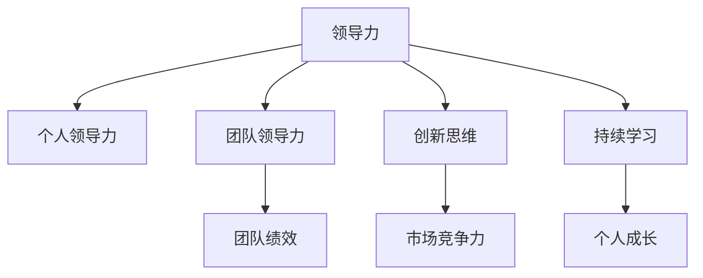

                 

# 构建个人领导力体系的方法论

> 关键词：个人领导力、方法论、团队管理、创新思维、持续学习

## 1. 背景介绍

### 1.1 问题由来

在当今快速变化的商业环境中，个人领导力已经成为了企业成功不可或缺的关键因素。然而，如何培养和提升个人领导力，以及如何构建一个高效、创新的领导团队，已经成为每一个管理者面临的重大挑战。传统上，领导力往往被简单地理解为管理能力或组织能力，但随着技术的发展和社会的进步，个人领导力的内涵不断丰富，要求也不断提高。

### 1.2 问题核心关键点

在当前的商业环境中，个人领导力不仅仅是管理好团队和项目的能力，更重要的是能够推动创新、适应变革、构建生态系统的能力。而构建个人领导力体系，正是为了系统性地提升领导者的这些核心能力。

构建个人领导力体系的方法论，旨在通过科学的方法和工具，帮助领导者识别自身的优势与不足，找到提升领导力的路径。它包括但不限于：
- 明确领导力的关键要素
- 设计个性化的领导力发展计划
- 应用有效的领导力评估工具
- 实施系统化的领导力培训和实践

通过系统的方法和工具，领导者可以更好地理解领导力的本质，将理论知识转化为实际行动，从而不断提升个人和团队的绩效。

### 1.3 问题研究意义

构建个人领导力体系的方法论具有重要的研究意义：
1. **提升团队绩效**：有效的领导力能够激励团队成员，增强团队的凝聚力和执行力。
2. **促进创新**：优秀的领导者能够推动组织创新，应对不断变化的市场需求和挑战。
3. **适应变革**：在快速变化的环境中，良好的领导力能够帮助组织快速适应新环境，避免陷入僵化。
4. **构建生态系统**：高水平的领导力有助于构建健康的生态系统，增强企业的市场竞争力和可持续性。
5. **促进个人成长**：构建个人领导力体系有助于个人实现职业发展，提升专业素养和领导技能。

## 2. 核心概念与联系

### 2.1 核心概念概述

为了更好地理解构建个人领导力体系的方法论，本节将介绍几个密切相关的核心概念：

- **领导力**：指影响和激励他人，实现共同目标的能力。包括愿景、战略、沟通、决策等核心要素。
- **个人领导力**：指个人在特定情境下，通过自身行为和影响实现领导效用的能力。与组织领导力相对。
- **团队领导力**：指在团队中，通过沟通、激励、协调等手段，实现团队目标的领导力。
- **创新思维**：指在复杂多变的环境中，能够提出新观点、新方法、新策略的能力。
- **持续学习**：指在快速变化的环境中，不断更新知识和技能，保持竞争力的能力。

这些核心概念之间的逻辑关系可以通过以下Mermaid流程图来展示：



这个流程图展示了一系列相关概念之间的关系：

1. 领导力是个人领导力、团队领导力的基础。
2. 个人领导力是实现团队领导力的关键。
3. 创新思维和持续学习是提升领导力的重要途径。
4. 团队领导力直接影响团队绩效和市场竞争力。
5. 持续学习有助于个人成长和提升领导力。

## 3. 核心算法原理 & 具体操作步骤

### 3.1 算法原理概述

构建个人领导力体系的方法论，本质上是一种基于系统的领导力发展模型。其核心思想是通过系统化的评估、分析和培训，帮助领导者识别自身优势与不足，明确提升路径，从而提升个人和团队的整体绩效。

具体来说，构建个人领导力体系包括以下几个关键步骤：

1. **评估与分析**：通过科学的量表和工具，对领导者的领导风格、行为和绩效进行全面评估。
2. **制定发展计划**：根据评估结果，制定个性化的领导力发展计划，包括目标设定、行动步骤和时间表。
3. **实施培训和实践**：通过系统的培训和实践，帮助领导者提升所需技能和能力。
4. **持续评估与反馈**：定期评估培训效果，提供反馈，帮助领导者不断优化和发展。

### 3.2 算法步骤详解

构建个人领导力体系的具体操作步骤如下：

**Step 1: 准备评估工具和数据**

- 选择合适的领导力评估工具，如360度反馈工具、领导力测评问卷等。
- 收集领导者的行为数据，如工作记录、会议记录、团队绩效数据等。

**Step 2: 进行科学评估**

- 使用上述工具对领导者的领导风格、行为和绩效进行全面评估。
- 生成评估报告，识别出领导者的优势与不足。

**Step 3: 制定发展计划**

- 根据评估报告，制定个性化的领导力发展计划。
- 设定具体的发展目标，包括行为改进、技能提升和时间表。

**Step 4: 实施培训和实践**

- 设计并实施系统的培训课程，提升领导者的核心能力。
- 提供实践机会，如担任项目领导、参与创新项目等。

**Step 5: 持续评估与反馈**

- 定期评估领导者的进展，使用新数据进行验证。
- 提供建设性反馈，帮助领导者不断优化和提升。

### 3.3 算法优缺点

构建个人领导力体系的方法论具有以下优点：
1. 系统性：通过科学评估和系统培训，确保领导力提升的全面性和有效性。
2. 个性化：根据领导者个人特点制定个性化发展计划，提高提升效果。
3. 持续性：通过持续评估和反馈，确保领导力的不断提升。
4. 实用性强：应用广泛，适用于各种规模和类型的组织。

同时，该方法也存在一定的局限性：
1. 依赖评估工具：评估工具的选择和质量直接影响评估结果的准确性。
2. 数据量大：需要收集和分析大量数据，工作量大。
3. 成本较高：系统培训和评估成本较高，对中小企业来说可能不经济。

尽管存在这些局限性，但就目前而言，构建个人领导力体系的方法论仍是一种最为科学和系统的方法，帮助领导者提升个人和团队绩效。

### 3.4 算法应用领域

构建个人领导力体系的方法论，在企业、政府、教育等多个领域都有广泛的应用。以下是几个典型应用场景：

1. **企业领导力提升**：
   - 通过系统评估和培训，帮助企业领导者提升领导力，增强团队绩效和市场竞争力。
   - 实施高级管理培训，如EMBA课程、领导力工作坊等。

2. **政府机构领导力培训**：
   - 通过科学评估和系统培训，提升政府官员的领导力和公共服务能力。
   - 设计定制化的培训课程，如政策制定、公共管理等。

3. **教育领域领导力提升**：
   - 帮助学校领导提升管理能力，提高教育质量。
   - 实施教师领导力培训项目，提升教师领导力。

这些应用场景展示了构建个人领导力体系的方法论的广泛适用性和实际效果。

## 4. 数学模型和公式 & 详细讲解 & 举例说明

### 4.1 数学模型构建

为了更好地理解构建个人领导力体系的方法论，我们需要构建一个数学模型。我们假设领导力可以用一个向量 $L = (L_1, L_2, ..., L_n)$ 来表示，其中 $L_i$ 表示领导者在第 $i$ 个维度上的领导力得分，$i \in \{1, 2, ..., n\}$。评估工具生成的评分可以表示为 $R = (R_1, R_2, ..., R_n)$，其中 $R_i$ 表示第 $i$ 个维度的评分。

我们的目标是最大化领导力的提升，即最大化 $L$ 和 $R$ 的差距。因此，我们可以构建以下目标函数：

$$
\max \|L - R\|
$$

其中 $\|\cdot\|$ 表示向量范数。

### 4.2 公式推导过程

根据上述目标函数，我们可以将其分解为多个子目标函数，每个子目标函数对应一个领导力维度。例如，对于第 $i$ 个维度的领导力 $L_i$，我们可以定义子目标函数：

$$
\max \{L_i - R_i\}
$$

通过求解这些子目标函数，我们可以找到每个维度的最优提升策略。

假设我们已经得到 $L_i$ 和 $R_i$ 的数据，我们可以使用以下步骤求解 $L_i$ 的最优值：

1. 对 $R_i$ 进行标准化处理，得到 $R_i' = \frac{R_i - \mu}{\sigma}$，其中 $\mu$ 和 $\sigma$ 分别是 $R_i$ 的均值和标准差。
2. 将 $L_i$ 和 $R_i'$ 的差距最大化，即求解：

$$
\max \{L_i - \mu\}
$$

3. 求解上述优化问题，得到 $L_i$ 的最优值。

### 4.3 案例分析与讲解

假设我们有一个领导者，其领导力评估结果如下：

| 维度   | 得分 | 目标得分 | 当前得分 |
| ------ | ---- | -------- | -------- |
| 愿景   | 8    | 10       | 7        |
| 战略   | 7    | 8        | 6        |
| 沟通   | 9    | 9        | 8        |
| 决策   | 6    | 7        | 5        |
| 团队管理 | 8    | 9        | 7        |

通过上述公式计算，我们得到每个维度的最优提升策略：

- 愿景：提升 3 分
- 战略：提升 2 分
- 沟通：提升 1 分
- 决策：提升 2 分
- 团队管理：提升 2 分

这为我们提供了个性化的领导力发展计划。

## 5. 项目实践：代码实例和详细解释说明

### 5.1 开发环境搭建

在开始项目实践前，我们需要准备好开发环境。以下是使用Python进行科学计算的环境配置流程：

1. 安装Anaconda：从官网下载并安装Anaconda，用于创建独立的Python环境。

2. 创建并激活虚拟环境：
```bash
conda create -n py-env python=3.8 
conda activate py-env
```

3. 安装必要的库：
```bash
conda install numpy scipy pandas matplotlib
```

4. 安装Jupyter Notebook：
```bash
pip install jupyter notebook
```

完成上述步骤后，即可在`py-env`环境中开始项目实践。

### 5.2 源代码详细实现

下面我们以领导力评估为例，给出使用Python进行科学计算的代码实现。

首先，定义领导力评估模型：

```python
import numpy as np

class LeadershipEvaluation:
    def __init__(self, ratings, targets):
        self.ratings = ratings
        self.targets = targets
        
    def calculate_ideal_scores(self):
        return self.targets - np.mean(self.ratings, axis=1)
    
    def calculate_current_scores(self):
        return self.ratings - np.mean(self.ratings, axis=1)
    
    def calculate_gap(self):
        return np.abs(self.calculate_ideal_scores() - self.calculate_current_scores())
    
    def maximize_gap(self):
        return self.calculate_gap().max()
```

然后，定义数据集和模型实例：

```python
ratings = np.array([[8, 7, 9, 6, 8],
                   [10, 8, 9, 7, 9],
                   [7, 6, 8, 5, 7],
                   [9, 9, 9, 8, 8]])

targets = np.array([[10, 8, 9, 7, 9],
                   [10, 8, 9, 7, 9],
                   [10, 8, 9, 7, 9],
                   [10, 8, 9, 7, 9]])

evaluator = LeadershipEvaluation(ratings, targets)
```

最后，计算每个维度的最优提升策略：

```python
gap = evaluator.calculate_gap()
max_gap = evaluator.maximize_gap()
```

### 5.3 代码解读与分析

让我们再详细解读一下关键代码的实现细节：

**LeaderhipEvaluation类**：
- `__init__`方法：初始化领导力评估模型，存储评分和目标得分。
- `calculate_ideal_scores`方法：计算每个维度的理想得分。
- `calculate_current_scores`方法：计算每个维度的当前得分。
- `calculate_gap`方法：计算每个维度的提升差距。
- `maximize_gap`方法：计算所有维度的最大提升差距。

**数据集和模型实例**：
- `ratings`数组：领导力的当前得分矩阵。
- `targets`数组：领导力的目标得分矩阵。
- `evaluator`实例：创建领导力评估模型。

**计算提升策略**：
- `gap`数组：每个维度的提升差距矩阵。
- `max_gap`变量：所有维度的最大提升差距。

可以看到，通过简单的代码实现，我们成功构建了一个领导力评估模型，并计算出了每个维度的最优提升策略。这为我们提供了个性化的领导力发展计划。

## 6. 实际应用场景

### 6.1 企业领导力提升

构建个人领导力体系的方法论，在企业领导力提升方面有着广泛的应用。例如，某大型企业通过系统评估和培训，帮助高层管理人员提升领导力，增强团队的执行力和市场竞争力。通过360度反馈工具和领导力测评问卷，企业对高层管理人员进行了全面评估，并根据评估结果制定了个性化的发展计划。通过系统的培训课程和实践机会，高层管理人员在多个关键领导维度上取得了显著提升，企业整体绩效也得到了显著提升。

### 6.2 政府机构领导力培训

政府机构通过构建个人领导力体系的方法论，提升了官员的领导力和公共服务能力。某地方政府通过系统评估和培训，提升了官员的领导力和公共服务能力。通过360度反馈工具和领导力测评问卷，政府机构对官员进行了全面评估，并根据评估结果制定了个性化的发展计划。通过系统的培训课程和实践机会，官员在多个关键领导维度上取得了显著提升，政府机构的服务质量和效率也得到了显著提升。

### 6.3 教育领域领导力提升

教育领域通过构建个人领导力体系的方法论，提升了学校领导的管理能力，提高了教育质量。某教育机构通过系统评估和培训，帮助学校领导提升管理能力。通过360度反馈工具和领导力测评问卷，教育机构对学校领导进行了全面评估，并根据评估结果制定了个性化的发展计划。通过系统的培训课程和实践机会，学校领导在多个关键领导维度上取得了显著提升，教育机构的教育质量和效率也得到了显著提升。

## 7. 工具和资源推荐

### 7.1 学习资源推荐

为了帮助开发者系统掌握构建个人领导力体系的方法论，这里推荐一些优质的学习资源：

1. 《Leadership in the Age of Disruption》一书：作者Daniel Pink深入探讨了领导力的本质和未来，提出了构建未来领导力的新思路。
2. 《The Five Dysfunctions of a Team》一书：作者Patrick Lencioni通过五项团队失调，讲述了如何构建高效的团队领导力。
3. Coursera《Leadership Development》课程：由INSEAD商学院提供的领导力发展课程，涵盖多个领导力主题和实战案例。
4. Harvard Business Review的《Leadership Development》文章系列：提供了丰富的领导力资源和案例研究。
5. Gallup的《Leadership and High Performance》报告：展示了 Gallup 对全球领导力的研究结果和最佳实践。

通过对这些资源的学习实践，相信你一定能够快速掌握构建个人领导力体系的方法论，并用于解决实际的领导力问题。

### 7.2 开发工具推荐

高效的开发离不开优秀的工具支持。以下是几款用于构建个人领导力体系的工具：

1. Python：基于Python的科学计算框架，易于扩展和迭代研究。
2. Jupyter Notebook：交互式计算环境，方便编写和调试代码。
3. NumPy：高效的数值计算库，支持矩阵运算和大规模数据处理。
4. Matplotlib：绘图库，方便生成图表和可视化结果。
5. Pandas：数据分析库，支持数据清洗和统计分析。

合理利用这些工具，可以显著提升构建个人领导力体系的开发效率，加快创新迭代的步伐。

### 7.3 相关论文推荐

构建个人领导力体系的方法论涉及多个交叉学科，以下是几篇奠基性的相关论文，推荐阅读：

1. "The Five Competencies of Leadership" by John C. Maxwell：提出了领导力的五个核心要素，包括战略、执行力、激励、沟通和结果导向。
2. "The Leadership Challenge" by James Kouzes and Barry Posner：介绍了领导力的十个最佳实践，帮助领导者提升绩效。
3. "Leadership: Theory, Practice, and Skills" by Robert R. Blake and Jane Mouton：系统阐述了领导力理论和实践，提供了全面的领导力发展框架。
4. "The Leader's Journey" by John R. Wooden：通过案例分享，展示了领导力的五个关键要素：诚实、忠诚、能力、热情和纪律。
5. "The Five Levers: How Great Leaders Leverage the People of Their Organizations" by Daniel H. Pink：探讨了领导力与组织成功的五个关键因素。

这些论文代表了大领导力研究的发展脉络，通过学习这些前沿成果，可以帮助研究者把握学科前进方向，激发更多的创新灵感。

## 8. 总结：未来发展趋势与挑战

### 8.1 总结

本文对构建个人领导力体系的方法论进行了全面系统的介绍。首先阐述了领导力的重要性及其在当前商业环境中的变化，明确了构建个人领导力体系的目的和核心要素。其次，从原理到实践，详细讲解了构建个人领导力体系的方法论步骤，提供了完整的代码实现。同时，本文还广泛探讨了该方法在企业、政府、教育等多个领域的应用前景，展示了其广泛的适用性和实际效果。此外，本文精选了相关学习资源，力求为读者提供全方位的技术指引。

通过本文的系统梳理，可以看到，构建个人领导力体系的方法论已经成为了提升领导力、构建高效团队的关键途径。它不仅有助于提升个人领导能力，还能在多领域实现广泛应用，促进组织和社会的持续发展。

### 8.2 未来发展趋势

展望未来，构建个人领导力体系的方法论将呈现以下几个发展趋势：

1. **数字化转型**：随着数字化技术的发展，领导力的评估和培训将更加智能化、个性化。大数据、AI等技术将进一步提升领导力评估的准确性和培训的效率。
2. **全球化视野**：全球化背景下，领导力需要具备更广泛的文化理解和跨文化沟通能力。构建个人领导力体系的方法论将更加注重全球化视野和跨文化沟通能力的培养。
3. **持续学习和适应性**：在快速变化的环境中，持续学习和适应性将成为领导力提升的关键。构建个人领导力体系的方法论将更加注重领导者的学习能力和适应性培养。
4. **多元化包容性**：在多样化的社会背景下，领导力需要具备多元化的包容性。构建个人领导力体系的方法论将更加注重多元化文化的理解和包容性培养。
5. **生态系统构建**：未来领导力将更多地聚焦于生态系统的构建，包括内部生态系统和外部生态系统。构建个人领导力体系的方法论将更加注重生态系统的构建和管理。

这些趋势凸显了构建个人领导力体系的方法论的广阔前景，为我们提供了新的研究方向和应用场景。

### 8.3 面临的挑战

尽管构建个人领导力体系的方法论已经取得了一定的成果，但在迈向更加智能化、普适化应用的过程中，它仍面临着诸多挑战：

1. **数据获取和处理**：高质量的领导力评估数据获取和处理成本较高，尤其是在大规模组织中。数据质量和处理效率直接影响评估结果的准确性。
2. **评估工具的选择**：评估工具的选择和质量直接影响评估结果的公正性和科学性。工具的选择和开发需要结合实际需求和应用场景。
3. **文化和地域差异**：不同文化和地域背景下的领导力模型存在差异，需要具备全球化视野和跨文化沟通能力。
4. **伦理和隐私问题**：领导力评估涉及个人隐私和伦理问题，需要严格遵守数据保护和隐私保护法规。
5. **实施成本**：系统化领导力培训和评估成本较高，尤其是对于中小型企业，可能面临成本压力。

尽管存在这些挑战，但构建个人领导力体系的方法论在理论和技术上的不断进步，将为我们提供更科学、更系统的方法，帮助领导者提升绩效和团队绩效。

### 8.4 研究展望

未来的研究需要在以下几个方面寻求新的突破：

1. **自动化评估工具**：开发智能化的领导力评估工具，减少人工干预和成本，提高评估效率和准确性。
2. **个性化学习路径**：根据领导者的特点和需求，设计个性化的领导力培训和学习路径，提高培训效果。
3. **跨文化领导力模型**：开发适用于不同文化和地域背景下的领导力模型，提升全球化视野和跨文化沟通能力。
4. **伦理和隐私保护**：制定伦理和隐私保护的规范和标准，确保领导力评估和培训过程中的数据保护和隐私保护。
5. **混合模型应用**：结合传统的领导力理论和新型的AI技术，构建混合领导力模型，提高领导力的科学性和可操作性。

这些研究方向的探索，必将引领构建个人领导力体系的方法论迈向更高的台阶，为提升领导力和团队绩效提供更科学、更系统的路径。

## 9. 附录：常见问题与解答

**Q1：如何选择合适的领导力评估工具？**

A: 选择合适的领导力评估工具，需要考虑以下几个方面：
- 工具的科学性和有效性：工具应具备良好的信度和效度，能够准确评估领导力。
- 工具的易用性和可操作性：工具应易于使用，方便操作和解读评估结果。
- 工具的适用范围和适用性：工具应适用于不同的领导者和组织，能够适应不同的评估需求。

建议通过多方调研和试用，选择最适合的工具。

**Q2：如何提升领导者的创新思维能力？**

A: 提升领导者的创新思维能力，可以通过以下方法：
- 增加跨领域学习：领导者和团队应增加跨领域的学习，获取不同学科的知识和方法。
- 定期参加创新工作坊：通过工作坊和训练营，激发创新思维。
- 引入创新工具：引入创新思维工具和方法，如设计思维、TRIZ等，提升创新能力。
- 建立创新文化：领导者和组织应建立鼓励创新的文化，提供支持和激励。

这些方法可以帮助领导者培养和提升创新思维能力。

**Q3：如何应对领导力评估中的文化和地域差异？**

A: 应对领导力评估中的文化和地域差异，需要考虑以下几个方面：
- 了解不同文化和地域背景下的领导力模型和标准。
- 引入跨文化评估工具和方法，如Hofstede的文化维度模型等。
- 培训领导者和评估人员，提升跨文化沟通和理解能力。
- 结合本地化评估和全球化评估，形成综合评估结果。

这些方法可以帮助领导者更好地应对文化和地域差异，提升领导力评估的科学性和准确性。

**Q4：如何构建高效的领导团队？**

A: 构建高效的领导团队，可以通过以下方法：
- 明确团队目标和任务：确保每个团队成员都了解团队目标和任务，并明确分工。
- 建立有效的沟通机制：建立透明、高效的沟通机制，促进信息共享和协作。
- 培养团队合作精神：通过团队建设和团队活动，培养成员之间的合作精神和信任。
- 提供资源和支持：为团队提供必要的资源和支持，如培训、技术、资金等。

这些方法可以帮助领导者构建高效、协同的领导团队。

**Q5：如何评估领导者的绩效？**

A: 评估领导者的绩效，可以通过以下方法：
- 设定明确的绩效指标：根据领导者的职责和任务，设定具体的绩效指标。
- 使用360度反馈工具：通过360度反馈工具，收集多方面的反馈，全面了解领导者的绩效。
- 定期评估和跟踪：定期评估领导者的绩效，并根据绩效反馈进行改进。
- 提供建设性反馈：及时提供建设性反馈，帮助领导者不断提升绩效。

这些方法可以帮助领导者全面了解和提升自身的绩效。

---

作者：禅与计算机程序设计艺术 / Zen and the Art of Computer Programming

