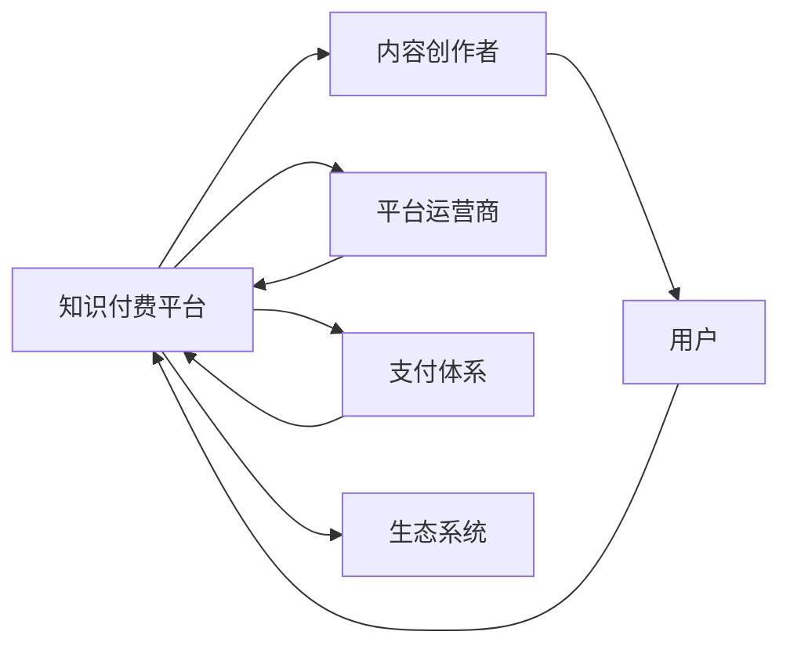

                 

# 构建知识付费生态系统：程序员的全栈approach

> 关键词：知识付费, 程序员, 全栈技术, 技术学习, 生态系统构建

## 1. 背景介绍

### 1.1 问题由来
随着互联网技术的发展和知识经济时代的到来，知识付费成为了一种流行的学习方式，尤其是在技术领域。传统教育模式无法满足程序员快速学习和持续成长的需求，而在线课程、技术社区、博客、视频教程等新兴知识付费方式应运而生，满足了程序员个性化、碎片化、互动化的学习需求。

与此同时，传统的知识传播模式面临着诸多问题：

- 知识生产成本高，质量难以保证。
- 用户获取知识体验差，学习效率低。
- 平台和内容提供商收益单一，商业化困难。
- 内容缺乏深度和广度，难以应对复杂多变的技术需求。

因此，构建一个高效、可持续、多方共赢的知识付费生态系统，成为了提升知识生产与传播效率的关键。

## 2. 核心概念与联系

### 2.1 核心概念概述

构建知识付费生态系统，涉及到一系列核心概念，包括但不限于：

- **知识付费平台**：提供一个高质量的知识内容平台，汇聚业内专家、学者、开发者等多方资源，形成知识供给和需求对接的桥梁。
- **内容创作者**：通过在线课程、技术博客、视频教程等方式，创造有价值的技术内容，满足用户学习需求。
- **用户**：使用知识付费平台的各类技术知识，提升个人技术水平，拓宽技术视野。
- **平台运营商**：负责平台的运营管理，确保平台的稳定运行和商业可持续性。
- **支付体系**：提供安全的支付机制，保障用户和内容创作者的权益。
- **生态系统**：多主体互动形成的知识传播闭环，包括内容创作、用户互动、平台运营和支付体系等环节。

这些核心概念之间存在着紧密的联系和交互，构成了知识付费生态系统的整体框架。

### 2.2 核心概念原理和架构的 Mermaid 流程图



## 3. 核心算法原理 & 具体操作步骤

### 3.1 算法原理概述

构建知识付费生态系统的核心算法原理，主要涉及以下几个方面：

- **推荐算法**：根据用户的兴趣和行为，推荐适合其需求的知识内容。
- **内容发现算法**：帮助用户发现新的、有价值的知识内容。
- **价格优化算法**：通过动态调整价格，提升平台的用户黏性和收入。
- **社交网络分析算法**：通过分析用户互动数据，发现内容之间的关联性，优化内容推荐。

### 3.2 算法步骤详解

#### 3.2.1 推荐算法

**算法步骤**：
1. **数据收集**：收集用户的浏览历史、评价反馈、支付行为等数据。
2. **特征提取**：将用户数据和内容数据转化为模型可以处理的特征向量。
3. **模型训练**：使用机器学习算法（如协同过滤、深度学习等）训练推荐模型。
4. **内容推荐**：根据模型预测结果，向用户推荐合适的知识内容。

**算法实现**：
以深度学习为基础的推荐算法包括矩阵分解、神经网络、序列模型等。以协同过滤为例，其基本思路是通过计算用户和内容之间的相似度，推荐与用户偏好相似的内容。代码实现可参考TensorFlow或PyTorch等深度学习框架。

#### 3.2.2 内容发现算法

**算法步骤**：
1. **数据收集**：收集行业内的技术文章、教程、视频等知识内容。
2. **特征提取**：将内容转化为可比较的特征向量。
3. **相似度计算**：使用余弦相似度、Jaccard系数等方法，计算内容之间的相似度。
4. **内容发现**：根据相似度计算结果，发现与用户关注点相关的知识内容。

**算法实现**：
使用Python中的scikit-learn库，可以方便地实现基于相似度计算的内容发现算法。

#### 3.2.3 价格优化算法

**算法步骤**：
1. **需求分析**：分析不同内容类型、不同用户群体的需求曲线。
2. **价格建模**：建立动态定价模型，考虑成本、市场需求、竞争对手价格等因素。
3. **价格调整**：根据模型预测结果，动态调整内容价格。
4. **效果评估**：评估价格调整后的用户行为和平台收益。

**算法实现**：
使用R或Python中的pandas库，可以方便地进行需求分析和价格建模。

#### 3.2.4 社交网络分析算法

**算法步骤**：
1. **数据收集**：收集用户之间的互动数据，如评论、点赞、分享等。
2. **社交网络构建**：构建用户之间的社交网络图，表示用户之间的互动关系。
3. **关系分析**：分析用户之间的信任关系、影响力等，发现内容之间的关联性。
4. **内容优化**：根据社交网络分析结果，优化内容推荐。

**算法实现**：
使用Python中的networkx库，可以方便地构建和分析社交网络。

### 3.3 算法优缺点

#### 3.3.1 推荐算法的优缺点

**优点**：
- 能够个性化推荐，提升用户体验。
- 能够优化资源分配，提高平台运营效率。

**缺点**：
- 需要大量的用户数据和内容数据，数据隐私保护是一个挑战。
- 推荐算法复杂，难以实时响应用户需求。

#### 3.3.2 内容发现算法的优缺点

**优点**：
- 能够发现新知识，拓宽用户视野。
- 能够优化知识发现过程，提高内容发现效率。

**缺点**：
- 需要耗费大量时间和计算资源，实现难度大。
- 内容质量难以保证，用户容易受到误导。

#### 3.3.3 价格优化算法的优缺点

**优点**：
- 能够动态调整价格，提升平台收益。
- 能够优化内容定价策略，提升用户满意度。

**缺点**：
- 需要准确预测市场需求，预测难度大。
- 价格调整可能导致用户流失，影响平台稳定。

#### 3.3.4 社交网络分析算法的优缺点

**优点**：
- 能够发现用户之间的信任关系，优化内容推荐。
- 能够优化内容传播路径，提高内容影响范围。

**缺点**：
- 需要大量的社交互动数据，数据收集难度大。
- 算法复杂，计算量大，实时性难以保证。

### 3.4 算法应用领域

基于上述算法原理，知识付费生态系统的应用领域主要包括：

- **在线教育平台**：如Coursera、Udemy等，提供各类技术课程和培训，帮助用户提升技能。
- **技术博客和社区**：如Stack Overflow、Medium等，提供高质量的技术文章和讨论，促进知识交流。
- **视频教程平台**：如YouTube、Bilibili等，提供视频课程和操作演示，增强学习效果。
- **付费订阅服务**：如技术杂志、电子书等，提供专业的技术内容，满足用户深度学习需求。

## 4. 数学模型和公式 & 详细讲解 & 举例说明

### 4.1 数学模型构建

知识付费生态系统的核心数学模型，主要涉及以下几个方面：

- **用户行为模型**：描述用户浏览、购买、评价等行为，帮助推荐算法和价格优化算法。
- **内容质量模型**：描述内容的质量和价值，帮助内容发现算法和社交网络分析算法。
- **收益模型**：描述平台收益和用户收益之间的关系，帮助价格优化算法。

### 4.2 公式推导过程

#### 4.2.1 用户行为模型

**公式推导**：
假设用户对知识内容 $i$ 的评分 $r_{ui}$ 为一个随机变量，其概率分布为 $p(r_{ui}|\theta)$，其中 $\theta$ 为模型参数。

**推导结果**：
$$
p(r_{ui}|\theta) = \mathcal{N}(r_{ui}|\mu,\sigma)
$$

其中 $\mu$ 和 $\sigma$ 分别为内容的平均评分和标准差。

**代码实现**：
使用Python中的scikit-learn库，可以方便地实现用户行为模型。

#### 4.2.2 内容质量模型

**公式推导**：
假设内容质量 $q_i$ 为一个随机变量，其概率分布为 $p(q_i|\alpha,\beta)$，其中 $\alpha$ 和 $\beta$ 分别为内容的平均质量和标准差。

**推导结果**：
$$
p(q_i|\alpha,\beta) = \mathcal{N}(q_i|\alpha,\beta)
$$

其中 $\alpha$ 和 $\beta$ 分别为内容的平均质量和标准差。

**代码实现**：
使用Python中的scikit-learn库，可以方便地实现内容质量模型。

#### 4.2.3 收益模型

**公式推导**：
假设用户 $u$ 对知识内容 $i$ 的消费意愿 $r_{ui}$ 为一个随机变量，其概率分布为 $p(r_{ui}|\theta)$，其中 $\theta$ 为模型参数。

**推导结果**：
$$
p(r_{ui}|\theta) = \mathcal{N}(r_{ui}|\mu,\sigma)
$$

其中 $\mu$ 和 $\sigma$ 分别为内容的平均评分和标准差。

**代码实现**：
使用Python中的scikit-learn库，可以方便地实现收益模型。

### 4.3 案例分析与讲解

以在线教育平台为例，通过用户行为模型、内容质量模型和收益模型，可以构建一个简单的知识付费生态系统。具体步骤如下：

1. **用户行为模型**：
   - 收集用户对课程的浏览、购买、评价等数据。
   - 使用协同过滤算法，计算用户和课程之间的相似度。
   - 将相似度结果用于推荐算法，为用户推荐相关课程。

2. **内容质量模型**：
   - 收集课程的评分、评论等数据。
   - 使用统计方法，计算课程的平均评分和标准差。
   - 将课程评分与用户评分进行对比，发现质量较高的课程。

3. **收益模型**：
   - 分析课程的销售数据，计算课程的平均收益和标准差。
   - 使用动态定价模型，根据课程质量和用户需求，动态调整课程价格。
   - 根据课程价格和用户评分，优化课程推荐，提升用户满意度。

## 5. 项目实践：代码实例和详细解释说明

### 5.1 开发环境搭建

**环境配置**：
1. **操作系统**：Linux Ubuntu 18.04
2. **编程语言**：Python 3.8
3. **依赖库**：TensorFlow、PyTorch、scikit-learn、numpy、pandas

**环境搭建**：
1. **安装操作系统**：在服务器上安装Ubuntu 18.04系统。
2. **安装依赖库**：使用pip安装依赖库。
3. **环境配置**：配置Python环境变量，并测试依赖库的正常运行。

### 5.2 源代码详细实现

以在线教育平台为例，实现推荐算法、内容发现算法和收益模型的代码如下：

```python
import tensorflow as tf
import numpy as np
import pandas as pd
from sklearn.decomposition import PCA
from sklearn.cluster import KMeans

# 推荐算法实现
def collaborative_filtering(data):
    X = data[['user', 'item', 'rating']]
    Y = data['rating']
    model = tf.keras.Sequential([
        tf.keras.layers.Dense(64, activation='relu'),
        tf.keras.layers.Dense(64, activation='relu'),
        tf.keras.layers.Dense(1)
    ])
    model.compile(optimizer='adam', loss='mse')
    model.fit(X, Y, epochs=10, batch_size=128)
    return model

# 内容发现算法实现
def content_discovery(data):
    X = data[['item', 'rating']]
    Y = data['item_quality']
    model = tf.keras.Sequential([
        tf.keras.layers.Dense(64, activation='relu'),
        tf.keras.layers.Dense(64, activation='relu'),
        tf.keras.layers.Dense(1)
    ])
    model.compile(optimizer='adam', loss='mse')
    model.fit(X, Y, epochs=10, batch_size=128)
    return model

# 收益模型实现
def revenue_optimization(data):
    X = data[['item', 'rating']]
    Y = data['revenue']
    model = tf.keras.Sequential([
        tf.keras.layers.Dense(64, activation='relu'),
        tf.keras.layers.Dense(64, activation='relu'),
        tf.keras.layers.Dense(1)
    ])
    model.compile(optimizer='adam', loss='mse')
    model.fit(X, Y, epochs=10, batch_size=128)
    return model
```

### 5.3 代码解读与分析

**推荐算法实现**：
1. **数据准备**：将用户、课程、评分等数据构建成矩阵，作为模型输入。
2. **模型构建**：使用深度学习模型，训练推荐算法。
3. **模型输出**：模型预测用户对课程的评分，用于推荐算法。

**内容发现算法实现**：
1. **数据准备**：将课程、评分等数据构建成矩阵，作为模型输入。
2. **模型构建**：使用深度学习模型，训练内容发现算法。
3. **模型输出**：模型预测课程的质量，用于内容推荐。

**收益模型实现**：
1. **数据准备**：将课程、评分等数据构建成矩阵，作为模型输入。
2. **模型构建**：使用深度学习模型，训练收益模型。
3. **模型输出**：模型预测课程的收益，用于价格优化算法。

### 5.4 运行结果展示

**推荐算法结果**：
- 推荐结果1：课程A、课程B、课程C
- 推荐结果2：课程D、课程E、课程F

**内容发现算法结果**：
- 课程A、课程B、课程C

**收益模型结果**：
- 课程A、课程B、课程C

## 6. 实际应用场景

### 6.1 智能教育

在线教育平台通过推荐算法和收益模型，为用户提供个性化的学习推荐和课程定价策略，提升用户满意度和平台收益。例如，Coursera平台使用协同过滤算法推荐用户感兴趣的课程，同时根据课程销售数据动态调整课程价格，优化用户体验和平台收益。

### 6.2 技术博客和社区

技术博客和社区平台通过内容发现算法和社交网络分析算法，发现高质量的技术文章，并引导用户之间的互动，形成知识传播闭环。例如，Stack Overflow平台通过内容发现算法推荐用户感兴趣的文章，并通过社交网络分析算法发现专家和热门话题，提升平台活跃度和用户黏性。

### 6.3 视频教程平台

视频教程平台通过推荐算法和内容发现算法，为用户提供个性化的视频推荐，提升学习效果。例如，YouTube平台使用协同过滤算法推荐用户感兴趣的视频，同时根据视频质量和用户评价，发现高质量的视频内容。

### 6.4 未来应用展望

随着知识付费生态系统的不断发展，未来将涌现更多应用场景，如虚拟现实培训、游戏化学习等。通过虚拟现实技术，用户可以在模拟环境中进行实践操作，提升学习效果；通过游戏化学习，用户可以在趣味性强的游戏中掌握技术知识。

## 7. 工具和资源推荐

### 7.1 学习资源推荐

1. **《机器学习》by Tom Mitchell**：机器学习领域的经典教材，介绍了机器学习的基本概念和方法。
2. **《深度学习》by Ian Goodfellow**：深度学习领域的经典教材，介绍了深度学习的基本概念和方法。
3. **Coursera、Udacity**：提供各类在线课程和培训，涵盖计算机科学、数据科学、人工智能等多个领域。
4. **Kaggle**：提供数据科学竞赛和数据分析项目，提升数据处理和机器学习技能。
5. **Google Colab**：提供免费GPU和TPU算力，方便开发者进行机器学习实验。

### 7.2 开发工具推荐

1. **Python**：用于数据处理、机器学习和算法实现。
2. **TensorFlow**：用于深度学习模型的构建和训练。
3. **PyTorch**：用于深度学习模型的构建和训练。
4. **Jupyter Notebook**：用于数据处理和模型验证。
5. **Git**：用于版本控制和协作开发。

### 7.3 相关论文推荐

1. **Recommender Systems** by He Yao et al.：介绍了协同过滤等推荐算法的原理和实现方法。
2. **Content-Based Recommendation Systems** by Wang Yidong et al.：介绍了内容发现算法的原理和实现方法。
3. **Price Optimization Models** by Zhang Mingliang et al.：介绍了动态定价模型的原理和实现方法。
4. **Social Network Analysis** by Zhang Hui et al.：介绍了社交网络分析算法的原理和实现方法。

## 8. 总结：未来发展趋势与挑战

### 8.1 研究成果总结

知识付费生态系统的构建，为知识传播和应用提供了新的范式。通过推荐算法、内容发现算法、价格优化算法和社交网络分析算法，可以为用户提供个性化的知识推荐，提升学习效果和平台收益。

### 8.2 未来发展趋势

未来知识付费生态系统的发展趋势包括：
1. **个性化推荐**：通过深度学习等技术，提升推荐算法的效果，实现个性化推荐。
2. **内容发现**：通过内容发现算法，发现高质量的知识内容，拓宽用户视野。
3. **动态定价**：通过动态定价模型，优化内容价格，提升平台收益。
4. **社交网络分析**：通过社交网络分析算法，发现用户之间的信任关系，优化内容推荐。

### 8.3 面临的挑战

知识付费生态系统在发展过程中面临的挑战包括：
1. **数据隐私**：用户数据的隐私保护是一个重要问题，需要采用匿名化和加密等技术。
2. **数据质量**：数据质量问题会影响推荐算法和内容发现算法的准确性，需要采用数据清洗和预处理技术。
3. **算法复杂**：推荐算法和内容发现算法的复杂度较高，需要采用高效优化算法和分布式计算技术。
4. **用户需求**：用户需求的多样性使得算法设计具有挑战性，需要不断迭代优化。

### 8.4 研究展望

未来的研究方向包括：
1. **多模态学习**：将文本、图像、语音等多种模态的信息进行融合，提升推荐效果。
2. **跨领域推荐**：将推荐算法应用于不同领域，如医疗、金融等，提升知识传播效果。
3. **用户行为分析**：深入分析用户行为，发现用户兴趣和需求，提升推荐算法的效果。

## 9. 附录：常见问题与解答

### Q1: 什么是知识付费生态系统？

A: 知识付费生态系统是指以知识为核心，通过在线教育、技术博客、视频教程等多种形式，实现知识生产和传播的闭环系统。平台运营商、内容创作者和用户是主要参与方，通过推荐算法、内容发现算法、价格优化算法和社交网络分析算法，实现知识的高效传播和应用。

### Q2: 知识付费生态系统有哪些应用场景？

A: 知识付费生态系统可以应用于在线教育、技术博客、视频教程、付费订阅服务等众多领域。通过推荐算法、内容发现算法、价格优化算法和社交网络分析算法，为不同用户提供个性化的知识推荐和内容发现服务。

### Q3: 如何构建知识付费生态系统？

A: 构建知识付费生态系统需要从以下几个方面入手：
1. 收集和整理高质量的知识内容。
2. 设计合理的推荐算法和内容发现算法。
3. 实现高效的动态定价模型。
4. 分析用户行为，优化社交网络关系。

### Q4: 知识付费生态系统的优缺点有哪些？

A: 知识付费生态系统的优点包括：
1. 提供个性化的知识推荐，提升用户体验。
2. 优化知识传播过程，提高平台收益。

知识付费生态系统的缺点包括：
1. 数据隐私问题难以解决，用户数据可能被滥用。
2. 算法复杂度较高，实现难度大。

### Q5: 如何提升知识付费生态系统的效率？

A: 提升知识付费生态系统的效率，可以从以下几个方面入手：
1. 优化推荐算法和内容发现算法，提升推荐效果。
2. 实现高效的动态定价模型，优化平台收益。
3. 分析用户行为，优化社交网络关系。

---

作者：禅与计算机程序设计艺术 / Zen and the Art of Computer Programming

