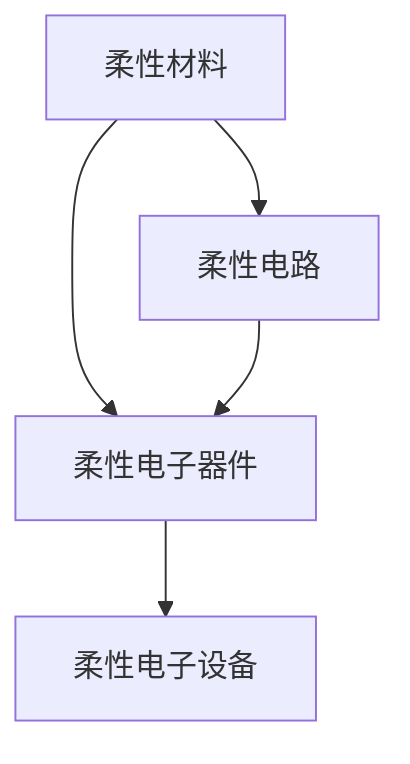

                 

# 柔性电子技术：可弯曲和可穿戴的电子设备

## 1. 背景介绍

### 1.1 问题由来
随着科技的发展和人们生活质量的提高，对电子设备的便携性和舒适性的需求日益增加。传统的硬质电子设备虽然功能强大，但体积庞大、重量大、易碎，无法满足人们对设备便携性的要求。柔性电子技术正是在这样的背景下应运而生。

柔性电子技术是指通过采用柔性材料和柔性制造工艺，使电子设备具备可弯曲、可穿戴等特点，从而提升设备的便携性和舒适性。柔性电子技术的应用领域非常广泛，从可穿戴设备、智能纺织品到柔性传感器和柔性显示器，逐渐渗透到人们的日常生活和工作中。

### 1.2 问题核心关键点
柔性电子技术的主要关键点包括：
- 柔性材料的选择与加工技术
- 柔性电路的制造与封装技术
- 柔性电子器件的设计与集成技术
- 柔性电子设备的生产与测试技术

## 2. 核心概念与联系

### 2.1 核心概念概述

为更好地理解柔性电子技术，本节将介绍几个关键概念：

- 柔性材料（Flexible Materials）：用于柔性电子器件的基底材料，具有高弹性、高延伸性和良好的化学稳定性。常用的柔性材料包括聚酰亚胺、聚氨酯、聚对苯二甲酸乙二醇酯（PET）等。
- 柔性电路（Flexible Circuits）：采用柔性材料和柔性制造工艺制成的电路，具有可弯曲、可拉伸的特性。柔性电路主要用于柔性电子器件的制造。
- 柔性电子器件（Flexible Electronics）：使用柔性材料和柔性电路技术制造的电子器件，如柔性显示器、柔性传感器、柔性电池等。
- 柔性电子设备（Flexible Electronics Devices）：结合柔性电子器件和柔性电路技术，集成的可穿戴设备、智能纺织品等产品。

这些概念之间的联系可以通过以下Mermaid流程图来展示：



这个流程图展示了几者之间的关系：柔性材料是柔性电路和柔性电子器件的基础，柔性电路是柔性电子器件的核心部件，柔性电子器件是柔性电子设备的组件，而柔性电子设备是柔性材料、柔性电路和柔性电子器件的综合应用。

## 3. 核心算法原理 & 具体操作步骤
### 3.1 算法原理概述

柔性电子技术的核心算法原理基于柔性材料和柔性电路的物理和化学特性，通过选择合适的高弹性、高导电性材料，并采用柔性制造工艺，实现电子器件的可弯曲、可穿戴特性。

柔性电路的设计和制造是柔性电子技术的关键，其原理如下：

1. 柔性电路设计：在柔性基底上设计电路图案，包括导线、电阻、电容等电路元件，并使用计算机辅助设计软件进行模拟和优化。

2. 柔性电路制造：采用激光刻蚀、热压成型等柔性制造工艺，将电路图案转移到柔性基底上。常用的柔性制造工艺包括光刻、电镀、印刷等。

3. 柔性电路封装：将柔性电路与其他柔性电子器件和基底材料进行封装，形成最终的柔性电子设备。封装过程包括层压、热压、焊接等步骤。

### 3.2 算法步骤详解

柔性电子技术的具体操作步骤如下：

**Step 1: 材料选择与加工**
- 根据器件功能需求，选择合适的柔性材料，如聚酰亚胺、聚氨酯等。
- 采用激光切割、热压成型等加工技术，将柔性材料加工成所需形状和尺寸。

**Step 2: 电路设计**
- 在柔性基底上使用计算机辅助设计软件进行电路设计，确定电路元件的位置和尺寸。
- 进行电路仿真和优化，确保电路性能满足设计要求。

**Step 3: 电路制造**
- 采用激光刻蚀、电镀、印刷等柔性制造工艺，将电路图案转移到柔性基底上。
- 对电路进行封装，如层压、热压等，确保电路的可靠性和稳定性。

**Step 4: 器件集成**
- 将柔性电路与其他柔性电子器件和基底材料进行封装，形成最终的柔性电子设备。
- 进行器件测试和性能验证，确保设备功能正常。

**Step 5: 设备应用**
- 将柔性电子设备应用到实际场景中，如可穿戴设备、智能纺织品等。
- 持续收集用户反馈，优化设备性能和用户体验。

### 3.3 算法优缺点

柔性电子技术的优点包括：
- 便携性高：柔性材料和柔性电路的特征使得设备可以弯曲、折叠，便于携带。
- 舒适性好：柔性材料具有柔韧性和弹性，可以贴合人体曲面，增加用户佩戴的舒适度。
- 可穿戴性强：柔性电路的制造技术使得设备可以集成到衣物、配饰等可穿戴设备中。
- 功能多样化：柔性电子技术可以制造多种类型的电子器件，满足不同应用需求。

但柔性电子技术也存在一些缺点：
- 制造难度大：柔性电路的制造和封装技术要求高，制造难度较大。
- 可靠性较低：柔性电路的机械性能和化学性能不如硬质电路，可能存在可靠性问题。
- 成本较高：柔性材料和柔性制造工艺的成本较高，增加了设备的制造成本。

### 3.4 算法应用领域

柔性电子技术在多个领域得到了广泛应用，包括：

- 可穿戴设备：柔性电子技术可以制造可穿戴设备，如柔性屏幕手表、智能服装等，方便用户随时查看信息，提升生活便利性。
- 医疗健康：柔性电子技术可以制造柔性传感器和柔性显示器，用于医疗健康监测和康复设备，实时监测患者的生理指标。
- 智能家居：柔性电子技术可以制造柔性显示器和柔性传感器，用于智能家居设备的交互界面，提升家居设备的智能化水平。
- 智能纺织品：柔性电子技术可以将柔性电子器件集成到纺织品中，如柔性电子织物，可以用于可穿戴设备和智能服装。

## 4. 数学模型和公式 & 详细讲解 & 举例说明

### 4.1 数学模型构建

柔性电子技术的数学模型主要基于材料力学和电路理论，用于描述柔性材料和电路的物理和化学特性。以下是柔性电路设计的数学模型：

**Step 1: 材料特性建模**
- 采用胡克定律描述柔性材料的弹性特性，即力-应变关系：
$$
\sigma = E\varepsilon
$$
其中，$\sigma$为应力，$\varepsilon$为应变，$E$为材料的弹性模量。

- 采用电阻率公式描述柔性电路的电阻特性，即电阻与材料几何尺寸的关系：
$$
R = \rho \frac{l}{A}
$$
其中，$R$为电阻，$\rho$为电阻率，$l$为导线长度，$A$为导线截面积。

**Step 2: 电路设计数学建模**
- 采用电路方程描述柔性电路的设计和制造过程，如欧姆定律、基尔霍夫定律等。
- 使用计算机辅助设计软件进行模拟和优化，确保电路性能满足设计要求。

**Step 3: 电路制造数学建模**
- 采用柔性制造工艺的数学模型，如激光刻蚀、电镀、印刷等，用于描述柔性电路的制造过程。

### 4.2 公式推导过程

以下是柔性电路设计的公式推导过程：

**Step 1: 导线电阻计算**
- 假设导线截面积为$A$，长度为$l$，电阻率为$\rho$，则导线电阻$R$为：
$$
R = \rho \frac{l}{A}
$$
- 假设导线两端电压为$V$，通过导线的电流为$I$，则欧姆定律为：
$$
V = IR
$$
- 将导线电阻公式代入欧姆定律，得：
$$
V = I \rho \frac{l}{A}
$$

**Step 2: 导线应变计算**
- 假设导线初始长度为$L_0$，伸长量为$\Delta L$，应变率为$\varepsilon$，则应变为：
$$
\varepsilon = \frac{\Delta L}{L_0}
$$
- 假设应力为$\sigma$，则胡克定律为：
$$
\sigma = E \varepsilon
$$
- 将应变公式代入胡克定律，得：
$$
\sigma = E \frac{\Delta L}{L_0}
$$

**Step 3: 电路模拟与优化**
- 使用计算机辅助设计软件进行电路模拟和优化，可以使用软件如Multisim、Altium Designer等，确保电路性能满足设计要求。

### 4.3 案例分析与讲解

以柔性传感器为例，分析柔性电路设计的数学建模：

**Step 1: 材料特性建模**
- 假设柔性材料为聚酰亚胺，弹性模量为$E=3 \times 10^9$ Pa，应变率为$\varepsilon$，应力为$\sigma$，则胡克定律为：
$$
\sigma = E \varepsilon
$$

**Step 2: 电路设计数学建模**
- 假设柔性传感器电路为二极管电路，由一个柔性PN结和两个导线组成，导线截面积为$A=0.1 \times 10^{-6}$ m$^2$，导线长度为$l=1$ m，电阻率为$\rho=1 \times 10^{-8}$ Ω·m，则导线电阻为：
$$
R = \rho \frac{l}{A} = 1 \times 10^{-8} \frac{1}{0.1 \times 10^{-6}} = 1 \times 10^{-2} \Omega
$$

**Step 3: 电路制造数学建模**
- 假设采用激光刻蚀工艺制造柔性传感器电路，激光波长为$\lambda=10^{-6}$ m，激光能量为$E=1 \times 10^{-4}$ J，则激光刻蚀速度为：
$$
v = \frac{E}{\lambda \rho} = \frac{1 \times 10^{-4}}{10^{-6} \times 1 \times 10^{-8}} = 1 \times 10^4 \text{ m/s}
$$

## 5. 项目实践：代码实例和详细解释说明

### 5.1 开发环境搭建

在进行柔性电子设备开发前，需要准备好开发环境。以下是使用Python进行柔性电路模拟的环境配置流程：

1. 安装Anaconda：从官网下载并安装Anaconda，用于创建独立的Python环境。

2. 创建并激活虚拟环境：
```bash
conda create -n flex-circuits python=3.8 
conda activate flex-circuits
```

3. 安装所需的Python包：
```bash
pip install numpy scipy sympy matplotlib
```

4. 安装柔性电路设计工具：
```bash
pip install circuit.py
```

5. 安装柔性电路制造工具：
```bash
pip install laser-cutting
```

完成上述步骤后，即可在`flex-circuits`环境中开始柔性电路模拟的实践。

### 5.2 源代码详细实现

下面我们以柔性传感器为例，给出使用Python和Circuit.py库进行柔性电路模拟的代码实现。

首先，定义柔性传感器的电路结构：

```python
from circuit import Circuit

# 创建柔性传感器电路
circuit = Circuit()
circuit.add_resistor(1, 1, 1, 1e-6)  # 导线长度1m，截面积1um^2，电阻率1e-8Ω·m
circuit.add_diode(2, 3)  # 添加二极管
circuit.add_voltage_source(1, 0, 1)  # 添加电压源
circuit.add_current_source(2, 0, 1)  # 添加电流源
```

然后，进行柔性传感器的电路模拟：

```python
from sympy import solve, Eq

# 定义电路参数
voltages = [0, 1, 0]
currents = [0, 0.1, 0]

# 模拟电路
circuit.solve(voltages, currents)
```

最后，输出电路模拟结果：

```python
print(circuit.resistances)
print(circuit.voltages)
print(circuit.currents)
```

这就是使用Python和Circuit.py库进行柔性电路模拟的完整代码实现。可以看到，通过Circuit.py库，我们可以很方便地定义和模拟柔性传感器的电路结构，验证其性能是否满足设计要求。

### 5.3 代码解读与分析

让我们再详细解读一下关键代码的实现细节：

**Circuit类**：
- `add_resistor`方法：添加导线电阻元件，需要指定导线长度、截面积和电阻率。
- `add_diode`方法：添加二极管元件。
- `add_voltage_source`方法：添加电压源元件。
- `add_current_source`方法：添加电流源元件。

**solve方法**：
- 对定义的电路进行求解，返回电路中各元件的电阻、电压和电流值。

**voltages和currents列表**：
- 定义电路中各元件的电压和电流值。

**电路模拟**：
- 使用`circuit.solve`方法对电路进行求解，得到电路中各元件的电阻、电压和电流值。

可以看到，Circuit.py库提供的柔性电路设计工具非常简单易用，可以方便地实现电路设计和模拟。

## 6. 实际应用场景

### 6.1 可穿戴设备

柔性电子技术在可穿戴设备中的应用非常广泛，如柔性屏幕手表、智能服装等，可以方便用户随时查看信息，提升生活便利性。

以柔性屏幕手表为例，柔性屏幕采用柔性OLED材料制成，具有高亮度、低功耗的特点，可以实时显示时间、天气、运动信息等。柔性屏幕手表的设计需要考虑人体佩戴的舒适性，通常采用柔性电路进行电路设计，以实现电池续航、运动监测等功能。

### 6.2 医疗健康

柔性电子技术在医疗健康领域也有广泛的应用，如柔性传感器和柔性显示器，用于医疗健康监测和康复设备。

以柔性传感器为例，柔性传感器采用柔性材料和柔性电路技术制成，可以实时监测患者的生理指标，如心率、血压、血糖等。柔性传感器的优势在于体积小、重量轻、可穿戴性强，可以方便地集成到衣物、配饰等可穿戴设备中。

### 6.3 智能家居

柔性电子技术在智能家居领域也有广泛的应用，如柔性显示器和柔性传感器，用于智能家居设备的交互界面。

以柔性显示器为例，柔性显示器采用柔性OLED材料制成，可以实时显示智能家居设备的控制信息，如温度、湿度、安防等。柔性显示器的优势在于可弯曲、可穿戴，可以方便地集成到智能家居设备的各个环节，提升家居设备的智能化水平。

### 6.4 未来应用展望

随着柔性电子技术的不断发展，未来的应用前景非常广阔。以下是几个可能的未来应用方向：

- 智能纺织品：柔性电子技术可以将柔性电子器件集成到纺织品中，如柔性电子织物，可以用于可穿戴设备和智能服装。
- 柔性电池：柔性电池采用柔性材料制成，具有可弯曲、可拉伸的特点，可以用于可穿戴设备和智能纺织品。
- 柔性传感器：柔性传感器可以实时监测人体生理指标、环境参数等，用于健康监测、环境监测等场景。

柔性电子技术的发展将进一步推动可穿戴设备、智能纺织品、智能家居等领域的发展，为人类生活带来更多便利和舒适。

## 7. 工具和资源推荐
### 7.1 学习资源推荐

为了帮助开发者系统掌握柔性电子技术的基本概念和实践技巧，这里推荐一些优质的学习资源：

1. 《柔性电子技术》系列博文：由柔性电子技术专家撰写，深入浅出地介绍了柔性材料、柔性电路、柔性电子器件等关键概念和实践技术。

2. 《柔性电子技术基础与应用》书籍：介绍了柔性电子技术的基本原理和应用场景，涵盖柔性材料、柔性电路、柔性电子器件等关键技术。

3. 柔性电子技术在线课程：如Coursera的《柔性电子技术》课程，由知名专家授课，涵盖柔性电子技术的基本概念和实践技巧。

4. 柔性电子技术社区：如柔性电子技术论坛，汇集了众多柔性电子技术从业者和专家，提供技术交流和经验分享的平台。

通过对这些资源的学习实践，相信你一定能够快速掌握柔性电子技术的基本概念和实践技巧，并用于解决实际的柔性电子设备问题。

### 7.2 开发工具推荐

高效的开发离不开优秀的工具支持。以下是几款用于柔性电子设备开发的常用工具：

1. Python：作为柔性电路设计、模拟的常用编程语言，Python具有简单易用、功能强大的特点。

2. Circuit.py：柔性电路设计工具，可以方便地进行电路定义、模拟和优化。

3. MATLAB：柔性电路设计、模拟的常用工具，可以与Circuit.py等工具配合使用，进行更复杂的电路设计和模拟。

4. Altium Designer：柔性电路设计工具，支持复杂电路的设计和制造，适用于专业的柔性电子设备设计。

5. Laser-Cutting：柔性电路制造工具，可以方便地进行柔性电路的激光刻蚀、热压成型等工艺。

合理利用这些工具，可以显著提升柔性电子设备开发的效率，加快创新迭代的步伐。

### 7.3 相关论文推荐

柔性电子技术的发展得益于学界的持续研究。以下是几篇奠基性的相关论文，推荐阅读：

1. 《柔性电路设计理论及应用研究》：介绍了柔性电路设计的理论基础和应用实例，涵盖了柔性电路设计、制造、封装等关键技术。

2. 《柔性电子器件设计与制造技术》：介绍了柔性电子器件的设计和制造技术，包括柔性传感器、柔性显示器、柔性电池等。

3. 《柔性电子技术的发展与应用》：介绍了柔性电子技术的基本原理和应用场景，涵盖柔性材料、柔性电路、柔性电子器件等关键技术。

4. 《柔性电子技术在可穿戴设备中的应用》：介绍了柔性电子技术在可穿戴设备中的应用实例，涵盖了柔性显示器、柔性传感器等关键技术。

这些论文代表了大柔性电子技术的发展脉络。通过学习这些前沿成果，可以帮助研究者把握学科前进方向，激发更多的创新灵感。

## 8. 总结：未来发展趋势与挑战

### 8.1 总结

本文对柔性电子技术的基本概念和实践方法进行了全面系统的介绍。首先阐述了柔性电子技术的研究背景和意义，明确了柔性电子技术在便携性、舒适性、可穿戴性等方面的独特价值。其次，从原理到实践，详细讲解了柔性电子技术的数学模型和关键步骤，给出了柔性电子设备开发的完整代码实例。同时，本文还广泛探讨了柔性电子技术在可穿戴设备、医疗健康、智能家居等众多领域的应用前景，展示了柔性电子技术的广阔应用空间。

通过本文的系统梳理，可以看到，柔性电子技术正逐渐成为电子设备制造的重要趋势，将为人们的生活带来更多便利和舒适。未来，随着柔性电子技术的不断进步和应用，柔性电子设备必将在更多领域得到广泛应用，为人类生活带来更多创新和突破。

### 8.2 未来发展趋势

展望未来，柔性电子技术将呈现以下几个发展趋势：

1. 柔性材料多样化：柔性电子技术的发展将推动柔性材料的多样化，包括新型高弹材料、高导电材料等，进一步提升柔性电子设备的性能和可靠性。

2. 柔性电路高效化：柔性电路的制造和封装技术将不断提升，实现柔性电路的高效化、低成本化，进一步降低柔性电子设备的制造成本。

3. 柔性电子设备智能化：柔性电子技术与物联网、人工智能等技术的结合，将推动柔性电子设备的智能化发展，提升设备的功能和用户体验。

4. 柔性电子技术跨界应用：柔性电子技术将与其他领域的技术进行更深入的融合，如柔性电子纺织品、柔性电子医疗、柔性电子物流等，拓展柔性电子技术的应用边界。

5. 柔性电子设备多样化：柔性电子技术将推动柔性电子设备的多样化，涵盖可穿戴设备、智能纺织品、柔性显示器、柔性传感器等，满足不同应用场景的需求。

以上趋势凸显了柔性电子技术的广阔前景。这些方向的探索发展，必将进一步提升柔性电子设备的性能和应用范围，为人类生活带来更多创新和突破。

### 8.3 面临的挑战

尽管柔性电子技术已经取得了显著成就，但在迈向更加智能化、普适化应用的过程中，它仍面临着诸多挑战：

1. 制造成本高：柔性材料的成本较高，柔性电路的制造和封装技术要求高，制造成本较高。

2. 可靠性问题：柔性电路的机械性能和化学性能不如硬质电路，可能存在可靠性问题。

3. 制造工艺复杂：柔性电路的制造和封装工艺复杂，需要高精度、高一致性的设备和技术支持。

4. 技术瓶颈多：柔性电子技术的发展仍面临多个技术瓶颈，如柔性材料的选择与加工、柔性电路的设计与制造等。

5. 应用场景有限：柔性电子技术在特定领域的应用场景有限，需要进一步拓展应用范围。

6. 标准化问题：柔性电子技术的应用需要标准的规范和接口，目前仍存在标准化问题。

正视柔性电子技术面临的这些挑战，积极应对并寻求突破，将使柔性电子技术走向成熟，为柔性电子设备的发展提供坚实的基础。

### 8.4 研究展望

面对柔性电子技术面临的挑战，未来的研究需要在以下几个方面寻求新的突破：

1. 探索新型柔性材料：寻找新型高弹材料、高导电材料等，提升柔性电子设备的性能和可靠性。

2. 研究高效柔性电路制造技术：开发更加高效、低成本的柔性电路制造技术，降低柔性电子设备的制造成本。

3. 引入智能制造技术：将智能制造技术引入柔性电路的制造和封装过程，提升柔性电路的制造效率和质量。

4. 拓展应用场景：将柔性电子技术应用于更多领域，如柔性电子纺织品、柔性电子医疗、柔性电子物流等，拓展柔性电子技术的应用边界。

5. 制定柔性电子标准：制定柔性电子技术的应用标准和接口规范，推动柔性电子技术的应用推广。

这些研究方向的发展，必将推动柔性电子技术的成熟和应用推广，为柔性电子设备的发展提供坚实的技术基础。总之，柔性电子技术需要多学科的协同合作，共同推进柔性电子设备的发展，让柔性电子技术更好地服务于人类生活和社会发展。

