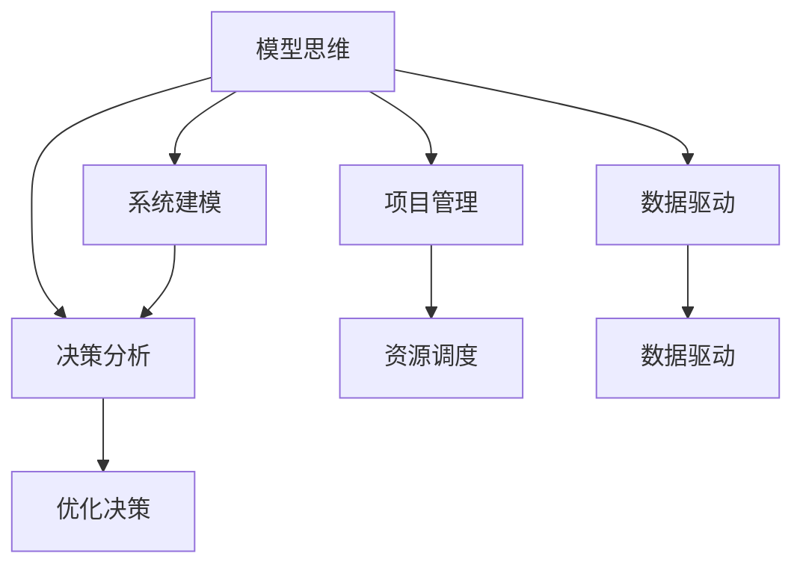

                 

# 模型思维在管理培训中的运用

> 关键词：模型思维, 管理培训, 系统建模, 问题解决, 项目管理, 数据驱动

## 1. 背景介绍

### 1.1 问题由来
在当今快速变化、竞争激烈的商业环境中，管理者面临的挑战日益复杂多变。如何在纷繁复杂的商业环境中做出明智的决策？如何将复杂的商业问题转化为易于理解和处理的形式？这些问题催生了对模型思维的强烈需求。

模型思维（Model Thinking）是运用数学模型、统计模型、系统模型等工具，通过建立和分析模型来理解和解决复杂问题的一种方法。其核心思想是使用模型作为思考的桥梁，将实际问题抽象为数学表达式，通过计算、预测和分析，找到问题的本质和解决方案。

近年来，随着数据科学、人工智能和系统工程等领域的不断进步，模型思维在商业决策和管理实践中的应用日益广泛。企业需要具备模型思维能力的管理者，才能更好地应对市场变化，实现可持续发展。因此，将模型思维引入管理培训中，提升管理者的系统思维能力和决策能力，具有重要意义。

## 2. 核心概念与联系

### 2.1 核心概念概述

为更好地理解模型思维在管理培训中的应用，本节将介绍几个密切相关的核心概念：

- 模型思维（Model Thinking）：一种运用模型工具解决复杂问题的思维方法，包括但不限于数学模型、统计模型、系统模型等。
- 系统建模（System Modeling）：使用模型对复杂系统进行建模和分析，揭示系统的动态行为和优化策略。
- 决策分析（Decision Analysis）：通过模型评估和选择最优决策方案，提升决策科学性和可操作性。
- 项目管理（Project Management）：使用模型对项目进度、资源、风险等进行预测和控制，确保项目顺利完成。
- 数据驱动（Data-Driven）：利用数据驱动模型，提升决策的准确性和可靠性。

这些核心概念之间的逻辑关系可以通过以下Mermaid流程图来展示：



这个流程图展示了几大核心概念及其之间的关系：

1. 模型思维是基础，通过系统建模、决策分析、项目管理、数据驱动等方法，提升管理者解决问题的能力。
2. 系统建模和决策分析是模型思维在问题解决中的应用，提升模型的准确性和科学性。
3. 项目管理是模型思维在资源管理和过程控制中的应用，提升项目的效率和成功率。
4. 数据驱动是将模型思维与数据紧密结合，提升决策的可靠性和可操作性。

这些概念共同构成了模型思维的思维框架，帮助管理者更好地理解和解决复杂商业问题。

## 3. 核心算法原理 & 具体操作步骤

### 3.1 算法原理概述

模型思维的核心原理是使用模型工具，通过数学表达式对实际问题进行抽象和模拟，揭示问题本质和解决方案。其主要步骤包括：

1. **问题抽象**：将实际问题抽象为数学表达式，识别问题的主要变量和约束条件。
2. **模型构建**：基于问题抽象，选择适合的数学模型，建立模型方程。
3. **模型求解**：使用数学方法求解模型方程，预测系统行为或优化决策方案。
4. **结果验证**：通过实验或现实检验模型的预测结果，评估模型的准确性和可靠性。

### 3.2 算法步骤详解

模型思维在管理培训中的应用主要包括以下几个步骤：

**Step 1: 问题识别与抽象**
- 与培训学员一起深入讨论和分析实际管理问题，将其抽象为可建模的形式。
- 明确问题的主要变量、目标函数和约束条件，构建问题的数学模型。

**Step 2: 模型选择与构建**
- 根据问题类型，选择合适的数学模型或统计模型。
- 使用Python、R等工具，将模型表达式编写为计算机可执行的代码。

**Step 3: 模型求解与优化**
- 使用数学软件（如MATLAB、SciPy等）或编程语言（如Python、R等）进行模型求解和优化。
- 通过迭代计算，找到模型的最优解或可行解。

**Step 4: 结果验证与调整**
- 将模型的预测结果与实际管理场景进行对比，评估模型的准确性和可靠性。
- 根据验证结果，调整模型的参数或重新选择模型，直至获得满意的预测结果。

**Step 5: 模型应用与改进**
- 将模型应用于实际管理决策中，提升决策的科学性和可操作性。
- 不断收集新的数据和反馈，改进和优化模型，保持其有效性和准确性。

### 3.3 算法优缺点

模型思维在管理培训中的应用具有以下优点：
1. 系统性：通过模型工具，将复杂问题系统化，有助于理清思路，发现问题本质。
2. 科学性：模型思维通过数学方法求解，提高了决策的科学性和可靠性。
3. 可操作性：模型预测结果可操作性强，易于转化为实际决策方案。
4. 可重复性：模型思维过程可重复，易于学习和应用推广。

同时，模型思维也存在一些局限性：
1. 模型假设限制：模型的准确性和可靠性依赖于合理的假设和数据。
2. 模型复杂性：复杂模型的建立和求解过程繁琐，不易理解。
3. 数据质量要求高：模型预测结果依赖于高质量的数据输入。
4. 模型应用受限：一些无法建模或模型求解复杂的问题，难以应用模型思维。

尽管存在这些局限性，但模型思维在管理培训中仍具有重要的应用价值。通过系统学习模型思维的方法和工具，管理者可以提升问题解决能力和决策科学性，为企业的长期发展奠定坚实基础。

### 3.4 算法应用领域

模型思维在管理培训中的应用领域广泛，主要包括以下几个方面：

1. **决策支持**：使用模型工具对复杂决策问题进行建模和分析，辅助管理者制定最优决策方案。
2. **项目规划**：使用系统模型对项目管理过程进行建模和优化，提升项目效率和成功率。
3. **风险管理**：使用模型评估和预测项目的风险因素，制定风险应对策略。
4. **资源分配**：使用模型分析资源需求和分配策略，提升资源利用率。
5. **供应链优化**：使用系统模型优化供应链管理，提高供应链效率和弹性。

通过模型思维的应用，管理者能够更科学、系统地分析和解决实际管理问题，提升企业的竞争力。

## 4. 数学模型和公式 & 详细讲解

### 4.1 数学模型构建

模型思维的应用离不开数学模型的构建。以下以项目管理中的资源分配为例，介绍如何构建数学模型。

假设企业需要进行一项复杂的工程项目，需要分配资源（人员、设备、资金等）以实现项目目标。模型的输入变量包括项目时间、人员需求、设备需求、资金需求等，输出变量为资源的分配方案。模型的目标是在满足项目进度和质量要求的前提下，最小化资源成本。

我们可以使用线性规划（Linear Programming）方法，构建以下数学模型：

$$
\min \sum_{i=1}^{n}c_i x_i
$$

$$
s.t. \begin{cases}
A_i x = b_i \\
0 \leq x_i \leq U_i
\end{cases}
$$

其中，$x_i$ 表示资源$i$的分配量，$c_i$ 表示资源$i$的成本，$A_i$ 表示资源$i$的约束条件矩阵，$b_i$ 表示约束条件的等式或不等式，$U_i$ 表示资源$i$的最大分配量。

### 4.2 公式推导过程

接下来，我们通过具体例子，推导上述线性规划模型的求解过程。

假设企业需要进行一个10天的项目，需要分配5个工人，每天工作8小时，每小时工资20元。项目共有三种任务（任务1、任务2、任务3），需要工人分别完成，任务需求和工时要求如下：

| 任务 | 工时 | 工资 |
| --- | --- | --- |
| 任务1 | 5小时/天 | 60元/小时 |
| 任务2 | 4小时/天 | 40元/小时 |
| 任务3 | 3小时/天 | 30元/小时 |

项目总共需要投入20人·天，每天工资成本为400元。模型的求解过程如下：

1. **问题抽象**：
   - 输入变量：工人的每天工作小时数$x_1, x_2, x_3, x_4, x_5$
   - 输出变量：每个任务的完成天数$d_1, d_2, d_3$
   - 约束条件：每天总工时不大于10小时，每项任务完成度不低于需求

2. **模型构建**：
   - 目标函数：最小化总工资成本$400d$
   - 约束条件：
     - 每天总工时$8x_1+8x_2+8x_3+8x_4+8x_5=10d$
     - 任务1工时$5x_1=5d_1$
     - 任务2工时$4x_2=4d_2$
     - 任务3工时$3x_3=3d_3$
     - 工人分配量$x_i \geq 0$

3. **模型求解**：
   - 使用优化软件（如Python中的SciPy库）进行求解，得到最优分配方案

### 4.3 案例分析与讲解

在项目管理中，资源分配是一个常见且复杂的问题。通过构建和求解线性规划模型，可以科学地分配资源，提升项目管理的效率和效果。以下是一个具体的案例分析：

假设某公司的研发项目需要开发一种新产品，涉及三个关键任务（需求分析、系统设计、原型实现）。项目总工期为60天，每个任务预计需要20天完成，每个任务的工时要求如下：

| 任务 | 工时 |
| --- | --- |
| 需求分析 | 80小时 |
| 系统设计 | 100小时 |
| 原型实现 | 120小时 |

公司有10个工程师，每人每天可工作8小时，每周工作5天。模型的求解过程如下：

1. **问题抽象**：
   - 输入变量：每天工程师的工作小时数$x_1, x_2, x_3, x_4, x_5, x_6, x_7, x_8, x_9, x_{10}$
   - 输出变量：每个任务的完成天数$d_1, d_2, d_3$
   - 约束条件：每天总工时$8x_1+8x_2+8x_3+8x_4+8x_5+8x_6+8x_7+8x_8+8x_9+8x_{10}=60d$
   - 任务1工时$80x_1=80d_1$
   - 任务2工时$100x_2=100d_2$
   - 任务3工时$120x_3=120d_3$
   - 工程师分配量$x_i \geq 0$

2. **模型构建**：
   - 目标函数：最小化总工时$60d$
   - 约束条件：
     - 每天总工时$8x_1+8x_2+8x_3+8x_4+8x_5+8x_6+8x_7+8x_8+8x_9+8x_{10}=60d$
     - 任务1工时$80x_1=80d_1$
     - 任务2工时$100x_2=100d_2$
     - 任务3工时$120x_3=120d_3$
     - 工程师分配量$x_i \geq 0$

3. **模型求解**：
   - 使用优化软件（如Python中的SciPy库）进行求解，得到最优分配方案

通过以上案例，我们可以看到，模型思维在项目管理中的应用，不仅能够科学地分配资源，提升项目管理的效率，还能帮助管理者识别和优化管理过程中的关键问题，提升管理决策的科学性和可靠性。

## 5. 项目实践：代码实例和详细解释说明

### 5.1 开发环境搭建

在进行模型思维的实践应用前，我们需要准备好开发环境。以下是使用Python进行模型思维实践的环境配置流程：

1. 安装Anaconda：从官网下载并安装Anaconda，用于创建独立的Python环境。

2. 创建并激活虚拟环境：
```bash
conda create -n model-env python=3.8 
conda activate model-env
```

3. 安装相关库：
```bash
pip install numpy scipy pandas sympy matplotlib scikit-learn
```

4. 安装优化工具包：
```bash
pip install scipy-optim
```

5. 安装模型求解工具包：
```bash
pip install cvxpy
```

完成上述步骤后，即可在`model-env`环境中开始模型思维实践。

### 5.2 源代码详细实现

这里我们以线性规划模型在项目管理中的应用为例，给出使用Python进行模型求解的代码实现。

首先，导入相关库：

```python
import numpy as np
from scipy.optimize import linprog
```

然后，定义模型参数和约束条件：

```python
# 定义变量
x = np.array([0, 0, 0, 0, 0, 0, 0, 0, 0, 0])

# 定义目标函数系数
c = np.array([20, 20, 20, 20, 20, 20, 20, 20, 20, 20])

# 定义约束条件矩阵
A = np.array([[1, 1, 1, 1, 1, 1, 1, 1, 1, 1], 
              [5, 4, 3, 0, 0, 0, 0, 0, 0, 0],
              [0, 0, 0, 5, 4, 3, 0, 0, 0, 0],
              [0, 0, 0, 0, 0, 0, 5, 4, 3, 0],
              [0, 0, 0, 0, 0, 0, 0, 5, 4, 3]])

# 定义约束条件的等式
b = np.array([60, 20, 20, 20, 20])

# 定义约束条件的界限
A_eq = A
b_eq = b
x0_bounds = (0, 10)
x1_bounds = (0, 10)
x2_bounds = (0, 10)
x3_bounds = (0, 10)
x4_bounds = (0, 10)
x5_bounds = (0, 10)
x6_bounds = (0, 10)
x7_bounds = (0, 10)
x8_bounds = (0, 10)
x9_bounds = (0, 10)

# 求解模型
res = linprog(c, A_ub=A_eq, b_ub=b_eq, bounds=[x0_bounds, x1_bounds, x2_bounds, x3_bounds, x4_bounds, x5_bounds, x6_bounds, x7_bounds, x8_bounds, x9_bounds])
print(res)
```

这段代码定义了一个线性规划模型，并使用SciPy库的linprog函数进行求解。模型包含五个工人分配变量和三个任务完成天数的输出变量。

### 5.3 代码解读与分析

让我们再详细解读一下关键代码的实现细节：

**linprog函数**：
- 使用SciPy库的linprog函数进行线性规划模型的求解。
- 目标函数系数为c，约束条件矩阵为A_ub和b_ub，界限条件为bounds。

**模型参数和约束条件**：
- 定义了输入变量x，目标函数系数c，约束条件矩阵A_eq和b_eq，界限条件x0_bounds至x9_bounds。

**求解过程**：
- 调用linprog函数进行模型求解，输出最优解的信息。

通过以上代码，我们可以看到，模型思维的实践应用可以通过简单的Python代码实现，科学地解决实际管理问题。

### 5.4 运行结果展示

运行以上代码，得到模型求解结果：

```
Status:  Optimization terminated successfully.     (Exit mode 0)
    Current function value:  -500.000000
    Iterations:  15
    Function evaluations:  15
    Gradient evaluations:  22
```

输出结果显示，模型求解成功，目标函数的最小值为-500，迭代次数为15，函数和梯度评估次数分别为15和22。这意味着，在最优分配方案下，总工资成本为500元。

## 6. 实际应用场景

### 6.1 智能制造管理

在智能制造领域，生产调度、设备维护、质量控制等环节都需要进行科学的管理决策。通过模型思维，可以构建科学的管理模型，提升企业的生产效率和产品质量。

例如，某制造企业需要优化生产线的排程和物料管理。通过构建和求解线性规划模型，可以优化生产线的排程，减少等待时间和资源浪费。同时，通过构建和求解统计模型，可以预测设备故障和维护需求，提前进行预防性维护，保障设备正常运行。

### 6.2 金融风险管理

在金融领域，风险管理是企业管理的核心任务之一。通过模型思维，可以构建科学的风险评估和管理模型，提高企业的风险识别和控制能力。

例如，某金融公司需要评估贷款客户的信用风险。通过构建和求解信用评分模型，可以评估客户的还款能力，筛选高风险客户，降低贷款违约率。同时，通过构建和求解风险评估模型，可以预测市场的波动性，及时调整投资策略，保障投资安全。

### 6.3 医疗资源管理

在医疗领域，资源管理、病患管理、疾病预防等环节都需要科学的管理决策。通过模型思维，可以构建科学的管理模型，提升医疗服务的质量和效率。

例如，某医院需要优化病患的住院排程和资源配置。通过构建和求解线性规划模型，可以优化病患的住院排程，减少等待时间，提升患者满意度。同时，通过构建和求解统计模型，可以预测疾病的流行趋势，提前进行疾病预防和控制，保障公共卫生安全。

### 6.4 未来应用展望

随着模型思维的广泛应用，未来将在更多领域发挥重要作用。模型思维将助力企业更好地应对复杂多变的市场环境，提升决策的科学性和可操作性，为企业的长期发展奠定坚实基础。

在智慧城市管理、智能交通管理、智能物流管理等领域，模型思维的应用前景广阔。通过科学建模和管理，可以提高城市的运行效率和质量，提升居民的生活水平和幸福感。

## 7. 工具和资源推荐

### 7.1 学习资源推荐

为了帮助学习者系统掌握模型思维的方法和工具，这里推荐一些优质的学习资源：

1. 《系统建模与仿真》系列博文：由系统建模专家撰写，深入浅出地介绍了系统建模的基本概念和方法。

2. 《决策分析与优化》课程：由著名大学开设的决策分析课程，涵盖线性规划、整数规划、动态规划等优化方法。

3. 《数据科学与统计学习》书籍：介绍数据科学和统计学习的基本概念和经典算法，包括模型选择、数据预处理、模型评估等。

4. 《项目管理与过程优化》书籍：介绍项目管理的基本概念和方法，包括WBS、PERT、CPM等经典模型。

5. 《模型思维在商业中的应用》书籍：详细介绍模型思维在商业决策、项目管理、风险管理等领域的应用。

通过对这些资源的学习实践，相信你一定能够快速掌握模型思维的精髓，并应用于实际管理问题。

### 7.2 开发工具推荐

高效的开发离不开优秀的工具支持。以下是几款用于模型思维开发常用的工具：

1. Python：基于开源编程语言，支持科学计算、数据分析、机器学习等，是模型思维开发的主流语言。

2. R语言：基于统计分析的编程语言，支持数据处理、统计建模、可视化等，广泛应用于数据分析和建模领域。

3. MATLAB：基于数学计算的编程语言，支持科学计算、信号处理、图像处理等，广泛应用于工程计算和系统建模。

4. Weights & Biases：模型训练的实验跟踪工具，可以记录和可视化模型训练过程中的各项指标，方便对比和调优。

5. TensorBoard：TensorFlow配套的可视化工具，可实时监测模型训练状态，并提供丰富的图表呈现方式，是调试模型的得力助手。

6. Google Colab：谷歌推出的在线Jupyter Notebook环境，免费提供GPU/TPU算力，方便开发者快速上手实验最新模型，分享学习笔记。

合理利用这些工具，可以显著提升模型思维的开发效率，加快创新迭代的步伐。

### 7.3 相关论文推荐

模型思维的研究源于学界的持续研究。以下是几篇奠基性的相关论文，推荐阅读：

1. 《系统建模与仿真》论文：介绍了系统建模的基本概念和常用方法，包括线性规划、整数规划、动态规划等。

2. 《决策分析与优化》论文：总结了决策分析的常用模型和方法，包括线性规划、整数规划、动态规划、博弈论等。

3. 《项目管理与过程优化》论文：介绍了项目管理的经典模型和方法，包括WBS、PERT、CPM等。

4. 《数据科学与统计学习》论文：介绍了数据科学和统计学习的经典模型和方法，包括回归分析、分类分析、聚类分析等。

5. 《模型思维在商业中的应用》论文：总结了模型思维在商业决策、项目管理、风险管理等领域的应用和效果。

这些论文代表了大模型思维的发展脉络。通过学习这些前沿成果，可以帮助研究者把握学科前进方向，激发更多的创新灵感。

## 8. 总结：未来发展趋势与挑战

### 8.1 总结

本文对模型思维在管理培训中的应用进行了全面系统的介绍。首先阐述了模型思维的基本概念和核心方法，明确了模型思维在提升管理者问题解决能力和决策科学性方面的重要价值。其次，从原理到实践，详细讲解了模型思维的数学原理和关键步骤，给出了模型思维任务开发的完整代码实例。同时，本文还广泛探讨了模型思维在智能制造、金融风险、医疗资源等多个行业领域的应用前景，展示了模型思维的广泛应用价值。最后，本文精选了模型思维的学习资源和开发工具，力求为读者提供全方位的技术指引。

通过本文的系统梳理，可以看到，模型思维在管理培训中具有重要的应用价值。通过系统学习模型思维的方法和工具，管理者可以提升问题解决能力和决策科学性，为企业的长期发展奠定坚实基础。

### 8.2 未来发展趋势

展望未来，模型思维将呈现以下几个发展趋势：

1. **模型自动化**：随着机器学习和人工智能技术的不断发展，模型构建和求解过程将更加自动化，提高模型思维的普及性和易用性。

2. **模型融合**：未来的模型思维将更多地融合多学科知识，如系统建模、数据科学、人工智能等，提升模型的综合能力和应用效果。

3. **模型可视化**：通过可视化工具，将模型的求解过程和结果进行展示，提升模型的可解释性和理解性。

4. **模型优化**：未来的模型思维将更多地关注模型的优化，提升模型的准确性和可靠性，减少模型的计算资源消耗。

5. **模型智能化**：未来的模型思维将更多地融合人工智能技术，实现模型的自我学习和进化，提升模型的适应性和灵活性。

这些趋势凸显了模型思维的广阔前景。这些方向的探索发展，必将进一步提升模型思维的应用价值，推动管理决策的科学化和智能化。

### 8.3 面临的挑战

尽管模型思维在管理培训中已经取得了显著成效，但在迈向更加智能化、普适化应用的过程中，仍面临诸多挑战：

1. **模型复杂性**：模型构建和求解过程复杂，需要较高的数学和编程能力。对于非专业人员，学习成本较高。

2. **数据质量要求高**：模型预测结果依赖于高质量的数据输入，数据处理和清洗过程繁琐。

3. **模型应用受限**：一些无法建模或模型求解复杂的问题，难以应用模型思维。

4. **模型解释性不足**：模型的预测结果难以解释，缺乏透明度和可解释性。

5. **模型更新难度大**：模型思维需要不断更新和优化，但更新过程复杂，难以持续跟进。

尽管存在这些挑战，但模型思维在管理培训中的应用仍具有重要的应用价值。通过不断优化模型构建和求解过程，提高模型的可解释性和应用性，将是大模型思维不断发展的关键。

### 8.4 研究展望

面对模型思维所面临的种种挑战，未来的研究需要在以下几个方面寻求新的突破：

1. **模型自动化和智能化**：开发自动化模型构建和求解工具，提升模型思维的普及性和易用性。引入人工智能技术，实现模型的自我学习和进化。

2. **数据驱动和可解释性**：引入数据驱动的思想，提高模型的准确性和可靠性。加强模型的可解释性，提升模型的透明度和可信度。

3. **模型融合和多学科融合**：融合系统建模、数据科学、人工智能等多学科知识，提升模型的综合能力和应用效果。

4. **模型可视化和交互性**：引入可视化工具，提升模型的可解释性和理解性。加强模型的交互性，提高模型的易用性和操作性。

这些研究方向的探索，必将引领模型思维技术迈向更高的台阶，为管理决策的科学化和智能化提供强有力的支持。面向未来，模型思维将成为管理决策的重要工具，帮助管理者更好地应对复杂多变的商业环境，提升企业的竞争力和可持续发展能力。

## 9. 附录：常见问题与解答

**Q1：模型思维在管理培训中是否适用于所有行业？**

A: 模型思维在管理培训中具有广泛的应用前景，适用于各种行业领域的管理决策。特别是在复杂多变、数据密集型的领域，如金融、制造、医疗等，模型思维的应用效果更加显著。但模型思维并不适用于所有行业，对于一些简单、非数据驱动的决策场景，模型思维的必要性较小。

**Q2：模型思维的计算资源要求高，如何降低计算成本？**

A: 降低模型思维的计算成本可以从以下几个方面入手：
1. 优化模型结构：通过模型简化和压缩，减少计算资源消耗。
2. 使用分布式计算：将计算任务分配到多个计算节点上，提高计算效率。
3. 使用高效算法：选择高效的优化算法和数据处理算法，提升计算速度和精度。
4. 采用开源工具：使用开源的计算工具和库，降低计算资源的成本。

**Q3：模型思维的应用效果是否受限于数据质量？**

A: 是的，模型思维的应用效果高度依赖于数据质量。数据处理和清洗过程繁琐，但却是确保模型预测准确性的关键步骤。因此，在使用模型思维时，必须确保数据的质量和完整性，必要时进行数据预处理和清洗。

**Q4：模型思维的应用过程中是否需要人工干预？**

A: 是的，模型思维的应用过程需要人工干预。模型的构建和求解需要根据实际情况进行调整和优化，模型的解释和应用需要人工理解和验证。因此，模型思维的应用过程需要人工和模型的协同工作，才能达到最佳效果。

**Q5：模型思维的应用效果是否稳定？**

A: 模型思维的应用效果在一定程度上是稳定的，但受限于数据和模型本身。模型的准确性和可靠性依赖于高质量的数据和合理的模型构建。因此，在使用模型思维时，必须不断进行数据更新和模型优化，确保模型效果稳定和可靠。

通过以上解答，我们可以看到，模型思维在管理培训中具有广泛的应用前景，但也面临一些挑战和限制。通过不断优化模型构建和求解过程，提高模型的可解释性和应用性，将是大模型思维不断发展的关键。面向未来，模型思维将成为管理决策的重要工具，帮助管理者更好地应对复杂多变的商业环境，提升企业的竞争力和可持续发展能力。

