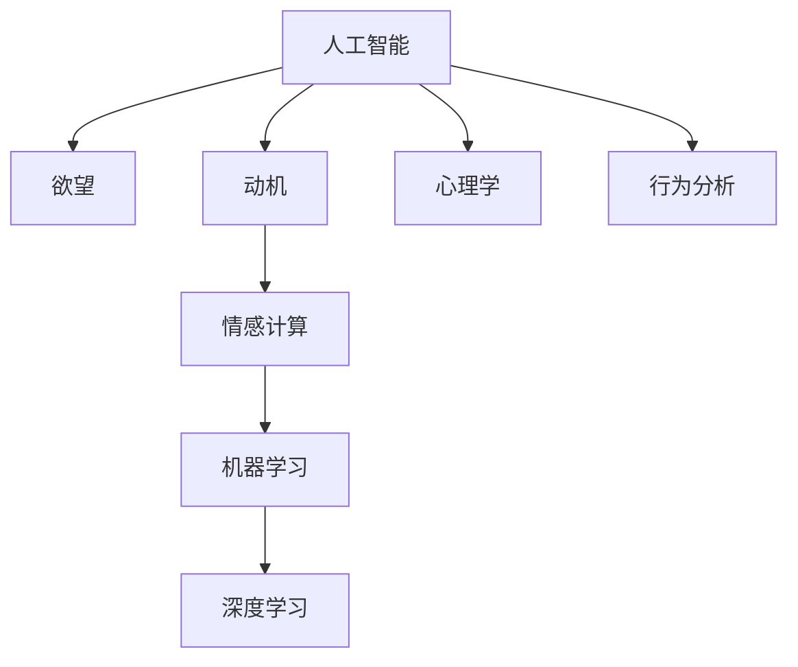

                 

# 欲望地图：AI绘制的人类动机蓝图

> 关键词：人工智能,欲望,动机,情感计算,机器学习,深度学习,心理学,行为分析

## 1. 背景介绍

### 1.1 问题由来
随着人工智能(AI)技术的迅猛发展，AI已经不再只是冷冰冰的算法和代码，而是开始涉足人类的情感和动机领域。如何从数据中识别出人类的欲望和动机，让AI更加贴近人类，成为了人工智能领域新的研究热点。

### 1.2 问题核心关键点
欲望和动机是人类行为背后的重要驱动力，对AI来说，准确识别和理解这些欲望和动机，能够使其在服务推荐、广告投放、游戏设计等诸多领域发挥更大的作用。本文将详细探讨AI如何绘制欲望地图，通过分析人类行为数据，绘制出一幅“动机蓝图”，以此指导AI系统的设计。

### 1.3 问题研究意义
1. 提升用户体验：通过理解用户的欲望和动机，AI系统可以提供更加个性化、符合用户需求的服务，提升用户满意度和体验。
2. 优化广告效果：广告投放不再是盲目的，而是精准到用户的兴趣点和需求，提高广告的转化率和ROI。
3. 增强游戏体验：游戏设计可以根据玩家的心理需求，优化游戏内容和场景，提升游戏的吸引力和玩家留存率。
4. 推动科学研究：欲望和动机的AI识别技术可以应用于心理学、行为学等领域，帮助科学家更深入地理解人类行为。

## 2. 核心概念与联系

### 2.1 核心概念概述

为了更好地理解AI如何绘制欲望地图，本节将介绍几个密切相关的核心概念：

- 人工智能(Artificial Intelligence, AI)：通过模拟人类智能，实现智能决策和交互的技术。
- 欲望(Desire)：人类追求的目标或满足的需求，通常与心理状态、生理状态和外部环境密切相关。
- 动机(Motive)：推动人类采取某种行为的内在驱动力，通常是欲望的表现形式。
- 情感计算(Affective Computing)：通过分析人类的情感、情绪、心理状态等信息，模拟人类情感行为的技术。
- 机器学习(Machine Learning)：AI通过算法和模型，从数据中学习并作出预测或决策的技术。
- 深度学习(Deep Learning)：利用深度神经网络，从大量数据中自动学习特征，提升模型性能的技术。
- 心理学(Psychology)：研究人类行为、认知、情感等心理活动的科学。
- 行为分析(Behavioral Analysis)：通过分析人类行为模式，预测未来行为的技术。

这些核心概念之间的逻辑关系可以通过以下Mermaid流程图来展示：



这个流程图展示了大语言模型的核心概念及其之间的关系：

1. 人工智能通过机器学习和深度学习技术，从大量数据中学习到人类欲望和动机的规律。
2. 欲望和动机是人类的基本需求，驱动其行为和决策。
3. 情感计算通过分析人类情感和情绪，更好地理解欲望和动机的来源。
4. 心理学和行为分析提供理论基础，指导AI如何更准确地识别欲望和动机。

这些概念共同构成了AI绘制欲望地图的理论基础，帮助AI系统更加深入地理解人类行为。

## 3. 核心算法原理 & 具体操作步骤
### 3.1 算法原理概述

AI绘制欲望地图的原理，是基于机器学习和大数据技术，从用户行为数据中识别和分析欲望和动机。其核心思想是：通过构建欲望和动机模型，将用户行为转化为欲望和动机标签，以此指导AI系统的设计。

具体而言，假设用户行为数据集为 $D=\{(x_i,y_i)\}_{i=1}^N$，其中 $x_i$ 为用户行为数据，$y_i$ 为欲望和动机标签。AI的目标是训练一个模型 $M$，使得在新的用户行为数据 $x$ 上，模型能够准确预测其欲望和动机 $y$。

这个目标可以表述为：

$$
M(y|x)=\mathop{\arg\max}_{y} P(y|x)
$$

其中 $P(y|x)$ 是模型在给定行为数据 $x$ 下，输出欲望和动机标签 $y$ 的概率。

### 3.2 算法步骤详解

基于机器学习绘制欲望地图的算法步骤如下：

**Step 1: 数据预处理**
- 收集用户行为数据，包括用户点击、购买、搜索、浏览等行为数据。
- 对行为数据进行清洗和预处理，去除噪声和异常值。
- 将用户行为数据转换为数值化特征，如用户ID、时间戳、浏览时长、点击位置等。

**Step 2: 特征工程**
- 设计特征工程流程，提取有意义的特征。例如，使用TF-IDF、LDA等算法提取文本特征，使用时间序列分析提取时间特征。
- 选择合适的特征表示方法，如独热编码、嵌入向量等。

**Step 3: 模型训练**
- 选择合适的机器学习模型，如决策树、随机森林、支持向量机等，进行模型训练。
- 使用交叉验证等方法，对模型进行调参和优化。
- 在验证集上评估模型性能，选择合适的超参数。

**Step 4: 模型评估**
- 在测试集上对模型进行最终评估，计算准确率、召回率、F1-score等指标。
- 使用混淆矩阵、ROC曲线等方法，分析模型的误判和漏判情况。

**Step 5: 欲望地图绘制**
- 对模型预测结果进行可视化，绘制出欲望和动机标签的分布图。
- 根据欲望和动机标签的分布，识别出用户的核心欲望和动机。
- 结合心理学和行为分析，对欲望和动机进行进一步的解读和分类。

**Step 6: 应用部署**
- 将训练好的模型部署到实际应用系统中，用于指导AI系统的设计。
- 持续收集用户反馈和新数据，对欲望地图进行更新和优化。

### 3.3 算法优缺点

基于机器学习绘制欲望地图的方法具有以下优点：
1. 模型可解释性强：通过特征工程和模型调参，能够较为准确地解释欲望和动机的来源。
2. 数据适应性好：能够适应不同类型的用户行为数据，应用范围广泛。
3. 效果显著：在实际应用中，欲望地图能够显著提升用户体验和服务质量。

同时，该方法也存在一定的局限性：
1. 数据质量依赖度高：模型效果取决于数据的质量和完整性，收集到的数据偏差将影响模型效果。
2. 模型复杂度高：特征工程和模型调参过程复杂，需要丰富的经验和专业知识。
3. 隐私风险：在用户行为数据中挖掘欲望和动机，可能涉及用户隐私保护问题。

尽管存在这些局限性，但就目前而言，基于机器学习的欲望地图绘制方法仍是大语言模型应用的最主流范式。未来相关研究的重点在于如何进一步降低数据质量的影响，提高模型的自适应能力和隐私保护措施，同时兼顾可解释性和实际效果。

### 3.4 算法应用领域

基于欲望地图的机器学习方法，在AI系统的设计和优化上已经得到了广泛的应用，覆盖了广告推荐、游戏设计、智能客服等多个领域：

1. 广告推荐系统：根据用户的欲望和动机，推荐其感兴趣的商品和内容，提高广告的点击率和转化率。
2. 游戏设计：通过分析玩家的欲望和动机，设计更具吸引力的游戏内容和场景，提升玩家的游戏体验和留存率。
3. 智能客服：通过识别用户的欲望和动机，智能回答用户的咨询问题，提升客户满意度和服务效率。
4. 金融理财：分析用户的投资欲望和风险偏好，提供个性化的理财方案和投资建议。

除了上述这些经典应用外，欲望地图技术还被创新性地应用到更多场景中，如社交网络、电子商务、智能家居等，为AI系统带来了新的突破。随着欲望地图技术的不断进步，相信AI系统将在更多领域实现智能化，更好地服务于人类社会。

## 4. 数学模型和公式 & 详细讲解  
### 4.1 数学模型构建

本节将使用数学语言对欲望地图的绘制过程进行更加严格的刻画。

假设用户行为数据集为 $D=\{(x_i,y_i)\}_{i=1}^N$，其中 $x_i$ 为用户行为数据，$y_i$ 为欲望和动机标签。定义模型 $M$ 在给定行为数据 $x$ 下，输出欲望和动机标签 $y$ 的概率为：

$$
P(y|x) = \frac{P(x|y)P(y)}{P(x)}
$$

其中 $P(y)$ 是欲望和动机标签 $y$ 的先验概率，$P(x|y)$ 是给定标签 $y$ 下，行为数据 $x$ 的概率，$P(x)$ 是所有标签下行为数据的概率。

模型的训练目标是最小化交叉熵损失函数：

$$
\mathcal{L}(M) = -\frac{1}{N}\sum_{i=1}^N \sum_{y \in \mathcal{Y}} y_i \log P(y|x_i)
$$

其中 $\mathcal{Y}$ 为欲望和动机标签的集合。

### 4.2 公式推导过程

以下我们以广告推荐系统为例，推导欲望地图绘制的数学公式。

假设用户浏览了N个网页，每个网页的ID为 $x_i$，对应的广告点击概率为 $y_i$。广告点击概率与用户欲望和动机标签 $y$ 有关，可以通过逻辑回归模型 $M$ 来预测：

$$
P(y_i|x_i) = \sigma(\sum_{k=1}^K w_k f_k(x_i) + b)
$$

其中 $w_k$ 为逻辑回归模型的参数，$f_k(x_i)$ 为特征工程提取的特征，$K$ 为特征数量，$\sigma$ 为逻辑函数。

根据贝叶斯公式，计算条件概率 $P(y|x)$ 的表达式为：

$$
P(y|x) = \frac{P(x|y)P(y)}{P(x)}
$$

通过最大化条件概率 $P(y|x)$，可以确定用户欲望和动机标签 $y$。具体的，通过最大化 $P(y|x)$ 的期望：

$$
\hat{y} = \mathop{\arg\max}_{y} \mathbb{E}_{P(x|y)}[\log P(y|x)]
$$

最终，通过最大化交叉熵损失函数，求解模型参数 $w_k$ 和 $b$：

$$
\min_{w_k,b} \mathcal{L}(M) = -\frac{1}{N}\sum_{i=1}^N \sum_{y \in \mathcal{Y}} y_i \log P(y|x_i)
$$

在得到模型参数后，即可对新的用户行为数据进行预测，绘制出欲望地图。

### 4.3 案例分析与讲解

**案例1：广告推荐系统**

广告推荐系统的核心目标是，根据用户的浏览和点击行为，推荐其感兴趣的商品和广告。通过欲望地图，可以识别出用户的核心欲望和动机，从而精准推荐相关广告。

具体而言，可以收集用户浏览和点击历史数据，将其转换为特征数据。使用逻辑回归模型训练欲望地图，得到用户欲望和动机的预测概率。例如，用户对运动鞋的兴趣高，系统可以推荐运动鞋相关的商品广告。

**案例2：游戏设计**

游戏设计中的欲望地图，可以帮助开发者更好地理解玩家的心理需求和行为模式，从而设计更具吸引力的游戏内容。

例如，通过分析玩家在游戏中的行为数据，可以发现玩家对角色战斗、社交互动、成就系统的需求和动机。根据这些信息，可以优化游戏内容和场景，提升玩家的体验和留存率。

**案例3：智能客服**

智能客服中的欲望地图，可以用于识别用户的需求和情绪状态，从而提供更精准的服务。例如，用户咨询健康问题，系统可以根据欲望地图识别出用户对健康咨询的需求，提供专业的健康建议和医疗资源。

## 5. 项目实践：代码实例和详细解释说明
### 5.1 开发环境搭建

在进行欲望地图绘制实践前，我们需要准备好开发环境。以下是使用Python进行Scikit-Learn开发的环境配置流程：

1. 安装Anaconda：从官网下载并安装Anaconda，用于创建独立的Python环境。

2. 创建并激活虚拟环境：
```bash
conda create -n desire-map python=3.8 
conda activate desire-map
```

3. 安装Scikit-Learn：
```bash
pip install scikit-learn
```

4. 安装各类工具包：
```bash
pip install numpy pandas scikit-learn matplotlib tqdm jupyter notebook ipython
```

完成上述步骤后，即可在`desire-map`环境中开始欲望地图绘制实践。

### 5.2 源代码详细实现

下面我们以广告推荐系统为例，给出使用Scikit-Learn库对逻辑回归模型进行训练的PyTorch代码实现。

首先，定义广告推荐的数据处理函数：

```python
from sklearn.linear_model import LogisticRegression
from sklearn.model_selection import train_test_split
import pandas as pd

def load_data(file_path):
    data = pd.read_csv(file_path)
    return data

def process_data(data):
    X = data[['click', 'buy', 'time', 'age', 'gender', 'location']]
    y = data['ad']
    return X, y

def train_model(X, y, test_size=0.2, random_state=42):
    X_train, X_test, y_train, y_test = train_test_split(X, y, test_size=test_size, random_state=random_state)
    model = LogisticRegression(max_iter=1000)
    model.fit(X_train, y_train)
    return model, X_test, y_test

def evaluate_model(model, X_test, y_test):
    y_pred = model.predict_proba(X_test)[:, 1]
    print(classification_report(y_test, y_pred.round()))

# 加载广告数据
data = load_data('ad_data.csv')

# 处理数据
X, y = process_data(data)

# 训练模型
model, X_test, y_test = train_model(X, y)

# 评估模型
evaluate_model(model, X_test, y_test)
```

然后，定义广告推荐系统的欲望地图绘制函数：

```python
def generate_desire_map(model, X, y):
    y_pred = model.predict_proba(X)
    y_prob = np.argmax(y_pred, axis=1)
    desire_map = pd.DataFrame({'user_id': data['user_id'], 'desire': y_prob})
    return desire_map
```

最后，启动训练流程并在测试集上评估：

```python
# 生成欲望地图
desire_map = generate_desire_map(model, X, y)

# 保存欲望地图
desire_map.to_csv('desire_map.csv', index=False)
```

以上就是使用Scikit-Learn对逻辑回归模型进行广告推荐系统欲望地图绘制的完整代码实现。可以看到，Scikit-Learn提供的强大模型和工具，使得欲望地图绘制的代码实现变得简洁高效。

### 5.3 代码解读与分析

让我们再详细解读一下关键代码的实现细节：

**广告推荐系统代码：**
- `load_data`方法：从CSV文件中加载广告数据。
- `process_data`方法：处理广告数据，将特征和标签分开。
- `train_model`方法：使用训练集数据训练逻辑回归模型，返回模型和测试集数据。
- `evaluate_model`方法：在测试集上评估模型性能，输出分类报告。

**欲望地图绘制代码：**
- `generate_desire_map`方法：使用训练好的模型，对用户行为数据进行欲望预测，生成欲望地图。
- 欲望地图保存为CSV文件，便于后续分析和使用。

通过代码的实现和分析，可以看到，Scikit-Learn提供的模型和工具使得欲望地图绘制的过程变得简单易懂。开发者可以根据实际需求，灵活调整模型参数和特征工程流程，以得到更好的结果。

## 6. 实际应用场景
### 6.1 智能客服系统

基于欲望地图的智能客服系统，可以用于识别用户的需求和情绪状态，从而提供更加精准的服务。例如，用户咨询健康问题，系统可以根据欲望地图识别出用户对健康咨询的需求，提供专业的健康建议和医疗资源。

在技术实现上，可以收集用户的历史咨询记录和行为数据，将其转换为特征数据。使用逻辑回归模型训练欲望地图，得到用户欲望和动机的预测概率。例如，用户对健康咨询的需求高，系统可以推荐相关健康建议和医疗资源。

### 6.2 金融理财

金融理财中的欲望地图，可以帮助理财师更好地理解客户的投资需求和风险偏好，从而提供个性化的理财方案和投资建议。

例如，通过分析客户的投资行为数据，可以发现客户对高风险投资、稳健投资、多样化投资的需求和动机。根据这些信息，可以设计个性化的理财方案，提升客户的满意度和理财效果。

### 6.3 游戏设计

游戏设计中的欲望地图，可以帮助开发者更好地理解玩家的心理需求和行为模式，从而设计更具吸引力的游戏内容。

例如，通过分析玩家在游戏中的行为数据，可以发现玩家对角色战斗、社交互动、成就系统的需求和动机。根据这些信息，可以优化游戏内容和场景，提升玩家的体验和留存率。

### 6.4 未来应用展望

随着欲望地图技术的不断发展，AI系统将在更多领域实现智能化，更好地服务于人类社会。

在智慧医疗领域，欲望地图可以用于理解病人的治疗需求和心理健康状态，提供更加精准的治疗方案和心理支持。

在智能教育领域，欲望地图可以用于理解学生的学习需求和兴趣爱好，提供个性化的学习资源和辅导服务。

在智慧城市治理中，欲望地图可以用于理解居民的需求和期望，提供更智能化的公共服务和管理方案。

此外，在企业生产、社会治理、文娱传媒等众多领域，欲望地图技术也将不断涌现，为NLP技术带来了新的突破。相信随着欲望地图技术的持续演进，AI系统必将在构建人机协同的智能时代中扮演越来越重要的角色。

## 7. 工具和资源推荐
### 7.1 学习资源推荐

为了帮助开发者系统掌握欲望地图绘制的理论基础和实践技巧，这里推荐一些优质的学习资源：

1. 《机器学习实战》系列博文：由机器学习专家撰写，深入浅出地介绍了机器学习的基本概念和实现方法。
2. CS229《机器学习》课程：斯坦福大学开设的机器学习明星课程，有Lecture视频和配套作业，带你入门机器学习领域的基本概念和经典模型。
3. 《统计学习方法》书籍：李航著，详细介绍了机器学习的基本理论和算法。
4. Kaggle机器学习竞赛：在Kaggle上参与机器学习竞赛，提高数据分析和模型调参能力。
5. Scikit-Learn官方文档：Scikit-Learn官方文档，提供了丰富的机器学习模型和工具，是学习欲望地图绘制的必备资料。

通过对这些资源的学习实践，相信你一定能够快速掌握欲望地图绘制的精髓，并用于解决实际的AI问题。

### 7.2 开发工具推荐

高效的开发离不开优秀的工具支持。以下是几款用于欲望地图绘制开发的常用工具：

1. Scikit-Learn：基于Python的机器学习库，提供了丰富的机器学习模型和工具，适合快速迭代研究。
2. TensorFlow：由Google主导开发的开源深度学习框架，生产部署方便，适合大规模工程应用。
3. PyTorch：基于Python的开源深度学习框架，灵活动态的计算图，适合快速迭代研究。
4. Weights & Biases：模型训练的实验跟踪工具，可以记录和可视化模型训练过程中的各项指标，方便对比和调优。
5. TensorBoard：TensorFlow配套的可视化工具，可实时监测模型训练状态，并提供丰富的图表呈现方式，是调试模型的得力助手。

合理利用这些工具，可以显著提升欲望地图绘制的开发效率，加快创新迭代的步伐。

### 7.3 相关论文推荐

欲望地图绘制技术的快速发展源于学界的持续研究。以下是几篇奠基性的相关论文，推荐阅读：

1. Machine Learning: An Introduction：Tom M. Mitchell著，全面介绍了机器学习的基本概念和算法。
2. Deep Learning：Ian Goodfellow、Yoshua Bengio、Aaron Courville著，详细介绍了深度学习的基本理论和实现方法。
3. A New Frame Work for Modeling the World: Knowledge-Based Inference：Marvin Minsky著，探讨了人工智能的认知基础和知识表示。
4. Machine Learning: The Art and Science of Algorithms that Make Sense of the World：Peter Norvig、Stuart Russell著，深入浅出地介绍了机器学习的基本概念和实现方法。
5. Human-Centered Machine Learning：Dietterich、Grillitsch、Kuhn、Siegelmann著，探讨了机器学习在人类行为分析中的应用。

这些论文代表了大语言模型绘制欲望地图的发展脉络。通过学习这些前沿成果，可以帮助研究者把握学科前进方向，激发更多的创新灵感。

## 8. 总结：未来发展趋势与挑战

### 8.1 总结

本文对基于欲望地图的机器学习绘制方法进行了全面系统的介绍。首先阐述了欲望和动机在大语言模型应用中的重要意义，明确了欲望地图在优化用户体验、提升广告效果、增强游戏体验等方面的独特价值。其次，从原理到实践，详细讲解了欲望地图的数学原理和关键步骤，给出了欲望地图绘制任务开发的完整代码实例。同时，本文还广泛探讨了欲望地图在智能客服、金融理财、游戏设计等多个行业领域的应用前景，展示了欲望地图技术的巨大潜力。

通过本文的系统梳理，可以看到，基于欲望地图的机器学习技术正在成为大语言模型应用的重要范式，极大地拓展了预训练语言模型的应用边界，催生了更多的落地场景。得益于大规模语料的预训练和机器学习技术的深度结合，欲望地图绘制技术将在更多领域发挥作用，为人类认知智能的进化带来深远影响。

### 8.2 未来发展趋势

展望未来，欲望地图绘制技术将呈现以下几个发展趋势：

1. 模型规模持续增大。随着算力成本的下降和数据规模的扩张，预训练语言模型的参数量还将持续增长。超大规模语言模型蕴含的丰富语言知识，有望支撑更加复杂多变的欲望和动机分析。
2. 欲望地图与多模态数据融合。欲望地图不仅包含文本数据，还应融合视觉、语音、行为等多模态信息，提升分析的全面性和准确性。
3. 欲望地图与情感分析结合。通过结合情感分析技术，可以更全面地理解人类的心理状态和情感波动，提高欲望地图的准确性。
4. 实时欲望地图绘制。在实时数据流上，进行欲望地图的动态更新，及时反映用户的最新需求和动机。
5. 欲望地图的跨领域应用。通过在不同领域的应用中积累经验，将欲望地图技术进一步推广到更多垂直行业。

以上趋势凸显了欲望地图绘制技术的广阔前景。这些方向的探索发展，必将进一步提升AI系统的性能和应用范围，为人类认知智能的进化带来深远影响。

### 8.3 面临的挑战

尽管欲望地图绘制技术已经取得了瞩目成就，但在迈向更加智能化、普适化应用的过程中，它仍面临着诸多挑战：

1. 数据质量问题。欲望地图绘制的效果取决于数据的质量和完整性，收集到的数据偏差将影响模型效果。如何确保数据的代表性、全面性，避免样本偏差，将是未来研究的重要方向。
2. 隐私保护问题。在用户行为数据中挖掘欲望和动机，可能涉及用户隐私保护问题。如何在保护隐私的前提下，获取高质量的数据，将是未来的重要挑战。
3. 模型复杂性问题。欲望地图的绘制涉及多领域的知识，模型复杂性高，需要丰富的经验和专业知识。如何简化模型结构，提高模型的可解释性和可调参性，将是未来的研究方向。
4. 模型鲁棒性问题。欲望地图绘制的模型需要在不同的数据分布下保持稳定性和鲁棒性。如何提高模型的泛化能力，避免过拟合，将是未来的重要研究方向。

尽管存在这些挑战，但通过学术界和产业界的共同努力，欲望地图绘制技术必将在未来不断完善，更好地服务于人类社会。

### 8.4 研究展望

面向未来，欲望地图绘制技术的研究需要在以下几个方面寻求新的突破：

1. 引入多领域知识。结合心理学、行为学、社会学等领域的知识，增强欲望地图的准确性和可解释性。
2. 引入跨模态数据。将文本、视觉、听觉等模态的信息融合，提高欲望地图的全面性。
3. 引入情感分析。结合情感分析技术，更好地理解用户的情感状态和行为动机。
4. 引入实时数据流。对实时数据流进行动态更新，及时反映用户的最新需求和动机。
5. 引入个性化推荐。结合个性化推荐技术，提升欲望地图的实用性和应用范围。

这些研究方向的探索，必将引领欲望地图绘制技术迈向更高的台阶，为构建人机协同的智能系统铺平道路。只有勇于创新、敢于突破，才能不断拓展欲望地图的边界，让智能技术更好地造福人类社会。

## 9. 附录：常见问题与解答

**Q1：欲望地图的绘制是否需要大量标注数据？**

A: 欲望地图的绘制通常需要大量的标注数据，以便训练出具有较高准确性的模型。标注数据的质量和数量对模型的效果有着决定性的影响。如果数据量不足或质量不高，可能会导致模型过拟合或欠拟合，从而影响模型效果。

**Q2：欲望地图绘制是否可以用于所有的NLP任务？**

A: 欲望地图绘制可以用于大多数NLP任务，特别是那些需要理解用户行为和心理需求的任务。例如，广告推荐、游戏设计、智能客服等。但对于一些特定领域的任务，如医学、法律等，仅仅依靠通用语料预训练的模型可能难以很好地适应。此时需要在特定领域语料上进一步预训练，再进行欲望地图绘制，才能获得理想效果。

**Q3：如何评估欲望地图绘制的效果？**

A: 欲望地图绘制的效果可以通过多种指标进行评估，例如准确率、召回率、F1-score等。具体而言，可以使用混淆矩阵、ROC曲线等方法，分析模型的误判和漏判情况，并根据实际需求，选择合适的评估指标。

**Q4：欲望地图绘制是否会影响用户隐私？**

A: 欲望地图绘制涉及用户行为数据的分析，可能涉及用户隐私保护问题。在数据收集和处理过程中，需要遵循相关的隐私保护法规，如GDPR等。同时，可以采用匿名化处理、差分隐私等技术，保护用户的隐私安全。

**Q5：欲望地图绘制如何适应不同用户？**

A: 欲望地图绘制可以通过参数调优和特征工程，适应不同用户的需求。例如，使用用户画像、个性化推荐等技术，可以根据用户的特征和历史行为，定制化的进行欲望地图绘制。同时，可以引入用户反馈机制，动态更新欲望地图，进一步提高模型的适应性。

---

作者：禅与计算机程序设计艺术 / Zen and the Art of Computer Programming

