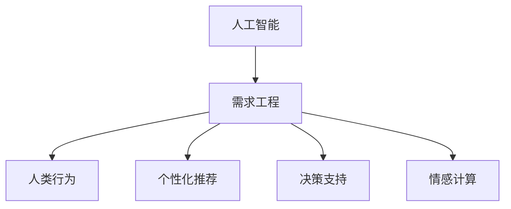

                 

# 欲望工程：AI如何影响人类的需求

> 关键词：人工智能,需求工程,人类行为,个性化推荐,决策支持,情感计算

## 1. 背景介绍

### 1.1 问题由来

随着人工智能技术的迅猛发展，AI已经深入到人们生活的方方面面，从智能助手到自动驾驶，从医疗诊断到金融风控，无处不在。然而，这种技术的广泛应用不仅仅改变了人们的生活和工作方式，更对人类的需求产生了深远的影响。AI系统的设计、开发和应用，需要深刻理解和挖掘用户的需求，将需求转化为系统的功能和行为。这一过程，我们称之为“欲望工程”。

### 1.2 问题核心关键点

1. **需求理解**：如何准确地捕捉用户需求，特别是隐含的、复杂的、多变的需求。
2. **需求映射**：如何将用户需求映射到AI系统的功能和行为，使之能满足用户需求。
3. **需求实现**：如何将需求映射转化为可执行的代码和模型，并进行优化和迭代。
4. **需求验证**：如何评估和验证AI系统是否能真正满足用户的需求，并根据反馈进行调整。
5. **需求演化**：需求如何随着技术进步、市场变化和用户行为而演进，AI系统如何适应这种变化。

### 1.3 问题研究意义

研究欲望工程，对于提升AI系统的人性化、智能化水平，以及推动AI技术的广泛应用具有重要意义：

1. **用户体验优化**：通过深入理解用户需求，设计出更符合用户心理预期和使用习惯的AI系统，提升用户体验。
2. **效率提升**：合理映射用户需求到系统功能，减少用户的操作负担，提高工作效率。
3. **市场竞争力**：更好地满足用户需求，提升产品的市场竞争力。
4. **创新驱动**：从用户需求出发，驱动AI技术不断创新和进步。
5. **社会价值**：通过满足用户的各类需求，AI技术可以在医疗、教育、环保等领域创造更大的社会价值。

## 2. 核心概念与联系

### 2.1 核心概念概述

为更好地理解欲望工程的概念框架，本节将介绍几个关键概念：

- **人工智能(AI)**：一种模拟人类智能行为的计算机科学领域，包括学习、推理、自然语言处理等技术。
- **需求工程(RE)**：研究如何将用户需求转化为软件或系统的需求规格，并进行管理和实现的工程过程。
- **人类行为**：个体在特定情境下的行为模式，包括认知、情感、动机等方面。
- **个性化推荐**：通过分析用户的行为和偏好，向用户推荐最适合其需求的产品或服务。
- **决策支持**：通过提供基于数据的洞察和建议，帮助用户或系统做出更好的决策。
- **情感计算**：研究如何通过AI技术捕捉、分析、生成情感，以提高用户和系统的交互体验。

这些概念之间的关系可以通过以下Mermaid流程图来展示：



这个流程图展示了人工智能与需求工程之间的紧密联系，以及需求工程如何通过人类行为、个性化推荐、决策支持和情感计算等技术，实现对用户需求的深入理解和精准满足。

## 3. 核心算法原理 & 具体操作步骤
### 3.1 算法原理概述

欲望工程的核心在于通过AI技术对用户需求的深入分析和精准满足。其核心思想是：利用AI的强大数据分析和模型构建能力，从用户的行为数据、反馈数据中提取出用户的显性和隐性需求，并利用这些需求指导系统的设计和实现。

具体而言，欲望工程的流程包括以下几个关键步骤：

1. **需求采集**：通过问卷调查、用户访谈、行为分析等方式，获取用户对系统功能的需求。
2. **需求分析**：利用自然语言处理、情感分析等技术，对用户需求进行语义分析和情感分析，挖掘出深层次的用户需求。
3. **需求映射**：将用户需求映射到系统的功能和行为，设计系统的架构和组件。
4. **需求实现**：通过AI技术实现需求映射的功能，并进行优化和迭代。
5. **需求验证**：通过用户反馈、A/B测试等手段，验证系统的实际效果，并根据反馈进行调整。

### 3.2 算法步骤详解

欲望工程的每个步骤都需要细致的操作和分析。以下是对各个步骤的详细介绍：

**Step 1: 需求采集**

需求采集是欲望工程的基础，需要从多个渠道获取用户需求：

- **问卷调查**：设计详细的问题，通过线上或线下的问卷，获取用户对系统功能的期望和反馈。
- **用户访谈**：深入访谈用户，了解其在特定情境下的行为和心理预期。
- **行为分析**：分析用户在实际使用系统时的行为数据，如点击、停留时间、操作路径等，挖掘出潜在的需求。

**Step 2: 需求分析**

需求分析旨在深入理解用户需求，识别出深层次、隐含的需求：

- **自然语言处理(NLP)**：利用NLP技术对用户的文字反馈进行语义分析和情感分析，提取用户的关键需求点。
- **情感分析**：通过情感计算技术，捕捉用户反馈中的情感倾向，识别出积极或消极的情绪。
- **行为模式识别**：利用机器学习技术，识别出用户在特定情境下的行为模式，预测潜在需求。

**Step 3: 需求映射**

需求映射是将用户需求转化为系统的功能和行为：

- **功能设计**：根据用户需求，设计系统的功能和模块，确定系统的核心能力和边界。
- **用户体验设计**：设计用户界面和交互流程，确保用户能够轻松使用系统。
- **技术架构设计**：设计系统的技术架构，包括前端、后端、数据库等组件，确保系统的高效稳定运行。

**Step 4: 需求实现**

需求实现是将需求映射转化为可执行的代码和模型：

- **算法选择**：选择合适的机器学习算法和深度学习模型，解决用户需求对应的特定问题。
- **模型训练**：在标注数据上训练模型，优化模型的预测效果。
- **模型部署**：将训练好的模型部署到生产环境中，进行实时推理。

**Step 5: 需求验证**

需求验证是评估和调整系统，确保其能够真正满足用户需求：

- **A/B测试**：通过A/B测试，比较不同版本系统的实际效果，选择最佳方案。
- **用户反馈收集**：收集用户的使用反馈，识别出系统存在的问题和改进点。
- **迭代优化**：根据反馈，对系统进行迭代优化，提升系统性能。

### 3.3 算法优缺点

欲望工程的优点在于其能够深入挖掘和理解用户需求，通过AI技术实现对需求的精准映射和高效满足。其缺点在于：

1. **数据依赖**：依赖大量用户行为数据和反馈数据，数据获取和处理成本较高。
2. **模型复杂性**：需要设计复杂的算法和模型，实现过程复杂。
3. **隐私问题**：涉及用户隐私数据的采集和处理，需要严格遵守隐私保护法规。
4. **性能要求高**：系统的实现需要高性能的硬件和算法支持，对资源消耗较高。
5. **需求多样性**：用户需求复杂多样，难以全面覆盖。

尽管存在这些局限性，但欲望工程仍然是大规模AI系统设计和实现的重要手段。未来相关研究的方向在于如何进一步降低数据获取成本，提高模型训练和推理效率，同时兼顾用户隐私保护和需求多样性，实现更加高效、人性化的AI系统。

### 3.4 算法应用领域

欲望工程在多个领域具有广泛的应用前景：

- **智能推荐系统**：通过分析用户行为和偏好，向用户推荐个性化内容。
- **金融风控系统**：利用用户行为数据，评估用户的信用风险，提供个性化的风险控制建议。
- **医疗诊断系统**：通过分析患者的病历数据，提供个性化的诊断和治疗建议。
- **智能客服系统**：根据用户对话记录，提供个性化的服务推荐和问题解答。
- **教育培训系统**：根据学生的学习行为和反馈，提供个性化的学习计划和资源推荐。

## 4. 数学模型和公式 & 详细讲解 & 举例说明

### 4.1 数学模型构建

欲望工程的数学模型构建，通常包括以下几个关键步骤：

- **用户需求建模**：将用户需求转化为数学表达式，形成需求向量 $\mathbf{d}$。
- **模型训练目标函数**：定义损失函数 $L$，衡量模型预测结果与用户实际需求之间的差距。
- **模型训练算法**：选择适当的优化算法，如梯度下降、Adam等，最小化损失函数 $L$。

### 4.2 公式推导过程

以下我们以个性化推荐系统为例，推导推荐模型及其训练目标函数：

设用户对物品的需求表示为向量 $\mathbf{d} \in \mathbb{R}^n$，物品的特征表示为向量 $\mathbf{f}_i \in \mathbb{R}^m$，物品与用户需求的相似度表示为 $s_i$，推荐模型的训练目标函数为：

$$
L(\theta) = \sum_{i=1}^N \ell(s_i,\hat{s}_i(\mathbf{f}_i,\mathbf{d};\theta))
$$

其中 $\ell$ 为损失函数，如均方误差损失，$\hat{s}_i$ 为模型的预测相似度，$\theta$ 为模型的参数。训练过程的目标是最小化损失函数 $L$，即：

$$
\theta^* = \mathop{\arg\min}_{\theta} L(\theta)
$$

在实践中，通常使用神经网络作为推荐模型，通过反向传播算法进行训练。模型的结构如图1所示：

```mermaid
graph TB
    A[用户需求 $\mathbf{d}$] --> B[物品特征 $\mathbf{f}_i$]
    C[B] --> D[推荐模型]
    D --> E[预测相似度 $\hat{s}_i$]
    A --> F[损失函数 $L$]
    E --> F
```

### 4.3 案例分析与讲解

在实际应用中，推荐系统的构建往往需要考虑多个因素，以下以豆瓣电影推荐系统为例，分析其设计和实现过程：

**Step 1: 需求采集**

通过问卷调查和用户访谈，获取用户对电影推荐系统的需求：

- **功能需求**：希望系统能推荐个性化电影，并根据评价和评分更新推荐。
- **界面需求**：界面简洁易用，能够快速找到感兴趣的电影。
- **性能需求**：推荐准确度高，响应速度快。

**Step 2: 需求分析**

利用自然语言处理技术对用户反馈进行情感分析和语义分析：

- **情感分析**：分析用户评价中的情感倾向，识别出用户对电影的正面或负面反馈。
- **语义分析**：识别出用户评价中的关键词和主题，提取用户的电影偏好。

**Step 3: 需求映射**

根据需求分析结果，设计系统的功能和架构：

- **推荐算法**：选择协同过滤算法、内容推荐算法等，解决个性化推荐问题。
- **用户界面**：设计简洁易用的用户界面，提供电影推荐列表和评价区域。
- **数据存储**：设计数据库架构，存储用户行为数据、电影数据和推荐结果。

**Step 4: 需求实现**

实现推荐算法和用户界面：

- **协同过滤算法**：基于用户行为数据，构建用户-物品相似矩阵，进行个性化推荐。
- **内容推荐算法**：根据电影特征，生成推荐列表。
- **用户界面**：使用Web前端技术，实现用户界面和交互。

**Step 5: 需求验证**

通过A/B测试和用户反馈，评估推荐系统的实际效果：

- **A/B测试**：对比不同推荐策略的推荐效果，选择最佳方案。
- **用户反馈**：收集用户的使用反馈，识别出系统存在的问题和改进点。
- **迭代优化**：根据反馈，对系统进行迭代优化，提升推荐准确度和用户体验。

## 5. 项目实践：代码实例和详细解释说明

### 5.1 开发环境搭建

在进行欲望工程项目实践前，我们需要准备好开发环境。以下是使用Python进行项目开发的Python环境配置流程：

1. 安装Anaconda：从官网下载并安装Anaconda，用于创建独立的Python环境。

2. 创建并激活虚拟环境：
```bash
conda create -n my_env python=3.8 
conda activate my_env
```

3. 安装必要的库：
```bash
pip install numpy pandas scikit-learn tensorflow pytorch transformers
```

4. 下载和配置数据集：
```bash
wget https://example.com/dataset.zip
unzip dataset.zip
```

5. 配置模型和超参数：
```python
# 定义模型和超参数
model = tf.keras.Sequential([
    tf.keras.layers.Dense(128, activation='relu'),
    tf.keras.layers.Dense(1, activation='sigmoid')
])
loss = 'binary_crossentropy'
optimizer = tf.keras.optimizers.Adam(learning_rate=0.001)
batch_size = 32
epochs = 10
```

完成上述步骤后，即可在`my_env`环境中开始项目实践。

### 5.2 源代码详细实现

下面以个性化推荐系统为例，给出使用TensorFlow进行推荐模型训练和评估的Python代码实现。

```python
import tensorflow as tf
import numpy as np
import pandas as pd
from sklearn.model_selection import train_test_split
from sklearn.preprocessing import StandardScaler

# 加载数据集
df = pd.read_csv('data.csv')

# 数据预处理
scaler = StandardScaler()
df['user'] = scaler.fit_transform(df[['user']])
df['item'] = scaler.fit_transform(df[['item']])
df['rating'] = scaler.fit_transform(df[['rating']])

# 划分训练集和测试集
train_df, test_df = train_test_split(df, test_size=0.2, random_state=42)

# 定义模型
model = tf.keras.Sequential([
    tf.keras.layers.Dense(128, activation='relu', input_shape=(128,)),
    tf.keras.layers.Dense(1, activation='sigmoid')
])

# 定义损失函数和优化器
loss = 'binary_crossentropy'
optimizer = tf.keras.optimizers.Adam(learning_rate=0.001)

# 编译模型
model.compile(optimizer=optimizer, loss=loss, metrics=['accuracy'])

# 训练模型
model.fit(train_df, epochs=epochs, batch_size=batch_size)

# 评估模型
loss, accuracy = model.evaluate(test_df)
print(f'Test loss: {loss:.4f}')
print(f'Test accuracy: {accuracy:.4f}')
```

### 5.3 代码解读与分析

让我们再详细解读一下关键代码的实现细节：

**Step 1: 数据预处理**

加载数据集并进行预处理：

- **特征缩放**：对用户、物品、评分进行归一化处理，便于模型训练。
- **数据划分**：将数据集划分为训练集和测试集，以便于模型训练和评估。

**Step 2: 模型定义**

定义推荐模型：

- **神经网络结构**：使用两层全连接层，输出一个0-1之间的评分。
- **损失函数和优化器**：选择二元交叉熵损失和Adam优化器，进行模型训练。

**Step 3: 模型编译**

编译模型，设置训练参数：

- **训练参数**：设置训练轮数和批次大小。

**Step 4: 模型训练**

进行模型训练：

- **训练过程**：使用训练集进行模型训练，每轮迭代更新模型参数。

**Step 5: 模型评估**

评估模型效果：

- **评估指标**：计算测试集的损失和准确率，评估模型的性能。

以上代码展示了使用TensorFlow进行个性化推荐模型训练的完整流程，通过简洁的代码实现了模型的定义、编译、训练和评估。

## 6. 实际应用场景

### 6.1 智能推荐系统

个性化推荐系统通过分析用户的行为和偏好，向用户推荐个性化的内容，极大地提升了用户的体验和满意度。在电商、视频、音乐等领域，个性化推荐已经成为了用户获取新信息、发现新产品的重要手段。

具体而言，智能推荐系统的设计和实现，可以从以下几个方面入手：

- **需求采集**：通过问卷调查和用户访谈，获取用户对推荐系统的需求。
- **需求分析**：利用自然语言处理技术对用户反馈进行情感分析和语义分析，挖掘出深层次的用户需求。
- **需求映射**：根据用户需求，设计推荐算法和界面，实现个性化推荐。
- **需求实现**：选择合适的推荐算法和模型，进行训练和优化。
- **需求验证**：通过A/B测试和用户反馈，评估推荐系统的实际效果，并进行迭代优化。

### 6.2 金融风控系统

金融风控系统通过分析用户的金融行为和信用历史，评估用户的信用风险，提供个性化的风险控制建议。在银行、保险、贷款等领域，风控系统已经成为风险管理的重要工具。

具体而言，金融风控系统的设计和实现，可以从以下几个方面入手：

- **需求采集**：通过问卷调查和用户访谈，获取用户对风控系统的需求。
- **需求分析**：利用数据分析技术对用户行为数据进行挖掘，识别出用户的风险倾向。
- **需求映射**：根据用户需求，设计风险评估模型和界面，实现风险控制建议。
- **需求实现**：选择合适的风控算法和模型，进行训练和优化。
- **需求验证**：通过A/B测试和用户反馈，评估风控系统的实际效果，并进行迭代优化。

### 6.3 医疗诊断系统

医疗诊断系统通过分析患者的病历数据，提供个性化的诊断和治疗建议。在医疗健康领域，诊断系统的精准性和可解释性尤为重要。

具体而言，医疗诊断系统的设计和实现，可以从以下几个方面入手：

- **需求采集**：通过问卷调查和用户访谈，获取用户对诊断系统的需求。
- **需求分析**：利用自然语言处理技术对病历数据进行语义分析和情感分析，挖掘出深层次的疾病信息。
- **需求映射**：根据用户需求，设计诊断模型和界面，实现个性化诊断和治疗建议。
- **需求实现**：选择合适的诊断算法和模型，进行训练和优化。
- **需求验证**：通过A/B测试和医生反馈，评估诊断系统的实际效果，并进行迭代优化。

## 7. 工具和资源推荐

### 7.1 学习资源推荐

为了帮助开发者系统掌握欲望工程的理论基础和实践技巧，这里推荐一些优质的学习资源：

1. **《需求工程导论》**：详细介绍了需求工程的原理、方法和工具，是了解欲望工程的重要参考资料。
2. **《人工智能实战》**：涵盖了AI技术的多种应用场景，包括推荐系统、金融风控、医疗诊断等，是学习欲望工程的实践范例。
3. **《机器学习实战》**：介绍了机器学习算法和模型的实现方法，是欲望工程中需求实现的基础。
4. **《Python深度学习》**：深入浅出地讲解了使用Python进行机器学习和深度学习开发的方法，是欲望工程中的重要工具。
5. **《情感计算与人工智能》**：介绍了情感计算技术在AI系统中的应用，是欲望工程中情感计算的重要资源。

通过对这些资源的学习实践，相信你一定能够快速掌握欲望工程的精髓，并用于解决实际的AI系统设计问题。

### 7.2 开发工具推荐

高效的开发离不开优秀的工具支持。以下是几款用于欲望工程开发的常用工具：

1. **Python**：开源编程语言，广泛用于机器学习和深度学习开发。
2. **TensorFlow**：由Google主导的开源深度学习框架，支持多种神经网络模型。
3. **PyTorch**：开源深度学习框架，支持动态计算图，灵活方便。
4. **Jupyter Notebook**：交互式编程工具，支持Python、R等多种编程语言，方便实验和开发。
5. **GitHub**：代码托管平台，支持版本控制和团队协作，是欲望工程中的重要工具。

合理利用这些工具，可以显著提升欲望工程的开发效率，加快创新迭代的步伐。

### 7.3 相关论文推荐

欲望工程的研究始于学界的持续研究。以下是几篇奠基性的相关论文，推荐阅读：

1. **《需求工程：模型与方法》**：介绍了需求工程的建模方法和工具，是欲望工程的重要理论基础。
2. **《人工智能在推荐系统中的应用》**：总结了AI技术在推荐系统中的多种应用，是欲望工程中的实践范例。
3. **《情感计算与人工智能》**：介绍了情感计算技术在AI系统中的应用，是欲望工程中情感计算的重要资源。
4. **《个性化推荐系统的研究进展》**：总结了个性化推荐系统的多种算法和技术，是欲望工程中的重要参考。
5. **《智能推荐系统设计》**：详细介绍了智能推荐系统的设计流程和方法，是欲望工程中的重要参考。

这些论文代表了大规模欲望工程的研究脉络。通过学习这些前沿成果，可以帮助研究者把握学科前进方向，激发更多的创新灵感。

## 8. 总结：未来发展趋势与挑战

### 8.1 研究成果总结

本文对欲望工程的概念、原理和实践进行了全面系统的介绍。首先阐述了欲望工程的重要性，明确了需求理解、需求映射、需求实现、需求验证和需求演化等关键步骤。其次，从原理到实践，详细讲解了欲望工程的数学模型和关键算法。最后，通过具体案例分析，展示了欲望工程在多个领域的实际应用。

通过本文的系统梳理，可以看到，欲望工程在大规模AI系统设计和实现中发挥着至关重要的作用。它能够深入挖掘和理解用户需求，通过AI技术实现对需求的精准映射和高效满足，提升系统的用户体验和市场竞争力。未来，随着AI技术的不断进步和应用的深化，欲望工程必将在构建人机协同的智能系统过程中发挥更大的作用。

### 8.2 未来发展趋势

展望未来，欲望工程将呈现以下几个发展趋势：

1. **数据融合技术**：利用多源数据融合技术，整合用户行为数据、社交网络数据等，挖掘更深层次的用户需求。
2. **智能界面设计**：结合自然语言处理和机器学习技术，设计更加智能和自然的用户界面，提升用户体验。
3. **情感计算技术**：利用情感计算技术，捕捉和分析用户的情感状态，提供更加个性化的推荐和服务。
4. **可解释性技术**：开发可解释性技术，增强AI系统的透明性和可信度，满足用户对算法透明度的要求。
5. **跨模态技术**：结合视觉、语音、文本等多种模态数据，实现跨模态的个性化推荐和服务。
6. **连续学习技术**：利用连续学习技术，使AI系统能够不断学习新知识和数据，适应不断变化的用户需求。

以上趋势凸显了欲望工程技术的广阔前景。这些方向的探索发展，必将进一步提升AI系统的人性化、智能化水平，为构建人机协同的智能系统提供更加坚实的基础。

### 8.3 面临的挑战

尽管欲望工程已经取得了瞩目成就，但在迈向更加智能化、普适化应用的过程中，它仍面临着诸多挑战：

1. **数据隐私保护**：用户在行为数据、社交网络数据等隐私数据上的关注度日益提高，如何保护用户隐私成为一个重要问题。
2. **数据质量问题**：数据采集和处理过程中可能存在噪音和不完整性，如何提高数据质量，减少数据偏差，是一个需要持续关注的问题。
3. **算法公平性**：AI系统可能会存在算法偏见和歧视问题，如何确保算法公平性，是一个需要深入研究的问题。
4. **资源消耗**：欲望工程往往需要高性能的硬件和算法支持，如何提高资源利用效率，降低成本，是一个需要不断优化的问题。
5. **需求多样性**：用户需求复杂多样，如何全面覆盖，是一个需要持续改进的问题。

### 8.4 研究展望

面对欲望工程面临的挑战，未来的研究需要在以下几个方面寻求新的突破：

1. **隐私保护技术**：开发隐私保护技术，保护用户隐私数据，同时提供个性化的服务。
2. **数据质量提升**：改进数据采集和处理技术，提高数据质量和可靠性。
3. **算法公平性保障**：引入公平性约束，开发公平性评估方法，确保算法公平性。
4. **资源优化技术**：优化模型结构和算法，提高资源利用效率，降低成本。
5. **需求多样化处理**：结合用户反馈和行为数据，全面覆盖用户需求，提升系统性能。

这些研究方向的探索，必将引领欲望工程技术迈向更高的台阶，为构建高效、人性化的AI系统提供更加坚实的基础。面向未来，欲望工程技术还需要与其他人工智能技术进行更深入的融合，如知识表示、因果推理、强化学习等，多路径协同发力，共同推动自然语言理解和智能交互系统的进步。只有勇于创新、敢于突破，才能不断拓展AI系统的边界，让智能技术更好地造福人类社会。

## 9. 附录：常见问题与解答

**Q1：欲望工程和需求工程有什么区别？**

A: 欲望工程和需求工程在概念上有一定的相似性，但又有显著的区别。需求工程主要关注如何将用户需求转化为软件或系统的需求规格，并进行管理和实现；而欲望工程则更关注如何通过AI技术深入挖掘和理解用户需求，通过需求映射和需求实现，实现对需求的精准满足。简而言之，欲望工程是在需求工程的基础上，利用AI技术进一步优化需求映射和需求实现的过程。

**Q2：欲望工程中如何进行需求验证？**

A: 需求验证是欲望工程中的重要环节，主要通过以下方法进行：

1. **A/B测试**：对比不同版本系统的实际效果，选择最佳方案。
2. **用户反馈收集**：通过问卷调查、用户访谈等方式，收集用户的使用反馈，识别出系统存在的问题和改进点。
3. **实际测试**：在实际使用场景中测试系统的性能和用户体验，评估系统的实际效果。
4. **持续优化**：根据反馈，对系统进行迭代优化，提升系统性能。

这些方法可以相互结合，全面验证系统的实际效果。

**Q3：欲望工程中的需求映射如何实现？**

A: 需求映射是将用户需求转化为系统的功能和行为，设计系统的架构和组件。主要通过以下几个步骤实现：

1. **需求分析**：利用自然语言处理技术对用户需求进行语义分析和情感分析，挖掘出深层次的用户需求。
2. **功能设计**：根据用户需求，设计系统的功能和模块，确定系统的核心能力和边界。
3. **用户体验设计**：设计简洁易用的用户界面，提供用户所需的功能。
4. **技术架构设计**：设计系统的技术架构，包括前端、后端、数据库等组件，确保系统的高效稳定运行。

以上步骤可以相互结合，形成一个完整的系统设计和实现流程。

---

作者：禅与计算机程序设计艺术 / Zen and the Art of Computer Programming

