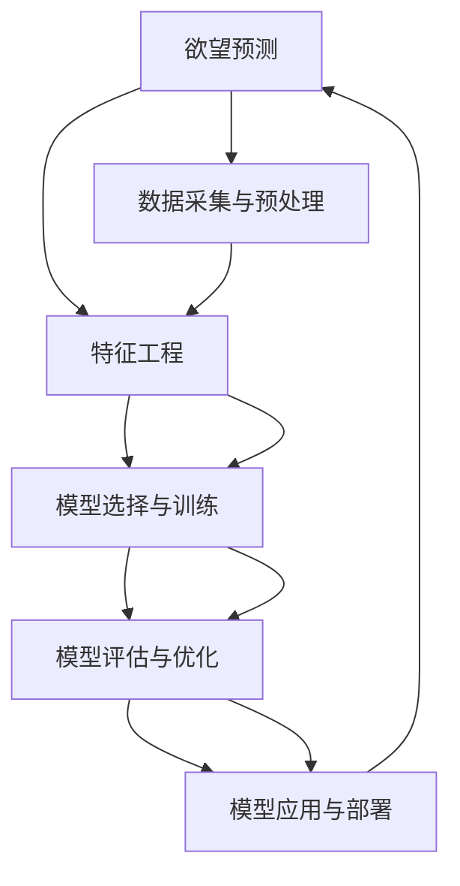

                 

# 欲望预测：AI时代的市场研究

> 关键词：欲望预测, 市场研究, 人工智能, 深度学习, 消费者行为分析, 商品推荐, 广告投放

## 1. 背景介绍

### 1.1 问题由来

随着人工智能（AI）技术在各个领域的广泛应用，AI时代下的市场研究发生了根本性的变革。传统的市场研究依赖问卷调查、访谈、焦点小组等方法收集消费者意见，但这些方法耗时耗力且成本高昂。而AI技术的引入，尤其是深度学习和大数据分析，使得市场研究变得更加高效、精确且成本低廉。

欲望预测作为市场研究的重要一环，旨在通过消费者历史行为、社交媒体活动、搜索数据等多维度的数据，预测消费者的购买欲望。这对于企业而言，可以精准地进行商品推荐、广告投放、库存管理等，从而提升市场竞争力。

### 1.2 问题核心关键点

欲望预测的核心在于如何从海量数据中挖掘出消费者潜在的购买欲望，并将其转化为具体的购买行为。其关键点包括：

1. **数据采集与预处理**：如何高效、准确地收集消费者数据，并进行清洗、标注等预处理步骤。
2. **特征工程**：如何从原始数据中提取出有用的特征，并进行合理的特征组合，以提升预测模型的性能。
3. **模型选择与训练**：选择何种预测模型，并如何进行高效的模型训练，以避免过拟合和欠拟合。
4. **模型评估与优化**：如何通过交叉验证、A/B测试等方法评估模型性能，并不断优化模型以提升预测准确率。
5. **模型应用与部署**：如何将训练好的模型应用于实际场景，并根据反馈持续改进模型。

本文将从这些问题关键点出发，深入探讨欲望预测的各个环节，并结合实际案例进行详细讲解。

## 2. 核心概念与联系

### 2.1 核心概念概述

- **欲望预测**：通过分析消费者的历史行为、搜索记录、社交媒体活动等数据，预测消费者在未来某个时间点的购买欲望。
- **市场研究**：通过收集和分析数据，以了解市场动态、消费者需求、竞争对手情况等，从而制定更好的市场策略。
- **深度学习**：利用神经网络模型，特别是卷积神经网络（CNN）、循环神经网络（RNN）、长短期记忆网络（LSTM）等，从数据中自动提取特征并建立预测模型。
- **消费者行为分析**：研究消费者的购买习惯、偏好、心理需求等，以指导企业制定营销策略和产品设计。
- **商品推荐**：根据消费者的历史行为和当前需求，推荐可能感兴趣的商品，以提升销售转化率。
- **广告投放**：通过精准的欲望预测，进行广告投放，以提高广告效果和ROI。

这些概念之间的联系紧密，互为支持，共同构成了AI时代市场研究的基础框架。

### 2.2 核心概念原理和架构的 Mermaid 流程图



这个流程图展示了欲望预测的核心过程：首先通过数据采集与预处理，然后通过特征工程提取有用的特征，接着选择合适的模型进行训练，再通过评估和优化提升模型性能，最后应用和部署模型以实现精准的欲望预测。

## 3. 核心算法原理 & 具体操作步骤

### 3.1 算法原理概述

欲望预测的核心算法原理主要基于深度学习模型，尤其是循环神经网络（RNN）和长短期记忆网络（LSTM）。其核心思想是通过对历史数据的分析，预测未来消费者的购买欲望。

在具体实现过程中，一般遵循以下步骤：

1. **数据准备**：收集消费者的历史行为数据、社交媒体活动、搜索记录等，并进行清洗、标注等预处理步骤。
2. **特征提取**：从原始数据中提取出有用的特征，如购买频率、购买金额、搜索关键词、浏览时长等。
3. **模型训练**：选择适合的深度学习模型，并使用历史数据进行训练，以建立预测模型。
4. **模型评估**：通过交叉验证、A/B测试等方法评估模型性能，并不断优化模型以提升预测准确率。
5. **模型应用**：将训练好的模型应用于实际场景，如商品推荐、广告投放等。

### 3.2 算法步骤详解

以使用LSTM进行欲望预测为例，详细讲解算法步骤：

**Step 1: 数据准备**

- 收集消费者的历史行为数据，包括购买记录、浏览记录、搜索记录等。
- 对数据进行清洗、去重、去噪等预处理步骤，确保数据质量。
- 对数据进行标注，如将购买记录标注为1，未购买记录标注为0，以供后续模型训练。

**Step 2: 特征提取**

- 从原始数据中提取有用的特征，如购买频率、购买金额、搜索关键词、浏览时长等。
- 使用PCA、LDA等降维技术，对高维数据进行降维，减少模型的复杂度。
- 对特征进行归一化、标准化等处理，确保数据的一致性。

**Step 3: 模型训练**

- 选择LSTM作为预测模型，使用历史数据进行训练。
- 将特征序列输入模型，通过前向传播计算预测值，并使用损失函数计算误差。
- 反向传播计算梯度，并使用优化算法更新模型参数，如Adam、SGD等。
- 不断迭代训练，直到模型收敛或达到预设的迭代次数。

**Step 4: 模型评估**

- 使用交叉验证方法评估模型性能，如k折交叉验证。
- 计算模型在测试集上的准确率、召回率、F1值等指标，评估模型预测能力。
- 使用A/B测试方法，对比不同模型和不同参数设置的效果，选择最优模型。

**Step 5: 模型应用**

- 将训练好的模型应用于实际场景，如商品推荐、广告投放等。
- 根据消费者的历史行为和当前需求，生成个性化推荐或广告。
- 不断收集用户反馈，调整和优化模型，以提升预测准确率。

### 3.3 算法优缺点

**优点：**

1. **高效性**：深度学习模型能够自动从数据中提取特征，减少人工干预，提高处理效率。
2. **准确性**：深度学习模型能够捕捉数据中的复杂关系，提供高精度的预测结果。
3. **可扩展性**：深度学习模型能够处理大规模数据，适用于多种市场研究场景。

**缺点：**

1. **数据依赖性高**：模型性能高度依赖于数据的质量和数量，数据不足时可能导致预测不准确。
2. **模型复杂度高**：深度学习模型参数量大，需要高性能的计算资源。
3. **可解释性差**：深度学习模型的决策过程难以解释，缺乏透明性。
4. **过拟合风险**：深度学习模型容易过拟合，需要严格的模型评估和优化。

### 3.4 算法应用领域

欲望预测技术在多个领域得到了广泛应用，包括但不限于：

- **电子商务**：通过欲望预测，实现精准的商品推荐，提升用户购买转化率。
- **零售**：通过欲望预测，优化库存管理，减少库存积压。
- **广告**：通过欲望预测，实现精准的广告投放，提高广告效果。
- **金融**：通过欲望预测，优化金融产品的推荐和销售。
- **医疗**：通过欲望预测，优化医疗服务的推荐和诊疗流程。

## 4. 数学模型和公式 & 详细讲解 & 举例说明

### 4.1 数学模型构建

欲望预测的数学模型主要基于循环神经网络（RNN）和长短期记忆网络（LSTM）。假设输入序列为 $(x_t)$，输出序列为 $(y_t)$，其中 $x_t$ 表示第 $t$ 个输入，$y_t$ 表示第 $t$ 个输出。目标是通过历史数据 $(x_{1:T})$ 预测未来的输出序列 $(y_{1:T'})$。

**目标函数**：
$$
\min_{\theta} \sum_{t=1}^{T} \ell(y_t, \hat{y}_t)
$$
其中 $\ell$ 为损失函数，$\hat{y}_t$ 为模型预测的输出。

### 4.2 公式推导过程

以LSTM模型为例，其基本架构包括输入门（input gate）、遗忘门（forget gate）、输出门（output gate）和记忆细胞（memory cell）。假设 $h_t$ 表示第 $t$ 个记忆状态，$c_t$ 表示第 $t$ 个记忆细胞，$x_t$ 表示第 $t$ 个输入，$y_t$ 表示第 $t$ 个输出。则LSTM的预测公式为：

$$
h_t = f_t \odot c_{t-1} + i_t \odot \tanh(c_t) \odot o_t
$$

其中：
$$
i_t = \sigma(W_i \cdot [h_{t-1}, x_t] + b_i)
$$
$$
f_t = \sigma(W_f \cdot [h_{t-1}, x_t] + b_f)
$$
$$
o_t = \sigma(W_o \cdot [h_{t-1}, x_t] + b_o)
$$
$$
c_t = \tanh(W_c \cdot [h_{t-1}, x_t] + b_c)
$$

### 4.3 案例分析与讲解

以某电子商务平台为例，分析如何使用LSTM进行欲望预测。

**数据准备**：
- 收集消费者的历史购买记录、浏览记录、搜索记录等数据。
- 对数据进行清洗、去重、去噪等预处理步骤，确保数据质量。
- 对数据进行标注，如将购买记录标注为1，未购买记录标注为0。

**特征提取**：
- 从原始数据中提取有用的特征，如购买频率、购买金额、搜索关键词、浏览时长等。
- 使用PCA、LDA等降维技术，对高维数据进行降维，减少模型的复杂度。
- 对特征进行归一化、标准化等处理，确保数据的一致性。

**模型训练**：
- 选择LSTM作为预测模型，使用历史数据进行训练。
- 将特征序列输入模型，通过前向传播计算预测值，并使用损失函数计算误差。
- 反向传播计算梯度，并使用优化算法更新模型参数，如Adam、SGD等。
- 不断迭代训练，直到模型收敛或达到预设的迭代次数。

**模型评估**：
- 使用交叉验证方法评估模型性能，如k折交叉验证。
- 计算模型在测试集上的准确率、召回率、F1值等指标，评估模型预测能力。
- 使用A/B测试方法，对比不同模型和不同参数设置的效果，选择最优模型。

**模型应用**：
- 将训练好的模型应用于实际场景，如商品推荐、广告投放等。
- 根据消费者的历史行为和当前需求，生成个性化推荐或广告。
- 不断收集用户反馈，调整和优化模型，以提升预测准确率。

## 5. 项目实践：代码实例和详细解释说明

### 5.1 开发环境搭建

在进行欲望预测实践前，我们需要准备好开发环境。以下是使用Python进行TensorFlow开发的环境配置流程：

1. 安装Anaconda：从官网下载并安装Anaconda，用于创建独立的Python环境。

2. 创建并激活虚拟环境：
```bash
conda create -n tensorflow-env python=3.8 
conda activate tensorflow-env
```

3. 安装TensorFlow：根据CUDA版本，从官网获取对应的安装命令。例如：
```bash
conda install tensorflow tensorflow-gpu=cuda11.1 -c conda-forge -c pytorch
```

4. 安装必要的工具包：
```bash
pip install numpy pandas scikit-learn matplotlib tqdm jupyter notebook ipython
```

完成上述步骤后，即可在`tensorflow-env`环境中开始欲望预测实践。

### 5.2 源代码详细实现

以下是使用TensorFlow和LSTM模型进行欲望预测的完整代码实现：

```python
import tensorflow as tf
from tensorflow.keras.layers import LSTM, Dense, Input
from tensorflow.keras.models import Model

# 定义模型
def build_model(input_shape, output_shape):
    input_seq = Input(shape=input_shape)
    lstm = LSTM(64, return_sequences=True)(input_seq)
    lstm = LSTM(32, return_sequences=True)(lstm)
    lstm = Dense(output_shape, activation='sigmoid')(lstm)
    model = Model(inputs=input_seq, outputs=lstm)
    return model

# 准备数据
# 假设x_train和y_train为训练集，x_test和y_test为测试集
# x_train和x_test的形状为（样本数，时间步数，特征数）
# y_train和y_test的形状为（样本数，输出数）

# 构建模型
model = build_model(input_shape=(None, 5), output_shape=1)

# 编译模型
model.compile(optimizer='adam', loss='binary_crossentropy', metrics=['accuracy'])

# 训练模型
model.fit(x_train, y_train, batch_size=32, epochs=50, validation_data=(x_test, y_test))

# 评估模型
loss, accuracy = model.evaluate(x_test, y_test)
print('Test loss:', loss)
print('Test accuracy:', accuracy)
```

在上述代码中，我们使用LSTM模型构建欲望预测模型，并使用二分类交叉熵损失函数和Adam优化器进行训练。在实际应用中，需要根据具体问题调整模型结构和超参数。

### 5.3 代码解读与分析

让我们再详细解读一下关键代码的实现细节：

**build_model函数**：
- 定义模型结构，包括输入层、LSTM层和输出层。
- 输入层接收序列数据，LSTM层包含多个时间步，输出层输出预测结果。

**训练模型**：
- 使用训练数据训练模型，使用交叉验证和评估数据评估模型性能。
- 迭代50次，每次迭代使用32个样本。

**评估模型**：
- 使用测试数据评估模型性能，计算损失函数和准确率。

可以看出，使用TensorFlow进行欲望预测的代码实现相对简洁，且灵活性高，可以方便地进行调整和优化。

## 6. 实际应用场景

### 6.1 电子商务

在电子商务领域，欲望预测可以显著提升用户体验和销售额。通过分析消费者的浏览记录、搜索记录、购物车行为等数据，可以预测消费者对商品的购买欲望。例如，某消费者在过去30天内多次浏览某商品，但没有下单，此时可以向其推荐该商品，并发送优惠券或优惠信息，促进其购买。

**应用实例**：亚马逊的个性化推荐系统，通过欲望预测技术，根据用户的浏览历史和搜索记录，推荐可能感兴趣的商品，显著提高了用户购买转化率。

### 6.2 零售

在零售领域，欲望预测可以优化库存管理，减少库存积压和缺货情况。通过分析历史销售数据和市场趋势，可以预测未来某一时间段内的商品需求量，从而合理调配库存。

**应用实例**：沃尔玛的库存管理系统，通过欲望预测技术，预测未来一周内商品的销售量，优化库存补货计划，提高了库存利用率和客户满意度。

### 6.3 广告

在广告领域，欲望预测可以提高广告投放的精准度和ROI。通过分析用户的搜索记录、浏览记录和社交媒体活动，可以预测用户对某一类广告的响应欲望，从而精准投放广告，避免浪费广告预算。

**应用实例**：Facebook的广告投放系统，通过欲望预测技术，预测用户的广告响应欲望，实现精准的广告投放，提高了广告的点击率和转化率。

### 6.4 未来应用展望

随着欲望预测技术的不断发展，未来将会在更多领域得到应用，为各行各业带来变革性影响。

在智慧医疗领域，欲望预测技术可以用于优化医疗资源的分配，提高医疗服务的效率和质量。例如，根据患者的健康状况和历史诊疗数据，预测未来可能出现的疾病或健康需求，提前做好准备。

在智能教育领域，欲望预测技术可以用于优化学习路径和教学内容，提高学生的学习效率和效果。例如，根据学生的学习行为和反馈，预测其对某一类学习内容的兴趣，推荐相应的学习资源。

在智慧城市治理中，欲望预测技术可以用于优化城市资源配置，提高城市管理的智能化水平。例如，根据市民的需求和偏好，预测某一时间段内的出行需求，优化交通管理和公共服务资源的分配。

此外，在企业生产、社会治理、文娱传媒等众多领域，欲望预测技术也将不断涌现，为经济社会发展注入新的动力。

## 7. 工具和资源推荐

### 7.1 学习资源推荐

为了帮助开发者系统掌握欲望预测的理论基础和实践技巧，这里推荐一些优质的学习资源：

1. 《深度学习》系列博文：由深度学习专家撰写，涵盖深度学习的基本原理、算法和应用，适合初学者和进阶者。
2. Coursera《深度学习专项课程》：斯坦福大学和DeepLearning.AI联合开设的深度学习课程，系统讲解深度学习的基础知识和前沿技术。
3. 《TensorFlow实战》书籍：TensorFlow官方文档，详细介绍了TensorFlow的各个模块和API，适合动手实践。
4. Kaggle竞赛：参与Kaggle竞赛，实战演练深度学习模型，积累项目经验。
5. 《NLP实战》书籍：深入浅出地讲解NLP的基本概念和应用场景，适合NLP初学者和实践者。

通过对这些资源的学习实践，相信你一定能够快速掌握欲望预测的精髓，并用于解决实际的NLP问题。

### 7.2 开发工具推荐

高效的开发离不开优秀的工具支持。以下是几款用于欲望预测开发的常用工具：

1. TensorFlow：基于Python的深度学习框架，支持灵活的计算图，适合快速迭代研究。TensorFlow提供了丰富的预训练模型和优化算法，适合进行欲望预测的模型训练和优化。
2. Keras：高级神经网络API，基于TensorFlow，支持快速搭建和训练深度学习模型。Keras提供了简单易用的API，适合初学者上手。
3. Weights & Biases：模型训练的实验跟踪工具，可以记录和可视化模型训练过程中的各项指标，方便对比和调优。与TensorFlow无缝集成。
4. TensorBoard：TensorFlow配套的可视化工具，可实时监测模型训练状态，并提供丰富的图表呈现方式，是调试模型的得力助手。

合理利用这些工具，可以显著提升欲望预测任务的开发效率，加快创新迭代的步伐。

### 7.3 相关论文推荐

欲望预测技术的发展源于学界的持续研究。以下是几篇奠基性的相关论文，推荐阅读：

1. Deep Recurrent Neural Networks for Visual Recognition（Hinton et al., 2012）：提出了LSTM模型，用于图像分类任务，奠定了深度学习在计算机视觉中的应用基础。
2. Convolutional Neural Networks for Sentence Classification（Kim, 2014）：提出卷积神经网络（CNN），用于文本分类任务，开创了深度学习在NLP中的应用。
3. Attention Is All You Need（Vaswani et al., 2017）：提出Transformer模型，用于自然语言处理任务，开创了自注意力机制在深度学习中的应用。
4. Parameter-Efficient Transfer Learning for NLP（Howard & Ruder, 2018）：提出Adapter等参数高效微调方法，在不增加模型参数量的情况下，也能取得不错的微调效果。
5. AdaLoRA: Adaptive Low-Rank Adaptation for Parameter-Efficient Fine-Tuning（Huang et al., 2020）：使用自适应低秩适应的微调方法，在参数效率和精度之间取得了新的平衡。

这些论文代表了大语言模型微调技术的发展脉络。通过学习这些前沿成果，可以帮助研究者把握学科前进方向，激发更多的创新灵感。

## 8. 总结：未来发展趋势与挑战

### 8.1 总结

本文对欲望预测的各个环节进行了详细探讨，从数据准备、特征提取、模型训练、模型评估到模型应用，每个步骤都有深入讲解。通过实际案例，展示了欲望预测在电子商务、零售、广告等领域的广泛应用，以及未来在智慧医疗、智能教育等领域的潜力。

欲望预测作为市场研究的重要一环，利用深度学习模型，从消费者历史行为中预测未来的购买欲望，为企业制定精准的市场策略提供了有力支持。未来，随着数据采集技术的进步和模型算法的优化，欲望预测技术将更加高效、精准，为各行各业带来更大的价值。

### 8.2 未来发展趋势

展望未来，欲望预测技术将呈现以下几个发展趋势：

1. **数据的多样化**：随着数据采集技术的进步，欲望预测可以更好地利用多模态数据，如图像、音频、视频等，提高预测的全面性和准确性。
2. **模型的轻量化**：随着计算资源的提升，可以构建更加复杂、高精度的模型，但同时也要考虑模型的轻量化和可部署性，以满足实际应用需求。
3. **智能决策支持**：通过欲望预测，结合智能决策系统，可以提供更加个性化、定制化的推荐和服务，提升用户体验。
4. **实时预测与反馈**：在实时数据流中进行欲望预测，并根据反馈动态调整模型参数，提升预测的动态性和实时性。
5. **跨领域应用**：欲望预测可以应用于更多领域，如智慧医疗、智能教育等，拓展其应用边界。

这些趋势表明，欲望预测技术在未来将更加智能化、个性化和实时化，为各行各业带来更全面的解决方案。

### 8.3 面临的挑战

尽管欲望预测技术已经取得了一定的进展，但在迈向更加智能化、普适化应用的过程中，仍面临诸多挑战：

1. **数据隐私与安全**：在数据采集和处理过程中，如何保护消费者的隐私和数据安全，是欲望预测技术需要重点关注的问题。
2. **模型的可解释性**：深度学习模型的决策过程难以解释，缺乏透明性，这可能会影响模型的信任度和应用范围。
3. **模型的泛化能力**：在实际应用中，模型需要具备良好的泛化能力，以应对不同领域和场景的差异。
4. **计算资源的消耗**：构建复杂模型需要高性能的计算资源，如何降低计算成本，提高模型的可部署性，是未来的一个重要研究方向。
5. **模型的公平性与偏见**：欲望预测模型可能会存在数据偏见和模型偏见，需要进一步研究如何消除这些偏见，确保模型的公平性和公正性。

这些挑战需要研究者持续关注和解决，才能使欲望预测技术更好地服务于实际应用。

### 8.4 研究展望

面对欲望预测所面临的挑战，未来的研究需要在以下几个方面寻求新的突破：

1. **数据隐私保护**：在数据采集和处理过程中，采用差分隐私、联邦学习等技术，保护消费者隐私和数据安全。
2. **模型可解释性增强**：引入可解释性技术，如模型蒸馏、知识图谱等，提升模型的透明性和可解释性。
3. **跨领域模型构建**：构建跨领域模型，通过领域适应技术，提高模型的泛化能力和应用范围。
4. **轻量化模型研究**：研究轻量化模型架构，如Transformer-XL、EfficientNet等，减少计算资源消耗，提高模型的可部署性。
5. **公平性与偏见消除**：研究消除模型偏见的方法，如数据清洗、正则化、对抗训练等，确保模型的公平性和公正性。

这些研究方向将引领欲望预测技术走向成熟，为各行各业提供更加全面、智能化的解决方案。

## 9. 附录：常见问题与解答

**Q1: 欲望预测与传统市场研究方法有何不同？**

A: 欲望预测与传统市场研究方法相比，具有以下不同：

1. **数据驱动**：欲望预测更多依赖于数据驱动，通过历史数据和实时数据进行分析，预测消费者行为，而传统市场研究方法更依赖于问卷调查和访谈等人工方法。
2. **实时性**：欲望预测可以实时进行分析，及时调整营销策略，而传统市场研究方法周期较长，反馈较慢。
3. **精准度**：欲望预测利用深度学习模型，能够捕捉数据中的复杂关系，提供高精度的预测结果，而传统市场研究方法受调查方法和样本数量限制，精度较低。
4. **可扩展性**：欲望预测可以处理大规模数据，适用于多种市场研究场景，而传统市场研究方法受数据采集成本和时间限制，难以大规模应用。

**Q2: 欲望预测的实现过程中需要注意哪些问题？**

A: 在欲望预测的实现过程中，需要注意以下问题：

1. **数据质量**：确保数据的高质量，进行清洗、去重、去噪等预处理步骤，确保数据的准确性和一致性。
2. **特征工程**：从原始数据中提取有用的特征，并进行合理的特征组合，以提升预测模型的性能。
3. **模型选择**：选择适合的深度学习模型，并进行合理的参数设置和优化，以提高模型的预测能力。
4. **模型评估**：使用交叉验证、A/B测试等方法评估模型性能，并不断优化模型以提升预测准确率。
5. **模型应用**：将训练好的模型应用于实际场景，根据用户反馈不断调整和优化模型，以提升预测准确率。

**Q3: 欲望预测在实际应用中如何确保数据隐私与安全？**

A: 在欲望预测的实际应用中，确保数据隐私与安全的方法包括：

1. **数据匿名化**：对数据进行匿名化处理，确保消费者身份信息不泄露。
2. **差分隐私**：采用差分隐私技术，对数据进行处理，使得单个数据点的信息难以被泄露。
3. **联邦学习**：采用联邦学习技术，在本地设备上进行模型训练，保护数据隐私。
4. **安全传输**：采用加密技术，确保数据在传输过程中不被窃取或篡改。
5. **合规性**：确保数据处理符合相关法律法规和标准，如GDPR、CCPA等。

**Q4: 欲望预测的模型泛化能力如何提升？**

A: 提升欲望预测模型泛化能力的方法包括：

1. **数据多样化**：使用多样化的数据进行模型训练，覆盖更多的数据分布，提高模型的泛化能力。
2. **模型复杂度**：在保证模型性能的前提下，合理控制模型的复杂度，避免过拟合。
3. **正则化**：使用L2正则、Dropout等正则化技术，避免模型过拟合。
4. **迁移学习**：利用跨领域数据进行迁移学习，提高模型的泛化能力。
5. **对抗训练**：引入对抗样本，提高模型鲁棒性，避免模型在面对新数据时失效。

**Q5: 如何评估欲望预测模型的性能？**

A: 评估欲望预测模型的性能，可以使用以下指标：

1. **准确率（Accuracy）**：模型正确预测的比例，即预测正确的样本数除以总样本数。
2. **召回率（Recall）**：模型正确预测的正样本占所有正样本的比例，即真正样本数除以真正样本数和假负样本数的和。
3. **F1值（F1 Score）**：准确率和召回率的调和平均数，综合考虑模型的精度和召回率。
4. **ROC曲线（ROC Curve）**：以假正率（False Positive Rate）为横坐标，真正率（True Positive Rate）为纵坐标，绘制ROC曲线，评估模型的分类性能。
5. **AUC值（AUC Score）**：ROC曲线下的面积，用于评估模型分类的整体性能。

通过以上指标，可以全面评估欲望预测模型的性能，并不断优化模型，提高预测准确率。

---

作者：禅与计算机程序设计艺术 / Zen and the Art of Computer Programming

