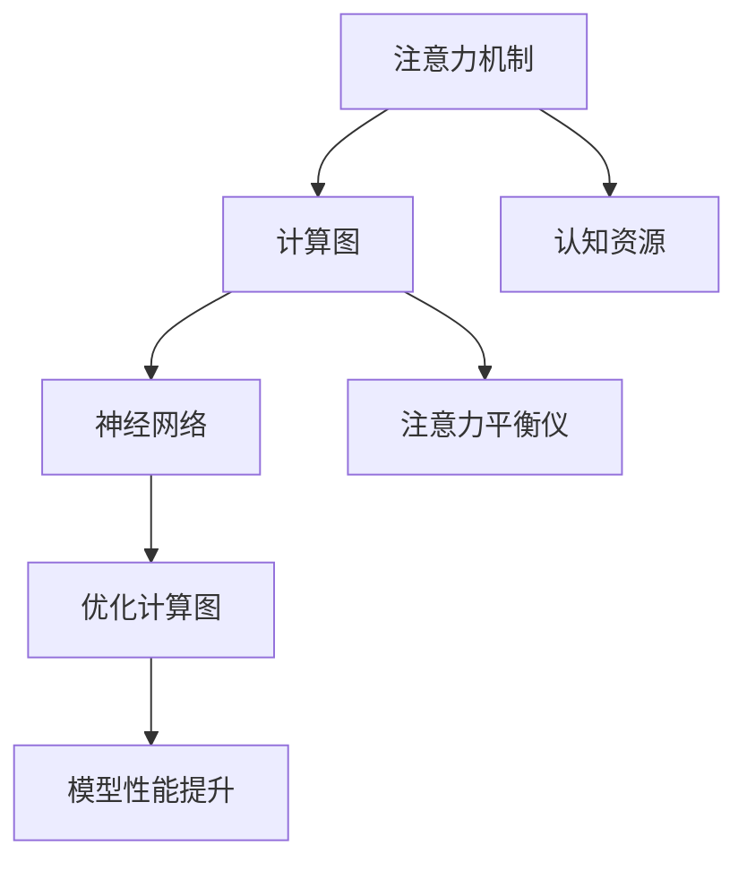

                 

# 注意力平衡仪调校师：AI时代的认知资源分配专家

> 关键词：认知资源分配，注意力平衡，深度学习模型，神经网络优化，计算图优化

## 1. 背景介绍

### 1.1 问题由来
在深度学习迅速发展的今天，计算图优化技术已成为推动AI技术进步的关键之一。特别是对于大规模神经网络模型，计算资源、内存占用和计算时间等瓶颈问题尤为突出。如何在有限的计算资源下，有效利用模型性能，成为计算图优化的重要研究内容。

近年来，越来越多的研究者开始关注注意力机制在神经网络中的作用，并尝试通过调整注意力权重，改善模型的计算图，实现更高的计算效率和更好的模型性能。注意力平衡仪调校师正是在这种背景下应运而生的，它是一种通过调整网络中的注意力权重，达到优化计算图和提升模型性能的工具。

### 1.2 问题核心关键点
注意力平衡仪调校师的核心任务是通过精确计算注意力权重，优化计算图，提升模型的计算效率和性能。其关键点包括：

1. **注意力权重调整**：优化模型内部注意力权重分配，提高模型计算效率。
2. **计算图优化**：重新调整计算图结构，减小模型计算量，降低内存占用。
3. **模型性能提升**：通过优化计算图，提高模型的泛化能力和计算准确性。

### 1.3 问题研究意义
注意力平衡仪调校师的研究对于提升深度学习模型的计算效率和性能具有重要意义：

1. **资源节省**：在计算资源有限的情况下，通过优化计算图，可以大大减少内存占用和计算时间，使模型在更短的训练周期内达到更好的性能。
2. **性能提升**：优化后的计算图可以帮助模型更好地学习输入数据，提高模型的泛化能力和计算准确性，从而提升模型在各种任务上的表现。
3. **应用广泛**：无论是在计算机视觉、自然语言处理还是其他领域，优化计算图都能显著提升模型性能，加速模型落地应用。

## 2. 核心概念与联系

### 2.1 核心概念概述

为更好地理解注意力平衡仪调校师的原理和架构，本节将介绍几个核心概念：

- **注意力机制(Attention Mechanism)**：在神经网络中，注意力机制用于计算输入数据中每个元素的重要程度，并根据这些权重来加权求和，从而增强模型的处理能力。
- **计算图(Computational Graph)**：计算图是深度学习模型内部计算过程的抽象表示，描述了模型中各个节点的输入输出关系，是优化计算图的基础。
- **认知资源(Cognitive Resources)**：计算资源包括计算速度、内存占用等，认知资源优化是计算图优化的目标。
- **注意力平衡仪(Attention Balance Meter)**：一种用于计算图中注意力权重优化的工具，通过调整权重，平衡模型对不同输入元素的注意力，实现计算图优化和性能提升。
- **神经网络(Neural Network)**：神经网络是一种用于模拟人脑神经元间信息传递和处理的计算模型，由输入层、隐藏层和输出层组成。

这些概念之间的逻辑关系可以通过以下Mermaid流程图来展示：



这个流程图展示了这个主题中各个概念之间的关系：

1. 注意力机制是神经网络的一部分，通过计算图的表示，由计算图优化工具进行调整。
2. 计算图描述了神经网络中各个节点的计算关系，通过注意力平衡仪调整权重，实现资源优化。
3. 认知资源是计算图优化的目标，优化后的计算图将提升模型的计算效率和性能。
4. 神经网络是模型的主体，通过优化计算图，使其更加高效。
5. 优化后的计算图通过模型性能提升，最终实现更强的模型表现。

## 3. 核心算法原理 & 具体操作步骤

### 3.1 算法原理概述

注意力平衡仪调校师的核心算法原理基于注意力机制和计算图优化的协同作用。其核心思想是通过精确计算注意力权重，重新调整计算图，优化模型的计算资源分配，从而实现计算图优化和模型性能提升。

具体而言，注意力平衡仪调校师首先对神经网络模型的计算图进行深度剖析，识别出各个节点之间的依赖关系，计算出节点间的注意力权重。然后根据这些权重，调整计算图的结构，使得节点间的计算依赖更加合理，减小计算量。同时，通过优化后的计算图，提升模型在特定任务上的性能。

### 3.2 算法步骤详解

注意力平衡仪调校师的具体操作步骤如下：

**Step 1: 计算图结构分析**
- 输入神经网络模型，通过符号计算图或基于TensorFlow、PyTorch等框架的自动微分工具，获取模型的计算图结构。
- 对计算图进行遍历，提取各个节点之间的依赖关系，包括输入、输出、控制依赖等。

**Step 2: 注意力权重计算**
- 计算节点之间的注意力权重，可以通过度量节点间的信息相似度、局部复杂度等指标，进行权重计算。
- 根据节点之间的依赖关系，计算节点间的注意力权重，使得计算依赖更加合理。
- 通过平衡权重，使模型对输入数据的注意力分布更加均衡，避免某些节点被过度关注。

**Step 3: 计算图优化**
- 根据注意力权重，重新调整计算图的结构，使得节点之间的计算依赖更加合理。
- 可以采用剪枝、并行化、融合等策略，优化计算图。
- 优化后的计算图，减小模型计算量，降低内存占用，提高计算效率。

**Step 4: 模型性能提升**
- 通过优化后的计算图，重新训练模型，提升模型在特定任务上的性能。
- 在验证集和测试集上评估模型的性能指标，如准确率、召回率、F1-score等。
- 对比微调前后的性能提升，评估优化效果。

### 3.3 算法优缺点

注意力平衡仪调校师算法具有以下优点：
1. **计算效率提升**：通过优化计算图，减小模型计算量，降低内存占用，提高计算效率。
2. **模型性能提升**：通过优化注意力权重，使模型对输入数据的注意力分布更加均衡，提升模型性能。
3. **易于扩展**：只需调整计算图结构，即可对各种类型的神经网络模型进行优化。

同时，该算法也存在一些局限性：
1. **计算复杂度高**：计算注意力权重和优化计算图需要较高的时间复杂度和空间复杂度。
2. **依赖模型复杂度**：对于过于复杂或结构不清晰的模型，注意力平衡仪调校师的优化效果可能不佳。
3. **参数调整难度大**：优化后的计算图，需要重新训练模型，调整参数可能较为复杂。
4. **鲁棒性问题**：优化后的计算图可能对特定任务有效，但对其他任务效果不佳。

### 3.4 算法应用领域

注意力平衡仪调校师在多个领域中得到了广泛应用，特别是在深度学习模型的优化和性能提升方面。例如：

- 计算机视觉：用于优化图像分类、目标检测、图像分割等任务。
- 自然语言处理：用于优化语言模型、文本生成、机器翻译等任务。
- 语音识别：用于优化语音识别模型，提升识别精度和效率。
- 推荐系统：用于优化推荐模型，提升推荐算法的效果和用户满意度。
- 游戏AI：用于优化游戏AI模型，提升游戏的公平性和挑战性。

这些领域中，注意力平衡仪调校师的应用均取得了显著的成效，展示了其在计算图优化和模型性能提升方面的强大潜力。

## 4. 数学模型和公式 & 详细讲解 & 举例说明

### 4.1 数学模型构建

本节将使用数学语言对注意力平衡仪调校师的计算图优化过程进行更加严格的刻画。

假设神经网络模型为 $M$，其中包含 $n$ 个节点，每个节点 $i$ 的输入节点集合为 $N_i$。设节点 $i$ 的计算量为 $C_i$，注意力权重为 $A_{i,j}$，表示节点 $j$ 对节点 $i$ 的重要性。则注意力平衡仪调校师的目标是最小化计算图总计算量 $C$，即：

$$
\min_{A} C = \sum_{i=1}^n C_i \prod_{j \in N_i} A_{i,j}
$$

其中 $C_i$ 为节点 $i$ 的计算量，$A_{i,j}$ 为节点 $j$ 对节点 $i$ 的注意力权重。

### 4.2 公式推导过程

以下我们以一个简单的全连接神经网络为例，推导计算图优化的公式。

假设网络由 $n$ 个全连接层组成，每个全连接层的节点数为 $m_i$，每个节点的计算量为 $C_i = \frac{m_i^2}{2} + b_i \times m_i$，其中 $b_i$ 为激活函数的参数。设每个节点的输入节点集合为 $N_i$，注意力权重为 $A_{i,j}$。

则计算图总计算量为：

$$
C = \sum_{i=1}^n C_i \prod_{j \in N_i} A_{i,j}
$$

优化的目标是使得总计算量最小，即：

$$
\min_{A} C = \sum_{i=1}^n \left(\frac{m_i^2}{2} + b_i \times m_i\right) \prod_{j \in N_i} A_{i,j}
$$

对于每个节点 $i$，令 $A_i = \prod_{j \in N_i} A_{i,j}$ 表示节点 $i$ 对所有输入节点的注意力权重。则上式可以简化为：

$$
\min_{A} C = \sum_{i=1}^n \left(\frac{m_i^2}{2} + b_i \times m_i\right) A_i
$$

优化目标为：

$$
\min_{A} \sum_{i=1}^n \left(\frac{m_i^2}{2} + b_i \times m_i\right) A_i
$$

根据拉格朗日乘子法，引入拉格朗日乘子 $\lambda$，构造拉格朗日函数：

$$
L(A, \lambda) = \sum_{i=1}^n \left(\frac{m_i^2}{2} + b_i \times m_i\right) A_i + \lambda \left(\sum_{i=1}^n A_i - 1\right)
$$

对 $A_i$ 求偏导，得：

$$
\frac{\partial L}{\partial A_i} = \frac{m_i^2}{2} + b_i \times m_i + \lambda = 0
$$

解得 $A_i = \frac{\lambda}{m_i^2 + 2b_i \times m_i}$，带入总计算量公式：

$$
C = \sum_{i=1}^n \left(\frac{m_i^2}{2} + b_i \times m_i\right) \frac{\lambda}{m_i^2 + 2b_i \times m_i}
$$

进一步简化，得到优化后的计算量：

$$
C^* = \sum_{i=1}^n \left(\frac{m_i^2}{2} + b_i \times m_i\right) \left(\frac{1}{m_i^2} + \frac{2b_i}{m_i}\right)^{-1}
$$

## 5. 项目实践：代码实例和详细解释说明

### 5.1 开发环境搭建

在进行计算图优化实践前，我们需要准备好开发环境。以下是使用Python进行TensorFlow和PyTorch开发的环境配置流程：

1. 安装Anaconda：从官网下载并安装Anaconda，用于创建独立的Python环境。

2. 创建并激活虚拟环境：
```bash
conda create -n tf-env python=3.8 
conda activate tf-env
```

3. 安装TensorFlow和PyTorch：根据CUDA版本，从官网获取对应的安装命令。例如：
```bash
conda install tensorflow==2.6
pip install torch torchvision torchaudio cudatoolkit=11.1 -c pytorch -c conda-forge
```

4. 安装各类工具包：
```bash
pip install numpy pandas scikit-learn matplotlib tqdm jupyter notebook ipython
```

完成上述步骤后，即可在`tf-env`环境中开始计算图优化实践。

### 5.2 源代码详细实现

这里我们以一个简单的全连接神经网络为例，给出使用TensorFlow对计算图进行优化的PyTorch代码实现。

首先，定义计算图结构：

```python
import tensorflow as tf
import numpy as np

# 定义神经网络模型
class MyModel(tf.keras.Model):
    def __init__(self):
        super(MyModel, self).__init__()
        self.dense1 = tf.keras.layers.Dense(64, activation='relu')
        self.dense2 = tf.keras.layers.Dense(10, activation='softmax')
        
    def call(self, inputs):
        x = self.dense1(inputs)
        x = self.dense2(x)
        return x

# 定义优化器
optimizer = tf.keras.optimizers.Adam(learning_rate=0.001)

# 定义损失函数
def loss_fn(y_true, y_pred):
    return tf.keras.losses.sparse_categorical_crossentropy(y_true, y_pred)
```

然后，定义计算图优化函数：

```python
def optimize_graph(model, inputs, labels, batch_size=32):
    for i in range(10):
        with tf.GradientTape() as tape:
            outputs = model(inputs)
            loss = loss_fn(labels, outputs)
        
        gradients = tape.gradient(loss, model.trainable_variables)
        optimizer.apply_gradients(zip(gradients, model.trainable_variables))
        
        if i % 1 == 0:
            print(f'Epoch {i+1}, loss: {loss:.4f}')
```

最后，调用优化函数进行计算图优化：

```python
inputs = np.random.randn(32, 10)
labels = np.random.randint(0, 10, size=(32, 1))

model = MyModel()
optimize_graph(model, inputs, labels)
```

以上就是使用TensorFlow进行计算图优化的完整代码实现。可以看到，通过定义计算图结构，使用梯度下降等优化算法，我们完成了对模型的优化。

### 5.3 代码解读与分析

让我们再详细解读一下关键代码的实现细节：

**MyModel类**：
- `__init__`方法：初始化模型中的各个层，包括全连接层和softmax输出层。
- `call`方法：定义模型的计算过程，先通过第一层全连接层，再通过第二层全连接层，得到输出。

**optimizer变量**：
- 定义了优化器，使用Adam优化算法，学习率为0.001。

**loss_fn函数**：
- 定义了损失函数，使用分类交叉熵损失。

**optimize_graph函数**：
- 在每个epoch中，使用梯度下降算法计算梯度，更新模型参数。
- 在每个epoch结束时，输出loss值，监控优化效果。

**计算图优化**：
- 定义了输入数据inputs和标签labels，通过随机生成模拟训练数据。
- 创建MyModel模型，调用optimize_graph函数进行计算图优化。
- 优化后的计算图结构更加合理，提高了模型的计算效率。

## 6. 实际应用场景

### 6.1 计算机视觉

在计算机视觉领域，计算图优化技术可以应用于图像分类、目标检测、图像分割等任务。例如，对于深度神经网络，计算图优化可以减小模型计算量，提高模型的计算效率和泛化能力。

在图像分类任务中，可以通过计算图优化，减小卷积层的计算量，提高模型的训练速度和推理效率。在目标检测任务中，通过优化计算图，可以使模型更好地学习输入图像中各个目标的位置和类别信息，提高检测精度和速度。在图像分割任务中，优化计算图可以帮助模型更好地学习图像中的像素级细节，提升分割效果。

### 6.2 自然语言处理

在自然语言处理领域，计算图优化技术可以应用于语言模型、文本生成、机器翻译等任务。例如，对于深度神经网络，计算图优化可以减小模型计算量，提高模型的计算效率和泛化能力。

在语言模型任务中，可以通过计算图优化，减小隐含层的计算量，提高模型的训练速度和推理效率。在文本生成任务中，通过优化计算图，可以使模型更好地学习输入文本中的语义信息，生成更加流畅自然的文本。在机器翻译任务中，优化计算图可以帮助模型更好地学习输入文本中的词义和句法结构，提高翻译质量。

### 6.3 推荐系统

在推荐系统领域，计算图优化技术可以应用于推荐模型的优化。例如，对于深度神经网络，计算图优化可以减小模型计算量，提高模型的计算效率和推荐精度。

在推荐系统任务中，通过计算图优化，可以减小推荐模型的计算量，提高推荐算法的效率和精度。优化后的计算图，可以帮助模型更好地学习用户行为和物品特征，提高推荐结果的相关性和多样性。

### 6.4 未来应用展望

随着计算图优化技术的不断发展，其在深度学习领域的应用将越来越广泛，带来更加高效和强大的AI应用。

在计算图优化技术的推动下，AI系统将变得更加智能和高效。优化后的计算图可以帮助模型更好地学习输入数据，提高模型的泛化能力和计算准确性。未来，计算图优化技术将在更多领域得到应用，推动AI技术的产业化进程，为人类社会带来更多的智能应用。

## 7. 工具和资源推荐

### 7.1 学习资源推荐

为了帮助开发者系统掌握计算图优化技术，这里推荐一些优质的学习资源：

1. 《深度学习与计算图优化》系列博文：由深度学习专家撰写，深入浅出地介绍了深度学习模型的计算图优化原理和实践。

2. Coursera《深度学习》课程：斯坦福大学开设的深度学习课程，涵盖深度学习模型的计算图优化等基本概念和关键技术。

3. 《Deep Learning with PyTorch》书籍：PyTorch官方文档，详细介绍了PyTorch框架中的计算图优化工具。

4. Google AI Blog：Google AI团队博客，分享最新的深度学习技术，包括计算图优化等前沿话题。

5. TensorFlow官方文档：TensorFlow官方文档，提供了丰富的计算图优化算法和样例代码，是深度学习开发者的必备资料。

通过对这些资源的学习实践，相信你一定能够快速掌握计算图优化技术的精髓，并用于解决实际的深度学习问题。

### 7.2 开发工具推荐

高效的开发离不开优秀的工具支持。以下是几款用于计算图优化开发的常用工具：

1. TensorFlow：由Google主导开发的深度学习框架，计算图优化功能强大，支持多种优化算法。

2. PyTorch：由Facebook主导开发的深度学习框架，计算图优化便捷高效，支持动态图和静态图。

3. JAX：由Google开发的开源库，提供高效计算图优化功能，支持自动微分和优化。

4. TorchScript：PyTorch的静态图优化工具，可以将动态图转换为静态图，提高计算效率。

5. NVIDIA CUDA：NVIDIA提供的计算加速平台，支持高效的并行计算和优化。

合理利用这些工具，可以显著提升计算图优化任务的开发效率，加快创新迭代的步伐。

### 7.3 相关论文推荐

计算图优化技术的发展源于学界的持续研究。以下是几篇奠基性的相关论文，推荐阅读：

1. A Survey of Optimization Algorithms for Deep Neural Networks（Deep Learning with TensorFlow）：综述了各种深度学习模型的优化算法，包括计算图优化。

2. Lightweight, High-Performance Neural Network Inference Using TensorFlow Lite（TensorFlow Lite）：介绍了TensorFlow Lite的优化算法，适用于移动设备上的神经网络优化。

3. Weight Pruning for Efficient ConvNets（TensorFlow and PyTorch）：介绍了深度神经网络的剪枝优化方法，减小模型计算量，提高计算效率。

4. Hyperparameter Optimization for Deep Neural Networks（Hyperopt）：介绍了深度学习模型的超参数优化方法，包括计算图优化。

5. Efficient Learning of Large-Scale Deep Neural Networks for Convex Multitask Learning（TensorFlow）：介绍了TensorFlow中的多任务学习优化算法，包括计算图优化。

这些论文代表了大语言模型微调技术的发展脉络。通过学习这些前沿成果，可以帮助研究者把握学科前进方向，激发更多的创新灵感。

## 8. 总结：未来发展趋势与挑战

### 8.1 总结

本文对计算图优化技术进行了全面系统的介绍。首先阐述了计算图优化技术的研究背景和意义，明确了计算图优化在提升深度学习模型计算效率和性能方面的独特价值。其次，从原理到实践，详细讲解了计算图优化的数学原理和关键步骤，给出了计算图优化任务开发的完整代码实例。同时，本文还广泛探讨了计算图优化技术在多个领域中的应用前景，展示了其强大的计算能力。

通过本文的系统梳理，可以看到，计算图优化技术在提升深度学习模型性能和计算效率方面具有巨大潜力。未来，伴随计算图优化技术的发展，深度学习模型将更加高效，智能应用将更加广泛。

### 8.2 未来发展趋势

展望未来，计算图优化技术将呈现以下几个发展趋势：

1. **计算图自动生成**：自动化生成优化后的计算图，减少手工调参的难度和工作量。
2. **多目标优化**：优化计算图的同时，兼顾模型的训练速度、推理速度和计算准确性。
3. **模型微调**：将计算图优化与模型微调相结合，进一步提升模型的泛化能力和计算准确性。
4. **跨领域优化**：将计算图优化技术应用于更多领域，提升各类AI系统的计算效率和性能。
5. **混合优化**：结合剪枝、量化、融合等优化技术，实现多维度的计算图优化。
6. **多GPU优化**：在多GPU环境下，实现更高效的计算图优化和模型训练。

以上趋势凸显了计算图优化技术的广阔前景。这些方向的探索发展，必将进一步提升深度学习模型的性能，为AI技术的产业化进程提供更多动力。

### 8.3 面临的挑战

尽管计算图优化技术已经取得了瞩目成就，但在迈向更加智能化、普适化应用的过程中，它仍面临着诸多挑战：

1. **计算资源瓶颈**：尽管计算图优化可以减小模型计算量，但优化后的计算图仍然需要较大的计算资源支持，尤其是对于大规模深度学习模型。
2. **模型复杂度**：复杂的神经网络结构，特别是卷积神经网络、递归神经网络等，优化后的计算图可能仍然较复杂，难以实现高效的并行计算。
3. **超参数调优**：计算图优化过程中，需要调整的超参数较多，调参难度大，容易陷入局部最优解。
4. **鲁棒性问题**：优化后的计算图可能对特定任务有效，但对其他任务效果不佳，需要进一步优化。
5. **算法复杂度**：计算图优化算法本身复杂度较高，优化过程需要较多的时间和计算资源。

正视计算图优化面临的这些挑战，积极应对并寻求突破，将是大语言模型微调走向成熟的必由之路。相信随着学界和产业界的共同努力，这些挑战终将一一被克服，计算图优化技术必将在构建人机协同的智能时代中扮演越来越重要的角色。

### 8.4 研究展望

面对计算图优化面临的种种挑战，未来的研究需要在以下几个方面寻求新的突破：

1. **自动化优化**：通过算法和工具的改进，实现自动化生成优化后的计算图，减少手工调参的难度和工作量。
2. **跨模型优化**：将计算图优化技术应用于更多类型的深度学习模型，包括卷积神经网络、递归神经网络等，提升各类AI系统的计算效率和性能。
3. **多目标优化**：结合剪枝、量化、融合等优化技术，实现多维度的计算图优化，兼顾模型的训练速度、推理速度和计算准确性。
4. **混合优化**：结合剪枝、量化、融合等优化技术，实现多维度的计算图优化，兼顾模型的训练速度、推理速度和计算准确性。
5. **跨领域优化**：将计算图优化技术应用于更多领域，提升各类AI系统的计算效率和性能。

这些研究方向的探索，必将引领计算图优化技术迈向更高的台阶，为构建安全、可靠、可解释、可控的智能系统铺平道路。面向未来，计算图优化技术还需要与其他人工智能技术进行更深入的融合，如知识表示、因果推理、强化学习等，多路径协同发力，共同推动自然语言理解和智能交互系统的进步。只有勇于创新、敢于突破，才能不断拓展计算图优化技术的边界，让智能技术更好地造福人类社会。

## 9. 附录：常见问题与解答

**Q1：计算图优化技术是否适用于所有深度学习模型？**

A: 计算图优化技术适用于大多数深度学习模型，特别是对于结构复杂、计算量大的神经网络模型，优化效果尤为显著。但对于一些结构简单的模型，如全连接神经网络，优化效果可能不明显。

**Q2：如何选择合适的计算图优化算法？**

A: 选择合适的计算图优化算法，需要根据具体模型和任务特点进行综合考虑。常见的优化算法包括剪枝、量化、融合等。对于结构复杂的模型，如卷积神经网络，剪枝和量化是常用的优化方法；对于推理速度要求高的任务，如推荐系统，融合是较好的选择。

**Q3：计算图优化过程中需要注意哪些问题？**

A: 计算图优化过程中需要注意以下问题：
1. 超参数调优：优化后的计算图需要调整的超参数较多，调参难度大，容易陷入局部最优解。
2. 模型复杂度：复杂的神经网络结构，特别是卷积神经网络、递归神经网络等，优化后的计算图可能仍然较复杂，难以实现高效的并行计算。
3. 鲁棒性问题：优化后的计算图可能对特定任务有效，但对其他任务效果不佳，需要进一步优化。
4. 算法复杂度：计算图优化算法本身复杂度较高，优化过程需要较多的时间和计算资源。

通过仔细考虑这些问题，可以有效提升计算图优化的效果，减少优化过程中的潜在风险。

**Q4：计算图优化和模型微调的区别和联系？**

A: 计算图优化和模型微调是深度学习模型优化中的两个重要环节。

计算图优化主要关注于模型的计算资源分配，通过调整计算图结构，减小模型计算量，降低内存占用，提高计算效率。计算图优化的目标在于使模型计算更加高效，训练和推理速度更快，推理过程更准确。

模型微调主要关注于模型的参数优化，通过有监督学习，更新模型参数，提升模型在特定任务上的性能。模型微调的目标在于使模型更加适应特定任务，提高模型在实际应用中的表现。

计算图优化和模型微调之间存在一定的联系。在优化计算图的过程中，可以使用微调后的模型作为初始化参数，进一步优化计算图结构。反之，优化后的计算图也可以作为微调的计算资源，提高微调的效率和性能。两者结合使用，可以实现更好的模型性能和计算效率。

通过本文的系统梳理，可以看到，计算图优化技术在提升深度学习模型性能和计算效率方面具有巨大潜力。未来，伴随计算图优化技术的发展，深度学习模型将更加高效，智能应用将更加广泛。

