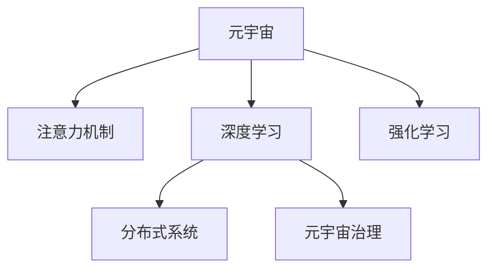

                 

# 注意力战争：元宇宙中的信息主导权争夺

> 关键词：元宇宙,信息主导权,注意力机制,深度学习,强化学习,分布式系统

## 1. 背景介绍

### 1.1 问题由来
元宇宙作为继Web2.0之后的一个重要技术革新，正在重塑互联网的形态，开启新的信息时代。然而，元宇宙不仅仅是3D空间和虚拟社交的平台，更是信息传播和价值交换的场所。在元宇宙中，信息主导权的争夺战日益激烈，以人工智能为核心的注意力机制正成为这场战争中不可或缺的关键工具。

元宇宙中的信息主导权，是指在虚拟空间中对信息资源的控制和分配能力。谁掌握了更多的注意力资源，谁就能在元宇宙中更有效地传播信息、构建社群、进行商业运作和政治宣传。因此，如何在元宇宙中实现对注意力资源的有效管理和利用，成为当前和未来科技发展的重要课题。

### 1.2 问题核心关键点
注意力战争的核心在于如何利用人工智能技术，特别是深度学习中的注意力机制，优化信息传播和用户交互方式，提升信息主导权。具体包括以下几个关键点：

1. **注意力机制**：理解信息传播和用户交互中的注意力分配规律，通过优化模型训练过程，提高信息传播的效率和精确度。

2. **深度学习算法**：利用深度学习算法，如Transformer、卷积神经网络(CNN)、循环神经网络(RNN)等，构建具有自我学习能力的智能系统，自动调整注意力资源的分配策略。

3. **强化学习**：通过强化学习算法，如Q-learning、Deep Q-learning等，在虚拟环境中进行智能决策，实现对注意力资源的动态调整和优化。

4. **分布式系统**：构建高效的分布式系统，实现对大量注意力资源的分布式管理和调度，提高系统的吞吐量和响应速度。

5. **元宇宙治理**：探索元宇宙中的信息治理机制，包括内容监管、隐私保护、信息真实性验证等，确保注意力资源的合理分配和使用。

## 2. 核心概念与联系

### 2.1 核心概念概述

为更好地理解注意力战争中的核心概念，本节将介绍几个关键概念及其相互联系：

- **元宇宙(Metaverse)**：由3D技术、虚拟现实(VR)、增强现实(AR)等技术构建的虚拟空间，用户可以在其中进行沉浸式互动。

- **注意力机制(Attention Mechanism)**：一种在深度学习中广泛使用的机制，用于确定哪些信息对于当前任务或上下文最为重要，进而提高信息处理效率。

- **深度学习(Deep Learning)**：一种基于多层神经网络的机器学习方法，能够自动学习特征表示，广泛应用于图像、语音、文本等领域。

- **强化学习(Reinforcement Learning)**：一种基于智能体在虚拟环境中进行试错学习的机器学习方法，通过奖励信号优化策略，提升决策能力。

- **分布式系统(Distributed System)**：由多个计算节点组成的系统，能够高效管理和调度大量资源，支持元宇宙的实时交互和信息处理。

- **元宇宙治理(Governance in Metaverse)**：涉及内容管理、隐私保护、数据安全和信息真实性验证等，确保元宇宙中的信息传播公正、透明、可信。

这些核心概念之间的逻辑关系可以通过以下Mermaid流程图来展示：



这个流程图展示了几大核心概念之间的关系：

1. 元宇宙作为平台，利用注意力机制、深度学习、强化学习等技术，构建智能信息传播系统。
2. 注意力机制和深度学习共同构建具有自我学习能力的智能系统。
3. 强化学习通过虚拟环境中的智能决策，动态调整注意力资源的分配。
4. 分布式系统实现对大量注意力资源的分布式管理和调度。
5. 元宇宙治理机制确保信息传播的公正、透明和可信。

这些概念共同构成了元宇宙信息主导权争夺的核心框架，为设计高效、智能、安全的注意力资源管理系统提供了理论基础。

## 3. 核心算法原理 & 具体操作步骤
### 3.1 算法原理概述

在元宇宙中，信息主导权的争夺主要通过注意力机制来实现。具体而言，利用深度学习中的注意力机制，在虚拟空间中优化信息传播路径和用户交互方式，从而提升信息主导权。

信息主导权的争夺可以概括为以下几个关键步骤：

1. **信息表示**：将虚拟世界中的信息资源转化为机器可处理的形式，通过特征提取和编码，构建信息表示。

2. **注意力计算**：利用注意力机制，计算不同信息源对当前任务或上下文的重要性权重，确定最相关的信息源。

3. **信息传播**：根据计算得到的注意力权重，动态调整信息传播路径，优先传播重要信息，提高信息传播效率。

4. **交互优化**：根据用户反馈和行为，利用强化学习算法，调整注意力分配策略，提升用户体验和满意度。

5. **分布式管理**：在分布式系统中，通过集中式或分布式调度算法，管理和调度注意力资源，确保系统高效运行。

### 3.2 算法步骤详解

**Step 1: 信息表示**
- 收集元宇宙中的文本、图像、视频、语音等各类信息资源，并对其进行特征提取。
- 利用深度学习模型，如BERT、CNN、RNN等，将提取的特征转化为向量表示，构建信息表示。

**Step 2: 注意力计算**
- 在注意力计算过程中，采用Transformer等模型，对信息表示进行自注意力和交叉注意力计算。
- 自注意力计算不同信息源内部的重要性权重，交叉注意力计算不同信息源之间的关系权重。
- 将计算得到的注意力权重组合，得到信息源的综合重要性权重。

**Step 3: 信息传播**
- 根据计算得到的注意力权重，动态调整信息传播路径，优先传播重要信息。
- 在传播过程中，采用分布式调度算法，如MapReduce、DAGScheduling等，提高信息传播效率。

**Step 4: 交互优化**
- 利用强化学习算法，如Q-learning、Deep Q-learning等，对用户反馈和行为进行分析。
- 根据分析结果，调整注意力分配策略，优化用户交互方式。

**Step 5: 分布式管理**
- 在分布式系统中，采用集中式或分布式调度算法，管理和调度注意力资源。
- 利用分布式计算框架，如Apache Spark、Apache Flink等，实现对大量注意力资源的分布式管理和调度。

### 3.3 算法优缺点

利用深度学习和强化学习技术，优化元宇宙中的信息传播和用户交互，具有以下优点：

1. **高效性**：通过自注意力和交叉注意力机制，动态调整信息传播路径，优化信息传播效率，提高系统响应速度。

2. **灵活性**：利用深度学习模型，自动学习信息表示和注意力权重，适应不同的信息源和任务需求，灵活性强。

3. **自适应性**：利用强化学习算法，自动调整注意力分配策略，适应用户行为和环境变化，自适应能力强。

4. **分布式性**：利用分布式系统，管理和调度大量注意力资源，支持元宇宙的实时交互和信息处理。

然而，这种方法也存在一定的局限性：

1. **计算资源消耗大**：深度学习模型和注意力计算需要大量的计算资源，对硬件设施要求较高。

2. **模型复杂度高**：深度学习模型和注意力计算过程复杂，模型训练和推理耗时较长。

3. **数据依赖性强**：深度学习模型和注意力计算依赖大量标注数据，数据获取和标注成本高。

4. **公平性问题**：注意力机制可能存在不公平的分配现象，某些信息源可能因标签或重要性权重分配不均而受到忽视。

5. **隐私和安全问题**：元宇宙中的信息传播可能涉及用户隐私，需要加强数据安全和隐私保护。

### 3.4 算法应用领域

基于深度学习和强化学习技术的信息主导权争夺方法，已经在元宇宙的多个领域得到应用，例如：

1. **内容推荐**：利用深度学习模型和注意力机制，构建个性化推荐系统，提升用户体验和信息传播效率。

2. **虚拟社交**：通过分析用户行为和反馈，利用强化学习算法，优化虚拟社交中的信息传播和用户交互。

3. **虚拟商品销售**：利用注意力机制和深度学习模型，优化虚拟商品展示和推荐策略，提升销售转化率。

4. **虚拟活动策划**：利用注意力机制和强化学习算法，动态调整虚拟活动内容，提升用户参与度和活动效果。

5. **虚拟教育培训**：利用深度学习模型和注意力机制，优化虚拟教育培训内容，提升学习效果和用户体验。

除了上述这些经典应用外，元宇宙中信息主导权争夺的方法还将在更多场景中得到创新性地应用，如虚拟展览、虚拟旅游、虚拟会议等，为元宇宙技术的发展带来新的突破。

## 4. 数学模型和公式 & 详细讲解  
### 4.1 数学模型构建

本节将使用数学语言对元宇宙信息主导权的争夺方法进行更加严格的刻画。

记信息源为 $X=\{x_i\}_{i=1}^N$，其中 $x_i$ 为第 $i$ 个信息源的信息表示。记注意力权重为 $W=\{w_i\}_{i=1}^N$，其中 $w_i$ 为信息源 $x_i$ 的重要性权重。

定义注意力计算过程为：

$$
W = \mathrm{softmax}(A_{\textrm{att}}(X, W))
$$

其中 $A_{\textrm{att}}$ 为注意力计算函数， $\mathrm{softmax}$ 函数为归一化指数函数。

定义信息传播过程为：

$$
Y = \sum_{i=1}^N w_i x_i
$$

其中 $Y$ 为信息传播后的结果。

在信息传播过程中，采用分布式调度算法，如MapReduce、DAGScheduling等，对注意力资源进行管理和调度，实现对大量信息源的高效管理和调度。

### 4.2 公式推导过程

以下我们以虚拟社交推荐系统为例，推导基于注意力机制的推荐算法。

假设用户 $u$ 的兴趣向量为 $v_u$，信息源 $x_i$ 的兴趣权重为 $w_{ui}$。推荐系统通过计算用户与信息源之间的注意力权重 $w_{ui}$，得到推荐结果 $y_u$。

$$
w_{ui} = \mathrm{softmax}(A_{\textrm{att}}(x_i, v_u))
$$

其中 $A_{\textrm{att}}$ 为自注意力机制，定义为：

$$
A_{\textrm{att}}(x_i, v_u) = \frac{v_u^T Q(x_i)}{\sqrt{d} \|v_u\| \|Q(x_i)\|}
$$

其中 $Q(x_i)$ 为信息源 $x_i$ 的嵌入向量， $d$ 为嵌入向量的维度。

推荐结果 $y_u$ 为：

$$
y_u = \sum_{i=1}^N w_{ui} x_i
$$

将推荐结果 $y_u$ 与用户的历史行为 $y_h$ 进行比较，定义推荐效果评估函数为：

$$
R(y_u, y_h) = \frac{\sum_{i=1}^N w_{ui} x_i \cdot y_h}{\|y_h\|}
$$

通过优化推荐效果评估函数，可以得到最优的信息源和推荐策略。

## 5. 项目实践：代码实例和详细解释说明
### 5.1 开发环境搭建

在进行元宇宙信息主导权争夺的实践前，我们需要准备好开发环境。以下是使用Python进行TensorFlow开发的环境配置流程：

1. 安装Anaconda：从官网下载并安装Anaconda，用于创建独立的Python环境。

2. 创建并激活虚拟环境：
```bash
conda create -n tf-env python=3.8 
conda activate tf-env
```

3. 安装TensorFlow：根据CUDA版本，从官网获取对应的安装命令。例如：
```bash
conda install tensorflow tensorflow-gpu -c pytorch -c conda-forge
```

4. 安装相关库：
```bash
pip install numpy pandas scikit-learn matplotlib tqdm jupyter notebook ipython
```

完成上述步骤后，即可在`tf-env`环境中开始实践。

### 5.2 源代码详细实现

这里我们以虚拟社交推荐系统为例，给出使用TensorFlow实现注意力机制的代码实现。

首先，定义信息源和用户向量：

```python
import tensorflow as tf

# 信息源向量
X = tf.random.normal(shape=(N, D))
# 用户向量
v_u = tf.random.normal(shape=(D,))

# 注意力计算
W = tf.nn.softmax(tf.matmul(X, v_u, transpose_b=True) / tf.sqrt(D))
```

然后，定义推荐结果的计算：

```python
# 信息源嵌入
Q = tf.random.normal(shape=(N, D))

# 推荐结果计算
y_u = tf.matmul(Q, W)
```

接着，定义推荐效果评估函数：

```python
# 用户历史行为向量
y_h = tf.random.normal(shape=(D,))

# 推荐效果评估
R = tf.reduce_sum(y_u * y_h) / tf.linalg.norm(y_h)
```

最后，使用优化器进行模型训练：

```python
# 定义优化器
optimizer = tf.keras.optimizers.Adam()

# 定义损失函数
loss = tf.keras.losses.MeanSquaredError()

# 训练过程
for i in range(num_epochs):
    # 计算梯度
    with tf.GradientTape() as tape:
        R_loss = loss(R, y_h)
    # 优化模型
    gradients = tape.gradient(R_loss, [X, Q, v_u])
    optimizer.apply_gradients(zip(gradients, [X, Q, v_u]))
```

以上就是使用TensorFlow实现虚拟社交推荐系统的完整代码实现。可以看到，TensorFlow提供了强大的自动微分和优化器功能，使得模型训练和优化过程变得非常简单。

### 5.3 代码解读与分析

让我们再详细解读一下关键代码的实现细节：

**虚拟社交推荐系统**：
- 定义信息源和用户向量，分别表示信息源和用户。
- 使用注意力计算函数 `tf.nn.softmax` 计算注意力权重，得到用户对信息源的兴趣程度。
- 将注意力权重与信息源向量相乘，得到推荐结果。
- 计算推荐效果评估函数，与用户历史行为向量进行比较。
- 定义优化器和损失函数，进行模型训练。

在TensorFlow中，模型定义和训练过程非常简单，使用自动微分功能和优化器可以非常方便地实现模型的优化。同时，TensorFlow提供了丰富的工具和函数，方便进行模型可视化、调试和性能分析。

当然，工业级的系统实现还需考虑更多因素，如模型保存和部署、超参数调优、分布式训练等。但核心的注意力机制基本与此类似。

## 6. 实际应用场景
### 6.1 虚拟商品销售

在元宇宙中，虚拟商品销售具有广阔的发展前景。利用注意力机制和深度学习技术，可以构建更加精准和个性化的推荐系统，提升用户的购物体验和销售转化率。

具体而言，可以收集用户的行为数据和评价数据，构建用户兴趣模型和商品属性模型。利用注意力机制和深度学习模型，对用户和商品进行匹配，推荐最符合用户偏好的虚拟商品。在推荐过程中，实时更新用户和商品的属性，动态调整注意力权重，进一步提升推荐效果。

### 6.2 虚拟活动策划

虚拟活动策划是元宇宙中的重要应用场景之一。利用注意力机制和强化学习技术，可以动态调整活动内容和形式，提升用户的参与度和活动效果。

具体而言，可以设计多种虚拟活动形式，如虚拟演唱会、虚拟展览、虚拟会议等。通过收集用户行为和反馈，利用强化学习算法，自动调整活动内容和形式。例如，根据用户参与度，动态调整音乐节奏、场景布置等，提升用户的体验和参与感。

### 6.3 虚拟教育培训

元宇宙中的虚拟教育培训具有广阔的前景，可以突破传统教育的限制，提供更加互动和沉浸式的学习体验。

利用注意力机制和深度学习技术，可以优化虚拟教育培训的内容和形式。例如，根据学生的学习进度和兴趣，动态调整课程内容和学习路径。利用注意力机制，优先推荐学生感兴趣和掌握困难的内容，提升学习效果。

### 6.4 未来应用展望

随着元宇宙技术的不断发展和普及，注意力机制在信息主导权争夺中的作用将越来越重要。未来，基于深度学习和强化学习技术的注意力机制将在更多场景中得到应用，为元宇宙技术带来新的突破。

在智慧医疗领域，利用注意力机制和深度学习技术，可以为医生和患者提供更加智能和个性化的医疗服务，提升诊疗效率和患者满意度。

在智能交通领域，利用注意力机制和强化学习技术，可以实现智能交通流量管理，提升交通系统的安全和效率。

在金融领域，利用注意力机制和深度学习技术，可以实现智能金融风险管理，提升金融系统的稳定性和安全性。

除了这些应用领域外，元宇宙中的信息主导权争夺方法还将在更多场景中得到创新性地应用，如虚拟旅游、虚拟会议、虚拟展览等，为元宇宙技术带来新的价值和活力。

## 7. 工具和资源推荐
### 7.1 学习资源推荐

为了帮助开发者系统掌握元宇宙信息主导权的争夺方法，这里推荐一些优质的学习资源：

1. 《深度学习框架TensorFlow实战》系列博文：由TensorFlow官方团队撰写，详细介绍TensorFlow的使用方法和实践案例。

2. 《强化学习》课程：由斯坦福大学开设的强化学习课程，系统介绍强化学习的基本概念和算法。

3. 《Attention Is All You Need》论文：Transformer的原始论文，阐述了自注意力机制在深度学习中的应用。

4. TensorFlow官方文档：TensorFlow的官方文档，提供了丰富的模型和工具，方便进行深度学习和强化学习的开发。

5. Coursera《深度学习》课程：由深度学习领域的权威专家Andrew Ng讲授，系统介绍深度学习的基本概念和应用。

通过对这些资源的学习实践，相信你一定能够快速掌握元宇宙信息主导权的争夺方法，并用于解决实际的元宇宙应用问题。

### 7.2 开发工具推荐

高效的开发离不开优秀的工具支持。以下是几款用于元宇宙信息主导权争夺开发的常用工具：

1. TensorFlow：由Google主导开发的开源深度学习框架，生产部署方便，适合大规模工程应用。

2. PyTorch：基于Python的开源深度学习框架，灵活性强，适合快速迭代研究。

3. Keras：高层次的神经网络API，提供简洁的接口，方便进行模型构建和训练。

4. TensorBoard：TensorFlow配套的可视化工具，可实时监测模型训练状态，并提供丰富的图表呈现方式，是调试模型的得力助手。

5. Weights & Biases：模型训练的实验跟踪工具，可以记录和可视化模型训练过程中的各项指标，方便对比和调优。

6. Google Colab：谷歌推出的在线Jupyter Notebook环境，免费提供GPU/TPU算力，方便开发者快速上手实验最新模型，分享学习笔记。

合理利用这些工具，可以显著提升元宇宙信息主导权争夺的开发效率，加快创新迭代的步伐。

### 7.3 相关论文推荐

元宇宙信息主导权争夺的研究源于学界的持续研究。以下是几篇奠基性的相关论文，推荐阅读：

1. Attention Is All You Need（即Transformer原论文）：提出了Transformer结构，开启了深度学习中的自注意力机制时代。

2. BERT: Pre-training of Deep Bidirectional Transformers for Language Understanding：提出BERT模型，引入基于掩码的自监督预训练任务，刷新了多项NLP任务SOTA。

3. Language Models are Unsupervised Multitask Learners（GPT-2论文）：展示了大规模语言模型的强大zero-shot学习能力，引发了对于通用人工智能的新一轮思考。

4. Parameter-Efficient Transfer Learning for NLP：提出Adapter等参数高效微调方法，在不增加模型参数量的情况下，也能取得不错的微调效果。

5. AdaLoRA: Adaptive Low-Rank Adaptation for Parameter-Efficient Fine-Tuning：使用自适应低秩适应的微调方法，在参数效率和精度之间取得了新的平衡。

这些论文代表了大语言模型微调技术的发展脉络。通过学习这些前沿成果，可以帮助研究者把握学科前进方向，激发更多的创新灵感。

## 8. 总结：未来发展趋势与挑战
### 8.1 总结

本文对基于深度学习和强化学习技术的元宇宙信息主导权争夺方法进行了全面系统的介绍。首先阐述了元宇宙中信息主导权争夺的背景和意义，明确了注意力机制在其中的关键作用。其次，从原理到实践，详细讲解了元宇宙信息主导权的争夺方法，给出了元宇宙信息主导权争夺的完整代码实例。同时，本文还广泛探讨了注意力机制在元宇宙中的实际应用场景，展示了其广阔的应用前景。此外，本文精选了元宇宙信息主导权争夺技术的各类学习资源，力求为读者提供全方位的技术指引。

通过本文的系统梳理，可以看到，基于深度学习和强化学习的注意力机制正在成为元宇宙信息主导权争夺的重要工具。这些技术的应用，不仅提升了信息传播的效率和精准度，也极大地丰富了元宇宙的互动形式和用户体验。未来，伴随元宇宙技术的不断发展和普及，注意力机制在元宇宙中的应用将更加广泛，其作用也将越来越重要。

### 8.2 未来发展趋势

展望未来，元宇宙信息主导权争夺中的注意力机制将呈现以下几个发展趋势：

1. **深度融合**：随着元宇宙技术的发展，注意力机制将与其他AI技术如知识图谱、逻辑推理等深度融合，提升信息传播的智能化和全面性。

2. **个性化增强**：利用深度学习和强化学习技术，优化个性化推荐系统，提升用户的个性化体验和满意度。

3. **跨模态融合**：元宇宙中的信息传播不仅涉及文本、图像、视频等模态，还涉及语音、手势、虚拟现实等模态。跨模态注意力机制将支持多模态信息的高效处理和融合。

4. **分布式优化**：随着元宇宙规模的不断扩大，分布式注意力机制将应用于更大规模的虚拟世界，提升系统的响应速度和鲁棒性。

5. **元宇宙治理**：元宇宙中的信息主导权争夺涉及到内容监管、隐私保护、信息真实性验证等，需要结合元宇宙治理机制，确保信息传播的公正、透明和可信。

以上趋势凸显了元宇宙信息主导权争夺中注意力机制的广阔前景。这些方向的探索发展，必将进一步提升元宇宙信息传播的效率和精准度，为构建人机协同的智能未来铺平道路。

### 8.3 面临的挑战

尽管基于深度学习和强化学习的注意力机制在元宇宙中取得了显著进展，但在迈向更加智能化、普适化应用的过程中，仍面临诸多挑战：

1. **计算资源消耗**：深度学习和注意力计算需要大量的计算资源，对硬件设施要求较高。未来需要更高效的算法和更强大的硬件支持。

2. **模型复杂度**：深度学习和注意力机制的复杂度较高，模型训练和推理耗时较长。需要进一步优化模型结构和算法，提高计算效率。

3. **数据依赖性强**：深度学习和注意力计算依赖大量标注数据，数据获取和标注成本高。需要探索无监督和半监督学习方法，降低对标注数据的依赖。

4. **公平性问题**：注意力机制可能存在不公平的分配现象，某些信息源可能因标签或重要性权重分配不均而受到忽视。需要进一步优化注意力计算函数，提升公平性。

5. **隐私和安全问题**：元宇宙中的信息传播可能涉及用户隐私，需要加强数据安全和隐私保护。

6. **可解释性问题**：深度学习和注意力机制的黑盒特性，导致模型的可解释性不足。需要开发可解释性的AI技术，增强系统的透明性和可信度。

### 8.4 研究展望

面对元宇宙信息主导权争夺中注意力机制所面临的挑战，未来的研究需要在以下几个方面寻求新的突破：

1. **探索无监督和半监督学习方法**：摆脱对大规模标注数据的依赖，利用自监督学习、主动学习等无监督和半监督范式，最大限度利用非结构化数据，实现更加灵活高效的微调。

2. **优化模型结构和算法**：开发更加高效的深度学习和注意力机制算法，减少计算资源消耗，提高模型训练和推理速度。

3. **引入先验知识**：将符号化的先验知识，如知识图谱、逻辑规则等，与神经网络模型进行巧妙融合，引导注意力机制学习更准确、合理的语言模型。

4. **结合因果分析和博弈论工具**：将因果分析方法引入注意力机制，识别出模型决策的关键特征，增强输出解释的因果性和逻辑性。借助博弈论工具刻画人机交互过程，主动探索并规避模型的脆弱点，提高系统稳定性。

5. **纳入伦理道德约束**：在模型训练目标中引入伦理导向的评估指标，过滤和惩罚有偏见、有害的输出倾向。加强人工干预和审核，建立模型行为的监管机制，确保输出符合人类价值观和伦理道德。

这些研究方向的探索，必将引领元宇宙信息主导权争夺中的注意力机制迈向更高的台阶，为构建安全、可靠、可解释、可控的智能系统铺平道路。面向未来，元宇宙信息主导权争夺中的注意力机制还需要与其他AI技术进行更深入的融合，如知识表示、因果推理、强化学习等，多路径协同发力，共同推动元宇宙技术的进步。只有勇于创新、敢于突破，才能不断拓展元宇宙的边界，让智能技术更好地造福人类社会。

## 9. 附录：常见问题与解答

**Q1：元宇宙中的注意力机制与传统的注意力机制有何不同？**

A: 元宇宙中的注意力机制主要应用于虚拟空间中的信息传播和用户交互，而传统的注意力机制更多应用于自然语言处理(NLP)任务，如机器翻译、文本摘要等。元宇宙中的注意力机制需要处理更多的模态数据，如图像、语音、虚拟现实等，具有更强的跨模态融合能力。同时，元宇宙中的注意力机制也需要考虑分布式系统中的高效计算和资源管理，具有更高的系统复杂度。

**Q2：深度学习和强化学习在元宇宙中的应用前景如何？**

A: 深度学习和强化学习在元宇宙中的应用前景非常广阔，尤其是在信息主导权争夺中具有重要的作用。深度学习模型和注意力机制可以优化信息传播路径和用户交互方式，提升信息传播效率和精准度。强化学习算法可以自动调整注意力分配策略，优化用户行为和体验。未来，这些技术将在元宇宙中得到更广泛的应用，进一步提升元宇宙的智能化水平。

**Q3：如何降低元宇宙信息主导权争夺中的数据依赖？**

A: 降低元宇宙信息主导权争夺中的数据依赖，可以通过以下几种方式：

1. 利用无监督和半监督学习方法，在缺乏标注数据的情况下进行模型训练和优化。

2. 引入先验知识，如知识图谱、逻辑规则等，与神经网络模型进行融合，增强模型的泛化能力和鲁棒性。

3. 利用因果分析和博弈论工具，分析模型决策的关键特征，优化注意力机制的计算过程，减少对数据依赖的依赖。

4. 设计更加公平的注意力计算函数，避免某些信息源因标签或重要性权重分配不均而受到忽视，增强模型的公平性和鲁棒性。

这些方法将有助于降低元宇宙信息主导权争夺中的数据依赖，提升模型的适应性和鲁棒性。

**Q4：元宇宙中的信息主导权争夺中需要注意哪些隐私和安全问题？**

A: 元宇宙中的信息主导权争夺涉及到大量用户数据和虚拟信息，需要注意以下隐私和安全问题：

1. 用户数据隐私保护：确保用户数据在传输和存储过程中的安全性，防止数据泄露和滥用。

2. 虚拟信息真实性验证：防止虚假信息和谣言在元宇宙中的传播，确保虚拟信息的真实性和可信度。

3. 系统安全防护：防止元宇宙中的恶意攻击和破坏，确保系统的稳定性和安全性。

4. 用户行为监控：监控用户行为和交互，防止非法行为和滥用，确保系统的公平性和公正性。

通过加强隐私和安全防护，可以保障元宇宙中的信息主导权争夺在安全和可信的环境中进行，提升用户的信任和满意度。

**Q5：元宇宙中的注意力机制是否适用于所有信息主导权争夺场景？**

A: 元宇宙中的注意力机制在大多数信息主导权争夺场景中都能取得不错的效果，但对于一些特殊场景，如政治宣传、社会动员等，需要考虑更多的伦理和法律因素。例如，需要确保信息传播的公正性和透明度，避免虚假信息和谣言的传播，保护用户隐私和数据安全。

**Q6：如何确保元宇宙中的信息主导权争夺公正、透明和可信？**

A: 确保元宇宙中的信息主导权争夺公正、透明和可信，可以通过以下几种方式：

1. 建立透明的信息传播机制，确保信息传播的公正性和透明度。

2. 引入伦理导向的评估指标，过滤和惩罚有偏见、有害的输出倾向。

3. 加强用户行为监控和监管，防止非法行为和滥用，确保系统的公平性和公正性。

4. 建立模型行为的监管机制，确保模型输出的可信性和安全性。

通过这些措施，可以确保元宇宙中的信息主导权争夺在公正、透明和可信的环境中进行，提升用户的信任和满意度。

---

作者：禅与计算机程序设计艺术 / Zen and the Art of Computer Programming

