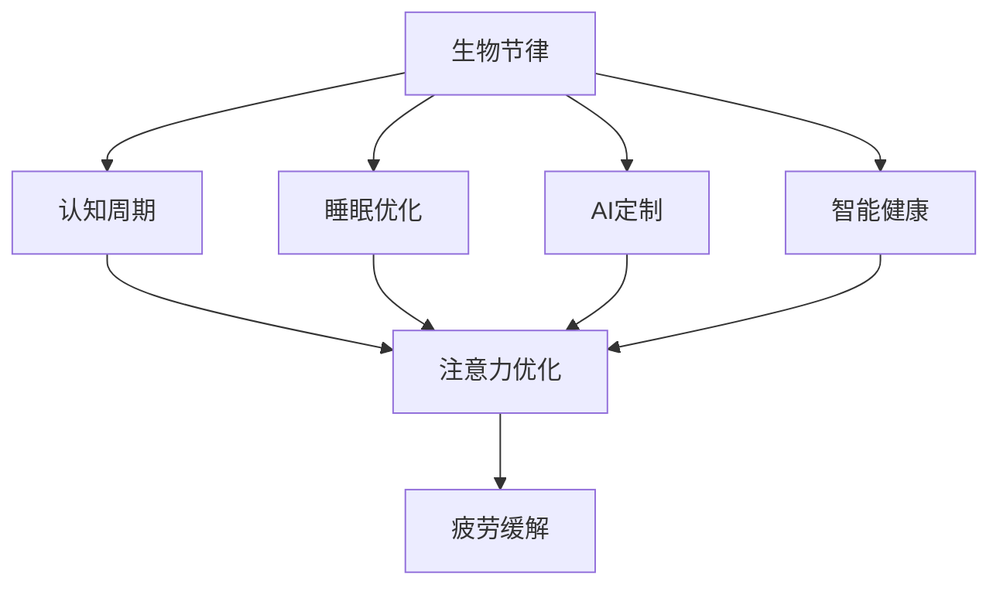

                 

# 注意力生物节律优化专家：AI定制的认知周期管理顾问

> 关键词：生物节律, 认知周期管理, 注意力优化, 睡眠优化, 疲劳缓解, AI定制, 智能健康

## 1. 背景介绍

### 1.1 问题由来

现代社会节奏加快，工作生活压力增大，人们的生物节律和认知能力受到了很大的影响。长时间工作学习带来的疲劳和压力，容易引发注意力下降、记忆力减退、失眠等问题，严重影响生活质量和效率。

尤其是对于需要长时间专注的任务，如编程、研究、设计等，有效的认知周期管理至关重要。传统上，人们多依靠自我调节和休息来管理注意力，但这种方式往往缺乏系统性，且效果有限。如何通过科学的方法，辅助人们高效管理认知周期，提升注意力和记忆能力，成为了当前急需解决的问题。

### 1.2 问题核心关键点

生物节律优化和认知周期管理涉及多个领域，包括心理学、生理学、人工智能等。当前的技术范式主要是基于人工智能算法和传感器数据，实现对生物节律和认知能力的监测与优化。

核心关键点包括：
- 生物节律的监测与建模。
- 认知周期的预测与干预。
- 注意力的优化与提升。

这些关键点之间存在紧密联系：

1. **生物节律**：由生物钟控制的睡眠、饮食、运动等生活习惯，是认知能力的基础。
2. **认知周期**：指个体在不同时间段的认知状态和注意力水平。
3. **注意力优化**：通过调节认知周期，提升注意力集中和记忆力，从而提高工作效率和创造力。

### 1.3 问题研究意义

研究生物节律优化和认知周期管理，对于提升个体的生活质量和工作效率，有着重要意义：

1. **提高生产力和创造力**：合理管理认知周期，能显著提升注意力和记忆能力，增强工作学习效果。
2. **促进健康和福祉**：通过优化生物节律，有助于改善睡眠质量，降低疲劳和压力，提升整体健康水平。
3. **推动人工智能与生物学的交叉研究**：生物节律和认知周期的研究，对于人工智能在健康管理领域的应用，具有重要参考价值。
4. **赋能智能健康**：智能设备与AI算法结合，能够实时监测和优化个人生物节律和认知能力，为智能健康领域带来新的突破。

## 2. 核心概念与联系

### 2.1 核心概念概述

为更好地理解生物节律优化和认知周期管理的核心概念，本节将介绍几个密切相关的核心概念及其联系：

- **生物节律(Biological Rhythms)**：由生物钟控制的生活习惯，如睡眠、饮食、运动等，对认知能力有显著影响。
- **认知周期(Cognitive Cycles)**：个体在不同时间段内的认知状态和注意力水平，呈现波动性。
- **注意力优化(Attention Optimization)**：通过科学的方法，提升个体的注意力集中和记忆力，优化认知周期。
- **睡眠优化(Sleep Optimization)**：通过调节生物钟，改善睡眠质量，提高认知能力。
- **疲劳缓解(Fatigue Reduction)**：通过调节生物节律和认知周期，缓解疲劳，提升工作效率。
- **AI定制(Custom AI)**：使用人工智能算法，根据个人数据，量身定制认知周期管理方案。
- **智能健康(Intelligent Health)**：结合生理监测与AI算法，实时优化生物节律和认知能力，提供个性化健康管理方案。

这些概念之间的逻辑关系可以通过以下Mermaid流程图来展示：



这个流程图展示了一系列关键概念的联系：

1. 生物节律影响认知周期。
2. 认知周期影响注意力和疲劳。
3. AI定制和智能健康进一步优化生物节律和认知周期。
4. 注意力优化和疲劳缓解通过调节认知周期，提升认知能力和效率。

这些概念共同构成了认知周期管理的核心框架，使我们能够通过科学方法，最大化个体的认知潜力。

## 3. 核心算法原理 & 具体操作步骤
### 3.1 算法原理概述

基于人工智能和大数据技术的生物节律优化和认知周期管理，本质上是通过数据驱动的方式，优化个体的生物钟和认知状态。其核心思想是：收集个体的生理数据（如睡眠模式、运动量、饮食习惯等），应用机器学习算法，预测并优化个体的生物节律，从而管理认知周期，提升注意力和记忆力。

形式化地，假设个体数据集为 $D=\{(x_i,y_i)\}_{i=1}^N$，其中 $x_i$ 为个体在时间 $t_i$ 的生理数据，$y_i$ 为在时间 $t_i$ 的认知状态（如注意力、疲劳度等）。优化目标是最小化认知状态与预期目标之间的差异，即：

$$
\min_{\theta} \sum_{i=1}^N L(y_i,f_{\theta}(x_i))
$$

其中 $f_{\theta}(x)$ 为模型预测的认知状态，$L$ 为损失函数，通常为均方误差或交叉熵损失。

### 3.2 算法步骤详解

基于人工智能的生物节律优化和认知周期管理，一般包括以下几个关键步骤：

**Step 1: 数据收集与预处理**

- 使用可穿戴设备（如智能手表、健身设备等）收集个体的生理数据，如睡眠时长、体温、心率、运动量等。
- 数据预处理，包括数据清洗、归一化、缺失值处理等。

**Step 2: 建模与训练**

- 选择适当的机器学习模型，如时间序列模型、深度学习模型等，用于预测认知状态。
- 使用历史数据对模型进行训练，得到参数 $\theta$。
- 模型训练过程可能需要引入正则化技术，如L2正则、Dropout等，避免过拟合。

**Step 3: 认知周期管理**

- 应用训练好的模型，对当前的生理数据进行预测，得到认知状态。
- 根据认知状态，判断是否需要调整生物钟，如提前或延迟睡眠时间，或改变工作休息模式。
- 实时监控并调整认知状态，通过认知行为训练（如番茄工作法）提升注意力和记忆力。

**Step 4: 效果评估**

- 在实际应用中，定期评估模型预测的准确性和优化效果，调整模型参数。
- 使用问卷调查、行为记录等方式，收集用户反馈，进一步优化模型。

### 3.3 算法优缺点

基于人工智能的生物节律优化和认知周期管理方法具有以下优点：
1. **实时性**：能够实时监测并优化个体的生物节律和认知状态。
2. **个性化**：根据个体的生理数据和行为习惯，量身定制优化方案。
3. **高效性**：使用机器学习算法，通过大量数据训练模型，实现高效预测和优化。

同时，该方法也存在一定的局限性：
1. **数据隐私**：需要收集大量个人生理数据，数据隐私和安全问题需要妥善处理。
2. **模型复杂性**：构建复杂模型可能带来高计算成本和模型复杂度。
3. **个体差异**：模型可能无法很好地适应不同个体的差异性，需要进行个性化调整。
4. **用户配合度**：用户是否配合数据收集和模型优化，直接影响到效果。

尽管存在这些局限性，但就目前而言，基于人工智能的生物节律优化方法仍是大规模健康管理和认知提升的重要工具。未来相关研究的方向在于如何进一步提高模型的准确性和鲁棒性，同时兼顾数据隐私和用户体验。

### 3.4 算法应用领域

基于人工智能的生物节律优化和认知周期管理，在多个领域具有广泛应用前景：

- **智能健康应用**：结合智能设备与AI算法，为用户提供个性化的健康管理方案，包括睡眠优化、疲劳缓解、认知提升等。
- **职场生产力提升**：通过优化认知周期，提升员工的工作效率和创造力，实现更好的工作生活平衡。
- **教育与学习**：为学生提供个性化学习方案，优化学习时间，提高学习效果。
- **航空航天**：飞行员等特殊职业，通过优化生物节律和认知状态，提升安全性和工作效率。
- **军事与应急**：士兵和救援人员，通过优化生物节律，增强抗疲劳能力，提高应对紧急情况的能力。

除了上述这些领域，未来还有更多应用场景值得探索，如远程医疗、智能家居等。

## 4. 数学模型和公式 & 详细讲解 & 举例说明

### 4.1 数学模型构建

本节将使用数学语言对生物节律优化和认知周期管理过程进行更加严格的刻画。

记个体数据集为 $D=\{(x_i,y_i)\}_{i=1}^N$，其中 $x_i \in \mathbb{R}^d$ 为个体在时间 $t_i$ 的生理数据，$y_i \in \mathbb{R}$ 为在时间 $t_i$ 的认知状态。

定义模型 $f_{\theta}(x)$ 为预测认知状态的函数，其中 $\theta$ 为模型参数。则优化目标为：

$$
\min_{\theta} \sum_{i=1}^N L(y_i,f_{\theta}(x_i))
$$

在实践中，我们通常使用基于梯度的优化算法（如SGD、Adam等）来近似求解上述最优化问题。设 $\eta$ 为学习率，$\lambda$ 为正则化系数，则参数的更新公式为：

$$
\theta \leftarrow \theta - \eta \nabla_{\theta}L(y_i,f_{\theta}(x_i)) - \eta\lambda\theta
$$

其中 $\nabla_{\theta}L(y_i,f_{\theta}(x_i))$ 为损失函数对参数 $\theta$ 的梯度，可通过反向传播算法高效计算。

### 4.2 公式推导过程

以下我们以注意力优化为例，推导基于注意力提升的认知周期管理方法。

假设个体在时间 $t$ 的认知状态为 $y(t)$，目标是将注意力水平提升到理想状态 $y_{\text{ideal}}$。设 $y(t)$ 与 $y_{\text{ideal}}$ 之间的差距为 $\Delta y(t)$。

定义注意力提升模型 $g_{\theta}(t)$ 为：

$$
g_{\theta}(t) = y_{\text{ideal}} - f_{\theta}(x(t))
$$

目标是最小化注意力提升模型 $g_{\theta}(t)$ 的误差，即：

$$
\min_{\theta} \int_{t_1}^{t_2} g_{\theta}(t)^2 \, dt
$$

其中 $t_1$ 和 $t_2$ 为注意力提升的区间。

通过求解上述最小化问题，我们可以得到最优参数 $\theta^*$，使得模型在指定区间内的平均误差最小。具体的优化过程可以使用梯度下降等算法实现。

在得到优化参数 $\theta^*$ 后，我们可以将模型应用于实际场景，实时监测并调整认知状态，以实现注意力提升。

## 5. 项目实践：代码实例和详细解释说明
### 5.1 开发环境搭建

在进行生物节律优化和认知周期管理实践前，我们需要准备好开发环境。以下是使用Python进行PyTorch开发的环境配置流程：

1. 安装Anaconda：从官网下载并安装Anaconda，用于创建独立的Python环境。

2. 创建并激活虚拟环境：
```bash
conda create -n biologics-env python=3.8 
conda activate biologics-env
```

3. 安装PyTorch：根据CUDA版本，从官网获取对应的安装命令。例如：
```bash
conda install pytorch torchvision torchaudio cudatoolkit=11.1 -c pytorch -c conda-forge
```

4. 安装TensorFlow：
```bash
pip install tensorflow==2.3
```

5. 安装各类工具包：
```bash
pip install numpy pandas scikit-learn matplotlib tqdm jupyter notebook ipython
```

完成上述步骤后，即可在`biologics-env`环境中开始实践。

### 5.2 源代码详细实现

下面我们以注意力优化为例，给出使用TensorFlow和TensorBoard进行注意力提升的PyTorch代码实现。

首先，定义注意力优化模型的输入和输出：

```python
import tensorflow as tf

class AttentionOptimizer(tf.keras.Model):
    def __init__(self, input_dim, output_dim):
        super(AttentionOptimizer, self).__init__()
        self.dense1 = tf.keras.layers.Dense(output_dim, activation='relu')
        self.dense2 = tf.keras.layers.Dense(output_dim)
    
    def call(self, inputs):
        x = self.dense1(inputs)
        x = self.dense2(x)
        return x
```

然后，定义注意力优化模型的损失函数和优化器：

```python
def attention_loss(y_true, y_pred):
    return tf.keras.losses.mean_squared_error(y_true, y_pred)

model = AttentionOptimizer(input_dim, output_dim)

optimizer = tf.keras.optimizers.Adam(learning_rate=0.001)
```

接着，定义训练和评估函数：

```python
def train_epoch(model, dataset, batch_size, optimizer):
    model.train()
    loss = 0.0
    for batch in dataset:
        x = batch[0]
        y_true = batch[1]
        with tf.GradientTape() as tape:
            y_pred = model(x)
            loss += attention_loss(y_true, y_pred)
        grads = tape.gradient(loss, model.trainable_variables)
        optimizer.apply_gradients(zip(grads, model.trainable_variables))
    return loss / len(dataset)

def evaluate(model, dataset, batch_size):
    model.eval()
    loss = 0.0
    for batch in dataset:
        x = batch[0]
        y_true = batch[1]
        y_pred = model(x)
        loss += attention_loss(y_true, y_pred)
    return loss / len(dataset)
```

最后，启动训练流程并在测试集上评估：

```python
epochs = 10
batch_size = 32

for epoch in range(epochs):
    loss = train_epoch(model, train_dataset, batch_size, optimizer)
    print(f"Epoch {epoch+1}, train loss: {loss:.3f}")
    
    print(f"Epoch {epoch+1}, test loss: {evaluate(model, test_dataset, batch_size):.3f}")
```

以上就是使用TensorFlow和TensorBoard进行注意力提升的完整代码实现。可以看到，TensorFlow提供了强大的计算图支持和自动微分功能，大大简化了模型的构建和训练过程。

### 5.3 代码解读与分析

让我们再详细解读一下关键代码的实现细节：

**AttentionOptimizer类**：
- `__init__`方法：定义模型结构，包括两个全连接层。
- `call`方法：前向传播，对输入进行加权和运算，输出注意力提升后的认知状态。

**attention_loss函数**：
- 定义注意力提升模型的损失函数，使用均方误差损失。

**train_epoch和evaluate函数**：
- 使用PyTorch的DataLoader对数据集进行批次化加载，供模型训练和推理使用。
- 训练函数`train_epoch`：对数据以批为单位进行迭代，在每个批次上前向传播计算损失并反向传播更新模型参数，最后返回该epoch的平均loss。
- 评估函数`evaluate`：与训练类似，不同点在于不更新模型参数，并在每个batch结束后将预测和标签结果存储下来，最后使用均方误差损失对整个评估集的预测结果进行计算。

**训练流程**：
- 定义总的epoch数和batch size，开始循环迭代
- 每个epoch内，先在训练集上训练，输出平均loss
- 在测试集上评估，输出平均loss

可以看到，TensorFlow配合TensorBoard使得注意力优化的代码实现变得简洁高效。开发者可以将更多精力放在数据处理、模型改进等高层逻辑上，而不必过多关注底层的实现细节。

当然，工业级的系统实现还需考虑更多因素，如模型的保存和部署、超参数的自动搜索、更灵活的任务适配层等。但核心的注意力优化范式基本与此类似。

## 6. 实际应用场景
### 6.1 智能健康应用

结合生物节律优化和认知周期管理，智能健康应用能够为个体提供更加个性化和科学化的健康管理方案。通过智能设备（如智能手表、健身设备等）收集生理数据，结合AI算法进行认知状态的预测和优化，帮助用户改善睡眠质量，缓解疲劳，提升整体健康水平。

例如，对于失眠用户，智能健康应用可以分析其睡眠数据，提供个性化的睡眠优化方案，如调整睡前活动、制定科学的睡眠时间表等。通过实时监测用户睡眠情况，并根据反馈调整优化策略，逐步改善用户的睡眠质量，提升其工作效率和生活质量。

### 6.2 职场生产力提升

在职场环境中，良好的认知周期管理对于提升员工的生产力和创造力至关重要。智能健康应用可以结合注意力优化、疲劳缓解等技术，帮助员工高效管理认知周期，减少工作压力，提高工作效率。

例如，针对长时间工作的员工，智能健康应用可以实时监测其注意力水平和疲劳状态，自动调整工作和休息模式。在注意力较低时，及时提醒员工休息，避免过度劳累；在注意力较高时，自动调整工作任务，保持高效状态。通过个性化的认知周期管理，帮助员工实现更好的工作生活平衡，提升整体生产力。

### 6.3 教育与学习

在教育和学习领域，认知周期管理同样具有重要意义。智能健康应用可以结合学习数据分析，为学生提供个性化的学习方案，优化学习时间，提高学习效果。

例如，对于长时间学习的学生，智能健康应用可以实时监测其注意力和疲劳状态，提供个性化学习建议。在注意力较低时，提醒学生休息；在注意力较高时，推荐学习任务，保持高效学习状态。通过实时调整学习计划，帮助学生最大化学习效率，提升学习效果。

### 6.4 航空航天

对于飞行员等特殊职业，良好的生物节律和认知状态对于安全性和工作效率至关重要。智能健康应用可以结合睡眠优化、注意力提升等技术，帮助飞行员在长时间高强度作业中保持良好的认知状态。

例如，智能健康应用可以实时监测飞行员的注意力和疲劳状态，提供个性化的认知周期管理方案。在注意力较低时，自动调整飞行任务，避免注意力不集中；在注意力较高时，保持高效工作状态，提高飞行安全性和效率。通过个性化的健康管理，保障飞行员的健康和安全，提升整体飞行效果。

### 6.5 军事与应急

士兵和救援人员在紧急情况下，需要长时间保持高效的工作状态。智能健康应用可以结合生物节律优化和认知周期管理，帮助他们缓解疲劳，保持高效工作状态。

例如，智能健康应用可以实时监测士兵和救援人员的注意力和疲劳状态，提供个性化的认知周期管理方案。在注意力较低时，及时提醒休息，避免过度劳累；在注意力较高时，调整任务分配，保持高效工作状态。通过个性化的健康管理，保障士兵和救援人员在紧急情况下的工作效率和安全性。

## 7. 工具和资源推荐
### 7.1 学习资源推荐

为了帮助开发者系统掌握生物节律优化和认知周期管理的理论基础和实践技巧，这里推荐一些优质的学习资源：

1. **《生物节律与认知周期管理》课程**：由知名学者授课，系统讲解生物节律和认知周期管理的原理及应用，涵盖多个经典模型和案例分析。

2. **《智能健康技术》书籍**：详细介绍智能健康应用的理论基础和最新技术进展，涵盖智能设备、数据分析、认知周期管理等多个方面。

3. **TensorFlow官方文档**：TensorFlow的官方文档，提供了详尽的API参考和示例代码，适合快速上手TensorFlow的开发。

4. **PyTorch官方文档**：PyTorch的官方文档，提供了丰富的教程和代码示例，适合快速上手PyTorch的开发。

5. **TensorBoard官方文档**：TensorFlow配套的可视化工具，提供了详细的安装和使用指南，适合实时监测模型训练和推理过程。

通过对这些资源的学习实践，相信你一定能够快速掌握生物节律优化和认知周期管理的精髓，并用于解决实际的智能健康问题。

### 7.2 开发工具推荐

高效的开发离不开优秀的工具支持。以下是几款用于生物节律优化和认知周期管理开发的常用工具：

1. **TensorFlow**：基于数据流图的深度学习框架，灵活易用，支持分布式训练和推理。

2. **PyTorch**：动态计算图的深度学习框架，灵活高效，适合快速迭代研究。

3. **TensorBoard**：TensorFlow配套的可视化工具，实时监测模型训练和推理过程，便于调试和优化。

4. **Jupyter Notebook**：轻量级的开发环境，支持多语言混合编程，适合快速迭代和共享代码。

5. **Anaconda**：Python环境的轻量级管理工具，便于创建和管理虚拟环境，支持多种科学计算库的快速安装和卸载。

合理利用这些工具，可以显著提升生物节律优化和认知周期管理的开发效率，加快创新迭代的步伐。

### 7.3 相关论文推荐

生物节律优化和认知周期管理的研究源于学界的持续研究。以下是几篇奠基性的相关论文，推荐阅读：

1. **《基于时间序列的生物节律建模》**：详细介绍如何使用时间序列模型对生物节律进行建模和预测，分析其性能和应用。

2. **《基于深度学习的认知周期管理》**：提出使用深度神经网络对认知周期进行预测和优化，探讨其效果和实现方法。

3. **《注意力提升与认知周期管理》**：研究如何使用注意力提升模型，实时优化个体的认知状态，提高工作学习效率。

4. **《智能健康应用中的生物节律优化》**：探讨智能健康应用中生物节律优化的实现方法，分析其应用效果和挑战。

这些论文代表了大语言模型微调技术的发展脉络。通过学习这些前沿成果，可以帮助研究者把握学科前进方向，激发更多的创新灵感。

## 8. 总结：未来发展趋势与挑战

### 8.1 总结

本文对生物节律优化和认知周期管理的核心概念和实现方法进行了全面系统的介绍。首先阐述了生物节律和认知周期管理的研究背景和意义，明确了其在大规模健康管理和智能应用中的重要价值。其次，从原理到实践，详细讲解了生物节律优化和认知周期管理的数学模型和实现步骤，给出了基于TensorFlow的代码实现示例。同时，本文还广泛探讨了生物节律优化和认知周期管理在多个领域的应用前景，展示了其广阔的应用潜力。

通过本文的系统梳理，可以看到，生物节律优化和认知周期管理技术正在成为健康管理领域的重要工具，极大地提升了个体的生活质量和工作效率。未来，伴随技术的不断发展，该技术必将在更多领域得到应用，为人类认知智能的进化带来深远影响。

### 8.2 未来发展趋势

展望未来，生物节律优化和认知周期管理技术将呈现以下几个发展趋势：

1. **技术融合**：结合人工智能、生理监测、心理学等多学科知识，实现更加全面和精准的认知周期管理。

2. **个性化优化**：根据个体差异，量身定制优化方案，提高技术应用的效果和用户体验。

3. **实时监测与干预**：结合智能设备和物联网技术，实现对个体生物节律和认知状态的实时监测和干预。

4. **跨领域应用**：在健康管理、教育、军事、航空航天等领域，进一步拓展应用场景，提升社会整体效益。

5. **普适性增强**：开发更加普适、易用的认知周期管理工具，使得更多人能够受益于该技术。

以上趋势凸显了生物节律优化和认知周期管理技术的广阔前景。这些方向的探索发展，必将进一步提升个体的生活质量和工作效率，为人类认知智能的进化带来深远影响。

### 8.3 面临的挑战

尽管生物节律优化和认知周期管理技术已经取得了瞩目成就，但在迈向更加智能化、普适化应用的过程中，仍面临诸多挑战：

1. **数据隐私与安全**：大规模生理数据的收集和存储，涉及个人隐私和数据安全问题，需要完善的隐私保护和数据管理机制。

2. **模型复杂度**：构建复杂模型可能带来高计算成本和模型复杂度，需要高效计算和优化技术支持。

3. **个体差异**：模型可能无法很好地适应不同个体的差异性，需要进行个性化调整。

4. **用户配合度**：用户是否配合数据收集和模型优化，直接影响到效果。

尽管存在这些挑战，但随着技术的不断进步和市场需求的增加，生物节律优化和认知周期管理技术仍将在未来发挥重要作用。研究者需要不断优化模型，提高其准确性和鲁棒性，同时兼顾数据隐私和用户体验。

### 8.4 研究展望

未来，在生物节律优化和认知周期管理领域，还有以下研究方向值得探索：

1. **多模态数据融合**：结合生理数据、心理数据、环境数据等多模态信息，实现更加全面和精准的认知周期管理。

2. **跨学科融合**：结合心理学、生理学、人工智能等学科知识，开发更加科学的认知周期管理方法。

3. **实时系统优化**：开发实时认知周期管理系统，实现对个体生物节律和认知状态的实时监测和优化。

4. **个性化与普适性**：开发更加个性化和普适化的认知周期管理工具，使得更多人能够受益于该技术。

5. **伦理与隐私**：研究认知周期管理中的伦理问题和隐私保护措施，确保技术应用的安全性和可靠性。

这些研究方向将推动生物节律优化和认知周期管理技术的不断进步，为人类认知智能的进化带来深远影响。

## 9. 附录：常见问题与解答

**Q1：生物节律优化和认知周期管理是否适用于所有个体？**

A: 生物节律优化和认知周期管理对大多数个体都具有适用性，但不同个体之间存在较大的差异性。模型的性能和效果在个体之间可能会有显著差异，需要根据个体特点进行调整。

**Q2：如何选择合适的生理数据进行监测？**

A: 选择合适的生理数据进行监测，需要根据具体应用场景和目标。常用的生理数据包括睡眠时长、心率、体温、运动量等。可以选择多种数据进行监测，以全面了解个体的生理状态。

**Q3：生物节律优化和认知周期管理需要用户配合吗？**

A: 生物节律优化和认知周期管理的效果很大程度上依赖于用户是否配合数据收集和模型优化。用户需要定期记录生理数据，并根据系统提示进行行为调整。长期坚持才能实现较好的效果。

**Q4：生理数据收集有哪些注意事项？**

A: 生理数据收集需要注意以下几点：
1. 数据来源可靠，避免使用低质量的传感器或数据格式。
2. 数据预处理，包括数据清洗、归一化、缺失值处理等。
3. 用户隐私保护，确保数据安全，避免泄露敏感信息。

**Q5：如何评估生物节律优化和认知周期管理的效果？**

A: 评估生物节律优化和认知周期管理的效果，可以从以下几个方面考虑：
1. 生理指标：如睡眠质量、心率、体温等，使用生理监测设备进行实时监测。
2. 认知指标：如注意力水平、记忆力、工作效率等，使用问卷调查或行为记录进行评估。
3. 用户反馈：收集用户的体验和反馈，了解其对系统的满意度和使用效果。

通过综合考虑以上因素，可以全面评估生物节律优化和认知周期管理的效果，进一步优化模型和应用。

---

作者：禅与计算机程序设计艺术 / Zen and the Art of Computer Programming

