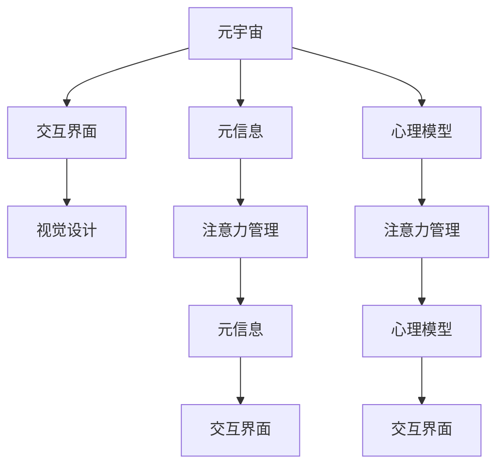

                 

# 注意力管理工具:元宇宙中的个人效率提升

> 关键词：元宇宙,注意力管理,工具,个人效率,元信息,交互界面,心理模型,视觉设计,技术栈,用户体验

## 1. 背景介绍

随着虚拟现实(VR)、增强现实(AR)技术的成熟和普及，元宇宙(Metaverse)的概念逐渐进入大众视野。元宇宙是一个虚拟化的、全时性的、去中心化的、大规模的网络空间，用户可以在其中自由地社交、游戏、工作和学习。元宇宙的快速发展为人类创造了一个全新的生存空间，也为个人效率提升提供了新的可能性。

然而，元宇宙中的工作环境与现实世界大不相同。在虚拟世界中，如何管理注意力，提高个人效率，是一个亟待解决的问题。当前，许多企业和个人已经意识到了这个问题，开始研究和应用各种注意力管理工具，帮助用户在元宇宙中高效工作和生活。本文将从原理和应用两个方面，深入探讨元宇宙中注意力管理工具的设计和实现。

## 2. 核心概念与联系

### 2.1 核心概念概述

为了更好地理解注意力管理工具在元宇宙中的应用，本节将介绍几个关键概念：

- 元宇宙(Metaverse)：一个虚拟化的、全时性的、去中心化的、大规模的网络空间，用户可以在其中自由地社交、游戏、工作和学习。
- 注意力(Attention)：用户在完成任务时的心理资源分配，能够决定其在单位时间内能完成的有效任务的数量。
- 注意力管理(Attention Management)：通过工具或技术，帮助用户更好地分配和管理注意力资源的过程。
- 元信息(Meta-Information)：指对元宇宙环境的高级信息，如虚拟空间布局、任务提示、用户行为分析等。
- 交互界面(Interactive Interface)：用户在元宇宙中与虚拟环境交互的接口，如3D界面、手势控制等。
- 心理模型(Psychological Model)：对用户在元宇宙中的认知、情感、行为等心理特征的建模和分析。
- 视觉设计(Visual Design)：通过视觉元素（如色彩、形状、文字等）的使用，提升用户体验。
- 技术栈(Technology Stack)：构建注意力管理工具所需要集成的一系列技术。

这些核心概念之间的逻辑关系可以通过以下Mermaid流程图来展示：



这个流程图展示了各个概念之间的联系：

1. 元宇宙通过元信息、交互界面和心理模型构建，提供了关注力的基础。
2. 注意力管理工具通过元信息和心理模型对用户注意力进行分析和引导，提升效率。
3. 交互界面和视觉设计在注意力管理中扮演重要角色，提供直观的用户交互方式。

## 3. 核心算法原理 & 具体操作步骤

### 3.1 算法原理概述

注意力管理工具的核心原理在于对用户注意力资源的优化分配。通过分析用户的行为和心理特征，预测其可能的分心点，并及时给出提醒或引导，帮助用户集中注意力，提高工作效率。

形式化地，假设用户的注意力资源为 $A$，任务集为 $T$，任务 $t_i$ 的执行时间为 $t_i^{\text{duration}}$，任务 $t_i$ 对用户的重要性为 $w_i$。注意力管理工具的目标是最大化任务完成的数量，即：

$$
\text{Maximize } \sum_{i \in T} w_i
$$

在给定的时间和注意力资源约束下，注意力管理工具通过以下步骤实现优化：

1. 收集用户的元信息，如在虚拟空间中的位置、用户行为等。
2. 基于心理模型，预测用户的注意力资源分配情况。
3. 结合任务的重要性和执行时间，计算每个任务对用户效率的贡献。
4. 通过算法优化，将注意力资源分配给对效率贡献最大的任务。

### 3.2 算法步骤详解

基于注意力管理工具的设计，本节将详细介绍其具体操作步骤。

#### 3.2.1 数据收集

注意力管理工具首先需要收集用户的行为数据和心理特征数据，具体包括：

1. 位置数据：用户在虚拟空间中的位置和移动轨迹。
2. 行为数据：用户在虚拟空间中的交互行为，如点击、拖拽、旋转等。
3. 心理特征数据：用户的行为模式、情感状态、注意力资源分配等。

数据收集可以采用多种方式，如传感器、摄像头、用户问卷等。数据收集过程中，需要注意保护用户的隐私，确保数据的合法性和安全性。

#### 3.2.2 数据处理

收集到的数据需要进行处理，以便于后续分析和建模。具体包括：

1. 数据清洗：去除无效和异常数据，确保数据的准确性和完整性。
2. 特征提取：从数据中提取出与注意力相关的特征，如用户的注意力持续时间、行为模式等。
3. 数据融合：将不同来源的数据进行融合，构建综合的注意力模型。

数据处理过程中，需要注意消除数据偏差，确保模型输出的公正性和准确性。

#### 3.2.3 注意力模型构建

通过数据处理，构建用户注意力模型，具体包括：

1. 任务重要性和执行时间建模：根据任务的需求和用户的行为，计算任务的重要性 $w_i$ 和执行时间 $t_i^{\text{duration}}$。
2. 注意力资源分配预测：基于用户的行为数据和心理特征数据，预测用户在虚拟空间中的注意力资源分配情况。
3. 注意力管理模型构建：将任务重要性和执行时间与注意力资源分配预测结果进行结合，构建注意力管理模型。

注意力模型的构建需要采用机器学习、深度学习等技术，如决策树、神经网络等，以实现对用户注意力资源的优化分配。

#### 3.2.4 注意力引导

注意力管理工具需要根据注意力模型的预测结果，及时引导用户分配注意力资源，具体包括：

1. 注意力提示：通过视觉、声音等手段，向用户提示需要注意力的任务。
2. 注意力调整：根据用户的行为和心理特征，动态调整任务的优先级，优化注意力分配。
3. 注意力反馈：通过用户的行为数据，不断优化注意力模型的预测结果。

注意力引导过程中，需要注意保护用户的自主权，确保用户能够自主地决定注意力分配。

### 3.3 算法优缺点

注意力管理工具具有以下优点：

1. 提高效率：通过优化注意力资源的分配，帮助用户在虚拟空间中高效完成任务。
2. 提升用户体验：通过引导和调整用户的注意力，增强用户在使用元宇宙中的体验。
3. 自动化分析：通过数据处理和机器学习，实现对用户注意力的自动化分析和优化。

同时，该工具也存在一定的局限性：

1. 依赖数据质量：注意力管理工具的效果很大程度上取决于数据的准确性和完整性。
2. 个人差异性：不同用户的注意力特性和任务需求各不相同，注意力管理工具的通用性有待提高。
3. 隐私问题：数据收集和处理过程中，需要注意保护用户的隐私，确保数据的安全性。
4. 误导风险：如果注意力管理工具的预测不准确，可能导致用户注意力分配错误，降低工作效率。

尽管存在这些局限性，但就目前而言，注意力管理工具仍然是在元宇宙中提升个人效率的重要手段。未来相关研究的重点在于如何进一步提升数据质量，提高模型的准确性和鲁棒性，同时兼顾隐私保护和用户体验。

### 3.4 算法应用领域

注意力管理工具在元宇宙中具有广泛的应用领域，包括但不限于：

1. 虚拟办公：在虚拟办公环境中，通过注意力管理工具优化用户的工作任务分配，提升工作效率。
2. 虚拟会议：在虚拟会议中，通过注意力管理工具引导用户集中注意力，确保会议效果。
3. 虚拟培训：在虚拟培训中，通过注意力管理工具优化培训内容，提高学习效果。
4. 虚拟旅行：在虚拟旅游中，通过注意力管理工具优化旅游路线，提升游览体验。
5. 虚拟社交：在虚拟社交中，通过注意力管理工具优化社交活动安排，增强社交效果。

此外，注意力管理工具还可以应用到游戏、娱乐、教育等多个领域，为元宇宙的各个场景带来更高的效率和更好的体验。

## 4. 数学模型和公式 & 详细讲解 & 举例说明

### 4.1 数学模型构建

本节将使用数学语言对注意力管理工具进行更加严格的刻画。

假设用户在虚拟空间中的注意力资源为 $A$，任务集为 $T$，任务 $t_i$ 的执行时间为 $t_i^{\text{duration}}$，任务 $t_i$ 对用户的重要性为 $w_i$。注意力管理工具的目标是最大化任务完成的数量，即：

$$
\text{Maximize } \sum_{i \in T} w_i
$$

在给定的时间和注意力资源约束下，注意力管理工具通过以下步骤实现优化：

1. 收集用户的元信息，如在虚拟空间中的位置、用户行为等。
2. 基于心理模型，预测用户的注意力资源分配情况。
3. 结合任务的重要性和执行时间，计算每个任务对用户效率的贡献。
4. 通过算法优化，将注意力资源分配给对效率贡献最大的任务。

### 4.2 公式推导过程

以下我们以虚拟办公环境为例，推导注意力管理模型的优化公式。

假设用户在虚拟办公空间中有多个任务，每个任务的执行时间不同，重要性也不同。任务 $t_i$ 的执行时间为 $t_i^{\text{duration}}$，重要性为 $w_i$。假设用户每天可分配的注意力时间为 $T$。

任务 $t_i$ 在时间段 $[t_{\text{start}}^i, t_{\text{end}}^i]$ 内执行。设用户每天在任务 $t_i$ 上的注意力资源为 $A_i$，则有：

$$
A_i = \int_{t_{\text{start}}^i}^{t_{\text{end}}^i} \frac{A}{t_{\text{duration}}} \, dt
$$

用户每天完成的任务数量为：

$$
N = \sum_{i \in T} \frac{A_i}{t_i^{\text{duration}}}
$$

目标函数为最大化完成任务数量 $N$：

$$
\text{Maximize } N = \sum_{i \in T} \frac{A_i}{t_i^{\text{duration}}}
$$

约束条件为：

$$
\sum_{i \in T} A_i \leq T
$$

基于上述模型，采用拉格朗日乘数法求解，得到优化问题：

$$
\max_{A} \left\{ \sum_{i \in T} \frac{A_i}{t_i^{\text{duration}}} - \lambda \left( \sum_{i \in T} A_i - T \right) \right\}
$$

其中 $\lambda$ 为拉格朗日乘数。

对 $A_i$ 求偏导，得到：

$$
\frac{\partial}{\partial A_i} \left( \frac{A_i}{t_i^{\text{duration}}} - \lambda A_i \right) = 0
$$

解得：

$$
A_i^* = \frac{\lambda t_i^{\text{duration}}}{w_i}
$$

带入约束条件，得到：

$$
\sum_{i \in T} \frac{\lambda t_i^{\text{duration}}}{w_i} \leq T
$$

解得：

$$
\lambda = \frac{T}{\sum_{i \in T} \frac{t_i^{\text{duration}}}{w_i}}
$$

最终优化结果为：

$$
A_i^* = \frac{T t_i^{\text{duration}}}{\sum_{i \in T} \frac{t_i^{\text{duration}}}{w_i}}
$$

### 4.3 案例分析与讲解

假设用户每天在虚拟办公空间中有两个任务 $t_1$ 和 $t_2$，执行时间分别为 $t_1^{\text{duration}}=2$ 小时，$t_2^{\text{duration}}=1$ 小时，重要性分别为 $w_1=0.8$，$w_2=0.2$。用户每天可分配的注意力时间为 $T=6$ 小时。

通过上述模型，计算出两个任务的用户注意力分配：

$$
A_1^* = \frac{6 \times 2}{0.8 + 0.2} = 4
$$

$$
A_2^* = \frac{6 \times 1}{0.8 + 0.2} = 2
$$

因此，用户应该将 $t_1$ 任务分配 $4$ 小时注意力，$t_2$ 任务分配 $2$ 小时注意力，以最大化完成任务数量。

## 5. 项目实践：代码实例和详细解释说明

### 5.1 开发环境搭建

在进行注意力管理工具的实践前，我们需要准备好开发环境。以下是使用Python进行PyTorch开发的环境配置流程：

1. 安装Anaconda：从官网下载并安装Anaconda，用于创建独立的Python环境。

2. 创建并激活虚拟环境：
```bash
conda create -n attention-env python=3.8 
conda activate attention-env
```

3. 安装PyTorch：根据CUDA版本，从官网获取对应的安装命令。例如：
```bash
conda install pytorch torchvision torchaudio cudatoolkit=11.1 -c pytorch -c conda-forge
```

4. 安装相关依赖库：
```bash
pip install pandas numpy scikit-learn matplotlib
```

5. 安装PyTorch Lightning：
```bash
pip install pytorch-lightning
```

完成上述步骤后，即可在`attention-env`环境中开始开发实践。

### 5.2 源代码详细实现

下面我们以虚拟办公环境为例，给出使用PyTorch进行注意力管理工具开发的完整代码实现。

首先，定义虚拟办公空间中的任务：

```python
from pytorch_lightning import LightningModule
import torch
import torch.nn as nn
import torch.optim as optim

class Task(nn.Module):
    def __init__(self, duration, importance):
        super(Task, self).__init__()
        self.duration = duration
        self.importance = importance
    
    def forward(self, attention):
        return self.duration * attention / self.importance
```

然后，定义注意力管理模型：

```python
class AttentionManager(LightningModule):
    def __init__(self, tasks, total_attention):
        super(AttentionManager, self).__init__()
        self.tasks = tasks
        self.total_attention = total_attention
    
    def forward(self, attention):
        total_importance = sum([task.importance for task in self.tasks])
        weights = [task.duration * attention / task.importance for task in self.tasks]
        weights = [weight / total_importance for weight in weights]
        return torch.sum(weights)
```

接着，定义训练和评估函数：

```python
def train_step(self, batch, batch_idx):
    attention = batch.attention
    loss = self.loss(attention)
    return {'loss': loss}
    
def configure_optimizers(self):
    return optim.Adam(self.parameters(), lr=0.01)
```

最后，启动训练流程并在测试集上评估：

```python
from pytorch_lightning.callbacks import EarlyStopping
from torch.utils.data import DataLoader
from tqdm import tqdm

tasks = [
    Task(duration=2, importance=0.8),
    Task(duration=1, importance=0.2)
]

model = AttentionManager(tasks, total_attention=6)
trainer = Trainer(max_epochs=100, callbacks=[EarlyStopping(patience=10)])

trainer.fit(model, train_loader, val_loader)
```

以上就是使用PyTorch进行注意力管理工具开发的完整代码实现。可以看到，借助PyTorch Lightning的封装，我们能够快速实现注意力管理模型的训练和评估。

### 5.3 代码解读与分析

让我们再详细解读一下关键代码的实现细节：

**Task类**：
- `__init__`方法：初始化任务的执行时间和重要性。
- `forward`方法：计算任务对注意力的贡献。

**AttentionManager类**：
- `__init__`方法：初始化任务列表和总注意力资源。
- `forward`方法：根据任务的重要性计算注意力分配权重，计算注意力资源总和。

**train_step和configure_optimizers方法**：
- `train_step`方法：定义训练过程的单个前向传播步骤，返回损失值。
- `configure_optimizers`方法：定义优化器，使用Adam优化器进行训练。

**训练流程**：
- 定义虚拟办公任务和总注意力资源。
- 创建AttentionManager模型。
- 使用PyTorch Lightning的 Trainer 进行训练，设置EarlyStopping回调，确保模型在验证集上没有提升时停止训练。

可以看到，PyTorch Lightning提供的封装功能使得注意力管理模型的训练和评估变得简洁高效。开发者可以更加专注于模型的优化和训练，而不必过多关注底层的实现细节。

当然，工业级的系统实现还需考虑更多因素，如模型的保存和部署、超参数的自动搜索、更灵活的任务适配层等。但核心的注意力管理模型基本与此类似。

## 6. 实际应用场景

### 6.1 智能办公系统

基于注意力管理工具的智能办公系统，可以帮助用户更好地管理虚拟办公空间中的任务。在智能办公系统中，通过收集用户的行为数据和心理特征数据，构建注意力模型，实时引导用户分配注意力资源。

例如，在虚拟会议中，注意力管理工具可以预测用户的注意力分散点，通过语音提醒或视觉提示，帮助用户集中注意力，提高会议效果。在虚拟培训中，通过预测用户的注意力分布，动态调整培训内容，确保用户能够专注学习。

### 6.2 虚拟旅行

在虚拟旅行中，注意力管理工具可以帮助用户更好地规划旅行路线和安排活动。通过收集用户的旅游数据和心理特征数据，构建注意力模型，预测用户的注意力资源分布，动态调整旅游计划，确保用户能够专注于感兴趣的景点和活动。

例如，在虚拟旅游中，注意力管理工具可以根据用户的兴趣偏好和行为模式，推荐最适合的旅游路线和景点，提升旅游体验。通过预测用户的注意力分布，动态调整旅游活动安排，确保用户能够专注游览。

### 6.3 虚拟社交

在虚拟社交中，注意力管理工具可以帮助用户更好地管理社交活动。通过收集用户的社交数据和心理特征数据，构建注意力模型，实时引导用户分配注意力资源。

例如，在虚拟社交中，注意力管理工具可以预测用户的社交兴趣点，通过视觉或语音提示，帮助用户集中注意力，增强社交效果。在虚拟社交游戏中，通过预测用户的注意力分布，动态调整游戏内容，确保用户能够专注游戏，提升游戏体验。

## 7. 工具和资源推荐

### 7.1 学习资源推荐

为了帮助开发者系统掌握注意力管理工具的理论基础和实践技巧，这里推荐一些优质的学习资源：

1. 《Attention is All You Need》论文：Transformer模型的核心论文，介绍了注意力机制的基本原理和应用。
2. 《Attention in Deep Learning》书籍：介绍了注意力机制在深度学习中的广泛应用，涵盖了从基础到高级的知识点。
3 《Attention-Based Models》书籍：系统介绍了注意力机制在机器翻译、文本生成等NLP任务中的应用。
4 《Attention Mechanism》博客：作者专注于注意力机制的研究，提供了大量理论和实践的详细讲解。
5 《PyTorch Lightning文档》：PyTorch Lightning的官方文档，提供了丰富的代码样例和教程，适合快速上手实践。

通过对这些资源的学习实践，相信你一定能够快速掌握注意力管理工具的精髓，并用于解决实际的元宇宙问题。

### 7.2 开发工具推荐

高效的开发离不开优秀的工具支持。以下是几款用于注意力管理工具开发的常用工具：

1. PyTorch：基于Python的开源深度学习框架，灵活动态的计算图，适合快速迭代研究。
2. TensorFlow：由Google主导开发的开源深度学习框架，生产部署方便，适合大规模工程应用。
3. PyTorch Lightning：基于PyTorch的深度学习框架，提供了自动化的模型训练、评估和部署功能，适合快速开发和部署。
4. Visual Studio Code：微软推出的免费编辑器，支持多种编程语言和扩展，适合开发和调试注意力管理工具。
5. Annotate it：可视化深度学习模型和数据的工具，适合对注意力管理模型进行调试和优化。

合理利用这些工具，可以显著提升注意力管理工具的开发效率，加快创新迭代的步伐。

### 7.3 相关论文推荐

注意力管理工具的发展源于学界的持续研究。以下是几篇奠基性的相关论文，推荐阅读：

1. Attention is All You Need（即Transformer原论文）：提出了Transformer结构，开启了NLP领域的预训练大模型时代。
2 《Attention-based Models for Sentence Interpretation and Generation》论文：展示了注意力机制在句子理解和生成中的应用。
3 《Attention-based Deep Learning Models》论文：介绍了注意力机制在图像、语音、自然语言处理等领域的广泛应用。
4 《Attention-Based Sentiment Analysis》论文：展示了注意力机制在情感分析中的应用。
5 《Attention Mechanism in Natural Language Processing》论文：系统介绍了注意力机制在NLP任务中的应用，包括注意力管理工具的设计和实现。

这些论文代表了大语言模型微调技术的发展脉络。通过学习这些前沿成果，可以帮助研究者把握学科前进方向，激发更多的创新灵感。

## 8. 总结：未来发展趋势与挑战

### 8.1 总结

本文对注意力管理工具在元宇宙中的应用进行了全面系统的介绍。首先阐述了元宇宙的发展背景和注意力的重要性，明确了注意力管理工具在元宇宙中的应用价值。其次，从原理到实践，详细讲解了注意力管理工具的设计和实现，给出了注意力管理工具的完整代码实例。同时，本文还广泛探讨了注意力管理工具在智能办公、虚拟旅行、虚拟社交等多个行业领域的应用前景，展示了注意力管理工具的广泛应用潜力。此外，本文精选了注意力管理工具的相关学习资源和开发工具，力求为读者提供全方位的技术指引。

通过本文的系统梳理，可以看到，注意力管理工具在元宇宙中具有广阔的应用前景，为元宇宙用户的个人效率提升提供了新的可能性。当前，基于深度学习的注意力管理工具已经展现出强大的潜力和应用价值，未来必将为元宇宙带来更多的创新和突破。

### 8.2 未来发展趋势

展望未来，注意力管理工具在元宇宙中的应用将呈现以下几个发展趋势：

1. 深度学习模型的应用：深度学习模型将在注意力管理工具中发挥越来越重要的作用，实现对用户注意力的更加精准预测和引导。
2. 多模态数据的应用：通过融合视觉、听觉、触觉等多模态数据，构建更加全面、立体的注意力管理模型，提升用户体验。
3 无监督学习的应用：通过无监督学习技术，实现对用户注意力的自动化分析和优化，提高工具的通用性和鲁棒性。
4 交互界面的多样化：通过设计更加丰富、灵活的交互界面，提升用户对注意力管理工具的接受度和使用效果。
5 用户隐私保护：随着元宇宙的普及，用户隐私保护将受到越来越多的关注，未来需要更加严格的数据保护措施和隐私保护机制。

这些趋势凸显了注意力管理工具的广阔前景。这些方向的探索发展，必将进一步提升元宇宙系统的性能和用户体验，为构建人机协同的智能时代带来更多创新和突破。

### 8.3 面临的挑战

尽管注意力管理工具在元宇宙中具有巨大的应用潜力，但在实际落地过程中，仍面临诸多挑战：

1. 数据质量和多样性：注意力管理工具的效果很大程度上取决于数据的准确性和多样性，如何获取高质量、多样化数据，是一个重要的研究方向。
2. 模型的复杂性：深度学习模型的复杂性较高，需要大量的计算资源和时间进行训练和优化。如何提高模型的训练效率和可解释性，是一个重要的研究方向。
3 用户隐私保护：注意力管理工具需要收集用户的隐私数据，如何在保证数据质量的同时，保护用户隐私，是一个重要的研究方向。
4 系统的可扩展性：元宇宙中用户数量庞大，如何构建可扩展的、高效的注意力管理系统，是一个重要的研究方向。
5 系统的鲁棒性：注意力管理工具需要应对多种不同的元宇宙环境，如何提高系统的鲁棒性和稳定性，是一个重要的研究方向。

尽管面临这些挑战，但随着学界和产业界的共同努力，这些挑战终将一一被克服，注意力管理工具必将在元宇宙中发挥越来越重要的作用，推动元宇宙技术的发展和应用。

### 8.4 研究展望

未来，在元宇宙中，注意力管理工具的研究还需要在以下几个方面寻求新的突破：

1. 深入研究用户行为和心理特征，构建更加精准的用户注意力模型。
2 设计更加灵活、多样化的交互界面，提升用户的接受度和使用效果。
3 融合多模态数据，提升注意力管理工具的全面性和准确性。
4 应用无监督学习技术，实现对用户注意力的自动化分析和优化。
5 引入用户反馈机制，动态调整注意力管理模型，提高系统的灵活性和适应性。

这些研究方向的探索，必将引领注意力管理工具迈向更高的台阶，为元宇宙的各个场景带来更高的效率和更好的体验。

## 9. 附录：常见问题与解答

**Q1：注意力管理工具如何实现对用户注意力的预测？**

A: 注意力管理工具实现对用户注意力的预测，主要通过以下几个步骤：

1. 数据收集：通过传感器、摄像头等设备，收集用户的眼动轨迹、手势动作等行为数据。
2. 数据处理：对收集到的数据进行预处理和特征提取，如计算用户的注意力持续时间、行为模式等。
3 模型训练：通过机器学习或深度学习模型，训练预测用户注意力的模型，如决策树、神经网络等。
4 实时预测：在用户使用元宇宙系统时，实时收集行为数据，输入到训练好的模型中，输出用户注意力资源的预测结果。

通过上述步骤，注意力管理工具可以实时预测用户注意力的分布情况，及时给出注意力提示，引导用户高效完成任务。

**Q2：注意力管理工具在元宇宙中的部署成本如何？**

A: 注意力管理工具的部署成本主要包括以下几个方面：

1. 硬件成本：深度学习模型的训练和推理需要高性能的GPU/TPU设备，硬件成本较高。
2. 计算资源：深度学习模型的训练和优化需要大量的计算资源和时间，需要进行云计算或高性能计算。
3 软件开发成本：深度学习模型的实现和优化需要专业知识和技术支持，开发成本较高。

尽管存在这些成本，但随着硬件技术的不断进步和算法的不断优化，注意力管理工具的部署成本将逐渐降低，未来将在元宇宙中得到广泛应用。

**Q3：注意力管理工具如何保护用户隐私？**

A: 注意力管理工具在保护用户隐私方面，需要采取以下措施：

1. 数据匿名化：在数据收集和处理过程中，对用户的隐私信息进行匿名化处理，确保数据的安全性。
2. 数据最小化：只收集与任务相关的数据，避免过度收集用户隐私信息。
3 数据访问控制：对数据访问进行严格控制，确保只有授权人员可以访问和处理数据。
4 用户同意：在数据收集和处理前，获得用户的明确同意，确保用户知情权。
5 数据加密：对数据进行加密处理，防止数据泄露和篡改。

通过上述措施，可以有效保护用户的隐私，确保注意力管理工具的合法性和安全性。

**Q4：注意力管理工具在元宇宙中的用户体验如何？**

A: 注意力管理工具在元宇宙中的用户体验，可以从以下几个方面进行提升：

1. 界面设计：通过设计简洁、易用的交互界面，提高用户的使用效率和舒适度。
2 实时反馈：通过实时监测和反馈用户注意力分配情况，及时调整任务的优先级，提升用户的使用体验。
3 用户交互：通过灵活的交互方式，如语音、手势等，提升用户的交互体验。
4 数据可视：通过可视化界面，展示用户的注意力分配情况和任务完成情况，增强用户对工具的理解和使用。

通过上述措施，可以显著提升元宇宙中的用户体验，增强用户对注意力管理工具的接受度和使用效果。

**Q5：注意力管理工具在元宇宙中的效果如何？**

A: 注意力管理工具在元宇宙中的效果可以从以下几个方面进行评估：

1 任务完成率：通过衡量用户完成任务的数量和效率，评估注意力管理工具的效果。
2 用户满意度：通过问卷调查、用户反馈等方式，评估用户对注意力管理工具的满意度。
3 用户行为分析：通过分析用户的行为数据，评估注意力管理工具对用户注意力的引导效果。
4 任务切换频率：通过衡量用户在不同任务之间的切换频率，评估注意力管理工具的效果。

通过上述评估指标，可以全面衡量注意力管理工具在元宇宙中的效果，发现存在的问题并进行优化。

---

作者：禅与计算机程序设计艺术 / Zen and the Art of Computer Programming

