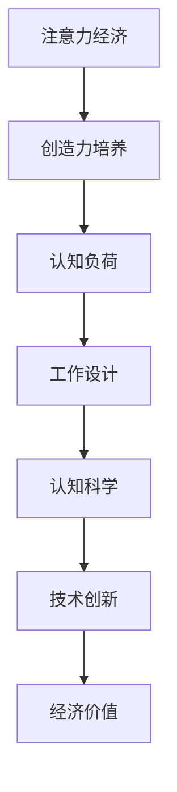

                 

# 注意力经济与个人创造力培养的关系

> 关键词：注意力经济, 创造力培养, 认知负载, 工作设计, 认知科学, 技术创新

## 1. 背景介绍

在数字化时代，注意力成为了一种宝贵的资源。随着互联网技术的迅猛发展，信息的爆炸式增长使得人们面临着前所未有的信息过载和认知负荷问题。一方面，海量的信息源不断吸引着人们的注意力；另一方面，注意力资源的有限性使得人们需要更加高效地分配和利用这一资源。这种背景下，“注意力经济”（Attention Economy）应运而生，即通过精心设计和优化内容，吸引和保持用户注意力，从而创造经济价值。

与此同时，注意力经济对个人创造力的培养也产生了深远影响。创造力不仅仅是天赋或灵感，更是一种可以通过系统训练和环境优化得以提升的能力。在注意力经济的时代，如何通过高效地分配和利用注意力资源，促进个人创造力的提升，成为摆在我们面前的重要课题。本文将从注意力经济的基本概念出发，探讨其对个人创造力培养的具体影响，并提出相应的策略和建议。

## 2. 核心概念与联系

### 2.1 核心概念概述

为更好地理解注意力经济与个人创造力培养的关系，本节将介绍几个密切相关的核心概念：

- **注意力经济（Attention Economy）**：指通过吸引和保持用户注意力，创造经济价值的活动。包括社交媒体、搜索引擎、在线广告等多种形式。
- **创造力（Creativity）**：指个人通过观察、思考、实验等活动，产生新颖、有用、独特想法的能力。
- **认知负荷（Cognitive Load）**：指个体在处理信息时所承受的心理负担，过多认知负荷可能导致注意力分散和创造力下降。
- **工作设计（Job Design）**：指通过优化工作任务和环境，减轻认知负荷，提升工作满意度和创造力的设计方法。
- **认知科学（Cognitive Science）**：研究人类认知过程及其应用科学，为理解注意力分配和创造力提升提供了理论基础。
- **技术创新（Technological Innovation）**：通过引入新技术或改进现有技术，创造新的经济和社会价值的过程。

这些核心概念之间的逻辑关系可以通过以下Mermaid流程图来展示：



这个流程图展示了一些关键概念及其之间的关系：

1. 注意力经济通过吸引和保持用户注意力，创造出经济价值。
2. 创造力培养依赖于个体的认知过程，合理的认知负荷和任务设计能够提升创造力。
3. 认知负荷与工作设计密切相关，合理的工作设计可以减轻认知负荷，提升创造力。
4. 认知科学提供了认知过程的理论基础，为工作设计提供指导。
5. 技术创新能够进一步优化工作设计和认知负荷，促进创造力提升。
6. 创造力的提升最终反映在经济价值的创造上。

这些概念共同构成了注意力经济与个人创造力培养的框架，为后续讨论提供了理论支撑。

## 3. 核心算法原理 & 具体操作步骤

### 3.1 算法原理概述

注意力经济与个人创造力培养的关系，可以通过以下几个关键原理来理解：

1. **认知负荷与创造力的关系**：创造力是一种依赖于认知资源的复杂心理过程，过多的认知负荷会导致注意力分散和创造力下降。因此，减轻认知负荷是提升创造力的关键。

2. **注意力分配策略**：通过优化注意力分配策略，确保重要任务得到足够的注意力，而非被琐碎无用的信息所分散。有效的注意力分配策略能够显著提升个体的创造力。

3. **工作设计理论**：工作设计理论指出，通过调整任务结构和环境，可以显著减轻个体的认知负荷，提升工作满意度和创造力。

4. **技术辅助**：现代信息技术可以辅助个体高效地管理注意力和认知负荷，通过自动化工具、信息过滤技术等手段，减轻工作负担，释放更多的注意力资源用于创造性活动。

### 3.2 算法步骤详解

基于上述原理，基于注意力经济与个人创造力培养的关系的算法步骤如下：

1. **认知负荷评估**：使用认知负荷评估工具，如自我报告问卷、认知负荷指数(Cognitive Load Index, CLI)等，评估当前工作或任务对个体的认知负荷。

2. **注意力分配优化**：根据认知负荷评估结果，调整注意力分配策略。例如，将复杂任务分解为多个小任务，通过优先级管理等方式，确保重要任务得到优先处理。

3. **工作设计调整**：通过调整工作结构，如任务自主性、任务复杂性、任务关联性等，优化工作设计，减轻认知负荷。

4. **技术辅助实施**：引入技术工具，如信息过滤软件、自动化系统、智能助手等，辅助个体高效管理注意力和认知负荷，提升工作效率和创造力。

5. **创造力培养机制**：设计系统性的创造力培养机制，如创造性工作坊、创意写作、头脑风暴等，通过提供创造性活动的结构和环境，促进个体创造力的提升。

### 3.3 算法优缺点

基于注意力经济与个人创造力培养的关系的算法，具有以下优点：

1. **系统性**：通过评估、优化、调整和实施系统性策略，能够全面提升个体的创造力。
2. **可操作性强**：认知负荷评估和工作设计调整等步骤，具有较强的操作性和可执行性。
3. **技术辅助**：现代技术可以大大提升个体注意力管理效率，为创造力提升提供支持。

同时，该算法也存在一定的局限性：

1. **个体差异性**：认知负荷和工作设计的影响因素因人而异，需要根据不同个体的特点进行个性化调整。
2. **技术依赖性**：技术工具的使用需要一定的技术熟练度和环境支持。
3. **短期效果与长期效果**：部分短期调整措施可能在短期内提升注意力和创造力，但长期效果需进一步验证。
4. **复杂度**：认知负荷评估和工作设计调整具有一定的复杂度，需要专业知识和工具支持。

尽管存在这些局限性，但该算法仍为提升个体创造力提供了明确的方向和实用的工具，具有广泛的应用前景。

### 3.4 算法应用领域

基于注意力经济与个人创造力培养的关系的算法，可以应用于多个领域，包括但不限于：

1. **企业和组织**：通过优化工作设计和技术辅助，提升员工创造力，增强组织创新能力。
2. **教育领域**：通过调整课堂教学结构，减轻学生认知负荷，提升课堂创新和学生创造力。
3. **设计行业**：设计师通过优化注意力分配和任务结构，减轻工作负担，提升设计创意和创新。
4. **艺术创作**：艺术家通过技术工具辅助，减轻创作过程中的认知负荷，释放更多注意力用于创造性活动。
5. **科研领域**：研究人员通过优化研究流程和技术工具，减轻认知负荷，提升研究创新和成果产出。

## 4. 数学模型和公式 & 详细讲解 & 举例说明

### 4.1 数学模型构建

在认知负荷的理论框架中，认知负荷可以用以下公式进行量化：

$$
CLI = \frac{C}{C_{max}} \times 100\%
$$

其中，$CLI$ 表示认知负荷指数，$C$ 表示个体在任务上的实际认知负荷，$C_{max}$ 表示个体的最大认知负荷容量。

### 4.2 公式推导过程

认知负荷指数的推导过程如下：

1. **认知负荷量(C)**：通过测量个体在执行任务时所需的认知资源，如记忆、注意、决策等，计算出认知负荷量。
2. **认知负荷容量(C_{max})**：通过测量个体在不同认知负荷水平下的表现，如工作记忆容量、注意力广度等，计算出认知负荷容量。
3. **认知负荷指数(CLI)**：将认知负荷量除以认知负荷容量，乘以100%，得到认知负荷指数。

例如，假设个体在执行一项任务时，实际认知负荷为100，最大认知负荷容量为150，则认知负荷指数为：

$$
CLI = \frac{100}{150} \times 100\% = 66.67\%
$$

表示该任务对个体的认知负荷约为66.67%。

### 4.3 案例分析与讲解

假设某项目经理在领导一个复杂的软件开发项目时，需要进行多方面的决策和协调，导致其认知负荷过高，注意力分散。根据认知负荷评估，发现项目经理的认知负荷指数达到90%。

为了提升项目经理的创造力和工作效率，可以采取以下措施：

1. **任务分解**：将复杂任务分解为多个小任务，每次只处理一个小任务，减轻认知负荷。
2. **优先级管理**：使用任务管理工具，将任务按重要性和紧急程度排序，确保重要任务得到优先处理。
3. **技术辅助**：引入项目管理软件，如Trello、Asana等，辅助项目经理高效管理任务和资源。
4. **创意空间**：在工作环境设计中引入创意空间，如休息区、头脑风暴室等，提供创造性活动的结构环境。

通过这些措施，项目经理的认知负荷得到显著减轻，注意力更加集中，创造力和工作效率显著提升。

## 5. 项目实践：代码实例和详细解释说明

### 5.1 开发环境搭建

在进行注意力经济与个人创造力培养关系实践前，我们需要准备好开发环境。以下是使用Python进行认知负荷评估的项目环境配置流程：

1. 安装Anaconda：从官网下载并安装Anaconda，用于创建独立的Python环境。

2. 创建并激活虚拟环境：
```bash
conda create -n attention-env python=3.8 
conda activate attention-env
```

3. 安装PyTorch、Pandas等必要的Python库：
```bash
pip install torch pandas numpy matplotlib
```

4. 安装相关的认知负荷评估工具：
```bash
pip install cognitive-load-index
```

完成上述步骤后，即可在`attention-env`环境中开始项目实践。

### 5.2 源代码详细实现

这里我们以创建一个简单的认知负荷评估工具为例，说明如何通过Python实现认知负荷评估和优化。

```python
from cognitive_load_index import CLI
from math import ceil

# 定义认知负荷评估函数
def calculate_cli(cognitive负荷量, max认知负荷容量):
    return (cognitive负荷量 / max认知负荷容量) * 100

# 计算认知负荷指数
def optimize_cli(cognitive负荷量, max认知负荷容量):
    cli = calculate_cli(cognitive负荷量, max认知负荷容量)
    if cli > 90:
        return '任务过于复杂，需要分解任务'
    elif cli > 70:
        return '任务复杂度适中，注意优先级管理'
    else:
        return '任务简单，不需要特别优化'

# 测试认知负荷评估函数
cognitive负荷量 = 100
max认知负荷容量 = 150
print(f'认知负荷指数为: {optimize_cli(cognitive负荷量, max认知负荷容量)}')
```

### 5.3 代码解读与分析

让我们再详细解读一下关键代码的实现细节：

**calculate_cli函数**：
- 定义了认知负荷评估公式，用于计算认知负荷指数。
- 将认知负荷量除以认知负荷容量，再乘以100%，得到认知负荷指数。

**optimize_cli函数**：
- 根据计算出的认知负荷指数，判断当前任务对认知负荷的影响程度。
- 当认知负荷指数大于90%时，表示任务过于复杂，建议进行任务分解。
- 当认知负荷指数大于70%时，表示任务复杂度适中，建议进行优先级管理。
- 当认知负荷指数小于等于70%时，表示任务简单，不需要特别优化。

**测试代码**：
- 定义认知负荷量和认知负荷容量，调用optimize_cli函数进行认知负荷评估。
- 根据评估结果输出相应的优化建议。

可以看到，通过Python编写认知负荷评估工具，可以简单高效地计算认知负荷指数，并提供相应的优化建议。开发者可以将更多精力放在实际应用中，进一步优化工作设计和注意力管理策略。

## 6. 实际应用场景

### 6.1 企业和组织

在企业和组织中，注意力经济与个人创造力培养的关系主要体现在以下几个方面：

1. **工作流程优化**：通过调整工作流程，如任务分解、优先级管理、任务自主性等，减轻员工认知负荷，提升创造力和工作效率。
2. **技术辅助工具**：引入自动化和智能工具，如项目管理软件、智能助手等，辅助员工高效管理注意力和认知负荷，促进创造力提升。
3. **创造性空间设计**：在工作环境设计中引入创意空间和休息区，提供创造性活动的结构环境，增强员工创造力。

### 6.2 教育领域

在教育领域，注意力经济与个人创造力培养的关系主要体现在以下几个方面：

1. **课程设计和教学方法**：通过优化课程设计，引入互动式教学方法，如项目导向学习、团队合作等，减轻学生的认知负荷，提升创造力。
2. **技术辅助教学**：引入在线学习平台和智能辅助工具，如自适应学习系统、虚拟实验室等，帮助学生高效管理注意力和认知负荷，促进创造性学习。
3. **创意工作坊和创新大赛**：设计和组织创意工作坊和创新大赛，提供创造性活动的结构和环境，激发学生的创造潜力。

### 6.3 设计行业

在设计行业中，注意力经济与个人创造力培养的关系主要体现在以下几个方面：

1. **任务分解和优先级管理**：设计师通过任务分解和优先级管理，减轻工作负担，集中注意力进行创造性设计。
2. **技术辅助工具**：引入设计软件和辅助工具，如CAD、3D建模软件、智能设计助手等，提升设计效率和创意表达。
3. **创意空间设计**：在设计工作室中引入创意空间和休息区，提供创造性活动的结构环境，增强设计师的创造力。

### 6.4 艺术创作

在艺术创作中，注意力经济与个人创造力培养的关系主要体现在以下几个方面：

1. **任务分解和优先级管理**：艺术家通过任务分解和优先级管理，减轻创作过程中的认知负荷，释放更多注意力用于创造性活动。
2. **技术辅助工具**：引入创作软件和辅助工具，如数字绘画软件、音乐制作软件、虚拟现实工具等，提升创作效率和创意表达。
3. **创意空间设计**：在创作空间中引入创意空间和休息区，提供创造性活动的结构环境，增强艺术家的创造力。

## 7. 工具和资源推荐

### 7.1 学习资源推荐

为了帮助开发者系统掌握注意力经济与个人创造力培养的理论基础和实践技巧，这里推荐一些优质的学习资源：

1. **《认知负荷与学习》（Cognitive Load and Learning）**：讲述了认知负荷的基本概念、评估方法和优化策略。
2. **《设计心理学》（Design Psychology）**：介绍了设计心理学在创造力培养中的应用，提供了系统的理论和方法。
3. **《创新管理》（Innovation Management）**：探讨了创新管理的基本原理和实践方法，为注意力经济提供了管理指导。
4. **《认知负荷评估工具》（Cognitive Load Assessment Tools）**：提供了多种认知负荷评估工具的详细介绍和使用方法。
5. **《工作设计理论》（Job Design Theory）**：介绍了工作设计理论的基本原理和实践方法，为优化工作结构和环境提供了指导。

通过对这些资源的学习实践，相信你一定能够快速掌握注意力经济与个人创造力培养的精髓，并用于解决实际的创造力提升问题。

### 7.2 开发工具推荐

高效的开发离不开优秀的工具支持。以下是几款用于注意力经济与个人创造力培养开发的常用工具：

1. **认知负荷评估软件**：如CLI工具、EeyeToolbox等，用于评估个体的认知负荷状态。
2. **任务管理工具**：如Trello、Asana、Jira等，辅助个体进行任务分解和优先级管理。
3. **智能辅助工具**：如Google Assistant、Amazon Alexa等，提供智能语音助手，辅助个体高效管理注意力和认知负荷。
4. **创意空间设计工具**：如Autodesk SketchUp、Blender等，提供创意空间设计和可视化工具。
5. **在线学习平台**：如Coursera、edX、Udacity等，提供创意学习资源和课程。

合理利用这些工具，可以显著提升注意力经济与个人创造力培养的实践效果，加速创新迭代的步伐。

### 7.3 相关论文推荐

注意力经济与个人创造力培养的研究源于学界的持续研究。以下是几篇奠基性的相关论文，推荐阅读：

1. **《认知负荷与创造力》（Cognitive Load and Creativity）**：研究了认知负荷对创造力的影响，提出了减轻认知负荷的方法。
2. **《注意力分配策略》（Attention Allocation Strategies）**：探讨了不同的注意力分配策略对创造力的影响，提供了优化策略。
3. **《工作设计理论》（Job Design Theory）**：介绍了工作设计理论的基本原理和实践方法，为优化工作结构和环境提供了指导。
4. **《技术辅助创造力》（Technology-Assisted Creativity）**：探讨了技术工具在创造力培养中的应用，提供了具体工具和方法。
5. **《创新管理》（Innovation Management）**：研究了创新管理的基本原理和实践方法，为提升组织创新能力提供了指导。

这些论文代表了大语言模型微调技术的发展脉络。通过学习这些前沿成果，可以帮助研究者把握学科前进方向，激发更多的创新灵感。

## 8. 总结：未来发展趋势与挑战

### 8.1 总结

本文对注意力经济与个人创造力培养的关系进行了全面系统的介绍。首先阐述了注意力经济的基本概念和其对个人创造力培养的影响，明确了认知负荷、工作设计等关键因素对创造力提升的重要性。其次，从认知负荷评估到优化，详细讲解了如何通过系统性策略提升个体的创造力，并给出了相应的操作策略和工具。

通过本文的系统梳理，可以看到，注意力经济通过优化注意力分配和工作设计，显著减轻了个体的认知负荷，提升了创造力。这一过程不仅需要科学评估，更需要合理的实践策略和技术工具。未来，随着技术的不断进步，注意力经济与个人创造力培养的关系将更加紧密，为人类认知智能的提升提供新的动力。

### 8.2 未来发展趋势

展望未来，注意力经济与个人创造力培养的关系将呈现以下几个发展趋势：

1. **技术工具的普及**：随着技术的普及和应用，越来越多的企业和个人将采用认知负荷评估和优化工具，提升创造力。
2. **数据驱动的优化**：通过对认知负荷和创造力数据的深入分析，实现更加精准的认知负荷评估和优化。
3. **多学科融合**：认知负荷评估、工作设计、创新管理等多学科的融合，将为注意力经济与个人创造力培养提供更加全面的理论和方法。
4. **全球化应用**：随着全球化的发展，注意力经济与个人创造力培养的方法将逐渐推广到全球范围，助力全球创新发展。
5. **个性化定制**：根据不同个体的特点，设计个性化的注意力管理和创造力培养策略，提升个体差异化的创造力表现。

### 8.3 面临的挑战

尽管注意力经济与个人创造力培养的关系已经取得了初步成效，但在迈向更加智能化、普适化应用的过程中，它仍面临诸多挑战：

1. **个体差异性**：认知负荷和工作设计的影响因素因人而异，需要根据不同个体的特点进行个性化调整。
2. **技术依赖性**：技术工具的使用需要一定的技术熟练度和环境支持。
3. **短期效果与长期效果**：部分短期调整措施可能在短期内提升注意力和创造力，但长期效果需进一步验证。
4. **复杂度**：认知负荷评估和工作设计调整具有一定的复杂度，需要专业知识和工具支持。
5. **伦理与安全**：在应用过程中，需要注意保护用户隐私和数据安全，确保技术应用的伦理和安全。

尽管存在这些挑战，但该领域的研究和发展前景广阔，相信随着学界和产业界的共同努力，这些挑战终将一一克服，注意力经济与个人创造力培养的关系必将在构建人机协同的智能时代中扮演越来越重要的角色。

### 8.4 研究展望

面对注意力经济与个人创造力培养关系面临的挑战，未来的研究需要在以下几个方面寻求新的突破：

1. **个性化认知负荷评估**：开发更加个性化的认知负荷评估工具，结合大数据分析，为不同个体提供更精准的评估结果。
2. **多模态注意力管理**：引入多模态注意力管理技术，如视觉、听觉、触觉等，提升个体的注意力管理和创造力培养效果。
3. **跨领域创新管理**：研究跨领域的创新管理方法，促进不同行业之间的技术交流和创新协同。
4. **伦理导向的创新管理**：引入伦理导向的评估指标，确保技术应用的安全和公正。
5. **长期效果评估**：设计长期效果评估机制，验证注意力经济与个人创造力培养的长期效果，提供持续优化建议。

这些研究方向的研究，必将引领注意力经济与个人创造力培养关系的进一步发展，为构建安全、可靠、可解释、可控的智能系统铺平道路。面向未来，通过持续优化和创新，相信注意力经济与个人创造力培养的关系将进一步深化，为人类的认知智能带来新的变革。

## 9. 附录：常见问题与解答

**Q1：如何评估个体的认知负荷？**

A: 可以通过使用认知负荷评估工具，如自我报告问卷、认知负荷指数（CLI）等，评估个体在执行任务时的认知负荷量。

**Q2：如何优化工作设计？**

A: 可以通过任务分解、优先级管理、任务自主性等方式，优化工作结构和环境，减轻个体的认知负荷，提升创造力。

**Q3：技术工具在注意力管理和创造力培养中扮演什么角色？**

A: 技术工具可以辅助个体高效管理注意力和认知负荷，提升工作满意度和创造力。常用的技术工具包括项目管理软件、智能助手等。

**Q4：注意力经济与个人创造力培养的关系如何体现在实际应用中？**

A: 通过优化注意力分配和工作设计，减轻个体的认知负荷，提升创造力。例如，设计创意空间和休息区，引入认知负荷评估工具，使用任务管理软件等。

**Q5：未来的发展方向是什么？**

A: 未来的发展方向包括技术工具的普及、数据驱动的优化、多学科融合、全球化应用、个性化定制等。

---

作者：禅与计算机程序设计艺术 / Zen and the Art of Computer Programming

