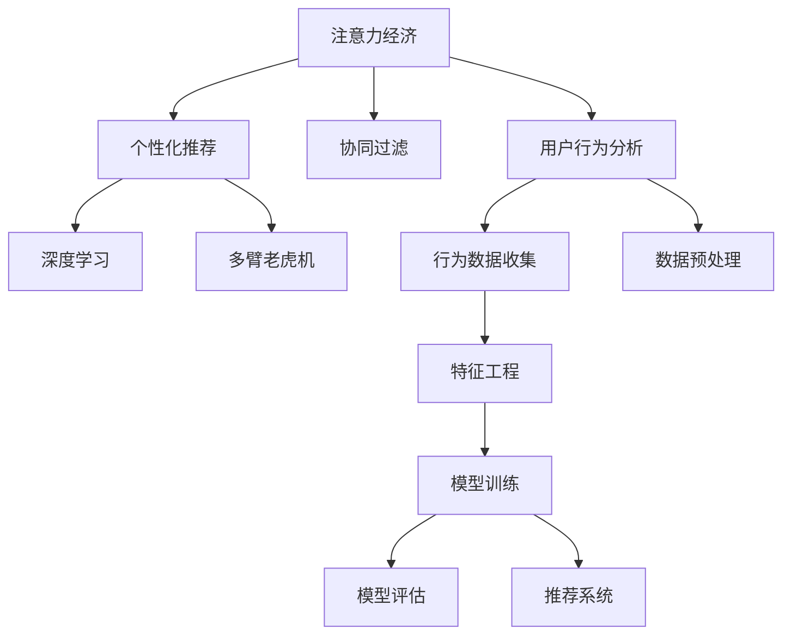

                 

# 注意力经济与个性化体验创建：如何为受众定制产品、服务和内容

## 1. 背景介绍

### 1.1 问题由来
在信息爆炸的时代，消费者面临海量的内容选择，如何从浩瀚的信息海洋中发现有价值的知识、产品或服务，成为企业关注的焦点。注意力经济（Attention Economy）应运而生，它强调在信息泛滥的环境下，吸引和保持用户的注意力是企业取得竞争优势的关键。个性化体验（Personalized Experience）则是在注意力经济的基础上，通过深入理解用户需求，提供量身定制的内容、产品和服务，进一步增强用户粘性，提升满意度。

### 1.2 问题核心关键点
- **注意力经济学**：如何高效吸引和维持用户的注意力，实现信息与用户的精准匹配。
- **个性化算法**：如何根据用户行为和偏好，智能推荐内容、产品和服务，提升用户体验。
- **用户行为分析**：如何通过对用户数据的深入分析，识别用户需求和偏好。
- **推荐系统**：如何构建智能推荐系统，优化用户体验，促进用户互动。

### 1.3 问题研究意义
- 提升用户体验：通过个性化体验，让用户获得更加满意和贴合需求的服务，增强用户忠诚度。
- 优化营销效果：个性化推荐有助于精准营销，提升转化率，降低运营成本。
- 驱动业务增长：通过精准的个性化推荐，提高用户留存率和复购率，促进业务持续增长。
- 增进用户互动：个性化体验能够提供更加互动、丰富的用户体验，增加用户粘性。

## 2. 核心概念与联系

### 2.1 核心概念概述

为了更好地理解注意力经济和个性化体验的实现机制，本节将介绍几个密切相关的核心概念：

- **注意力经济**：在信息爆炸时代，用户的时间和注意力变得稀缺。企业需要利用有限的用户注意力，通过提供有价值的信息、产品和服务，吸引和保持用户关注。
- **个性化推荐系统**：通过算法分析用户行为数据，预测用户需求，提供符合用户兴趣和偏好的推荐。
- **协同过滤**：通过用户之间的相似性来推荐物品，包括基于用户的协同过滤和基于物品的协同过滤。
- **深度学习**：利用深度神经网络处理大规模数据，提取用户行为中的潜在特征，进行更精准的个性化推荐。
- **多臂老虎机（Bandit）**：在多臂老虎机问题中，用户随机选择选项，通过反馈机制优化决策策略。

这些概念之间存在紧密的联系，共同构成了注意力经济和个性化体验的实现框架。

### 2.2 核心概念原理和架构的 Mermaid 流程图



这个流程图展示了几类核心概念之间的逻辑关系：

1. 注意力经济通过个性化推荐吸引和保持用户关注。
2. 个性化推荐依赖协同过滤、深度学习和多臂老虎机等多种算法和策略。
3. 用户行为分析从数据收集、预处理到特征工程和模型训练，是实现个性化推荐的基础。
4. 推荐系统将多种算法和策略的输出结果进行集成和优化，最终为用户生成个性化推荐。

## 3. 核心算法原理 & 具体操作步骤
### 3.1 算法原理概述

个性化推荐的核心在于利用用户的历史行为数据，通过算法预测用户对不同内容、产品或服务的兴趣，从而进行个性化推荐。常用的个性化推荐算法包括协同过滤、基于内容的推荐、深度学习和混合推荐等。

协同过滤算法（Collaborative Filtering）基于用户之间的相似性进行推荐。对于基于用户的协同过滤，首先需要计算用户之间的相似度，然后通过相似用户的行为数据预测目标用户的偏好。基于物品的协同过滤则是通过物品之间的相似性来进行推荐。

基于内容的推荐算法（Content-Based Recommendation）则直接分析物品的属性特征，预测用户对物品的兴趣。深度学习算法通过构建复杂的神经网络模型，能够处理海量数据，提取用户行为中的潜在特征，进行更精准的推荐。

混合推荐系统则是将多种推荐算法进行集成，综合各算法的优点，提升推荐效果。

### 3.2 算法步骤详解

个性化推荐的具体实现步骤如下：

**Step 1: 数据准备**

- **用户行为数据收集**：收集用户的历史行为数据，包括浏览记录、购买记录、评分记录等。
- **数据预处理**：对数据进行清洗、去重、归一化等预处理，确保数据质量。
- **特征提取**：将用户行为数据转化为模型可用的特征，如时间戳、物品ID、评分等。

**Step 2: 算法模型训练**

- **选择合适的推荐算法**：根据具体场景选择协同过滤、深度学习或混合推荐算法。
- **模型训练**：使用历史行为数据训练推荐模型，优化模型参数。
- **模型评估**：在验证集上评估模型性能，调整模型参数以提升准确性。

**Step 3: 推荐结果生成**

- **实时预测**：将新用户的行为数据输入训练好的模型，实时预测其对不同物品的兴趣。
- **推荐排序**：根据预测结果对物品进行排序，生成个性化推荐列表。
- **推荐呈现**：将推荐列表展示给用户，优化用户界面设计，提升用户体验。

**Step 4: 模型优化**

- **A/B测试**：通过A/B测试对比不同推荐策略的效果，优化推荐结果。
- **反馈循环**：根据用户反馈调整推荐策略，不断优化推荐系统。

### 3.3 算法优缺点

个性化推荐算法具有以下优点：

- **精准性高**：通过深入分析用户行为数据，能够提供更加精准的推荐。
- **多样化**：能够根据用户兴趣推荐多样化的内容，提升用户体验。
- **动态性**：用户兴趣和偏好可能随时间变化，个性化推荐能够实时响应变化。

但同时，个性化推荐算法也存在以下缺点：

- **冷启动问题**：新用户或新物品可能没有足够的历史行为数据，导致推荐效果不佳。
- **数据隐私问题**：用户行为数据的收集和使用可能涉及隐私问题，需严格遵守相关法律法规。
- **过拟合问题**：过度依赖历史数据可能导致模型过拟合，影响推荐效果。
- **计算成本高**：深度学习等复杂模型需要大量计算资源，训练和部署成本较高。

### 3.4 算法应用领域

个性化推荐算法在众多领域都有广泛应用，包括但不限于：

- **电商推荐**：电商平台通过个性化推荐提升用户购买率，增加销售额。
- **内容推荐**：视频网站、音乐平台、新闻门户等利用个性化推荐提高用户粘性，提升留存率。
- **金融理财**：银行、保险公司通过个性化推荐为用户提供定制化的理财方案。
- **社交网络**：社交平台利用个性化推荐增加用户互动，提升社区活跃度。

## 4. 数学模型和公式 & 详细讲解 & 举例说明

### 4.1 数学模型构建

本节将使用数学语言对个性化推荐算法的核心模型进行详细刻画。

假设用户集合为 $U$，物品集合为 $I$，用户对物品的评分集合为 $R$，其中 $r_{ui}$ 表示用户 $u$ 对物品 $i$ 的评分。用户行为矩阵 $R_{ui}$ 可以表示为：

$$
R_{ui} = \left\{
\begin{array}{ll}
r_{ui}, & u \in U, i \in I \\
0, & \text{otherwise}
\end{array}
\right.
$$

推荐算法的目标是在给定用户 $u$ 的情况下，预测其对物品 $i$ 的评分 $r_{ui}$，并进行排序推荐。

### 4.2 公式推导过程

对于基于用户的协同过滤算法，首先需要计算用户之间的相似度。常用的相似度度量方法包括余弦相似度和皮尔逊相关系数。余弦相似度的计算公式如下：

$$
\text{similarity}(u_i, u_j) = \cos(\theta) = \frac{\sum_{k=1}^n r_{ik}r_{jk}}{\sqrt{\sum_{k=1}^n r_{ik}^2}\sqrt{\sum_{k=1}^n r_{jk}^2}}
$$

其中 $n$ 为用户行为矩阵的维度。

基于用户相似度的推荐算法步骤如下：

1. 计算用户 $u_i$ 和 $u_j$ 的相似度。
2. 根据相似度排序，选择相似度最高的 $k$ 个用户 $u_{1..k}$。
3. 对这 $k$ 个用户对物品 $i$ 的评分进行加权平均，得到用户 $u_i$ 对物品 $i$ 的预测评分 $r'_{ui}$。

对于基于物品的协同过滤算法，则是通过物品之间的相似度来进行推荐。常见的相似度度量方法包括余弦相似度和欧氏距离。

基于内容的推荐算法则是通过分析物品的属性特征，预测用户对物品的兴趣。假设物品 $i$ 的属性特征向量为 $c_i$，用户 $u$ 的属性特征向量为 $p_u$，推荐算法可以表示为：

$$
\text{score}_{ui} = \text{similarity}(p_u, c_i) = p_u^T W c_i
$$

其中 $W$ 为物品和用户特征向量的权重矩阵。

深度学习推荐算法通过构建复杂的神经网络模型，能够处理海量数据，提取用户行为中的潜在特征。常用的深度学习推荐模型包括基于矩阵分解的模型、基于注意力机制的模型和基于神经网络的结构化模型。

### 4.3 案例分析与讲解

以Netflix的推荐系统为例，Netflix利用协同过滤算法对用户行为数据进行建模，预测用户对不同电影的评分，从而实现个性化推荐。其具体步骤如下：

1. 收集用户的历史观看数据，如观看的电影、观看时长、评分等。
2. 对数据进行清洗、去重、归一化等预处理。
3. 使用协同过滤算法计算用户之间的相似度，预测用户对不同电影的评分。
4. 根据评分对电影进行排序，生成个性化推荐列表。
5. 根据用户反馈调整推荐策略，优化推荐系统。

Netflix的推荐系统通过高效的协同过滤算法，实现了精准的个性化推荐，显著提升了用户的观看体验和留存率。

## 5. 项目实践：代码实例和详细解释说明
### 5.1 开发环境搭建

在进行个性化推荐系统开发前，我们需要准备好开发环境。以下是使用Python进行PyTorch开发的环境配置流程：

1. 安装Anaconda：从官网下载并安装Anaconda，用于创建独立的Python环境。

2. 创建并激活虚拟环境：
```bash
conda create -n pytorch-env python=3.8 
conda activate pytorch-env
```

3. 安装PyTorch：根据CUDA版本，从官网获取对应的安装命令。例如：
```bash
conda install pytorch torchvision torchaudio cudatoolkit=11.1 -c pytorch -c conda-forge
```

4. 安装transformers库：
```bash
pip install transformers
```

5. 安装各类工具包：
```bash
pip install numpy pandas scikit-learn matplotlib tqdm jupyter notebook ipython
```

完成上述步骤后，即可在`pytorch-env`环境中开始个性化推荐系统的开发。

### 5.2 源代码详细实现

下面我们以协同过滤推荐系统为例，给出使用PyTorch和Transformers库的代码实现。

首先，定义协同过滤推荐系统的数据处理函数：

```python
from transformers import BertTokenizer
from torch.utils.data import Dataset
import torch

class CollaborativeFilteringDataset(Dataset):
    def __init__(self, ratings, users, items):
        self.ratings = ratings
        self.users = users
        self.items = items
        
    def __len__(self):
        return len(self.ratings)
    
    def __getitem__(self, item):
        user_id = self.users[item][0]
        item_id = self.items[item][0]
        rating = self.ratings[item][0]
        
        return {'user_id': user_id, 
                'item_id': item_id,
                'rating': rating}

# 创建dataset
train_dataset = CollaborativeFilteringDataset(train_ratings, train_users, train_items)
dev_dataset = CollaborativeFilteringDataset(dev_ratings, dev_users, dev_items)
test_dataset = CollaborativeFilteringDataset(test_ratings, test_users, test_items)
```

然后，定义模型和优化器：

```python
from transformers import BertForTokenClassification, AdamW

model = BertForTokenClassification.from_pretrained('bert-base-cased', num_labels=len(tag2id))

optimizer = AdamW(model.parameters(), lr=2e-5)
```

接着，定义训练和评估函数：

```python
from torch.utils.data import DataLoader
from tqdm import tqdm
from sklearn.metrics import classification_report

device = torch.device('cuda') if torch.cuda.is_available() else torch.device('cpu')
model.to(device)

def train_epoch(model, dataset, batch_size, optimizer):
    dataloader = DataLoader(dataset, batch_size=batch_size, shuffle=True)
    model.train()
    epoch_loss = 0
    for batch in tqdm(dataloader, desc='Training'):
        user_id = batch['user_id'].to(device)
        item_id = batch['item_id'].to(device)
        rating = batch['rating'].to(device)
        model.zero_grad()
        outputs = model(user_id, item_id)
        loss = outputs.loss
        epoch_loss += loss.item()
        loss.backward()
        optimizer.step()
    return epoch_loss / len(dataloader)

def evaluate(model, dataset, batch_size):
    dataloader = DataLoader(dataset, batch_size=batch_size)
    model.eval()
    preds, labels = [], []
    with torch.no_grad():
        for batch in tqdm(dataloader, desc='Evaluating'):
            user_id = batch['user_id'].to(device)
            item_id = batch['item_id'].to(device)
            batch_labels = batch['rating']
            outputs = model(user_id, item_id)
            batch_preds = outputs.logits.argmax(dim=2).to('cpu').tolist()
            batch_labels = batch_labels.to('cpu').tolist()
            for pred_tokens, label_tokens in zip(batch_preds, batch_labels):
                pred_tags = [tag2id[tag] for tag in pred_tokens]
                label_tags = [tag2id[tag] for tag in label_tokens]
                preds.append(pred_tags[:len(label_tokens)])
                labels.append(label_tags)
                
    print(classification_report(labels, preds))
```

最后，启动训练流程并在测试集上评估：

```python
epochs = 5
batch_size = 16

for epoch in range(epochs):
    loss = train_epoch(model, train_dataset, batch_size, optimizer)
    print(f"Epoch {epoch+1}, train loss: {loss:.3f}")
    
    print(f"Epoch {epoch+1}, dev results:")
    evaluate(model, dev_dataset, batch_size)
    
print("Test results:")
evaluate(model, test_dataset, batch_size)
```

以上就是使用PyTorch和Transformers库实现协同过滤推荐系统的完整代码实现。可以看到，得益于Transformer库的强大封装，我们可以用相对简洁的代码完成推荐模型的加载和训练。

### 5.3 代码解读与分析

让我们再详细解读一下关键代码的实现细节：

**CollaborativeFilteringDataset类**：
- `__init__`方法：初始化用户ID、物品ID和评分。
- `__len__`方法：返回数据集的样本数量。
- `__getitem__`方法：对单个样本进行处理，将用户ID、物品ID和评分转换为模型所需的输入。

**tag2id和id2tag字典**：
- 定义了标签与id之间的映射关系，用于将token-wise的预测结果解码回真实的标签。

**训练和评估函数**：
- 使用PyTorch的DataLoader对数据集进行批次化加载，供模型训练和推理使用。
- 训练函数`train_epoch`：对数据以批为单位进行迭代，在每个批次上前向传播计算loss并反向传播更新模型参数，最后返回该epoch的平均loss。
- 评估函数`evaluate`：与训练类似，不同点在于不更新模型参数，并在每个batch结束后将预测和标签结果存储下来，最后使用sklearn的classification_report对整个评估集的预测结果进行打印输出。

**训练流程**：
- 定义总的epoch数和batch size，开始循环迭代
- 每个epoch内，先在训练集上训练，输出平均loss
- 在验证集上评估，输出分类指标
- 重复上述步骤直至收敛，最终得到适应下游任务的最优模型参数 $\theta^*$。

可以看到，PyTorch配合Transformers库使得推荐模型的代码实现变得简洁高效。开发者可以将更多精力放在数据处理、模型改进等高层逻辑上，而不必过多关注底层的实现细节。

当然，工业级的系统实现还需考虑更多因素，如模型的保存和部署、超参数的自动搜索、更灵活的任务适配层等。但核心的微调范式基本与此类似。

## 6. 实际应用场景
### 6.1 电商推荐

基于个性化推荐算法，电商平台可以大幅提升用户购买率，增加销售额。通过分析用户的历史浏览、购买记录，个性化推荐商品，提升用户满意度。例如Amazon的推荐系统，通过实时分析和预测用户对商品的兴趣，提供个性化的商品推荐，显著提升了用户体验和购买转化率。

### 6.2 内容推荐

内容推荐系统在视频网站、音乐平台、新闻门户等应用中广泛使用。通过分析用户的历史观看、收听和阅读记录，个性化推荐内容，提高用户粘性。例如Netflix的推荐系统，通过协同过滤算法，为用户推荐电影、电视剧和纪录片，提升用户观看体验和留存率。

### 6.3 金融理财

金融机构可以利用个性化推荐算法，为用户提供定制化的理财方案。通过分析用户的历史交易记录和风险偏好，推荐合适的金融产品，满足用户的财务需求。例如支付宝的理财推荐，通过深度学习算法，分析用户的交易数据和行为特征，提供个性化的理财产品推荐，提升用户满意度。

### 6.4 社交网络

社交网络平台利用个性化推荐算法，增加用户互动，提升社区活跃度。通过分析用户的历史互动数据，推荐相关的内容和用户，促进用户之间的交流。例如Facebook的推荐算法，通过协同过滤算法，为用户推荐朋友和新闻内容，提高用户活跃度和留存率。

### 6.5 未来应用展望

随着个性化推荐算法的不断进步，其在更多领域的应用前景将更加广阔。

在智慧医疗领域，个性化推荐算法可以用于推荐合适的医疗方案、药物和健康管理计划，提高患者满意度和治疗效果。

在智能教育领域，个性化推荐算法可以用于推荐适合的课程、教材和在线学习资源，帮助学生更高效地学习。

在智慧城市治理中，个性化推荐算法可以用于推荐合适的城市服务和信息，提升城市管理的智能化水平。

此外，在企业生产、社会治理、文娱传媒等众多领域，个性化推荐算法将带来新的创新应用，为各行各业的发展注入新的动力。

## 7. 工具和资源推荐
### 7.1 学习资源推荐

为了帮助开发者系统掌握个性化推荐算法的理论基础和实践技巧，这里推荐一些优质的学习资源：

1. 《推荐系统实战》系列博文：由推荐系统领域专家撰写，深入浅出地介绍了推荐系统的原理和实践方法。

2. Coursera《Recommender Systems》课程：由University of Minnesota开设的推荐系统课程，提供系统性的理论知识和实践案例。

3. 《推荐系统》书籍：由Richard J. Zhang等作者所著，全面介绍了推荐系统的理论基础、算法和应用。

4. Kaggle推荐系统竞赛：通过参加推荐系统竞赛，实战练习推荐算法的优化和应用。

5. arXiv推荐系统论文：最新推荐系统领域的学术论文，了解前沿研究方向和技术进展。

通过对这些资源的学习实践，相信你一定能够快速掌握个性化推荐算法的精髓，并用于解决实际的推荐问题。

### 7.2 开发工具推荐

高效的开发离不开优秀的工具支持。以下是几款用于个性化推荐系统开发的常用工具：

1. Python：灵活的编程语言，广泛用于数据处理和机器学习。
2. PyTorch：基于Python的开源深度学习框架，灵活高效，适用于深度学习推荐系统开发。
3. TensorFlow：由Google主导开发的开源深度学习框架，生产部署方便，适合大规模工程应用。
4. Hive：基于Apache Hadoop的数据处理工具，适用于大规模数据集的处理。
5. Spark：Apache基金会开源的大数据处理平台，支持分布式计算和数据处理。

合理利用这些工具，可以显著提升个性化推荐系统的开发效率，加快创新迭代的步伐。

### 7.3 相关论文推荐

个性化推荐算法在诸多领域已经取得了广泛应用，以下是几篇奠基性的相关论文，推荐阅读：

1. Personalized PageRank：提出了一种基于 PageRank 的个性化推荐算法，通过网页间的链接关系，推荐相关网页。
2. Matrix Factorization Techniques for Recommender Systems：介绍矩阵分解技术，用于对用户和物品行为数据进行建模，预测用户对物品的评分。
3. Beyond Matrix Factorization：提出深度学习推荐模型，通过多层神经网络提取用户行为中的潜在特征，提升推荐效果。
4. Deep Collaborative Filtering：介绍深度学习推荐模型，通过卷积神经网络和递归神经网络，提升推荐效果。
5. The One-class Bandit：引入多臂老虎机模型，优化个性化推荐中的探索与利用平衡。

这些论文代表了个性化推荐算法的演进历程，为后续研究提供了重要参考。

## 8. 总结：未来发展趋势与挑战

### 8.1 总结

本文对个性化推荐算法进行了全面系统的介绍。首先阐述了注意力经济和个性化体验的研究背景和意义，明确了推荐算法在提升用户体验和优化营销效果方面的独特价值。其次，从原理到实践，详细讲解了推荐算法的数学模型和实现步骤，给出了推荐任务开发的完整代码实例。同时，本文还广泛探讨了推荐算法在电商、内容推荐、金融理财、社交网络等多个领域的应用前景，展示了个性化推荐算法的巨大潜力。此外，本文精选了推荐算法的各类学习资源，力求为读者提供全方位的技术指引。

通过本文的系统梳理，可以看到，个性化推荐算法正在成为推荐系统的核心技术，通过深入理解用户行为，提供量身定制的内容、产品和服务，提升用户体验，优化营销效果。未来，伴随推荐算法的不断进步，将进一步推动人工智能技术在各行各业的普及和应用，为人类生产生活方式带来深远影响。

### 8.2 未来发展趋势

展望未来，个性化推荐算法将呈现以下几个发展趋势：

1. 数据驱动推荐：通过海量数据驱动推荐算法，不断优化推荐效果，提升用户满意度。
2. 多模态推荐：结合图像、视频、语音等多模态数据，提供更加丰富和多样化的推荐。
3. 实时推荐：利用流数据处理技术，实现实时推荐，提升用户体验。
4. 个性化模型：引入个性化模型，如层次模型、协同过滤等，提升推荐精准性。
5. 深度学习推荐：利用深度神经网络，处理大规模数据，提取用户行为中的潜在特征，进行更精准的推荐。
6. 跨领域推荐：结合多个领域的知识，提供跨领域的推荐，提升推荐效果。

以上趋势凸显了个性化推荐算法的广阔前景，未来必将进一步推动推荐系统的发展，为推荐算法带来新的突破。

### 8.3 面临的挑战

尽管个性化推荐算法已经取得了瞩目成就，但在迈向更加智能化、普适化应用的过程中，它仍面临诸多挑战：

1. 数据隐私问题：用户行为数据的收集和使用涉及隐私问题，需严格遵守相关法律法规。
2. 冷启动问题：新用户或新物品可能没有足够的历史行为数据，导致推荐效果不佳。
3. 推荐效率问题：推荐系统需要处理海量数据，计算成本较高，需优化算法和模型结构。
4. 公平性和多样性：推荐系统可能存在数据偏差，导致推荐结果不公平，缺乏多样性。
5. 计算资源限制：推荐系统需要大量计算资源，需优化算法和模型结构，提升计算效率。

### 8.4 研究展望

面对个性化推荐算法所面临的挑战，未来的研究需要在以下几个方面寻求新的突破：

1. 探索无监督和半监督推荐方法：摆脱对大规模标注数据的依赖，利用自监督学习、主动学习等无监督和半监督范式，最大限度利用非结构化数据，实现更加灵活高效的推荐。
2. 研究参数高效和计算高效的推荐范式：开发更加参数高效的推荐方法，在固定大部分推荐参数的同时，只更新极少量的任务相关参数。同时优化推荐模型的计算图，减少前向传播和反向传播的资源消耗，实现更加轻量级、实时性的部署。
3. 引入因果分析和博弈论工具：将因果分析方法引入推荐模型，识别出模型决策的关键特征，增强输出解释的因果性和逻辑性。借助博弈论工具刻画人机交互过程，主动探索并规避模型的脆弱点，提高系统稳定性。
4. 纳入伦理道德约束：在推荐模型训练目标中引入伦理导向的评估指标，过滤和惩罚有偏见、有害的输出倾向。同时加强人工干预和审核，建立模型行为的监管机制，确保输出符合人类价值观和伦理道德。

这些研究方向和探索，必将引领个性化推荐算法迈向更高的台阶，为构建安全、可靠、可解释、可控的智能推荐系统铺平道路。

## 9. 附录：常见问题与解答

**Q1：如何平衡个性化推荐和多样性？**

A: 个性化推荐算法虽然可以提升用户满意度，但也可能导致推荐结果过于单一，缺乏多样性。为解决这一问题，可以采用以下策略：

1. 多臂老虎机算法：在多臂老虎机问题中，用户随机选择选项，通过反馈机制优化决策策略。推荐系统可以引入多臂老虎机算法，在个性化推荐的同时，确保推荐结果的多样性。
2. 多样性约束：在推荐算法中引入多样性约束，如限制推荐结果中特定类别的物品数量，提升推荐多样性。
3. 探索与利用平衡：在推荐算法中引入探索与利用平衡策略，如epsilon-greedy策略，增加对新物品的探索，提升推荐多样性。

**Q2：个性化推荐如何处理数据冷启动问题？**

A: 数据冷启动问题是推荐系统面临的常见挑战，新用户或新物品可能没有足够的历史行为数据。为解决这一问题，可以采用以下策略：

1. 基于内容的推荐：对于新物品，可以通过其属性特征进行推荐，避免依赖历史数据。
2. 多臂老虎机算法：在多臂老虎机问题中，用户随机选择选项，通过反馈机制优化决策策略。推荐系统可以引入多臂老虎机算法，在个性化推荐的同时，提升对新物品的探索，缓解冷启动问题。
3. 推荐引擎的外部数据源：利用外部数据源，如专家知识库、用户兴趣图等，提升推荐效果。

**Q3：个性化推荐如何应对数据偏差问题？**

A: 数据偏差是推荐系统面临的常见问题，推荐结果可能存在性别、种族、地域等方面的不公平。为解决这一问题，可以采用以下策略：

1. 公平性约束：在推荐算法中引入公平性约束，如差异化推荐策略，确保不同群体的用户得到公平的推荐结果。
2. 多样性约束：在推荐算法中引入多样性约束，如限制推荐结果中特定类别的物品数量，提升推荐多样性，缓解数据偏差问题。
3. 数据清洗与预处理：在数据收集和预处理阶段，进行数据清洗和特征工程，减少数据偏差的影响。

这些策略可以帮助个性化推荐系统在提升用户满意度的同时，确保推荐结果的公平性和多样性，提升推荐系统的可靠性和稳定性。

---

作者：禅与计算机程序设计艺术 / Zen and the Art of Computer Programming

