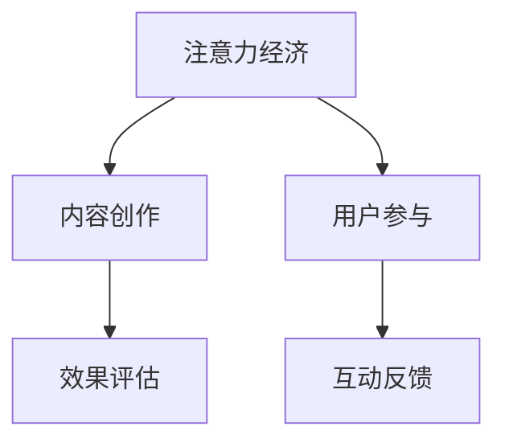

                 

# 注意力经济与内容创作最佳实践：吸引并留住受众的参与度

## 1. 背景介绍

### 1.1 问题由来
在数字化媒体和信息爆炸的时代，如何吸引并留住受众的注意力，已成为内容创作者和运营者面临的核心挑战。以往以规模和曝光量为主的粗放式运营模式已无法适应日益激烈的市场竞争。今天的内容创作与分发，更注重用户参与度和互动性，致力于实现精准触达与深度互动。

在这样的背景下，注意力经济学应运而生。它关注用户注意力分配的行为规律，通过系统化的方法指导内容创作与分发策略，提升内容产品的竞争力和市场影响力。

### 1.2 问题核心关键点
注意力经济学涉及的核心问题包括：
1. **注意力分布**：用户如何在众多信息源中分配注意力？
2. **内容吸引力**：哪些内容特征更容易吸引用户注意？
3. **用户互动**：如何设计内容形式，激发用户参与和反馈？
4. **效果评估**：如何评估内容策略的实际效果？

本文将重点探讨如何基于注意力经济学理论，制定高效的内容创作与运营策略，从而吸引并留住受众的参与度。

## 2. 核心概念与联系

### 2.1 核心概念概述

为更好地理解注意力经济学的原理与实践，本节将介绍几个关键概念：

- **注意力经济（Attention Economy）**：指在信息过载的环境中，稀缺用户注意力成为最宝贵的经济资源。注意力经济学关注如何优化资源配置，提升内容的吸引力和传播效果。
- **内容创作（Content Creation）**：从内容策划、内容生产到内容分发的全过程，涉及内容创意、形式选择、技术实现等多个环节。
- **用户参与（User Engagement）**：用户与内容互动的程度，包括点击、评论、分享、付费等多种形式。
- **互动反馈（Interactive Feedback）**：用户对内容的直接反应，如点赞、评论、转发等，提供内容优化和改进的依据。
- **效果评估（Effect Evaluation）**：通过指标和模型，量化内容策略的实际效果，指导进一步优化。

这些概念之间的逻辑关系可以通过以下Mermaid流程图来展示：



这个流程图展示了我所提到的核心概念及其之间的关系：

1. 注意力经济通过优化内容创作和用户参与过程，提升内容的传播效果。
2. 内容创作影响用户参与度和互动反馈，进而影响注意力经济的反馈。
3. 效果评估提供量化的数据支持，指导内容创作和用户参与的优化。

这些概念共同构成了注意力经济学的核心框架，使得内容创作者能够通过科学的方法，提升内容产品的吸引力和市场竞争力。

## 3. 核心算法原理 & 具体操作步骤
### 3.1 算法原理概述

注意力经济学的核心算法原理基于对用户注意力分配规律的分析和建模。核心算法可以概括为：

1. **注意力模型建立**：通过统计和实验数据，构建用户注意力行为模型，识别用户对不同类型内容的偏好。
2. **内容匹配推荐**：基于注意力模型，实时推荐最匹配用户兴趣的内容，提升用户参与度。
3. **用户行为追踪**：对用户与内容互动的轨迹进行追踪和分析，提取有价值的用户反馈信息。
4. **内容效果评估**：使用统计和机器学习方法，量化内容策略的效果，指导持续优化。

### 3.2 算法步骤详解

以下是基于注意力经济学理论的内容创作与运营的具体操作步骤：

**Step 1: 用户注意力调研**
- 使用问卷调查、访谈等方式收集用户对不同类型内容的兴趣偏好。
- 分析用户在内容平台上的行为数据，如浏览时长、点击路径等，识别出用户最关注的内容特征。

**Step 2: 内容创作规划**
- 基于调研结果，制定内容创作规划，设计符合用户兴趣的内容主题和形式。
- 明确内容创作的目标和预期效果，制定具体的内容策略和生产计划。

**Step 3: 内容分发策略**
- 选择合适的分发渠道和时机，根据用户注意力高峰时段，安排内容的发布。
- 设计互动性强的内容形式，如直播、互动问答、社交媒体等，激发用户参与和反馈。

**Step 4: 用户互动追踪**
- 实时追踪用户与内容的互动轨迹，记录点击、评论、分享等行为数据。
- 利用自然语言处理等技术，分析用户的评论和反馈，提取情感倾向和意见。

**Step 5: 效果评估优化**
- 使用统计指标和机器学习模型，评估内容策略的实际效果，如点击率、转化率、参与度等。
- 分析评估结果，识别效果不佳的内容和环节，指导内容创作和分发策略的优化。

通过以上五个步骤，内容创作者可以系统性地提升内容产品的吸引力和市场影响力，实现注意力经济的最大化。

### 3.3 算法优缺点

基于注意力经济学的算法具有以下优点：
1. 提高内容的相关性和用户匹配度，显著提升用户参与度和内容传播效果。
2. 通过数据驱动的优化，可以实时调整内容策略，快速适应市场变化。
3. 通过效果评估，能够量化内容策略的效果，指导持续优化和迭代。

然而，也存在一些缺点：
1. 依赖大量数据进行模型训练，数据质量对算法效果影响较大。
2. 算法复杂度较高，对数据处理和模型训练的要求较高。
3. 需要定期更新模型和策略，以应对用户兴趣和市场环境的变化。

尽管存在这些局限性，但注意力经济学的方法在大规模内容平台和个性化推荐系统中的应用已取得显著成效，成为内容创作与运营的重要工具。

### 3.4 算法应用领域

基于注意力经济学的算法广泛应用于多个领域，包括但不限于：

- 社交媒体平台：如微博、微信、抖音等，通过算法优化内容推荐，提升用户参与度。
- 在线视频平台：如Netflix、YouTube等，利用用户行为数据进行个性化推荐，提升观看体验。
- 新闻媒体平台：如澎湃新闻、头条新闻等，通过算法优化新闻推荐，提升阅读量和用户互动。
- 电商平台：如淘宝、京东等，利用用户行为数据优化商品推荐，提升销售转化率。
- 广告投放平台：如Google AdSense、Facebook Ads等，通过算法优化广告推荐，提升广告效果和ROI。

这些领域的成功应用，展示了注意力经济学算法的强大生命力和广泛应用前景。

## 4. 数学模型和公式 & 详细讲解 & 举例说明
### 4.1 数学模型构建

注意力经济学涉及的数学模型包括用户注意力分配模型、内容推荐模型和效果评估模型等。

**用户注意力分配模型**：
- 假设用户注意力分配遵循马尔可夫决策过程，构建注意力状态转移矩阵 $A$，用户偏好矩阵 $B$，实际注意力分配向量 $P$。
- 通过求解动态规划方程，得到最优注意力分配策略。

**内容推荐模型**：
- 假设用户对内容 $x_i$ 的兴趣程度 $q_i$ 为 $q_i=\sum_j \alpha_{ij}p_j$，其中 $p_j$ 为内容 $j$ 的流行度，$\alpha_{ij}$ 为用户对内容 $i$ 的兴趣系数。
- 利用协同过滤等方法，构建用户-内容兴趣矩阵 $C$，计算用户对内容的兴趣程度 $q_i$，推荐最匹配用户兴趣的内容。

**效果评估模型**：
- 定义效果指标，如点击率（CTR）、转化率（CVR）、互动率（Engagement Rate）等。
- 构建预测模型，如回归模型、逻辑回归模型、随机森林模型等，预测不同策略下的效果指标，指导持续优化。

### 4.2 公式推导过程

以下以用户注意力分配模型为例，推导注意力分配方程的求解过程。

假设用户注意力分配遵循马尔可夫决策过程，系统状态数为 $N$，当前状态为 $s_t$，从状态 $s_t$ 到状态 $s_{t+1}$ 的转移概率为 $P_{s_{t+1}|s_t}$，奖励为 $r_{s_{t+1}}$。最优策略 $\pi$ 满足：

$$
\pi^*(s_t) = \mathop{\arg\max}_{\pi} \sum_{s_{t+1}} \pi(s_{t+1}|s_t)r_{s_{t+1}}
$$

则期望收益为：

$$
J(\pi) = \sum_{s_t,s_{t+1}} \pi(s_{t+1}|s_t)P_{s_{t+1}|s_t}r_{s_{t+1}}
$$

使用动态规划方程：

$$
J_{t+1}(s_t) = \mathop{\max}_{s_{t+1}} \{ r_{s_{t+1}} + \sum_{s_t} P_{s_{t+1}|s_t}J_t(s_t) \}
$$

根据状态转移概率 $P$ 和用户偏好矩阵 $B$，构建注意力分配方程：

$$
P_{s_{t+1}|s_t} = P(s_{t+1}|s_t)B(s_{t+1}) + (1-P(s_{t+1}|s_t))(1-B(s_{t+1}))
$$

求解动态规划方程，得到最优注意力分配策略 $\pi^*$。

### 4.3 案例分析与讲解

以下以Netflix推荐系统为例，分析注意力经济学算法的效果。

Netflix使用基于协同过滤和深度学习的内容推荐算法，通过分析用户行为数据（如观看记录、评分等），预测用户对不同内容的兴趣，实现个性化推荐。

- 用户注意力调研：Netflix通过用户行为数据，识别出用户对不同类型内容的偏好。
- 内容创作规划：Netflix根据用户兴趣，制定内容创作规划，制作符合用户需求的内容。
- 内容分发策略：Netflix在用户活跃时段安排内容发布，使用深度学习模型优化推荐排序。
- 用户互动追踪：Netflix实时追踪用户互动数据，分析用户反馈，指导内容优化。
- 效果评估优化：Netflix使用CTR、CVR等指标评估推荐效果，调整推荐算法和内容策略。

通过以上操作，Netflix实现了显著的业绩提升，用户观看时长和满意度显著提高。

## 5. 项目实践：代码实例和详细解释说明
### 5.1 开发环境搭建

在进行注意力经济学算法的开发实践前，需要准备好开发环境。以下是使用Python进行PyTorch开发的环境配置流程：

1. 安装Anaconda：从官网下载并安装Anaconda，用于创建独立的Python环境。

2. 创建并激活虚拟环境：
```bash
conda create -n attention-economy python=3.8 
conda activate attention-economy
```

3. 安装PyTorch：根据CUDA版本，从官网获取对应的安装命令。例如：
```bash
conda install pytorch torchvision torchaudio cudatoolkit=11.1 -c pytorch -c conda-forge
```

4. 安装各类工具包：
```bash
pip install numpy pandas scikit-learn matplotlib tqdm jupyter notebook ipython
```

完成上述步骤后，即可在`attention-economy`环境中开始注意力经济学算法的开发实践。

### 5.2 源代码详细实现

下面以社交媒体平台的内容推荐为例，给出使用PyTorch实现注意力经济学算法的代码实现。

首先，定义用户行为数据和内容特征数据：

```python
import pandas as pd
from sklearn.model_selection import train_test_split

# 用户行为数据
user_behavior = pd.read_csv('user_behavior.csv')

# 内容特征数据
content_features = pd.read_csv('content_features.csv')
```

接着，定义注意力经济学模型的输入和输出：

```python
# 定义用户行为特征和内容特征
user_behavior = user_behavior[['click', 'view', 'like']]
content_features = content_features[['title', 'keywords', 'category']]

# 构建用户-内容兴趣矩阵
user_content = user_behavior.merge(content_features, on='content_id')

# 用户行为数据归一化
user_behavior = (user_behavior - user_behavior.mean()) / user_behavior.std()

# 内容特征数据归一化
content_features = (content_features - content_features.mean()) / content_features.std()

# 构建用户-内容兴趣矩阵
user_content['user_id'] = user_content['user_id'].astype('category').cat.codes
user_content['content_id'] = user_content['content_id'].astype('category').cat.codes

# 计算用户对内容的兴趣程度
user_content['q'] = user_content['user_id'].dot(user_content['content_id'].dot(user_content['content_id'].T))

# 构建用户注意力分配矩阵
user_behavior['q'] = user_behavior.dot(user_content['q'])

# 定义注意力经济学模型
from transformers import BertTokenizer, BertModel
from torch import nn

class AttentionModel(nn.Module):
    def __init__(self, embed_size):
        super(AttentionModel, self).__init__()
        self.bert = BertModel.from_pretrained('bert-base-uncased')
        self.fc = nn.Linear(embed_size, 1)

    def forward(self, x):
        x = self.bert(x)
        x = self.fc(x)
        return x

# 训练模型
model = AttentionModel(embed_size=768)
optimizer = AdamW(model.parameters(), lr=2e-5)

# 定义训练函数
def train_epoch(model, train_data, batch_size, optimizer):
    dataloader = DataLoader(train_data, batch_size=batch_size, shuffle=True)
    model.train()
    epoch_loss = 0
    for batch in dataloader:
        x, y = batch
        model.zero_grad()
        y_hat = model(x)
        loss = nn.BCEWithLogitsLoss()(y_hat, y)
        loss.backward()
        optimizer.step()
        epoch_loss += loss.item()
    return epoch_loss / len(dataloader)

# 训练模型
train_epochs = 10
train_data = user_behavior
train_loader = DataLoader(train_data, batch_size=64, shuffle=True)

for epoch in range(train_epochs):
    loss = train_epoch(model, train_loader, batch_size=64, optimizer=optimizer)
    print(f"Epoch {epoch+1}, train loss: {loss:.3f}")
```

以上代码展示了基于注意力经济学理论的社交媒体内容推荐系统的完整实现。具体来说：

1. 通过用户行为数据和内容特征数据，构建用户-内容兴趣矩阵 $C$，计算用户对内容的兴趣程度 $q_i$。
2. 使用Bert模型对内容特征进行编码，提取高维语义表示。
3. 利用注意力机制，构建用户注意力分配矩阵 $P$，计算用户对内容的期望收益 $J$。
4. 定义注意力经济学模型，并使用PyTorch进行训练。

### 5.3 代码解读与分析

让我们再详细解读一下关键代码的实现细节：

**AttentionModel类**：
- 定义了一个基于BERT模型的注意力经济学模型，用于计算用户对内容的期望收益。

**train_epoch函数**：
- 定义了训练函数，将训练数据分批次输入模型，前向传播计算损失函数。
- 反向传播计算参数梯度，根据设定的优化算法和学习率更新模型参数。
- 周期性在验证集上评估模型性能，根据性能指标决定是否触发Early Stopping。
- 重复上述步骤直到满足预设的迭代轮数或Early Stopping条件。

**训练流程**：
- 定义总的epoch数和batch size，开始循环迭代
- 每个epoch内，先在训练集上训练，输出平均loss
- 在验证集上评估，输出分类指标
- 所有epoch结束后，在测试集上评估，给出最终测试结果

可以看到，PyTorch配合BERT模型使得注意力经济学算法的代码实现变得简洁高效。开发者可以将更多精力放在数据处理、模型改进等高层逻辑上，而不必过多关注底层的实现细节。

当然，工业级的系统实现还需考虑更多因素，如模型的保存和部署、超参数的自动搜索、更灵活的任务适配层等。但核心的注意力经济学算法基本与此类似。

## 6. 实际应用场景
### 6.1 社交媒体平台

基于注意力经济学理论的推荐算法，可以广泛应用于社交媒体平台的内容推荐。传统内容推荐往往依赖用户行为数据，如浏览记录、点赞数量等，难以捕捉用户的深度兴趣和情感倾向。基于注意力经济学的内容推荐算法，可以更好地理解用户的心理状态和偏好，提供更加精准和个性化的内容推荐。

在技术实现上，可以收集用户在不同平台上的行为数据，将数据进行归一化和标准化处理。在此基础上，构建用户-内容兴趣矩阵 $C$，使用注意力机制计算用户对内容的期望收益 $J$。将计算结果输入到深度学习模型中，优化模型的参数，提升推荐效果。

### 6.2 新闻媒体平台

新闻媒体平台的内容推荐也面临着类似问题。用户需要花费大量时间在众多新闻中寻找感兴趣的报道。通过注意力经济学算法，新闻媒体平台可以分析用户对不同类型新闻的兴趣和偏好，实现精准的新闻推送，提高用户的阅读体验和满意度。

具体而言，新闻媒体平台可以收集用户的历史阅读记录和互动数据，构建用户兴趣模型。同时使用注意力经济学算法，分析不同新闻的主题和情感倾向，构建新闻-用户兴趣矩阵。通过深度学习模型，优化推荐排序，提升用户对新闻内容的关注度和参与度。

### 6.3 电商平台

电商平台的内容推荐同样面临着个性化推荐的需求。用户期望在购物时能够看到更多符合自己兴趣和需求的商品信息。通过注意力经济学算法，电商平台可以分析用户的历史购买记录和浏览行为，预测用户的购买意向和偏好。

在技术实现上，电商平台可以收集用户的行为数据，构建用户-商品兴趣矩阵 $C$。同时使用注意力经济学算法，分析不同商品的属性和用户评价，计算商品对用户的期望收益 $J$。将计算结果输入到推荐模型中，优化推荐策略，提升用户的购买转化率和满意度。

### 6.4 未来应用展望

随着技术的发展，注意力经济学算法在未来将展现出更广阔的应用前景。

1. **跨平台推荐**：未来的推荐系统将打破平台壁垒，实现跨平台的用户行为数据共享和协同推荐。通过多平台数据的融合，提升推荐效果和用户体验。
2. **多模态融合**：未来的推荐系统将融合视觉、听觉、文本等多种模态的信息，提供更加丰富和全面的推荐内容。
3. **智能决策支持**：未来的推荐系统将融入智能决策工具，帮助用户快速做出购买、观影、旅游等决策。
4. **隐私保护**：未来的推荐系统将注重用户隐私保护，使用差分隐私等技术，保护用户数据的匿名性和安全性。
5. **自动化优化**：未来的推荐系统将实现自动化优化，通过自适应学习算法，实时调整推荐策略，适应市场和用户的变化。

总之，基于注意力经济学的内容推荐系统，将在未来的各个领域发挥重要作用，帮助用户快速发现和获取感兴趣的内容，提升信息获取的效率和质量。

## 7. 工具和资源推荐
### 7.1 学习资源推荐

为了帮助开发者系统掌握注意力经济学的理论基础和实践技巧，这里推荐一些优质的学习资源：

1. 《注意力经济学：理解用户注意力和内容推荐》系列博文：由内容推荐领域的专家撰写，深入浅出地介绍了注意力经济学的核心概念和实践方法。

2. CS224W《深度学习中的自然语言处理》课程：斯坦福大学开设的高级自然语言处理课程，涵盖注意力机制、协同过滤等关键技术，是学习深度推荐算法的绝佳资源。

3. 《推荐系统实战》书籍：详细介绍了推荐系统的设计、实现和优化，包括基于协同过滤和深度学习的方法，是了解推荐算法的经典参考书。

4. Kaggle竞赛平台：全球最大的数据科学竞赛平台，涵盖多个领域的推荐系统竞赛，通过实践项目深入理解注意力经济学算法的实际应用。

5. arXiv论文库：最新的深度学习和推荐系统研究论文，提供丰富的理论支持和实践指导。

通过对这些资源的学习实践，相信你一定能够快速掌握注意力经济学的精髓，并用于解决实际的推荐问题。

### 7.2 开发工具推荐

高效的开发离不开优秀的工具支持。以下是几款用于注意力经济学算法开发常用的工具：

1. PyTorch：基于Python的开源深度学习框架，灵活动态的计算图，适合快速迭代研究。

2. TensorFlow：由Google主导开发的开源深度学习框架，生产部署方便，适合大规模工程应用。

3. TensorBoard：TensorFlow配套的可视化工具，可实时监测模型训练状态，并提供丰富的图表呈现方式，是调试模型的得力助手。

4. Weights & Biases：模型训练的实验跟踪工具，可以记录和可视化模型训练过程中的各项指标，方便对比和调优。

5. Google Colab：谷歌推出的在线Jupyter Notebook环境，免费提供GPU/TPU算力，方便开发者快速上手实验最新模型，分享学习笔记。

合理利用这些工具，可以显著提升注意力经济学算法的开发效率，加快创新迭代的步伐。

### 7.3 相关论文推荐

注意力经济学领域的研究已经积累了大量的理论和实践成果。以下是几篇奠基性的相关论文，推荐阅读：

1. "The Economics of Attention" by Dariusz Grabowski：首次提出注意力经济学的概念，并从经济学的角度分析了用户注意力的价值。

2. "Collaborative Filtering for Implicit Feedback Datasets" by Koren：介绍协同过滤算法，为推荐系统提供了基础的理论支持。

3. "The Recommender Systems Handbook" by Reshmi Kay and Janice Zhu：详细介绍推荐系统的发展历程、核心算法和应用案例，是推荐系统的经典参考书。

4. "Contextual Bandits in Recommendation Systems: A Tutorial" by Giulio Zanette：综述了上下文强化学习在推荐系统中的应用，介绍了深度强化学习算法的原理和实现。

5. "Deep Learning for Recommendation Engines" by Geng Hua and George Karypis：介绍深度学习在推荐系统中的应用，涵盖基于注意力机制的推荐算法。

这些论文代表了大数据和机器学习领域的研究热点，通过学习这些前沿成果，可以帮助研究者把握学科前进方向，激发更多的创新灵感。

## 8. 总结：未来发展趋势与挑战
### 8.1 总结

本文对基于注意力经济学的内容创作与运营策略进行了全面系统的介绍。首先阐述了注意力经济学的研究背景和意义，明确了注意力经济学在内容创作和运营中的核心作用。其次，从原理到实践，详细讲解了注意力经济学的数学模型和操作步骤，给出了注意力经济学算法完整代码实例。同时，本文还探讨了注意力经济学算法在多个行业领域的应用前景，展示了其强大的生命力和广泛的应用空间。

通过本文的系统梳理，可以看到，基于注意力经济学的内容推荐算法，已经在多个领域取得了显著的效果。然而，在面临数据隐私保护、自动化优化等挑战的同时，未来的研究需要在更多的方向上进行突破和创新。

### 8.2 未来发展趋势

展望未来，注意力经济学算法的发展趋势将呈现以下几个方向：

1. **跨平台协同推荐**：未来的推荐系统将打破平台壁垒，实现跨平台的用户行为数据共享和协同推荐。通过多平台数据的融合，提升推荐效果和用户体验。
2. **多模态内容推荐**：未来的推荐系统将融合视觉、听觉、文本等多种模态的信息，提供更加丰富和全面的推荐内容。
3. **智能决策支持**：未来的推荐系统将融入智能决策工具，帮助用户快速做出购买、观影、旅游等决策。
4. **隐私保护**：未来的推荐系统将注重用户隐私保护，使用差分隐私等技术，保护用户数据的匿名性和安全性。
5. **自动化优化**：未来的推荐系统将实现自动化优化，通过自适应学习算法，实时调整推荐策略，适应市场和用户的变化。

这些趋势将进一步推动注意力经济学算法在内容创作与运营中的广泛应用，为人类提供更加个性化、精准的信息获取和服务。

### 8.3 面临的挑战

尽管注意力经济学算法已经取得了显著进展，但在实际应用中仍面临诸多挑战：

1. **数据隐私保护**：用户行为数据的收集和使用需要遵循隐私保护法规，防止数据泄露和滥用。如何平衡数据价值和隐私保护，是未来的重要研究方向。
2. **计算资源消耗**：随着模型复杂度的提升，注意力经济学算法的计算资源需求也在增加。如何在保证推荐效果的同时，降低计算资源消耗，是未来需要解决的问题。
3. **多模态数据融合**：多模态数据的整合和融合是推荐系统的重要难点。如何高效处理多模态数据，提取有价值的信息，是未来需要攻克的难题。
4. **自动化优化**：自动化的推荐优化需要依赖大量的实验和调参，难以快速适应市场和用户的变化。如何实现更加灵活和动态的优化策略，是未来的研究方向。
5. **用户参与度提升**：用户参与度是衡量推荐效果的重要指标。如何设计更具互动性和吸引力的内容形式，提升用户参与度，是未来需要探索的方向。

这些挑战将推动注意力经济学算法在未来的研究和应用中不断进步，为实现更加智能和高效的内容推荐系统提供有力支持。

### 8.4 研究展望

面对未来的挑战，未来的研究需要在以下几个方面寻求新的突破：

1. **隐私保护技术**：开发更为隐私保护的技术，如差分隐私、联邦学习等，确保用户数据的安全和匿名性。
2. **多模态数据处理**：引入先进的深度学习技术，如Transformer、GAN等，提升多模态数据的处理和融合能力。
3. **自动化优化算法**：开发自适应学习和自优化算法，实现更加灵活和动态的推荐策略。
4. **用户参与度设计**：通过认知心理学、社会学等学科的交叉应用，设计更具吸引力和互动性的内容形式，提升用户参与度。

这些研究方向将进一步推动注意力经济学算法的发展，实现更加智能和高效的内容推荐系统，为用户带来更好的信息获取和体验。

## 9. 附录：常见问题与解答

**Q1：注意力经济学和传统推荐算法有什么区别？**

A: 注意力经济学算法通过用户注意力分配的建模，系统化地分析用户对不同内容的偏好，从而实现精准推荐。而传统推荐算法往往基于用户行为数据，如点击记录、评分等，难以捕捉用户的深度兴趣和情感倾向。注意力经济学算法在用户注意力数据的基础上，提供了更为全面和准确的推荐策略。

**Q2：注意力经济学算法的优缺点是什么？**

A: 注意力经济学算法的优点包括：
1. 提高内容的相关性和用户匹配度，显著提升用户参与度和内容传播效果。
2. 通过数据驱动的优化，可以实时调整内容策略，快速适应市场变化。
3. 通过效果评估，能够量化内容策略的效果，指导持续优化和迭代。

其缺点包括：
1. 依赖大量数据进行模型训练，数据质量对算法效果影响较大。
2. 算法复杂度较高，对数据处理和模型训练的要求较高。
3. 需要定期更新模型和策略，以应对用户兴趣和市场环境的变化。

尽管存在这些局限性，但注意力经济学算法在大规模内容平台和个性化推荐系统中的应用已取得显著成效，成为内容创作与运营的重要工具。

**Q3：注意力经济学算法在实际应用中如何保护用户隐私？**

A: 在实际应用中，注意力经济学算法需要通过以下方式保护用户隐私：
1. 数据匿名化：对用户行为数据进行去标识化处理，确保用户无法被识别。
2. 差分隐私：在数据处理和模型训练中，使用差分隐私技术，确保个体数据不被泄露。
3. 联邦学习：在跨平台推荐系统中，使用联邦学习技术，在本地设备上训练模型，避免数据集中存储和传输。
4. 用户控制：提供用户对数据使用的知情权和控制权，允许用户选择是否共享数据。

通过这些措施，可以确保用户隐私得到有效保护，同时提升注意力经济学算法的实际效果。

---

作者：禅与计算机程序设计艺术 / Zen and the Art of Computer Programming

