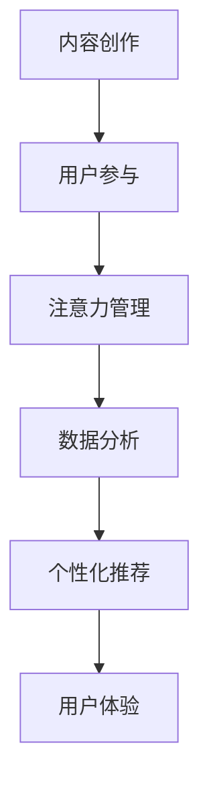

                 

## 1. 背景介绍

### 1.1 问题由来

随着数字媒体和互联网的飞速发展，内容创作已成为一个全新的经济领域。海量信息的涌现，使得注意力成为一种稀缺资源。如何在浩瀚的信息海洋中吸引并留住受众的注意力，成为内容创作者和运营者共同面对的挑战。

注意力经济的核心在于内容的价值创造和用户参与度的提升。通过内容，用户可以获取信息、表达观点、建立社交关系，甚至改变决策。对于内容创作者而言，如何利用技术手段，引导用户参与互动，构建深度关系，是获得长久收益的关键。

### 1.2 问题核心关键点

- **内容创作**：创作优质内容，吸引目标用户，是内容运营的基础。内容的形式多样，可以是文字、图片、视频、音频等。
- **用户参与**：通过互动和社交机制，激发用户参与度，构建用户社区，形成正向反馈循环。
- **注意力管理**：科学管理用户注意力，避免注意力分散，实现内容的有效传播。

## 2. 核心概念与联系

### 2.1 核心概念概述

为更好地理解注意力经济和内容创作的最佳实践，本节将介绍几个密切相关的核心概念：

- **内容创作**：创作具有吸引力和价值的内容，是吸引用户注意力的前提。内容可以是文字、图片、视频、音频等形式，但应具备独特性和创新性，以吸引目标受众。
- **用户参与**：通过互动和社交机制，如评论、点赞、分享、直播等，激发用户积极参与内容创作和传播，形成良性互动社区。
- **注意力管理**：通过算法和技术手段，对用户注意力进行科学管理，实现内容的精准分发和高效传播。
- **数据分析**：利用数据分析技术，如用户行为分析、内容效果评估等，不断优化内容创作和用户参与策略，提升运营效果。
- **个性化推荐**：根据用户兴趣和行为数据，推荐个性化的内容，提高用户粘性和满意度。
- **用户体验**：提升内容创作和消费的用户体验，包括界面设计、交互逻辑、加载速度等方面，增加用户参与度。

这些核心概念之间的逻辑关系可以通过以下Mermaid流程图来展示：



这个流程图展示了一系列概念之间的相互作用，说明内容创作、用户参与、注意力管理、数据分析、个性化推荐和用户体验相互依存、相互促进，共同推动注意力经济的发展。

## 3. 核心算法原理 & 具体操作步骤

### 3.1 算法原理概述

注意力经济和内容创作的最佳实践，本质上是利用数据和算法技术，科学管理用户注意力，提升内容传播效率和用户参与度。其核心算法包括：

- **推荐算法**：利用协同过滤、内容推荐、混合推荐等技术，为用户推荐感兴趣的内容，提高用户粘性。
- **社交网络算法**：通过社交图谱、好友推荐、话题聚合等算法，构建用户社区，促进用户互动和传播。
- **个性化算法**：结合用户兴趣、行为、属性等数据，定制个性化推荐方案，提升用户满意度和参与度。
- **算法优化**：采用A/B测试、在线学习、增量学习等技术，不断优化算法策略，提升运营效果。

### 3.2 算法步骤详解

基于注意力经济和内容创作的最佳实践，本节将详细讲解推荐算法和个性化算法的具体操作步骤。

#### 3.2.1 推荐算法

**Step 1: 数据收集与处理**
- 收集用户历史行为数据，如浏览记录、点击行为、点赞评论等。
- 收集内容元数据，如标题、标签、作者等。

**Step 2: 特征工程**
- 设计特征向量，包括用户特征、内容特征、时间特征等。
- 进行归一化、标准化等预处理，提高特征表达能力。

**Step 3: 模型训练**
- 选择推荐算法，如协同过滤、内容推荐、混合推荐等。
- 利用训练集数据，训练推荐模型。

**Step 4: 实时推荐**
- 将用户特征和实时行为输入推荐模型，生成个性化推荐结果。
- 将推荐结果展示给用户，进行点击率、转化率等指标评估。

#### 3.2.2 个性化算法

**Step 1: 用户画像构建**
- 收集用户基本信息、兴趣、行为等数据，构建用户画像。
- 利用聚类、分类等技术，细分用户群体。

**Step 2: 个性化模型训练**
- 结合用户画像和内容特征，训练个性化推荐模型。
- 选择适合模型，如深度学习模型、线性回归模型等。

**Step 3: 实时个性化推荐**
- 将用户画像和实时行为输入个性化模型，生成个性化推荐结果。
- 将推荐结果展示给用户，进行效果评估和迭代优化。

### 3.3 算法优缺点

注意力经济和内容创作的最佳实践，具有以下优点：
1. 提升用户粘性。通过个性化推荐和社交机制，提高用户参与度和满意度。
2. 提高内容传播效率。利用算法优化，实现内容的精准分发，提升内容的有效传播。
3. 数据驱动决策。通过数据分析，优化内容创作和用户运营策略，提高运营效果。

同时，这些算法也存在一定的局限性：
1. 数据依赖性高。算法效果依赖于高质量数据，数据稀疏或不完整会影响效果。
2. 模型复杂度高。复杂的推荐算法，如深度学习模型，需要较高的计算资源和时间。
3. 存在算法偏见。算法可能引入数据偏见，导致推荐结果有偏差。
4. 难以解释。复杂的推荐算法，如深度学习模型，其决策过程难以解释，缺乏透明度。

尽管存在这些局限性，但就目前而言，基于数据和算法的内容创作和运营，仍是提升用户参与度和内容传播效率的有效手段。未来相关研究应更多关注如何降低数据依赖，提高算法透明度和可解释性，以及引入更多外部知识，优化推荐效果。

### 3.4 算法应用领域

基于注意力经济和内容创作的最佳实践，可以在多个领域得到应用，例如：

- 社交媒体平台：如微信、微博、抖音等，通过推荐算法和社交网络算法，提升用户参与度和内容传播效率。
- 电子商务平台：如淘宝、京东、拼多多等，通过个性化推荐算法，提升用户购物体验和转化率。
- 新闻聚合平台：如今日头条、网易新闻等，通过推荐算法和内容创作，提升用户粘性和阅读量。
- 在线教育平台：如Coursera、Udacity等，通过个性化推荐和内容创作，提升用户学习体验和完成率。
- 音乐和视频平台：如网易云音乐、爱奇艺等，通过个性化推荐和内容创作，提升用户满意度和消费量。

除了上述这些经典应用外，基于推荐算法和个性化算法的技术，还将在更多领域得到应用，如金融、医疗、旅游等，为相关行业带来变革性影响。

## 4. 数学模型和公式 & 详细讲解

### 4.1 数学模型构建

本节将使用数学语言对注意力经济和内容创作的推荐算法和个性化算法进行更加严格的刻画。

记用户集合为 $U$，内容集合为 $I$，用户行为为 $B$，推荐模型为 $M$。假设用户对内容的评分 $R_{ui}$ 可以表示为用户特征 $u$ 和内容特征 $i$ 的函数：

$$
R_{ui} = f(u, i)
$$

其中 $f$ 为评分函数，可以通过机器学习模型（如线性回归、神经网络等）进行学习。

### 4.2 公式推导过程

以下我们以协同过滤算法为例，推导推荐公式的计算过程。

协同过滤算法基于用户和内容的相似性进行推荐。假设用户 $u$ 和内容 $i$ 的相似度为 $s_{ui}$，则推荐结果 $R_{ui}$ 可以表示为：

$$
R_{ui} = \sum_{i'} s_{ii'} R_{i'u}
$$

其中 $i'$ 为内容集合中除 $i$ 外的任意内容。

利用上述公式，可以计算用户 $u$ 对内容 $i$ 的预测评分，从而进行推荐。

### 4.3 案例分析与讲解

在实际应用中，协同过滤算法和个性化算法往往需要进行优化和组合。以下以网易云音乐为例，展示这些算法的应用。

网易云音乐的推荐系统主要基于协同过滤和个性化推荐两种算法。协同过滤算法基于用户的历史听歌记录和喜好，推荐相似用户喜欢的歌曲。个性化推荐算法结合用户画像和内容特征，推荐用户可能感兴趣的歌曲。两种算法结合使用，提高了推荐效果和用户满意度。

## 5. 项目实践：代码实例和详细解释说明

### 5.1 开发环境搭建

在进行内容创作和推荐实践前，我们需要准备好开发环境。以下是使用Python进行Spark开发的环境配置流程：

1. 安装Anaconda：从官网下载并安装Anaconda，用于创建独立的Python环境。

2. 创建并激活虚拟环境：
```bash
conda create -n py spark python=3.8 
conda activate py spark
```

3. 安装Spark：根据CUDA版本，从官网获取对应的安装命令。例如：
```bash
conda install pytorch torchvision torchaudio cudatoolkit=11.1 -c pytorch -c conda-forge
```

4. 安装PyTorch：从官网获取对应的安装命令。例如：
```bash
pip install torch torchvision torchaudio
```

5. 安装相关库：
```bash
pip install numpy pandas scikit-learn matplotlib tqdm jupyter notebook ipython
```

完成上述步骤后，即可在`py spark`环境中开始内容创作和推荐实践。

### 5.2 源代码详细实现

这里我们以推荐算法为例，给出使用Spark进行个性化推荐系统的PySpark代码实现。

首先，定义推荐系统的输入数据：

```python
from pyspark.sql import SparkSession
from pyspark.sql.functions import col, when, sum
from pyspark.mllib.recommendation import ALS

spark = SparkSession.builder.appName('recommendation_system').getOrCreate()

# 读取用户行为数据
user_behavior = spark.read.format('csv').option('header', 'true').load('user_behavior.csv')

# 定义特征工程函数
def feature_engineering(df):
    return df.select(
        col('user_id').alias('user'),
        col('item_id').alias('item'),
        col('rating').alias('rating'),
        col('timestamp').alias('timestamp')
    )

# 对用户行为数据进行特征工程
user_behavior = user_behavior.map(lambda r: (r.user, r.item, r.rating, r.timestamp))

# 构建协同过滤模型
als = ALS(k=50, iterations=10, alpha=0.01, regParam=0.1, rank=50)
ratings = als.fit(user_behavior.rdd)
ratings.saveAsTextFile('ratings_model')
```

然后，定义推荐算法：

```python
# 加载协同过滤模型
als = ALSModel.load('ratings_model')

# 推荐新用户对新内容评分
def predict_ratings(user, item):
    return als.predictAll(user, item)

# 输出推荐结果
def output_recommendations(user, item):
    recommendations = predict_ratings(user, item)
    for recommendation in recommendations:
        print('User {} recommended item {} with rating {}'.format(user, recommendation.item, recommendation.rating))

# 推荐新用户对新内容的评分
new_user = 'user123'
new_item = 'item456'
output_recommendations(new_user, new_item)
```

### 5.3 代码解读与分析

让我们再详细解读一下关键代码的实现细节：

**特征工程函数**：
- 定义了一个特征工程函数，用于将用户行为数据转换为机器学习模型所需的格式。

**用户行为数据读取**：
- 使用Spark读取用户行为数据，并将其转换为RDD格式。

**协同过滤模型训练**：
- 定义协同过滤模型，包括模型参数和训练次数。
- 使用训练数据对协同过滤模型进行训练。

**协同过滤模型预测**：
- 使用训练好的协同过滤模型，对新用户和内容的评分进行预测。
- 定义一个函数，输出推荐结果。

**推荐结果展示**：
- 通过函数调用，展示推荐结果。

可以看到，使用Spark进行内容推荐，代码实现相对简洁高效。开发者可以将更多精力放在特征工程和模型优化上，而不必过多关注底层的实现细节。

当然，工业级的系统实现还需考虑更多因素，如数据存储和处理、模型监控、超参数调优等。但核心的推荐范式基本与此类似。

## 6. 实际应用场景

### 6.1 社交媒体平台

基于个性化推荐和社交网络算法的内容创作和运营，可以广泛应用于社交媒体平台的构建。社交媒体平台通过推荐算法和社交网络算法，推荐用户感兴趣的内容，同时利用社交机制，促进用户互动和传播。

在技术实现上，可以收集用户历史行为数据，构建用户画像，结合内容特征，使用协同过滤算法或深度学习模型进行推荐。通过社交网络算法，如好友推荐、话题聚合等，构建用户社区，促进用户互动和传播。

### 6.2 电子商务平台

电子商务平台利用个性化推荐算法，提升用户购物体验和转化率。通过收集用户历史购物数据、浏览数据、点击数据等，构建用户画像，结合商品特征，使用协同过滤算法或深度学习模型进行个性化推荐。

在技术实现上，可以使用Spark等大数据平台进行数据处理和模型训练。通过推荐算法，为用户推荐可能感兴趣的商品，提升用户体验和购物转化率。

### 6.3 新闻聚合平台

新闻聚合平台利用推荐算法和内容创作，提升用户粘性和阅读量。通过收集用户历史阅读数据、点赞评论数据等，构建用户画像，结合新闻内容特征，使用协同过滤算法或深度学习模型进行推荐。

在技术实现上，可以使用Hadoop等大数据平台进行数据处理和模型训练。通过推荐算法，为用户推荐感兴趣的新闻内容，提升用户粘性和阅读量。

### 6.4 在线教育平台

在线教育平台利用个性化推荐和内容创作，提升用户学习体验和完成率。通过收集用户历史学习数据、作业数据、测试数据等，构建用户画像，结合课程内容特征，使用协同过滤算法或深度学习模型进行个性化推荐。

在技术实现上，可以使用Spark等大数据平台进行数据处理和模型训练。通过推荐算法，为用户推荐可能感兴趣的课程，提升用户学习体验和完成率。

### 6.5 音乐和视频平台

音乐和视频平台利用个性化推荐和内容创作，提升用户满意度和消费量。通过收集用户历史听歌/观看数据、点赞评论数据等，构建用户画像，结合音乐/视频内容特征，使用协同过滤算法或深度学习模型进行个性化推荐。

在技术实现上，可以使用Spark等大数据平台进行数据处理和模型训练。通过推荐算法，为用户推荐可能感兴趣的音频/视频内容，提升用户满意度和消费量。

## 7. 工具和资源推荐

### 7.1 学习资源推荐

为了帮助开发者系统掌握内容创作和推荐算法的理论基础和实践技巧，这里推荐一些优质的学习资源：

1. 《推荐系统实战》系列博文：由推荐系统专家撰写，深入浅出地介绍了推荐系统的原理、算法和实践。

2. 《深度学习》课程：斯坦福大学开设的深度学习课程，涵盖深度学习的基础理论和经典模型，是推荐系统的必学内容。

3. 《推荐系统：算法与实现》书籍：系统介绍了推荐系统的主要算法和实现技术，适合深入学习推荐算法。

4. Weights & Biases：推荐系统的实验跟踪工具，可以记录和可视化模型训练过程中的各项指标，方便对比和调优。

5. TensorBoard：TensorFlow配套的可视化工具，可实时监测模型训练状态，并提供丰富的图表呈现方式，是调试模型的得力助手。

通过对这些资源的学习实践，相信你一定能够快速掌握内容创作和推荐算法的精髓，并用于解决实际的运营问题。

### 7.2 开发工具推荐

高效的开发离不开优秀的工具支持。以下是几款用于内容创作和推荐开发的常用工具：

1. Spark：基于Hadoop的分布式计算框架，适合大规模数据处理和模型训练。

2. TensorFlow：由Google主导开发的深度学习框架，生产部署方便，适合大规模工程应用。

3. PyTorch：基于Python的开源深度学习框架，灵活动态的计算图，适合快速迭代研究。

4. Hadoop：Apache基金会开源的大数据处理框架，适合大规模数据存储和处理。

5. Elasticsearch：基于Apache Lucene的搜索引擎，适合大规模文本数据的存储和检索。

6. Weights & Biases：推荐系统的实验跟踪工具，可以记录和可视化模型训练过程中的各项指标，方便对比和调优。

合理利用这些工具，可以显著提升内容创作和推荐任务的开发效率，加快创新迭代的步伐。

### 7.3 相关论文推荐

内容创作和推荐技术的发展源于学界的持续研究。以下是几篇奠基性的相关论文，推荐阅读：

1. Recommender Systems Handbbook：推荐系统领域的经典教材，涵盖了推荐系统的各种算法和实现技术。

2. The BellKor 2010 Recommendation Challenge：KDD会议上的推荐系统竞赛，展示了多种推荐算法在实际应用中的效果。

3. A Survey of Recommender Systems：推荐系统领域的综述论文，总结了推荐系统的主要算法和技术。

4. Hedonic Experience: A Comparative Review of Recommender System Evaluation：关于推荐系统效果评估的综述论文，提供了各种评价指标和方法。

5. Multi-Aspect Rating Prediction from Tag Data：基于标签数据的推荐系统论文，提出了一种新的推荐方法，提升了推荐效果。

这些论文代表了大规模推荐系统的发展脉络。通过学习这些前沿成果，可以帮助研究者把握学科前进方向，激发更多的创新灵感。

## 8. 总结：未来发展趋势与挑战

### 8.1 总结

本文对基于数据和算法的内容创作和推荐实践进行了全面系统的介绍。首先阐述了内容创作和推荐算法的研究背景和意义，明确了推荐算法和个性化算法在提升用户粘性和传播效率方面的独特价值。其次，从原理到实践，详细讲解了推荐算法和个性化算法的数学模型和操作步骤，给出了推荐任务开发的完整代码实例。同时，本文还广泛探讨了推荐算法在社交媒体、电子商务、新闻聚合、在线教育、音乐视频等多个领域的应用前景，展示了推荐范式的巨大潜力。此外，本文精选了推荐技术的各类学习资源，力求为读者提供全方位的技术指引。

通过本文的系统梳理，可以看到，基于数据和算法的内容创作和运营，正在成为提升用户粘性和内容传播效率的有效手段。推荐算法和个性化算法，以其科学性和高效性，成为内容创作和运营的重要支撑。未来，伴随推荐算法的持续演进，推荐技术必将引领内容产业的深度变革，为更多行业带来创新价值。

### 8.2 未来发展趋势

展望未来，内容创作和推荐技术将呈现以下几个发展趋势：

1. 推荐算法多样化。除了传统的协同过滤和深度学习算法，未来将涌现更多高效的推荐算法，如标签推荐、混合推荐等。

2. 推荐系统普及化。随着推荐算法在各个行业的应用普及，推荐技术将逐步成为互联网服务的标配，为用户带来更个性化、更满意的体验。

3. 数据驱动决策。利用大数据和人工智能技术，实时分析和优化推荐策略，提升推荐效果。

4. 推荐系统生态化。构建生态化的推荐系统，融合各种数据源和算法，实现更全面、更准确的内容推荐。

5. 推荐系统智能化。结合自然语言处理、图像识别、语音识别等技术，提升推荐系统的智能水平，实现更精准、更自然的内容推荐。

6. 推荐系统公平化。关注推荐系统的公平性，避免算法偏见，提升推荐系统的公正性和可信度。

以上趋势凸显了内容创作和推荐技术的广阔前景。这些方向的探索发展，必将进一步提升内容传播效率和用户粘性，为内容产业带来深远影响。

### 8.3 面临的挑战

尽管推荐算法和个性化算法已经取得了瞩目成就，但在迈向更加智能化、普适化应用的过程中，仍面临诸多挑战：

1. 数据质量和完整性问题。推荐算法依赖于高质量的数据，数据稀疏、不完整或不准确会影响推荐效果。

2. 算法复杂度问题。复杂的推荐算法，如深度学习模型，需要较高的计算资源和时间。

3. 算法公平性问题。推荐算法可能引入数据偏见，导致推荐结果有偏差。

4. 用户隐私问题。推荐算法需要收集用户行为数据，涉及用户隐私保护，需采取相应的技术手段和安全措施。

5. 推荐结果的可解释性问题。复杂的推荐算法，如深度学习模型，其决策过程难以解释，缺乏透明度。

6. 推荐系统的稳定性问题。推荐系统需具备较高的稳定性和鲁棒性，应对各种异常情况。

正视推荐系统面临的这些挑战，积极应对并寻求突破，将是大数据和人工智能技术走向成熟的必由之路。相信随着学界和产业界的共同努力，这些挑战终将一一被克服，推荐技术必将在内容产业中发挥更大的作用。

### 8.4 研究展望

面对推荐系统面临的种种挑战，未来的研究需要在以下几个方面寻求新的突破：

1. 探索无监督和半监督推荐方法。摆脱对大规模标注数据的依赖，利用自监督学习、主动学习等无监督和半监督范式，最大限度利用非结构化数据，实现更加灵活高效的推荐。

2. 研究参数高效和计算高效的推荐范式。开发更加参数高效的推荐方法，在固定大部分预训练参数的同时，只更新极少量的任务相关参数。同时优化推荐模型的计算图，减少前向传播和反向传播的资源消耗，实现更加轻量级、实时性的部署。

3. 融合因果和对比学习范式。通过引入因果推断和对比学习思想，增强推荐系统建立稳定因果关系的能力，学习更加普适、鲁棒的内容推荐模型。

4. 引入更多先验知识。将符号化的先验知识，如知识图谱、逻辑规则等，与神经网络模型进行巧妙融合，引导推荐系统学习更准确、合理的推荐模型。同时加强不同模态数据的整合，实现视觉、语音等多模态信息与文本信息的协同建模。

5. 结合因果分析和博弈论工具。将因果分析方法引入推荐系统，识别出系统决策的关键特征，增强推荐系统的可解释性和逻辑性。借助博弈论工具刻画人机交互过程，主动探索并规避推荐系统的脆弱点，提高系统稳定性。

6. 纳入伦理道德约束。在推荐系统训练目标中引入伦理导向的评估指标，过滤和惩罚有偏见、有害的推荐结果。同时加强人工干预和审核，建立推荐系统的监管机制，确保推荐结果符合人类价值观和伦理道德。

这些研究方向的探索，必将引领推荐系统技术迈向更高的台阶，为构建安全、可靠、可解释、可控的推荐系统铺平道路。面向未来，推荐系统技术还需要与其他人工智能技术进行更深入的融合，如知识表示、因果推理、强化学习等，多路径协同发力，共同推动内容创作和运营系统的进步。只有勇于创新、敢于突破，才能不断拓展推荐系统的边界，让内容创作和运营技术更好地服务于人类社会。

## 9. 附录：常见问题与解答

**Q1: 什么是内容创作和推荐算法？**

A: 内容创作和推荐算法是指通过数据和算法技术，对用户行为和内容特征进行分析，为用户提供个性化的内容推荐，提高用户参与度和满意度，同时提升内容传播效率的技术。内容创作算法主要用于生成优质内容，吸引用户注意；推荐算法则根据用户行为和内容特征，为用户推荐感兴趣的内容，提高用户粘性。

**Q2: 如何提升推荐算法的准确性？**

A: 提升推荐算法准确性需要从多个方面入手：
1. 数据质量：收集高质量、完整的数据，减少数据噪声和偏差。
2. 特征工程：设计有效的特征向量，提高特征表达能力。
3. 模型选择：选择适合的推荐算法，如协同过滤、内容推荐、混合推荐等。
4. 模型优化：使用机器学习技术，不断优化推荐模型。
5. 实时更新：定期更新模型参数，适应用户兴趣的变化。

**Q3: 推荐算法和个性化算法有什么区别？**

A: 推荐算法和个性化算法是推荐系统的两个重要组成部分，主要区别在于：
1. 推荐算法：基于用户行为和内容特征，为用户推荐感兴趣的内容，提高用户粘性和满意度。常见算法包括协同过滤、内容推荐、混合推荐等。
2. 个性化算法：结合用户画像和内容特征，定制个性化推荐方案，提升用户满意度和参与度。常见算法包括深度学习模型、线性回归模型等。

**Q4: 推荐算法和社交算法有什么区别？**

A: 推荐算法和社交算法是内容运营的两个重要组成部分，主要区别在于：
1. 推荐算法：通过算法技术，为用户推荐感兴趣的内容，提高用户粘性和满意度。常见算法包括协同过滤、内容推荐、混合推荐等。
2. 社交算法：利用社交图谱、好友推荐、话题聚合等算法，构建用户社区，促进用户互动和传播。常见算法包括好友推荐、话题聚合等。

**Q5: 如何提高推荐算法的鲁棒性？**

A: 提高推荐算法的鲁棒性需要从多个方面入手：
1. 数据多样化：收集多样化的数据，减少数据偏差和噪声。
2. 模型健壮性：选择健壮的推荐算法，如协同过滤、深度学习模型等。
3. 算法公平性：关注推荐算法的公平性，避免算法偏见。
4. 实时更新：定期更新模型参数，适应用户兴趣的变化。
5. 用户隐私：加强用户隐私保护，避免数据泄露和滥用。

这些建议可以帮助开发者提高推荐算法的鲁棒性和可靠性，提升推荐系统的用户体验和运营效果。

---

作者：禅与计算机程序设计艺术 / Zen and the Art of Computer Programming

