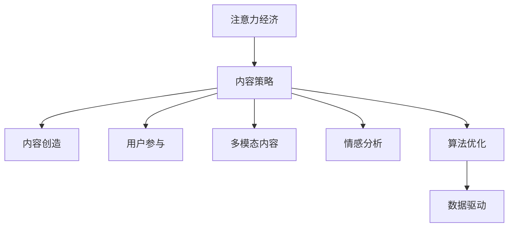

                 

# 注意力经济与内容策略规划与实践：为受众创建有影响力的内容

> 关键词：注意力经济,内容策略,内容创造,影响力,用户参与,多模态内容,情感分析,算法优化,数据驱动

## 1. 背景介绍

### 1.1 问题由来

随着互联网技术的飞速发展，信息传播的方式和途径日益多样化，用户注意力资源也变得更加分散和宝贵。在注意力经济时代，如何吸引和保持用户注意力，成为内容创作者和平台运营商的首要挑战。近年来，各大社交媒体平台纷纷采用智能算法推荐系统，试图通过精准的内容推荐，增强用户的参与度和黏性。但智能推荐系统在提升用户满意度的同时，也引发了对内容质量、版权保护、信息过滤等方面的关注和反思。

本文聚焦于内容策略规划与实践，通过引入注意力经济的概念，探讨如何从内容创作的源头出发，创造具有高影响力的内容，吸引更多用户关注和互动，同时保障内容的原创性和质量。文章将首先介绍注意力经济的基本原理，并从内容策略的角度出发，提出几种常见的内容类型及其特点。然后，结合内容创造的多模态特性，分析用户参与行为的影响因素，提出相应的内容优化策略。最后，通过实例展示基于算法的智能推荐系统如何辅助内容创作者进行精准的内容传播和用户互动，进一步提升内容的覆盖率和影响力。

## 2. 核心概念与联系

### 2.1 核心概念概述

为更好地理解注意力经济与内容策略规划，本节将介绍几个密切相关的核心概念：

- 注意力经济(Attention Economy)：指在信息过载的环境下，用户注意力资源成为一种稀缺资源的经济形态。通过创造有吸引力的内容，吸引用户关注，从而创造商业价值。
- 内容策略(Content Strategy)：指通过科学规划内容创作和传播的路径，最大化内容的覆盖面、影响力及商业价值。
- 内容创造(Content Creation)：指根据目标受众的需求和兴趣，结合自身资源和能力，创造符合用户期望的内容形式和内容。
- 内容类型(Content Types)：指根据目标受众的偏好和平台特性，设计多样化的内容形式，如图文、视频、音频、直播等。
- 用户参与(User Engagement)：指通过与用户互动，增加内容的曝光度和参与度。包括点赞、评论、转发、分享等行为。
- 多模态内容(Multimodal Content)：指结合文本、图片、音频、视频等多种媒体形式的复合型内容，以丰富用户体验。
- 情感分析(Sentiment Analysis)：指通过分析用户对内容的情感反馈，优化内容质量和传播策略。
- 算法优化(Algorithm Optimization)：指通过优化推荐算法，提升内容推荐的精准度和覆盖率，提高用户满意度和平台活跃度。
- 数据驱动(Data-Driven)：指利用数据分析工具和技术，指导内容策略的制定和优化，提升内容的影响力和商业价值。

这些核心概念之间的逻辑关系可以通过以下Mermaid流程图来展示：



这个流程图展示了几大核心概念之间的联系：

1. 注意力经济通过吸引用户关注，为内容策略提供基础。
2. 内容策略指导内容创造和传播，提升内容的曝光度和影响力。
3. 内容创造和用户参与通过多模态内容表达，丰富用户体验。
4. 情感分析通过用户反馈优化内容质量和传播策略。
5. 算法优化和数据驱动进一步提升内容推荐的精准度和效果。

这些概念共同构成了内容策略规划与实践的框架，帮助创作者和平台运营商打造有影响力的内容生态。

## 3. 核心算法原理 & 具体操作步骤

### 3.1 算法原理概述

基于注意力经济的内容策略规划与实践，本质上是一个综合性的数据分析和内容优化过程。其核心思想是：通过分析用户的注意力分布和行为模式，科学规划内容创作和传播路径，最大化内容的覆盖面和影响力，同时保障内容的原创性和质量。

形式化地，假设目标用户集为 $U$，内容集为 $C$，用户对内容的参与度为 $E$。内容策略的优化目标为：

$$
\max_{\theta} \sum_{u \in U} \sum_{c \in C} w_{u,c} \times E_{u,c}(\theta)
$$

其中，$w_{u,c}$ 为用户对内容 $c$ 的权重，$E_{u,c}(\theta)$ 为模型在参数 $\theta$ 下的预测参与度。通过优化权重 $w_{u,c}$ 和参与度模型 $E_{u,c}(\theta)$，可以实现对内容的有效筛选和推荐。

### 3.2 算法步骤详解

基于注意力经济的内容策略规划与实践，一般包括以下几个关键步骤：

**Step 1: 数据收集与预处理**
- 收集目标用户群体的行为数据，如浏览记录、点赞记录、评论记录等。
- 对数据进行清洗和标注，去除噪音和异常值，生成可用的训练数据集。
- 将文本、图片、音频、视频等不同形式的内容进行多模态数据融合，生成统一的数据格式。

**Step 2: 用户画像构建**
- 基于用户行为数据，构建用户画像，包括用户的兴趣、偏好、消费行为等。
- 使用聚类算法（如K-means、LDA等）对用户进行分类，识别出不同类型用户群体的特征。
- 通过分析用户画像，挖掘潜在的用户需求和内容缺口。

**Step 3: 内容创作与优化**
- 根据用户画像和需求，创作符合用户期望的内容。
- 使用情感分析、情感计算等技术，评估内容的情感倾向和用户反馈。
- 结合多模态数据，设计具有吸引力的内容形式，如融合文本、图片、视频等，丰富用户体验。
- 通过A/B测试等方法，不断优化内容的呈现方式和内容策略。

**Step 4: 内容推荐与分发**
- 将内容上传至平台，使用智能推荐算法（如协同过滤、基于深度学习的推荐系统等）进行内容推荐。
- 对推荐结果进行可视化展示，结合用户反馈进行动态调整。
- 利用多渠道分发机制，通过社交媒体、邮件、推送等方式，扩大内容的覆盖面。

**Step 5: 效果评估与优化**
- 对内容推荐效果进行评估，如点击率、阅读量、互动率等指标。
- 分析用户反馈和行为数据，评估内容的吸引力和满意度。
- 根据评估结果，不断优化内容策略和推荐算法，提升内容的影响力和用户参与度。

### 3.3 算法优缺点

基于注意力经济的内容策略规划与实践，具有以下优点：

- 提高内容传播效果：通过分析用户行为和兴趣，科学规划内容创作和传播路径，最大化内容的曝光度和影响力。
- 提升用户体验：结合多模态数据，设计丰富的内容形式，增加用户的参与度和黏性。
- 精准定位用户需求：通过用户画像构建和数据分析，精准识别用户需求和内容缺口，创造更符合用户期望的内容。
- 增强内容原创性和质量：通过情感分析和内容优化，提升内容的情感表达和吸引力，保障内容的原创性和质量。

同时，该方法也存在一定的局限性：

- 数据依赖性强：需要大量用户行为数据进行分析和训练，数据获取成本较高。
- 算法复杂度高：需要综合多种数据源和算法模型，算法实现和调试较为复杂。
- 内容同质化风险：过度依赖智能推荐系统，可能导致内容的同质化问题。
- 用户隐私问题：大规模数据收集和分析可能涉及用户隐私问题，需严格遵守相关法规和规范。

尽管存在这些局限性，但就目前而言，基于注意力经济的内容策略规划与实践方法仍然是最主流的范式之一。未来相关研究的重点在于如何进一步降低数据依赖，提高算法的准确性和效率，同时兼顾内容的原创性和多样性。

### 3.4 算法应用领域

基于注意力经济的内容策略规划与实践方法，已经在新闻媒体、社交媒体、电商平台等多个领域得到广泛应用，帮助内容创作者和平台运营商提升内容的传播效果和用户参与度。以下是几个典型应用场景：

- **新闻媒体**：通过分析用户的阅读记录和互动行为，优化新闻选题和内容形式，提升文章的点击率和阅读量。
- **社交媒体**：利用用户画像和情感分析，精准推荐用户感兴趣的内容，增加用户的停留时间和互动频率。
- **电商平台**：通过推荐系统，提高商品的曝光度和销售量，增强用户购物体验。
- **在线教育**：通过智能推荐，为用户推荐个性化的学习内容，提升学习效果和平台黏性。
- **健康医疗**：通过分析患者的健康数据和行为记录，推荐合适的医疗内容，增强患者的健康意识和参与度。

除了上述这些经典应用外，内容策略规划与实践还不断拓展到更多领域，如金融、旅游、文化等，为各行各业的内容传播和用户互动带来了新的机遇和挑战。

## 4. 数学模型和公式 & 详细讲解 & 举例说明

### 4.1 数学模型构建

本节将使用数学语言对基于注意力经济的内容策略规划与实践过程进行更加严格的刻画。

假设用户集为 $U$，内容集为 $C$，用户对内容的参与度为 $E$，参与度模型为 $E_{u,c}(\theta)$，用户画像为 $P_u$，内容特征为 $F_c$。内容策略的优化目标为：

$$
\max_{\theta} \sum_{u \in U} \sum_{c \in C} w_{u,c} \times E_{u,c}(\theta)
$$

其中，$w_{u,c}$ 为用户对内容 $c$ 的权重，$E_{u,c}(\theta)$ 为模型在参数 $\theta$ 下的预测参与度。参与度模型 $E_{u,c}(\theta)$ 可定义为：

$$
E_{u,c}(\theta) = f(P_u, F_c, \theta)
$$

其中，$f$ 为参与度计算函数，$P_u$ 为用户画像特征向量，$F_c$ 为内容特征向量，$\theta$ 为模型参数。

### 4.2 公式推导过程

以下我们以用户对内容点击率的预测为例，推导参与度计算公式。

假设用户 $u$ 对内容 $c$ 的点击行为用二元变量 $Y_{u,c}$ 表示，定义为：

$$
Y_{u,c} = 
\begin{cases} 
1, & \text{用户点击了内容 } c \\
0, & \text{用户未点击内容 } c 
\end{cases}
$$

根据逻辑回归模型，用户点击行为的预测函数为：

$$
\hat{Y}_{u,c} = \sigma(\eta_{u,c})
$$

其中，$\sigma$ 为逻辑函数，$\eta_{u,c} = \theta^T (P_u \otimes F_c)$ 为线性判别函数，$P_u \otimes F_c$ 为用户画像特征向量和内容特征向量的向量点乘，$\theta$ 为模型参数。

用户点击行为的逻辑回归损失函数为：

$$
L(Y_{u,c}, \hat{Y}_{u,c}) = -[Y_{u,c} \log \hat{Y}_{u,c} + (1-Y_{u,c}) \log (1-\hat{Y}_{u,c})]
$$

通过反向传播算法，计算模型参数 $\theta$ 的梯度，并更新参数。重复上述过程，直至收敛。

### 4.3 案例分析与讲解

我们以社交媒体平台为例，分析用户对内容的参与度计算公式。假设用户 $u$ 对内容 $c$ 的点赞、评论、转发等行为，通过逻辑回归模型进行预测。其参与度模型 $E_{u,c}(\theta)$ 可定义为：

$$
E_{u,c}(\theta) = \log(Y_{u,c} + 1) / \log(Y_{u,c} + 2)
$$

其中，$Y_{u,c}$ 为用户对内容 $c$ 的点赞、评论、转发等行为。$E_{u,c}(\theta)$ 为模型在参数 $\theta$ 下的预测参与度。通过上述公式，可以计算用户对内容的综合参与度，并根据参与度进行内容的推荐和优化。

## 5. 项目实践：代码实例和详细解释说明

### 5.1 开发环境搭建

在进行内容策略规划与实践前，我们需要准备好开发环境。以下是使用Python进行TensorFlow开发的环境配置流程：

1. 安装Anaconda：从官网下载并安装Anaconda，用于创建独立的Python环境。

2. 创建并激活虚拟环境：
```bash
conda create -n content-env python=3.8 
conda activate content-env
```

3. 安装TensorFlow：根据CUDA版本，从官网获取对应的安装命令。例如：
```bash
conda install tensorflow tensorflow-gpu=2.7.0 -c pytorch -c conda-forge
```

4. 安装各类工具包：
```bash
pip install numpy pandas scikit-learn matplotlib tqdm jupyter notebook ipython
```

完成上述步骤后，即可在`content-env`环境中开始内容策略规划与实践。

### 5.2 源代码详细实现

下面我们以社交媒体平台的点赞行为预测为例，给出使用TensorFlow进行内容策略规划的PyTorch代码实现。

首先，定义数据处理函数：

```python
import tensorflow as tf
from tensorflow.keras.layers import Input, Dense, Embedding, Concatenate, Flatten
from tensorflow.keras.models import Model
from tensorflow.keras.preprocessing.text import Tokenizer
from tensorflow.keras.preprocessing.sequence import pad_sequences

def build_model(input_shape, num_users, num_contents, embedding_dim=100, hidden_dim=128):
    user_input = Input(shape=(1,), name='user')
    content_input = Input(shape=(1,), name='content')
    user_embedding = Embedding(num_users, embedding_dim, name='user_embedding')(user_input)
    content_embedding = Embedding(num_contents, embedding_dim, name='content_embedding')(content_input)
    user_content = Concatenate()([user_embedding, content_embedding])
    hidden = Dense(hidden_dim, activation='relu')(user_content)
    predictions = Dense(1, activation='sigmoid')(hidden)
    return Model(inputs=[user_input, content_input], outputs=predictions)
```

然后，定义数据生成器和模型训练函数：

```python
# 假设用户行为数据为numpy数组，格式为[用户id, 内容id, 点赞行为]
data = np.random.randint(0, num_users, size=(1000, 3))

def data_generator(data, batch_size=32):
    while True:
        shuffled_data = np.random.permutation(data)
        for i in range(0, len(shuffled_data), batch_size):
            x = shuffled_data[i:i+batch_size, :2]  # 用户id, 内容id
            y = shuffled_data[i:i+batch_size, 2]   # 点赞行为
            yield pad_sequences(x, maxlen=1), tf.expand_dims(y, -1)

model = build_model((num_users, num_contents), num_users, num_contents)
model.compile(optimizer='adam', loss='binary_crossentropy', metrics=['accuracy'])
```

最后，启动模型训练流程：

```python
model.fit_generator(data_generator(data, batch_size=32), steps_per_epoch=len(data) // batch_size, epochs=10)
```

以上就是使用TensorFlow对社交媒体平台点赞行为预测模型的代码实现。可以看到，TensorFlow提供的高级API使得模型构建和训练过程更加便捷高效。

### 5.3 代码解读与分析

让我们再详细解读一下关键代码的实现细节：

**build_model函数**：
- 定义了用户和内容的输入层，使用Embedding层将用户和内容的id映射为向量表示。
- 使用Concatenate层将用户和内容的嵌入向量拼接，作为多模态数据的融合。
- 通过一个隐藏层进行特征提取，最后使用逻辑回归层输出预测结果。

**data_generator函数**：
- 使用numpy生成随机用户行为数据。
- 对数据进行随机打乱和分批次处理，供模型训练使用。

**模型训练函数**：
- 调用TensorFlow的fit_generator函数进行模型训练。
- 指定训练数据生成器、批次大小、迭代轮数等参数，进行模型训练。

**训练流程**：
- 通过数据生成器，按批次对模型进行训练。
- 每个批次输入用户id和内容id，输出预测结果。
- 使用交叉熵损失函数计算模型预测与真实标签的误差。
- 通过反向传播算法，更新模型参数。
- 重复上述过程，直至模型收敛。

通过上述代码实现，可以明显看到TensorFlow的易用性和高效性，尤其在构建和训练多模态模型方面表现出色。

## 6. 实际应用场景

### 6.1 智能媒体推荐

基于注意力经济的内容策略规划与实践方法，在智能媒体推荐领域得到了广泛应用。例如，新闻聚合平台通过分析用户的历史阅读记录和互动行为，智能推荐用户感兴趣的新闻内容，提高文章的点击率和阅读量。

在技术实现上，可以通过构建用户画像和内容画像，使用逻辑回归、深度学习等模型进行内容推荐。例如，使用用户点击行为和内容特征向量，构建推荐模型，预测用户对不同内容的兴趣程度，从而实现精准的内容推荐。

### 6.2 社交媒体内容运营

社交媒体平台通过基于注意力经济的内容策略规划，优化用户内容的生产和传播路径，增加用户的参与度和黏性。例如，Twitter通过分析用户的点赞、评论、转发等行为，智能推荐用户感兴趣的内容，增加用户的活跃度和互动频率。

在技术实现上，可以收集用户的点赞、评论、转发等行为数据，构建用户画像和内容画像。使用协同过滤、深度学习等算法，预测用户对内容的兴趣程度，并结合情感分析等技术，优化内容创作和传播策略。

### 6.3 电商平台个性化推荐

电商平台通过基于注意力经济的内容策略规划，提高商品的曝光度和销售量，增强用户购物体验。例如，亚马逊通过分析用户的浏览记录和购买行为，推荐用户感兴趣的商品，提高用户的购买转化率。

在技术实现上，可以通过构建用户画像和商品画像，使用协同过滤、深度学习等算法进行商品推荐。例如，使用用户浏览记录和商品特征向量，构建推荐模型，预测用户对不同商品的兴趣程度，从而实现精准的商品推荐。

### 6.4 未来应用展望

随着内容策略规划与实践的不断演进，未来将在更多领域得到应用，为各行各业的内容传播和用户互动带来新的机遇和挑战。

在智慧城市治理中，内容策略规划与实践可以用于优化公共信息发布和互动，提升市民对政策、服务的理解和参与度。例如，通过分析市民的查询记录和反馈行为，智能推荐相关政策信息和便民服务，增强市民的获得感和满意度。

在在线教育领域，内容策略规划与实践可以用于优化课程推荐和学生互动，提升学习效果和平台黏性。例如，通过分析学生的学习行为和兴趣，智能推荐适合的课程和学习资源，增加学生的参与度和学习效率。

在金融领域，内容策略规划与实践可以用于优化金融产品推荐和用户互动，提升用户体验和平台黏性。例如，通过分析用户的投资记录和行为，智能推荐适合的金融产品和理财方案，增加用户的参与度和投资收益。

除此之外，内容策略规划与实践还将进一步拓展到更多领域，如文化、旅游、健康等，为各行各业的内容传播和用户互动带来新的机遇和挑战。

## 7. 工具和资源推荐

### 7.1 学习资源推荐

为了帮助开发者系统掌握内容策略规划与实践的理论基础和实践技巧，这里推荐一些优质的学习资源：

1. 《注意力机制与深度学习》系列博文：由深度学习专家撰写，深入浅出地介绍了注意力机制的基本原理及其在NLP、计算机视觉等领域的应用。

2. 《深度学习入门：基于TensorFlow》书籍：介绍TensorFlow的基本概念和使用方法，适合初学者快速上手深度学习项目。

3. 《内容策略与用户体验设计》课程：斯坦福大学开设的内容策略和用户体验设计课程，涵盖内容策略规划、用户行为分析、交互设计等主题。

4. 《多模态内容分析与推荐》书籍：介绍多模态内容分析与推荐的基本方法和实际应用，适合研究人员和开发者参考学习。

5. 《情感计算与社交媒体分析》课程：清华大学开设的情感计算与社交媒体分析课程，涵盖情感分析、情感计算等主题。

通过对这些资源的学习实践，相信你一定能够快速掌握内容策略规划与实践的精髓，并用于解决实际的NLP问题。

### 7.2 开发工具推荐

高效的开发离不开优秀的工具支持。以下是几款用于内容策略规划与实践开发的常用工具：

1. TensorFlow：由Google主导开发的开源深度学习框架，生产部署方便，适合大规模工程应用。支持多模态数据融合和深度学习模型构建。

2. PyTorch：基于Python的开源深度学习框架，灵活动态的计算图，适合快速迭代研究。支持多模态数据融合和深度学习模型构建。

3. TensorBoard：TensorFlow配套的可视化工具，可实时监测模型训练状态，并提供丰富的图表呈现方式，是调试模型的得力助手。

4. Weights & Biases：模型训练的实验跟踪工具，可以记录和可视化模型训练过程中的各项指标，方便对比和调优。

5. Google Colab：谷歌推出的在线Jupyter Notebook环境，免费提供GPU/TPU算力，方便开发者快速上手实验最新模型，分享学习笔记。

合理利用这些工具，可以显著提升内容策略规划与实践的开发效率，加快创新迭代的步伐。

### 7.3 相关论文推荐

内容策略规划与实践的发展源于学界的持续研究。以下是几篇奠基性的相关论文，推荐阅读：

1. Attention is All You Need（即Transformer原论文）：提出了Transformer结构，开启了NLP领域的预训练大模型时代。

2. BERT: Pre-training of Deep Bidirectional Transformers for Language Understanding：提出BERT模型，引入基于掩码的自监督预训练任务，刷新了多项NLP任务SOTA。

3. Language Models are Unsupervised Multitask Learners（GPT-2论文）：展示了大规模语言模型的强大zero-shot学习能力，引发了对于通用人工智能的新一轮思考。

4. Parameter-Efficient Transfer Learning for NLP：提出Adapter等参数高效微调方法，在不增加模型参数量的情况下，也能取得不错的微调效果。

5. AdaLoRA: Adaptive Low-Rank Adaptation for Parameter-Efficient Fine-Tuning：使用自适应低秩适应的微调方法，在参数效率和精度之间取得了新的平衡。

这些论文代表了大语言模型微调技术的发展脉络。通过学习这些前沿成果，可以帮助研究者把握学科前进方向，激发更多的创新灵感。

## 8. 总结：未来发展趋势与挑战

### 8.1 总结

本文对基于注意力经济的内容策略规划与实践方法进行了全面系统的介绍。首先阐述了注意力经济的基本原理，并从内容策略的角度出发，提出几种常见的内容类型及其特点。然后，结合内容创造的多模态特性，分析用户参与行为的影响因素，提出相应的内容优化策略。最后，通过实例展示基于算法的智能推荐系统如何辅助内容创作者进行精准的内容传播和用户互动，进一步提升内容的覆盖率和影响力。

通过本文的系统梳理，可以看到，基于注意力经济的内容策略规划与实践方法正在成为内容创作和传播的重要范式，极大地提升了内容的影响力和商业价值。未来，伴随深度学习、多模态融合等技术的不断进步，内容策略规划与实践必将迎来更多的创新和突破，为各行各业的内容传播和用户互动带来新的机遇和挑战。

### 8.2 未来发展趋势

展望未来，内容策略规划与实践将呈现以下几个发展趋势：

1. 内容创造自动化：利用自然语言处理、计算机视觉等技术，自动生成文章、视频、音频等多模态内容，提高内容创作的效率和质量。

2. 内容优化个性化：结合用户画像和行为数据，动态调整内容的呈现方式和传播路径，提升用户的参与度和满意度。

3. 内容推荐智能化：利用深度学习、协同过滤等算法，实现更加精准的内容推荐，增加用户对平台的黏性和活跃度。

4. 内容生态多样化：通过多种内容形式和传播渠道的融合，形成多样化的内容生态，满足不同用户群体的需求。

5. 内容互动社交化：通过社交媒体、社区论坛等平台，增强内容的互动性，提升用户对平台的参与度和黏性。

6. 内容体验沉浸化：结合虚拟现实、增强现实等技术，创造沉浸式的用户体验，提升用户对内容的沉浸感和体验感。

以上趋势凸显了内容策略规划与实践技术的广阔前景。这些方向的探索发展，必将进一步提升内容的影响力和商业价值，为各行各业的内容传播和用户互动带来新的机遇和挑战。

### 8.3 面临的挑战

尽管内容策略规划与实践技术已经取得了瞩目成就，但在迈向更加智能化、普适化应用的过程中，它仍面临着诸多挑战：

1. 数据获取成本高：需要大量用户行为数据进行分析和训练，数据获取成本较高。
2. 算法复杂度高：需要综合多种数据源和算法模型，算法实现和调试较为复杂。
3. 内容同质化风险：过度依赖智能推荐系统，可能导致内容的同质化问题。
4. 用户隐私问题：大规模数据收集和分析可能涉及用户隐私问题，需严格遵守相关法规和规范。
5. 内容质量参差不齐：自动化内容生成和推荐可能导致内容质量参差不齐，影响用户体验。
6. 平台竞争加剧：内容平台之间的竞争加剧，可能导致内容同质化和用户流失。

尽管存在这些挑战，但就目前而言，基于注意力经济的内容策略规划与实践方法仍然是最主流的范式之一。未来相关研究的重点在于如何进一步降低数据依赖，提高算法的准确性和效率，同时兼顾内容的原创性和多样性。

### 8.4 研究展望

面对内容策略规划与实践面临的种种挑战，未来的研究需要在以下几个方面寻求新的突破：

1. 探索无监督和半监督内容推荐方法：摆脱对大规模标注数据的依赖，利用自监督学习、主动学习等无监督和半监督范式，最大限度利用非结构化数据，实现更加灵活高效的内容推荐。

2. 研究内容生成与推荐的多模态融合：将文本、图片、音频、视频等多种媒体形式的复合型内容，实现多模态信息的协同建模，提升内容的多样性和丰富度。

3. 引入因果推理和博弈论思想：将因果推断方法引入内容推荐系统，识别出内容推荐的关键特征，增强输出解释的因果性和逻辑性。借助博弈论工具刻画人机交互过程，主动探索并规避内容推荐的脆弱点，提高系统稳定性。

4. 引入更多先验知识：将符号化的先验知识，如知识图谱、逻辑规则等，与神经网络模型进行巧妙融合，引导内容推荐过程学习更准确、合理的语言模型。

5. 融合AI伦理和社会责任：在内容推荐过程中，引入AI伦理和社会责任的考量，确保内容推荐的公平性、透明性和安全性，避免误导性、歧视性的内容传播。

6. 强化用户隐私保护：在数据收集和分析过程中，严格遵守用户隐私保护的相关法规和规范，确保用户数据的安全和隐私。

这些研究方向的探索，必将引领内容策略规划与实践技术迈向更高的台阶，为构建安全、可靠、可解释、可控的内容生态提供新的思路和方法。面向未来，内容策略规划与实践技术还需要与其他人工智能技术进行更深入的融合，如知识表示、因果推理、强化学习等，多路径协同发力，共同推动自然语言理解和智能交互系统的进步。

## 9. 附录：常见问题与解答

**Q1：如何构建高质量的用户画像？**

A: 构建高质量的用户画像需要从多个角度收集和分析用户数据。一般包括以下几个步骤：

1. 收集用户行为数据：包括浏览记录、点击记录、评论记录、购买记录等。

2. 进行数据清洗和预处理：去除噪音和异常值，处理缺失值和重复数据。

3. 使用聚类算法对用户进行分类：如K-means、LDA等，识别出不同类型用户群体的特征。

4. 挖掘用户需求和内容缺口：通过分析用户画像，识别用户偏好和兴趣，以及内容创作的缺口。

5. 构建多模态用户画像：结合用户的行为数据、社交数据、属性数据等，构建综合性的用户画像。

通过以上步骤，可以构建高质量的用户画像，为内容策略规划与实践提供坚实的基础。

**Q2：如何优化内容推荐算法？**

A: 内容推荐算法的优化可以从以下几个方面入手：

1. 选择适合的推荐算法：如协同过滤、基于深度学习的推荐系统等，根据数据特点和任务需求选择合适的算法。

2. 使用多模态数据：结合文本、图片、音频、视频等多种媒体形式，提升推荐系统的准确性和多样性。

3. 引入用户反馈：通过用户对内容的评分、评论等反馈数据，动态调整推荐算法和内容策略。

4. 优化模型参数：使用超参数调优、模型裁剪、量化加速等方法，提高推荐系统的计算效率和运行速度。

5. 引入因果推理和博弈论思想：通过因果分析和博弈论工具，优化推荐系统的决策逻辑和行为策略，提高系统的鲁棒性和稳定性。

6. 引入更多先验知识：将符号化的先验知识，如知识图谱、逻辑规则等，与神经网络模型进行融合，提升推荐系统的知识表示能力和推荐效果。

通过以上优化策略，可以进一步提升内容推荐算法的准确性和效果，满足用户的多样化需求。

**Q3：如何降低内容同质化风险？**

A: 内容同质化风险是内容推荐系统面临的重要问题。为降低内容同质化风险，可以从以下几个方面入手：

1. 引入多样化的推荐算法：如基于内容的推荐、基于协同过滤的推荐、混合推荐等，避免单一推荐算法带来的同质化风险。

2. 设计多样化的内容形式：结合图文、视频、音频等多种媒体形式，丰富内容的表达方式，提升用户对内容的满意度和兴趣。

3. 引入用户反馈机制：通过用户对内容的评分、评论等反馈数据，动态调整推荐算法和内容策略，避免过度推荐同质化内容。

4. 引入内容多样性评估指标：如内容丰富度、主题多样性等指标，评估内容推荐系统的多样性表现，并进行优化。

5. 引入内容生成技术：利用自然语言处理、计算机视觉等技术，自动生成文章、视频、音频等多模态内容，丰富内容生态，避免内容同质化。

通过以上策略，可以有效降低内容同质化风险，提升内容推荐系统的多样性和用户体验。

**Q4：如何在推荐系统中平衡内容质量与推荐效果？**

A: 在内容推荐系统中，平衡内容质量与推荐效果是关键问题。一般可以从以下几个方面入手：

1. 引入内容质量评估指标：如文章的可读性、视频的清晰度、音频的音质等指标，评估内容的整体质量。

2. 引入内容筛选机制：通过人工审核、机器学习等方法，筛选出高质量的内容，避免低质量内容的推荐。

3. 结合用户反馈数据：通过用户评分、评论等反馈数据，动态调整推荐算法，提高推荐系统对高质量内容的推荐效果。

4. 引入内容生成技术：利用自然语言处理、计算机视觉等技术，自动生成高质量的多模态内容，丰富内容生态。

5. 引入多模态融合技术：结合文本、图片、音频、视频等多种媒体形式，实现多模态信息的协同建模，提升推荐系统的准确性和多样性。

通过以上策略，可以平衡内容质量与推荐效果，提升用户对内容的满意度和推荐系统的表现。

**Q5：如何在推荐系统中保障用户隐私？**

A: 在推荐系统中保障用户隐私是重要问题。一般可以从以下几个方面入手：

1. 严格遵守隐私保护法规：如GDPR、CCPA等，确保用户数据的安全和隐私。

2. 匿名化处理用户数据：在数据收集和分析过程中，对用户数据进行匿名化处理，避免个人隐私泄露。

3. 使用差分隐私技术：在推荐算法中引入差分隐私技术，保护用户数据的安全性和隐私性。

4. 设计透明的隐私政策：向用户公开推荐系统的数据使用和隐私保护政策，增强用户对平台的信任和满意度。

5. 引入用户主动参与机制：在推荐系统中，允许用户自主选择数据收集和使用方式，保护用户隐私权利。

通过以上策略，可以有效保障用户隐私，提升用户对推荐系统的信任和满意度。

---

作者：禅与计算机程序设计艺术 / Zen and the Art of Computer Programming

