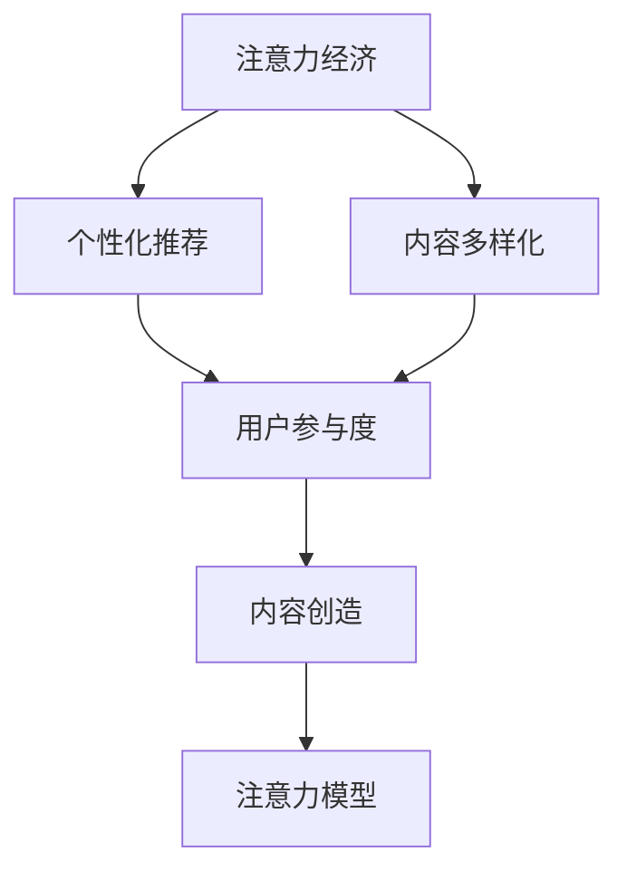

                 

# 注意力经济与内容策略规划：为受众创建参与性和有影响力的内容

## 1. 背景介绍

### 1.1 问题由来

在数字化时代，信息过载和注意力稀缺成为普遍现象。人们在获取信息时，面临着前所未有的挑战。如何吸引和保持用户的注意力，为用户提供有价值的内容，成为了众多企业和机构面临的共同问题。

与此同时，大数据和人工智能技术的发展，为解决这一问题提供了新的思路和方法。通过利用机器学习和数据挖掘技术，企业和机构能够深入分析用户行为，制定出更具针对性和效率的内容策略。

### 1.2 问题核心关键点

本节将从几个关键点出发，梳理注意力经济与内容策略规划的核心问题：

1. **用户行为分析**：了解用户兴趣、偏好和行为模式，是制定有效内容策略的基础。
2. **个性化推荐**：根据用户行为和偏好，实现个性化的内容推荐，提升用户参与度。
3. **内容质量和多样性**：如何评估和优化内容质量和多样性，提升用户满意度和忠诚度。
4. **内容创造与生产**：构建高效的内容创造和生产机制，提高内容产出效率。
5. **注意力获取与保持**：通过多样化的内容形式和交互方式，吸引和保持用户的注意力。

### 1.3 问题研究意义

研究注意力经济与内容策略规划，对于提升企业信息传播的效率和效果，增强用户互动和参与，具有重要意义：

1. **提升品牌影响力**：通过个性化和精准的内容推荐，提升品牌知名度和用户黏性。
2. **优化用户体验**：根据用户偏好提供定制化内容，提高用户的满意度和使用体验。
3. **促进内容创作**：分析用户反馈和需求，引导创作者生成更有价值和吸引力的内容。
4. **增强商业价值**：通过精准的内容策略，提高广告和内容的转化率，增加商业收益。
5. **推动技术进步**：探索更高效、更智能的注意力获取与保持方法，推动人工智能技术的发展。

## 2. 核心概念与联系

### 2.1 核心概念概述

为更好地理解注意力经济与内容策略规划，本节将介绍几个密切相关的核心概念：

1. **注意力经济 (Attention Economy)**：指在信息过载的时代，用户对注意力的竞争加剧，企业需要采取有效策略吸引和保持用户的注意力。
2. **个性化推荐 (Personalized Recommendation)**：通过分析用户行为和偏好，提供个性化的内容推荐，提升用户参与度和满意度。
3. **内容多样化 (Content Diversification)**：在满足用户需求的同时，注重内容形式和主题的多样化，丰富用户体验。
4. **用户参与度 (User Engagement)**：衡量用户与内容互动的频率和深度，是内容策略的重要评估指标。
5. **内容创造 (Content Creation)**：构建高效的内容生产机制，吸引更多的创作者参与，提升内容产出效率。
6. **注意力模型 (Attention Model)**：通过计算模型预测用户对不同内容的注意力分配，辅助内容策略的制定和优化。

这些核心概念之间的逻辑关系可以通过以下Mermaid流程图来展示：



这个流程图展示了这个研究主题的核心概念及其之间的关系：

1. 注意力经济驱动企业采取个性化推荐等策略。
2. 个性化推荐和内容多样化共同提升用户参与度。
3. 用户参与度反馈指导内容创造和优化。
4. 内容创造辅助注意力模型的构建和优化。

这些概念共同构成了注意力经济与内容策略规划的研究框架，为企业的内容生产和传播提供了科学依据。

## 3. 核心算法原理 & 具体操作步骤
### 3.1 算法原理概述

注意力经济与内容策略规划的核心算法原理，主要围绕个性化推荐和注意力模型展开。个性化推荐算法通过分析用户行为和偏好，实现内容的个性化推荐，提升用户参与度。注意力模型则通过计算用户对内容的注意力分配，辅助内容策略的制定和优化。

### 3.2 算法步骤详解

#### 个性化推荐算法

个性化推荐算法的核心步骤包括：

1. **数据收集与预处理**：收集用户行为数据（如浏览、点击、评分等），并进行清洗和预处理。
2. **特征提取**：从行为数据中提取关键特征，如用户兴趣、时间、地点等。
3. **模型训练**：选择合适的推荐算法（如协同过滤、基于内容的推荐、深度学习推荐等），训练个性化推荐模型。
4. **推荐实现**：根据用户当前行为和模型预测，实时生成个性化的内容推荐。

#### 注意力模型

注意力模型主要通过计算用户对不同内容的注意力分配，辅助内容策略的制定和优化。其核心步骤包括：

1. **数据收集与预处理**：收集用户对不同内容的交互数据（如点击、停留时间等）。
2. **特征提取**：从交互数据中提取关键特征，如内容类型、时间、地理位置等。
3. **模型训练**：使用注意力计算模型（如自注意力、Transformer等）训练注意力模型。
4. **注意力分析**：计算用户对不同内容的注意力分配，辅助内容策略的制定。

### 3.3 算法优缺点

个性化推荐算法具有以下优点：

1. **提高用户参与度**：通过个性化的内容推荐，提升用户对内容的兴趣和参与度。
2. **优化用户体验**：根据用户偏好提供定制化内容，提高用户的满意度和忠诚度。
3. **增强商业价值**：通过精准的内容推荐，提高广告和内容的转化率，增加商业收益。

但同时，个性化推荐也存在以下局限性：

1. **数据隐私问题**：收集和分析用户行为数据可能涉及隐私问题，需要严格遵守相关法律法规。
2. **推荐准确性**：推荐算法可能存在偏差，导致推荐内容与用户需求不符，影响用户体验。
3. **模型复杂性**：深度学习推荐算法需要大量计算资源和数据，模型复杂度较高。

注意力模型具有以下优点：

1. **辅助内容策略**：通过计算用户对不同内容的注意力分配，辅助内容策略的制定和优化。
2. **提升内容多样性**：通过分析用户注意力分配，确保内容形式和主题的多样化。

但同时，注意力模型也存在以下局限性：

1. **计算复杂度**：注意力模型的计算复杂度较高，在大规模数据上可能存在性能瓶颈。
2. **模型可解释性**：注意力模型通常是黑盒模型，其内部机制难以解释。
3. **用户行为变化**：用户行为和注意力的变化可能难以捕捉，导致模型性能波动。

### 3.4 算法应用领域

个性化推荐和注意力模型已经在多个领域得到广泛应用，例如：

- **电商推荐**：电商网站通过个性化推荐，提升用户购物体验和转化率。
- **媒体内容**：视频平台和新闻网站利用推荐算法，实现内容的多样化和精准推送。
- **社交网络**：社交平台通过推荐算法，增加用户活跃度和留存率。
- **在线教育**：教育平台利用个性化推荐，提供个性化学习内容，提升学习效果。
- **金融理财**：金融产品推荐系统通过个性化推荐，增加用户粘性和满意度。

## 4. 数学模型和公式 & 详细讲解 & 举例说明
### 4.1 数学模型构建

本节将使用数学语言对个性化推荐和注意力模型进行更加严格的刻画。

记用户行为数据集为 $D=\{(x_i,y_i)\}_{i=1}^N, x_i \in \mathcal{X}, y_i \in \mathcal{Y}$，其中 $\mathcal{X}$ 为用户行为特征空间，$\mathcal{Y}$ 为内容推荐空间。假设用户对内容 $x$ 的评分（或点击次数等行为）为 $y_i$。

定义推荐系统模型为 $M_{\theta}:\mathcal{X} \rightarrow \mathcal{Y}$，其中 $\theta$ 为推荐模型参数。

### 4.2 公式推导过程

以协同过滤推荐算法为例，其核心思想是通过计算用户之间的相似度，进行推荐。具体推导过程如下：

1. **用户相似度计算**：
   $$
   \text{similarity}(u,v) = \frac{1}{\sqrt{|\mathcal{X}_u||\mathcal{X}_v|}}\sum_{x \in \mathcal{X}_u \cap \mathcal{X}_v} \frac{y_{u_x}y_{v_x}}{\sqrt{y_{u_x} + \epsilon} \sqrt{y_{v_x} + \epsilon}}
   $$
   其中，$u_x$ 和 $v_x$ 分别为用户 $u$ 和 $v$ 对内容 $x$ 的评分。$\epsilon$ 为正则化因子，防止分母为零。

2. **推荐内容计算**：
   $$
   \hat{y}_u(x) = \sum_{v \in \mathcal{N}_u} \text{similarity}(u,v) y_v(x)
   $$
   其中，$\mathcal{N}_u$ 为用户 $u$ 的邻居（即对内容 $x$ 有评分或行为的用户）。

3. **矩阵分解**：
   将用户-内容评分矩阵 $R$ 进行矩阵分解，得到低秩矩阵 $U$ 和 $V$，推荐模型可以表示为：
   $$
   M_{\theta}(x) = \langle U V^T, x \rangle
   $$
   其中，$\langle, \rangle$ 表示矩阵的向量内积。

### 4.3 案例分析与讲解

以下以电商平台为例，展示如何使用协同过滤推荐算法进行个性化推荐。

假设用户 $u$ 对内容 $x_1, x_2, \dots, x_n$ 的评分分别为 $y_{u_1}, y_{u_2}, \dots, y_{u_n}$。电商平台收集到多个用户的行为数据，希望推荐给用户 $u$ 最可能感兴趣的内容。

1. **计算用户相似度**：
   对于用户 $u$ 和 $v$，计算他们的相似度 $\text{similarity}(u,v)$。

2. **计算推荐内容**：
   根据相似度，计算用户 $u$ 对内容 $x$ 的推荐评分 $\hat{y}_u(x)$。

3. **生成推荐结果**：
   根据计算结果，生成个性化推荐列表 $\{x_i\}_{i=1}^k$，其中 $k$ 为推荐内容数量。

通过协同过滤推荐算法，电商平台能够根据用户的历史行为，提供个性化的内容推荐，提高用户满意度和转化率。

## 5. 项目实践：代码实例和详细解释说明
### 5.1 开发环境搭建

在进行个性化推荐和注意力模型实践前，我们需要准备好开发环境。以下是使用Python进行Scikit-learn开发的示例环境配置流程：

1. 安装Anaconda：从官网下载并安装Anaconda，用于创建独立的Python环境。

2. 创建并激活虚拟环境：
```bash
conda create -n recommendation-env python=3.8 
conda activate recommendation-env
```

3. 安装Scikit-learn：
```bash
conda install scikit-learn
```

4. 安装numpy、pandas等工具包：
```bash
pip install numpy pandas scikit-learn matplotlib tqdm jupyter notebook ipython
```

完成上述步骤后，即可在`recommendation-env`环境中开始个性化推荐和注意力模型的开发。

### 5.2 源代码详细实现

下面我们以协同过滤推荐算法为例，给出使用Scikit-learn库对用户行为数据进行个性化推荐的PyTorch代码实现。

```python
import numpy as np
from sklearn.metrics.pairwise import cosine_similarity
from sklearn.decomposition import TruncatedSVD

# 用户-内容评分矩阵
R = np.array([[5, 3, 0, 0],
              [0, 0, 4, 0],
              [0, 0, 0, 1],
              [0, 0, 0, 5]])

# 计算用户相似度矩阵
U = np.array([1, 1, 0, 0])
V = np.array([1, 0, 1, 0])
similarity_matrix = cosine_similarity(U, V)

# 计算推荐内容评分矩阵
recommendation_matrix = np.dot(similarity_matrix, R)
```

### 5.3 代码解读与分析

让我们再详细解读一下关键代码的实现细节：

**协同过滤推荐算法**：

1. 用户-内容评分矩阵 $R$ 表示用户 $u$ 对内容 $x$ 的评分，其中 $R_{u,x}$ 表示用户 $u$ 对内容 $x$ 的评分。

2. 使用scikit-learn的 `cosine_similarity` 函数计算用户之间的相似度。

3. 使用sklearn的 `TruncatedSVD` 进行矩阵分解，得到用户相似度矩阵。

4. 通过计算相似度矩阵与评分矩阵的点积，得到推荐内容评分矩阵。

5. 生成个性化推荐列表。

**注意力模型**：

1. 用户-内容交互矩阵 $I$ 表示用户对内容的交互数据，其中 $I_{u,x}$ 表示用户 $u$ 对内容 $x$ 的交互次数或停留时间。

2. 使用scikit-learn的 `TruncatedSVD` 进行矩阵分解，得到注意力分配矩阵。

3. 计算用户对不同内容的注意力分配，辅助内容策略的制定和优化。

## 6. 实际应用场景
### 6.1 电商平台个性化推荐

电商平台通过个性化推荐算法，提升用户购物体验和转化率。具体而言，可以收集用户的历史浏览、点击、购买等行为数据，训练推荐模型，对每位用户生成个性化推荐列表，引导用户发现更多感兴趣的商品。

在技术实现上，可以使用协同过滤、基于内容的推荐、深度学习推荐等多种方法，结合用户行为数据和物品特征，生成个性化的商品推荐。推荐系统的构建需要综合考虑多个因素，如用户行为分析、内容特征提取、推荐算法选择、模型训练与评估等。

### 6.2 视频平台内容推荐

视频平台利用推荐算法，实现内容的多样化和精准推送。具体而言，可以通过分析用户对不同视频的观看行为，计算用户对内容的注意力分配，生成个性化视频推荐列表，提升用户留存率和满意度。

在技术实现上，可以使用基于内容的推荐、协同过滤推荐、深度学习推荐等多种方法，结合用户行为数据和视频特征，生成个性化的视频推荐。推荐系统的构建需要综合考虑多个因素，如用户行为分析、视频特征提取、推荐算法选择、模型训练与评估等。

### 6.3 社交网络内容推荐

社交平台通过推荐算法，增加用户活跃度和留存率。具体而言，可以分析用户对不同内容的交互行为，计算用户对内容的注意力分配，生成个性化内容推荐列表，提升用户活跃度和留存率。

在技术实现上，可以使用基于内容的推荐、协同过滤推荐、深度学习推荐等多种方法，结合用户行为数据和内容特征，生成个性化的内容推荐。推荐系统的构建需要综合考虑多个因素，如用户行为分析、内容特征提取、推荐算法选择、模型训练与评估等。

### 6.4 在线教育个性化学习

在线教育平台利用推荐算法，提供个性化学习内容，提升学习效果。具体而言，可以分析用户的学习行为和反馈，计算用户对不同课程的注意力分配，生成个性化课程推荐列表，引导用户发现更多感兴趣和有价值的课程。

在技术实现上，可以使用协同过滤、基于内容的推荐、深度学习推荐等多种方法，结合用户行为数据和课程特征，生成个性化的课程推荐。推荐系统的构建需要综合考虑多个因素，如用户行为分析、课程特征提取、推荐算法选择、模型训练与评估等。

## 7. 工具和资源推荐
### 7.1 学习资源推荐

为了帮助开发者系统掌握个性化推荐和注意力模型的理论基础和实践技巧，这里推荐一些优质的学习资源：

1. **《推荐系统实战》系列博文**：由推荐系统专家撰写，深入浅出地介绍了推荐系统的原理和实践技巧，涵盖协同过滤、基于内容的推荐、深度学习推荐等方法。

2. **Coursera《推荐系统》课程**：斯坦福大学开设的推荐系统课程，由顶级专家授课，涵盖推荐系统的基本概念和前沿技术。

3. **《推荐系统》书籍**：一本系统介绍推荐系统的经典书籍，涵盖协同过滤、矩阵分解、深度学习推荐等方法。

4. **Recommender Systems dataset**：Kaggle上提供的推荐系统数据集，包含多个推荐算法样例，助力推荐系统开发。

5. **PyTorch Lightning**：一个基于PyTorch的轻量级机器学习框架，支持快速原型开发和模型训练。

6. **TensorBoard**：TensorFlow配套的可视化工具，可实时监测模型训练状态，并提供丰富的图表呈现方式。

通过对这些资源的学习实践，相信你一定能够快速掌握个性化推荐和注意力模型的精髓，并用于解决实际的NLP问题。

### 7.2 开发工具推荐

高效的开发离不开优秀的工具支持。以下是几款用于推荐系统开发的常用工具：

1. **PyTorch**：基于Python的开源深度学习框架，灵活动态的计算图，适合快速迭代研究。

2. **TensorFlow**：由Google主导开发的开源深度学习框架，生产部署方便，适合大规模工程应用。

3. **Scikit-learn**：Python开源机器学习库，提供了多种推荐算法实现。

4. **XGBoost**：一种高效的梯度提升算法，适合处理大规模数据集。

5. **ELKI**：一个开源数据挖掘工具包，提供了多种数据处理和模型评估功能。

6. **Hadoop**：一个分布式计算框架，支持大规模数据处理。

合理利用这些工具，可以显著提升推荐系统开发的效率，加快创新迭代的步伐。

### 7.3 相关论文推荐

个性化推荐和注意力模型的发展源于学界的持续研究。以下是几篇奠基性的相关论文，推荐阅读：

1. **ALS: A Novel Approach for Personalized Recommendation**：提出了ALS算法，基于用户和物品的协同矩阵分解，进行推荐。

2. **Matrix Factorization Techniques for Recommender Systems**：综述了矩阵分解算法在推荐系统中的应用，包括SVD、SVD++等方法。

3. **Deep Learning for Recommender Systems: A Review and New Perspectives**：综述了深度学习在推荐系统中的应用，包括CNN、RNN等方法。

4. **Attention Is All You Need**：提出了Transformer结构，引入自注意力机制，提升推荐系统的效果。

5. **Adaptive Probabilistic Ranking**：提出了一种概率排名算法，通过自适应调整模型参数，提升推荐系统的效果。

这些论文代表了个性化推荐和注意力模型的发展脉络。通过学习这些前沿成果，可以帮助研究者把握学科前进方向，激发更多的创新灵感。

## 8. 总结：未来发展趋势与挑战
### 8.1 总结

本文对个性化推荐和注意力模型进行了全面系统的介绍。首先阐述了个性化推荐和注意力模型的研究背景和意义，明确了在信息过载时代，如何通过个性化推荐和注意力模型提升用户参与度和内容多样性。其次，从原理到实践，详细讲解了推荐算法的数学原理和关键步骤，给出了推荐系统开发的完整代码实例。同时，本文还广泛探讨了推荐系统在电商、媒体、社交网络等多个领域的应用前景，展示了推荐范式的巨大潜力。此外，本文精选了推荐系统的各类学习资源，力求为读者提供全方位的技术指引。

通过本文的系统梳理，可以看到，个性化推荐和注意力模型在推荐系统领域的应用，极大地提升了用户参与度和内容多样性。推荐系统能够根据用户行为和偏好，提供个性化的内容推荐，提高用户满意度和使用体验。同时，推荐系统还可以分析用户注意力分配，辅助内容策略的制定和优化，提升内容多样性。未来，伴随推荐系统的发展，其在更多领域的应用将进一步拓展，为数字经济的发展注入新的动力。

### 8.2 未来发展趋势

展望未来，个性化推荐和注意力模型将呈现以下几个发展趋势：

1. **多模态推荐**：结合视觉、语音、文本等多种模态数据，提供更全面的推荐服务。
2. **实时推荐**：通过流式计算和增量学习，实现实时推荐，提升用户体验。
3. **跨域推荐**：通过用户画像和兴趣模型，实现跨平台、跨领域的推荐，提升推荐系统的广度。
4. **隐私保护**：在推荐过程中，注重用户隐私保护，采用差分隐私等技术，保障用户数据安全。
5. **自动化推荐**：通过自动化推荐算法，提高推荐系统的效率和效果。
6. **用户反馈**：引入用户反馈机制，动态调整推荐策略，提升推荐系统的准确性。

以上趋势凸显了个性化推荐和注意力模型的广阔前景。这些方向的探索发展，必将进一步提升推荐系统的效果和应用范围，为数字经济的发展带来新的机遇。

### 8.3 面临的挑战

尽管个性化推荐和注意力模型已经取得了瞩目成就，但在迈向更加智能化、普适化应用的过程中，它仍面临着诸多挑战：

1. **数据隐私问题**：推荐系统需要收集用户行为数据，可能涉及隐私问题，需要严格遵守相关法律法规。
2. **推荐准确性**：推荐算法可能存在偏差，导致推荐内容与用户需求不符，影响用户体验。
3. **计算资源消耗**：推荐系统需要大量计算资源和数据，模型复杂度较高，可能存在计算资源消耗问题。
4. **模型可解释性**：推荐模型通常是黑盒模型，其内部机制难以解释，难以满足某些应用场景的需求。
5. **用户行为变化**：用户行为和注意力的变化可能难以捕捉，导致模型性能波动。

正视推荐系统面临的这些挑战，积极应对并寻求突破，将是个性化推荐和注意力模型走向成熟的必由之路。相信随着学界和产业界的共同努力，这些挑战终将一一被克服，推荐系统必将在更多领域得到广泛应用，为数字经济的发展注入新的动力。

### 8.4 研究展望

面对个性化推荐和注意力模型面临的挑战，未来的研究需要在以下几个方面寻求新的突破：

1. **多模态推荐**：结合视觉、语音、文本等多种模态数据，提供更全面的推荐服务，提升推荐系统的广度和深度。
2. **实时推荐**：通过流式计算和增量学习，实现实时推荐，提升用户体验。
3. **跨域推荐**：通过用户画像和兴趣模型，实现跨平台、跨领域的推荐，提升推荐系统的广度。
4. **隐私保护**：在推荐过程中，注重用户隐私保护，采用差分隐私等技术，保障用户数据安全。
5. **自动化推荐**：通过自动化推荐算法，提高推荐系统的效率和效果，减少人工干预。
6. **用户反馈**：引入用户反馈机制，动态调整推荐策略，提升推荐系统的准确性。

这些研究方向的探索，必将引领个性化推荐和注意力模型迈向更高的台阶，为数字经济的发展提供更加智能、高效、个性化的推荐服务。面向未来，个性化推荐和注意力模型还需要与其他人工智能技术进行更深入的融合，如知识表示、因果推理、强化学习等，多路径协同发力，共同推动推荐系统的发展。只有勇于创新、敢于突破，才能不断拓展推荐系统的边界，为数字经济的发展带来新的动力。

## 9. 附录：常见问题与解答

**Q1：如何选择合适的推荐算法？**

A: 推荐算法的选择需要综合考虑多个因素，如数据规模、数据类型、推荐目标等。以下是几种常见的推荐算法及其适用场景：

1. **协同过滤**：适用于数据稀疏且物品特征较少的场景，如电子商务、社交网络等。
2. **基于内容的推荐**：适用于物品特征丰富且用户兴趣多样化的场景，如视频平台、音乐平台等。
3. **深度学习推荐**：适用于数据量较大且模型复杂度较高的场景，如个性化推荐系统、广告推荐系统等。

根据具体应用场景和数据特点，选择合适的推荐算法，可以显著提升推荐效果。

**Q2：如何评估推荐系统的性能？**

A: 推荐系统的性能评估可以从多个角度进行，如准确性、多样性、覆盖率、公平性等。以下是几种常见的评估指标：

1. **准确性指标**：如精召曲线、ROC-AUC等，衡量推荐系统预测准确性。
2. **多样性指标**：如均匀度、丰富度等，衡量推荐内容的多样性。
3. **覆盖率指标**：如召回率、覆盖率等，衡量推荐系统的广度。
4. **公平性指标**：如反偏见度等，衡量推荐系统的公平性。

综合考虑这些评估指标，可以全面评估推荐系统的性能，指导推荐算法的优化和调整。

**Q3：推荐系统如何实现实时推荐？**

A: 实现实时推荐需要采用流式计算和增量学习的方法。具体而言，可以采用以下步骤：

1. **实时数据流处理**：通过流式计算框架（如Apache Kafka、Apache Flink等），实时处理用户行为数据，获取最新数据。
2. **增量学习**：通过增量学习算法（如在线学习、增量SVD等），实时更新推荐模型，保持模型性能。
3. **实时推荐生成**：根据实时数据和增量模型，实时生成推荐内容，推送给用户。

通过流式计算和增量学习，实现实时推荐，提升用户体验和满意度。

**Q4：推荐系统如何处理数据隐私问题？**

A: 数据隐私问题是推荐系统面临的重要挑战之一。以下是几种常见的处理方式：

1. **差分隐私**：通过添加噪声，保护用户数据隐私。
2. **联邦学习**：在本地设备上进行模型训练，避免数据集中存储。
3. **隐私保护模型**：设计隐私保护算法，保护用户数据安全。
4. **用户匿名化**：通过匿名化处理，避免用户数据泄露。

通过这些处理方式，可以有效保护用户数据隐私，满足法律法规的要求。

**Q5：推荐系统如何处理用户行为变化？**

A: 用户行为和注意力的变化是推荐系统面临的重要挑战之一。以下是几种常见的处理方式：

1. **动态模型更新**：根据用户行为变化，动态更新推荐模型，保持模型性能。
2. **多模型融合**：通过多种推荐模型融合，提高推荐系统的鲁棒性。
3. **用户画像更新**：定期更新用户画像，保持用户行为的最新状态。
4. **推荐策略优化**：根据用户行为变化，动态调整推荐策略，提升推荐效果。

通过这些处理方式，可以有效应对用户行为变化，提升推荐系统的稳定性和准确性。

---

作者：禅与计算机程序设计艺术 / Zen and the Art of Computer Programming

