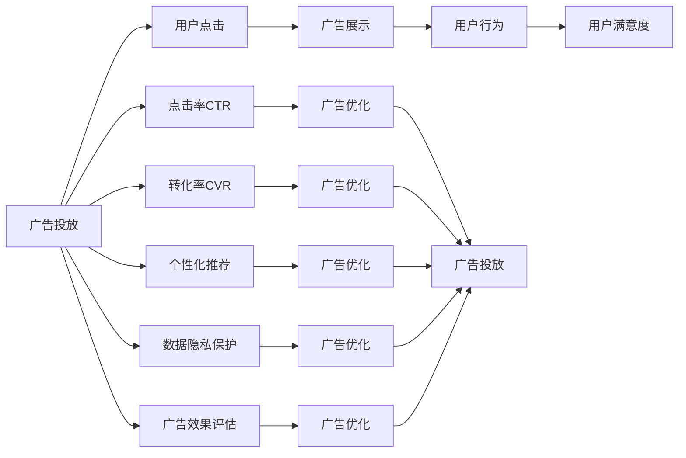

                 

# 注意力经济与在线广告目标与策略：在不牺牲用户体验的情况下吸引受众

## 1. 背景介绍

### 1.1 问题由来
随着互联网的普及和移动互联网的兴起，注意力经济已成为一个新的商业模式。特别是在线广告领域，广告主花费巨资在各种渠道投放广告，以期吸引用户注意并提升转化率。然而，在注意力稀缺的背景下，如何精准定位目标用户群体，合理利用广告预算，最大化用户参与和品牌曝光，同时保持用户的信任与满意度，成为在线广告的重要课题。

在线广告的目标不仅仅是展示品牌信息，更在于引导用户采取特定行动，如购买、注册、转发等。而随着用户行为日益复杂多变，简单的展示广告已无法满足日益提升的用户体验要求。因此，本文将探讨如何在不牺牲用户体验的前提下，有效吸引用户注意，提升在线广告的转化率和效果。

### 1.2 问题核心关键点
在线广告的优化目标在于提升广告的点击率、转化率以及用户满意度，这涉及多个关键点：
- 目标用户定位：理解目标用户的兴趣和需求，通过精准定位提升广告的吸引力和效果。
- 广告创意设计：利用创意元素、布局、色彩等吸引用户注意力，提升广告的点击率。
- 个性化推荐：根据用户行为和偏好进行个性化推荐，提高广告的转化率。
- 隐私保护：在满足用户隐私保护的前提下，收集和利用用户数据。
- 效果评估：建立科学的评估体系，评估广告效果，持续优化广告策略。

解决这些问题，将有助于在确保用户满意度的同时，最大化广告投资回报率，实现经济效益和社会效益的双赢。

## 2. 核心概念与联系

### 2.1 核心概念概述

为了更好地理解在线广告的目标与策略，我们首先需要了解一些核心概念：

- **在线广告**：利用互联网平台展示广告信息，以吸引用户点击、购买等行为。
- **用户注意力**：用户在接触广告时的专注度和反应，是广告效果的关键因素。
- **点击率(CTR)**：广告被点击次数与展示次数之比，是衡量广告效果的重要指标。
- **转化率(CVR)**：广告点击后，用户完成特定目标行为的比率，如购买、注册等。
- **用户满意度**：用户对广告和产品的整体感知和满意度，是品牌建设的基础。
- **个性化推荐**：根据用户历史行为和偏好，智能推荐符合用户兴趣的内容。
- **数据隐私**：在广告投放和效果评估过程中，用户数据的安全和隐私保护。
- **广告效果评估**：通过科学的评估体系，量化广告效果，持续优化广告策略。

这些概念之间存在紧密联系，共同构成了在线广告的运行框架。广告效果的好坏不仅取决于创意设计和投放策略，还与用户行为和数据隐私等密切相关。本文将从这些核心概念入手，探讨在线广告的目标与策略。

### 2.2 核心概念原理和架构的 Mermaid 流程图



这个流程图展示了在线广告的运行机制：广告投放引发用户点击，用户点击进而展示广告，用户行为反馈满意度，同时点击率和转化率是广告效果的直接指标，个性化推荐和数据隐私保护是广告优化和投放的关键环节，广告效果评估则是持续优化广告策略的基础。这些环节相互影响，共同决定了广告的最终效果。

## 3. 核心算法原理 & 具体操作步骤
### 3.1 算法原理概述

在线广告的优化算法基于用户行为数据的收集和分析，通过预测用户兴趣和行为，进行目标用户定位、创意设计、个性化推荐等操作，从而提升广告效果。核心算法原理包括：

- **用户行为分析**：通过用户的历史点击、浏览、购买等行为数据，分析用户的兴趣和需求。
- **广告投放优化**：基于用户行为分析结果，优化广告投放策略，提升广告的点击率和转化率。
- **点击率预测**：利用机器学习算法，预测广告在不同用户和场景下的点击率。
- **个性化推荐**：根据用户行为和兴趣，智能推荐符合用户需求的内容。
- **用户满意度优化**：通过情感分析等技术，监测用户对广告的反应，优化广告设计和投放策略。

这些算法原理相互作用，形成一个闭环反馈机制，不断提升广告效果。

### 3.2 算法步骤详解

以下是基于在线广告优化的算法详细步骤：

**Step 1: 数据收集与预处理**
- 收集用户历史点击、浏览、购买等行为数据。
- 对数据进行清洗和处理，如去除无效数据、填补缺失值等。

**Step 2: 用户行为分析**
- 利用机器学习算法，如协同过滤、内容推荐等，分析用户的兴趣和需求。
- 建立用户画像，描述用户的基本特征和偏好。

**Step 3: 广告投放优化**
- 根据用户画像和行为数据，优化广告的投放策略。
- 选择合适的时间、渠道、频次等投放参数。

**Step 4: 点击率预测**
- 利用点击率预测模型，如线性回归、逻辑回归、随机森林等，预测广告在不同用户和场景下的点击率。
- 根据预测结果，优化广告创意和布局。

**Step 5: 个性化推荐**
- 基于用户行为和兴趣，智能推荐符合用户需求的内容。
- 使用协同过滤、基于矩阵分解的推荐算法等技术，提升推荐效果。

**Step 6: 用户满意度优化**
- 利用情感分析等技术，监测用户对广告的反应。
- 根据用户反馈，调整广告创意和投放策略。

**Step 7: 效果评估与优化**
- 建立科学的评估体系，如点击率、转化率、用户满意度等指标。
- 根据评估结果，持续优化广告策略。

### 3.3 算法优缺点

在线广告优化的算法具有以下优点：
- 精准定位目标用户群体，提升广告的吸引力和效果。
- 利用机器学习和大数据分析技术，提升广告的点击率和转化率。
- 个性化推荐和用户满意度优化，提升用户参与度和品牌忠诚度。

然而，这些算法也存在一些缺点：
- 数据隐私问题：广告投放和效果评估过程中，用户数据的安全和隐私保护是一个重要挑战。
- 用户行为的多样性：用户行为复杂多变，难以通过单一模型完全预测和解释。
- 广告创意的创意性：过度依赖数据驱动，可能导致广告创意缺乏创意和独特性。
- 效果评估的复杂性：在线广告的效果评估涉及多维度指标，难以用单一指标全面衡量。

### 3.4 算法应用领域

在线广告优化的算法在多个领域都有广泛应用，例如：

- 电商广告：通过精准定位和个性化推荐，提升电商平台的销售转化率。
- 社交媒体广告：利用用户行为分析，优化广告投放策略，提升用户参与度和广告效果。
- 移动应用广告：在移动设备上投放广告，通过个性化推荐和创意设计，提升用户粘性和留存率。
- 视频广告：通过数据分析，优化视频广告的投放策略和创意设计，提高广告点击率和用户满意度。
- 搜索广告：根据用户搜索行为，精准定位广告内容，提升广告效果。

## 4. 数学模型和公式 & 详细讲解  
### 4.1 数学模型构建

在在线广告优化中，常用的数学模型包括：

- **逻辑回归模型**：用于预测广告的点击率。
- **协同过滤算法**：用于个性化推荐。
- **情感分析模型**：用于用户满意度优化。

以逻辑回归模型为例，其数学模型为：

$$
P(y=1|x,\theta) = \sigma(\theta^Tx)
$$

其中 $x$ 为输入特征向量，$\theta$ 为模型参数，$\sigma$ 为sigmoid函数，$P(y=1|x,\theta)$ 表示在给定特征 $x$ 下，广告被点击的概率。

### 4.2 公式推导过程

对于逻辑回归模型，其目标函数为：

$$
\min_{\theta} \sum_{i=1}^n \ell(y_i, P(y=1|x_i,\theta))
$$

其中 $\ell$ 为损失函数，通常为交叉熵损失函数。

梯度下降算法用于求解最小化目标函数：

$$
\theta_{t+1} = \theta_t - \eta \nabla_{\theta} \ell(y_i, P(y=1|x_i,\theta))
$$

其中 $\eta$ 为学习率，$\nabla_{\theta} \ell(y_i, P(y=1|x_i,\theta))$ 为损失函数对参数 $\theta$ 的梯度。

### 4.3 案例分析与讲解

以电商广告为例，假设电商平台的商品A广告点击率为0.2，转化率为0.05。使用逻辑回归模型进行点击率预测，假设特征向量 $x$ 包括商品价格、用户年龄、用户历史购买记录等。模型参数 $\theta$ 通过训练得到，计算广告在不同用户下的点击率预测值。

设用户B的特征向量为 $x_B$，则其点击率预测值为：

$$
P(y_B=1|x_B,\theta) = \sigma(\theta^T x_B)
$$

通过预测值，电商平台可以选择合适的时间、渠道、频次等投放参数，进行广告优化。

## 5. 项目实践：代码实例和详细解释说明
### 5.1 开发环境搭建

在进行在线广告优化的项目实践前，我们需要准备好开发环境。以下是使用Python进行Scikit-learn开发的开发环境配置流程：

1. 安装Anaconda：从官网下载并安装Anaconda，用于创建独立的Python环境。

2. 创建并激活虚拟环境：
```bash
conda create -n ad-env python=3.8 
conda activate ad-env
```

3. 安装Scikit-learn：
```bash
conda install scikit-learn
```

4. 安装相关依赖包：
```bash
pip install pandas numpy matplotlib seaborn joblib
```

完成上述步骤后，即可在`ad-env`环境中开始项目实践。

### 5.2 源代码详细实现

下面我们以电商广告为例，给出使用Scikit-learn进行点击率预测的代码实现。

首先，准备电商广告数据：

```python
import pandas as pd

# 电商广告数据集
data = pd.read_csv('ad_data.csv')

# 特征处理
data['age'] = data['age'].astype(int)
data['price'] = data['price'].astype(float)

# 标签处理
data['label'] = data['click'].map({0: 'not_click', 1: 'click'})

# 特征选择
features = ['price', 'age', 'historical_bought']
X = data[features]
y = data['label']
```

然后，定义逻辑回归模型并进行训练：

```python
from sklearn.linear_model import LogisticRegression
from sklearn.model_selection import train_test_split

# 划分训练集和测试集
X_train, X_test, y_train, y_test = train_test_split(X, y, test_size=0.2, random_state=42)

# 定义逻辑回归模型
model = LogisticRegression()

# 训练模型
model.fit(X_train, y_train)
```

接着，进行预测和效果评估：

```python
from sklearn.metrics import classification_report

# 预测
y_pred = model.predict(X_test)

# 评估效果
print(classification_report(y_test, y_pred))
```

最后，输出预测结果：

```python
print("预测结果：", y_pred)
```

以上就是使用Scikit-learn对电商广告点击率预测的完整代码实现。可以看到，通过Scikit-learn的逻辑回归模型，我们可以在电商广告优化项目中快速实现点击率预测，并进行效果评估。

### 5.3 代码解读与分析

让我们再详细解读一下关键代码的实现细节：

**特征处理**：
- 电商广告的特征包括商品价格、用户年龄、用户历史购买记录等。首先需要进行特征处理，将数据类型转换为数值型。

**标签处理**：
- 广告点击与否是一个二分类问题，将点击标签转换为'click'和'not_click'，方便后续处理。

**特征选择**：
- 根据电商广告的特点，选择价格、年龄、历史购买记录作为特征。

**模型训练**：
- 使用Scikit-learn的逻辑回归模型，对训练集进行训练，并输出模型参数。

**预测与评估**：
- 利用训练好的模型对测试集进行预测，并使用分类报告评估预测效果。

**结果输出**：
- 输出预测结果，用于电商广告优化项目的具体应用。

可以看到，通过Scikit-learn，我们能够快速构建和训练逻辑回归模型，用于在线广告点击率预测和优化。这展示了Scikit-learn在在线广告优化中的强大应用潜力。

## 6. 实际应用场景
### 6.1 电商广告优化

电商广告优化是电子商务平台的重要环节。通过对用户行为数据的收集和分析，电商平台可以精准定位目标用户群体，进行个性化推荐和创意设计，从而提升广告的点击率和转化率。

以电商平台A为例，该平台通过收集用户浏览、点击、购买等行为数据，使用逻辑回归模型进行点击率预测，并根据预测结果进行广告投放优化。具体步骤如下：

1. **数据收集**：收集用户的历史行为数据，包括浏览记录、购买记录、点击记录等。
2. **数据预处理**：对数据进行清洗和处理，如去除无效数据、填补缺失值等。
3. **特征工程**：选择价格、用户年龄、用户历史购买记录等作为特征，进行特征工程。
4. **模型训练**：使用逻辑回归模型，对训练集进行训练，得到点击率预测模型。
5. **广告投放**：根据预测结果，优化广告的投放策略，选择合适的时间、渠道、频次等投放参数。
6. **效果评估**：建立科学的评估体系，如点击率、转化率、用户满意度等指标，持续优化广告策略。

通过以上步骤，电商平台A能够实现精准的广告投放，提升广告效果，增强用户粘性和留存率，提升平台销售额。

### 6.2 社交媒体广告优化

社交媒体广告是社交媒体平台的重要收入来源。通过对用户行为数据的收集和分析，社交媒体平台可以优化广告投放策略，提升广告的点击率和用户参与度。

以社交媒体平台B为例，该平台通过收集用户的历史点赞、评论、分享等行为数据，使用协同过滤算法进行个性化推荐，并根据用户行为分析，优化广告投放策略。具体步骤如下：

1. **数据收集**：收集用户的点赞、评论、分享等行为数据。
2. **数据预处理**：对数据进行清洗和处理，如去除无效数据、填补缺失值等。
3. **特征工程**：选择用户兴趣标签、用户社交关系等作为特征，进行特征工程。
4. **协同过滤**：使用协同过滤算法，对用户进行个性化推荐，提升广告的点击率和用户参与度。
5. **广告投放**：根据用户画像和行为分析，优化广告的投放策略，选择合适的时间、渠道、频次等投放参数。
6. **效果评估**：建立科学的评估体系，如点击率、转化率、用户满意度等指标，持续优化广告策略。

通过以上步骤，社交媒体平台B能够实现精准的广告投放，提升广告效果，增强用户粘性和留存率，提升平台广告收入。

### 6.3 视频广告优化

视频广告是视频平台的重要收入来源。通过对用户行为数据的收集和分析，视频平台可以优化广告投放策略，提升广告的点击率和用户满意度。

以视频平台C为例，该平台通过收集用户的视频观看历史、点赞、评论等行为数据，使用情感分析模型进行用户满意度优化，并根据用户行为分析，优化广告投放策略。具体步骤如下：

1. **数据收集**：收集用户的视频观看历史、点赞、评论等行为数据。
2. **数据预处理**：对数据进行清洗和处理，如去除无效数据、填补缺失值等。
3. **特征工程**：选择视频观看时长、点赞数、评论情感等作为特征，进行特征工程。
4. **情感分析**：使用情感分析模型，对用户评论进行情感分析，监测用户对广告的反应。
5. **广告投放**：根据用户情感分析结果，优化广告的投放策略，选择合适的时间、渠道、频次等投放参数。
6. **效果评估**：建立科学的评估体系，如点击率、转化率、用户满意度等指标，持续优化广告策略。

通过以上步骤，视频平台C能够实现精准的广告投放，提升广告效果，增强用户粘性和留存率，提升平台广告收入。

## 7. 工具和资源推荐
### 7.1 学习资源推荐

为了帮助开发者系统掌握在线广告优化技术的理论基础和实践技巧，这里推荐一些优质的学习资源：

1. **在线广告优化课程**：由Kaggle、Coursera等平台开设的在线课程，深入浅出地介绍了在线广告优化的基本概念和常用技术，涵盖点击率预测、个性化推荐、效果评估等核心内容。
2. **数据科学博客**：如KDnuggets、Analytics Vidhya等博客，定期发布在线广告优化领域的最新研究和实践案例，帮助开发者了解前沿动态。
3. **数据分析工具**：如Python、R、SQL等，是进行数据分析和模型训练的基础工具，适合各种规模的在线广告优化项目。
4. **机器学习库**：如Scikit-learn、TensorFlow、PyTorch等，提供了丰富的算法实现和数据预处理工具，适合快速构建和优化在线广告模型。

通过对这些学习资源的系统学习，相信你一定能够掌握在线广告优化的核心技术和实践方法，应用于实际项目中。

### 7.2 开发工具推荐

高效的开发离不开优秀的工具支持。以下是几款用于在线广告优化开发的常用工具：

1. **Python**：Python是数据分析和机器学习领域的主流语言，拥有丰富的数据处理和模型训练库。
2. **Jupyter Notebook**：Jupyter Notebook是交互式编程环境，适合进行数据分析和模型训练，支持多种代码格式和可视化。
3. **Tableau**：Tableau是数据可视化工具，适合进行数据分析和报表展示，支持多维度数据交互。
4. **Grafana**：Grafana是数据监控工具，支持多种数据源和可视化类型，适合实时监控广告效果。
5. **TensorBoard**：TensorBoard是TensorFlow配套的可视化工具，适合监控模型训练和评估过程。

合理利用这些工具，可以显著提升在线广告优化任务的开发效率，加快创新迭代的步伐。

### 7.3 相关论文推荐

在线广告优化领域的研究成果丰富，以下是几篇奠基性的相关论文，推荐阅读：

1. **Click-Through Rate Prediction with Deep Neural Networks**：提出基于深度神经网络的点击率预测模型，解决了传统机器学习模型无法处理高维度特征的问题。
2. **Personalized Recommendation with Matrix Factorization**：介绍矩阵分解算法在个性化推荐中的应用，提出协同过滤等经典算法。
3. **User-Driven Recommendation**：介绍基于用户反馈的推荐算法，提出基于行为的推荐模型。
4. **Sentiment Analysis for Social Media**：提出情感分析模型，用于监测用户对广告的反应，优化广告策略。
5. **Click-Bait Detection**：提出点击诱饵检测算法，识别和过滤虚假广告，提升广告效果。

这些论文代表了大数据和机器学习在在线广告优化领域的应用趋势，提供了丰富的理论和实践经验。

## 8. 总结：未来发展趋势与挑战
### 8.1 总结

本文对在线广告的目标与策略进行了全面系统的介绍。首先阐述了在线广告的优化目标和核心概念，明确了广告效果提升的方向和关键因素。其次，从算法原理到具体操作步骤，详细讲解了在线广告优化的数学模型和实践方法，给出了实际应用的代码实例。同时，本文还广泛探讨了在线广告优化在电商、社交媒体、视频等多个领域的应用前景，展示了其广泛的应用价值。此外，本文精选了在线广告优化的各类学习资源，力求为读者提供全方位的技术指引。

通过本文的系统梳理，可以看到，在线广告优化技术在提升广告效果、增强用户体验方面具有重要意义。广告主通过精准定位、个性化推荐、创意设计等手段，可以实现广告投放的精准化和高效化，最大程度提升广告的点击率和转化率。然而，在线广告优化也面临着数据隐私、用户行为多样性、广告创意独特性等挑战，需要未来的研究不断探索新的方法和技术。

### 8.2 未来发展趋势

展望未来，在线广告优化的发展趋势包括：

1. **多模态融合**：在线广告优化将更加注重多模态数据的融合，将文本、图像、语音等多模态信息进行综合分析，提升广告效果。
2. **深度学习应用**：深度学习模型在在线广告优化中的应用将更加广泛，包括卷积神经网络、生成对抗网络等，提升广告创意和推荐效果。
3. **实时化**：在线广告优化将更加注重实时性，通过实时监控和调整，提升广告投放的灵活性和效果。
4. **用户隐私保护**：在广告投放和效果评估过程中，用户数据的安全和隐私保护将更加重要，需引入隐私计算、差分隐私等技术。
5. **跨平台协同**：跨平台广告优化将更加注重平台间的协同，通过数据共享和联合推荐，提升广告效果。

以上趋势将推动在线广告优化技术的不断进步，为广告主和用户带来更加精准、高效和安全的广告体验。

### 8.3 面临的挑战

尽管在线广告优化技术已经取得了瞩目成就，但在迈向更加智能化、普适化应用的过程中，它仍面临着诸多挑战：

1. **数据隐私问题**：在线广告优化过程中，用户数据的安全和隐私保护是一个重要挑战。如何合理收集和利用用户数据，避免数据泄露和滥用，将是未来的重要研究方向。
2. **用户行为多样性**：用户行为复杂多变，难以通过单一模型完全预测和解释。如何构建更全面、准确的用户画像，提升广告的点击率和转化率，将是未来的关键问题。
3. **广告创意缺乏独特性**：过度依赖数据驱动，可能导致广告创意缺乏独特性和创意性。如何结合创意和数据驱动，提升广告的吸引力和效果，将是未来的重要研究方向。
4. **效果评估复杂性**：在线广告的效果评估涉及多维度指标，难以用单一指标全面衡量。如何建立科学的评估体系，量化广告效果，持续优化广告策略，将是未来的重要问题。

### 8.4 研究展望

面对在线广告优化所面临的挑战，未来的研究需要在以下几个方面寻求新的突破：

1. **深度学习和多模态融合**：结合深度学习和多模态数据的融合，提升广告创意和推荐效果，解决用户行为多样性问题。
2. **实时化和跨平台协同**：通过实时监控和跨平台协同，提升广告投放的灵活性和效果，解决数据隐私问题。
3. **隐私计算和差分隐私**：引入隐私计算和差分隐私技术，合理收集和利用用户数据，避免数据泄露和滥用。
4. **情感分析和用户反馈**：通过情感分析和用户反馈，提升广告投放的灵活性和效果，提升用户满意度。

这些研究方向的探索，必将引领在线广告优化技术迈向更高的台阶，为广告主和用户带来更加精准、高效和安全的广告体验。

## 9. 附录：常见问题与解答

**Q1：在线广告优化是否适用于所有广告形式？**

A: 在线广告优化主要适用于展示类广告和点击类广告。对于视频广告、搜索广告等广告形式，需要结合具体的广告形式和平台特点，进行针对性的优化。

**Q2：如何选择合适的广告投放渠道？**

A: 广告投放渠道的选择应根据目标用户群体和广告形式进行优化。例如，针对年轻人，可以选择社交媒体和移动应用等渠道，针对企业客户，可以选择B2B平台和电子邮件等渠道。同时，需要考虑不同渠道的流量和成本，进行合理的资源配置。

**Q3：如何避免广告重复投放？**

A: 可以通过设置广告投放频率和广告库管理，避免广告在同一用户身上重复投放。设置合理的广告频率，避免用户对广告的厌烦感，提升广告效果。

**Q4：如何提升广告创意的独特性？**

A: 广告创意的独特性是提升广告效果的关键。可以通过定期的创意头脑风暴、A/B测试等方法，不断优化广告创意，提升广告的吸引力和效果。

**Q5：如何提升广告的点击率和转化率？**

A: 提升广告的点击率和转化率，需要综合考虑广告创意、投放渠道、用户行为等多个因素。可以结合数据驱动和创意设计，进行多渠道、多频次、多形式的广告投放，提升广告效果。

这些常见问题的解答，有助于在线广告优化技术的实践者和研究者更好地理解和应用在线广告优化技术，提升广告效果，实现经济效益和社会效益的双赢。

