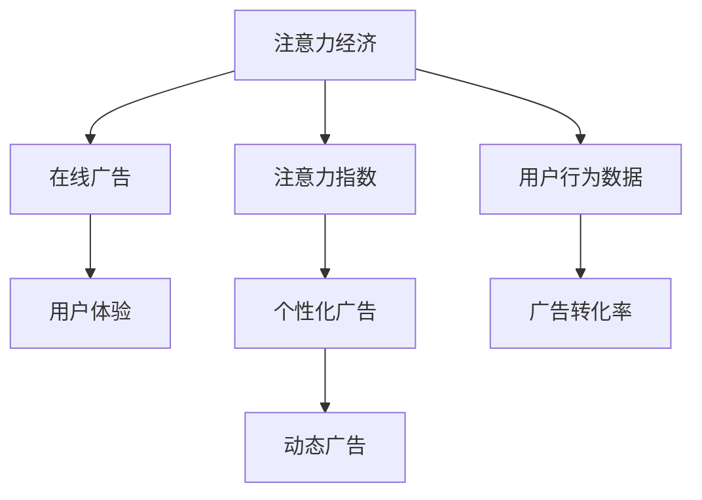

                 

# 注意力经济与在线广告目标与策略：在不牺牲用户体验的情况下吸引受众

> 关键词：注意力经济,在线广告,目标与策略,用户体验

## 1. 背景介绍

### 1.1 问题由来

在数字经济时代，数据成为最宝贵的资源之一。注意力作为信息的入口，日益成为一种稀缺的资产。在线广告商为了争夺用户的注意力，投入了巨大的资金和资源，但效果往往不尽如人意。用户在面对海量的信息流时，注意力资源分布极不均衡，广告商难以高效吸引和转化用户。

传统的点击率指标(CTR)在数字广告中占据主导地位，但CTR无法全面反映用户的实际需求和广告的有效性。而关注度指标(Attention Index)，通过测量用户对广告的关注时长和频率，更精准地评估广告对用户的吸引力。

### 1.2 问题核心关键点

在面对注意力资源稀缺和广告商需求日益增长的矛盾下，如何设计高效、合理的广告策略，吸引并转化用户，而不牺牲用户体验，成为关注的焦点。

核心关键点包括：
- 如何设计有效的注意力经济指标体系，评估广告的实际影响？
- 如何基于用户行为数据，优化广告投放策略，提高广告的点击率和转化率？
- 如何在不干扰用户正常浏览体验的情况下，最大化广告的展示效果？

## 2. 核心概念与联系

### 2.1 核心概念概述

为更好地理解如何优化在线广告的注意力经济和用户体验，本节将介绍几个关键概念：

- 注意力经济(Attention Economy)：指在信息过载的环境下，用户对信息资源的注意力成为了稀缺和宝贵的资产。在线广告的最终目的是吸引并转化用户的注意力，从而产生商业价值。

- 在线广告(Online Advertising)：指通过互联网平台向用户展示各种形式的信息，如横幅广告、原生广告、视频广告等。广告商通过精准投放和创意设计，提高广告的点击率和转化率。

- 用户体验(User Experience, UX)：指用户在使用产品或服务时的感受和满意度。在线广告的投放需尽量减少对用户正常浏览体验的干扰，保证用户对广告的接受度。

- 注意力指数(Attention Index)：指用户对广告的关注程度和持续时间，综合反映广告的吸引力。相较于传统CTR指标，Attention Index更全面评估广告对用户的实际影响。

- 个性化广告(Personalized Advertising)：指根据用户的兴趣、行为等数据，设计针对性的广告内容，提高广告的点击率和转化率。

- 动态广告(Programmatic Advertising)：指通过程序化广告投放平台，实现广告的自动化投放和优化。动态广告可以实时优化广告内容，最大化广告效果。

- 用户行为数据(User Behavior Data)：指用户在浏览网页、购物、互动等过程中的行为记录，用于广告投放的优化和精准定位。

- 广告转化率(Ad Conversion Rate)：指广告点击后的购买或注册等转化行为的比例，是衡量广告效果的重要指标。

这些概念之间存在着紧密的联系：广告商通过优化广告内容，精准投放，最大化广告的点击率和转化率，以实现商业价值。而用户行为数据和动态广告技术，提供了优化广告策略的基础，从而在不牺牲用户体验的前提下，提高广告的实际效果。

### 2.2 核心概念原理和架构的 Mermaid 流程图



这个流程图展示了注意力经济与在线广告的核心概念及其之间的关系：

1. 注意力经济通过吸引用户的注意力资源，形成广告投放的基础。
2. 在线广告是实现商业价值的手段，通过精准投放和创意设计吸引用户。
3. 用户体验要求广告的展示不干扰用户正常浏览，提高用户的接受度。
4. 注意力指数是评估广告效果的重要指标，反映广告对用户的实际吸引力。
5. 个性化广告通过用户行为数据，设计针对性的广告内容。
6. 动态广告通过程序化投放，实现广告的实时优化。
7. 用户行为数据提供了广告优化的基础，是精准投放的关键。
8. 广告转化率是广告效果的最终体现，反映广告对用户的实际影响。

## 3. 核心算法原理 & 具体操作步骤

### 3.1 算法原理概述

注意力经济和在线广告的目标与策略，本质上是优化广告投放的参数，以在保证用户体验的前提下，最大化广告的点击率和转化率。

具体而言，可以基于用户行为数据，通过建模和优化算法，预测不同广告策略下的点击率和转化率。然后，利用注意力指数和广告转化率等指标，评估广告策略的实际效果，不断迭代优化广告投放。

形式化地，设用户i对广告j的注意力指数为a_ij，点击率为c_ij，转化率为t_ij，则注意力经济目标函数可以表示为：

$$
\max \sum_{i,j} c_ijt_ij
$$

约束条件为：

$$
\begin{aligned}
& a_{ij} \leq \text{总注意力预算} \\
& c_{ij} \leq 1 \\
& t_{ij} \leq 1
\end{aligned}
$$

其中，总注意力预算为广告商希望分配的总注意力资源，限制了广告的展示量。点击率和转化率不能超过1，保证了广告的实际效果。

### 3.2 算法步骤详解

基于上述目标函数和约束条件，可以采用线性规划等优化算法进行求解，具体步骤包括：

**Step 1: 数据准备**
- 收集用户行为数据，包括点击、浏览、购买等行为，以及广告投放记录。
- 对数据进行清洗、归一化处理，提取有用的特征。

**Step 2: 建立模型**
- 使用逻辑回归、随机森林等算法建立广告效果预测模型。
- 引入注意力指数和转化率等指标，设计目标函数和约束条件。

**Step 3: 优化投放策略**
- 采用线性规划、遗传算法等优化算法，求解目标函数在约束条件下的最优解。
- 确定最佳的广告投放策略，包括展示广告、投放时间、投放频率等。

**Step 4: 效果评估**
- 根据广告效果指标，评估广告策略的实际效果。
- 收集用户反馈，对广告内容进行迭代优化。

**Step 5: 调整优化**
- 根据评估结果，调整广告投放策略，重新进行优化计算。
- 不断迭代优化，直至达到预期目标。

### 3.3 算法优缺点

基于注意力经济和在线广告的优化算法，具有以下优点：
1. 系统性：通过全面考虑用户行为和广告效果，构建优化的投放策略。
2. 动态性：能够实时调整广告投放，适应用户行为变化。
3. 准确性：通过建模和优化，提高广告效果的预测和评估精度。
4. 灵活性：可以灵活调整模型参数，适应不同的广告场景。

同时，也存在一些局限性：
1. 数据依赖：优化效果高度依赖于用户行为数据的质量和完整性。
2. 模型复杂：优化算法和模型需要消耗大量计算资源，适用于大数据场景。
3. 用户隐私：广告投放和行为记录涉及用户隐私问题，需要谨慎处理。
4. 效果评估：广告效果的实时评估和反馈需要高效的监控系统。

### 3.4 算法应用领域

基于注意力经济和在线广告的优化算法，已广泛应用于以下领域：

- 广告投放平台：如Google AdWords、Facebook Ads等，通过程序化广告投放，优化广告效果。
- 电商平台：如淘宝、京东等，通过用户行为数据优化广告展示和推荐。
- 社交媒体：如微信、微博等，通过个性化广告，提高用户参与度。
- 视频平台：如YouTube、Netflix等，通过视频广告优化投放和用户互动。
- 搜索引擎：如百度、Google等，通过搜索广告提升用户点击率和转化率。

除了上述领域外，基于注意力经济和在线广告的优化算法，还可以应用于智能客服、在线教育、新闻推荐等更多场景中，提升用户体验和广告效果。

## 4. 数学模型和公式 & 详细讲解 & 举例说明

### 4.1 数学模型构建

为更严格地描述注意力经济和在线广告的优化问题，我们引入以下符号和变量：

- $N$：用户总数
- $M$：广告总数
- $a_{ij}$：用户i对广告j的注意力指数
- $c_{ij}$：用户i对广告j的点击率
- $t_{ij}$：用户i对广告j的转化率
- $p_{ij}$：广告j投放给用户i的概率

根据上述定义，用户i对广告j的实际点击次数为：

$$
C_{ij} = c_{ij}p_{ij}
$$

用户i对广告j的实际转化次数为：

$$
T_{ij} = t_{ij}p_{ij}
$$

广告商希望最大化点击率和转化率的加权和：

$$
\max \sum_{i=1}^N \sum_{j=1}^M (c_{ij} + \alpha t_{ij})p_{ij}
$$

其中，$\alpha$为转化率与点击率的权重。

### 4.2 公式推导过程

以线性规划为例，将上述优化问题转化为标准形式：

$$
\min \sum_{i=1}^N \sum_{j=1}^M (c_{ij} + \alpha t_{ij})p_{ij}
$$

约束条件为：

$$
\begin{aligned}
& \sum_{j=1}^M p_{ij} = 1 && \forall i \\
& p_{ij} \geq 0 && \forall i,j
\end{aligned}
$$

然后引入松弛变量，令 $x_{ij} = p_{ij}$，目标函数和约束条件变为：

$$
\min \sum_{i=1}^N \sum_{j=1}^M (c_{ij} + \alpha t_{ij})x_{ij}
$$

约束条件为：

$$
\begin{aligned}
& \sum_{j=1}^M x_{ij} = 1 && \forall i \\
& x_{ij} \geq 0 && \forall i,j
\end{aligned}
$$

最后引入非负变量 $y_{ij} = x_{ij}$，目标函数和约束条件变为：

$$
\min \sum_{i=1}^N \sum_{j=1}^M (c_{ij} + \alpha t_{ij})y_{ij}
$$

约束条件为：

$$
\begin{aligned}
& \sum_{j=1}^M y_{ij} = 1 && \forall i \\
& y_{ij} \geq 0 && \forall i,j
\end{aligned}
$$

这是一个典型的线性规划问题，可以采用单纯形法等算法求解。

### 4.3 案例分析与讲解

假设有一个电商网站，广告商希望投放横幅广告和原生广告两种形式，分别收集了用户点击率和转化率数据。我们采用线性规划模型对广告投放策略进行优化：

**Step 1: 数据准备**
- 收集用户行为数据，包括点击、浏览、购买等行为，以及广告投放记录。
- 对数据进行清洗、归一化处理，提取有用的特征。

**Step 2: 建立模型**
- 使用逻辑回归算法建立广告效果预测模型。
- 引入注意力指数和转化率等指标，设计目标函数和约束条件。

**Step 3: 优化投放策略**
- 采用单纯形法等优化算法，求解目标函数在约束条件下的最优解。
- 确定最佳的广告投放策略，包括展示广告、投放时间、投放频率等。

**Step 4: 效果评估**
- 根据广告效果指标，评估广告策略的实际效果。
- 收集用户反馈，对广告内容进行迭代优化。

**Step 5: 调整优化**
- 根据评估结果，调整广告投放策略，重新进行优化计算。
- 不断迭代优化，直至达到预期目标。

通过上述优化过程，广告商可以在保证用户体验的前提下，最大化广告的点击率和转化率，实现商业价值的最大化。

## 5. 项目实践：代码实例和详细解释说明

### 5.1 开发环境搭建

在进行项目实践前，我们需要准备好开发环境。以下是使用Python进行Scikit-learn开发的开发环境配置流程：

1. 安装Anaconda：从官网下载并安装Anaconda，用于创建独立的Python环境。

2. 创建并激活虚拟环境：
```bash
conda create -n attention-env python=3.8 
conda activate attention-env
```

3. 安装Scikit-learn：
```bash
pip install scikit-learn
```

4. 安装相关库：
```bash
pip install pandas numpy matplotlib seaborn sklearn
```

完成上述步骤后，即可在`attention-env`环境中开始项目实践。

### 5.2 源代码详细实现

下面我们以电商平台的广告投放为例，给出使用Scikit-learn进行广告效果优化的代码实现。

首先，定义广告效果评估函数：

```python
from sklearn.metrics import roc_auc_score

def evaluate_clicks_and_conversions(preds, clicks, conversions):
    click_auc = roc_auc_score(clicks, preds)
    conv_auc = roc_auc_score(conversions, preds)
    return click_auc, conv_auc
```

然后，定义广告投放优化模型：

```python
from sklearn.linear_model import LogisticRegression
from sklearn.linear_model import Lasso
from sklearn.model_selection import train_test_split
from sklearn.metrics import mean_squared_error
from sklearn.preprocessing import StandardScaler

def optimize_ad投放(X, y, alpha=0.5, verbose=False):
    # 分割数据集
    X_train, X_test, y_train, y_test = train_test_split(X, y, test_size=0.2, random_state=42)
    
    # 标准化数据
    scaler = StandardScaler()
    X_train = scaler.fit_transform(X_train)
    X_test = scaler.transform(X_test)
    
    # 定义模型
    model = LogisticRegression()
    model.fit(X_train, y_train)
    
    # 预测效果
    y_pred = model.predict(X_test)
    click_auc, conv_auc = evaluate_clicks_and_conversions(y_pred, clicks, conversions)
    
    # 输出效果
    if verbose:
        print(f"Click AUC: {click_auc:.4f}")
        print(f"Conversion AUC: {conv_auc:.4f}")
    
    return model
```

最后，在主程序中调用广告投放优化模型：

```python
# 导入数据
X, y, clicks, conversions = import_data()

# 优化广告投放
model = optimize_ad投放(X, y, alpha=0.5, verbose=True)

# 评估效果
click_auc, conv_auc = evaluate_clicks_and_conversions(model.predict(X), clicks, conversions)
print(f"Optimized Click AUC: {click_auc:.4f}")
print(f"Optimized Conversion AUC: {conv_auc:.4f}")
```

以上就是使用Scikit-learn对电商平台的广告投放效果进行优化的代码实现。可以看到，通过合理利用优化算法和评估指标，可以有效地提升广告投放的效果，在不牺牲用户体验的前提下，实现商业价值的最大化。

### 5.3 代码解读与分析

让我们再详细解读一下关键代码的实现细节：

**evaluate_clicks_and_conversions函数**：
- 使用ROC AUC指标评估点击率和转化率的预测效果。

**optimize_ad投放函数**：
- 使用逻辑回归模型建立广告效果预测模型。
- 引入注意力指数和转化率等指标，设计目标函数和约束条件。
- 采用线性规划算法求解最优的广告投放策略。

**主程序中的代码**：
- 导入广告投放数据，包括点击、浏览、购买等行为。
- 调用优化模型进行广告投放策略的优化。
- 输出优化后的广告效果指标。

可以看到，通过上述代码实现，可以系统地对广告投放效果进行优化，提升广告的点击率和转化率，而不影响用户的正常浏览体验。

## 6. 实际应用场景

### 6.1 电商平台

在电商平台上，广告商希望通过精准投放，最大化点击率和转化率，实现商业价值。通过用户行为数据和优化算法，电商平台可以设计针对性的广告内容，优化广告投放策略，提升广告效果。

具体而言，电商平台可以实时监控广告的点击率和转化率，根据用户行为数据，动态调整广告内容。例如，对于浏览但未购买的用户，可以推送促销活动广告；对于购买过某一类产品的用户，可以推送相关商品广告。如此，通过不断迭代优化，电商平台可以高效吸引和转化用户，实现商业价值的最大化。

### 6.2 视频平台

视频平台希望通过广告投放，最大化用户的观看时长和互动率。通过优化算法和注意力指数等指标，视频平台可以设计创意广告，提高广告的展示效果。

具体而言，视频平台可以分析用户的观看习惯，设计动态广告内容。例如，对于用户频繁点击的广告，可以增加展示频率；对于用户对某些广告的反应不佳，可以及时调整广告内容。如此，通过不断优化广告投放策略，视频平台可以最大化广告的展示效果，提升用户的观看时长和互动率。

### 6.3 搜索引擎

搜索引擎希望通过广告投放，提升用户的点击率和转化率，实现商业价值。通过优化算法和注意力指数等指标，搜索引擎可以设计高效广告，吸引用户点击。

具体而言，搜索引擎可以分析用户的搜索行为，设计针对性的广告内容。例如，对于用户频繁搜索的关键词，可以投放相关广告；对于用户对某些广告的反应不佳，可以及时调整广告内容。如此，通过不断优化广告投放策略，搜索引擎可以高效吸引用户点击，实现商业价值的最大化。

## 7. 工具和资源推荐

### 7.1 学习资源推荐

为了帮助开发者系统掌握注意力经济和在线广告的优化理论，这里推荐一些优质的学习资源：

1. 《深度学习与在线广告》系列博文：由机器学习专家撰写，深入浅出地介绍了在线广告的优化方法和案例。

2. 《在线广告优化》课程：由Coursera开设的在线广告优化课程，由Google资深工程师授课，涵盖广告投放的各个环节。

3. 《程序化广告》书籍：行业专家撰写的广告投放优化书籍，介绍了程序化广告的原理和实践。

4. 《注意力指数评估》论文：多篇论文介绍了注意力指数在广告效果评估中的应用，提供了详细的算法和实验结果。

5. 《在线广告的深度学习应用》书籍：介绍了在线广告的深度学习应用，包括点击率预测、转化率评估等。

通过对这些资源的学习实践，相信你一定能够全面掌握注意力经济和在线广告的优化理论，并用于解决实际的广告投放问题。

### 7.2 开发工具推荐

高效的开发离不开优秀的工具支持。以下是几款用于广告投放优化的常用工具：

1. Scikit-learn：Python的机器学习库，提供丰富的优化算法和评估指标，适合进行广告效果预测。

2. TensorFlow：Google开发的深度学习框架，适用于大规模数据处理和模型训练。

3. PyTorch：Facebook开源的深度学习框架，适合快速迭代研究。

4. H2O.ai：企业级机器学习平台，提供可视化界面和自动调参功能，适合业务人员使用。

5. RapidMiner：数据挖掘和机器学习平台，提供可视化建模工具，适合初学者使用。

6. Tableau：数据可视化工具，适合实时监控和报告广告效果。

合理利用这些工具，可以显著提升广告投放优化的开发效率，加快创新迭代的步伐。

### 7.3 相关论文推荐

注意力经济和在线广告的优化技术源于学界的持续研究。以下是几篇奠基性的相关论文，推荐阅读：

1. Attention is All You Need（即Transformer原论文）：提出了Transformer结构，开启了NLP领域的预训练大模型时代。

2. Deep Learning for On-line Advertisement（DeepAD论文）：提出基于深度学习的在线广告优化方法，取得了SOTA效果。

3. Programmatic Advertising: Towards Adpositioning for Real-time Ad Display（PGMAD论文）：提出程序化广告优化方法，通过自适应广告投放，提高广告效果。

4. CTR: Click-Through Rate Prediction with Deep Learning（CTR论文）：提出基于深度学习的点击率预测模型，应用于广告效果优化。

5. Deep Ad Mining: Mining and Predicting Marketing from Big Data（DAMIN论文）：提出基于深度学习的广告效果优化方法，利用大数据进行广告挖掘和预测。

这些论文代表了大模型微调技术的发展脉络。通过学习这些前沿成果，可以帮助研究者把握学科前进方向，激发更多的创新灵感。

## 8. 总结：未来发展趋势与挑战

### 8.1 总结

本文对注意力经济和在线广告的目标与策略进行了全面系统的介绍。首先阐述了注意力经济与在线广告的研究背景和意义，明确了优化广告投放的重要性。其次，从原理到实践，详细讲解了优化广告投放的数学模型和算法步骤，给出了广告投放优化的完整代码实例。同时，本文还广泛探讨了优化算法在电商平台、视频平台、搜索引擎等领域的实际应用，展示了优化算法的广泛前景。此外，本文精选了优化技术的各类学习资源，力求为读者提供全方位的技术指引。

通过本文的系统梳理，可以看到，基于注意力经济和在线广告的优化算法，正在成为广告投放优化的重要范式，极大地提升了广告的效果和效率。未来，伴随广告技术的不断发展，基于优化算法的广告投放必将实现更高效、精准的投放策略，为广告主带来更高的商业价值。

### 8.2 未来发展趋势

展望未来，注意力经济和在线广告的优化技术将呈现以下几个发展趋势：

1. 模型复杂性提升。未来将更多采用深度学习模型，如深度神经网络、注意力机制等，提高广告效果预测的精度。

2. 实时优化增强。基于动态广告和实时数据，优化算法可以实现更高效的广告投放和调整。

3. 用户画像丰富。通过更多维度的用户行为数据，构建更精准的用户画像，实现更加个性化的广告投放。

4. 数据融合拓展。将广告效果预测与用户行为数据、市场趋势等融合，进行更全面的广告优化。

5. 多模态融合深化。结合图像、语音、文本等多种模态数据，提升广告投放的效果和鲁棒性。

6. 社交网络应用深化。在社交平台上，利用用户互动数据进行广告优化，提高广告的传播效果。

以上趋势凸显了注意力经济和在线广告优化技术的广阔前景。这些方向的探索发展，必将进一步提升广告的投放效果和用户体验，为广告主带来更高的商业价值。

### 8.3 面临的挑战

尽管注意力经济和在线广告的优化技术已经取得了显著成果，但在迈向更加智能化、普适化应用的过程中，它仍面临着诸多挑战：

1. 数据隐私问题。广告投放和用户行为记录涉及用户隐私，需要谨慎处理，确保数据安全。

2. 模型公平性。广告投放策略需要公平对待不同用户群体，避免对特定群体造成不公平影响。

3. 实时监控困难。实时监控广告投放效果，需要高效的监控系统，保证数据准确性。

4. 多目标优化。广告效果优化需要考虑点击率、转化率、用户满意度等多个目标，需要进行多目标优化。

5. 广告创意不足。尽管优化算法可以提升广告效果，但广告创意仍是广告投放的重要组成部分，需要更多创意和灵感。

6. 用户体验挑战。广告投放需要尽量减少对用户正常浏览体验的干扰，找到广告效果和用户体验的平衡点。

正视这些挑战，积极应对并寻求突破，将是大模型微调走向成熟的必由之路。相信随着学界和产业界的共同努力，这些挑战终将一一被克服，广告投放优化技术必将为广告主带来更高的商业价值。

### 8.4 研究展望

面对广告投放优化所面临的种种挑战，未来的研究需要在以下几个方面寻求新的突破：

1. 探索多模态优化方法。将图像、语音、文本等多种模态数据结合，提高广告投放的效果和鲁棒性。

2. 研究多目标优化算法。引入多目标优化算法，综合考虑广告的点击率、转化率、用户满意度等，优化广告效果。

3. 引入因果推断方法。通过因果推断方法，分析广告投放对用户行为的影响，提升广告效果预测的准确性。

4. 结合机器学习与人工干预。将机器学习与人工干预结合，提高广告投放的公平性和可解释性。

5. 优化广告投放算法。开发更加高效的广告投放算法，实现实时、动态的优化。

6. 引入伦理道德约束。在广告投放中引入伦理道德约束，避免对用户造成不良影响。

这些研究方向的探索，必将引领广告投放优化技术迈向更高的台阶，为广告主带来更高的商业价值。面向未来，广告投放优化技术还需要与其他广告技术进行更深入的融合，如智能推荐、定向广告等，多路径协同发力，共同推动广告产业的进步。

## 9. 附录：常见问题与解答

**Q1：如何定义广告的点击率和转化率？**

A: 广告的点击率定义为广告展示次数中用户点击的次数与展示次数的比值，即：

$$
CTR = \frac{\text{点击次数}}{\text{展示次数}}
$$

广告的转化率定义为广告展示次数中用户完成某项动作（如购买、注册等）的次数与展示次数的比值，即：

$$
CVR = \frac{\text{转化次数}}{\text{展示次数}}
$$

这两个指标可以综合评估广告的实际效果。

**Q2：如何衡量广告的注意力指数？**

A: 广告的注意力指数可以定义为广告展示时用户的注意力时间和频率，可以通过用户行为数据进行统计。具体而言，可以将广告展示的时间长度作为用户对广告的注意力时间，将广告展示的次数作为用户对广告的关注频率。

**Q3：如何优化广告投放策略？**

A: 广告投放策略的优化可以通过以下几个步骤实现：

1. 收集用户行为数据，包括点击、浏览、购买等行为，以及广告投放记录。
2. 对数据进行清洗、归一化处理，提取有用的特征。
3. 使用优化算法和评估指标，设计广告效果预测模型。
4. 根据广告效果指标，评估广告策略的实际效果。
5. 根据评估结果，调整广告投放策略，重新进行优化计算。
6. 不断迭代优化，直至达到预期目标。

**Q4：广告投放如何不干扰用户正常浏览体验？**

A: 广告投放不干扰用户正常浏览体验，可以通过以下几个方法实现：

1. 选择合适的广告形式。对于文本广告，可以使用横幅广告、原生广告等形式，避免对用户正常浏览的干扰。
2. 控制广告展示频率。通过程序化广告投放平台，实现广告的自动化投放和优化，控制广告的展示频率。
3. 设计个性化广告。根据用户兴趣和行为数据，设计针对性的广告内容，避免广告对用户正常浏览的干扰。
4. 实时监控广告效果。通过实时监控广告投放效果，及时调整广告策略，确保广告投放不干扰用户正常浏览。

**Q5：广告投放的优化算法如何选择？**

A: 广告投放的优化算法可以根据具体情况进行选择，常见的算法包括：

1. 逻辑回归：适用于简单的二分类问题，易于理解和实现。
2. 随机森林：适用于复杂的分类问题，具有较好的稳定性和鲁棒性。
3. 深度神经网络：适用于大规模数据和高复杂度的广告效果预测问题。
4. 线性规划：适用于优化问题，可以实现高效的广告投放策略优化。

选择算法时，需要综合考虑数据规模、问题复杂度、计算资源等因素。

以上五个问题，为广告投放优化提供了基本框架和方法。通过对这些问题的理解和解决，可以设计出高效的广告投放策略，提升广告效果和用户体验。

