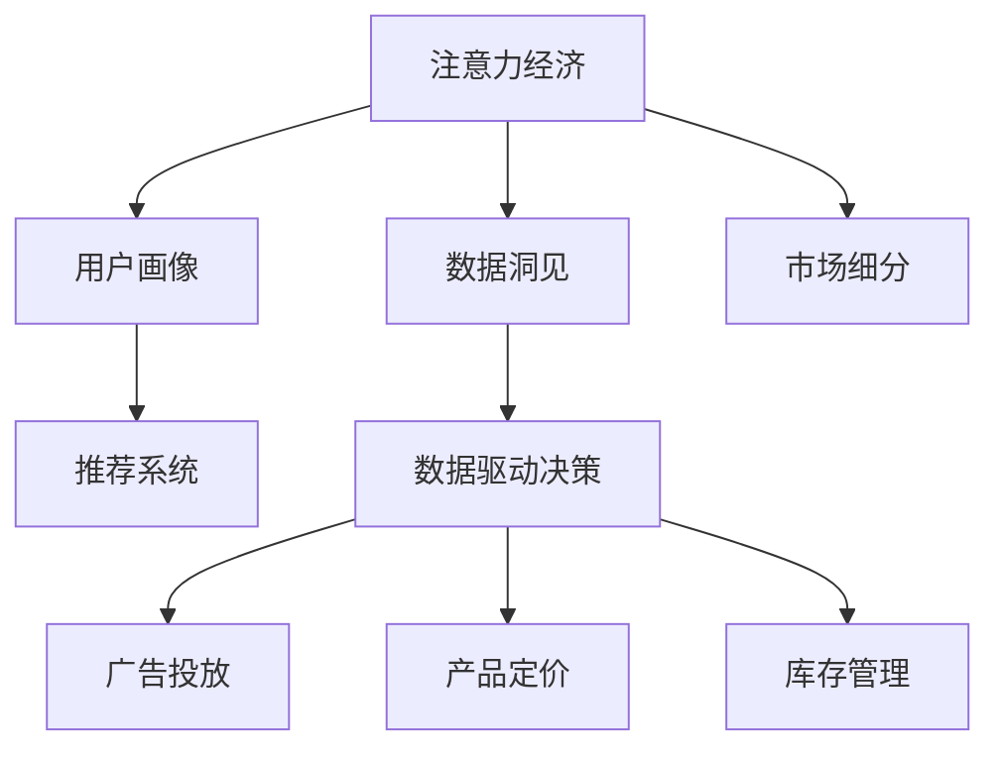

                 

# 注意力经济与数据分析洞见：利用数据理解受众行为

> 关键词：注意力经济, 数据分析, 受众行为, 数据洞见, 数据驱动决策, 大数据, 用户画像, 市场细分, 推荐系统

## 1. 背景介绍

### 1.1 问题由来
在数字化时代，注意力经济成为争夺消费者视线的关键。越来越多的企业和组织利用数据分析，以深入理解受众行为，制定个性化营销策略。注意力经济的核心在于如何通过数据洞见，精准触达并满足消费者的需求，从而实现商业价值的最大化。

### 1.2 问题核心关键点
如何利用数据洞见准确捕捉用户行为，构建全面的用户画像，进行有效的市场细分，并驱动精准的营销决策，是注意力经济中的核心问题。通过数据分析技术，可以从大规模数据中挖掘出有价值的洞察，指导产品设计、定价策略、广告投放等各个环节，使企业能够在激烈的市场竞争中脱颖而出。

### 1.3 问题研究意义
研究注意力经济与数据分析的结合，有助于企业更好地理解受众行为，优化资源配置，提高营销效率，最终实现用户增长和市场份额的提升。同时，通过数据驱动的决策，可以降低试错成本，提高营销活动的精准度和ROI，为企业的长期发展奠定坚实基础。

## 2. 核心概念与联系

### 2.1 核心概念概述

为更好地理解注意力经济与数据分析技术的应用，本节将介绍几个密切相关的核心概念：

- 注意力经济(Attention Economy)：指在数字化时代，消费者注意力成为稀缺资源，企业和组织通过数据分析挖掘用户需求，实现精细化营销，争夺消费者注意力的一种经济模式。
- 数据洞见(Data Insights)：指通过数据分析挖掘出的对业务决策有指导意义的洞察。
- 用户画像(User Persona)：通过数据分析构建的用户档案，包含用户的基本信息、行为特征、兴趣爱好等，用于指导个性化营销。
- 市场细分(Market Segmentation)：根据用户特征和行为数据，将市场划分为不同的细分市场，以便针对性地制定营销策略。
- 推荐系统(Recommendation System)：利用用户行为数据，向用户推荐可能感兴趣的产品或内容，提高用户体验和满意度。
- 数据驱动决策(Data-Driven Decision Making)：基于数据洞见，制定业务决策，而非依赖主观经验或直觉。

这些核心概念之间的逻辑关系可以通过以下Mermaid流程图来展示：



这个流程图展示了大数据技术在注意力经济中的应用路径：

1. 从注意力经济中提取数据洞见。
2. 基于数据洞见构建用户画像。
3. 利用用户画像进行市场细分。
4. 根据市场细分结果，指导推荐系统进行个性化推荐。
5. 以数据驱动决策为基础，优化广告投放、产品定价、库存管理等各环节。

## 3. 核心算法原理 & 具体操作步骤
### 3.1 算法原理概述

注意力经济与数据分析的核心在于利用数据洞见，优化营销策略，提升用户价值。其基本流程包括以下几个步骤：

1. 数据收集：收集用户行为数据、市场数据、广告效果等相关信息。
2. 数据清洗与预处理：处理缺失值、异常值，进行特征工程。
3. 数据分析：应用统计分析、机器学习、深度学习等技术，挖掘数据洞见。
4. 用户画像构建：根据数据分析结果，构建详细的用户画像。
5. 市场细分：利用用户画像，进行市场细分，制定针对性的营销策略。
6. 推荐系统优化：优化推荐算法，提高推荐效果，增强用户粘性。
7. 决策支持：将数据洞见应用于决策过程中，提高业务决策的科学性和精准度。

### 3.2 算法步骤详解

#### 3.2.1 数据收集

数据收集是注意力经济与数据分析的基础。常见的数据来源包括：

- 用户行为数据：用户在网站、应用、广告上的点击、浏览、停留时间、购买等行为数据。
- 社交媒体数据：用户在社交平台上的点赞、评论、分享等互动数据。
- 用户反馈数据：通过调查问卷、客服互动等方式收集的用户满意度、评价等反馈信息。
- 市场环境数据：宏观经济指标、竞争对手动态、行业趋势等环境数据。

数据收集需遵循隐私保护原则，确保合法合规。

#### 3.2.2 数据清洗与预处理

数据清洗是确保数据分析质量的关键步骤。数据预处理流程包括：

1. 数据去重：去除重复数据，确保数据的唯一性。
2. 缺失值处理：填补缺失值，如均值填补、插值法等。
3. 异常值检测：识别并处理异常值，确保数据分布的合理性。
4. 特征工程：提取、选择、转换特征，确保数据的可用性。
5. 数据标准化：对数据进行归一化、标准化处理，提高算法效率。

#### 3.2.3 数据分析

数据分析是利用数据洞见，指导营销策略制定的核心环节。数据分析方法包括：

- 描述性统计：利用统计指标描述数据特征，如均值、中位数、方差等。
- 探索性数据分析：通过可视化、聚类等方法，探索数据分布和关系。
- 统计推断：利用样本数据估计总体特征，如假设检验、置信区间等。
- 机器学习：利用训练算法，预测用户行为和市场趋势。
- 深度学习：利用神经网络模型，处理复杂非线性关系，提取更深层次的洞见。

#### 3.2.4 用户画像构建

用户画像是基于数据分析结果，构建的详细用户档案。构建流程包括：

1. 数据汇总：将用户行为、社交媒体数据、反馈信息等数据进行汇总。
2. 特征选择：选择最具代表性的特征，如年龄、性别、兴趣、消费习惯等。
3. 数据可视化：通过图表、报告等方式，展示用户画像。
4. 用户分组：将用户分为不同群组，便于制定针对性策略。

#### 3.2.5 市场细分

市场细分是利用用户画像，将市场划分为不同的细分市场。细分方法包括：

- 人口统计细分：根据年龄、性别、收入等人口统计特征进行细分。
- 心理细分：根据用户心理特征，如价值观、兴趣、生活方式等进行细分。
- 行为细分：根据用户行为特征，如购买行为、使用频率、忠诚度等进行细分。
- 地理细分：根据地理位置、文化背景等进行细分。

#### 3.2.6 推荐系统优化

推荐系统是利用用户画像，实现个性化推荐的关键工具。优化方法包括：

1. 模型选择：选择合适的推荐算法，如协同过滤、基于内容的推荐、深度学习推荐等。
2. 数据增强：通过数据增强技术，提高模型的泛化能力。
3. 特征工程：优化特征选择、提取、转换等步骤，提高模型效果。
4. 模型评估：通过交叉验证、A/B测试等方法，评估模型性能。
5. 模型调优：根据评估结果，进行模型调优。

#### 3.2.7 决策支持

决策支持是将数据洞见应用于决策过程，优化业务决策。决策支持方法包括：

1. 决策指标：制定决策指标，如转化率、ROI、用户满意度等。
2. 数据可视化：利用可视化工具展示数据洞见，支持决策分析。
3. 模型应用：将推荐系统、市场细分结果等应用于实际业务决策中。
4. 反馈优化：根据业务效果，持续优化模型和策略。

### 3.3 算法优缺点

注意力经济与数据分析技术具有以下优点：

- 提升决策精准度：基于数据洞见，制定决策，降低试错成本，提高营销活动的精准度。
- 提高用户满意度：通过个性化推荐，增强用户体验，提高用户粘性和满意度。
- 优化资源配置：通过市场细分，实现精准营销，优化资源配置，提高ROI。

同时，该技术也存在一些局限性：

- 数据隐私问题：大量数据收集和分析可能引发隐私保护问题，需合规处理。
- 数据质量要求高：高质量的数据是数据洞见的基础，数据收集、清洗工作量较大。
- 模型复杂度高：深度学习模型复杂度高，计算资源需求大，优化难度大。
- 结果解释性不足：数据驱动决策的结果往往缺乏可解释性，难以进行调试和优化。

尽管存在这些局限性，但就目前而言，基于数据分析的决策支持技术已经成为企业优化营销策略的重要手段。未来相关研究的重点在于如何进一步提高数据隐私保护、降低数据获取和清洗成本、优化模型性能和解释性，以更好地发挥数据洞见的应用价值。

### 3.4 算法应用领域

注意力经济与数据分析技术在多个领域得到广泛应用，包括但不限于：

- 电子商务：通过用户行为分析，优化商品推荐、个性化定价、广告投放等，提升转化率和用户满意度。
- 金融服务：利用用户画像和市场细分，制定针对性的金融产品和服务，提高客户粘性和盈利能力。
- 健康医疗：通过分析用户健康数据，提供个性化健康建议和服务，提升用户健康水平和生活质量。
- 教育培训：利用用户学习行为数据，制定个性化学习路径，提高学习效果和用户满意度。
- 媒体娱乐：通过用户互动数据，优化内容推荐，提高用户观看时长和内容消费。
- 能源环保：通过分析用户能源使用数据，优化能源分配和管理，推动绿色可持续发展。

这些应用领域展示了数据洞见在实际业务中的广泛应用，证明了基于数据分析的决策支持技术在提升企业竞争力和用户体验方面的巨大潜力。

## 4. 数学模型和公式 & 详细讲解  
### 4.1 数学模型构建

本节将使用数学语言对注意力经济与数据分析技术的应用进行更加严格的刻画。

记用户行为数据集为 $D=\{(x_i,y_i)\}_{i=1}^N, x_i \in \mathcal{X}, y_i \in \mathcal{Y}$，其中 $\mathcal{X}$ 为用户行为特征空间，$\mathcal{Y}$ 为标签空间。假设用户画像为 $P=\{(p_{ui})\}_{i=1}^N, p_{ui} \in \mathcal{P}$，其中 $\mathcal{P}$ 为用户画像特征空间。

定义目标函数 $L(D, P, \theta)$，表示基于用户行为数据和用户画像，优化营销策略的目标函数。则目标函数优化问题为：

$$
\hat{\theta} = \mathop{\arg\min}_{\theta} L(D, P, \theta)
$$

其中 $\theta$ 为优化变量，包括推荐算法、市场细分策略等。

### 4.2 公式推导过程

以下我们以协同过滤推荐系统为例，推导基于用户画像的推荐模型公式。

假设用户 $u$ 对物品 $i$ 的评分 $r_{ui}$ 为 $N$ 个用户行为数据 $D$ 的加权和，即：

$$
r_{ui} = \sum_{v \in U} \alpha_v p_{vi} \times r_{vui}
$$

其中 $U$ 为所有用户集合，$p_{vi}$ 为用户画像特征，$N$ 为正则化系数，$\alpha_v$ 为权重系数。

设用户画像特征矩阵为 $P=[p_{ui}]$，用户行为评分矩阵为 $R=[r_{ui}]$，则协同过滤推荐模型可以表示为：

$$
\hat{r}_{ui} = \frac{\sum_{v \in U} \alpha_v p_{vi} \times r_{vui}}{\sqrt{\sum_{v \in U} \alpha_v p_{vi}^2 + \epsilon}}
$$

其中 $\epsilon$ 为正则化项，避免分母为零的情况。

### 4.3 案例分析与讲解

假设某电子商务平台希望提高新用户的购买转化率。平台收集了用户的历史购买记录和浏览行为数据，通过协同过滤算法进行个性化推荐。用户画像特征包括年龄、性别、地域、浏览时长等，目标函数为：

$$
L(D, P, \theta) = \sum_{i \in I} \max_{u \in U}(\hat{r}_{ui} - r_{ui})
$$

其中 $I$ 为物品集合。

通过对用户画像和行为数据的优化，平台能够更准确地预测用户对不同物品的评分，进而推荐用户最可能感兴趣的商品，提升转化率和用户满意度。

## 5. 项目实践：代码实例和详细解释说明
### 5.1 开发环境搭建

在进行注意力经济与数据分析项目实践前，我们需要准备好开发环境。以下是使用Python进行PyTorch开发的环境配置流程：

1. 安装Anaconda：从官网下载并安装Anaconda，用于创建独立的Python环境。

2. 创建并激活虚拟环境：
```bash
conda create -n data-sci-env python=3.8 
conda activate data-sci-env
```

3. 安装PyTorch：根据CUDA版本，从官网获取对应的安装命令。例如：
```bash
conda install pytorch torchvision torchaudio cudatoolkit=11.1 -c pytorch -c conda-forge
```

4. 安装相关库：
```bash
pip install pandas numpy matplotlib seaborn scikit-learn jupyter notebook
```

5. 安装Scikit-learn：用于数据预处理和建模。
```bash
conda install scikit-learn
```

6. 安装TensorBoard：用于模型训练过程中的可视化。
```bash
pip install tensorboard
```

完成上述步骤后，即可在`data-sci-env`环境中开始注意力经济与数据分析的实践。

### 5.2 源代码详细实现

下面我们以协同过滤推荐系统为例，给出使用Scikit-learn和TensorBoard进行数据洞见挖掘和推荐系统优化的PyTorch代码实现。

首先，定义数据预处理函数：

```python
import pandas as pd
import numpy as np
from sklearn.preprocessing import StandardScaler, MinMaxScaler

def preprocess_data(df):
    # 数据清洗
    df = df.dropna()
    df = df.drop_duplicates()
    
    # 特征工程
    features = df[['age', 'gender', 'region', 'browse_time']]
    labels = df['buy']
    
    # 标准化处理
    features = StandardScaler().fit_transform(features)
    
    # 数据增强
    features = MinMaxScaler().fit_transform(features)
    
    return features, labels
```

然后，定义协同过滤推荐模型：

```python
from sklearn.metrics.pairwise import cosine_similarity
from scipy.sparse import csr_matrix
import torch

def collaborative_filtering(features, labels):
    n_users, n_features = features.shape
    n_items = labels.nunique()
    
    # 构建用户-物品评分矩阵
    R = csr_matrix((labels, (np.arange(n_users), labels)), shape=(n_users, n_items))
    
    # 计算用户画像相似度
    S = cosine_similarity(features)
    
    # 初始化模型参数
    user_bias = torch.zeros(n_users, n_items)
    item_bias = torch.zeros(n_items)
    
    for u in range(n_users):
        for i in range(n_items):
            user_score = user_bias[u, i] + np.dot(S[u], labels)[i]
            user_bias[u, i] = user_score
    
    return user_bias, item_bias
```

接着，定义模型评估函数：

```python
from sklearn.metrics import precision_recall_curve, auc

def evaluate_model(user_bias, item_bias, test_features, test_labels):
    n_users, n_items = user_bias.shape
    n_test = test_features.shape[0]
    
    # 计算预测评分
    predictions = torch.stack([torch.sigmoid(user_bias[u] + test_features[i] @ item_bias) for u in range(n_users) for i in range(n_test)])
    
    # 计算精确率和召回率
    precision, recall, _ = precision_recall_curve(test_labels, predictions)
    
    # 计算AUC
    auc_score = auc(recall, precision)
    
    return auc_score
```

最后，启动模型训练流程：

```python
from sklearn.model_selection import train_test_split
from tensorboard import SummaryWriter

# 加载数据
df = pd.read_csv('data.csv')

# 数据预处理
features, labels = preprocess_data(df)

# 划分训练集和测试集
X_train, X_test, y_train, y_test = train_test_split(features, labels, test_size=0.2)

# 训练模型
user_bias, item_bias = collaborative_filtering(X_train, y_train)

# 模型评估
auc_score = evaluate_model(user_bias, item_bias, X_test, y_test)
print(f'AUC Score: {auc_score:.3f}')

# 可视化结果
writer = SummaryWriter()
writer.add_scalar('AUC', auc_score, 0)
writer.close()
```

以上就是使用Scikit-learn和TensorBoard进行数据洞见挖掘和推荐系统优化的完整代码实现。可以看到，Scikit-learn提供了丰富的数据预处理和模型评估工具，TensorBoard则提供了强大的可视化功能，方便开发者对模型进行监控和调试。

### 5.3 代码解读与分析

让我们再详细解读一下关键代码的实现细节：

**preprocess_data函数**：
- 数据清洗：去除缺失值和重复记录，确保数据完整性和唯一性。
- 特征工程：选择关键特征，如年龄、性别、地域、浏览时长等。
- 标准化处理：通过标准化和最小最大缩放，将数据缩放到[0,1]区间，提高模型性能。
- 数据增强：通过数据增强技术，如归一化、标准化等，提高模型泛化能力。

**collaborative_filtering函数**：
- 构建用户-物品评分矩阵：利用用户的购买行为构建评分矩阵，表示用户对物品的评分。
- 计算用户画像相似度：通过余弦相似度计算用户画像的相似度。
- 初始化模型参数：利用用户画像相似度和评分矩阵，初始化用户偏置和物品偏置。
- 计算预测评分：利用用户偏置、物品偏置和用户画像相似度，计算用户对物品的预测评分。

**evaluate_model函数**：
- 计算预测评分：利用模型参数和测试数据，计算预测评分。
- 计算精确率和召回率：通过精确率-召回率曲线，评估模型的性能。
- 计算AUC：通过计算AUC值，评估模型的预测能力。

**训练流程**：
- 加载数据：从文件中读取数据。
- 数据预处理：调用数据预处理函数。
- 划分训练集和测试集：将数据划分为训练集和测试集。
- 训练模型：调用协同过滤推荐模型函数。
- 模型评估：计算模型在测试集上的AUC值。
- 可视化结果：使用TensorBoard记录AUC值，方便后续分析。

可以看到，通过合理利用Scikit-learn和TensorBoard等工具，可以轻松实现数据洞见挖掘和推荐系统优化的项目实践。开发者可以将更多精力放在模型设计和参数调优上，而不必过多关注底层的实现细节。

当然，工业级的系统实现还需考虑更多因素，如模型的保存和部署、超参数的自动搜索、更灵活的任务适配层等。但核心的推荐范式基本与此类似。

## 6. 实际应用场景
### 6.1 智能客服系统

基于数据洞见的智能客服系统，能够通过分析用户的历史咨询记录，识别常见问题和需求，提供智能化的回答和服务。

在技术实现上，可以收集用户的咨询记录和反馈信息，构建用户画像，利用协同过滤等推荐算法，推荐用户可能感兴趣的服务类型和问题解决方案。同时，通过持续监控用户互动数据，不断优化推荐模型，提升客服系统的效率和效果。

### 6.2 个性化推荐系统

个性化推荐系统是利用数据洞见，提升用户体验的关键工具。通过分析用户的历史行为数据，推荐用户可能感兴趣的产品或内容，提高用户粘性和满意度。

在实践过程中，可以构建详细的用户画像，利用协同过滤、基于内容的推荐等算法，实现个性化推荐。同时，通过用户反馈数据，持续优化推荐算法和策略，确保推荐内容的相关性和时效性。

### 6.3 营销策略优化

数据洞见可以帮助企业优化营销策略，提高营销活动的精准度和效果。通过分析用户行为数据和市场环境数据，制定针对性营销策略，实现用户增长和市场份额的提升。

在具体实施中，可以构建详细的用户画像，利用市场细分技术，将市场划分为不同的细分市场。通过分析各细分市场的特征和需求，制定个性化的营销策略，优化资源配置，提高ROI。

### 6.4 未来应用展望

随着数据洞见技术的不断进步，其应用范围将进一步拓展，带来更多创新和突破：

1. 智能广告投放：利用用户画像和行为数据，实现精准的广告投放，提高广告点击率和转化率。
2. 用户行为预测：通过预测用户行为，优化产品设计和服务流程，提升用户体验和满意度。
3. 实时市场分析：利用数据洞见，实时分析市场趋势和变化，指导业务决策，保持市场竞争优势。
4. 个性化内容生成：利用数据洞见，生成个性化的推荐内容，增强用户互动和粘性。
5. 金融风险控制：通过分析用户行为数据，预测金融风险，制定风险控制策略，提高金融机构的安全性和稳定性。
6. 健康管理优化：利用健康数据，提供个性化健康建议和服务，提升用户健康水平和生活质量。

这些应用领域展示了数据洞见在实际业务中的广泛应用，证明了基于数据分析的决策支持技术在提升企业竞争力和用户体验方面的巨大潜力。

## 7. 工具和资源推荐
### 7.1 学习资源推荐

为了帮助开发者系统掌握注意力经济与数据分析技术，这里推荐一些优质的学习资源：

1. 《数据科学导论》书籍：系统介绍数据科学的基本概念和关键技术，适合入门学习。
2. 《Python数据分析》书籍：详细介绍Python在数据分析中的应用，涵盖数据清洗、特征工程、模型评估等环节。
3. Coursera《数据科学与机器学习》课程：由斯坦福大学开设的高级课程，深入讲解数据科学和机器学习的基础理论和方法。
4. Kaggle数据科学竞赛：通过实际数据竞赛，锻炼数据处理、建模和优化能力。
5. Kaggle《数据科学家入门》课程：适合初学者的入门课程，通过实践项目提高数据处理和建模技能。

通过对这些资源的学习实践，相信你一定能够快速掌握注意力经济与数据分析技术的精髓，并用于解决实际的业务问题。
###  7.2 开发工具推荐

高效的开发离不开优秀的工具支持。以下是几款用于注意力经济与数据分析开发的常用工具：

1. Python：数据科学和机器学习的主流语言，语法简洁，库丰富，适合数据洞见挖掘和模型优化。
2. Jupyter Notebook：交互式编程环境，支持代码单元格、代码块、数据可视化和解释，适合数据分析和模型评估。
3. TensorBoard：TensorFlow配套的可视化工具，可实时监测模型训练状态，提供丰富的图表呈现方式。
4. Weights & Biases：模型训练的实验跟踪工具，可以记录和可视化模型训练过程中的各项指标，方便对比和调优。
5. Scikit-learn：Python的机器学习库，提供丰富的算法和工具，适合数据预处理、特征工程和模型评估。
6. Pandas：数据处理和分析的Python库，支持高效的数据清洗和特征提取。
7. NumPy：高效的多维数组运算库，适合处理大规模数据集。

合理利用这些工具，可以显著提升注意力经济与数据分析任务的开发效率，加快创新迭代的步伐。

### 7.3 相关论文推荐

注意力经济与数据分析技术的发展源于学界的持续研究。以下是几篇奠基性的相关论文，推荐阅读：

1. 《Data Mining and Statistical Learning》书籍：介绍数据挖掘和统计学习的经典方法，涵盖各种数据洞见挖掘技术。
2. 《Advances in Neural Information Processing Systems》会议论文：NIPS会议是机器学习和人工智能领域的顶级会议，汇集了大量前沿研究论文。
3. 《Journal of Marketing Research》期刊论文：营销研究领域的顶级期刊，发表了大量关于市场细分、推荐系统、用户行为预测等的研究论文。
4. 《Natural Language Processing with Python》书籍：介绍Python在自然语言处理中的应用，涵盖各种文本数据挖掘和分析方法。
5. 《Recommender Systems Handbook》书籍：推荐系统领域的经典著作，涵盖协同过滤、基于内容的推荐、深度学习推荐等技术。

这些论文代表了大数据技术在注意力经济中的应用前景，通过学习这些前沿成果，可以帮助研究者把握学科前进方向，激发更多的创新灵感。

## 8. 总结：未来发展趋势与挑战
### 8.1 总结

本文对注意力经济与数据分析技术的应用进行了全面系统的介绍。首先阐述了注意力经济的背景和意义，明确了数据洞见在提升企业竞争力和用户体验方面的关键作用。其次，从原理到实践，详细讲解了注意力经济与数据分析的核心流程，给出了数据分析任务开发的完整代码实例。同时，本文还广泛探讨了数据洞见在智能客服、个性化推荐、营销策略优化等多个行业领域的应用前景，展示了数据洞见在实际业务中的广泛应用。最后，本文精选了数据分析技术的各类学习资源，力求为读者提供全方位的技术指引。

通过本文的系统梳理，可以看到，基于数据洞见和数据分析的决策支持技术正在成为企业优化营销策略的重要手段，极大地提升了企业的市场竞争力和用户体验。未来，伴随数据洞见技术的不断发展，更多的创新应用和突破将出现，数据驱动的决策支持技术必将在更多领域大放异彩。

### 8.2 未来发展趋势

展望未来，注意力经济与数据分析技术将呈现以下几个发展趋势：

1. 数据洞见的深入挖掘：通过更高效、更精确的算法，从大规模数据中提取更深层次、更全面的洞见，指导更精准的业务决策。
2. 多模态数据的融合：将文本、图像、音频、视频等多种数据源融合，构建更全面、更复杂的用户画像，实现更精细化的市场细分和推荐。
3. 实时数据处理：利用大数据技术，实现实时数据处理和分析，快速响应市场变化，保持竞争优势。
4. 隐私保护与合规：随着数据隐私法规的日益严格，如何在大数据分析中兼顾数据洞见与隐私保护，成为重要的研究课题。
5. 跨领域知识整合：将不同领域的知识，如符号化的规则、先验知识等，与神经网络模型结合，提高模型的智能水平。
6. 人工智能与数据分析的融合：利用深度学习等人工智能技术，提升数据分析模型的精度和泛化能力，推动数据洞见的深入挖掘和应用。

这些趋势凸显了注意力经济与数据分析技术的广阔前景。这些方向的探索发展，必将进一步提升数据分析模型的性能和应用范围，为更多企业带来商业价值。

### 8.3 面临的挑战

尽管注意力经济与数据分析技术已经取得了显著进展，但在迈向更加智能化、普适化应用的过程中，仍面临诸多挑战：

1. 数据隐私问题：大规模数据收集和分析可能引发隐私保护问题，需合规处理。
2. 数据质量要求高：高质量的数据是数据洞见的基础，数据收集和清洗工作量较大。
3. 模型复杂度高：深度学习模型复杂度高，计算资源需求大，优化难度大。
4. 结果解释性不足：数据驱动决策的结果往往缺乏可解释性，难以进行调试和优化。
5. 实时数据处理难度大：实时数据处理要求高，需要更高效的算法和更大的计算资源。
6. 跨领域知识整合复杂：不同领域知识的整合需要复杂的算法和大量的数据，难度较大。

尽管存在这些挑战，但就目前而言，基于数据分析的决策支持技术已经成为企业优化营销策略的重要手段。未来相关研究的重点在于如何进一步提高数据隐私保护、降低数据获取和清洗成本、优化模型性能和解释性，以更好地发挥数据洞见的应用价值。

### 8.4 研究展望

面对注意力经济与数据分析技术所面临的挑战，未来的研究需要在以下几个方面寻求新的突破：

1. 探索无监督和半监督数据分析方法。摆脱对大规模标注数据的依赖，利用自监督学习、主动学习等无监督和半监督范式，最大限度利用非结构化数据，实现更加灵活高效的数据洞见挖掘。
2. 研究高效的实时数据处理技术。开发更高效、更灵活的算法，实现实时数据清洗、特征工程和模型训练，满足实时数据处理的需求。
3. 探索多模态数据分析方法。将文本、图像、音频、视频等多种数据源融合，构建更全面、更复杂的用户画像，实现更精细化的市场细分和推荐。
4. 研究跨领域知识整合技术。将符号化的先验知识，如知识图谱、逻辑规则等，与神经网络模型进行巧妙融合，引导数据分析过程学习更准确、合理的语言模型。
5. 引入博弈论和因果推断工具。通过引入博弈论工具刻画人机交互过程，主动探索并规避模型的脆弱点，提高系统稳定性。同时利用因果推断方法，建立数据洞见与业务决策之间的因果关系，增强结果的可解释性。
6. 纳入伦理道德约束。在模型训练目标中引入伦理导向的评估指标，过滤和惩罚有偏见、有害的输出倾向。同时加强人工干预和审核，建立模型行为的监管机制，确保输出符合人类价值观和伦理道德。

这些研究方向的探索，必将引领注意力经济与数据分析技术迈向更高的台阶，为构建安全、可靠、可解释、可控的智能系统铺平道路。面向未来，数据洞见技术需要与其他人工智能技术进行更深入的融合，如知识表示、因果推理、强化学习等，多路径协同发力，共同推动数据分析模型的进步。

## 9. 附录：常见问题与解答

**Q1：如何确保数据隐私保护？**

A: 数据隐私保护是数据洞见应用中的重要问题。主要措施包括：
1. 数据匿名化：将用户信息进行匿名化处理，去除个人身份信息。
2. 数据去标识化：通过数据脱敏、扰动等方法，确保数据无法被反向识别。
3. 合规处理：遵守相关法律法规，如GDPR、CCPA等，确保数据收集和处理合法合规。
4. 访问控制：对数据访问进行严格控制，仅授权可信用户和机构访问。

**Q2：如何降低数据获取和清洗成本？**

A: 降低数据获取和清洗成本是数据洞见应用的瓶颈。主要措施包括：
1. 自动化数据采集：利用爬虫等工具自动获取数据，提高效率。
2. 数据共享平台：利用开放数据平台，共享公共数据资源，减少数据获取成本。
3. 数据清洗工具：使用自动化数据清洗工具，减少人工干预，提高清洗效率。
4. 数据预处理：预处理工具和库，如Pandas、NumPy等，提高数据处理效率。

**Q3：如何提高数据分析模型的可解释性？**

A: 数据分析模型的可解释性是其应用的重要考量。主要措施包括：
1. 模型简化：通过简化模型结构，降低复杂度，提高可解释性。
2. 特征工程：通过特征工程，选择更具解释性的特征，提高模型的可解释性。
3. 可视化工具：使用可视化工具，如TensorBoard、matplotlib等，展示模型的决策过程，增强可解释性。
4. 解释性算法：使用解释性较强的算法，如线性回归、决策树等，提高模型的可解释性。

**Q4：如何优化推荐系统？**

A: 推荐系统是数据分析应用的重要工具。主要措施包括：
1. 算法选择：选择合适的推荐算法，如协同过滤、基于内容的推荐、深度学习推荐等。
2. 数据增强：通过数据增强技术，提高模型的泛化能力。
3. 特征工程：优化特征选择、提取、转换等步骤，提高模型效果。
4. 模型评估：通过交叉验证、A/B测试等方法，评估模型性能。
5. 模型调优：根据评估结果，进行模型调优。

**Q5：如何应对数据多样性？**

A: 应对数据多样性是数据分析应用中的常见问题。主要措施包括：
1. 数据清洗：处理缺失值、异常值，进行数据清洗。
2. 数据标准化：对不同来源的数据进行标准化处理，确保数据一致性。
3. 数据融合：将不同类型的数据进行融合，构建统一的数据集。
4. 多模态分析：利用多模态数据，提高数据分析的全面性和准确性。

这些措施能够帮助企业在数据洞见应用中更好地保护隐私、降低成本、提高可解释性和应对多样性，从而实现更精准、更高效的营销决策。

---

作者：禅与计算机程序设计艺术 / Zen and the Art of Computer Programming

