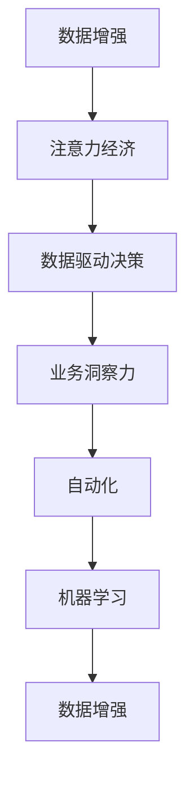

                 

# 注意力经济与数据驱动的决策制定：利用数据增强业务洞察力

> 关键词：数据增强, 注意力经济, 决策制定, 数据驱动, 业务洞察力, 自动化, 机器学习

## 1. 背景介绍

### 1.1 问题由来

随着信息爆炸和互联网的高速发展，我们正处在注意力经济的新时代。企业、政府、科研机构等纷纷将数据作为核心资产，通过数据分析和挖掘，制定出更精准、更高效的决策。然而，数据数量多、质量参差不齐、维度高、结构复杂等问题，给数据的获取、存储、清洗和利用带来了巨大的挑战。

以零售业为例，传统上，商家主要依据销售数据和市场调研进行产品定价和库存管理，但在电商平台的推动下，通过精准推荐、个性化营销等手段，对客户行为的预测变得越来越重要。如何高效利用海量数据，挖掘隐藏的商业价值，指导决策，提升运营效率，成为当下的一大难题。

### 1.2 问题核心关键点

要解决上述问题，需要借助数据增强技术，进一步提升数据的完备性、丰富性和多样性。所谓数据增强，是指在不增加额外成本的情况下，通过对原始数据进行一系列变换，生成更多、更丰富、更均衡的数据，以提高模型的泛化能力和决策的准确性。

数据增强的核心在于：
1. 扩充训练样本。使用各种数据增强技术生成新的训练样本，防止模型对训练数据进行过拟合。
2. 丰富数据维度。引入多样化的数据源、特征，增强模型的鲁棒性和泛化能力。
3. 保持数据分布一致性。通过合理的数据变换，确保数据增强后的分布与原始数据一致，避免模型学习到数据分布的偏差。

## 2. 核心概念与联系

### 2.1 核心概念概述

为了深入理解数据增强在注意力经济和决策制定中的作用，本节将介绍几个关键概念：

- **数据增强**：通过对原始数据进行一系列变换，生成更多、更丰富、更均衡的数据，提升模型的泛化能力和决策准确性。
- **注意力经济**：在信息爆炸的时代，企业的核心资产不再是传统的资金、人力资源，而是注意力，即客户对品牌、产品的关注度和投入。
- **数据驱动决策**：指通过数据分析、挖掘和应用，辅助企业制定科学、合理的决策，提升决策的效率和效果。
- **业务洞察力**：指企业利用数据技术，洞察市场趋势、客户行为、竞争状况等，做出更加精准的商业判断。
- **自动化**：通过数据驱动技术，自动化执行决策、运营等任务，提升企业的运营效率。
- **机器学习**：指利用算法和统计模型，从数据中学习规律和知识，辅助决策制定。

这些核心概念之间有着紧密的联系。通过数据增强技术，企业可以获取更多、更丰富、更均衡的数据，驱动数据驱动决策，提升业务洞察力，自动化执行任务，最终实现注意力经济的最大化。

### 2.2 核心概念原理和架构的 Mermaid 流程图



以上Mermaid流程图展示了数据增强在注意力经济和决策制定中的作用路径：

1. 通过数据增强获取更多、更丰富、更均衡的数据。
2. 数据驱动决策，利用增强后的数据，提升决策的科学性和准确性。
3. 增强业务洞察力，更全面地理解和预测市场和客户行为。
4. 自动化执行决策和运营任务，提升效率。
5. 使用机器学习技术，从数据中学习规律和知识，辅助决策。

## 3. 核心算法原理 & 具体操作步骤

### 3.1 算法原理概述

数据增强的核心在于对原始数据进行一系列变换，生成新的训练样本。常用的数据增强方法包括：
1. 图像领域：旋转、翻转、裁剪、缩放、添加噪声等。
2. 文本领域：同义词替换、随机插入、随机删除、洗词等。
3. 时间序列：平移、缩放、添加白噪声等。

这些变换通过合理的设计，可以生成与原始数据相似但不同的样本，丰富数据集，提升模型的泛化能力。同时，数据增强还可以帮助模型学习到更多数据分布的信息，提高决策的鲁棒性和稳定性。

### 3.2 算法步骤详解

数据增强的具体步骤包括：
1. 收集原始数据集，包括训练集、验证集和测试集。
2. 对训练集进行数据增强，生成新的训练样本。
3. 将增强后的训练集和原始验证集、测试集合并，重新划分数据集。
4. 使用增强后的数据集，训练机器学习模型。
5. 在验证集和测试集上评估模型性能，调整模型参数。
6. 重复上述过程，直到模型性能达到预期。

### 3.3 算法优缺点

数据增强技术在提升模型泛化能力、增强决策稳定性方面有显著优势，但其也有如下缺点：
1. 生成样本的质量不稳定。部分数据增强方法可能会引入噪声，影响模型的性能。
2. 数据增强的复杂度较高。需要根据具体领域和数据特点，设计合适的增强策略。
3. 数据增强可能导致过拟合。增强后的数据与原始数据分布不一致，可能会影响模型泛化能力。
4. 数据增强需要额外的计算资源。某些复杂的数据增强方法可能会增加训练时间和计算成本。

### 3.4 算法应用领域

数据增强技术在多个领域都有广泛的应用，以下是几个典型应用：

- 计算机视觉：如图像分类、目标检测、图像分割等任务。通过旋转、翻转、裁剪等变换生成更多的训练样本，提升模型的泛化能力。
- 自然语言处理：如情感分析、命名实体识别、机器翻译等任务。通过同义词替换、洗词等方法生成新的文本数据，提升模型的语义理解能力。
- 时间序列分析：如股票预测、气象预报、交通流量预测等任务。通过平移、缩放等方法生成更多的历史数据，提升模型的预测精度。
- 机器人学习：如自主导航、对象识别等任务。通过仿射变换、随机移动等方法生成更多的训练数据，提升机器人的感知和决策能力。
- 生物信息学：如蛋白质结构预测、基因表达分析等任务。通过旋转、平移、缩放等方法生成更多的生物序列数据，提升模型的预测准确性。

## 4. 数学模型和公式 & 详细讲解 & 举例说明

### 4.1 数学模型构建

假设原始训练数据集为 $D=\{(x_i,y_i)\}_{i=1}^N$，其中 $x_i$ 表示输入特征，$y_i$ 表示标签。数据增强后的训练数据集为 $D'=\{(x_i',y_i')\}_{i=1}^M$，其中 $x_i'$ 表示增强后的输入特征，$y_i'$ 表示增强后的标签。

数据增强的目标是最大化数据增强后的训练集 $D'$ 与原始训练集 $D$ 的相似性，最小化两者之间的差异。可以使用KL散度、Wasserstein距离等度量方法来衡量两者之间的差异，并据此优化数据增强策略。

### 4.2 公式推导过程

以图像数据增强为例，常用的数据增强方法包括旋转、翻转、缩放等。这些方法的数学公式可以表示为：

- 旋转：$x'_i = R(\theta)x_i$，其中 $R(\theta)$ 为旋转矩阵。
- 翻转：$x'_i = \sigma x_i$，其中 $\sigma$ 为随机选择-1或1的随机变量。
- 缩放：$x'_i = \lambda x_i$，其中 $\lambda$ 为随机选择的缩放因子。

根据这些变换，生成新的训练样本 $(x'_i,y'_i)$。假设原始训练样本为 $x_i$，则数据增强后的样本 $x'_i$ 可以通过以下公式计算：

$$
x'_i = f(x_i)
$$

其中 $f$ 为数据增强函数。例如，对于图像数据增强，$f$ 可以表示为：

$$
f(x_i) = R(\theta)x_i \quad \text{或} \quad f(x_i) = \sigma x_i \quad \text{或} \quad f(x_i) = \lambda x_i
$$

根据增强后的样本 $x'_i$ 和原始标签 $y_i$，可以计算出增强后的标签 $y'_i$。例如，对于图像分类任务，假设 $y_i$ 表示类别编号，则增强后的标签 $y'_i$ 可以表示为：

$$
y'_i = y_i \quad \text{或} \quad y'_i = 1-y_i
$$

根据这些公式，可以生成新的训练样本 $(x'_i,y'_i)$，并使用这些样本进行模型的训练和验证。

### 4.3 案例分析与讲解

以情感分析任务为例，假设原始训练数据集 $D=\{(x_i,y_i)\}_{i=1}^N$，其中 $x_i$ 为评论文本，$y_i$ 为情感标签（0或1）。为了增强数据集，可以使用洗词和同义词替换等方法，生成新的训练样本 $D'=\{(x'_i,y'_i)\}_{i=1}^M$。

具体步骤如下：
1. 收集原始评论数据集 $D$，将其划分为训练集、验证集和测试集。
2. 对于每个训练样本 $x_i$，通过洗词和同义词替换等方法，生成新的训练样本 $x'_i$。例如，将 "sunny" 替换为 "nice"，将 "warm" 替换为 "hot"，得到新的样本 $x'_i$。
3. 对于每个增强后的样本 $x'_i$，根据其情感标签 $y_i$，生成增强后的标签 $y'_i$。例如，将 "positive" 替换为 "positive"，将 "negative" 替换为 "negative"。
4. 将增强后的训练集 $D'$ 与原始验证集、测试集合并，重新划分数据集。
5. 使用增强后的数据集 $D'$ 训练情感分析模型。
6. 在验证集和测试集上评估模型性能，调整模型参数。
7. 重复上述过程，直到模型性能达到预期。

## 5. 项目实践：代码实例和详细解释说明

### 5.1 开发环境搭建

在进行数据增强实践前，我们需要准备好开发环境。以下是使用Python进行TensorFlow开发的环境配置流程：

1. 安装Anaconda：从官网下载并安装Anaconda，用于创建独立的Python环境。

2. 创建并激活虚拟环境：
```bash
conda create -n tensorflow-env python=3.8 
conda activate tensorflow-env
```

3. 安装TensorFlow：
```bash
pip install tensorflow
```

4. 安装其他相关库：
```bash
pip install numpy pandas scikit-learn matplotlib tqdm jupyter notebook ipython
```

完成上述步骤后，即可在`tensorflow-env`环境中开始数据增强实践。

### 5.2 源代码详细实现

这里我们以图像分类任务为例，给出使用TensorFlow进行数据增强的PyTorch代码实现。

首先，定义数据增强函数：

```python
import tensorflow as tf
import numpy as np

def rotate_image(image, angle):
    image = tf.image.rot90(image, angle)
    return image

def flip_image(image):
    image = tf.image.random_flip_left_right(image)
    return image

def scale_image(image, scale_factor):
    image = tf.image.resize(image, [image.shape[0] * scale_factor, image.shape[1] * scale_factor])
    return image

def add_noise(image):
    noise = tf.random.normal(shape=tf.shape(image), mean=0.0, stddev=0.1)
    image = tf.image.add_n(image, noise)
    return image
```

然后，定义数据集：

```python
from tensorflow.keras.datasets import mnist

(x_train, y_train), (x_test, y_test) = mnist.load_data()

x_train = x_train.reshape(-1, 28, 28, 1).astype(np.float32) / 255.0
x_test = x_test.reshape(-1, 28, 28, 1).astype(np.float32) / 255.0

y_train = tf.keras.utils.to_categorical(y_train, num_classes=10)
y_test = tf.keras.utils.to_categorical(y_test, num_classes=10)

def data_augmentation(x, y):
    x_aug = []
    y_aug = []
    for i in range(len(x)):
        x_aug.append(x[i])
        y_aug.append(y[i])
    x_aug.append(rotate_image(x[i], 90))
    y_aug.append(y[i])
    x_aug.append(flip_image(x[i]))
    y_aug.append(y[i])
    x_aug.append(scale_image(x[i], 1.2))
    y_aug.append(y[i])
    x_aug.append(add_noise(x[i]))
    y_aug.append(y[i])
    return np.array(x_aug), np.array(y_aug)

x_train_aug, y_train_aug = data_augmentation(x_train, y_train)
```

最后，定义训练函数：

```python
from tensorflow.keras.models import Sequential
from tensorflow.keras.layers import Conv2D, MaxPooling2D, Flatten, Dense

model = Sequential()
model.add(Conv2D(32, kernel_size=(3, 3), activation='relu', input_shape=(28, 28, 1)))
model.add(MaxPooling2D(pool_size=(2, 2)))
model.add(Conv2D(64, kernel_size=(3, 3), activation='relu'))
model.add(MaxPooling2D(pool_size=(2, 2)))
model.add(Flatten())
model.add(Dense(64, activation='relu'))
model.add(Dense(10, activation='softmax'))

model.compile(optimizer='adam', loss='categorical_crossentropy', metrics=['accuracy'])

model.fit(x_train_aug, y_train_aug, validation_data=(x_test, y_test), epochs=10)
```

以上代码实现了对MNIST数据集的增强，使用旋转、翻转、缩放和噪声等方法生成新的训练样本。可以看到，TensorFlow的API设计非常简洁，方便开发者使用。

### 5.3 代码解读与分析

让我们再详细解读一下关键代码的实现细节：

**数据增强函数**：
- `rotate_image`：对图像进行旋转操作，角度为90度。
- `flip_image`：对图像进行随机左右翻转。
- `scale_image`：对图像进行缩放操作，缩放因子为1.2。
- `add_noise`：对图像添加随机噪声，均值为0，标准差为0.1。

**数据集定义**：
- `mnist.load_data`：从TensorFlow数据集中加载MNIST数据集。
- `x_train, y_train` 和 `x_test, y_test` 的预处理：将原始数据转换成浮点数，并进行归一化处理。
- `to_categorical`：将标签转换为one-hot编码。

**数据增强**：
- `data_augmentation`：对每个训练样本进行增强，生成新的训练样本。
- `x_train_aug` 和 `y_train_aug` 的生成：根据增强后的训练样本，重新生成训练集和标签。

**模型训练**：
- `Sequential`：定义一个序列模型，包含卷积层、池化层、全连接层等。
- `compile`：配置模型的优化器、损失函数和评估指标。
- `fit`：使用增强后的训练数据集进行模型训练，并在测试集上进行验证。

可以看到，TensorFlow提供了丰富的高层次API，大大简化了数据增强和模型训练的代码实现。开发者只需关注模型结构和训练策略，即可快速进行实践。

## 6. 实际应用场景

### 6.1 智慧零售

在智慧零售领域，数据增强技术可以帮助商家更全面地了解客户行为，提升精准营销和个性化推荐的效果。

以电商平台为例，商家可以收集用户的浏览、点击、购买等行为数据，通过数据增强技术生成更多的训练样本，提升模型的泛化能力。例如，对用户浏览行为进行旋转、缩放、翻转等变换，生成新的训练样本，从而更全面地捕捉用户的兴趣点，提升推荐系统的准确性。

### 6.2 金融风控

在金融风控领域，数据增强技术可以帮助银行和金融机构更准确地评估风险，提升反欺诈能力。

以信用卡申请审批为例，金融机构可以收集用户的各种信息，如年龄、收入、职业等，通过数据增强技术生成更多的训练样本，提升模型的泛化能力。例如，对用户年龄进行随机变化，生成新的训练样本，从而更全面地评估用户的信用风险。

### 6.3 智能制造

在智能制造领域，数据增强技术可以帮助企业更精确地预测生产设备的状态，提升生产效率和设备维护的准确性。

以预测设备故障为例，企业可以收集设备的运行数据，如温度、压力、振动等，通过数据增强技术生成更多的训练样本，提升模型的泛化能力。例如，对设备运行数据进行旋转、缩放、翻转等变换，生成新的训练样本，从而更准确地预测设备故障，提前进行维护。

### 6.4 未来应用展望

随着数据增强技术的不断发展，其在更多领域将得到应用，为各行各业带来变革性影响。

在智慧医疗领域，数据增强技术可以帮助医院更准确地诊断疾病，提升诊疗效果。例如，对医学影像数据进行增强，生成更多的训练样本，提升图像分类模型的准确性。

在智能教育领域，数据增强技术可以帮助教育机构更全面地评估学生的学习情况，提升个性化教学的效果。例如，对学生作业进行旋转、缩放、翻转等变换，生成新的训练样本，从而更全面地评估学生的学习情况。

在智慧城市治理中，数据增强技术可以帮助城市管理者更全面地监控和管理城市运行，提升城市管理的自动化和智能化水平。例如，对城市交通数据进行增强，生成更多的训练样本，提升交通预测模型的准确性。

## 7. 工具和资源推荐

### 7.1 学习资源推荐

为了帮助开发者系统掌握数据增强的理论基础和实践技巧，这里推荐一些优质的学习资源：

1. 《深度学习入门：基于TensorFlow的实践》系列博文：由TensorFlow开发者撰写，深入浅出地介绍了深度学习的基本原理和TensorFlow的使用方法。

2. 《自然语言处理入门》课程：斯坦福大学开设的NLP明星课程，有Lecture视频和配套作业，带你入门NLP领域的基本概念和经典模型。

3. 《深度学习框架TensorFlow实战》书籍：深度学习框架TensorFlow的实战指南，涵盖TensorFlow的基本用法和高级技巧。

4. Kaggle数据增强竞赛：Kaggle平台上的数据增强竞赛，通过实际比赛案例，深入理解数据增强的实际应用。

5. GitHub数据增强项目：GitHub上的数据增强项目，包含大量开源代码和实际案例，学习参考价值高。

通过对这些资源的学习实践，相信你一定能够快速掌握数据增强的精髓，并用于解决实际的NLP问题。

### 7.2 开发工具推荐

高效的开发离不开优秀的工具支持。以下是几款用于数据增强开发的常用工具：

1. TensorFlow：由Google主导开发的开源深度学习框架，生产部署方便，适合大规模工程应用。

2. PyTorch：基于Python的开源深度学习框架，灵活动态的计算图，适合快速迭代研究。

3. Keras：Keras提供了高层次的API，方便开发者快速构建和训练模型。

4. OpenCV：开源计算机视觉库，提供了丰富的图像处理功能，如旋转、缩放、翻转等。

5. Scikit-learn：Python机器学习库，提供了丰富的数据处理和机器学习算法，如数据增强、特征提取等。

6. Matplotlib：Python可视化库，用于绘制各种图表，帮助开发者更好地理解数据增强效果。

合理利用这些工具，可以显著提升数据增强任务的开发效率，加快创新迭代的步伐。

### 7.3 相关论文推荐

数据增强技术的发展源于学界的持续研究。以下是几篇奠基性的相关论文，推荐阅读：

1. Cutting Image: A Label-Efficient Training Method for Deep Convolutional Neural Networks（CIFAR-10图像数据增强）：提出了基于剪切的图像数据增强方法，提升了模型的泛化能力。

2. The Data Augmentation Handbook（数据增强手册）：全面介绍了各种数据增强技术，包括图像、文本、音频等领域的增强方法。

3. AutoAugment: Learning Augmentation Strategies from Data（AutoAugment）：提出了一种自动选择数据增强策略的方法，提升了模型的泛化能力。

4. TextDataAugment: Text Data Augmentation for Neural Language Models（文本数据增强）：提出了一种文本数据增强方法，提升了语言模型的语义理解能力。

5. Improving Generalization with Data Augmentation（数据增强提升泛化能力）：从理论角度分析了数据增强提升泛化能力的原因，提供了实验验证。

这些论文代表了大数据增强技术的发展脉络。通过学习这些前沿成果，可以帮助研究者把握学科前进方向，激发更多的创新灵感。

## 8. 总结：未来发展趋势与挑战

### 8.1 研究成果总结

本文对数据增强技术在注意力经济和决策制定中的应用进行了全面系统的介绍。首先阐述了数据增强在获取更多、更丰富、更均衡数据方面的重要意义，明确了数据增强在提升模型泛化能力、增强决策稳定性方面的独特价值。其次，从原理到实践，详细讲解了数据增强的数学原理和关键步骤，给出了数据增强任务开发的完整代码实例。同时，本文还广泛探讨了数据增强方法在智慧零售、金融风控、智能制造等多个行业领域的应用前景，展示了数据增强范式的巨大潜力。

通过本文的系统梳理，可以看到，数据增强技术在数据驱动的决策制定中发挥着越来越重要的作用。数据增强技术的不断演进，将推动企业在更多领域中实现业务升级，提升运营效率，创造更多价值。

### 8.2 未来发展趋势

展望未来，数据增强技术将呈现以下几个发展趋势：

1. 多模态数据增强：除了传统的图像、文本等数据，未来的数据增强将更多地涉及多模态数据，如图像、视频、音频、传感器数据等。多模态数据的融合，将显著提升模型的感知能力和泛化能力。

2. 动态数据增强：未来数据增强将不再是静态的，而是可以根据实时数据动态调整增强策略，从而更好地适应实时环境的变化。例如，针对实时监控视频进行动态数据增强，生成更均衡的训练集。

3. 自动化数据增强：未来的数据增强将更多地借助自动化工具和算法，减少人工干预，提升数据增强的效率和准确性。例如，使用生成对抗网络（GAN）生成新的训练样本。

4. 多任务数据增强：未来的数据增强将不仅仅关注单个任务，而是可以在多个任务间共享增强样本，提升整体模型的泛化能力。例如，在图像分类和目标检测任务中，共享增强样本。

5. 基于生成模型的增强：未来的数据增强将更多地借助生成模型，生成更加多样、均衡的训练样本。例如，使用变分自编码器（VAE）生成新的训练样本。

6. 对抗性数据增强：未来的数据增强将更多地考虑对抗性样本生成，增强模型的鲁棒性。例如，使用对抗样本生成技术生成新的训练样本。

以上趋势凸显了数据增强技术的广阔前景。这些方向的探索发展，必将进一步提升模型的泛化能力和决策稳定性，推动数据驱动决策的发展。

### 8.3 面临的挑战

尽管数据增强技术已经取得了瞩目成就，但在迈向更加智能化、普适化应用的过程中，它仍面临着诸多挑战：

1. 生成样本的质量不稳定。部分数据增强方法可能会引入噪声，影响模型的性能。如何提高生成样本的质量，还需要更多的研究和实践。

2. 生成样本的分布一致性。增强后的样本与原始样本的分布不一致，可能会导致模型学习到数据分布的偏差。如何提高生成样本的分布一致性，仍然是一个难题。

3. 数据增强的计算成本。某些复杂的数据增强方法可能会增加训练时间和计算成本。如何降低数据增强的计算成本，提高数据增强的效率，还需要更多的研究。

4. 数据增强的可解释性。数据增强的生成策略和增强后的样本，往往缺乏可解释性。如何提高数据增强的可解释性，增强其应用的可信度，还需要更多的研究。

5. 数据增强的伦理安全性。生成对抗样本可能会带来伦理和安全问题。如何在生成对抗样本时，保证其伦理安全，还需要更多的研究和实践。

6. 数据增强的自动化。数据增强的自动化生成策略需要考虑多方面的因素，如数据分布、模型架构、计算资源等。如何设计高效的自动化生成策略，还需要更多的研究和实践。

面对数据增强面临的这些挑战，未来的研究需要在以下几个方面寻求新的突破：

1. 探索更加高效、可靠的数据增强方法，提高生成样本的质量和分布一致性。

2. 结合生成模型、对抗性样本生成等技术，提高数据增强的自动化程度和可解释性。

3. 引入多模态数据、动态数据等技术，提升数据增强的泛化能力和实时性。

4. 设计更加公平、安全的生成策略，保障数据增强的伦理安全性。

这些研究方向的探索，必将引领数据增强技术迈向更高的台阶，为数据驱动决策制定带来新的突破。面向未来，数据增强技术还需要与其他人工智能技术进行更深入的融合，如知识表示、因果推理、强化学习等，多路径协同发力，共同推动数据驱动决策的进步。只有勇于创新、敢于突破，才能不断拓展数据增强技术的边界，让智能决策更好地服务于人类社会。

## 9. 附录：常见问题与解答

**Q1：数据增强是否适用于所有NLP任务？**

A: 数据增强在大多数NLP任务上都能取得不错的效果，特别是对于数据量较小的任务。但对于一些特定领域的任务，如医学、法律等，仅仅依靠通用语料预训练的模型可能难以很好地适应。此时需要在特定领域语料上进一步预训练，再进行微调，才能获得理想效果。此外，对于一些需要时效性、个性化很强的任务，如对话、推荐等，数据增强方法也需要针对性的改进优化。

**Q2：数据增强过程中如何选择合适的增强策略？**

A: 数据增强策略的选择需要考虑任务特点和数据分布。对于图像数据，常见的增强策略包括旋转、翻转、缩放、裁剪、添加噪声等。对于文本数据，常见的增强策略包括同义词替换、随机插入、随机删除、洗词等。对于时间序列数据，常见的增强策略包括平移、缩放、添加白噪声等。

在选择增强策略时，需要注意以下几点：
1. 增强策略的合理性：不同的增强策略适用于不同的数据分布和任务类型，需要根据具体情况选择。
2. 增强策略的有效性：部分增强策略可能会引入噪声，影响模型的性能。需要评估增强策略的有效性，避免对模型性能的负面影响。
3. 增强策略的计算成本：部分复杂的数据增强方法可能会增加训练时间和计算成本，需要评估其计算成本，避免过度增强。

**Q3：数据增强过程中如何防止过拟合？**

A: 数据增强过程中防止过拟合的方法包括：
1. 数据增强后的样本应与原始样本分布一致：通过合理的数据变换，确保增强后的样本与原始样本分布一致，避免模型学习到数据分布的偏差。
2. 数据增强后的样本应保持多样性：增强后的样本应包含原始样本的各个方面，避免模型对某些数据有偏见。
3. 数据增强的强度应适度：增强策略的强度应适度，避免引入过多的噪声，影响模型的性能。
4. 结合正则化技术：结合L2正则、Dropout等正则化技术，防止模型对训练数据进行过拟合。

**Q4：数据增强技术在落地部署时需要注意哪些问题？**

A: 将数据增强技术转化为实际应用，还需要考虑以下因素：
1. 模型的裁剪：去除不必要的层和参数，减小模型尺寸，加快推理速度。
2. 量化加速：将浮点模型转为定点模型，压缩存储空间，提高计算效率。
3. 服务化封装：将模型封装为标准化服务接口，便于集成调用。
4. 弹性伸缩：根据请求流量动态调整资源配置，平衡服务质量和成本。
5. 监控告警：实时采集系统指标，设置异常告警阈值，确保服务稳定性。
6. 安全防护：采用访问鉴权、数据脱敏等措施，保障数据和模型安全。

数据增强技术为NLP应用带来了新的机会，但如何将强大的性能转化为稳定、高效、安全的业务价值，还需要工程实践的不断打磨。只有在数据、模型、工程、业务等多个维度协同发力，才能真正实现数据增强技术在垂直行业的规模化落地。总之，数据增强需要开发者根据具体任务，不断迭代和优化模型、数据和算法，方能得到理想的效果。

---

作者：禅与计算机程序设计艺术 / Zen and the Art of Computer Programming

