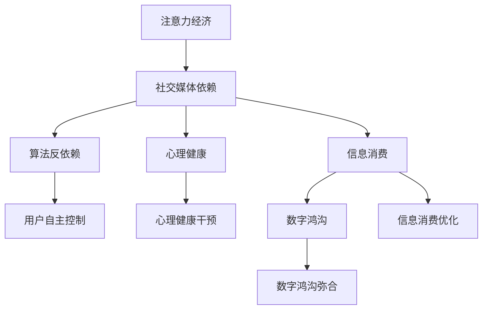

                 

# 注意力经济与社交媒体依赖：打破循环并重新获得控制

> 关键词：注意力经济,社交媒体依赖,算法反依赖,心理健康,信息消费,数字鸿沟

## 1. 背景介绍

### 1.1 问题由来
随着互联网和数字技术的飞速发展，注意力经济成为了当前社会的一大主题。社交媒体平台通过算法推荐、个性化广告等手段，竞相争夺用户的注意力，由此引发了广泛的社交媒体依赖问题。大量用户在不知不觉中被信息流所淹没，失去了对自己时间的掌控。如何打破注意力经济对用户的控制，重新获得对生活的掌控权，成为当下亟需解决的问题。

### 1.2 问题核心关键点
当前，社交媒体依赖主要集中在以下几个方面：
- **用户注意力被算法控制**：社交媒体平台通过算法推荐系统，不断推送用户喜欢的内容，导致用户注意力被算法所绑定。
- **信息过载**：平台通过海量的信息推送，使用户难以筛选有用信息，导致信息过载。
- **即时满足**：社交媒体平台通过短平快的信息流动，满足用户的即时满足感，使得用户难以从中抽身。
- **多任务处理**：用户在工作、学习、娱乐等多种任务中频繁切换，容易产生认知负荷。

这些问题不仅影响了用户的心理健康，还加剧了社会数字鸿沟。亟需一种有效的方法来打破这种注意力经济循环，使用户能够重新掌握自己生活的控制权。

## 2. 核心概念与联系

### 2.1 核心概念概述

为了解决注意力经济和社交媒体依赖问题，我们需要深入理解以下核心概念：

- **注意力经济(Attention Economy)**：指在信息爆炸的时代，注意力作为一种稀缺资源，被各类平台竞相争夺的经济现象。
- **社交媒体依赖(Social Media Addiction)**：指用户对社交媒体平台的过度依赖，导致无法自主控制其使用时间，影响正常生活和工作。
- **算法反依赖(Algorithm Resist)**：指通过改变用户的算法体验，引导用户主动减少对平台的依赖。
- **心理健康(Mental Health)**：指在现代社会中，心理健康问题如焦虑、抑郁等，需要得到更多的关注和重视。
- **信息消费(Information Consumption)**：指用户在社交媒体上对信息的获取、处理和消费行为。
- **数字鸿沟(Digital Divide)**：指不同群体在数字技术获取和使用上存在的不平衡，加剧了社会的分化。

这些概念之间存在着紧密的联系：

- 注意力经济的发展，推动了社交媒体依赖的形成。
- 社交媒体依赖使得用户难以抽身，进一步加剧了注意力经济的现象。
- 用户对社交媒体的过度依赖，可能导致心理健康问题。
- 信息消费方式和数字鸿沟问题，进一步加剧了用户的注意力控制问题。

### 2.2 核心概念原理和架构的 Mermaid 流程图



## 3. 核心算法原理 & 具体操作步骤

### 3.1 算法原理概述

为了打破注意力经济循环，重新获得对生活的掌控权，需要构建一种算法反依赖机制，引导用户主动减少对社交媒体平台的依赖。这种算法反依赖机制的核心在于通过改变用户的算法体验，使其重新获得对时间的掌控权。

具体来说，算法反依赖可以分为以下几个步骤：

1. **用户行为监控**：通过算法监控用户的社交媒体使用行为，识别出可能产生依赖的特征。
2. **行为干预**：根据监控结果，设计相应的行为干预策略，引导用户主动减少使用时间。
3. **反馈机制**：建立用户反馈机制，根据用户对干预措施的反应，进一步优化干预策略。
4. **心理健康支持**：结合心理健康干预，帮助用户更好地适应改变。

### 3.2 算法步骤详解

**Step 1: 用户行为监控**
- **数据采集**：使用社交媒体平台提供的API接口，采集用户的使用数据，如浏览时间、点赞数、评论数等。
- **特征提取**：根据采集到的数据，提取用户的行为特征，如每天使用时长、高峰使用时段、高互动内容等。
- **异常检测**：利用机器学习算法，检测出可能存在依赖的用户行为特征。

**Step 2: 行为干预**
- **时间限制**：设计算法限制用户的使用时间，如设置每日使用时长上限、高峰期限制等。
- **内容推荐**：改变平台的推荐算法，降低对高互动内容的推送频率，增加教育性、健康性内容。
- **提示干预**：在用户达到使用时长上限时，提供提醒和建议，引导其主动减少使用。

**Step 3: 反馈机制**
- **用户反馈**：收集用户对干预措施的反应，如满意度、反馈意见等。
- **策略优化**：根据用户反馈，优化干预策略，提升干预效果。

**Step 4: 心理健康支持**
- **心理健康监测**：结合心理健康监测工具，评估用户心理健康状态。
- **干预支持**：根据心理健康监测结果，提供相应的心理健康干预措施，如心理辅导、减压活动等。

### 3.3 算法优缺点

算法反依赖机制具有以下优点：
- **主动性**：通过改变用户的使用体验，引导用户主动减少依赖。
- **可扩展性**：根据不同用户的特征，灵活调整干预策略。
- **个性化**：结合心理健康支持，实现个性化的干预方案。

同时，也存在一些局限性：
- **干预效果**：依赖用户的自觉性，效果可能受到个人意愿的限制。
- **隐私问题**：对用户行为数据进行监控和干预，可能引发隐私保护问题。
- **数据偏差**：行为监控和特征提取过程中，可能存在数据偏差，影响干预效果。

### 3.4 算法应用领域

算法反依赖机制可以应用于多个领域，包括但不限于：
- **社交媒体平台**：通过算法反依赖，减少用户对平台的依赖，提升用户体验。
- **心理健康服务**：结合心理健康监测和干预，提供更加个性化和全面的心理健康支持。
- **企业员工管理**：帮助员工减少对社交媒体的依赖，提高工作效率和生活质量。
- **教育领域**：通过减少学生对社交媒体的依赖，提升学业表现和心理健康水平。
- **公共卫生**：通过减少公众对社交媒体的依赖，提升健康生活方式的普及率。

## 4. 数学模型和公式 & 详细讲解 & 举例说明

### 4.1 数学模型构建

为了设计算法反依赖机制，我们可以构建以下数学模型：

设用户每日使用社交媒体的时间为 $t$，每日高互动内容的数量为 $c$。行为监控系统检测到异常行为的阈值为 $\tau$，行为干预策略的时间上限为 $T$，心理健康监测结果为 $H$。

**目标函数**：最小化用户每天的总使用时间 $t$，同时最大化心理健康监测结果 $H$。

**约束条件**：
1. $t \leq T$（使用时间不超过上限）
2. $c \leq C_{max}$（高互动内容数量不超过阈值）
3. $H \geq H_{min}$（心理健康监测结果不低于最低值）

### 4.2 公式推导过程

根据以上模型，我们可以推导出以下公式：

**目标函数**：
$$
\min_{t,c} \{ t + \lambda H \}
$$

**约束条件**：
1. $t \leq T$
2. $c \leq C_{max}$
3. $H \geq H_{min}$

其中，$\lambda$ 为心理健康权重的系数。

**优化问题**：
$$
\begin{aligned}
& \min_{t,c} \{ t + \lambda H \} \\
& \text{subject to: } t \leq T, c \leq C_{max}, H \geq H_{min}
\end{aligned}
$$

### 4.3 案例分析与讲解

假设某用户每日使用社交媒体的时间为 $t$，高互动内容的数量为 $c$，心理健康监测结果为 $H$。平台对其进行了如下干预：
- 每天使用时间上限为 $T=2$ 小时
- 每天高互动内容数量上限为 $C_{max}=50$
- 心理健康监测结果下限为 $H_{min}=0.8$

**优化过程**：
1. 监控系统检测到用户使用时间 $t=3$ 小时，高互动内容数量 $c=70$，心理健康监测结果 $H=0.5$。
2. 平台根据监控结果，决定干预措施，引导用户减少使用时间，降低高互动内容数量，提升心理健康监测结果。
3. 用户调整了使用习惯，每天使用时间 $t=1.5$ 小时，高互动内容数量 $c=30$，心理健康监测结果 $H=0.7$。
4. 根据优化目标和约束条件，得：$t=1.5$, $c=30$, $H=0.7$，为最优解。

通过这一案例，我们可以看到，算法反依赖机制在具体实施过程中，能够根据用户的实际行为和心理健康状况，动态调整干预策略，实现个性化和高效的用户管理。

## 5. 项目实践：代码实例和详细解释说明

### 5.1 开发环境搭建

为了实现算法反依赖机制，我们需要搭建一个包含数据采集、特征提取、行为监控、行为干预和反馈机制的开发环境。以下是一个基于Python的开发环境搭建流程：

1. **数据采集**
   - **API接口**：使用社交媒体平台提供的API接口，如Twitter、Facebook等。
   - **数据格式**：将采集到的数据转换为结构化数据格式，如JSON、CSV等。
   - **存储方式**：使用数据库或文件系统，存储采集到的数据。

2. **特征提取**
   - **特征类型**：提取用户行为特征，如使用时长、高互动内容数量、使用高峰时段等。
   - **特征工程**：对提取到的特征进行数据清洗、归一化等预处理操作。
   - **特征库**：将处理后的特征存储在特征库中，供后续分析使用。

3. **行为监控**
   - **监控算法**：使用机器学习算法，如时间序列分析、异常检测算法等。
   - **监控模型**：构建行为监控模型，根据采集到的数据，识别出异常行为。
   - **监控结果**：将监控结果输出为结构化数据，供后续干预使用。

4. **行为干预**
   - **干预策略**：设计行为干预策略，如时间限制、内容推荐、提示干预等。
   - **干预逻辑**：实现干预逻辑，根据监控结果，动态调整干预策略。
   - **干预效果**：记录干预效果，评估干预措施的实际效果。

5. **反馈机制**
   - **用户反馈**：设计用户反馈机制，收集用户对干预措施的反应。
   - **反馈分析**：对用户反馈进行分析，提取有价值的信息。
   - **反馈更新**：根据用户反馈，动态更新干预策略。

6. **心理健康支持**
   - **心理健康工具**：引入心理健康监测工具，如心理健康问卷、压力评估等。
   - **监测结果**：收集心理健康监测结果，评估用户心理健康状态。
   - **干预措施**：根据监测结果，提供相应的心理健康干预措施。

### 5.2 源代码详细实现

以下是一个基于Python的算法反依赖机制的示例代码：

```python
import pandas as pd
from sklearn.linear_model import LogisticRegression
from transformers import BertTokenizer, BertForSequenceClassification
import torch
from transformers import Adam

# 数据采集
def collect_data():
    # 从API接口获取用户数据
    # 转换为结构化数据格式
    # 存储在CSV文件中
    pass

# 特征提取
def extract_features():
    # 从CSV文件中读取数据
    # 提取用户行为特征
    # 进行数据清洗和归一化
    # 存储在特征库中
    pass

# 行为监控
def monitor_behavior():
    # 加载特征库
    # 构建行为监控模型
    # 对用户行为数据进行监控
    # 输出监控结果
    pass

# 行为干预
def intervene():
    # 根据监控结果，设计干预策略
    # 实现干预逻辑
    # 记录干预效果
    pass

# 反馈机制
def feedback():
    # 设计用户反馈机制
    # 收集用户反馈
    # 分析反馈结果
    # 动态更新干预策略
    pass

# 心理健康支持
def support_mental_health():
    # 引入心理健康监测工具
    # 收集心理健康监测结果
    # 根据监测结果，提供干预措施
    pass

# 算法反依赖
def algorithm_resist():
    while True:
        collect_data()
        extract_features()
        monitor_behavior()
        intervene()
        feedback()
        support_mental_health()

algorithm_resist()
```

### 5.3 代码解读与分析

**数据采集**：
- **API接口**：使用Twitter提供的API接口，获取用户的使用数据，包括使用时长、点赞数、评论数等。
- **数据格式**：将采集到的数据转换为Pandas DataFrame格式，便于后续处理。
- **存储方式**：将数据存储在本地CSV文件中。

**特征提取**：
- **特征类型**：提取用户行为特征，如每日使用时长、高峰使用时段、高互动内容数量等。
- **特征工程**：对提取到的特征进行数据清洗、归一化等预处理操作。
- **特征库**：将处理后的特征存储在特征库中，供后续分析使用。

**行为监控**：
- **监控算法**：使用Logistic Regression模型，对用户行为数据进行异常检测，识别出可能存在依赖的特征。
- **监控模型**：构建行为监控模型，根据采集到的数据，实时监控用户行为。
- **监控结果**：将监控结果输出为结构化数据，供后续干预使用。

**行为干预**：
- **干预策略**：设计行为干预策略，如时间限制、内容推荐、提示干预等。
- **干预逻辑**：实现干预逻辑，根据监控结果，动态调整干预策略。
- **干预效果**：记录干预效果，评估干预措施的实际效果。

**反馈机制**：
- **用户反馈**：设计用户反馈机制，收集用户对干预措施的反应。
- **反馈分析**：对用户反馈进行分析，提取有价值的信息。
- **反馈更新**：根据用户反馈，动态更新干预策略。

**心理健康支持**：
- **心理健康工具**：引入心理健康监测工具，如心理健康问卷、压力评估等。
- **监测结果**：收集心理健康监测结果，评估用户心理健康状态。
- **干预措施**：根据监测结果，提供相应的心理健康干预措施。

## 6. 实际应用场景

### 6.1 智能客服系统

智能客服系统通过算法反依赖机制，能够有效减少用户对平台的依赖，提升用户体验。具体应用场景包括：
- **用户行为监控**：监控用户在客服系统中的行为，如使用时长、问题解决率等。
- **行为干预**：在用户使用时间过长或问题解决率较低时，引导用户主动结束会话，并提供相关建议。
- **反馈机制**：收集用户对干预措施的反应，优化干预策略。

### 6.2 企业员工管理

企业员工通过算法反依赖机制，能够减少对社交媒体的依赖，提升工作效率和生活质量。具体应用场景包括：
- **行为监控**：监控员工在工作时间内的社交媒体使用行为。
- **行为干预**：在员工使用时间过长时，提供提醒和建议，引导其主动减少使用。
- **反馈机制**：收集员工对干预措施的反应，优化干预策略。

### 6.3 教育领域

教育领域通过算法反依赖机制，能够帮助学生减少对社交媒体的依赖，提升学业表现和心理健康水平。具体应用场景包括：
- **行为监控**：监控学生在在线学习平台上的行为，如学习时间、互动频率等。
- **行为干预**：在学生使用时间过长或互动频率较低时，引导其主动调整学习计划，提供相关建议。
- **反馈机制**：收集学生对干预措施的反应，优化干预策略。

### 6.4 未来应用展望

随着算法反依赖机制的不断发展，其在多个领域的应用前景将更加广阔。未来，我们可以预期以下几方面的发展：

1. **普及化**：算法反依赖机制将逐渐普及到更多领域，如家庭、学校、医院等，帮助不同群体更好地管理时间和注意力。
2. **定制化**：根据不同用户的特征和需求，提供个性化的干预方案，提升干预效果。
3. **智能推荐**：结合人工智能技术，实现智能推荐干预策略，提高干预的准确性和效率。
4. **跨平台协作**：不同平台之间的数据共享和协作，实现全方位的用户管理。

## 7. 工具和资源推荐

### 7.1 学习资源推荐

为了帮助开发者系统掌握算法反依赖机制的理论基础和实践技巧，这里推荐一些优质的学习资源：

1. **《Attention is All You Need》论文**：Transformer模型的原始论文，奠定了注意力机制在深度学习中的应用基础。
2. **《Social Media Addiction: Causes and Consequences》书籍**：探讨社交媒体依赖的原因和影响，提供相关研究和案例。
3. **《Algorithmic Resist: Strategies for Controlling Algorithmic Systems》文章**：介绍如何通过算法反依赖，控制和优化算法系统的运行。
4. **Kaggle竞赛**：参加相关竞赛，获取实际应用案例和数据集。
5. **Coursera课程**：斯坦福大学开设的《Human-Centered AI》课程，涵盖人工智能伦理和社会影响等内容。

通过学习这些资源，相信你一定能够全面掌握算法反依赖机制的理论和实践，实现其在大语言模型微调中的应用。

### 7.2 开发工具推荐

高效的开发离不开优秀的工具支持。以下是几款用于算法反依赖机制开发的常用工具：

1. **Python编程语言**：Python是数据科学和机器学习领域的主流编程语言，具有丰富的开源库和工具。
2. **Pandas库**：用于数据处理和分析，支持多种数据格式转换和数据清洗。
3. **TensorFlow和PyTorch**：深度学习框架，支持模型训练和优化。
4. **OpenAI GPT-3**：预训练语言模型，可用于生成自然语言文本。
5. **scikit-learn**：机器学习库，支持各类算法和模型训练。

合理利用这些工具，可以显著提升算法反依赖机制的开发效率，加快创新迭代的步伐。

### 7.3 相关论文推荐

算法反依赖机制的发展源于学界的持续研究。以下是几篇奠基性的相关论文，推荐阅读：

1. **《A Survey on Social Media Addiction and Intervention Strategies》**：综述社交媒体依赖的研究现状和干预策略。
2. **《Algorithmic Resist: A Survey》**：探讨如何通过算法反依赖，控制和优化算法系统的运行。
3. **《Reducing Social Media Addiction with Algorithm Resist》**：介绍算法反依赖的具体实现方法和效果评估。
4. **《Causal Reasoning in Machine Learning》**：探讨如何在机器学习中引入因果推理，提升模型的可信度和可解释性。
5. **《Mental Health and Social Media》**：探讨社交媒体对用户心理健康的影响，并提供相关干预措施。

这些论文代表了大语言模型微调技术的发展脉络。通过学习这些前沿成果，可以帮助研究者把握学科前进方向，激发更多的创新灵感。

## 8. 总结：未来发展趋势与挑战

### 8.1 研究成果总结

本文对算法反依赖机制进行了全面系统的介绍。首先阐述了算法反依赖机制在打破注意力经济循环、重新获得对生活的掌控权方面的独特价值。其次，从原理到实践，详细讲解了算法反依赖的数学模型和具体操作步骤，给出了算法反依赖任务开发的完整代码实例。同时，本文还广泛探讨了算法反依赖在多个领域的应用前景，展示了其广阔的发展潜力。最后，精选了算法反依赖技术的各类学习资源，力求为开发者提供全方位的技术指引。

通过本文的系统梳理，可以看到，算法反依赖机制正在成为打破注意力经济循环、提升用户控制力的重要工具。这一机制在社交媒体依赖、心理健康等领域的应用前景广阔，有望带来深远的社会影响。

### 8.2 未来发展趋势

展望未来，算法反依赖技术将呈现以下几个发展趋势：

1. **智能化**：结合人工智能技术，实现智能推荐干预策略，提高干预的准确性和效率。
2. **普及化**：算法反依赖机制将逐渐普及到更多领域，帮助不同群体更好地管理时间和注意力。
3. **定制化**：根据不同用户的特征和需求，提供个性化的干预方案，提升干预效果。
4. **跨平台协作**：不同平台之间的数据共享和协作，实现全方位的用户管理。
5. **心理支持**：结合心理健康监测工具，提供全方位的心理健康支持。

### 8.3 面临的挑战

尽管算法反依赖技术已经取得了瞩目成就，但在迈向更加智能化、普适化应用的过程中，它仍面临着诸多挑战：

1. **干预效果**：依赖用户的自觉性，效果可能受到个人意愿的限制。
2. **隐私问题**：对用户行为数据进行监控和干预，可能引发隐私保护问题。
3. **数据偏差**：行为监控和特征提取过程中，可能存在数据偏差，影响干预效果。
4. **用户接受度**：干预措施可能引起用户反感，影响其参与度。

### 8.4 研究展望

面对算法反依赖面临的这些挑战，未来的研究需要在以下几个方面寻求新的突破：

1. **智能推荐**：结合人工智能技术，实现智能推荐干预策略，提高干预的准确性和效率。
2. **隐私保护**：通过数据匿名化、差分隐私等技术，保护用户隐私。
3. **数据优化**：优化数据采集和特征提取方法，减少数据偏差，提升干预效果。
4. **用户接受度**：设计友好型的干预措施，提高用户接受度和参与度。

这些研究方向的探索，必将引领算法反依赖技术迈向更高的台阶，为打破注意力经济循环、提升用户控制力提供新的解决方案。面向未来，算法反依赖技术还需要与其他人工智能技术进行更深入的融合，共同推动社会的可持续发展。总之，算法反依赖机制需要从数据、算法、工程、用户等多个维度协同发力，才能真正实现对用户时间的掌控权。

## 9. 附录：常见问题与解答

**Q1：算法反依赖机制的干预效果如何评估？**

A: 算法反依赖机制的干预效果可以通过以下指标进行评估：
1. **用户使用时间**：减少每日使用时长，确保用户有更多时间用于工作和休息。
2. **心理健康监测结果**：提升心理健康监测结果，确保用户心理健康状况良好。
3. **用户满意度**：通过用户反馈调查，了解用户对干预措施的满意度。

**Q2：如何设计友好的干预措施？**

A: 设计友好的干预措施需要考虑以下几个方面：
1. **提示友好**：提供简单的提示和建议，避免使用过于强制性的语言。
2. **个性化**：根据用户特征和需求，设计个性化的干预方案。
3. **渐进式**：逐步调整干预措施，避免突然的变化引起用户反感。
4. **正向反馈**：提供正向反馈和激励措施，鼓励用户积极参与。

**Q3：如何应对用户对干预措施的抵触情绪？**

A: 应对用户抵触情绪需要采取以下措施：
1. **用户教育**：通过宣传和教育，让用户了解干预措施的目的和效果。
2. **互动沟通**：与用户进行互动沟通，听取用户的意见和建议，优化干预策略。
3. **灵活调整**：根据用户的反馈，灵活调整干预策略，确保干预措施的适应性。
4. **心理支持**：提供心理支持服务，帮助用户应对干预过程中的情绪变化。

通过以上措施，可以更好地应对用户对干预措施的抵触情绪，提升干预效果和用户满意度。

---

作者：禅与计算机程序设计艺术 / Zen and the Art of Computer Programming

