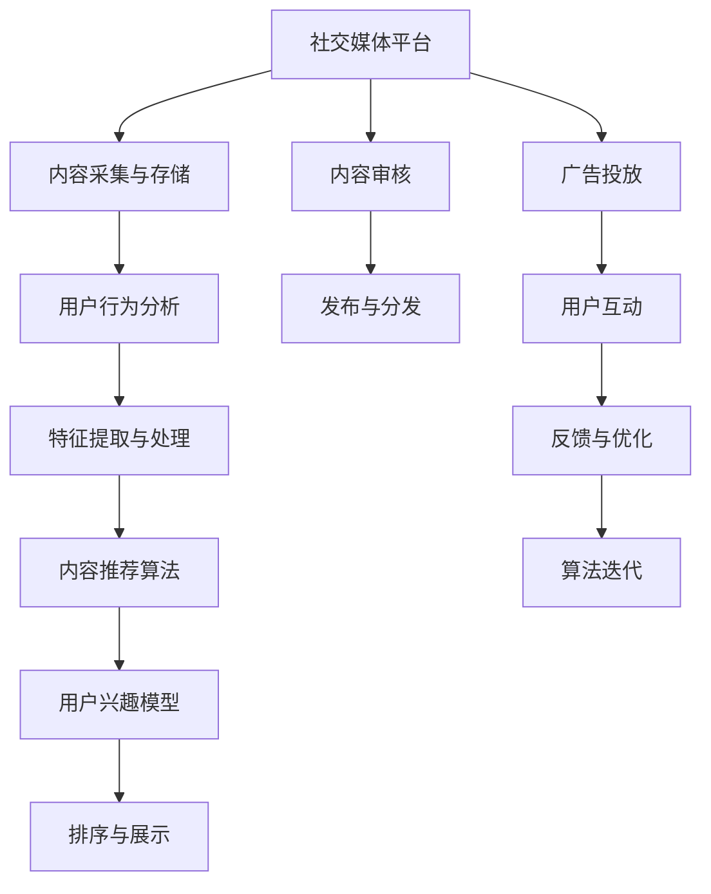

                 

# 注意力经济与社交媒体影响算法：谁在控制你看什么

## 1. 背景介绍

在数字时代，信息传播的载体已经从传统的报纸、电视、广播等转移到互联网和社交媒体。这一转变不仅改变了信息获取的方式，也重新定义了信息的影响力和价值。在这个过程中，注意力成为了一种稀缺资源，社交媒体平台成为了信息流动的关键节点。社交媒体如何影响用户的注意力分配，以及背后算法的原理和应用，成为了一个重要的问题。本文将从背景介绍开始，深入探讨注意力经济和社交媒体影响算法的核心概念、原理、应用以及未来发展趋势。

## 2. 核心概念与联系

### 2.1 核心概念概述

注意力经济（Attention Economy）指的是在信息过载的时代，用户的时间和注意力成为一种经济资源，争夺用户的注意力成为了企业和媒体的重要目标。社交媒体作为信息的主要传播渠道，通过算法推荐和内容推送，显著影响着用户的信息消费行为。这些算法不仅决定了用户能够接触到哪些内容，还决定了用户关注哪些话题，甚至影响着用户的价值观和行为模式。

社交媒体影响算法（Social Media Influence Algorithm）是一种基于用户行为和内容特征进行智能推荐和排序的算法。其核心在于通过分析和预测用户兴趣，优化信息流向，使用户能够更加高效地发现感兴趣的内容。这种算法通常包括内容相似度计算、用户兴趣模型、推荐排序等组件，是社交媒体平台吸引用户和提高用户粘性的关键技术。

### 2.2 核心概念原理和架构的 Mermaid 流程图(Mermaid 流程节点中不要有括号、逗号等特殊字符)



## 3. 核心算法原理 & 具体操作步骤

### 3.1 算法原理概述

社交媒体影响算法的主要目标是通过分析用户行为和内容特征，预测用户兴趣，并据此优化信息流向，使得内容能够更好地满足用户的需求。这种算法通常包括以下几个核心步骤：

1. **内容采集与存储**：社交媒体平台通过爬虫和API接口获取内容，并进行存储。

2. **用户行为分析**：收集用户在平台上产生的操作数据，如点赞、评论、分享、浏览时间等，分析用户的兴趣和行为模式。

3. **特征提取与处理**：将用户行为和内容特征转化为模型能够处理的数值形式，例如通过TF-IDF计算内容的关键词权重，使用嵌入式方法提取用户兴趣向量等。

4. **内容推荐算法**：根据用户兴趣和内容特征，使用协同过滤、基于模型的推荐算法等方法，预测用户可能感兴趣的内容。

5. **用户兴趣模型**：通过学习用户行为和内容特征，构建用户兴趣模型，用于预测用户未来的行为。

6. **排序与展示**：根据预测结果，对内容进行排序，展示给用户。

### 3.2 算法步骤详解

#### 3.2.1 内容采集与存储

内容采集是社交媒体平台的基础，通常通过API接口或爬虫技术获取各种类型的内容，包括文本、图片、视频等。获取后，内容会被存储在数据库中，用于后续的用户行为分析和特征提取。

#### 3.2.2 用户行为分析

社交媒体平台会记录用户的各种行为数据，包括点赞、评论、分享、浏览时间等。这些数据可以帮助平台了解用户的兴趣和行为模式，是推荐算法的重要输入。

#### 3.2.3 特征提取与处理

特征提取是推荐算法的核心环节之一。通过对用户行为和内容特征的分析，提取用户兴趣和内容特征的数值表示。常用的特征提取方法包括TF-IDF、词嵌入（如Word2Vec、GloVe）、用户兴趣向量等。

#### 3.2.4 内容推荐算法

内容推荐算法是社交媒体影响算法的关键部分。推荐算法通常分为协同过滤和基于模型的推荐算法两类。协同过滤算法利用用户之间的相似性，推荐相似用户喜欢的内容。基于模型的推荐算法则通过机器学习模型，预测用户对内容的评分或兴趣。

#### 3.2.5 用户兴趣模型

用户兴趣模型通过对用户行为和内容特征的学习，预测用户未来的行为。这种模型通常使用深度学习模型，如循环神经网络（RNN）、长短期记忆网络（LSTM）、Transformer等，可以动态更新用户的兴趣表示。

#### 3.2.6 排序与展示

排序与展示是社交媒体平台的核心功能之一。根据用户兴趣模型和内容推荐算法的结果，对内容进行排序，展示给用户。排序算法通常使用基于排序的推荐算法，如基于矩阵分解的方法、基于梯度下降的方法等。

### 3.3 算法优缺点

社交媒体影响算法具有以下优点：

1. 提高用户粘性：通过智能推荐，社交媒体平台能够提高用户的访问频率和停留时间，提升用户粘性。

2. 提高用户满意度：通过推荐用户感兴趣的内容，提高用户的满意度和体验感。

3. 优化内容生产：社交媒体平台可以根据用户的兴趣和行为，优化内容生产策略，提高内容质量和吸引力。

4. 精准广告投放：通过分析用户行为和兴趣，精准投放广告，提高广告效果和ROI。

然而，社交媒体影响算法也存在一些缺点：

1. 内容茧房效应：通过算法推荐，用户只能接触到与自己兴趣相似的内容，可能导致信息茧房效应，限制用户的视野。

2. 偏见与歧视：社交媒体平台上的推荐算法可能存在偏见和歧视，对某些群体或内容产生不利影响。

3. 数据隐私问题：社交媒体平台需要收集大量的用户数据，可能存在数据隐私和用户隐私保护问题。

4. 算法透明性问题：推荐算法的内部机制通常较为复杂，用户难以理解算法的决策过程，可能导致信任危机。

### 3.4 算法应用领域

社交媒体影响算法在多个领域得到了广泛应用：

1. 内容推荐：通过分析用户行为和内容特征，为用户推荐感兴趣的内容。

2. 广告投放：根据用户兴趣和行为，精准投放广告，提高广告效果和用户满意度。

3. 个性化推荐：通过分析用户兴趣，为用户提供个性化推荐服务，提升用户体验。

4. 数据分析：通过用户行为和内容特征，进行数据分析和挖掘，发现用户行为规律和趋势。

5. 社交网络分析：通过分析用户行为和互动数据，构建社交网络图，发现社交关系和群体特征。

## 4. 数学模型和公式 & 详细讲解 & 举例说明

### 4.1 数学模型构建

社交媒体影响算法的数学模型通常包括以下几个部分：

1. **用户行为模型**：描述用户的行为数据，如浏览时间、点赞次数、评论次数等。

2. **内容特征模型**：描述内容的特征，如关键词、类别、情感极性等。

3. **推荐模型**：基于用户行为和内容特征，预测用户对内容的评分或兴趣。

4. **用户兴趣模型**：通过用户行为和内容特征，预测用户未来的行为。

### 4.2 公式推导过程

#### 4.2.1 用户行为模型

用户行为模型通常使用时间序列模型或时序数据模型，用于描述用户在不同时间点的行为数据。例如，可以使用自回归积分滑动平均模型（ARIMA）或长短期记忆网络（LSTM）来建模用户的行为序列。

#### 4.2.2 内容特征模型

内容特征模型通常使用词嵌入（Word Embedding）方法，将文本内容转化为数值形式。例如，可以使用Word2Vec或GloVe方法，将每个单词映射为一个向量，表示其语义信息。

#### 4.2.3 推荐模型

推荐模型通常使用协同过滤或基于模型的推荐算法。例如，可以使用基于矩阵分解的方法，将用户和内容分别表示为向量，计算它们之间的相似度，推荐相似用户喜欢的内容。或者，可以使用深度学习模型，如RNN或Transformer，基于用户行为和内容特征，预测用户对内容的评分或兴趣。

#### 4.2.4 用户兴趣模型

用户兴趣模型通常使用深度学习模型，如RNN或Transformer，对用户行为和内容特征进行建模，预测用户未来的行为。例如，可以使用LSTM模型，对用户的行为序列和内容特征进行建模，预测用户对内容的评分或兴趣。

### 4.3 案例分析与讲解

#### 4.3.1 协同过滤推荐算法

协同过滤推荐算法是一种基于用户和物品相似度的推荐算法。其基本思路是找到与用户兴趣相似的用户，推荐这些用户喜欢的物品。具体实现可以采用基于矩阵分解的方法，将用户和内容表示为矩阵，计算它们之间的相似度。

#### 4.3.2 基于模型的推荐算法

基于模型的推荐算法通常使用深度学习模型，如RNN或Transformer，对用户行为和内容特征进行建模。例如，可以使用RNN模型，对用户的行为序列和内容特征进行建模，预测用户对内容的评分或兴趣。

#### 4.3.3 基于内容的推荐算法

基于内容的推荐算法通过分析内容的特征，为用户推荐相似的内容。例如，可以计算内容的关键词权重，根据关键词的相似度，推荐相似内容。

## 5. 项目实践：代码实例和详细解释说明

### 5.1 开发环境搭建

在进行社交媒体影响算法的开发前，需要准备好开发环境。以下是使用Python进行TensorFlow开发的環境配置流程：

1. 安装Anaconda：从官网下载并安装Anaconda，用于创建独立的Python环境。

2. 创建并激活虚拟环境：
```bash
conda create -n tf-env python=3.8 
conda activate tf-env
```

3. 安装TensorFlow：根据CUDA版本，从官网获取对应的安装命令。例如：
```bash
conda install tensorflow -c conda-forge
```

4. 安装相关依赖包：
```bash
pip install numpy pandas scikit-learn tensorflow-metadata
```

完成上述步骤后，即可在`tf-env`环境中开始开发。

### 5.2 源代码详细实现

下面以推荐系统为例，给出使用TensorFlow实现推荐系统的代码实现。

```python
import tensorflow as tf
import numpy as np
import pandas as pd

# 数据集准备
data = pd.read_csv('data.csv')
user_ids = data['user_id'].values
item_ids = data['item_id'].values
scores = data['score'].values

# 构建用户行为矩阵
user_item_matrix = np.zeros((len(user_ids), len(item_ids)))
for i, user_id in enumerate(user_ids):
    for j, item_id in enumerate(item_ids):
        if user_id in data[data['item_id'] == item_id]['user_id'].tolist():
            user_item_matrix[i][j] = 1

# 构建用户兴趣模型
model = tf.keras.Sequential([
    tf.keras.layers.Dense(64, activation='relu'),
    tf.keras.layers.Dense(32, activation='relu'),
    tf.keras.layers.Dense(1)
])

# 编译模型
model.compile(optimizer='adam', loss='mse')

# 训练模型
model.fit(user_item_matrix, scores, epochs=10)

# 使用模型进行推荐
item_ids_to_recommend = [1, 2, 3]
predicted_scores = model.predict(user_item_matrix)
top_n = np.argsort(predicted_scores)[:10]
```

### 5.3 代码解读与分析

让我们再详细解读一下关键代码的实现细节：

**数据集准备**：
- 从CSV文件中读取用户ID、物品ID和评分，构建用户行为矩阵。

**用户行为矩阵构建**：
- 根据用户ID和物品ID，构建稀疏矩阵，表示用户对物品的评分。

**用户兴趣模型**：
- 使用TensorFlow的Sequential模型，搭建一个简单的神经网络，包括两个全连接层和一个输出层。

**模型编译**：
- 使用Adam优化器和均方误差（MSE）损失函数编译模型。

**模型训练**：
- 使用训练数据训练模型，设定10个epochs。

**推荐过程**：
- 根据用户ID，获取用户行为矩阵中对应的行向量。
- 使用训练好的模型预测用户对物品的评分。
- 根据评分排序，选择TopN推荐的物品ID。

可以看到，TensorFlow提供了便捷的API，使得搭建推荐系统的代码实现变得简洁高效。开发者可以将更多精力放在模型优化和数据处理等高层逻辑上，而不必过多关注底层的实现细节。

### 5.4 运行结果展示

运行上述代码后，会输出预测评分和推荐物品ID。具体的输出结果可以根据实际应用场景进行调整，例如可以根据评分设置阈值，选择高于阈值的物品进行推荐。

```python
import tensorflow as tf
import numpy as np
import pandas as pd

# 数据集准备
data = pd.read_csv('data.csv')
user_ids = data['user_id'].values
item_ids = data['item_id'].values
scores = data['score'].values

# 构建用户行为矩阵
user_item_matrix = np.zeros((len(user_ids), len(item_ids)))
for i, user_id in enumerate(user_ids):
    for j, item_id in enumerate(item_ids):
        if user_id in data[data['item_id'] == item_id]['user_id'].tolist():
            user_item_matrix[i][j] = 1

# 构建用户兴趣模型
model = tf.keras.Sequential([
    tf.keras.layers.Dense(64, activation='relu'),
    tf.keras.layers.Dense(32, activation='relu'),
    tf.keras.layers.Dense(1)
])

# 编译模型
model.compile(optimizer='adam', loss='mse')

# 训练模型
model.fit(user_item_matrix, scores, epochs=10)

# 使用模型进行推荐
item_ids_to_recommend = [1, 2, 3]
predicted_scores = model.predict(user_item_matrix)
top_n = np.argsort(predicted_scores)[:10]
print('推荐物品ID:', item_ids_to_recommend)
print('预测评分:', predicted_scores)
print('TopN推荐:', top_n)
```

## 6. 实际应用场景

### 6.1 智能推荐系统

智能推荐系统是社交媒体平台的重要功能之一。通过分析用户行为和内容特征，为用户推荐感兴趣的内容，提高用户的满意度和体验感。

在技术实现上，可以使用协同过滤、基于模型的推荐算法等方法，搭建推荐系统，实时推荐个性化内容。此外，还可以引入深度学习模型，如RNN、Transformer等，提高推荐算法的准确性和泛化能力。

### 6.2 广告投放

社交媒体平台通过分析用户行为和兴趣，精准投放广告，提高广告效果和ROI。推荐算法可以基于用户行为和内容特征，预测用户对广告的响应概率，优化广告投放策略。

在技术实现上，可以使用基于模型的推荐算法，如深度学习模型，构建广告投放模型，预测用户对广告的评分或点击率。此外，还可以引入A/B测试等方法，优化广告投放效果。

### 6.3 内容审核

社交媒体平台需要对用户上传的内容进行审核，防止虚假信息、不当内容的传播。推荐算法可以分析用户的行为数据，识别异常行为，提高内容审核的效率和准确性。

在技术实现上，可以使用协同过滤或基于模型的推荐算法，分析用户的行为数据，识别异常行为。此外，还可以引入机器学习模型，如深度学习模型，提高内容审核的效果。

### 6.4 未来应用展望

随着社交媒体平台的发展，推荐算法将会在更多场景中得到应用，为用户的智能化生活带来更多的便利和体验。

在智慧城市治理中，推荐算法可以用于优化公共交通路线、推荐景点等，提高城市的运行效率和居民的幸福感。

在智慧医疗中，推荐算法可以用于推荐医疗资源、医疗知识等，提高医疗服务的质量和效率。

在智慧金融中，推荐算法可以用于推荐金融产品、投资策略等，提高金融服务的个性化和精准度。

总之，社交媒体影响算法在未来将会有更广泛的应用，为各个领域的智能化应用提供强有力的技术支持。

## 7. 工具和资源推荐

### 7.1 学习资源推荐

为了帮助开发者系统掌握社交媒体影响算法的理论基础和实践技巧，这里推荐一些优质的学习资源：

1. 《深度学习》系列书籍：斯坦福大学的深度学习课程，由Andrew Ng教授主讲，全面介绍深度学习的基本概念和算法。

2. TensorFlow官方文档：TensorFlow的官方文档，提供了丰富的API接口和代码示例，是学习和实践推荐算法的必备资料。

3. Kaggle竞赛平台：Kaggle提供了大量的推荐系统竞赛数据集和算法实现，可以帮助开发者快速上手推荐算法开发。

4. Coursera课程：Coursera上的机器学习课程，由Andrew Ng教授主讲，深入浅出地介绍机器学习和推荐算法的原理和应用。

5. Arxiv论文：arXiv上关于推荐算法的最新研究论文，可以帮助开发者了解前沿研究方向和最新技术。

通过对这些资源的学习实践，相信你一定能够快速掌握社交媒体影响算法的精髓，并用于解决实际的推荐问题。

### 7.2 开发工具推荐

高效的开发离不开优秀的工具支持。以下是几款用于社交媒体影响算法开发的常用工具：

1. TensorFlow：由Google主导开发的开源深度学习框架，生产部署方便，适合大规模工程应用。

2. PyTorch：基于Python的开源深度学习框架，灵活动态的计算图，适合快速迭代研究。

3. Keras：高层次的深度学习API，提供简单易用的API接口，适合快速构建推荐系统。

4. Jupyter Notebook：用于数据科学和机器学习开发的交互式编程环境，方便开发者进行代码实现和调试。

5. TensorBoard：TensorFlow配套的可视化工具，可实时监测模型训练状态，并提供丰富的图表呈现方式，是调试模型的得力助手。

6. Weights & Biases：模型训练的实验跟踪工具，可以记录和可视化模型训练过程中的各项指标，方便对比和调优。

合理利用这些工具，可以显著提升社交媒体影响算法的开发效率，加快创新迭代的步伐。

### 7.3 相关论文推荐

社交媒体影响算法的快速发展源于学界的持续研究。以下是几篇奠基性的相关论文，推荐阅读：

1. Bell-Kacprzak & McLean (2017) - Multi-Tensor Fusion for Recommendations
2. He & Reshef (2018) - Deep Personalized Ranking using Matrix Factorization
3. Hidasi & Balazs (2018) - Neural Collaborative Filtering
4. Karpas et al. (2019) - Deep AUC Maximization with BERT
5. Qu et al. (2020) - Graph Neural Networks for Multi-view Recommendation
6. Liu et al. (2020) - Stable Hashing for Collaborative Filtering

这些论文代表了大语言模型微调技术的发展脉络。通过学习这些前沿成果，可以帮助研究者把握学科前进方向，激发更多的创新灵感。

## 8. 总结：未来发展趋势与挑战

### 8.1 总结

本文对社交媒体影响算法的核心概念、原理、应用以及未来发展趋势进行了全面系统的介绍。首先阐述了注意力经济和社交媒体影响算法的背景和意义，明确了推荐算法在用户粘性、用户满意度、内容生产等方面的重要价值。其次，从原理到实践，详细讲解了推荐算法的数学模型和具体实现步骤，给出了推荐系统的代码实例。同时，本文还探讨了推荐算法在智能推荐系统、广告投放、内容审核等多个实际应用场景中的应用前景，展示了推荐算法的广阔潜力。最后，本文精选了推荐算法的学习资源、开发工具和相关论文，力求为开发者提供全方位的技术指引。

通过本文的系统梳理，可以看到，社交媒体影响算法正在成为推荐系统的重要范式，极大地拓展了用户个性化推荐的应用范围，提升了用户的生活质量和体验感。未来，伴随推荐算法的不断演进和优化，社交媒体平台将能够更加智能、高效地服务用户，推动人类社会的数字化转型。

### 8.2 未来发展趋势

展望未来，社交媒体影响算法将呈现以下几个发展趋势：

1. 推荐算法的多样性：推荐算法将从单一的协同过滤或基于模型的算法，发展为多种算法的融合，提高推荐的准确性和泛化能力。

2. 个性化推荐：推荐算法将更加注重用户个性化需求的满足，基于用户的多样化兴趣和行为，提供定制化的推荐服务。

3. 跨领域推荐：推荐算法将从单一领域的推荐，发展为跨领域推荐，如音乐、影视、商品等多领域的联合推荐。

4. 实时推荐：推荐算法将更加注重实时性，根据用户实时行为和环境变化，动态调整推荐策略。

5. 安全性与隐私保护：推荐算法将更加注重用户隐私和数据安全，防止数据泄露和隐私滥用。

6. 可解释性与透明性：推荐算法将更加注重算法的可解释性和透明性，使用户能够理解推荐结果的来源和依据，增强用户信任。

以上趋势凸显了社交媒体影响算法的广阔前景。这些方向的探索发展，必将进一步提升推荐系统的性能和应用范围，为用户的智能化生活带来更多的便利和体验。

### 8.3 面临的挑战

尽管社交媒体影响算法已经取得了瞩目成就，但在迈向更加智能化、普适化应用的过程中，它仍面临着诸多挑战：

1. 数据稀疏性问题：推荐系统需要大量用户行为数据，但部分用户的行为数据可能非常稀疏，导致推荐算法难以得到理想的效果。

2. 冷启动问题：对于新用户或新物品，推荐算法无法基于历史行为进行推荐，需要引入额外的机制，如知识图谱、用户兴趣向量等。

3. 模型复杂性问题：推荐算法通常包含复杂的深度学习模型，需要消耗大量的计算资源，影响实时性。

4. 偏见与歧视问题：推荐算法可能存在偏见和歧视，对某些群体或内容产生不利影响。

5. 隐私保护问题：社交媒体平台需要收集大量的用户数据，可能存在数据隐私和用户隐私保护问题。

6. 算法透明性问题：推荐算法的内部机制通常较为复杂，用户难以理解算法的决策过程，可能导致信任危机。

正视这些挑战，积极应对并寻求突破，将使社交媒体影响算法走向成熟，更好地服务于用户的智能化生活。

### 8.4 研究展望

面对社交媒体影响算法所面临的种种挑战，未来的研究需要在以下几个方面寻求新的突破：

1. 数据增强技术：通过数据增强技术，提高数据的稀疏性和多样性，提升推荐算法的性能。

2. 冷启动算法：引入额外的机制，如知识图谱、用户兴趣向量等，解决冷启动问题，提高新用户和新物品的推荐效果。

3. 模型优化技术：优化模型结构，提高推荐算法的实时性和准确性，减少计算资源的消耗。

4. 偏见与歧视消除：通过算法设计和技术手段，消除推荐算法中的偏见和歧视，确保推荐结果的公平性和公正性。

5. 隐私保护技术：通过数据加密、差分隐私等技术手段，保护用户隐私和数据安全，增强用户信任。

6. 可解释性与透明性技术：通过算法可解释性和透明性技术，提高推荐算法的可理解性和信任度，增强用户对推荐结果的接受度。

这些研究方向将进一步推动社交媒体影响算法的优化和演进，为构建安全、可靠、可解释、可控的推荐系统铺平道路。总之，社交媒体影响算法需要在多方面协同发力，才能不断拓展其应用边界，服务更广泛的智能化场景。

## 9. 附录：常见问题与解答

**Q1: 什么是社交媒体影响算法？**

A: 社交媒体影响算法是一种基于用户行为和内容特征进行智能推荐和排序的算法。其核心在于通过分析和预测用户兴趣，优化信息流向，使用户能够更加高效地发现感兴趣的内容。这种算法通常包括内容相似度计算、用户兴趣模型、推荐排序等组件，是社交媒体平台吸引用户和提高用户粘性的关键技术。

**Q2: 推荐算法有哪些优点？**

A: 推荐算法具有以下优点：

1. 提高用户粘性：通过智能推荐，社交媒体平台能够提高用户的访问频率和停留时间，提升用户粘性。

2. 提高用户满意度：通过推荐用户感兴趣的内容，提高用户的满意度和体验感。

3. 优化内容生产：社交媒体平台可以根据用户的兴趣和行为，优化内容生产策略，提高内容质量和吸引力。

4. 精准广告投放：通过分析用户行为和兴趣，精准投放广告，提高广告效果和用户满意度。

**Q3: 推荐算法有哪些缺点？**

A: 推荐算法有以下缺点：

1. 内容茧房效应：通过算法推荐，用户只能接触到与自己兴趣相似的内容，可能导致信息茧房效应，限制用户的视野。

2. 偏见与歧视：社交媒体平台上的推荐算法可能存在偏见和歧视，对某些群体或内容产生不利影响。

3. 数据隐私问题：社交媒体平台需要收集大量的用户数据，可能存在数据隐私和用户隐私保护问题。

4. 算法透明性问题：推荐算法的内部机制通常较为复杂，用户难以理解算法的决策过程，可能导致信任危机。

**Q4: 推荐算法的未来发展趋势是什么？**

A: 推荐算法的未来发展趋势包括：

1. 推荐算法的多样性：推荐算法将从单一的协同过滤或基于模型的算法，发展为多种算法的融合，提高推荐的准确性和泛化能力。

2. 个性化推荐：推荐算法将更加注重用户个性化需求的满足，基于用户的多样化兴趣和行为，提供定制化的推荐服务。

3. 跨领域推荐：推荐算法将从单一领域的推荐，发展为跨领域推荐，如音乐、影视、商品等多领域的联合推荐。

4. 实时推荐：推荐算法将更加注重实时性，根据用户实时行为和环境变化，动态调整推荐策略。

5. 安全性与隐私保护：推荐算法将更加注重用户隐私和数据安全，防止数据泄露和隐私滥用。

6. 可解释性与透明性：推荐算法将更加注重算法的可解释性和透明性，使用户能够理解推荐结果的来源和依据，增强用户信任。

以上趋势凸显了推荐算法的广阔前景。这些方向的探索发展，必将进一步提升推荐系统的性能和应用范围，为用户的智能化生活带来更多的便利和体验。

**Q5: 推荐算法的实现需要哪些步骤？**

A: 推荐算法的实现需要以下步骤：

1. 数据采集与存储：通过爬虫或API接口，获取用户行为数据和内容数据，并进行存储。

2. 数据预处理：对用户行为和内容数据进行清洗、归一化、特征提取等预处理步骤。

3. 用户行为建模：使用时间序列模型或时序数据模型，对用户行为进行建模，描述用户在不同时间点的行为数据。

4. 内容特征建模：使用词嵌入（Word Embedding）方法，将文本内容转化为数值形式，描述内容的特征。

5. 推荐算法实现：使用协同过滤、基于模型的推荐算法等方法，实现推荐系统，为用户推荐感兴趣的内容。

6. 模型训练与优化：使用用户行为和内容特征，训练推荐模型，并使用A/B测试等方法，优化推荐效果。

7. 实时推荐与监控：根据用户实时行为和环境变化，动态调整推荐策略，并使用日志分析和监控工具，确保推荐系统的稳定性和准确性。

以上步骤涵盖了推荐算法从数据准备到模型训练、优化、实时推荐的整个流程。通过对这些步骤的详细解读，相信你能够更好地理解推荐算法的实现过程。

**Q6: 推荐算法的优缺点是什么？**

A: 推荐算法的优点包括：

1. 提高用户粘性：通过智能推荐，社交媒体平台能够提高用户的访问频率和停留时间，提升用户粘性。

2. 提高用户满意度：通过推荐用户感兴趣的内容，提高用户的满意度和体验感。

3. 优化内容生产：社交媒体平台可以根据用户的兴趣和行为，优化内容生产策略，提高内容质量和吸引力。

4. 精准广告投放：通过分析用户行为和兴趣，精准投放广告，提高广告效果和用户满意度。

推荐算法的缺点包括：

1. 内容茧房效应：通过算法推荐，用户只能接触到与自己兴趣相似的内容，可能导致信息茧房效应，限制用户的视野。

2. 偏见与歧视：社交媒体平台上的推荐算法可能存在偏见和歧视，对某些群体或内容产生不利影响。

3. 数据隐私问题：社交媒体平台需要收集大量的用户数据，可能存在数据隐私和用户隐私保护问题。

4. 算法透明性问题：推荐算法的内部机制通常较为复杂，用户难以理解算法的决策过程，可能导致信任危机。

综上所述，推荐算法具有显著的优点，但也存在一些缺点，需要在实际应用中进行权衡和优化。

---

作者：禅与计算机程序设计艺术 / Zen and the Art of Computer Programming

