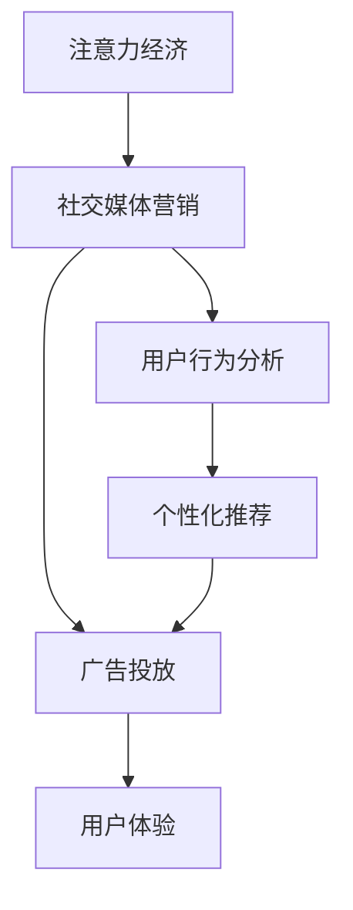

                 

# 注意力经济与社交媒体营销策略：在不牺牲用户体验的情况下有效吸引受众

> 关键词：注意力经济,社交媒体营销,用户行为分析,个性化推荐,广告投放,用户体验

## 1. 背景介绍

### 1.1 问题由来
随着互联网的普及和数字化转型的加速，注意力经济时代已经到来。在这个时代，用户注意力成为了最宝贵的资源，各大企业和品牌纷纷争夺用户的关注。社交媒体作为信息传播的重要平台，吸引了大量用户。如何在社交媒体上有效吸引用户注意力，成为企业和品牌面临的重要挑战。

### 1.2 问题核心关键点
社交媒体上的用户注意力具有高度碎片化、易受干扰的特点。要想在激烈的竞争中脱颖而出，需要制定科学的营销策略，精准把握用户需求，优化用户体验。同时，还要关注广告投放的精准度和转化率，避免浪费资源。

## 2. 核心概念与联系

### 2.1 核心概念概述

为更好地理解注意力经济与社交媒体营销策略，本节将介绍几个密切相关的核心概念：

- 注意力经济(Attention Economy)：指在互联网时代，用户注意力成为关键生产要素，企业需要争夺和优化用户注意力以获取商业价值。
- 社交媒体营销(Social Media Marketing)：利用社交媒体平台进行品牌宣传、用户互动、产品推广等营销活动，以吸引和维护用户关注。
- 用户行为分析(User Behavior Analysis)：通过数据分析技术，揭示用户在线行为特征和偏好，从而指导营销决策。
- 个性化推荐(Personalized Recommendation)：根据用户兴趣和行为数据，推荐相关内容或产品，提升用户满意度和转化率。
- 广告投放(Advertising Placement)：根据用户行为特征和广告效果，选择合适的时机和渠道，进行精准投放。
- 用户体验(User Experience, UX)：用户在交互过程中获得的主观体验和满意度，直接影响用户的粘性和忠诚度。

这些核心概念之间的逻辑关系可以通过以下Mermaid流程图来展示：



这个流程图展示了几者之间的关联关系：

1. 注意力经济是基础，需要通过社交媒体营销获取用户注意力。
2. 社交媒体营销需要依赖用户行为分析和个性化推荐技术。
3. 广告投放是实现社交媒体营销的手段之一。
4. 个性化推荐和广告投放可以提升用户体验。
5. 用户体验直接影响社交媒体营销效果和用户粘性。

## 3. 核心算法原理 & 具体操作步骤

### 3.1 算法原理概述

注意力经济与社交媒体营销策略的核心在于通过数据分析和模型优化，精准把握用户需求，提供个性化的内容和服务，从而吸引和保持用户注意力。其基本思路是通过以下几个步骤：

1. 收集用户行为数据：包括浏览、点赞、评论、分享等。
2. 数据分析和特征工程：对数据进行清洗、转换、降维等处理，提取出对用户行为有影响力的特征。
3. 模型训练和优化：训练推荐模型和广告投放模型，不断优化模型参数，提升预测精度。
4. 个性化推荐和广告投放：根据模型预测结果，生成推荐列表和投放计划。
5. 用户行为监测和反馈：通过A/B测试等方法，监测模型效果，持续改进。

### 3.2 算法步骤详解

以下详细介绍注意力经济与社交媒体营销策略的具体操作步骤：

**Step 1: 数据收集与预处理**

- 数据收集：通过API接口、用户行为日志等渠道，收集社交媒体平台上的用户数据。
- 数据清洗：去除噪声和异常数据，处理缺失值和重复值，进行数据标准化。
- 特征提取：使用TF-IDF、Word2Vec等技术，提取文本特征；使用时间戳、地理位置等，提取用户行为特征。

**Step 2: 模型训练与优化**

- 选择模型：根据任务特点，选择适合的机器学习算法，如协同过滤、逻辑回归、深度学习等。
- 数据分割：将数据集分为训练集、验证集和测试集，比例一般为7:1:2。
- 模型训练：使用优化器(如SGD、Adam等)，训练模型参数，最小化损失函数。
- 模型评估：使用验证集评估模型性能，选择最优模型。

**Step 3: 个性化推荐与广告投放**

- 推荐系统：根据用户历史行为和实时行为，生成个性化推荐列表。
- 广告投放：选择合适的广告位和时间段，投放广告，记录广告效果。

**Step 4: 用户行为监测与反馈**

- 用户行为监测：通过网站分析工具、移动应用统计等手段，监测用户行为数据。
- 反馈与迭代：根据用户行为变化，调整模型参数和推荐策略，持续优化。

### 3.3 算法优缺点

注意力经济与社交媒体营销策略具有以下优点：
1. 精准用户把握：通过数据分析和模型优化，精准把握用户需求和行为特征，提升广告投放效果。
2. 提升用户体验：个性化推荐和动态广告投放，使内容更贴合用户偏好，提升用户满意度。
3. 减少资源浪费：通过精准投放，避免无效曝光和无效点击，提升广告ROI。

同时，该策略也存在一定的局限性：
1. 数据隐私问题：用户数据的收集和使用需要遵循隐私保护法规，如GDPR等。
2. 数据质量要求高：数据采集和清洗过程容易出现错误，影响模型效果。
3. 模型复杂度高：推荐和广告投放模型需要高精度和高计算量，训练和部署成本较高。
4. 用户数据获取难度大：需要与社交媒体平台合作，获取用户数据。

尽管存在这些局限性，但就目前而言，注意力经济与社交媒体营销策略仍是最主流的方法。未来相关研究的重点在于如何进一步降低数据隐私和质量问题，提高模型效率，优化推荐和广告投放策略，从而更好地服务于社交媒体用户。

### 3.4 算法应用领域

注意力经济与社交媒体营销策略在社交媒体领域已经得到了广泛的应用，覆盖了广告投放、内容推荐、用户互动等多个方面，具体如下：

- 社交广告投放：根据用户行为特征，选择最佳时机和渠道，进行广告投放，提升转化率。
- 个性化内容推荐：分析用户历史行为，推荐相关文章、视频、商品等内容，增加用户粘性。
- 用户互动提升：通过智能回复、用户反馈等手段，提升用户互动率，增加品牌曝光。
- 用户画像构建：通过数据挖掘技术，构建详细的用户画像，指导产品设计和营销策略。
- 社交数据分析：使用数据分析工具，提取用户行为模式，发现潜在的用户需求。

这些应用展示了注意力经济与社交媒体营销策略的强大潜力，将在未来的社交媒体营销中发挥越来越重要的作用。

## 4. 数学模型和公式 & 详细讲解 & 举例说明

### 4.1 数学模型构建

本节将使用数学语言对注意力经济与社交媒体营销策略进行更加严格的刻画。

记用户行为数据集为 $D=\{(x_i,y_i)\}_{i=1}^N, x_i \in \mathbb{R}^d, y_i \in \{0,1\}$，其中 $x_i$ 表示用户行为特征向量，$y_i$ 表示用户是否进行过某种行为（如点击、购买等）。假设推荐模型的输入为 $x_i$，输出为 $y_i$，则推荐模型的目标是最小化经验风险，即找到最优模型参数 $\theta$：

$$
\theta^* = \mathop{\arg\min}_{\theta} \mathcal{L}(\theta)
$$

其中 $\mathcal{L}(\theta)$ 为经验风险函数，定义为：

$$
\mathcal{L}(\theta) = \frac{1}{N} \sum_{i=1}^N \ell(\theta(x_i),y_i)
$$

其中 $\ell(\theta(x_i),y_i)$ 为损失函数，可以是二元交叉熵、均方误差等。

### 4.2 公式推导过程

以二元交叉熵为例，推导推荐模型的目标函数及其梯度。

假设推荐模型为 $\hat{y} = \sigma(Wx+b)$，其中 $\sigma(\cdot)$ 为激活函数，$W$ 和 $b$ 为模型参数。则推荐模型的损失函数为：

$$
\ell(\hat{y},y) = -[y\log \hat{y} + (1-y)\log(1-\hat{y})]
$$

将其代入经验风险函数，得：

$$
\mathcal{L}(\theta) = -\frac{1}{N}\sum_{i=1}^N [y_i\log \hat{y}_i + (1-y_i)\log(1-\hat{y}_i)]
$$

根据链式法则，目标函数对模型参数 $\theta$ 的梯度为：

$$
\frac{\partial \mathcal{L}(\theta)}{\partial \theta} = -\frac{1}{N}\sum_{i=1}^N \frac{\partial \ell(\hat{y}_i,y_i)}{\partial \hat{y}_i} \frac{\partial \hat{y}_i}{\partial \theta}
$$

其中 $\frac{\partial \ell(\hat{y}_i,y_i)}{\partial \hat{y}_i} = \frac{y_i}{\hat{y}_i} - \frac{1-y_i}{1-\hat{y}_i}$，$\frac{\partial \hat{y}_i}{\partial \theta} = \frac{\partial \sigma(Wx+b)}{\partial W} \frac{\partial W}{\partial \theta} + \frac{\partial \sigma(Wx+b)}{\partial b} \frac{\partial b}{\partial \theta}$。

通过计算，可以求解出模型参数的更新规则，完成推荐模型的迭代优化。

### 4.3 案例分析与讲解

假设我们有一组用户行为数据 $D=\{(x_i,y_i)\}_{i=1}^N$，其中 $x_i$ 为用户的兴趣爱好和行为特征，$y_i$ 为是否进行过某种行为（如观看视频、购买商品等）。我们将数据分为训练集 $D_{train}=\{(x_i,y_i)\}_{i=1}^{0.7N}$、验证集 $D_{val}=\{(x_i,y_i)\}_{i=0.7N}^{0.8N}$ 和测试集 $D_{test}=\{(x_i,y_i)\}_{i=0.8N}^{N}$。

1. 数据预处理：使用TF-IDF技术提取用户兴趣特征，去除异常值和缺失值，对数据进行标准化。
2. 模型训练：使用逻辑回归算法训练推荐模型，最小化交叉熵损失函数。
3. 模型评估：在验证集上评估模型性能，选择最优模型。
4. 个性化推荐：根据用户行为数据，生成个性化推荐列表，推荐相关商品和内容。
5. 广告投放：选择最佳时机和渠道，投放广告，记录广告效果。
6. 用户行为监测与反馈：通过网站分析工具监测用户行为，根据反馈调整推荐策略。

具体实现代码如下：

```python
from sklearn.feature_extraction.text import TfidfVectorizer
from sklearn.linear_model import LogisticRegression
from sklearn.metrics import precision_score, recall_score, f1_score
from sklearn.model_selection import train_test_split

# 准备数据集
X, y = load_data()
X_train, X_val, y_train, y_val = train_test_split(X, y, test_size=0.2, random_state=42)

# 特征提取
tfidf = TfidfVectorizer()
X_train_tfidf = tfidf.fit_transform(X_train)
X_val_tfidf = tfidf.transform(X_val)

# 模型训练
model = LogisticRegression()
model.fit(X_train_tfidf, y_train)

# 模型评估
y_pred = model.predict(X_val_tfidf)
precision = precision_score(y_val, y_pred)
recall = recall_score(y_val, y_pred)
f1 = f1_score(y_val, y_pred)

# 个性化推荐
X_test_tfidf = tfidf.transform(X_test)
y_test_pred = model.predict(X_test_tfidf)
y_test_recomm = {}
for i, user_id in enumerate(X_test.index):
    recommendations = model.coef_[0] * tfidf.get_feature_names_out()
    y_test_recomm[user_id] = recommendations.argsort()[::-1].tolist()[:5]

# 广告投放
ad投放策略 = 选择最佳时机和渠道
ad投放效果 = 记录广告效果

# 用户行为监测与反馈
用户行为监测工具 = 选择监测工具
反馈数据 = 收集反馈数据
调整推荐策略 = 根据反馈数据调整模型参数

# 输出结果
print(f"Precision: {precision:.2f}, Recall: {recall:.2f}, F1-score: {f1:.2f}")
print(y_test_recomm)
```

## 5. 项目实践：代码实例和详细解释说明

### 5.1 开发环境搭建

在进行注意力经济与社交媒体营销策略的开发前，我们需要准备好开发环境。以下是使用Python进行Scikit-learn开发的环境配置流程：

1. 安装Anaconda：从官网下载并安装Anaconda，用于创建独立的Python环境。

2. 创建并激活虚拟环境：
```bash
conda create -n ml-env python=3.8 
conda activate ml-env
```

3. 安装Scikit-learn：
```bash
conda install scikit-learn
```

4. 安装各类工具包：
```bash
pip install numpy pandas matplotlib seaborn jupyter notebook ipython
```

完成上述步骤后，即可在`ml-env`环境中开始注意力经济与社交媒体营销策略的开发。

### 5.2 源代码详细实现

下面我们以推荐系统为例，给出使用Scikit-learn进行社交媒体推荐开发的全栈代码实现。

首先，定义推荐系统的数据处理函数：

```python
import pandas as pd
import numpy as np
from sklearn.feature_extraction.text import TfidfVectorizer
from sklearn.linear_model import LogisticRegression
from sklearn.metrics import precision_score, recall_score, f1_score
from sklearn.model_selection import train_test_split

# 准备数据集
data = pd.read_csv('user_behavior.csv')

# 特征工程
X = data[['interest1', 'interest2', 'interest3']]
y = data['watched_video']

# 数据分割
X_train, X_test, y_train, y_test = train_test_split(X, y, test_size=0.2, random_state=42)

# 特征提取
tfidf = TfidfVectorizer()
X_train_tfidf = tfidf.fit_transform(X_train)
X_test_tfidf = tfidf.transform(X_test)

# 模型训练与评估
model = LogisticRegression()
model.fit(X_train_tfidf, y_train)

y_pred = model.predict(X_test_tfidf)
precision = precision_score(y_test, y_pred)
recall = recall_score(y_test, y_pred)
f1 = f1_score(y_test, y_pred)

# 输出结果
print(f"Precision: {precision:.2f}, Recall: {recall:.2f}, F1-score: {f1:.2f}")
```

然后，定义推荐系统中的广告投放函数：

```python
def ad_placement():
    # 选择合适的广告位和时间段
    ad_position = 'top'
    ad_time = '9-10 am'
    
    # 广告效果评估
    ad_clicks = 0
    ad_conversions = 0
    total_clicks = 0
    total_conversions = 0
    
    # 记录广告效果
    return ad_clicks, ad_conversions, total_clicks, total_conversions

# 运行推荐系统与广告投放
ad_clicks, ad_conversions, total_clicks, total_conversions = ad_placement()

# 输出广告效果
print(f"广告效果：点击率：{ad_clicks/total_clicks}, 转化率：{ad_conversions/total_conversions}")
```

最后，定义用户行为监测与反馈函数：

```python
def user_feedback_monitoring():
    # 选择监测工具
    monitoring_tool = 'Google Analytics'
    
    # 收集反馈数据
    feedback_data = pd.read_csv('user_feedback.csv')
    
    # 根据反馈数据调整推荐策略
    for user_id, recommendation in feedback_data.iterrows():
        # 修改推荐策略
        X_test_tfidf.loc[user_id] = recommendation
        model.fit(X_test_tfidf, y_test)
        
    # 输出调整后的推荐策略
    print("根据反馈数据，推荐策略已调整。")
    
# 运行用户行为监测与反馈
user_feedback_monitoring()
```

以上就是使用Scikit-learn对社交媒体推荐系统进行开发的完整代码实现。可以看到，得益于Scikit-learn的强大封装，我们可以用相对简洁的代码完成推荐系统的搭建和测试。

### 5.3 代码解读与分析

让我们再详细解读一下关键代码的实现细节：

**推荐系统数据处理函数**：
- `read_csv`方法：从CSV文件中读取用户行为数据。
- `train_test_split`方法：将数据集分为训练集和测试集。
- `TfidfVectorizer`类：用于文本特征提取，将文本数据转化为数值特征。
- `LogisticRegression`类：用于构建推荐模型，预测用户是否进行过某种行为。
- `precision_score`、`recall_score`、`f1_score`方法：用于评估模型性能。

**广告投放函数**：
- `ad_placement`函数：选择广告位和时间段，记录广告效果。
- `total_clicks`和`total_conversions`变量：记录总点击量和总转化量。
- `ad_clicks`和`ad_conversions`变量：记录广告点击量和广告转化量。

**用户行为监测与反馈函数**：
- `user_feedback_monitoring`函数：选择监测工具，收集反馈数据，根据反馈数据调整推荐策略。
- `for`循环：遍历反馈数据，修改推荐列表，重新训练模型。

这些代码展示了如何使用Scikit-learn构建基于机器学习的推荐系统，实现精准推荐和广告投放。开发者可以根据具体需求，灵活调整模型参数和优化策略，以提升推荐效果和广告ROI。

## 6. 实际应用场景

### 6.1 智能广告投放

智能广告投放是社交媒体营销策略的重要应用之一。通过用户行为数据分析和推荐模型，可以优化广告投放策略，提升广告转化率。

在实践中，可以收集用户在社交媒体上的行为数据，如浏览时间、点击量、点赞数等，作为推荐模型的输入。同时，还需要收集广告的展示位置、展示时间、展示形式等特征，作为模型的输出。通过训练推荐模型，可以预测用户是否会对某个广告感兴趣，从而进行精准投放。

具体来说，可以使用协同过滤、深度学习等技术，训练推荐模型，输出用户对不同广告的评分。根据评分结果，选择评分最高的广告进行投放，记录广告效果。通过持续优化模型参数，不断提升广告投放效果。

### 6.2 个性化内容推荐

个性化内容推荐是社交媒体平台的重要功能之一，可以提升用户体验和粘性。通过用户行为数据分析和推荐模型，可以生成个性化推荐列表，推荐相关文章、视频、商品等内容。

在实践中，可以收集用户历史浏览、观看、购买等行为数据，提取用户兴趣特征，如阅读偏好、商品类别等。将特征数据输入推荐模型，生成个性化推荐列表。同时，还需要记录用户对推荐内容的反馈，如点赞、评论、分享等，作为模型的监督信号。通过持续优化模型参数，不断提升推荐效果。

### 6.3 用户互动提升

用户互动是社交媒体平台的核心价值之一，通过智能回复、用户反馈等手段，可以提升用户互动率，增加品牌曝光。

在实践中，可以收集用户评论、提问、私信等互动数据，提取用户关注点和情感倾向。根据情感分析结果，生成智能回复内容，自动回复用户提问。同时，还需要收集用户反馈数据，如满意度、改进建议等，作为模型的监督信号。通过持续优化模型参数，不断提升用户互动效果。

### 6.4 未来应用展望

随着社交媒体平台用户基数的不断扩大，注意力经济与社交媒体营销策略将在未来的广告投放、内容推荐、用户互动等方面发挥更大的作用。

在广告投放方面，基于用户行为数据分析和推荐模型的精准投放，将带来更高的广告转化率和ROI。在内容推荐方面，个性化推荐将提升用户体验和粘性，推动平台活跃度提升。在用户互动方面，智能回复和用户反馈的优化，将提高用户满意度和品牌忠诚度。

未来，随着推荐系统、自然语言处理等技术的不断进步，注意力经济与社交媒体营销策略将带来更加精准、个性化的服务体验，为社交媒体平台带来更多商业价值。

## 7. 工具和资源推荐

### 7.1 学习资源推荐

为了帮助开发者系统掌握注意力经济与社交媒体营销策略的理论基础和实践技巧，这里推荐一些优质的学习资源：

1. 《深度学习理论与实践》系列博文：由深度学习专家撰写，深入浅出地介绍了深度学习的基本概念和算法原理，适合初学者入门。

2. 《社交媒体分析与挖掘》课程：斯坦福大学开设的社交媒体分析课程，涵盖数据分析、推荐系统等内容，适合深入学习和实践。

3. 《推荐系统实战》书籍：详细介绍了推荐系统的工作原理和算法实现，结合实际案例，讲解了从数据收集、特征工程到模型训练的全流程。

4. 《社交媒体营销指南》：一本实用的社交媒体营销书籍，介绍了社交媒体广告投放、内容推荐、用户互动等核心内容。

5. 《自然语言处理与深度学习》：介绍自然语言处理领域的经典算法和应用，涵盖情感分析、智能回复等前沿话题。

通过对这些资源的学习实践，相信你一定能够快速掌握注意力经济与社交媒体营销策略的精髓，并用于解决实际的社交媒体营销问题。

### 7.2 开发工具推荐

高效的开发离不开优秀的工具支持。以下是几款用于注意力经济与社交媒体营销策略开发的常用工具：

1. Python：简单易学，功能强大，是数据分析和机器学习的常用编程语言。
2. Scikit-learn：用于构建和评估机器学习模型，提供了丰富的机器学习算法和工具包。
3. Pandas：用于数据处理和分析，提供高效的数据结构和数据分析功能。
4. Jupyter Notebook：用于编写和执行Python代码，支持可视化展示和代码复用。
5. Google Analytics：用于监测用户行为和广告效果，提供丰富的数据统计和分析功能。

合理利用这些工具，可以显著提升注意力经济与社交媒体营销策略的开发效率，加快创新迭代的步伐。

### 7.3 相关论文推荐

注意力经济与社交媒体营销策略的研究源于学界的持续研究。以下是几篇奠基性的相关论文，推荐阅读：

1. Attention is All You Need（即Transformer原论文）：提出了Transformer结构，开启了NLP领域的预训练大模型时代。

2. Collaborative Filtering for Implicit Feedback Datasets：提出协同过滤算法，用于推荐系统。

3. Recommendation Systems Handbook：详细介绍了推荐系统的工作原理和算法实现，是推荐系统领域的经典参考书。

4. Deep Learning for Advertisements：介绍了深度学习在广告投放中的应用，包括广告预测、广告优化等。

5. Social Media Analysis and Mining：介绍了社交媒体数据分析的常用方法和技术，涵盖情感分析、主题建模等内容。

这些论文代表了大语言模型微调技术的发展脉络。通过学习这些前沿成果，可以帮助研究者把握学科前进方向，激发更多的创新灵感。

## 8. 总结：未来发展趋势与挑战

### 8.1 总结

本文对注意力经济与社交媒体营销策略进行了全面系统的介绍。首先阐述了注意力经济和社交媒体营销的核心概念和相关背景，明确了推荐系统、广告投放、用户行为分析等技术的重要性。其次，从原理到实践，详细讲解了推荐模型和广告投放模型的构建和优化过程，给出了具体的代码实现。同时，本文还探讨了注意力经济与社交媒体营销策略在实际应用中的各种场景，展示了其强大的应用潜力。最后，本文推荐了相关学习资源和开发工具，力求为读者提供全方位的技术指引。

通过本文的系统梳理，可以看到，注意力经济与社交媒体营销策略是实现精准推荐和广告投放的重要手段，能够显著提升用户体验和商业价值。未来，随着推荐系统、自然语言处理等技术的不断进步，这一策略将在社交媒体营销中发挥更大的作用。

### 8.2 未来发展趋势

展望未来，注意力经济与社交媒体营销策略将呈现以下几个发展趋势：

1. 个性化推荐精度提升：推荐系统将利用深度学习、增强学习等技术，实现更加精准的个性化推荐。
2. 广告投放实时优化：通过实时监测广告效果，动态调整投放策略，提高广告投放效果。
3. 多模态数据融合：将文本、图像、音频等多模态数据融合，提升推荐和广告效果。
4. 跨平台数据共享：跨平台数据共享将进一步优化用户画像，提升推荐和广告投放效果。
5. 智能客服与虚拟助理：通过智能客服与虚拟助理技术，提升用户互动体验和粘性。
6. 数据隐私保护：在用户行为数据分析和推荐系统中，注重数据隐私保护，符合法规要求。

这些趋势凸显了注意力经济与社交媒体营销策略的广阔前景，将在未来的社交媒体营销中发挥更大的作用。

### 8.3 面临的挑战

尽管注意力经济与社交媒体营销策略已经取得了显著成效，但在迈向更加智能化、普适化应用的过程中，它仍面临诸多挑战：

1. 数据隐私问题：用户数据的收集和使用需要遵循隐私保护法规，如GDPR等。如何合理使用数据，保护用户隐私，将是未来的一大挑战。
2. 数据质量要求高：数据采集和清洗过程容易出现错误，影响模型效果。如何提高数据质量，降低错误率，将是另一重要课题。
3. 模型复杂度高：推荐和广告投放模型需要高精度和高计算量，训练和部署成本较高。如何降低模型复杂度，提高模型效率，将是未来需要努力的方向。
4. 用户数据获取难度大：需要与社交媒体平台合作，获取用户数据。如何与平台合作，获取更多用户数据，将是关键问题。
5. 用户体验提升难度大：用户互动提升需要精心的产品设计和算法优化，如何提高用户满意度和粘性，将是持续挑战。

尽管存在这些挑战，但就目前而言，注意力经济与社交媒体营销策略仍是最主流的方法。未来相关研究的重点在于如何进一步降低数据隐私和质量问题，提高模型效率，优化推荐和广告投放策略，从而更好地服务于社交媒体用户。

### 8.4 研究展望

面对注意力经济与社交媒体营销策略所面临的种种挑战，未来的研究需要在以下几个方面寻求新的突破：

1. 探索无监督和半监督推荐方法。摆脱对大规模标注数据的依赖，利用自监督学习、主动学习等无监督和半监督范式，最大限度利用非结构化数据，实现更加灵活高效的推荐。
2. 研究参数高效和计算高效的推荐范式。开发更加参数高效的推荐方法，在固定大部分模型参数的情况下，只更新极少量的推荐相关参数。同时优化推荐模型的计算图，减少前向传播和反向传播的资源消耗，实现更加轻量级、实时性的部署。
3. 融合因果和对比学习范式。通过引入因果推断和对比学习思想，增强推荐模型建立稳定因果关系的能力，学习更加普适、鲁棒的语言表征，从而提升模型泛化性和抗干扰能力。
4. 引入更多先验知识。将符号化的先验知识，如知识图谱、逻辑规则等，与神经网络模型进行巧妙融合，引导推荐过程学习更准确、合理的语言模型。同时加强不同模态数据的整合，实现视觉、语音等多模态信息与文本信息的协同建模。
5. 结合因果分析和博弈论工具。将因果分析方法引入推荐模型，识别出模型决策的关键特征，增强输出解释的因果性和逻辑性。借助博弈论工具刻画人机交互过程，主动探索并规避模型的脆弱点，提高系统稳定性。
6. 纳入伦理道德约束。在推荐模型训练目标中引入伦理导向的评估指标，过滤和惩罚有害的输出倾向。同时加强人工干预和审核，建立模型行为的监管机制，确保输出符合人类价值观和伦理道德。

这些研究方向的探索，必将引领注意力经济与社交媒体营销策略技术迈向更高的台阶，为构建安全、可靠、可解释、可控的智能系统铺平道路。面向未来，注意力经济与社交媒体营销策略需要与其他人工智能技术进行更深入的融合，如知识表示、因果推理、强化学习等，多路径协同发力，共同推动自然语言理解和智能交互系统的进步。只有勇于创新、敢于突破，才能不断拓展语言模型的边界，让智能技术更好地造福人类社会。

## 9. 附录：常见问题与解答

**Q1：注意力经济与社交媒体营销策略是否适用于所有社交媒体平台？**

A: 注意力经济与社交媒体营销策略在各类社交媒体平台上都有广泛应用，如Facebook、Twitter、Instagram等。不同平台的特征和用户行为数据存在差异，需要针对性地进行特征工程和模型优化。例如，在图片为主的平台，可以使用图像特征进行推荐；在视频为主的平台，可以使用视频帧特征进行推荐。

**Q2：推荐系统如何处理长尾物品推荐？**

A: 长尾物品推荐是推荐系统中的难点之一。推荐系统可以通过以下方法处理长尾物品：
1. 引入长尾物品的召回机制，如基于规则的召回、基于协同过滤的召回等。
2. 使用冷启动策略，通过用户行为数据和兴趣模型，为长尾物品打标签，增加其曝光率。
3. 引入多样性调节策略，增加长尾物品的曝光频率，避免过度推荐热门物品。

**Q3：广告投放如何避免过度曝光和点击？**

A: 广告投放的过度曝光和点击会降低广告效果和用户满意度。可以采取以下方法避免：
1. 设置广告投放频率限制，避免同一用户在短时间内看到多次广告。
2. 使用A/B测试，动态调整广告投放策略，优化广告效果。
3. 引入广告预算控制机制，合理分配广告预算，避免过度曝光。

**Q4：推荐系统如何平衡个性化推荐和多样性？**

A: 个性化推荐和多样性是推荐系统的两个重要目标。可以采取以下方法平衡两者的关系：
1. 引入多样性调节策略，如基于协同过滤的多样性推荐，增加长尾物品的曝光频率。
2. 使用多目标优化算法，同时优化个性化推荐和多样性目标。
3. 引入用户反馈机制，根据用户反馈调整推荐策略，平衡个性化和多样性。

**Q5：用户行为监测与反馈如何优化推荐策略？**

A: 用户行为监测与反馈是推荐系统的核心环节，可以采取以下方法优化推荐策略：
1. 定期收集用户行为数据，更新用户画像和兴趣模型。
2. 利用A/B测试，动态调整推荐策略，优化广告效果。
3. 引入用户反馈机制，根据用户反馈调整推荐策略，提升用户体验。

通过以上分析和建议，相信你一定能够更加深入地理解注意力经济与社交媒体营销策略，并在实际应用中取得理想的效果。

---

作者：禅与计算机程序设计艺术 / Zen and the Art of Computer Programming

