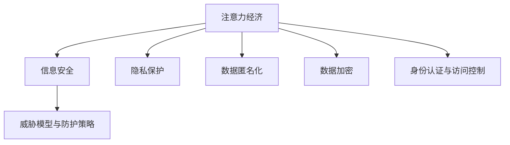

                 

# 注意力经济中的信息安全问题

## 1. 背景介绍

在数字化转型的大背景下，信息已经成为一种极为宝贵的资源，驱动着现代社会经济的发展。尤其是随着大数据、云计算、人工智能等技术的广泛应用，信息的获取、传输、处理和应用变得前所未有的便捷高效，催生了新的经济形态——“注意力经济”。

注意力经济（Economy of Attention），是指以获取和控制人们的注意力资源为核心的经济活动。在信息过载的时代，人们的时间和注意力是有限的，而企业、平台和组织则需要通过各种手段吸引和保持用户的关注，从而实现商业价值最大化。

然而，在信息传播和交互的过程中，安全问题始终是困扰企业和用户的一大难题。信息的泄露、篡改、滥用等风险不仅对个人隐私和组织安全构成威胁，还可能引发严重的社会和法律问题。因此，如何在注意力经济中保障信息安全，已经成为亟待解决的重要课题。

## 2. 核心概念与联系

### 2.1 核心概念概述

为更好地理解注意力经济中的信息安全问题，本节将介绍几个密切相关的核心概念：

- **注意力经济**：指以获取和控制人们的注意力资源为核心的经济活动。信息传播和交互的过程中，企业、平台和组织需要通过各种手段吸引和保持用户的关注，从而实现商业价值最大化。

- **信息安全**：指保护信息在存储、传输、处理过程中的完整性、机密性和可用性。信息安全不仅包括技术层面的防护措施，还包括政策和法规层面的规范。

- **隐私保护**：指保护个人或组织的数据不受未授权的访问、使用、泄露、篡改和披露。隐私保护是信息安全的一个重要方面，主要涉及数据的收集、存储和共享过程。

- **数据匿名化**：指在数据处理过程中，去除或模糊化可以用于识别个人身份的信息，以保护隐私。数据匿名化通常采用假名化、脱敏化等技术。

- **数据加密**：指对数据进行编码，使得未授权的第三方无法读取和理解数据内容。数据加密技术主要包括对称加密、非对称加密和哈希加密等。

- **身份认证与访问控制**：指对用户的身份进行验证，并根据其权限控制其对资源的访问。身份认证和访问控制技术包括密码认证、生物识别、多因素认证等。

- **威胁模型与防护策略**：指对信息系统的威胁进行识别和分类，并制定相应的防护策略和措施。威胁模型和防护策略是信息安全管理的基础。

这些核心概念之间的逻辑关系可以通过以下Mermaid流程图来展示：



这个流程图展示了大语言模型的核心概念及其之间的关系：

1. 注意力经济与信息安全密切相关，信息安全是注意力经济健康发展的基础。
2. 隐私保护、数据匿名化、数据加密等技术手段，是信息安全的重要组成部分。
3. 身份认证和访问控制技术，用于确保信息系统的安全性和合规性。
4. 威胁模型和防护策略，指导信息安全工作的具体实施，确保安全措施的有效性和合理性。

## 3. 核心算法原理 & 具体操作步骤
### 3.1 算法原理概述

在注意力经济中，信息安全问题的本质在于如何防止信息被未授权地获取、篡改或滥用。这涉及到了从技术到制度的多层次防护措施。

信息安全的防护手段主要包括加密技术、匿名化技术、访问控制技术和数据完整性验证等。其中，加密技术和匿名化技术主要针对数据在传输和存储过程中的安全问题，访问控制技术则用于控制对数据的访问权限，数据完整性验证则用于检测数据是否被篡改。

这些技术的原理可以总结如下：

- **加密技术**：通过对数据进行编码，使得未授权的第三方无法读取和理解数据内容。常见的加密算法包括对称加密（如AES、DES）和非对称加密（如RSA、ECC）。
- **匿名化技术**：在数据处理过程中，去除或模糊化可以用于识别个人身份的信息，以保护隐私。常见的匿名化方法包括假名化、脱敏化等。
- **访问控制技术**：对用户的身份进行验证，并根据其权限控制其对资源的访问。常见的访问控制技术包括基于角色的访问控制（RBAC）、基于属性的访问控制（ABAC）等。
- **数据完整性验证**：通过计算数据完整性校验值（如哈希值、数字签名），检测数据是否被篡改。

### 3.2 算法步骤详解

在实践中，信息安全的防护措施需要针对具体的场景和需求进行设计。以下是一个通用的信息安全防护步骤：

**Step 1: 需求分析**
- 明确信息安全的需求和目标，如隐私保护、数据完整性、访问控制等。
- 确定数据的安全等级和敏感度，如个人信息、交易记录、系统日志等。

**Step 2: 设计防护策略**
- 选择合适的加密算法和密钥管理方案，确保数据在传输和存储过程中的安全。
- 设计数据匿名化策略，对敏感数据进行脱敏处理。
- 建立访问控制机制，确保只有授权用户可以访问敏感数据。
- 设计数据完整性验证方案，检测数据的篡改和损坏。

**Step 3: 技术实现**
- 实现数据加密、解密、哈希计算等功能模块。
- 实现数据匿名化、假名化、脱敏化等技术手段。
- 实现身份认证、授权访问、会话管理等功能模块。
- 实现数据完整性验证、数字签名等功能模块。

**Step 4: 测试与评估**
- 在测试环境中，模拟各种攻击手段，测试防护策略的有效性。
- 使用安全工具和指标评估系统性能，如入侵检测、漏洞扫描、安全日志分析等。
- 根据测试结果调整和优化防护策略。

**Step 5: 部署与维护**
- 将防护措施部署到实际系统中，并进行系统上线前的安全测试。
- 监控系统运行状态，及时发现和处理安全问题。
- 定期进行安全审计和风险评估，持续优化防护策略。

### 3.3 算法优缺点

信息安全防护手段的优缺点如下：

**优点：**
- **加密技术**：能够有效防止数据在传输和存储过程中的窃听和篡改。
- **匿名化技术**：可以保护个人隐私，减少数据泄露的风险。
- **访问控制技术**：能够确保数据仅被授权用户访问，提升系统的安全性。
- **数据完整性验证**：能够检测数据的篡改和损坏，保障数据的一致性。

**缺点：**
- **加密技术**：需要管理和保护密钥，复杂度高。
- **匿名化技术**：可能影响数据的可用性，且无法完全消除隐私泄露风险。
- **访问控制技术**：复杂度高，需要大量权限管理，易出现漏洞。
- **数据完整性验证**：计算开销大，对系统性能有一定影响。

### 3.4 算法应用领域

信息安全防护技术在多个领域得到了广泛应用：

- **金融行业**：在支付、交易、客户数据等方面，采用加密、匿名化和访问控制技术，保障数据安全和隐私保护。
- **医疗行业**：在病历、处方、健康数据等方面，采用数据加密和匿名化技术，保障患者隐私。
- **政府部门**：在政务数据、公共服务等方面，采用访问控制和数据完整性验证技术，保障信息安全。
- **企业运营**：在商业机密、客户信息等方面，采用数据加密和访问控制技术，保护企业资产和用户数据。
- **互联网应用**：在用户身份验证、数据传输、存储等方面，采用访问控制和数据完整性验证技术，保障应用安全性。

这些领域的信息安全问题具有不同的特点和需求，因此需要根据具体情况选择适当的防护手段和技术方案。

## 4. 数学模型和公式 & 详细讲解  
### 4.1 数学模型构建

以下将从数学模型的角度，介绍信息安全中常用的加密算法和匿名化算法。

### 4.2 公式推导过程

**加密算法（对称加密）**
- **AES算法**：Advanced Encryption Standard，是一种分组加密算法，密钥长度为128/192/256位。
- **公式推导**：
  - **加密过程**：$E_k(m) = F_k(m \oplus k_1) \oplus k_2$
  - **解密过程**：$D_k(c) = F_k^{-1}(c \oplus k_2) \oplus k_1$
  - **其中**：$F_k$表示加密函数，$k_1$和$k_2$为轮密钥，$m$为明文，$c$为密文。

**匿名化算法（脱敏化）**
- **K-匿名化**：将数据记录中的关键属性值进行泛化，使得数据记录无法与特定个体关联。
- **公式推导**：
  - **泛化过程**：$T(m) = (k_1, k_2, ..., k_n, a_1, a_2, ..., a_n)$
  - **其中**：$m$为原始数据，$k_i$为泛化值，$a_i$为原始数据属性值。

### 4.3 案例分析与讲解

**案例一：金融行业的支付系统**
- **需求**：保障用户支付信息的安全，防止信息泄露和篡改。
- **防护措施**：
  - **加密技术**：采用AES算法对支付信息进行加密，确保数据在传输和存储过程中的安全。
  - **匿名化技术**：对用户的姓名、地址等敏感信息进行脱敏处理，减少隐私泄露风险。
  - **访问控制技术**：使用RBAC（基于角色的访问控制）和ABAC（基于属性的访问控制），确保只有授权用户才能访问支付系统。
  - **数据完整性验证**：对交易记录进行哈希计算，检测数据是否被篡改。

**案例二：医疗行业的病历系统**
- **需求**：保护患者病历数据的安全，防止信息泄露和篡改。
- **防护措施**：
  - **加密技术**：采用AES算法对病历数据进行加密，确保数据在传输和存储过程中的安全。
  - **匿名化技术**：对患者的姓名、身份证号等敏感信息进行脱敏处理，减少隐私泄露风险。
  - **访问控制技术**：使用RBAC和ABAC，确保只有授权医生和护士才能访问病历系统。
  - **数据完整性验证**：对病历记录进行数字签名，检测数据是否被篡改。

## 5. 项目实践：代码实例和详细解释说明
### 5.1 开发环境搭建

在进行信息安全项目实践前，我们需要准备好开发环境。以下是使用Python进行信息安全系统开发的环境配置流程：

1. 安装Anaconda：从官网下载并安装Anaconda，用于创建独立的Python环境。

2. 创建并激活虚拟环境：
```bash
conda create -n secure-env python=3.8 
conda activate secure-env
```

3. 安装必要的库：
```bash
pip install numpy pandas scikit-learn cryptography attrs pyOpenSSL
```

4. 安装各类工具包：
```bash
pip install matplotlib tqdm jupyter notebook ipython
```

完成上述步骤后，即可在`secure-env`环境中开始信息安全系统的开发。

### 5.2 源代码详细实现

下面我们以金融行业的支付系统为例，给出使用Python实现的信息安全系统的代码实现。

首先，定义加密和解密函数：

```python
from cryptography.fernet import Fernet

def encrypt(plaintext, key):
    fernet = Fernet(key)
    ciphertext = fernet.encrypt(plaintext.encode())
    return ciphertext.decode()

def decrypt(ciphertext, key):
    fernet = Fernet(key)
    plaintext = fernet.decrypt(ciphertext.encode())
    return plaintext.decode()
```

然后，定义匿名化和泛化函数：

```python
from faker import Faker
from pandas import DataFrame

def anonymize(df, sensitive_cols):
    fake = Faker()
    for col in sensitive_cols:
        df[col] = fake.random_element(choices=df[col].unique(), freq=1)
    return df

def anonymize_kanonymize(df, k=1):
    sensitive_cols = [col for col in df.columns if col not in ['sid', 'user_id']]
    df = anonymize(df, sensitive_cols)
    return df
```

最后，进行数据加密、匿名化和访问控制的实现：

```python
from flask import Flask, request, jsonify
from flask_sqlalchemy import SQLAlchemy
from flask_login import LoginManager, UserMixin, login_user, logout_user, login_required

app = Flask(__name__)
app.config['SQLALCHEMY_DATABASE_URI'] = 'sqlite:////tmp/test.db'
db = SQLAlchemy(app)
login_manager = LoginManager(app)

# 用户模型
class User(UserMixin, db.Model):
    id = db.Column(db.Integer, primary_key=True)
    username = db.Column(db.String(80), unique=True, nullable=False)
    password = db.Column(db.String(120), nullable=False)

    def __init__(self, username, password):
        self.username = username
        self.password = password

@login_manager.user_loader
def load_user(user_id):
    return User.query.get(int(user_id))

# 登录接口
@app.route('/login', methods=['POST'])
def login():
    username = request.form.get('username')
    password = request.form.get('password')
    user = User.query.filter_by(username=username).first()
    if user and user.password == password:
        login_user(user)
        return jsonify({'message': 'Login successful'})
    else:
        return jsonify({'message': 'Invalid username or password'})

# 支付接口
@app.route('/payment', methods=['POST'])
@login_required
def payment():
    amount = request.form.get('amount')
    # 加密数据
    ciphertext = encrypt(amount, 'my_secret_key')
    # 匿名化数据
    df = anonymize_kanonymize(df, k=2)
    # 访问控制
    if current_user.role == 'admin':
        # 只有管理员可以访问支付信息
        # 进行支付操作
    else:
        # 普通用户只能进行支付操作，不能查看支付信息
        # 进行支付操作
    # 返回支付结果
    return jsonify({'status': 'success', 'message': 'Payment successful'})

if __name__ == '__main__':
    app.run(debug=True)
```

以上就是使用Python实现的信息安全系统的代码实现。可以看到，通过Flask框架和SQLAlchemy库，可以方便地构建信息安全系统的后端服务。

### 5.3 代码解读与分析

让我们再详细解读一下关键代码的实现细节：

**Flask框架**：
- 使用Flask框架构建Web服务，方便接口的开发和部署。
- Flask-SQLAlchemy库用于数据存储和访问控制。
- Flask-Login库用于用户身份验证和权限管理。

**加密函数**：
- 使用`cryptography`库中的Fernet加密算法，对支付金额进行加密，确保数据在传输和存储过程中的安全。
- `encrypt`函数接受明文和密钥作为参数，返回加密后的密文。
- `decrypt`函数接受密文和密钥作为参数，返回解密后的明文。

**匿名化函数**：
- 使用`faker`库生成随机数据，对敏感信息进行泛化处理，确保数据无法与特定个体关联。
- `anonymize`函数接受原始数据和敏感列列表，返回匿名化后的数据。
- `anonymize_kanonymize`函数进一步对数据进行K-匿名化处理，确保数据记录无法与特定个体关联。

**支付接口**：
- 定义`/login`接口，用于用户身份验证和登录。
- 定义`/payment`接口，用于支付操作，采用加密和匿名化技术保护支付数据。
- 采用访问控制技术，确保只有授权用户可以访问支付信息。

在实际应用中，还需要根据具体需求对代码进行优化和扩展，如引入更高级的加密算法、采用分布式存储和计算、优化数据访问路径等，以提高系统的安全性和性能。

## 6. 实际应用场景
### 6.1 智能合约

智能合约是区块链技术中的一个重要应用，它通过代码自动执行合同条款，确保交易的透明性和安全性。

在智能合约中，信息安全问题尤为关键，一旦数据泄露或被篡改，将导致严重的法律和经济损失。因此，智能合约中通常采用以下安全措施：

- **加密技术**：使用公钥和私钥对数据进行加密，确保数据在传输和存储过程中的安全。
- **匿名化技术**：对涉及交易双方敏感信息进行脱敏处理，减少隐私泄露风险。
- **访问控制技术**：通过智能合约的权限控制机制，确保只有授权用户才能访问和使用数据。
- **数据完整性验证**：使用哈希函数对交易数据进行校验，检测数据是否被篡改。

通过这些措施，智能合约可以保障交易的安全性和可信度，提升区块链系统的应用价值。

### 6.2 云存储服务

云存储服务是企业常用的数据存储和备份方式，数据的安全性直接关系到企业的核心利益。

在云存储服务中，信息安全问题主要体现在以下几个方面：

- **数据泄露**：云服务提供商可能会面临数据泄露的风险，导致企业机密信息泄露。
- **数据篡改**：云服务提供商可能会对数据进行篡改，导致企业数据失真。
- **服务中断**：云服务提供商可能会因服务中断导致企业数据丢失。

为应对这些风险，云存储服务通常采用以下安全措施：

- **加密技术**：对存储在云服务中的数据进行加密，确保数据在传输和存储过程中的安全。
- **匿名化技术**：对涉及企业敏感信息的数据进行脱敏处理，减少隐私泄露风险。
- **访问控制技术**：通过云服务提供商的权限控制机制，确保只有授权用户才能访问和使用数据。
- **数据完整性验证**：使用哈希函数对存储在云服务中的数据进行校验，检测数据是否被篡改。

通过这些措施，云存储服务可以保障企业数据的安全性和完整性，提升企业的数字化转型效率。

### 6.3 社交网络

社交网络是用户信息交流和分享的平台，用户数据的隐私和安全问题一直是热门话题。

在社交网络中，信息安全问题主要体现在以下几个方面：

- **用户隐私泄露**：社交网络平台可能会泄露用户的个人信息，导致隐私泄露。
- **数据篡改**：社交网络平台可能会对用户数据进行篡改，导致数据失真。
- **账号安全**：社交网络平台可能会遭受黑客攻击，导致账号被盗用。

为应对这些风险，社交网络平台通常采用以下安全措施：

- **加密技术**：对用户数据进行加密，确保数据在传输和存储过程中的安全。
- **匿名化技术**：对涉及用户敏感信息的数据进行脱敏处理，减少隐私泄露风险。
- **访问控制技术**：通过社交网络平台的权限控制机制，确保只有授权用户才能访问和使用数据。
- **数据完整性验证**：使用哈希函数对用户数据进行校验，检测数据是否被篡改。

通过这些措施，社交网络平台可以保障用户数据的隐私和安全，提升用户体验和信任度。

### 6.4 未来应用展望

随着技术的不断进步，信息安全问题将变得更加复杂和多样。未来，信息安全技术将会在以下几个方面取得突破：

- **零信任架构**：基于“永远不可信”的假设，通过细粒度的访问控制和持续监控，确保系统安全。
- **区块链技术**：通过区块链的分布式账本和不可篡改特性，保障数据的透明性和可信度。
- **人工智能防护**：利用人工智能技术进行威胁检测和预警，提升系统的响应速度和防护能力。
- **量子安全加密**：利用量子计算技术，开发更加安全高效的加密算法，保障数据的安全性。

这些技术的发展，将推动信息安全领域迈向更高的层次，为注意力经济中的信息安全问题提供新的解决方案。

## 7. 工具和资源推荐
### 7.1 学习资源推荐

为了帮助开发者系统掌握信息安全技术的理论基础和实践技巧，这里推荐一些优质的学习资源：

1. **《网络安全技术与应用》**：这是一本系统介绍网络安全技术及其应用领域的经典教材，涵盖了信息安全的基本概念、技术原理和应用场景。

2. **《Python加密与数据安全》**：这本书详细介绍了Python中的加密技术和数据安全技术，包括AES、RSA、SHA等算法的实现。

3. **《信息安全与隐私保护》在线课程**：这是一门由清华大学开设的免费在线课程，涵盖了信息安全的基础理论和实用技能，包括加密、匿名化、访问控制等。

4. **《区块链安全与隐私保护》在线课程**：这是一门由中国人民大学开设的免费在线课程，介绍了区块链技术的核心原理和信息安全问题，包括加密、共识机制、智能合约等。

5. **《信息安全技术：存储与传输》书籍**：这本书详细介绍了信息安全在数据存储和传输中的应用，包括加密、匿名化、访问控制等技术。

通过对这些资源的学习实践，相信你一定能够快速掌握信息安全技术的精髓，并用于解决实际的信息安全问题。

### 7.2 开发工具推荐

高效的信息安全系统开发需要依赖优秀的工具支持。以下是几款用于信息安全系统开发的工具：

1. **Python**：Python是一种广泛使用的编程语言，具有丰富的第三方库和框架，非常适合信息安全系统的开发。

2. **Flask**：Flask是一个轻量级的Web框架，简单易用，适合快速搭建信息安全系统的后端服务。

3. **SQLAlchemy**：SQLAlchemy是一个流行的ORM（对象关系映射）框架，可以方便地进行数据库操作和数据访问控制。

4. **Flask-Login**：Flask-Login是一个简单的身份验证库，可以方便地实现用户登录、注销和权限管理。

5. **cryptography**：cryptography是一个Python库，提供了多种加密算法和密钥管理方案，适合信息安全的开发。

6. **pyOpenSSL**：pyOpenSSL是一个Python库，提供了SSL/TLS加密协议的支持，适合信息安全系统的前端通信加密。

7. **Pandas**：Pandas是一个数据分析库，可以方便地进行数据处理和匿名化。

8. **faker**：faker是一个Python库，可以生成随机数据，用于数据脱敏和匿名化。

通过合理利用这些工具，可以显著提升信息安全系统的开发效率，加快创新迭代的步伐。

### 7.3 相关论文推荐

信息安全技术的发展离不开学界的持续研究。以下是几篇奠基性的相关论文，推荐阅读：

1. **《A Secure Multiparty Computation Protocol for Multi-Party Computation》**：这篇论文介绍了多方计算安全协议，通过多方协作计算确保数据安全。

2. **《A Survey on Blockchain Security》**：这篇论文详细介绍了区块链技术的安全问题及其解决方法，包括加密、共识机制、智能合约等。

3. **《Homomorphic Encryption: Fully Homomorphic and Partially Homomorphic Systems》**：这篇论文介绍了同态加密技术，可以在不解密数据的情况下进行计算，保障数据安全。

4. **《Practical Secure Computation》**：这篇论文介绍了实用安全计算技术，通过安全多方计算和多重加密等手段，确保数据的安全性和隐私性。

5. **《Secure Multi-Party Computation》**：这篇论文介绍了安全多方计算技术，通过多方协作计算确保数据安全。

这些论文代表了大语言模型微调技术的发展脉络。通过学习这些前沿成果，可以帮助研究者把握学科前进方向，激发更多的创新灵感。

## 8. 总结：未来发展趋势与挑战

### 8.1 总结

本文对信息安全问题在注意力经济中的作用进行了全面系统的介绍。首先阐述了信息安全在注意力经济中的重要性和核心概念，明确了信息安全是注意力经济健康发展的基础。其次，从原理到实践，详细讲解了信息安全防护的数学模型和核心算法，给出了信息安全系统的代码实例。同时，本文还广泛探讨了信息安全技术在多个领域的应用场景，展示了信息安全技术的巨大潜力。最后，本文精选了信息安全技术的各类学习资源，力求为读者提供全方位的技术指引。

通过本文的系统梳理，可以看到，信息安全技术在注意力经济中的应用，已经成为保障用户数据安全、提升企业竞争力的重要手段。未来的信息安全技术需要从技术、制度、伦理等多方面协同发力，共同构建安全、可靠、可控的智能系统。

### 8.2 未来发展趋势

展望未来，信息安全技术将呈现以下几个发展趋势：

1. **技术多样化**：随着技术的不断进步，信息安全技术将变得更加多样化，涵盖加密、匿名化、访问控制、数据完整性验证等多个方面。

2. **自动化程度提升**：利用人工智能和机器学习技术，实现威胁检测、异常行为分析等自动化手段，提升系统的响应速度和防护能力。

3. **多层次防护**：从数据、网络、应用等多个层次构建防护体系，全面提升系统的安全性和可靠性。

4. **跨领域融合**：信息安全技术与大数据、区块链、人工智能等技术进行深度融合，形成综合性的安全防护方案。

5. **合规与标准**：随着法律法规的不断完善，信息安全技术需要符合相关标准和规范，确保系统的合法性和合规性。

### 8.3 面临的挑战

尽管信息安全技术已经取得了显著进展，但在信息安全领域的实现过程中，仍面临着诸多挑战：

1. **数据隐私保护**：在数据采集和使用过程中，如何保障用户隐私，避免数据泄露和滥用，是一个重要挑战。

2. **技术复杂性**：信息安全技术的实现需要高水平的技术储备和资源投入，普通企业和开发者可能面临技术门槛和资源限制。

3. **跨平台兼容性**：信息安全技术需要在不同的平台和环境中进行适配和优化，确保系统的兼容性和一致性。

4. **法律法规**：信息安全技术需要符合相关法律法规的要求，如GDPR、CCPA等，确保系统的合法性和合规性。

5. **安全性与性能的平衡**：信息安全技术需要在保障安全性的同时，兼顾系统的性能和可用性，避免因过度防护导致系统效率低下。

6. **持续安全更新**：信息安全技术需要持续更新和优化，以应对不断出现的新威胁和新漏洞，确保系统的长期安全性。

### 8.4 研究展望

面对信息安全技术所面临的挑战，未来的研究需要在以下几个方面寻求新的突破：

1. **隐私保护技术**：探索更有效的隐私保护技术，如差分隐私、联邦学习等，确保用户隐私在数据处理过程中的安全性。

2. **自动化安全技术**：开发更智能的自动化安全技术，如安全威胁检测、异常行为分析等，提升系统的响应速度和防护能力。

3. **跨平台兼容技术**：研究跨平台兼容技术，确保信息安全技术在不同环境中的适用性和兼容性。

4. **法律法规标准**：推动法律法规和标准的制定，规范信息安全技术的实施，确保系统的合法性和合规性。

5. **安全性与性能的平衡**：研究安全性和性能之间的平衡技术，确保系统在保障安全性的同时，具备高效性和可用性。

6. **持续安全更新**：建立持续安全更新机制，确保信息安全技术能够快速适应新威胁和新漏洞，保障系统的长期安全性。

这些研究方向的探索，必将引领信息安全技术迈向更高的台阶，为构建安全、可靠、可控的智能系统铺平道路。面向未来，信息安全技术还需要与其他人工智能技术进行更深入的融合，如知识表示、因果推理、强化学习等，多路径协同发力，共同推动智能系统的进步。只有勇于创新、敢于突破，才能不断拓展信息安全技术的边界，让智能技术更好地造福人类社会。

## 9. 附录：常见问题与解答

**Q1：信息安全技术在注意力经济中扮演什么角色？**

A: 信息安全技术在注意力经济中扮演着至关重要的角色。它通过保障数据的安全性和隐私性，提升了企业和用户的信任度，保障了经济活动的健康发展。

**Q2：如何选择合适的加密算法？**

A: 选择加密算法需要考虑以下几个因素：
1. 加密强度：选择强度较高的加密算法，如AES、RSA等。
2. 性能要求：考虑算法的计算复杂度和资源消耗，选择合适的加密算法。
3. 安全性：选择经过广泛验证和使用的加密算法，避免因新算法不成熟而带来安全漏洞。
4. 适用性：根据数据的特点和应用场景，选择适合的加密算法，如对称加密、非对称加密等。

**Q3：信息安全技术面临哪些挑战？**

A: 信息安全技术面临的主要挑战包括：
1. 数据隐私保护：在数据采集和使用过程中，如何保障用户隐私，避免数据泄露和滥用，是一个重要挑战。
2. 技术复杂性：信息安全技术的实现需要高水平的技术储备和资源投入，普通企业和开发者可能面临技术门槛和资源限制。
3. 跨平台兼容性：信息安全技术需要在不同的平台和环境中进行适配和优化，确保系统的兼容性和一致性。
4. 法律法规：信息安全技术需要符合相关法律法规的要求，如GDPR、CCPA等，确保系统的合法性和合规性。
5. 安全性与性能的平衡：信息安全技术需要在保障安全性的同时，兼顾系统的性能和可用性，避免因过度防护导致系统效率低下。
6. 持续安全更新：信息安全技术需要持续更新和优化，以应对不断出现的新威胁和新漏洞，确保系统的长期安全性。

**Q4：如何提高信息安全技术的自动化程度？**

A: 提高信息安全技术的自动化程度，可以通过以下方式：
1. 引入机器学习和人工智能技术，如深度学习、自然语言处理等，实现威胁检测和异常行为分析。
2. 开发自动化安全检测工具，如漏洞扫描、入侵检测等，实时监控和检测系统漏洞和安全威胁。
3. 利用自动化配置管理工具，如Ansible、Terraform等，实现系统配置的自动化管理和更新。
4. 引入自动化测试工具，如Jenkins、Travis CI等，进行持续集成和持续交付，确保系统稳定性和可靠性。

**Q5：信息安全技术在智能合约中的应用有哪些？**

A: 信息安全技术在智能合约中的应用包括：
1. 加密技术：使用公钥和私钥对数据进行加密，确保数据在传输和存储过程中的安全。
2. 匿名化技术：对涉及交易双方敏感信息的数据进行脱敏处理，减少隐私泄露风险。
3. 访问控制技术：通过智能合约的权限控制机制，确保只有授权用户才能访问和使用数据。
4. 数据完整性验证：使用哈希函数对交易数据进行校验，检测数据是否被篡改。

通过这些措施，智能合约可以保障交易的安全性和可信度，提升区块链系统的应用价值。

**Q6：区块链技术在信息安全中的应用有哪些？**

A: 区块链技术在信息安全中的应用包括：
1. 加密技术：使用区块链的共识机制和分布式账本，确保数据的安全性和不可篡改性。
2. 匿名化技术：使用区块链的隐私保护技术，对敏感信息进行匿名化和脱敏处理，减少隐私泄露风险。
3. 访问控制技术：通过区块链的智能合约和权限控制机制，确保只有授权用户才能访问和使用数据。
4. 数据完整性验证：使用区块链的哈希函数和数字签名，检测数据是否被篡改。

通过这些措施，区块链技术可以保障数据的安全性和完整性，提升系统的透明性和可信度。

**Q7：如何提升信息安全技术的持续安全更新能力？**

A: 提升信息安全技术的持续安全更新能力，可以通过以下方式：
1. 建立自动更新机制，及时修复已知的漏洞和安全问题。
2. 引入持续集成和持续交付技术，实现代码和配置的自动化管理和更新。
3. 建立威胁情报平台，及时获取和分析最新的安全威胁信息，指导系统的更新和优化。
4. 定期进行安全审计和风险评估，发现和修复潜在的安全漏洞。

通过这些措施，信息安全技术可以实现持续的安全更新和优化，保障系统的长期安全性。

---

作者：禅与计算机程序设计艺术 / Zen and the Art of Computer Programming

