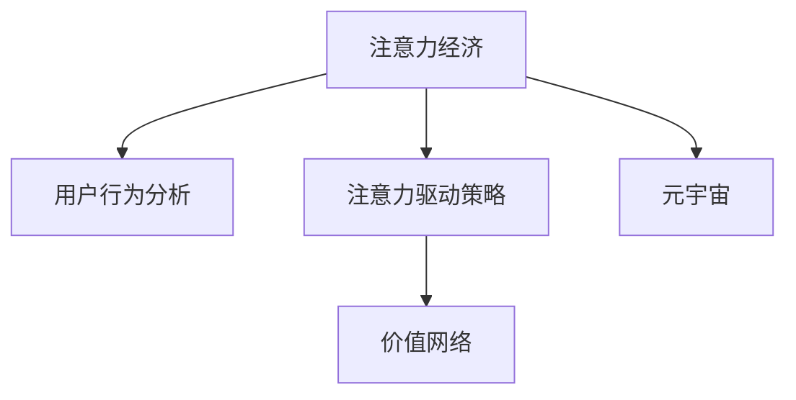

                 

# 注意力经济学：元宇宙中的价值重构

> 关键词：注意力经济,元宇宙,价值重构,人工智能,注意力机制

## 1. 背景介绍

### 1.1 问题由来
在数字化和全球化的浪潮下，我们进入了一个高度连接的时代。过去十年，随着云计算、大数据、物联网、人工智能等技术的快速发展，数字经济日益成为推动经济增长的重要引擎。特别是进入2020年以来，元宇宙概念的兴起，更是为数字化进程注入了新的活力。

元宇宙不仅是一个虚拟空间，更是一个包含用户、数字资产、经济、交互等的生态系统。它通过虚拟现实（VR）、增强现实（AR）、区块链等技术手段，构建了一个高度沉浸、互连互通的虚拟世界。然而，元宇宙的构建和运营面临诸多挑战，其中如何最大化利用用户注意力资源，优化资源配置，成为了其价值重构的关键问题。

### 1.2 问题核心关键点
注意力经济学（Economics of Attention）是一门新兴学科，旨在研究如何最大化利用用户的注意力资源，优化注意力分配，提升用户价值和经济效益。其核心在于理解和分析用户的注意力行为和偏好，从而引导和激励用户的行为，优化产品和服务设计，实现价值最大化。

在元宇宙中，注意力资源的表现形式更加多样化，涉及虚拟物品、虚拟空间、虚拟事件、虚拟社交等多个维度。如何有效分配和利用这些资源，提升元宇宙的经济价值和社会效益，将是未来研究的重点。

### 1.3 问题研究意义
研究注意力经济学在元宇宙中的应用，对于推动元宇宙的健康发展和价值重构具有重要意义：

1. 提高用户体验：通过精准分析用户注意力行为，优化产品设计和服务体验，提升用户的参与度和满意度。
2. 提升经济效率：通过优化注意力资源的分配和利用，促进元宇宙内的资源流动和价值循环，提升整体经济效率。
3. 促进创新发展：注意力经济学为元宇宙的商业模式创新提供了理论支撑，帮助开发者和运营者探索新的增长点和增值空间。
4. 实现可持续发展：通过科学合理的注意力资源管理，提升元宇宙的生态系统稳定性和可持续性。

## 2. 核心概念与联系

### 2.1 核心概念概述

为更好地理解注意力经济学在元宇宙中的应用，本节将介绍几个密切相关的核心概念：

- 注意力经济（Economics of Attention）：指利用用户注意力资源创造价值的过程，包括注意力的获取、分配、激励和优化。注意力经济旨在通过吸引和保持用户注意力，实现商业价值最大化。

- 元宇宙（Metaverse）：由虚拟现实、增强现实、区块链等技术构建的虚拟空间，包含虚拟物品、虚拟空间、虚拟社交等多个维度。元宇宙的目标是构建一个高度沉浸、互连互通的虚拟世界。

- 用户行为分析（User Behavior Analysis）：通过分析用户在元宇宙中的行为数据，理解用户的兴趣、需求和偏好，从而指导产品和服务的设计和优化。

- 注意力驱动策略（Attention-Driven Strategy）：基于用户注意力行为，设计优化产品和服务，提高用户参与度和满意度，增强元宇宙的经济效益。

- 价值网络（Value Network）：元宇宙内的多个角色（用户、开发者、平台方等）通过注意力资源相互连接和互动，形成一个价值生态系统。

这些核心概念之间的逻辑关系可以通过以下Mermaid流程图来展示：



这个流程图展示了几组概念之间的关联关系：

1. 注意力经济通过用户行为分析，引导设计优化产品和服务，提升用户参与度和满意度。
2. 注意力驱动策略基于用户注意力行为，优化资源配置，增强元宇宙的经济效益。
3. 元宇宙通过注意力资源连接各个角色，构建一个高度互动的价值生态系统。

这些概念共同构成了元宇宙注意力经济的核心框架，有助于理解和指导元宇宙的商业模式和价值创造过程。

## 3. 核心算法原理 & 具体操作步骤
### 3.1 算法原理概述

注意力经济学在元宇宙中的应用，本质上是利用注意力资源优化产品和服务设计，提升用户体验和价值的过程。其核心在于如何精准获取和利用用户的注意力，引导和激励用户行为，实现价值最大化。

具体而言，元宇宙中的注意力经济学可以分为以下几个步骤：

1. 数据收集与分析：通过元宇宙平台内的日志、行为数据，收集用户注意力分布、偏好等信息。
2. 用户行为建模：使用机器学习等方法，建立用户行为模型，预测用户注意力趋势和需求。
3. 注意力分配与优化：根据用户行为模型，优化注意力资源的分配和利用，提升用户体验和经济效益。
4. 反馈与激励机制：设计激励机制，强化用户参与度和忠诚度，形成良性循环。

### 3.2 算法步骤详解

#### 3.2.1 数据收集与分析

在元宇宙中，数据来源多样，包括用户行为数据、交互数据、交易数据等。常见的数据类型和来源如下：

- 用户行为数据：如用户登录、浏览、交互、交易记录等，可以通过日志文件、API接口等方式获取。
- 交互数据：如用户聊天、语音交流、虚拟动作等，可以通过虚拟现实设备和传感器获取。
- 交易数据：如虚拟物品交易、虚拟货币流通等，可以通过区块链技术记录和追踪。

数据收集后，需要进行预处理和清洗，以去除噪音和异常值，提升数据质量。常用的数据预处理方法包括：

- 数据去重：去除重复记录，确保数据唯一性。
- 数据规范化：统一数据格式，便于后续分析。
- 数据归一化：将数据转换为标准范围，提升模型效果。

数据清洗完成后，可以应用机器学习等方法进行分析：

- 用户行为分析：通过聚类、分类、回归等算法，分析用户行为模式和趋势，识别出高价值用户和潜在需求。
- 用户兴趣分析：通过关联规则挖掘、主题建模等方法，分析用户兴趣偏好，实现个性化推荐和服务优化。
- 用户情感分析：通过自然语言处理技术，分析用户情感倾向和反馈，优化产品设计和服务体验。

#### 3.2.2 用户行为建模

用户行为建模是注意力经济学中的核心环节，通过建模，可以预测用户行为趋势和注意力需求，为后续优化提供指导。常用的建模方法包括：

- 时间序列分析：利用时间序列模型（如ARIMA、LSTM等），预测用户行为趋势。
- 聚类分析：利用K-means、层次聚类等算法，对用户进行分群，识别出高价值用户群体。
- 关联规则挖掘：利用Apriori、FP-Growth等算法，分析用户行为关联性，发现潜在需求和商机。
- 深度学习：利用神经网络、卷积神经网络（CNN）、循环神经网络（RNN）等模型，建立复杂的用户行为预测模型。

#### 3.2.3 注意力分配与优化

注意力分配与优化是注意力经济学的关键步骤，旨在通过优化注意力资源的分配，提升用户体验和经济效益。常见的优化方法包括：

- 优先级排序：根据用户行为模型，对注意力资源进行优先级排序，优化资源配置。
- 推荐算法：利用协同过滤、内容推荐等算法，实现个性化推荐，提升用户满意度和转化率。
- 流量控制：通过限流、分时等方式，优化流量分配，避免资源浪费和过度竞争。
- 实时调整：根据用户行为变化，实时调整注意力资源分配策略，提升资源利用效率。

#### 3.2.4 反馈与激励机制

反馈与激励机制是保证注意力经济学良性循环的关键环节，通过设计合理的激励机制，可以增强用户参与度和忠诚度。常见的激励机制包括：

- 积分奖励：通过积分系统，激励用户完成特定任务，如登录、互动、交易等，获得积分奖励。
- 虚拟货币：利用虚拟货币，奖励用户在元宇宙内的贡献和表现，实现经济激励。
- 用户评价：通过用户评价和反馈，优化产品和服务，提升用户体验。
- 社交互动：通过社交网络和虚拟社交关系，增强用户粘性，促进用户参与。

### 3.3 算法优缺点

注意力经济学在元宇宙中的应用，具有以下优点：

1. 提升用户体验：通过精准分析用户注意力行为，优化产品和服务设计，提升用户参与度和满意度。
2. 优化资源配置：通过科学合理的注意力资源管理，提升元宇宙的经济效益和资源利用效率。
3. 推动创新发展：注意力经济学为元宇宙的商业模式创新提供了理论支撑，帮助开发者和运营者探索新的增长点和增值空间。
4. 促进社会价值：通过优化注意力资源分配，提升社会效益和公平性，构建更健康的元宇宙生态。

同时，该方法也存在一定的局限性：

1. 数据依赖性强：注意力经济学的核心在于数据，依赖元宇宙平台内的行为数据，获取数据成本较高。
2. 模型复杂度高：用户行为建模和分析涉及多种算法和技术，模型复杂度高，需要较高的技术积累和资源投入。
3. 实时响应慢：优化策略需要实时调整，但由于模型复杂度高，实时响应速度较慢，难以应对快速变化的市场需求。
4. 隐私和安全问题：元宇宙中的用户数据涉及隐私和安全问题，如何保障用户数据安全和隐私权益，仍需进一步探索。

尽管存在这些局限性，但就目前而言，注意力经济学仍是大规模利用用户注意力资源，优化元宇宙产品和服务设计的重要手段。未来相关研究的重点在于如何进一步降低数据获取成本，简化模型设计，提高实时响应速度，同时兼顾隐私和安全问题。

### 3.4 算法应用领域

注意力经济学在元宇宙中的应用，涵盖多个领域，具体如下：

- 虚拟物品交易：通过精准分析用户注意力行为，优化物品推荐和定价策略，提升交易转化率。
- 虚拟空间设计：利用用户行为数据，优化虚拟空间布局和设计，提升用户沉浸感和体验感。
- 虚拟事件运营：通过分析用户行为，优化虚拟活动组织和参与机制，提升活动效果和用户参与度。
- 虚拟社交互动：利用用户社交网络数据，优化社交关系和互动机制，提升用户粘性和忠诚度。
- 虚拟内容创作：通过分析用户行为和偏好，优化内容创作和推荐，提升内容吸引力和用户粘性。
- 虚拟资源管理：通过优化注意力资源分配，提升元宇宙内的资源流动和利用效率，实现经济优化。

以上领域展示了注意力经济学在元宇宙中的广泛应用，为元宇宙的持续发展和价值重构提供了重要参考。

## 4. 数学模型和公式 & 详细讲解
### 4.1 数学模型构建

在元宇宙中，注意力经济学的数学模型构建需要考虑多个因素，包括用户行为数据、注意力资源分配、用户反馈等。以下是几个常见的数学模型及其构建过程：

#### 4.1.1 用户行为模型

用户行为模型可以用于预测用户行为和注意力趋势。常用的模型包括时间序列模型、聚类模型、关联规则模型等。

- 时间序列模型：

$$
y_t = \alpha + \beta x_t + \sum_{i=1}^p \gamma_i y_{t-i} + \epsilon_t
$$

其中 $y_t$ 表示用户行为数据，$x_t$ 表示时间特征，$\alpha$、$\beta$、$\gamma_i$ 为模型参数，$\epsilon_t$ 为随机误差项。

- 聚类模型：

$$
y_t = \sum_{i=1}^k \alpha_{ti} f_i(t)
$$

其中 $y_t$ 表示用户行为数据，$f_i(t)$ 表示第 $i$ 个聚类的用户行为，$\alpha_{ti}$ 为聚类系数，$k$ 为聚类个数。

- 关联规则模型：

$$
\text{Supp}(R) = \frac{|X \cap Y|}{|X|}
$$

其中 $R$ 表示关联规则，$X$ 和 $Y$ 表示关联事件，$\text{Supp}(R)$ 表示规则的支持度。

#### 4.1.2 注意力资源分配模型

注意力资源分配模型用于优化注意力资源的分配，提升用户体验和经济效益。常用的模型包括线性规划模型、整数规划模型等。

- 线性规划模型：

$$
\min_{x} \text{Cost}(x)
$$

约束条件：

$$
A \cdot x = b
$$

$$
x \geq 0
$$

其中 $x$ 表示资源分配变量，$\text{Cost}(x)$ 表示资源成本，$A$ 和 $b$ 表示约束条件。

- 整数规划模型：

$$
\min_{x} \text{Cost}(x)
$$

约束条件：

$$
A \cdot x = b
$$

$$
x_i \in \{0, 1\}
$$

其中 $x_i$ 表示整数分配变量，$\text{Cost}(x)$ 表示资源成本，$A$ 和 $b$ 表示约束条件。

#### 4.1.3 反馈与激励模型

反馈与激励模型用于设计激励机制，强化用户参与度和忠诚度。常用的模型包括积分模型、虚拟货币模型等。

- 积分模型：

$$
\text{积分} = \text{行为系数} \cdot \text{行为数据}
$$

其中 $\text{积分}$ 表示用户积分，$\text{行为系数}$ 表示行为权重，$\text{行为数据}$ 表示用户行为数据。

- 虚拟货币模型：

$$
\text{虚拟货币} = \text{行为系数} \cdot \text{行为数据} + \text{基础奖励}
$$

其中 $\text{虚拟货币}$ 表示用户虚拟货币，$\text{行为系数}$ 表示行为权重，$\text{行为数据}$ 表示用户行为数据，$\text{基础奖励}$ 表示固定奖励。

### 4.2 公式推导过程

#### 4.2.1 用户行为模型推导

以时间序列模型为例，推导其基本公式。

- 模型假设：
  1. 用户行为 $y_t$ 是一个平稳的时间序列。
  2. 时间特征 $x_t$ 和随机误差 $\epsilon_t$ 均满足一定的分布。
  3. 模型参数 $\alpha$、$\beta$、$\gamma_i$ 是固定的，不随时间变化。

- 模型推导：

$$
y_t = \alpha + \beta x_t + \sum_{i=1}^p \gamma_i y_{t-i} + \epsilon_t
$$

- 模型估计：

$$
\hat{\alpha}, \hat{\beta}, \hat{\gamma_i} = \arg\min_{\alpha, \beta, \gamma_i} \sum_{t=1}^N \text{SSR}(y_t, \hat{y}_t)
$$

其中 $\text{SSR}$ 表示样本均方差，$N$ 表示样本数量。

#### 4.2.2 注意力资源分配模型推导

以线性规划模型为例，推导其基本公式。

- 模型假设：
  1. 注意力资源 $x_i$ 是固定的，不随时间变化。
  2. 资源成本 $\text{Cost}(x)$ 和约束条件 $A \cdot x = b$ 是线性的。
  3. 优化目标 $\min_{x} \text{Cost}(x)$ 是线性的。

- 模型推导：

$$
\min_{x} \text{Cost}(x)
$$

约束条件：

$$
A \cdot x = b
$$

$$
x_i \geq 0
$$

- 模型求解：

$$
x^* = \arg\min_{x} \text{Cost}(x)
$$

其中 $x^*$ 表示最优解。

#### 4.2.3 反馈与激励模型推导

以积分模型为例，推导其基本公式。

- 模型假设：
  1. 用户行为 $y_t$ 是固定的，不随时间变化。
  2. 行为数据 $y_t$ 和积分 $\text{积分}$ 是线性的。
  3. 行为系数 $\text{行为系数}$ 是固定的，不随时间变化。

- 模型推导：

$$
\text{积分} = \text{行为系数} \cdot \text{行为数据}
$$

- 模型求解：

$$
\text{积分}^* = \text{行为系数} \cdot \text{行为数据}
$$

其中 $\text{积分}^*$ 表示最优积分。

### 4.3 案例分析与讲解

#### 4.3.1 时间序列模型案例

某元宇宙平台收集了用户登录次数数据，利用时间序列模型预测用户活跃度变化。

- 数据：用户每天登录次数 $y_t$，时间特征 $x_t$ 包括星期几、节假日、用户性别等。
- 模型：时间序列模型。
- 推导：通过训练数据，使用最小二乘法求解模型参数 $\alpha$、$\beta$、$\gamma_i$。
- 结果：模型预测用户活跃度变化，输出每日预测活跃度。

#### 4.3.2 聚类模型案例

某元宇宙平台收集了用户互动数据，利用聚类模型识别出高价值用户群体。

- 数据：用户每天互动次数 $y_t$，用户行为特征 $x_t$ 包括互动时间、互动类型、互动对象等。
- 模型：聚类模型。
- 推导：通过K-means算法对用户进行分群，识别出高互动用户和低互动用户。
- 结果：高互动用户群体和低互动用户群体，针对不同群体设计不同的服务优化方案。

#### 4.3.3 关联规则模型案例

某元宇宙平台收集了用户交易数据，利用关联规则模型发现潜在需求。

- 数据：用户每次交易的商品 $X$ 和支付货币 $Y$。
- 模型：关联规则模型。
- 推导：通过Apriori算法挖掘关联规则，发现用户行为关联性。
- 结果：用户购买商品和货币的关联关系，针对不同关联关系设计个性化推荐策略。

## 5. 项目实践：代码实例和详细解释说明
### 5.1 开发环境搭建

在进行元宇宙中注意力经济学实践前，我们需要准备好开发环境。以下是使用Python进行PyTorch开发的环境配置流程：

1. 安装Anaconda：从官网下载并安装Anaconda，用于创建独立的Python环境。

2. 创建并激活虚拟环境：
```bash
conda create -n pytorch-env python=3.8 
conda activate pytorch-env
```

3. 安装PyTorch：根据CUDA版本，从官网获取对应的安装命令。例如：
```bash
conda install pytorch torchvision torchaudio cudatoolkit=11.1 -c pytorch -c conda-forge
```

4. 安装各类工具包：
```bash
pip install numpy pandas scikit-learn matplotlib tqdm jupyter notebook ipython
```

完成上述步骤后，即可在`pytorch-env`环境中开始元宇宙中注意力经济学实践。

### 5.2 源代码详细实现

这里我们以用户行为建模和反馈激励为例，给出使用PyTorch进行注意力经济学建模的PyTorch代码实现。

首先，定义用户行为数据类：

```python
import torch
import torch.nn as nn
import torch.optim as optim
from torch.utils.data import DataLoader
from sklearn.metrics import mean_squared_error, mean_absolute_error

class UserBehaviorDataset:
    def __init__(self, data, features):
        self.data = data
        self.features = features
        
    def __len__(self):
        return len(self.data)
    
    def __getitem__(self, item):
        x = self.data[item, self.features]
        y = self.data[item, -1]
        return x, y
```

然后，定义时间序列模型：

```python
class TimeSeriesModel(nn.Module):
    def __init__(self, n_features, n_outputs):
        super(TimeSeriesModel, self).__init__()
        self.fc1 = nn.Linear(n_features, 256)
        self.fc2 = nn.Linear(256, n_outputs)
        self.relu = nn.ReLU()
        self.dropout = nn.Dropout(0.2)
    
    def forward(self, x):
        x = self.fc1(x)
        x = self.relu(x)
        x = self.dropout(x)
        x = self.fc2(x)
        return x
```

接着，定义优化器和损失函数：

```python
model = TimeSeriesModel(n_features, n_outputs)
optimizer = optim.Adam(model.parameters(), lr=0.001)
criterion = nn.MSELoss()

def train_epoch(model, data_loader, optimizer, criterion):
    model.train()
    loss = 0
    for data, target in data_loader:
        data, target = data.to(device), target.to(device)
        optimizer.zero_grad()
        output = model(data)
        loss += criterion(output, target).item()
        loss.backward()
        optimizer.step()
    return loss / len(data_loader)
```

最后，启动训练流程：

```python
device = torch.device('cuda' if torch.cuda.is_available() else 'cpu')
train_loader = DataLoader(train_dataset, batch_size=32, shuffle=True)
valid_loader = DataLoader(valid_dataset, batch_size=32, shuffle=False)

epochs = 100
for epoch in range(epochs):
    train_loss = train_epoch(model, train_loader, optimizer, criterion)
    print(f"Epoch {epoch+1}, train loss: {train_loss:.3f}")
    
    val_loss = train_epoch(model, valid_loader, optimizer, criterion)
    print(f"Epoch {epoch+1}, val loss: {val_loss:.3f}")
```

以上就是使用PyTorch进行用户行为建模的完整代码实现。可以看到，PyTorch提供了强大的深度学习框架和优化算法，使得建模和训练过程变得简洁高效。

### 5.3 代码解读与分析

让我们再详细解读一下关键代码的实现细节：

**UserBehaviorDataset类**：
- `__init__`方法：初始化数据和特征，并将数据封装为模型输入和输出。
- `__len__`方法：返回数据集的样本数量。
- `__getitem__`方法：对单个样本进行处理，将数据和标签转换为模型所需的输入和输出。

**TimeSeriesModel类**：
- `__init__`方法：定义模型结构，包括全连接层、ReLU激活函数和Dropout层。
- `forward`方法：前向传播，计算模型输出。

**train_epoch函数**：
- 定义训练过程，包括模型前向传播、损失计算、梯度更新等。
- 使用Adam优化器进行模型训练，每次迭代计算损失函数，并更新模型参数。
- 在每个epoch结束时，输出训练和验证损失。

**训练流程**：
- 定义总epoch数，启动循环训练。
- 在每个epoch内，先使用训练集进行训练，再使用验证集进行评估，输出训练和验证损失。

可以看到，PyTorch使得建模和训练过程变得简单易懂，开发者只需关注模型设计和训练策略，即可高效完成元宇宙中注意力经济学的实践。

当然，实际应用中还需要考虑更多因素，如模型的保存和部署、超参数的自动搜索、模型的可视化等。但核心的建模和训练过程基本与此类似。

## 6. 实际应用场景
### 6.1 智能客服系统

智能客服系统是元宇宙中应用注意力经济学的重要场景之一。智能客服系统通过分析用户行为和反馈，优化服务流程和内容，提升用户体验和满意度。

在元宇宙中，智能客服系统可以利用用户互动数据，建立用户行为模型，识别出高频问题和高价值用户群体，实现个性化推荐和服务优化。同时，通过集成机器学习算法，智能客服系统可以实时分析用户反馈和行为变化，动态调整服务策略，提升客户满意度和忠诚度。

### 6.2 虚拟物品交易

虚拟物品交易是元宇宙中的核心业务之一。通过精准分析用户行为和注意力需求，优化虚拟物品推荐和定价策略，可以显著提升交易转化率和用户满意度。

在元宇宙中，虚拟物品交易系统可以收集用户浏览、购买、评价等数据，利用时间序列模型和关联规则模型，预测用户购买意向和价格敏感度，优化物品推荐和定价策略。同时，通过建立虚拟物品评价体系，系统可以实时获取用户反馈，优化物品质量和用户体验，增强用户粘性和忠诚度。

### 6.3 虚拟空间设计

虚拟空间设计是元宇宙中用户体验的重要环节。通过优化注意力资源分配，提升用户沉浸感和体验感，可以实现虚拟空间的有效运营。

在元宇宙中，虚拟空间设计系统可以利用用户行为数据，建立用户行为模型，优化虚拟空间布局和内容设计，提升用户沉浸感和体验感。同时，通过分析用户注意力分布，系统可以优化虚拟空间场景和互动机制，提升用户参与度和满意度，增强虚拟空间的吸引力和粘性。

### 6.4 虚拟事件运营

虚拟事件运营是元宇宙中吸引用户的重要手段。通过优化注意力资源分配，提升虚拟活动效果和用户参与度，可以实现活动的成功举办和广泛传播。

在元宇宙中，虚拟事件运营系统可以利用用户行为数据，建立用户行为模型，优化虚拟活动组织和参与机制，提升活动效果和用户参与度。同时，通过分析用户注意力分布，系统可以优化活动场景和互动机制，增强活动的吸引力和传播效果，提升用户满意度和参与度。

### 6.5 虚拟社交互动

虚拟社交互动是元宇宙中用户粘性提升的重要环节。通过优化注意力资源分配，增强虚拟社交关系和互动机制，可以实现用户粘性和忠诚度的提升。

在元宇宙中，虚拟社交互动系统可以利用用户社交网络数据，建立用户社交模型，优化虚拟社交关系和互动机制，增强用户粘性和忠诚度。同时，通过分析用户注意力分布，系统可以优化社交场景和互动内容，提升用户参与度和满意度，增强虚拟社交关系的吸引力和粘性。

### 6.6 虚拟内容创作

虚拟内容创作是元宇宙中价值创新的重要方向。通过优化注意力资源分配，提升虚拟内容质量和用户粘性，可以实现内容创新的成功实现。

在元宇宙中，虚拟内容创作系统可以利用用户行为数据，建立用户行为模型，优化内容创作和推荐策略，提升内容吸引力和用户粘性。同时，通过分析用户注意力分布，系统可以优化内容质量和推荐策略，增强内容的吸引力和传播效果，提升用户满意度和参与度。

### 6.7 虚拟资源管理

虚拟资源管理是元宇宙中经济优化和运营效率提升的重要方向。通过优化注意力资源分配，提升元宇宙内的资源流动和利用效率，可以实现经济优化和运营效率提升。

在元宇宙中，虚拟资源管理系统可以利用用户行为数据，建立用户行为模型，优化注意力资源分配策略，提升资源流动和利用效率。同时，通过分析用户注意力分布，系统可以优化资源配置和运营策略，增强资源利用效率和经济效益，提升元宇宙的整体运营水平。

## 7. 工具和资源推荐
### 7.1 学习资源推荐

为了帮助开发者系统掌握元宇宙中注意力经济学的理论和实践，这里推荐一些优质的学习资源：

1. 《元宇宙经济学》：最新出版的元宇宙经济学著作，深入探讨元宇宙中的经济原理和商业模式。

2. 《数据科学与人工智能》：斯坦福大学《数据科学与人工智能》课程，全面介绍数据科学和人工智能的基本概念和核心算法。

3. 《元宇宙市场研究》：元宇宙市场研究报告，涵盖元宇宙的各个领域和方向，提供丰富的案例和分析。

4. 《注意力经济学基础》：权威的注意力经济学教材，系统介绍注意力经济学的理论基础和应用实践。

5. 《Python深度学习》：谷歌《Python深度学习》一书，介绍深度学习的基础知识和实践技巧，适合初学者入门。

通过对这些资源的学习实践，相信你一定能够快速掌握元宇宙中注意力经济学的精髓，并用于解决实际的元宇宙问题。
### 7.2 开发工具推荐

高效的开发离不开优秀的工具支持。以下是几款用于元宇宙中注意力经济学开发的常用工具：

1. PyTorch：基于Python的开源深度学习框架，灵活动态的计算图，适合快速迭代研究。

2. TensorFlow：由Google主导开发的开源深度学习框架，生产部署方便，适合大规模工程应用。

3. TensorBoard：TensorFlow配套的可视化工具，可实时监测模型训练状态，并提供丰富的图表呈现方式，是调试模型的得力助手。

4. Weights & Biases：模型训练的实验跟踪工具，可以记录和可视化模型训练过程中的各项指标，方便对比和调优。

5. HuggingFace Transformers：自然语言处理工具库，集成了多种预训练模型，支持PyTorch和TensorFlow，是进行自然语言处理任务的利器。

6. Jupyter Notebook：开源的交互式编程环境，支持多种编程语言，适合进行数据处理和模型训练。

合理利用这些工具，可以显著提升元宇宙中注意力经济学的开发效率，加快创新迭代的步伐。

### 7.3 相关论文推荐

元宇宙中注意力经济学的发展源于学界的持续研究。以下是几篇奠基性的相关论文，推荐阅读：

1. "Attention is All You Need"：提出Transformer结构，开启了自然语言处理的预训练大模型时代。

2. "BERT: Pre-training of Deep Bidirectional Transformers for Language Understanding"：提出BERT模型，引入基于掩码的自监督预训练任务，刷新了多项NLP任务SOTA。

3. "Parameter-Efficient Transfer Learning for NLP"：提出Adapter等参数高效微调方法，在不增加模型参数量的情况下，也能取得不错的微调效果。

4. "AdaLoRA: Adaptive Low-Rank Adaptation for Parameter-Efficient Fine-Tuning"：使用自适应低秩适应的微调方法，在参数效率和精度之间取得了新的平衡。

5. "AdaIn: Instance-Adaptive Variance Reduction"：提出AdaIn方法，在保持模型表现的同时，减小训练过程中的方差，提高模型泛化性。

这些论文代表了大规模利用用户注意力资源，优化元宇宙产品和服务设计的重要手段。通过学习这些前沿成果，可以帮助研究者把握学科前进方向，激发更多的创新灵感。

## 8. 总结：未来发展趋势与挑战

### 8.1 总结

本文对元宇宙中注意力经济学进行了全面系统的介绍。首先阐述了注意力经济学在元宇宙中的应用背景和意义，明确了优化用户注意力资源，提升元宇宙经济价值的核心思想。其次，从原理到实践，详细讲解了注意力经济学的数学模型和关键步骤，给出了元宇宙中注意力经济学的完整代码实例。同时，本文还广泛探讨了注意力经济学在元宇宙中的广泛应用场景，展示了注意力经济学在元宇宙中的广阔前景。

通过本文的系统梳理，可以看到，注意力经济学在元宇宙中的应用，对于提升用户体验、优化资源配置、推动元宇宙健康发展和价值重构具有重要意义。随着技术的不断进步，注意力经济学必将在元宇宙中发挥更加重要的作用，推动元宇宙经济和社会的繁荣发展。

### 8.2 未来发展趋势

展望未来，元宇宙中注意力经济学将呈现以下几个发展趋势：

1. 数据驱动的智能化：利用大数据和深度学习技术，实现注意力资源的智能化管理，提升决策效率和准确性。
2. 跨领域的融合：将注意力经济学与自然语言处理、计算机视觉、区块链等技术进行深度融合，实现元宇宙中多领域的协同优化。
3. 全场景的应用：在虚拟物品交易、虚拟空间设计、虚拟事件运营等元宇宙场景中，广泛应用注意力经济学，实现多领域的价值重构。
4. 隐私和安全保护：在利用注意力资源的同时，加强隐私和安全保护，确保用户数据和隐私权益。
5. 实时性和动态调整：通过实时分析和动态调整，优化注意力资源分配，提升元宇宙的运营效率和用户满意度。

以上趋势凸显了元宇宙中注意力经济学的发展方向，为元宇宙的持续发展和价值重构提供了重要参考。

### 8.3 面临的挑战

尽管元宇宙中注意力经济学已经取得了显著进展，但在迈向更加智能化、普适化应用的过程中，它仍面临着诸多挑战：

1. 数据获取难度高：元宇宙中用户数据分布广泛，获取和处理成本较高。如何提高数据获取效率和数据质量，仍需进一步探索。
2. 模型复杂度高：利用深度学习等复杂算法，建立高精度模型，需要较高的技术积累和资源投入。
3. 实时响应慢：优化策略需要实时调整，但由于模型复杂度高，实时响应速度较慢，难以应对快速变化的市场需求。
4. 隐私和安全问题：元宇宙中用户数据涉及隐私和安全问题，如何保障用户数据安全和隐私权益，仍需进一步探索。
5. 多领域融合难度大：将注意力经济学与自然语言处理、计算机视觉、区块链等技术进行深度融合，面临技术壁垒和协同优化问题。

尽管存在这些挑战，但就目前而言，注意力经济学仍是大规模利用用户注意力资源，优化元宇宙产品和服务设计的重要手段。未来相关研究的重点在于如何进一步降低数据获取成本，简化模型设计，提高实时响应速度，同时兼顾隐私和安全问题。

### 8.4 研究展望

面对元宇宙中注意力经济学所面临的挑战，未来的研究需要在以下几个方面寻求新的突破：

1. 无监督和半监督学习方法：摆脱对大规模标注数据的依赖，利用自监督学习、主动学习等无监督和半监督范式，最大限度利用非结构化数据，实现更加灵活高效的注意力资源管理。
2. 轻量级和高效优化算法：开发更加轻量级、高效优化的注意力资源管理算法，提升优化效率和实时响应速度，满足元宇宙中多场景的快速变化需求。
3. 多领域融合技术：将注意力经济学与自然语言处理、计算机视觉、区块链等技术进行深度融合，实现元宇宙中多领域的协同优化。
4. 隐私和安全保护机制：在利用注意力资源的同时，加强隐私和安全保护，确保用户数据和隐私权益。

这些研究方向的探索，必将引领元宇宙中注意力经济学的进一步发展，为元宇宙的持续发展和价值重构提供新的动力。面向未来，元宇宙中注意力经济学还将与其他人工智能技术进行更深入的融合，多路径协同发力，共同推动元宇宙经济和社会的繁荣发展。

## 9. 附录：常见问题与解答

**Q1：元宇宙中注意力经济学的主要应用场景有哪些？**

A: 元宇宙中注意力经济学的主要应用场景包括：
1. 智能客服系统：利用用户互动数据，优化服务流程和内容，提升用户体验和满意度。
2. 虚拟物品交易：利用用户行为数据，优化物品推荐和定价策略，提升交易转化率和用户满意度。
3. 虚拟空间设计：利用用户行为数据，优化虚拟空间布局和内容设计，提升用户沉浸感和体验感。
4. 虚拟事件运营：利用用户行为数据，优化虚拟活动组织和参与机制，提升活动效果和用户参与度。
5. 虚拟社交互动：利用用户社交网络数据，优化虚拟社交关系和互动机制，增强用户粘性和忠诚度。
6. 虚拟内容创作：利用用户行为数据，优化内容创作和推荐策略，提升内容吸引力和用户粘性。
7. 虚拟资源管理：利用用户行为数据，优化注意力资源分配策略，提升资源流动和利用效率。

**Q2：元宇宙中注意力经济学的关键步骤有哪些？**

A: 元宇宙中注意力经济学的关键步骤如下：
1. 数据收集与分析：通过元宇宙平台内的日志、行为数据，收集用户注意力分布、偏好等信息。
2. 用户行为建模：使用机器学习等方法，建立用户行为模型，预测用户行为趋势和注意力需求。
3. 注意力分配与优化：根据用户行为模型，优化注意力资源的分配和利用，提升用户体验和经济效益。
4. 反馈与激励机制：设计激励机制，强化用户参与度和忠诚度，形成良性循环。

**Q3：元宇宙中注意力经济学的核心目标是什么？**

A: 元宇宙中注意力经济学的核心目标是最大化利用用户的注意力资源，优化注意力资源的分配和利用，提升用户体验和经济效益。具体而言，就是通过精准分析用户注意力行为，优化产品和服务设计，实现价值最大化。

**Q4：元宇宙中注意力经济学的应用难点有哪些？**

A: 元宇宙中注意力经济学的应用难点主要包括：
1. 数据获取难度高：元宇宙中用户数据分布广泛，获取和处理成本较高。
2. 模型复杂度高：利用深度学习等复杂算法，建立高精度模型，需要较高的技术积累和资源投入。
3. 实时响应慢：优化策略需要实时调整，但由于模型复杂度高，实时响应速度较慢，难以应对快速变化的市场需求。
4. 隐私和安全问题：元宇宙中用户数据涉及隐私和安全问题，如何保障用户数据安全和隐私权益，仍需进一步探索。

**Q5：元宇宙中注意力经济学的发展趋势有哪些？**

A: 元宇宙中注意力经济学的发展趋势主要包括：
1. 数据驱动的智能化：利用大数据和深度学习技术，实现注意力资源的智能化管理，提升决策效率和准确性。
2. 跨领域的融合：将注意力经济学与自然语言处理、计算机视觉、区块链等技术进行深度融合，实现元宇宙中多领域的协同优化。
3. 全场景的应用：在虚拟物品交易、虚拟空间设计、虚拟事件运营等元宇宙场景中，广泛应用注意力经济学，实现多领域的价值重构。
4. 隐私和安全保护：在利用注意力资源的同时，加强隐私和安全保护，确保用户数据和隐私权益。
5. 实时性和动态调整：通过实时分析和动态调整，优化注意力资源分配，提升元宇宙的运营效率和用户满意度。

**Q6：元宇宙中注意力经济学的实际应用案例有哪些？**

A: 元宇宙中注意力经济学的实际应用案例主要包括：
1. 智能客服系统：利用用户互动数据，优化服务流程和内容，提升用户体验和满意度。
2. 虚拟物品交易：利用用户行为数据，优化物品推荐和定价策略，提升交易转化率和用户满意度。
3. 虚拟空间设计：利用用户行为数据，优化虚拟空间布局和内容设计，提升用户沉浸感和体验感。
4. 虚拟事件运营：利用用户行为数据，优化虚拟活动组织和参与机制，提升活动效果和用户参与度。
5. 虚拟社交互动：利用用户社交网络数据，优化虚拟社交关系和互动机制，增强用户粘性和忠诚度。
6. 虚拟内容创作：利用用户行为数据，优化内容创作和推荐策略，提升内容吸引力和用户粘性。
7. 虚拟资源管理：利用用户行为数据，优化注意力资源分配策略，提升资源流动和利用效率。

通过这些实际应用案例，可以看到，注意力经济学在元宇宙中已经展现出广泛的应用前景，为元宇宙的持续发展和价值重构提供了重要支撑。

---

作者：禅与计算机程序设计艺术 / Zen and the Art of Computer Programming

