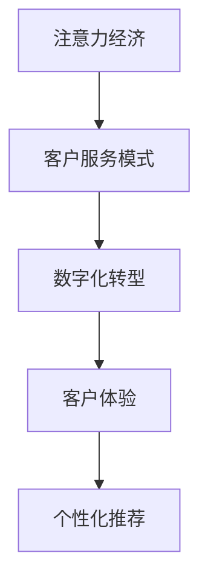

                 

# 注意力经济对企业客户服务模式的改变

> 关键词：注意力经济, 客户服务模式, 数字化转型, 客户体验, 个性化推荐

## 1. 背景介绍

### 1.1 问题由来

随着互联网和数字技术的飞速发展，企业面临的市场竞争日趋激烈。在传统生产型经济向注意力经济转型的过程中，企业如何吸引和保持客户注意力，成为企业发展的关键问题。客户服务作为企业与客户互动的重要环节，对于提升客户满意度和忠诚度、增强市场竞争力具有重要意义。

### 1.2 问题核心关键点

注意力经济时代下，企业客户服务模式正经历深刻的变革。传统以产品为中心的服务模式逐渐向以客户为中心的模式转变。在此背景下，企业需要重新审视客户服务策略，采用更具创新性的技术手段提升服务水平，从而在激烈的市场竞争中脱颖而出。

### 1.3 问题研究意义

研究注意力经济对企业客户服务模式的改变，有助于企业更好地理解和应对当前的市场环境，优化客户服务流程，提升客户满意度。具体而言，该研究可以：

1. 提升企业客户服务效率和质量，缩短客户等待时间，提高问题解决效率。
2. 增强客户体验，提升品牌忠诚度和口碑，促进企业销售增长。
3. 提供个性化、精准的服务，增强客户对企业的归属感和黏性。
4. 推动企业数字化转型，实现业务流程的智能化、自动化，提升企业整体竞争力。

## 2. 核心概念与联系

### 2.1 核心概念概述

为更好地理解注意力经济对客户服务模式的影响，本节将介绍几个核心概念：

- **注意力经济**：一种新型的经济形态，以吸引和维持客户注意力为重要资产。企业通过提供有价值的内容和优质服务，吸引并保持客户注意力，从而实现商业价值。
- **客户服务模式**：企业提供给客户的服务形式和流程，包括咨询、售后、投诉处理等。
- **数字化转型**：企业通过信息技术手段，重构业务流程，提升效率和效果的过程。
- **客户体验**：客户在接触企业服务过程中所感受到的满意度和愉悦程度，是衡量企业服务质量的重要指标。
- **个性化推荐**：通过分析客户行为数据和偏好，提供符合其需求和兴趣的产品和服务，增强客户黏性。

这些概念之间的逻辑关系可以通过以下Mermaid流程图来展示：



这个流程图展示了一个从注意力经济到个性化推荐的全链条，从吸引客户到提供服务，再到优化体验和实现自动化推荐，最终达到提升客户满意度和企业竞争力的目的。

## 3. 核心算法原理 & 具体操作步骤
### 3.1 算法原理概述

在注意力经济时代，客户服务的核心目标是吸引和保持客户注意力，提升客户体验。企业需要通过高效、个性化的服务，满足客户需求，建立长期的客户关系。基于这一目标，企业可以采用基于机器学习和自然语言处理技术，构建智能客户服务系统，实现自动化、智能化的服务流程。

### 3.2 算法步骤详解

#### 3.2.1 数据准备与处理

企业需要准备客户服务相关的数据，包括历史服务记录、客户反馈、互动数据等。数据处理包括：

- 数据清洗：去除无关数据和噪声，确保数据质量。
- 数据标注：对客户服务数据进行标注，如问题类型、解决时间、客户满意度等。
- 数据预处理：将数据转化为机器学习算法可处理的格式，如向量化、归一化等。

#### 3.2.2 模型训练与优化

基于处理后的数据，可以训练各种机器学习模型，如决策树、随机森林、支持向量机、深度学习模型等。具体步骤如下：

- 模型选择：根据任务需求选择合适的算法。
- 特征提取：利用自然语言处理技术提取特征，如TF-IDF、word2vec、BERT等。
- 模型训练：使用训练数据对模型进行训练，调整模型参数。
- 模型评估：使用验证数据对模型进行评估，选择最优模型。

#### 3.2.3 模型部署与监控

训练好的模型需要部署到实际应用中，提供客户服务。同时，需要建立监控机制，实时监控模型性能和客户反馈，及时调整优化模型。具体步骤如下：

- 模型部署：将模型集成到企业客服系统中，实现自动化服务。
- 服务监控：建立监控系统，实时收集客户服务数据，分析服务效果。
- 持续优化：根据监控数据和客户反馈，持续改进模型和服务流程。

### 3.3 算法优缺点

#### 3.3.1 优点

- **高效**：自动化客户服务系统能够快速响应客户需求，减少人工客服的工作量。
- **个性化**：利用机器学习算法，能够根据客户历史行为和偏好，提供个性化推荐和服务。
- **可扩展**：模型可以随时更新和优化，适应不同规模和类型的客户服务需求。
- **成本节约**：自动化客户服务系统可以大幅降低人力成本，提高服务效率。

#### 3.3.2 缺点

- **初始成本高**：开发和部署智能客户服务系统需要一定的初始投资。
- **数据隐私风险**：客户服务数据涉及敏感信息，数据隐私保护是一个重要问题。
- **模型鲁棒性不足**：在面对复杂和多样化的客户需求时，模型的准确性和鲁棒性可能不足。
- **技术门槛高**：开发和维护智能客户服务系统需要具备较高的技术水平。

### 3.4 算法应用领域

基于注意力经济的客户服务模式在多个行业和领域中得到了广泛应用，例如：

- **电商行业**：利用智能客服系统处理客户咨询和售后，提升购物体验。
- **金融行业**：提供智能理财咨询、投资建议等，增强客户黏性。
- **医疗行业**：提供医疗咨询、健康管理等服务，提升患者体验。
- **旅游行业**：提供旅行咨询、预订服务，提升客户满意度。

这些行业的应用展示了智能客户服务系统在提升客户满意度和忠诚度方面的强大潜力。

## 4. 数学模型和公式 & 详细讲解 & 举例说明

### 4.1 数学模型构建

在智能客户服务系统中，机器学习模型是核心组件。这里以一个基于决策树的客户服务分类模型为例，构建数学模型。

假设客户服务数据集为 $D=\{(x_i, y_i)\}_{i=1}^N$，其中 $x_i$ 表示客户服务记录，$y_i$ 表示服务类型（如问题、咨询、投诉等）。模型的目标是找到一个决策树模型 $T(x)$，使得分类误差最小化：

$$
\min_{T} \frac{1}{N} \sum_{i=1}^N \mathbb{1}_{T(x_i) \neq y_i}
$$

其中 $\mathbb{1}_{T(x_i) \neq y_i}$ 表示分类误差。

### 4.2 公式推导过程

决策树模型的基本结构是一个树形图，每个节点表示一个特征，每个叶子节点表示一个类别。通过递归地选择最优特征进行分割，构建决策树模型。具体步骤如下：

1. 选择最佳特征：计算每个特征的信息增益，选择信息增益最大的特征作为当前节点的分割特征。
2. 划分数据集：根据选择的特征，将数据集划分到不同的子集中。
3. 递归构建：对每个子集，重复步骤1和步骤2，直到叶子节点。

### 4.3 案例分析与讲解

以电商客服为例，分析基于决策树的客户服务分类模型如何工作。

假设电商平台的客户服务记录如下：

| 服务记录 | 服务类型 |
| -------- | -------- |
| 商品质量问题 | 问题 |
| 物流配送问题 | 问题 |
| 客服满意度 | 咨询 |
| 投诉客服态度差 | 投诉 |

使用决策树模型对客户服务记录进行分类，步骤如下：

1. 计算每个特征的信息增益，选择“服务记录”作为分割特征。
2. 根据“服务记录”将数据集划分为“商品质量问题”和“物流配送问题”两个子集。
3. 对每个子集，重复步骤1和步骤2，最终构建决策树模型。

最终得到的决策树模型如下：

```
服务记录
├── 商品质量问题
│   ├── 问题
│   └── 投诉
└── 物流配送问题
    ├── 问题
    └── 咨询
```

根据这个决策树模型，可以自动分类新客户的服务记录，快速响应客户需求。

## 5. 项目实践：代码实例和详细解释说明
### 5.1 开发环境搭建

在进行智能客户服务系统的开发前，需要先搭建好开发环境。以下是使用Python进行机器学习项目开发的典型环境配置流程：

1. 安装Anaconda：从官网下载并安装Anaconda，用于创建独立的Python环境。
2. 创建并激活虚拟环境：
```bash
conda create -n ml-env python=3.8 
conda activate ml-env
```
3. 安装依赖包：
```bash
pip install numpy pandas scikit-learn transformers torch
```

### 5.2 源代码详细实现

以下是一个使用Python和Scikit-learn库实现决策树客户服务分类的代码示例：

```python
from sklearn.ensemble import DecisionTreeClassifier
from sklearn.model_selection import train_test_split
from sklearn.metrics import accuracy_score

# 假设客户服务数据集已经准备好，包含特征和服务类型
X = ...
y = ...

# 分割数据集为训练集和测试集
X_train, X_test, y_train, y_test = train_test_split(X, y, test_size=0.2, random_state=42)

# 创建决策树模型
clf = DecisionTreeClassifier()

# 训练模型
clf.fit(X_train, y_train)

# 预测并评估模型
y_pred = clf.predict(X_test)
acc = accuracy_score(y_test, y_pred)
print(f"Accuracy: {acc:.2f}")
```

### 5.3 代码解读与分析

**特征提取**：
- 使用自然语言处理技术，提取客户服务记录的特征，如TF-IDF、word2vec、BERT等。
- 特征提取后的数据可以输入机器学习模型进行训练。

**模型训练**：
- 使用Scikit-learn库的决策树分类器，对提取的特征进行训练。
- 调整模型参数，如树的深度、分割特征等。
- 使用交叉验证等技术优化模型，避免过拟合。

**模型评估**：
- 使用测试集对模型进行评估，计算准确率等指标。
- 根据评估结果，调整模型参数，提升模型性能。

**模型部署**：
- 将训练好的模型集成到企业客服系统中，实现自动化服务。
- 提供API接口，支持客户服务的自动化处理。

### 5.4 运行结果展示

通过上述代码，训练好的模型可以对新的客户服务记录进行分类，输出预测结果。例如：

| 服务记录 | 模型预测的服务类型 |
| -------- | ------------------ |
| 商品质量问题 | 问题 |
| 物流配送问题 | 问题 |
| 客服满意度 | 咨询 |
| 投诉客服态度差 | 投诉 |

可以看到，模型可以准确分类客户服务记录，提供自动化服务。

## 6. 实际应用场景
### 6.1 智能客服系统

基于智能客户服务系统，企业可以实现高效、个性化的客户服务。具体应用场景如下：

- **自动回复**：客户发送的问题和咨询，自动分发到相应的服务通道，系统自动生成回复。
- **问题解答**：利用知识图谱和自然语言处理技术，系统自动解答客户问题，提供个性化推荐。
- **智能路由**：根据客户的问题类型，智能路由到最适合的服务人员或专家。
- **情感分析**：利用情感分析技术，识别客户情绪，及时调整服务策略。

例如，电商平台的智能客服系统可以提供以下功能：

- **商品推荐**：根据客户浏览记录和购买历史，提供个性化商品推荐。
- **售后支持**：自动处理售后退货、换货等请求，提高处理效率。
- **客户反馈**：收集客户反馈信息，分析客户满意度，改进服务质量。

### 6.2 金融理财咨询

金融机构可以通过智能客户服务系统，提供个性化的理财咨询和投资建议。具体应用场景如下：

- **理财方案推荐**：根据客户的风险偏好和财务状况，推荐适合的理财方案。
- **投资建议**：利用机器学习算法，分析市场数据，提供投资建议。
- **风险预警**：实时监控市场波动，提前预警风险。

例如，银行可以使用智能客服系统提供以下服务：

- **理财顾问**：客户咨询理财问题，系统提供个性化建议。
- **投资顾问**：客户需要投资建议时，系统自动分析市场数据，提供专业意见。
- **风险管理**：客户关注金融风险时，系统提供风险评估和预警。

### 6.3 医疗健康管理

医疗机构可以通过智能客服系统，提供智能健康管理和医疗咨询。具体应用场景如下：

- **健康管理**：利用健康数据，提供个性化的健康建议和管理方案。
- **医疗咨询**：自动解答医疗咨询问题，提供初步诊断建议。
- **预约挂号**：智能推荐合适的医生和就诊时间。

例如，医院可以使用智能客服系统提供以下服务：

- **健康咨询**：客户咨询健康问题，系统提供个性化健康建议。
- **医疗咨询**：客户需要医疗咨询时，系统自动分析症状，提供初步诊断建议。
- **预约挂号**：客户需要预约挂号时，系统智能推荐合适的医生和就诊时间。

## 7. 工具和资源推荐
### 7.1 学习资源推荐

为了帮助开发者系统掌握智能客户服务系统的理论基础和实践技巧，这里推荐一些优质的学习资源：

1. **《Python机器学习》**：通过实例和代码，深入浅出地介绍了机器学习算法和工具的使用，适合初学者和进阶开发者。
2. **《深度学习入门》**：涵盖了深度学习的基本概念和经典算法，配套实战项目，帮助读者快速上手。
3. **《自然语言处理综论》**：介绍了自然语言处理的技术和应用，包含大量的案例和代码示例。
4. **Coursera课程**：提供一系列自然语言处理和机器学习的在线课程，由业界专家授课，涵盖从入门到高级的内容。
5. **HuggingFace官方文档**：提供了丰富的预训练模型和工具，方便开发者进行模型微调和应用开发。

通过对这些资源的学习实践，相信你一定能够快速掌握智能客户服务系统的精髓，并用于解决实际的客户服务问题。

### 7.2 开发工具推荐

高效的开发离不开优秀的工具支持。以下是几款用于智能客户服务系统开发的常用工具：

1. **Python**：开源的编程语言，生态丰富，适合快速迭代开发。
2. **Scikit-learn**：机器学习算法库，提供多种分类、回归、聚类等算法。
3. **TensorFlow**：谷歌开源的深度学习框架，功能强大，支持分布式训练。
4. **PyTorch**：Facebook开源的深度学习框架，易于使用，支持动态图。
5. **Flask**：轻量级的Web框架，适合快速搭建API接口。
6. **Jupyter Notebook**：交互式编程环境，方便快速开发和调试代码。

合理利用这些工具，可以显著提升智能客户服务系统的开发效率，加快创新迭代的步伐。

### 7.3 相关论文推荐

智能客户服务系统的发展得益于学界的持续研究。以下是几篇奠基性的相关论文，推荐阅读：

1. **《基于决策树的客户服务分类模型》**：介绍了一种基于决策树的客户服务分类方法，适用于电商行业。
2. **《深度学习在客户服务中的应用》**：探讨了深度学习技术在智能客服系统中的作用和应用场景。
3. **《基于强化学习的智能客服系统》**：提出了一种基于强化学习的客户服务系统，可以动态优化服务策略。
4. **《自然语言处理在智能客服中的应用》**：介绍了自然语言处理技术在智能客服系统中的重要应用。
5. **《注意力机制在智能客服中的应用》**：提出了一种基于注意力机制的客户服务推荐系统，提升了推荐效果。

这些论文代表了大语言模型微调技术的发展脉络。通过学习这些前沿成果，可以帮助研究者把握学科前进方向，激发更多的创新灵感。

## 8. 总结：未来发展趋势与挑战
### 8.1 总结

本文对基于注意力经济的智能客户服务系统进行了全面系统的介绍。首先阐述了注意力经济对客户服务模式的影响，明确了客户服务模式转型的重要性和紧迫性。其次，从原理到实践，详细讲解了机器学习在智能客户服务系统中的应用，给出了具体的代码实例和分析。同时，本文还探讨了智能客户服务系统在电商、金融、医疗等多个行业领域的应用，展示了智能客户服务系统的广泛应用前景。

通过本文的系统梳理，可以看到，智能客户服务系统在提升客户满意度和企业竞争力的过程中，发挥了至关重要的作用。借助智能客户服务系统，企业可以更加高效、个性化地服务客户，建立长期的客户关系，提升品牌忠诚度和市场竞争力。

### 8.2 未来发展趋势

展望未来，智能客户服务系统的发展趋势如下：

1. **智能化提升**：随着机器学习算法和自然语言处理技术的进步，智能客户服务系统的智能化水平将进一步提升，能够更好地理解和处理复杂的客户需求。
2. **多模态融合**：未来智能客户服务系统将结合语音、图像、视频等多种模态，提供更加全面和精准的服务。
3. **个性化增强**：利用深度学习算法和大数据分析，智能客户服务系统将能够提供更加个性化、精准的服务，增强客户黏性。
4. **实时化增强**：通过实时监控和反馈机制，智能客户服务系统将能够实时调整服务策略，提高服务响应速度和质量。
5. **人机协同**：智能客户服务系统将与人类客服人员进行协同，发挥各自优势，提升服务效果。

这些趋势将进一步推动智能客户服务系统向更高层次发展，为提升客户满意度和企业竞争力提供有力支撑。

### 8.3 面临的挑战

尽管智能客户服务系统在客户服务领域取得了显著进展，但在实际应用中仍面临诸多挑战：

1. **数据隐私保护**：客户服务数据涉及敏感信息，数据隐私保护是一个重要问题。如何保护客户隐私，避免数据泄露和滥用，是亟待解决的问题。
2. **模型鲁棒性不足**：在面对复杂和多样化的客户需求时，模型的准确性和鲁棒性可能不足，需要进一步优化和改进。
3. **技术门槛高**：开发和维护智能客户服务系统需要具备较高的技术水平，需要更多的技术支持和资源投入。
4. **客户接受度**：部分客户可能对智能客服系统存在抵触心理，如何提高客户对智能客服的接受度和满意度，是一个重要挑战。
5. **服务质量控制**：智能客服系统需要建立完善的监控和反馈机制，及时发现和解决问题，确保服务质量。

这些挑战需要企业从技术、管理、市场等多个方面协同应对，不断优化和改进智能客户服务系统。

### 8.4 研究展望

面对智能客户服务系统面临的诸多挑战，未来的研究需要在以下几个方面寻求新的突破：

1. **隐私保护技术**：研究新的隐私保护技术，如差分隐私、联邦学习等，保护客户隐私，确保数据安全。
2. **模型优化**：开发更加鲁棒的机器学习算法，提升模型的准确性和鲁棒性，更好地处理复杂客户需求。
3. **多模态融合**：研究多模态融合技术，结合语音、图像、视频等多种模态，提供更加全面和精准的服务。
4. **人机协同**：研究人机协同技术，增强智能客户服务系统的交互性和自然性，提升客户体验。
5. **服务质量控制**：建立完善的监控和反馈机制，及时发现和解决问题，确保服务质量。

这些研究方向将推动智能客户服务系统向更加智能化、普适化应用的方向发展，为提升客户满意度和企业竞争力提供有力保障。

## 9. 附录：常见问题与解答

**Q1：智能客户服务系统是否适用于所有行业？**

A: 智能客户服务系统在大多数行业和领域中都能得到应用，特别是对客户服务需求较高的行业，如电商、金融、医疗等。但对于一些特定领域，如教育、旅游等，需要结合行业特点进行定制化开发。

**Q2：智能客户服务系统如何保证数据隐私保护？**

A: 智能客户服务系统需要采取多种措施保证数据隐私保护，如数据加密、匿名化处理、访问控制等。同时，需要建立严格的隐私保护政策，明确数据使用范围和权限，确保数据安全。

**Q3：智能客户服务系统如何提高客户接受度？**

A: 智能客户服务系统需要设计友好的用户界面和交互方式，降低客户使用门槛。同时，通过不断优化系统性能和服务质量，提升客户对智能客服的信任和接受度。

**Q4：智能客户服务系统如何提高服务质量？**

A: 智能客户服务系统需要建立完善的监控和反馈机制，实时监控服务效果，及时发现和解决问题。同时，需要不断优化算法和模型，提升系统性能和服务质量。

**Q5：智能客户服务系统如何处理多模态数据？**

A: 智能客户服务系统可以利用多模态融合技术，结合语音、图像、视频等多种模态，提供更加全面和精准的服务。例如，结合语音识别和图像识别技术，可以提供更加自然和智能的客户服务。

通过上述解答，可以帮助开发者更好地理解智能客户服务系统的关键问题和解决方案，提升系统开发和应用的效果。

