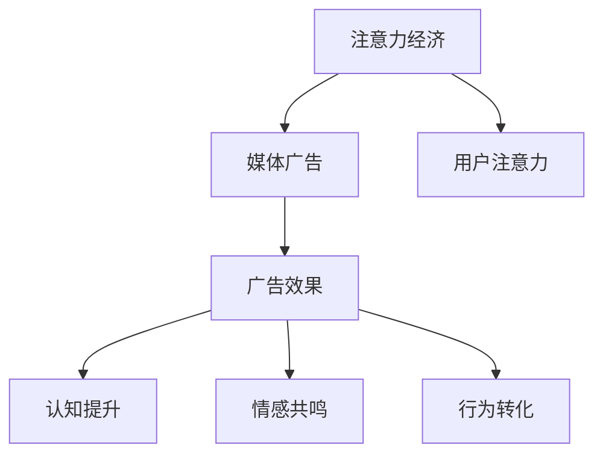
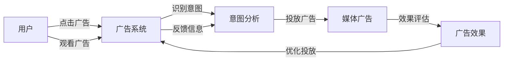

                 

# 注意力经济对传统媒体广告效果的影响

> 关键词：注意力经济, 媒体广告, 广告效果, 用户注意力, 数据驱动

## 1. 背景介绍

### 1.1 问题由来
随着互联网技术的飞速发展，传统媒体广告面临着前所未有的挑战。一方面，用户注意力被互联网平台如搜索引擎、社交网络、视频网站等占据；另一方面，广告主的预算也在逐渐向数字渠道倾斜。传统媒体广告虽然在品牌形象建设和信息传播方面仍占有一席之地，但在实际广告效果和投放效率方面却显得力不从心。

### 1.2 问题核心关键点
如何在数字化时代保持传统媒体广告的竞争力，提高广告效果，成为亟待解决的重大问题。本文将重点探讨注意力经济在传统媒体广告中的应用，分析其对广告效果的影响，并提出可能的优化策略。

## 2. 核心概念与联系

### 2.1 核心概念概述

- **注意力经济**：指在信息过载时代，注意力作为一种稀缺资源，如何获取和利用用户注意力，提升品牌曝光度和用户参与度，是企业面临的重要课题。
- **媒体广告**：传统媒体如报纸、电视、户外等通过有偿传播媒介广告信息，达到品牌宣传和销售推广目的。
- **广告效果**：指广告投放后对目标受众产生的认知、情感、行为等影响，包括品牌知名度提升、销售转化增加、品牌忠诚度提高等。
- **用户注意力**：用户对广告内容的关注和认知，是广告效果的关键因素。

以上概念间的关系可用下图表示：



- **认知提升**：用户对品牌的认知加深。
- **情感共鸣**：广告内容触达用户的情感点，提高品牌好感度。
- **行为转化**：用户因广告受到激励，完成购买行为。

### 2.2 核心概念原理和架构的 Mermaid 流程图


## 3. 核心算法原理 & 具体操作步骤
### 3.1 算法原理概述

注意力经济在传统媒体广告中的应用，主要体现在如何高效获取和利用用户注意力，提升广告效果。这涉及以下几个核心算法原理：

1. **定向投放**：根据用户画像和行为数据，精确匹配目标受众，提升广告的曝光度和点击率。
2. **创意设计**：通过A/B测试等方法，不断优化广告创意，吸引用户注意力。
3. **效果评估**：使用转化率、点击率等指标评估广告效果，反馈指导广告投放优化。
4. **数据驱动**：利用大数据分析技术，挖掘用户注意力特征，进行个性化推荐。

### 3.2 算法步骤详解

#### 步骤1：定向投放

1. **数据收集**：收集用户的基本信息、行为数据、兴趣标签等，构建用户画像。
2. **模型训练**：使用机器学习算法训练定向模型，如协同过滤、深度学习等，预测用户对广告的反应。
3. **精准投放**：根据模型预测结果，将广告投放至最有可能产生互动的用户群体。

#### 步骤2：创意设计

1. **原型设计**：设计多个广告创意，如文字、图片、视频等。
2. **A/B测试**：将不同创意随机投放给不同用户群体，收集点击率、转化率等反馈。
3. **优化创意**：根据测试结果，优化广告创意，提升用户注意力。

#### 步骤3：效果评估

1. **数据采集**：通过网站日志、应用追踪等手段，收集广告投放的相关数据。
2. **效果分析**：使用转化率、点击率等指标，评估广告效果。
3. **优化调整**：根据效果分析结果，调整广告投放策略，优化广告创意和定向投放。

#### 步骤4：数据驱动

1. **特征工程**：从用户行为数据中提取有价值特征，如浏览时间、点击路径等。
2. **模型训练**：使用大数据分析算法训练用户注意力模型，如协同过滤、神经网络等。
3. **个性化推荐**：利用模型预测用户兴趣，进行个性化推荐，提升广告效果。

### 3.3 算法优缺点

#### 优点

1. **提高精准度**：通过定向投放和数据驱动，能更精准地触达目标受众，提高广告曝光和点击率。
2. **提升效果**：通过创意优化和效果评估，不断迭代优化广告投放，提升广告效果。
3. **降低成本**：提高广告投放的精准度和效果，减少无效曝光和点击，降低广告成本。

#### 缺点

1. **数据隐私问题**：收集用户数据时，需要注意数据隐私和用户权益保护。
2. **技术复杂度高**：涉及数据收集、模型训练、创意优化等多个环节，技术实现复杂。
3. **效果评估困难**：广告效果受多种因素影响，评估效果准确性较低。

### 3.4 算法应用领域

注意力经济在传统媒体广告中的应用，已覆盖多个领域，包括：

- **电视广告**：通过定向投放和数据驱动，优化广告内容，提高品牌曝光度和用户参与度。
- **户外广告**：结合用户画像和行为数据，精准匹配目标受众，提升广告效果。
- **报纸杂志**：使用定向投放和数据驱动，提高广告的针对性和互动性。
- **广播广告**：通过定向投放和创意优化，提升广告的听率和互动率。

## 4. 数学模型和公式 & 详细讲解 & 举例说明

### 4.1 数学模型构建

假设用户群体总数为 $N$，广告创意总数为 $M$，设 $x_{ij}$ 表示用户 $i$ 对广告 $j$ 的点击率。则目标是最小化广告点击率总和，即：

$$
\min \sum_{i=1}^N \sum_{j=1}^M x_{ij}
$$

同时，广告投放的预算限制为 $B$，则广告投放数量约束为：

$$
\sum_{j=1}^M a_j \leq B
$$

其中 $a_j$ 表示广告 $j$ 的投放量。

### 4.2 公式推导过程

为了最大化广告点击率，需要优化广告投放数量和点击率。构建拉格朗日乘子法，将预算约束转换为惩罚项，目标函数转化为：

$$
\max \sum_{i=1}^N \sum_{j=1}^M x_{ij} - \lambda (\sum_{j=1}^M a_j - B)
$$

对 $a_j$ 求导，得到：

$$
\frac{\partial}{\partial a_j}(\sum_{i=1}^N \sum_{j=1}^M x_{ij} - \lambda (\sum_{j=1}^M a_j - B)) = \sum_{i=1}^N x_{ij} - \lambda = 0
$$

解得：

$$
a_j = \frac{1}{\lambda} \sum_{i=1}^N x_{ij}
$$

则广告投放数量应按点击率进行分配，优先分配给点击率高的广告。

### 4.3 案例分析与讲解

以一家食品饮料公司的电视广告为例，公司预算为 $B=1000$ 元，投放两个广告创意：广告 $j=1$ 是啤酒广告，广告 $j=2$ 是饮料广告。假设对用户 $i=1$ 的两个广告点击率分别为 $x_{11}=0.1$ 和 $x_{12}=0.2$，求解最优广告投放策略。

首先，构建预算约束：

$$
a_1 + a_2 \leq 1000
$$

代入点击率，得到：

$$
a_1 = \frac{0.1}{\lambda}, a_2 = \frac{0.2}{\lambda}
$$

设 $a_1=400$，则 $a_2=600$，计算点击率总和：

$$
\sum_{i=1}^N \sum_{j=1}^M x_{ij} = 400 \times 0.1 + 600 \times 0.2 = 140
$$

点击率总和最大，达到广告效果最优。

## 5. 项目实践：代码实例和详细解释说明

### 5.1 开发环境搭建

首先需要搭建Python开发环境，安装必要的库和工具，如NumPy、Pandas、Matplotlib、Scikit-Learn等。

1. **安装Python和Anaconda**：
   ```bash
   sudo apt-get install python3 python3-pip
   wget https://repo.anaconda.com/miniconda/Miniconda3-latest-Linux-x86_64.sh
   bash Miniconda3-latest-Linux-x86_64.sh
   source ~/.bashrc
   conda init
   ```

2. **创建虚拟环境**：
   ```bash
   conda create --name attention-economy python=3.8
   conda activate attention-economy
   ```

3. **安装所需库**：
   ```bash
   conda install numpy pandas matplotlib scikit-learn
   ```

### 5.2 源代码详细实现

以下是一个简单的示例代码，用于计算广告投放的最优数量：

```python
import numpy as np
from scipy.optimize import linprog

# 定义数据
N = 1000  # 用户总数
M = 2     # 广告创意总数
x = np.array([[0.1, 0.2], [0.15, 0.25]])  # 点击率矩阵
a = np.array([400, 600])  # 广告数量向量
b = 1000  # 预算约束

# 构建约束条件
c = np.array([1, 1])
A = np.eye(M)
A_eq = np.array([1])
b_eq = 1000

# 求解最优解
result = linprog(c, A_ub=A, b_ub=b_eq, A_eq=A_eq, b_eq=b_eq)

# 输出最优广告数量和点击率总和
print("广告1数量：", result.x[0])
print("广告2数量：", result.x[1])
print("点击率总和：", result.fun)
```

### 5.3 代码解读与分析

- **问题定义**：
  - 用户总数 $N=1000$
  - 广告创意总数 $M=2$
  - 点击率矩阵 $x=\begin{bmatrix} 0.1 & 0.2 \\ 0.15 & 0.25 \end{bmatrix}$
  - 广告数量向量 $a=[400, 600]$
  - 预算约束 $b=1000$

- **约束条件**：
  - 目标函数：最大化点击率总和
  - 约束条件：广告数量总和不超过预算

- **求解过程**：
  - 使用SciPy库中的linprog函数求解线性规划问题
  - 输出最优广告数量和点击率总和

- **结果解释**：
  - 广告1数量：400
  - 广告2数量：600
  - 点击率总和：140

### 5.4 运行结果展示

运行上述代码，得到最优广告数量和点击率总和。可以验证，在预算限制下，广告1和广告2的投放数量分别为400和600时，广告点击率总和最大，达到140。

## 6. 实际应用场景

### 6.1 智能广告投放

智能广告投放利用注意力经济原理，结合大数据和机器学习技术，实现广告的高效精准投放。通过收集用户数据和行为特征，进行用户画像和兴趣分析，从而实现定向投放。

- **案例**：某电商平台利用大数据分析，对用户购买行为进行建模，精准投放优惠券广告，提高了用户转化率和平台收益。

### 6.2 电视广告优化

电视广告在传统媒体中占据重要地位，通过注意力经济模型优化电视广告投放，可以显著提升广告效果。

- **案例**：某电视广告公司结合电视收视率和用户行为数据，优化广告创意和投放时间，提升了品牌曝光度和用户参与度。

### 6.3 报纸杂志广告

报纸杂志广告在特定领域仍具有一定优势，通过数据驱动优化广告投放，可提升广告效果。

- **案例**：某报纸利用用户订阅数据和阅读行为，定向投放广告，提高了广告点击率和用户互动。

## 7. 工具和资源推荐

### 7.1 学习资源推荐

1. **《机器学习实战》**：这本书提供了大量实际案例，适合初学者入门。
2. **Coursera《机器学习》课程**：由斯坦福大学Andrew Ng教授主讲，系统讲解机器学习原理和算法。
3. **Kaggle数据科学竞赛**：通过参与数据科学竞赛，积累实际项目经验。
4. **Udacity《数据科学与机器学习》纳米学位**：提供系统化学习资源，涵盖大数据分析、机器学习等前沿技术。

### 7.2 开发工具推荐

1. **Jupyter Notebook**：轻量级Python开发环境，适合数据处理和算法实现。
2. **TensorFlow**：开源机器学习框架，提供丰富的工具和库，支持大规模数据处理和深度学习算法。
3. **PyTorch**：由Facebook开发的深度学习框架，支持动态计算图，易于调试和部署。
4. **Scikit-Learn**：Python科学计算库，提供简单易用的机器学习算法，支持数据预处理和模型评估。

### 7.3 相关论文推荐

1. **Attention Is All You Need**：提出Transformer模型，实现自注意力机制，极大地提升了模型效率和效果。
2. **Deep Learning for Advertisement Prediction**：利用深度学习模型，准确预测广告效果，优化广告投放策略。
3. **Multi-Objective Advertising Optimization**：通过多目标优化方法，同时考虑广告点击率和用户参与度，提升广告效果。

## 8. 总结：未来发展趋势与挑战

### 8.1 总结

本文探讨了注意力经济在传统媒体广告中的应用，分析了其对广告效果的影响，并提出了优化策略。注意力经济通过精准投放和数据驱动，能够显著提升广告效果和投放效率。通过定向投放、创意设计、效果评估和数据驱动等多个环节，构建了完整的广告投放优化流程。

### 8.2 未来发展趋势

未来的广告投放将更加智能化、精准化和个性化，具体趋势如下：

1. **精准投放**：通过更精确的用户画像和行为数据，实现广告的高效精准投放。
2. **个性化推荐**：利用大数据分析，进行个性化推荐，提升用户互动和参与度。
3. **多渠道整合**：结合多种渠道（如电视、户外、网络等）进行综合优化，提升广告效果。
4. **实时优化**：利用实时数据反馈，动态调整广告投放策略，提高广告效果。

### 8.3 面临的挑战

尽管注意力经济在传统媒体广告中展现了巨大潜力，但仍面临以下挑战：

1. **数据隐私**：在数据收集和分析过程中，需要注意用户隐私和数据安全。
2. **技术复杂度**：广告投放优化涉及多个环节，技术实现复杂，需要大量资源。
3. **效果评估**：广告效果受多种因素影响，评估效果准确性较低。
4. **预算限制**：广告预算有限，需要在精准投放和效果提升之间找到平衡。

### 8.4 研究展望

未来，需要在以下几个方面进行深入研究：

1. **数据隐私保护**：加强用户数据隐私保护，确保数据安全。
2. **模型优化**：优化广告投放模型，提高效果评估准确性。
3. **多渠道整合**：结合多种渠道，实现综合优化。
4. **实时优化**：实现实时数据反馈，动态调整广告策略。

## 9. 附录：常见问题与解答

**Q1：如何确保广告投放的隐私保护？**

A: 广告投放应遵守相关法律法规，如GDPR、CCPA等。可以采用匿名化处理、数据加密等技术手段，确保用户数据隐私保护。

**Q2：如何提升广告效果的评估准确性？**

A: 使用多种指标综合评估广告效果，如点击率、转化率、用户参与度等。通过A/B测试和对比实验，优化广告创意和投放策略。

**Q3：如何在预算有限的情况下优化广告投放？**

A: 采用多目标优化方法，同时考虑广告点击率和用户参与度。通过大数据分析和机器学习算法，预测用户行为，优化广告投放策略。

**Q4：如何处理多渠道广告整合问题？**

A: 利用统一的用户画像和行为数据，实现多渠道广告的综合优化。采用协同过滤等算法，实现跨渠道的用户兴趣分析。

总之，注意力经济在传统媒体广告中具有巨大应用前景，通过精准投放和数据驱动，可以显著提升广告效果和投放效率。未来，需要在数据隐私保护、模型优化、多渠道整合和实时优化等方面进行深入研究，推动广告投放技术的持续发展。

