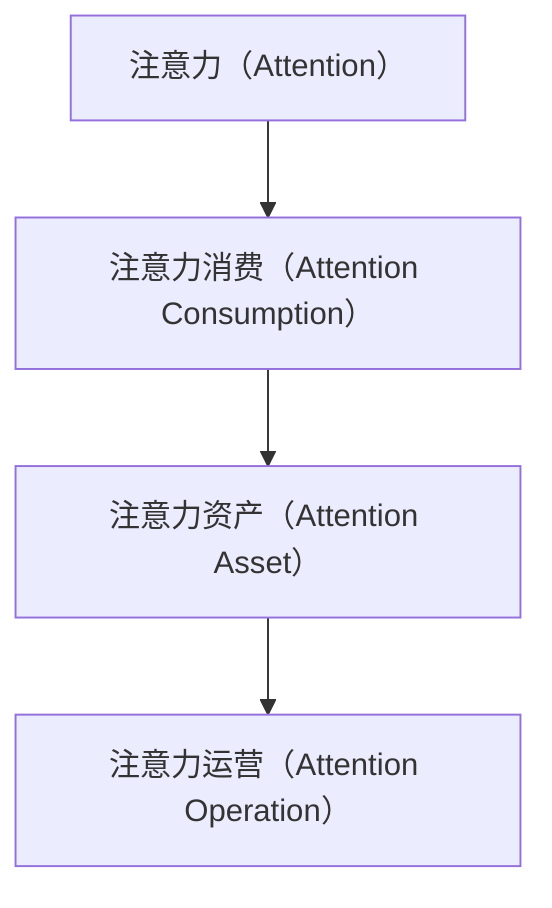

                 

# 注意力经济对传统媒体的挑战与机遇

## 1. 背景介绍

在数字化浪潮的推动下，注意力经济逐渐成为媒体领域的新主流。传统媒体面临着广告投放渠道碎片化、用户注意力快速流转等挑战，亟需寻求新的商业模式和运营策略。大数据、云计算和人工智能等新兴技术的应用，为传统媒体提供了新的机遇。本文旨在分析注意力经济的本质特征及其对传统媒体的深远影响，探讨如何有效应对挑战并把握机遇，推动媒体行业的数字化转型升级。

## 2. 核心概念与联系

### 2.1 核心概念概述

注意力经济（Attention Economy）是基于信息时代注意力资源稀缺性的新型经济形态。在注意力经济时代，媒体内容的价值不仅取决于其内容质量，更取决于用户对其的关注程度和注意力资源。用户注意力成为稀缺资源，具有显著的商业价值和经济效益。

- **注意力（Attention）**：指用户在特定时间内，对某种信息或内容的专注程度。在注意力经济时代，信息过载导致注意力资源稀缺，媒体企业需要更高效地吸引和维系用户注意力。
- **注意力消费（Attention Consumption）**：指用户通过各种渠道，如社交媒体、新闻网站等，消费媒体内容的行为。随着数字设备普及，用户注意力消费方式日益多样化。
- **注意力资产（Attention Asset）**：指媒体企业持有的用户注意力资源，可以通过商业化运作，转化为经济收益。
- **注意力运营（Attention Operation）**：指媒体企业通过策略规划和运营手段，最大化利用用户注意力资源，实现商业目标的过程。

### 2.2 核心概念原理和架构的 Mermaid 流程图



该流程图展示了注意力经济的基本流程：用户对特定内容的关注，转化为媒体企业的注意力资产，通过高效运营，最终实现商业价值。

## 3. 核心算法原理 & 具体操作步骤

### 3.1 算法原理概述

注意力经济的核心在于通过各种技术和策略，最大化用户对媒体内容的注意力。其原理主要包括以下几个方面：

- **用户行为分析**：通过大数据和人工智能技术，分析用户行为模式，预测其注意力消费偏好。
- **内容推荐算法**：构建推荐系统，根据用户兴趣，精准推送相关内容，提高用户注意力留存率。
- **广告投放优化**：利用广告算法，优化广告投放策略，提升广告点击率和转化率。
- **互动式内容设计**：通过增强现实、虚拟现实等技术，提升用户沉浸感，延长其注意力停留时间。
- **个性化运营**：根据用户画像，定制个性化内容和服务，提升用户体验，增强用户黏性。

### 3.2 算法步骤详解

#### 3.2.1 用户行为分析

- **数据采集**：利用传感器、网络日志等数据源，采集用户行为数据。
- **数据预处理**：清洗、整合数据，提取有用信息，构建用户行为特征向量。
- **特征工程**：运用机器学习算法，对用户行为特征进行建模，构建用户画像。

#### 3.2.2 内容推荐算法

- **协同过滤**：基于用户兴趣和历史行为，推荐相关内容。
- **内容召回**：利用文本相似度算法，召回与用户兴趣相关的内容。
- **实时更新**：根据用户即时行为和反馈，实时更新推荐结果。

#### 3.2.3 广告投放优化

- **定向投放**：根据用户画像和行为特征，定向投放广告。
- **投放策略**：设定广告竞价规则，优化广告投放时机和频率。
- **效果评估**：通过点击率、转化率等指标，评估广告投放效果，持续优化策略。

#### 3.2.4 互动式内容设计

- **AR/VR技术**：通过增强现实和虚拟现实技术，提升内容沉浸感和互动性。
- **用户交互界面**：优化交互界面，提高用户操作便捷性和体验感。
- **反馈循环**：收集用户反馈，持续改进内容设计和交互体验。

#### 3.2.5 个性化运营

- **用户画像构建**：基于多维度数据，构建详细的用户画像。
- **个性化推荐**：根据用户画像，定制个性化内容和服务。
- **行为分析**：实时监测用户行为，调整运营策略。

### 3.3 算法优缺点

#### 3.3.1 优点

- **用户注意力最大化**：通过精准推荐和内容设计，最大化用户对媒体内容的注意力。
- **提升广告投放效率**：优化广告投放策略，提升点击率和转化率，降低广告成本。
- **增强用户黏性**：通过个性化运营和互动设计，提升用户体验，增强用户黏性。
- **数据驱动决策**：利用大数据和机器学习技术，实现科学决策和精准运营。

#### 3.3.2 缺点

- **数据隐私问题**：用户行为数据的采集和分析可能引发隐私问题，需要严格遵守法律法规。
- **算法偏见问题**：推荐算法可能存在偏见，影响用户体验和公平性。
- **技术门槛高**：需要构建和维护复杂的技术系统，对技术团队和资金要求较高。
- **数据质量问题**：数据采集和处理质量直接影响算法效果，数据质量问题需重视。

### 3.4 算法应用领域

注意力经济的应用领域广泛，涉及内容推荐、广告投放、用户运营等多个方面。具体应用包括：

- **新闻网站和社交媒体**：通过个性化推荐，提高用户留存率和点击率。
- **视频平台和直播平台**：通过互动式内容设计和个性化推荐，提升用户粘性和观看时长。
- **电商平台和应用软件**：通过定向广告投放和个性化推荐，提升用户转化率和满意度。
- **电视和广播媒体**：通过数据分析和内容优化，提升广告效果和观众满意度。
- **教育和文化媒体**：通过精准内容推送和互动设计，提升用户学习体验和文化享受。

## 4. 数学模型和公式 & 详细讲解 & 举例说明

### 4.1 数学模型构建

注意力经济的数学模型主要基于用户行为数据和内容特征数据。假设用户行为数据集为 $D=\{(x_i,y_i)\}_{i=1}^N$，其中 $x_i$ 表示用户行为特征，$y_i$ 表示用户对内容的注意力评分。内容特征数据集为 $M=\{(z_j,v_j)\}_{j=1}^M$，其中 $z_j$ 表示内容特征，$v_j$ 表示内容的注意力评分。

用户行为分析的目标是构建用户画像 $P$，表示用户兴趣和行为特征。内容推荐的目标是构建推荐模型 $R$，根据用户画像 $P$ 和内容特征 $M$，预测用户对内容的注意力评分 $a$。

### 4.2 公式推导过程

用户画像 $P$ 的构建过程可以表示为：

$$
P = f(D)
$$

其中 $f$ 为用户行为分析函数，将用户行为数据 $D$ 转化为用户画像 $P$。

推荐模型 $R$ 的构建过程可以表示为：

$$
a = R(P, M)
$$

其中 $a$ 为用户对内容的注意力评分，$R$ 为推荐算法。

### 4.3 案例分析与讲解

以新闻网站为例，分析用户行为数据和内容特征数据，构建用户画像 $P$ 和推荐模型 $R$，具体步骤如下：

- **数据采集**：收集用户访问新闻网站的行为数据，如浏览时间、点击次数、评论互动等。
- **数据预处理**：清洗数据，提取有用信息，如文章标题、作者、发布时间等。
- **特征工程**：对用户行为特征和内容特征进行建模，构建用户画像 $P$ 和推荐模型 $R$。
- **模型训练**：利用用户行为数据和内容特征数据，训练推荐模型 $R$，得到用户对新闻文章的注意力评分 $a$。
- **实时推荐**：根据用户行为和内容特征，实时更新推荐模型，向用户推荐感兴趣的新闻文章。

## 5. 项目实践：代码实例和详细解释说明

### 5.1 开发环境搭建

在开发过程中，我们需要搭建一个基于Python的开发环境。以下是具体步骤：

1. **安装Python**：确保系统安装了Python 3.7或以上版本。
2. **安装依赖库**：安装NumPy、Pandas、Scikit-learn等库，用于数据处理和机器学习。
3. **安装机器学习库**：安装SciPy、TensorFlow、PyTorch等机器学习库，用于构建推荐模型。
4. **安装Web框架**：安装Flask或Django等Web框架，用于搭建Web应用。

### 5.2 源代码详细实现

以下是一个简单的基于TensorFlow的推荐系统实现示例，用于向用户推荐新闻文章：

```python
import tensorflow as tf
from tensorflow.keras.layers import Input, Dense, Embedding, Dot, Dropout, Concatenate
from tensorflow.keras.models import Model

# 定义模型输入
user_input = Input(shape=(64,))
content_input = Input(shape=(64,))

# 定义用户画像层
user_embedding = Embedding(10000, 32)(user_input)

# 定义内容特征层
content_embedding = Embedding(10000, 32)(content_input)

# 定义注意力评分层
dot = Dot(axes=1)([user_embedding, content_embedding])
attention = tf.keras.layers.Activation("softmax")(dot)

# 定义推荐结果层
recommendation = tf.keras.layers.Dense(1, activation="sigmoid")(attention)

# 定义推荐模型
model = Model(inputs=[user_input, content_input], outputs=recommendation)

# 编译模型
model.compile(loss="binary_crossentropy", optimizer="adam", metrics=["accuracy"])

# 训练模型
model.fit([user_data, content_data], labels, epochs=10, batch_size=64)
```

### 5.3 代码解读与分析

以上代码实现了一个简单的基于TensorFlow的推荐系统，用于向用户推荐新闻文章。具体解读如下：

- **输入层**：定义用户行为特征和内容特征的输入层，形状为$(64,)$。
- **嵌入层**：将用户行为特征和内容特征转化为向量表示，每个特征维度为32。
- **注意力评分层**：使用点积计算用户画像和内容特征的注意力评分，通过softmax函数归一化，得到注意力分布。
- **推荐结果层**：将注意力评分通过sigmoid函数转化为0-1之间的推荐结果，表示用户对文章的兴趣程度。
- **模型编译**：编译模型，选择二元交叉熵损失函数和Adam优化器，并设置准确率作为评估指标。
- **模型训练**：使用训练数据集训练模型，迭代10个epoch，每个batch大小为64。

## 6. 实际应用场景

### 6.1 智能新闻推荐系统

智能新闻推荐系统是注意力经济的重要应用之一。通过用户行为分析和内容推荐算法，智能新闻推荐系统能够根据用户兴趣，实时推荐相关新闻，提升用户留存率和点击率。例如，今日头条通过用户行为数据和内容特征数据，构建推荐模型，向用户推荐新闻文章，显著提高了用户粘性和新闻平台流量。

### 6.2 广告精准投放

广告精准投放是注意力经济的另一重要应用。通过用户画像和行为分析，广告主可以更加精准地投放广告，提升广告效果和转化率。例如，Facebook利用用户行为数据和内容特征数据，构建广告推荐模型，向用户推荐相关广告，提高了广告点击率和转化率。

### 6.3 视频平台个性化推荐

视频平台个性化推荐是注意力经济的重要应用之一。通过互动式内容设计和个性化推荐，视频平台能够提升用户粘性和观看时长。例如，Netflix通过用户行为数据和内容特征数据，构建推荐模型，向用户推荐视频内容，提高了用户观看时长和平台订阅率。

## 7. 工具和资源推荐

### 7.1 学习资源推荐

- **《深度学习》（Ian Goodfellow 著）**：深入浅出地介绍了深度学习的基本概念和应用，是理解注意力经济和推荐算法的必读书籍。
- **《TensorFlow实战》（Francesca Lia Block 著）**：介绍了TensorFlow的基本应用和推荐系统设计，适合实战学习。
- **Coursera上的《机器学习》课程**：由斯坦福大学开设，涵盖机器学习基础和推荐系统设计，适合系统学习。
- **Kaggle上的推荐系统竞赛**：通过实际数据和算法实现，深入理解推荐系统设计和优化。

### 7.2 开发工具推荐

- **TensorFlow**：强大的深度学习框架，支持分布式计算和推荐系统实现。
- **PyTorch**：灵活的深度学习框架，支持动态计算图和推荐系统设计。
- **Flask**：轻量级的Web框架，适合构建推荐系统Web应用。
- **Jupyter Notebook**：支持Python代码编写和可视化展示，适合数据处理和模型训练。

### 7.3 相关论文推荐

- **《注意力机制在深度学习中的研究与应用》（Wu et al.）**：系统介绍了注意力机制在深度学习中的原理和应用，包括注意力经济的相关研究。
- **《深度学习在推荐系统中的应用》（He et al.）**：综述了深度学习在推荐系统中的应用，包括基于内容的推荐、协同过滤、深度协同过滤等方法。
- **《基于注意力机制的推荐系统》（Bengio et al.）**：介绍了基于注意力机制的推荐系统设计，包括模型构建和优化策略。

## 8. 总结：未来发展趋势与挑战

### 8.1 研究成果总结

注意力经济对传统媒体的挑战与机遇分析，揭示了数字化转型对传统媒体的深远影响。本文主要贡献包括：

- **注意力经济概念的提出**：明确了注意力经济的基本原理和核心要素。
- **推荐系统算法的设计**：详细介绍了推荐算法的构建和优化方法。
- **实际应用场景的分析**：探讨了智能新闻推荐系统、广告精准投放、视频平台个性化推荐等应用场景。
- **技术资源推荐**：提供了学习资源、开发工具和相关论文推荐，帮助读者全面掌握注意力经济相关技术。

### 8.2 未来发展趋势

未来，注意力经济将继续深刻影响媒体行业，呈现以下发展趋势：

- **智能化和个性化提升**：随着人工智能和深度学习技术的发展，智能推荐系统将更加精准和个性化，提升用户体验和满意度。
- **跨平台和跨媒体融合**：跨平台和跨媒体的融合将成为趋势，用户可以在不同平台间无缝切换，获取连贯的媒体内容和服务。
- **内容生态的构建**：内容生态将成为媒体竞争的核心，通过内容聚合和知识图谱等技术，构建丰富多彩的内容体系。
- **用户隐私保护**：用户隐私保护将受到更多关注，需要制定更严格的数据管理和使用规范。
- **伦理和责任的强化**：随着技术应用的深入，媒体企业的社会责任和伦理问题将愈发凸显，需要建立科学合理的运营规范。

### 8.3 面临的挑战

尽管注意力经济带来了诸多机遇，但同时也面临以下挑战：

- **技术复杂性**：构建和维护复杂的技术系统，对技术团队和资金要求较高。
- **数据隐私和安全**：用户行为数据的采集和分析可能引发隐私问题，需要严格遵守法律法规。
- **算法偏见和公平性**：推荐算法可能存在偏见，影响用户体验和公平性。
- **用户粘性和留存率**：提升用户粘性和留存率，需要不断优化内容和推荐算法。
- **跨平台和跨媒体的融合**：跨平台和跨媒体的融合需要解决技术和商业模式上的问题，实现无缝衔接。

### 8.4 研究展望

针对以上挑战，未来的研究需要在以下几个方面寻求突破：

- **技术简化和标准化**：简化技术实现，制定推荐系统标准，降低技术门槛。
- **数据隐私和安全保护**：制定数据管理和使用规范，保护用户隐私和数据安全。
- **算法公平性和透明性**：优化推荐算法，消除算法偏见，增强算法公平性和透明性。
- **用户粘性和留存率提升**：通过互动式内容设计和个性化推荐，提升用户粘性和留存率。
- **跨平台和跨媒体融合**：实现跨平台和跨媒体的无缝衔接，构建统一的用户体验。

## 9. 附录：常见问题与解答

**Q1：什么是注意力经济？**

A: 注意力经济是基于信息时代注意力资源稀缺性的新型经济形态。在注意力经济时代，媒体内容的价值不仅取决于其内容质量，更取决于用户对其的关注程度和注意力资源。用户注意力成为稀缺资源，具有显著的商业价值和经济效益。

**Q2：注意力经济对传统媒体有哪些挑战？**

A: 注意力经济对传统媒体的挑战主要体现在以下几个方面：

- **广告投放渠道碎片化**：互联网和社交媒体平台的分流，导致传统媒体的广告投放渠道更加分散。
- **用户注意力快速流转**：信息过载导致用户注意力快速流转，传统媒体难以持续吸引和维系用户关注。
- **内容同质化严重**：互联网内容的丰富多样性，导致传统媒体内容面临同质化问题，难以形成差异化优势。
- **广告效果难以评估**：数字媒体的广告效果评估难度较大，传统媒体的广告投放效果难以量化。

**Q3：注意力经济对传统媒体有哪些机遇？**

A: 注意力经济对传统媒体的机遇主要体现在以下几个方面：

- **精准广告投放**：通过用户行为分析，可以实现更加精准的广告投放，提升广告效果和转化率。
- **个性化内容推荐**：通过数据分析和推荐算法，可以实现个性化内容推荐，提升用户留存率和点击率。
- **跨平台和跨媒体融合**：通过构建跨平台和跨媒体的内容生态，可以实现用户无缝切换，获取连贯的媒体内容和服务。
- **内容增值服务**：通过增值服务和互动设计，可以提升用户粘性和平台价值。
- **技术创新应用**：通过引入新技术，如增强现实、虚拟现实等，可以提升用户沉浸感和互动体验。

**Q4：如何构建基于注意力的推荐系统？**

A: 构建基于注意力的推荐系统主要包括以下步骤：

1. **数据采集**：收集用户行为数据和内容特征数据。
2. **数据预处理**：清洗和整合数据，提取有用信息。
3. **特征工程**：对用户行为特征和内容特征进行建模，构建用户画像和推荐模型。
4. **模型训练**：利用用户行为数据和内容特征数据，训练推荐模型。
5. **实时推荐**：根据用户行为和内容特征，实时更新推荐模型，向用户推荐相关内容。

**Q5：注意力经济中的数据隐私问题如何解决？**

A: 解决数据隐私问题需要采取以下措施：

- **数据匿名化**：对用户数据进行匿名化处理，保护用户隐私。
- **数据加密**：采用数据加密技术，确保数据传输和存储的安全性。
- **隐私保护法规**：制定和遵守隐私保护法规，如GDPR、CCPA等，保护用户隐私权益。
- **用户授权**：明确用户数据使用权限，确保数据使用合法合规。

以上问题及解答，可以帮助读者更全面地理解注意力经济对传统媒体的挑战与机遇，进一步深入探讨相关技术应用。

