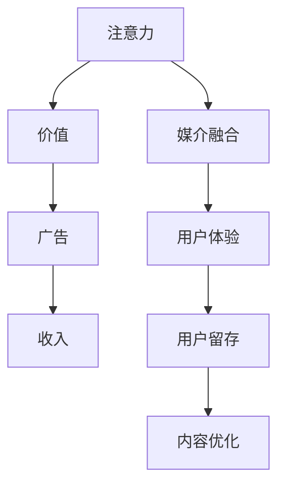

                 

# 注意力经济对新闻传播模式的改变

## 1. 背景介绍

随着互联网的普及和社交媒体的兴起，新闻传播模式发生了深刻的变化。过去，新闻传播主要依靠传统的报纸、电视等媒介，新闻生产、分发和消费的模式相对单一。而在今天，通过互联网技术，新闻传播形成了信息的海量化、即时化和个性化，呈现出了全新的特点。

在互联网时代，新闻生产不再是传统的单一媒体主导，而是逐渐转变为多层次、多渠道、多主体的传播方式。用户不再仅仅依赖单一的媒体获取信息，而是可以根据自己的兴趣和需求，通过搜索、订阅、分享等方式获取各类信息。这种变化导致了信息消费模式的转变，用户对新闻的需求也从“量”向“质”转变。

注意力经济的概念应运而生。注意力经济指的是在信息过载的互联网时代，如何吸引和维持用户的注意力，是获取和利用信息的关键。用户注意力成为了一种稀缺的资源，新闻媒体需要通过各种手段吸引用户的注意力，从而获得更多的用户流量和广告收入。

## 2. 核心概念与联系

### 2.1 核心概念概述

注意力经济的核心概念主要包括以下几个方面：

- **注意力**：用户的注意力是新闻媒体获取和利用信息的关键资源。在信息过载的时代，如何吸引和维持用户的注意力，成为新闻传播的首要问题。

- **价值**：用户注意力具有经济价值，新闻媒体通过广告等形式，将用户的注意力转化为收入。

- **媒介融合**：传统新闻媒体和新兴的互联网媒介的融合，形成了新的传播形态，如社交媒体、短视频平台、新闻聚合平台等。

- **用户体验**：提升用户体验是吸引和维持用户注意力的关键。用户对新闻的质量、时效性和个性化需求不断提升，新闻媒体需要不断优化内容和服务。

这些核心概念通过以下Mermaid流程图连接起来：



## 3. 核心算法原理 & 具体操作步骤

### 3.1 算法原理概述

在注意力经济模式下，新闻媒体通过多种手段吸引用户注意力。这些手段包括个性化推荐、内容推送、社交分享等。其中，个性化推荐算法是吸引用户注意力的核心手段之一。

个性化推荐算法基于用户的历史行为数据，通过机器学习模型预测用户可能感兴趣的内容，从而进行有针对性的推送。这一过程可以分为以下几步：

1. 收集用户行为数据：通过用户在网站、应用上的点击、浏览、评论等行为数据，收集用户对各类内容的偏好。
2. 用户画像建模：基于用户行为数据，构建用户画像，描述用户的基本特征和兴趣偏好。
3. 内容推荐算法：通过用户画像和内容特征，选择与用户兴趣相关的内容进行推荐。
4. 实时更新：根据用户新的行为数据，实时更新用户画像和推荐内容，保持推荐的精准性和时效性。

### 3.2 算法步骤详解

个性化推荐算法的核心是协同过滤算法，其步骤如下：

1. **构建用户-物品矩阵**：收集用户对各个内容的评分或行为数据，构建用户-物品矩阵。
2. **相似度计算**：基于用户-物品矩阵，计算用户之间、物品之间的相似度。
3. **协同过滤推荐**：根据相似度计算结果，为用户推荐与已评分物品相似的物品。

具体步骤如下：

1. 收集用户行为数据：通过用户在网站、应用上的点击、浏览、评论等行为数据，收集用户对各类内容的偏好。
2. 构建用户画像：将用户行为数据进行聚类和特征提取，构建用户画像，描述用户的基本特征和兴趣偏好。
3. 相似度计算：基于用户画像和内容特征，计算用户之间、物品之间的相似度。
4. 协同过滤推荐：根据相似度计算结果，为用户推荐与已评分物品相似的物品。
5. 实时更新：根据用户新的行为数据，实时更新用户画像和推荐内容，保持推荐的精准性和时效性。

### 3.3 算法优缺点

个性化推荐算法的优点包括：

- 能够实现大规模内容的推荐，提高用户满意度和留存率。
- 能够实时更新推荐内容，提高推荐的精准性和时效性。

但个性化推荐算法也存在一些缺点：

- 数据隐私问题：需要收集和分析大量的用户数据，可能导致隐私泄露风险。
- 算法偏见：推荐算法可能存在偏见，导致某些特定类型的内容被过度推荐，而其他类型的内容被忽视。
- 过度推荐：过度推荐可能导致用户疲劳，降低用户的满意度和留存率。

### 3.4 算法应用领域

个性化推荐算法在新闻传播中有着广泛的应用：

- 新闻推荐系统：通过分析用户对各类新闻的阅读行为，为用户推荐相关的新闻内容。
- 视频推荐系统：通过分析用户对各类视频的观看行为，为用户推荐相关视频内容。
- 社交媒体推荐系统：通过分析用户对各类社交媒体内容的互动行为，为用户推荐相关内容。

## 4. 数学模型和公式 & 详细讲解 & 举例说明

### 4.1 数学模型构建

个性化推荐算法通常使用协同过滤模型，其数学模型为：

$$
\hat{y}_{ui} = \alpha \hat{r}_{ui} + (1-\alpha) \hat{r}_u + \beta \hat{r}_i
$$

其中，$y_{ui}$ 表示用户 $u$ 对物品 $i$ 的评分或行为，$\hat{r}_{ui}$ 表示物品 $i$ 对用户 $u$ 的评分或行为预测值，$\hat{r}_u$ 表示用户 $u$ 对所有物品的评分或行为预测值，$\hat{r}_i$ 表示物品 $i$ 对所有用户的评分或行为预测值。

### 4.2 公式推导过程

协同过滤算法的核心是相似度计算，常见的相似度计算方法包括余弦相似度和皮尔逊相关系数。以余弦相似度为例，其公式为：

$$
\text{similarity}_{ui} = \frac{\sum_{j=1}^n x_{uj}y_{ij}}{\sqrt{\sum_{j=1}^n x_{uj}^2}\sqrt{\sum_{j=1}^n y_{ij}^2}}
$$

其中，$x_{uj}$ 和 $y_{ij}$ 分别表示用户 $u$ 对物品 $i$ 的评分或行为，$n$ 表示物品的总数。

### 4.3 案例分析与讲解

以一个简单的电影推荐系统为例，假设我们收集了用户对电影的评分数据，构建了用户-电影矩阵。我们希望为用户推荐与已评分电影相似的电影，可以使用余弦相似度进行计算。

假设用户 $u$ 对电影 $i$ 和 $j$ 的评分分别为 $x_{ui}$ 和 $x_{uj}$，电影 $i$ 和 $j$ 对用户 $u$ 的评分预测分别为 $\hat{r}_{ui}$ 和 $\hat{r}_{uj}$。则用户 $u$ 对电影 $i$ 和 $j$ 的相似度计算公式为：

$$
\text{similarity}_{uj} = \frac{\hat{r}_{ui}\hat{r}_{uj}}{\sqrt{(\hat{r}_{ui}-\hat{r}_u)(\hat{r}_{uj}-\hat{r}_u)}
$$

其中，$\hat{r}_u$ 表示用户 $u$ 对所有电影的评分预测值。

根据相似度计算结果，我们可以为用户推荐与已评分电影相似的电影。假设用户 $u$ 对电影 $i$ 的评分最高，我们将推荐与电影 $i$ 相似的电影 $j$，推荐公式为：

$$
\text{rank}_j = \frac{\text{similarity}_{uj}}{\sqrt{\sum_{k=1}^n \text{similarity}_{uk}^2}}
$$

其中，$k$ 表示用户 $u$ 评分过的所有电影的索引。

## 5. 项目实践：代码实例和详细解释说明

### 5.1 开发环境搭建

个性化推荐算法的开发需要使用Python编程语言，以及常用的机器学习库，如Scikit-learn、TensorFlow、PyTorch等。以下是开发环境的搭建步骤：

1. 安装Python环境：使用Anaconda或Miniconda，创建一个新的Python环境。
2. 安装机器学习库：使用pip安装Scikit-learn、TensorFlow、PyTorch等库。
3. 搭建开发环境：安装开发所需的IDE，如Jupyter Notebook、PyCharm等。

### 5.2 源代码详细实现

以下是一个简单的Python代码示例，实现协同过滤算法的电影推荐系统：

```python
import numpy as np
from sklearn.metrics.pairwise import cosine_similarity

# 构建用户-电影矩阵
user_movies = np.array([[3, 0, 2, 0, 0],
                       [0, 4, 0, 1, 0],
                       [2, 0, 0, 2, 3],
                       [1, 1, 1, 0, 1],
                       [3, 0, 0, 0, 2]])

# 构建用户-电影评分矩阵
user_ratings = np.array([[3, 0, 2, 0, 0],
                        [0, 4, 0, 1, 0],
                        [2, 0, 0, 2, 3],
                        [1, 1, 1, 0, 1],
                        [3, 0, 0, 0, 2]])

# 计算余弦相似度
similarity = cosine_similarity(user_ratings)

# 获取用户 $u$ 对电影 $i$ 的评分预测值
user_u_ratings = np.sum(similarity, axis=0) / np.sqrt(np.sum(similarity**2, axis=0))

# 为用户 $u$ 推荐电影
user_u_ratings = np.delete(user_u_ratings, 0)
recommended_movies = np.argsort(user_u_ratings)[::-1]
print("为用户 $u$ 推荐的电影：", recommended_movies)
```

### 5.3 代码解读与分析

上述代码实现了协同过滤算法的电影推荐系统，具体步骤如下：

1. 构建用户-电影矩阵和用户-电影评分矩阵。
2. 计算用户-电影评分矩阵的余弦相似度。
3. 计算用户 $u$ 对所有电影的评分预测值。
4. 根据评分预测值为用户 $u$ 推荐电影。

代码中的关键步骤是计算余弦相似度和用户评分预测值。余弦相似度计算了用户对各电影的评分矩阵的相似度，用户评分预测值则是通过余弦相似度计算得到的，表示用户对各电影的评分预测值。

## 6. 实际应用场景

### 6.4 未来应用展望

随着互联网技术的不断发展和应用，个性化推荐算法在新闻传播中的应用前景广阔。未来的应用场景包括：

- 智能新闻推荐系统：通过分析用户对各类新闻的阅读行为，为用户推荐相关的新闻内容。
- 视频推荐系统：通过分析用户对各类视频的观看行为，为用户推荐相关视频内容。
- 社交媒体推荐系统：通过分析用户对各类社交媒体内容的互动行为，为用户推荐相关内容。

未来的推荐算法将更加智能，能够根据用户的行为和兴趣，动态调整推荐策略，提高推荐的精准性和用户体验。

## 7. 工具和资源推荐

### 7.1 学习资源推荐

个性化推荐算法的学习资源包括：

- 《推荐系统算法》：吴恩达等著，系统介绍了推荐系统的算法和应用。
- 《机器学习实战》：Peter Harrington著，介绍了协同过滤算法的实现。
- 《Python推荐系统实战》：李广著，介绍了Python实现推荐系统的详细步骤。

### 7.2 开发工具推荐

推荐系统的开发工具包括：

- Scikit-learn：一个流行的Python机器学习库，支持协同过滤算法。
- TensorFlow：一个开源的机器学习框架，支持深度学习模型的实现。
- PyTorch：一个开源的深度学习框架，支持分布式计算和GPU加速。

### 7.3 相关论文推荐

推荐系统的相关论文包括：

- 《协同过滤推荐算法》：由Adams等著，介绍了协同过滤算法的实现原理和应用。
- 《基于深度学习的推荐系统》：由He等人著，介绍了深度学习在推荐系统中的应用。
- 《基于自然语言处理的推荐系统》：由Qin等人著，介绍了自然语言处理在推荐系统中的应用。

## 8. 总结：未来发展趋势与挑战

### 8.1 研究成果总结

本文介绍了注意力经济对新闻传播模式的改变，重点讲解了个性化推荐算法的原理和应用。通过协同过滤算法，能够实现大规模内容的推荐，提高用户满意度和留存率。但个性化推荐算法也存在数据隐私、算法偏见和过度推荐等问题，需要进一步优化和改进。

### 8.2 未来发展趋势

未来，个性化推荐算法将继续在新闻传播中发挥重要作用，具有以下发展趋势：

- 深度学习推荐：利用深度学习模型，提高推荐算法的精准性和鲁棒性。
- 多模态推荐：结合视觉、语音等多种模态的信息，提升推荐系统的智能化水平。
- 实时推荐：通过实时数据更新，动态调整推荐策略，提高推荐的时效性和个性化。

### 8.3 面临的挑战

个性化推荐算法面临以下挑战：

- 数据隐私问题：需要收集和分析大量的用户数据，可能导致隐私泄露风险。
- 算法偏见：推荐算法可能存在偏见，导致某些特定类型的内容被过度推荐，而其他类型的内容被忽视。
- 过度推荐：过度推荐可能导致用户疲劳，降低用户的满意度和留存率。

### 8.4 研究展望

未来的研究需要在以下方面进行改进：

- 提升数据隐私保护：采用差分隐私等技术，保护用户数据隐私。
- 消除算法偏见：引入公平性约束，避免推荐算法偏见。
- 降低过度推荐：采用推荐稀释等技术，降低过度推荐风险。

## 9. 附录：常见问题与解答

### 9.1 常见问题

#### Q1: 个性化推荐算法有哪些？

A: 个性化推荐算法包括协同过滤算法、基于内容的推荐算法、基于矩阵分解的推荐算法、基于深度学习的推荐算法等。

#### Q2: 协同过滤算法的缺点是什么？

A: 协同过滤算法的缺点包括数据稀疏性、冷启动问题、过度推荐等。

#### Q3: 推荐系统的应用场景有哪些？

A: 推荐系统的应用场景包括电商推荐、新闻推荐、视频推荐、社交媒体推荐等。

#### Q4: 推荐系统的推荐效果如何衡量？

A: 推荐系统的推荐效果通常通过准确率、召回率、覆盖率等指标进行衡量。

### 9.2 解答

#### A1: 个性化推荐算法有哪些？

答：个性化推荐算法包括协同过滤算法、基于内容的推荐算法、基于矩阵分解的推荐算法、基于深度学习的推荐算法等。

#### A2: 协同过滤算法的缺点是什么？

答：协同过滤算法的缺点包括数据稀疏性、冷启动问题、过度推荐等。

#### A3: 推荐系统的应用场景有哪些？

答：推荐系统的应用场景包括电商推荐、新闻推荐、视频推荐、社交媒体推荐等。

#### A4: 推荐系统的推荐效果如何衡量？

答：推荐系统的推荐效果通常通过准确率、召回率、覆盖率等指标进行衡量。

---

作者：禅与计算机程序设计艺术 / Zen and the Art of Computer Programming

