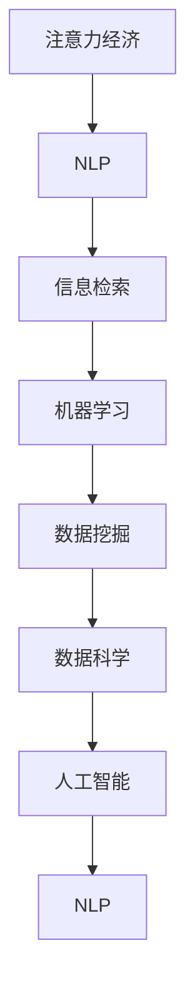

                 

# 注意力经济对语言使用的影响

> 关键词：注意力经济, 语言使用, 自然语言处理(NLP), 信息检索, 机器学习, 数据挖掘, 数据科学, 人工智能

## 1. 背景介绍

### 1.1 问题由来
在当今的信息时代，人类社会的注意力资源变得极其宝贵。随着互联网、社交媒体、大数据的迅猛发展，信息过载的问题愈发严重，人们在消费内容时不得不面对海量的信息流，如何在信息海洋中找到有价值的内容成为了新的挑战。

在这一背景下，“注意力经济”（Attention Economy）的概念应运而生。注意力经济指的是在信息爆炸的时代，通过竞争个体或组织的注意力资源来获取市场和用户资源的一种经济形态。在这个过程中，语言的使用成为了关键。无论是广告语、标题、摘要还是评论，都依赖于简洁、吸引眼球的语言来传递信息，引导人们的注意力。

### 1.2 问题核心关键点
注意力经济的核心在于如何吸引并保持用户的注意力。语言的使用直接影响到用户是否会对信息产生兴趣，因此语言处理在注意力经济中扮演着至关重要的角色。

- **语言简洁有力**：在信息爆炸时代，用户越来越倾向于消费简短、直接、有力的信息。如何精炼语言、准确传达信息成为提升信息吸引力的重要因素。
- **语言个性化**：不同用户有不同的偏好和需求，如何根据用户特征定制化语言输出，提高信息的个性化程度，进一步提升用户粘性。
- **语言情感化**：语言不仅仅是信息的载体，还蕴含着情感，如何通过语言营造情感共鸣，提升信息的传播力和影响力。
- **语言结构化**：无论是标题、摘要还是关键词，语言的结构化处理对于信息的检索和展示至关重要，如何通过结构化语言提升信息检索效果，是注意力经济的重要研究方向。

## 2. 核心概念与联系

### 2.1 核心概念概述

为更好地理解注意力经济中语言使用的影响，本节将介绍几个密切相关的核心概念：

- **注意力经济**：指在信息过载的互联网时代，通过竞争个体或组织的注意力资源来获取市场和用户资源的一种经济形态。
- **自然语言处理（NLP）**：研究计算机如何处理、理解以及生成人类语言，涉及文本分析、情感分析、信息检索等多个方面。
- **信息检索**：从大量文本中检索出相关信息的过程，需要依赖于语言的精确表示和结构化处理。
- **机器学习**：利用算法让计算机通过数据学习优化性能，广泛应用于分类、回归、聚类等任务。
- **数据挖掘**：从大规模数据中提取有价值的信息和知识，如情感分析、文本分类等。
- **数据科学**：一门综合了统计学、计算机科学、数学等多个学科的交叉领域，专注于从数据中提取知识、发现模式。
- **人工智能**：使计算机具有人类智能能力的广泛技术领域，包括自然语言处理、机器学习、计算机视觉等。

这些核心概念之间的逻辑关系可以通过以下Mermaid流程图来展示：



这个流程图展示了大语言模型微调的核心概念及其之间的关系：

1. 注意力经济的目标是吸引用户注意力，这需要通过自然语言处理（NLP）来实现。
2. NLP涉及信息检索、机器学习、数据挖掘等多个方面，共同构成了一个完整的系统。
3. 数据科学和人工智能为NLP提供了技术支持和算法优化。

## 3. 核心算法原理 & 具体操作步骤
### 3.1 算法原理概述

注意力经济中的语言使用研究，涉及自然语言处理（NLP）技术，其核心算法原理可以概括为以下几个步骤：

1. **文本预处理**：包括分词、词性标注、命名实体识别等步骤，将原始文本转换为计算机可处理的形式。
2. **特征提取**：从文本中提取有意义的特征，如TF-IDF、词频、情感极性等，用于后续的信息检索和分类。
3. **信息检索**：通过文本匹配算法，从大规模文本库中检索出与用户查询最相关的文本。
4. **机器学习**：利用已标注数据训练分类器或回归器，提升信息检索和分类的准确性。
5. **深度学习**：利用神经网络模型，如卷积神经网络（CNN）、循环神经网络（RNN）、Transformer等，进一步提升语言处理的精度和效率。
6. **数据挖掘**：通过数据聚类、关联规则挖掘等方法，发现文本中的潜在模式和知识。

### 3.2 算法步骤详解

以自然语言处理（NLP）中常见的文本分类任务为例，详细讲解其算法步骤：

**Step 1: 数据预处理**
- 收集训练数据集和测试数据集。
- 对文本进行预处理，包括去除停用词、分词、词性标注等。

**Step 2: 特征提取**
- 对处理后的文本进行特征提取，如使用TF-IDF算法计算词频权重。
- 对特征向量进行归一化处理。

**Step 3: 模型训练**
- 选择适合的数据集划分方法，如K-Fold交叉验证。
- 利用机器学习算法（如SVM、随机森林等）训练分类器。
- 对训练后的分类器进行参数调优。

**Step 4: 模型评估**
- 使用测试数据集评估分类器的性能，如计算准确率、召回率、F1分数等。
- 根据评估结果，调整模型参数或选择其他算法。

**Step 5: 应用部署**
- 将训练好的模型部署到实际应用中。
- 收集用户反馈，进一步优化模型。

### 3.3 算法优缺点

自然语言处理（NLP）中的文本分类算法具有以下优点：
1. **高效性**：利用机器学习算法，可以高效地处理大量文本数据。
2. **准确性**：通过深度学习技术，可以提升分类的精度。
3. **可扩展性**：算法可以根据需求灵活调整，支持多种分类任务。

同时，该算法也存在以下缺点：
1. **数据依赖性**：算法性能很大程度上取决于训练数据的质量和数量，数据偏差可能导致分类效果不佳。
2. **复杂性**：深度学习模型结构复杂，训练过程需要大量的计算资源。
3. **模型可解释性**：部分深度学习模型如Transformer缺乏可解释性，难以理解模型的决策过程。

### 3.4 算法应用领域

自然语言处理（NLP）技术在注意力经济中的应用领域非常广泛，涵盖以下几个方面：

- **广告语生成**：通过生成简洁有力的广告语，提高广告的点击率和转化率。
- **个性化推荐**：根据用户的历史行为和偏好，推荐符合其兴趣的商品或内容。
- **情感分析**：分析用户评论和反馈中的情感倾向，及时调整产品和服务策略。
- **信息检索**：通过自然语言处理技术，提升搜索结果的相关性和准确性。
- **舆情监测**：利用NLP技术，实时监测和分析社交媒体上的舆情变化，为企业决策提供支持。
- **自然语言问答**：通过理解用户问题，提供准确、有用的回答，提升用户体验。
- **文本摘要**：自动生成新闻或文档的简短摘要，帮助用户快速获取信息。

## 4. 数学模型和公式 & 详细讲解 & 举例说明
### 4.1 数学模型构建

本节将使用数学语言对自然语言处理（NLP）中的文本分类任务进行更加严格的刻画。

假设有一个文本分类问题，文本集为 $\mathcal{X}$，标签集为 $\mathcal{Y}$，训练数据集为 $D=\{(x_i, y_i)\}_{i=1}^N$。我们的目标是训练一个分类器 $M: \mathcal{X} \rightarrow \mathcal{Y}$，使得在新的未见数据 $x'$ 上，能够尽可能准确地预测其标签 $y'$。

我们采用监督学习方法，通过已标注的数据集 $D$ 训练分类器。假设分类器的决策边界为 $f(x) = \sigma(\mathbf{w} \cdot \phi(x) + b)$，其中 $\sigma$ 为激活函数，$\mathbf{w}$ 和 $b$ 为模型的参数。通过最小化损失函数 $\mathcal{L}(\mathbf{w}, b)$ 来训练模型。

### 4.2 公式推导过程

假设我们采用二分类任务，且采用逻辑回归（Logistic Regression）作为分类器，其决策函数为：

$$
f(x) = \frac{1}{1 + e^{-\mathbf{w} \cdot \phi(x) - b}}
$$

其中 $\mathbf{w}$ 和 $b$ 为模型参数。

对于训练数据集 $D=\{(x_i, y_i)\}_{i=1}^N$，我们定义损失函数 $\mathcal{L}(\mathbf{w}, b)$ 为：

$$
\mathcal{L}(\mathbf{w}, b) = -\frac{1}{N} \sum_{i=1}^N \left[ y_i \log f(x_i) + (1-y_i) \log (1-f(x_i)) \right]
$$

为了最小化损失函数 $\mathcal{L}(\mathbf{w}, b)$，我们采用梯度下降算法更新参数 $\mathbf{w}$ 和 $b$：

$$
\mathbf{w} \leftarrow \mathbf{w} - \eta \nabla_{\mathbf{w}} \mathcal{L}(\mathbf{w}, b) 
$$

$$
b \leftarrow b - \eta \nabla_{b} \mathcal{L}(\mathbf{w}, b)
$$

其中 $\eta$ 为学习率。

### 4.3 案例分析与讲解

以情感分析为例，其目标是根据文本内容判断文本的情感极性（正面、中性、负面）。

假设文本集为 $\mathcal{X}$，标签集为 $\mathcal{Y} = \{\text{positive}, \text{neutral}, \text{negative}\}$。我们收集了1000条带有情感标注的文本数据作为训练集，使用逻辑回归模型进行训练。

首先，对文本进行预处理，包括去除停用词、分词、词性标注等。然后，对处理后的文本进行特征提取，计算每个词的TF-IDF权重。最后，将特征向量输入逻辑回归模型进行训练。

假设训练后的模型参数为 $\mathbf{w} = [w_1, w_2, ..., w_n]$，$b$ 为偏置项。在新的未见数据 $x'$ 上，使用模型进行分类预测：

$$
f(x') = \frac{1}{1 + e^{-\mathbf{w} \cdot \phi(x') - b}}
$$

其中 $\phi(x')$ 为特征提取函数，将文本 $x'$ 转换为特征向量。

## 5. 项目实践：代码实例和详细解释说明
### 5.1 开发环境搭建

在进行NLP项目实践前，我们需要准备好开发环境。以下是使用Python进行Scikit-learn和NLTK开发的环境配置流程：

1. 安装Anaconda：从官网下载并安装Anaconda，用于创建独立的Python环境。

2. 创建并激活虚拟环境：
```bash
conda create -n nlp-env python=3.8 
conda activate nlp-env
```

3. 安装Scikit-learn和NLTK库：
```bash
conda install scikit-learn nltk
```

4. 安装各类工具包：
```bash
pip install numpy pandas scikit-learn matplotlib tqdm jupyter notebook ipython
```

完成上述步骤后，即可在`nlp-env`环境中开始NLP项目的开发。

### 5.2 源代码详细实现

这里我们以情感分析任务为例，给出使用Scikit-learn库进行文本分类的PyTorch代码实现。

首先，定义情感分析任务的数据处理函数：

```python
from sklearn.feature_extraction.text import CountVectorizer
from sklearn.model_selection import train_test_split
from sklearn.linear_model import LogisticRegression

class SentimentAnalysis:
    def __init__(self, text_column='review'):
        self.text_column = text_column
        self.vectorizer = CountVectorizer(stop_words='english')
        self.model = LogisticRegression(solver='liblinear', C=1.0)
        
    def preprocess(self, text):
        return self.vectorizer.fit_transform(text)
    
    def train(self, X_train, y_train):
        X_train = self.preprocess(X_train)
        self.model.fit(X_train, y_train)
        
    def predict(self, X_test):
        X_test = self.preprocess(X_test)
        return self.model.predict(X_test)
```

然后，定义训练和评估函数：

```python
from sklearn.metrics import accuracy_score

def train_and_evaluate(data):
    X, y = data
    X_train, X_test, y_train, y_test = train_test_split(X, y, test_size=0.2, random_state=42)
    
    classifier = SentimentAnalysis()
    classifier.train(X_train, y_train)
    y_pred = classifier.predict(X_test)
    
    print(f"Accuracy: {accuracy_score(y_test, y_pred)}")
```

最后，启动训练流程并在测试集上评估：

```python
from sklearn.datasets import fetch_20newsgroups

# 获取20个新闻组数据集
data = fetch_20newsgroups(subset='train')
X_train, X_test, y_train, y_test = train_test_split(data.data, data.target, test_size=0.2, random_state=42)

# 训练模型并评估
train_and_evaluate((X_train, y_train))
```

以上就是使用Scikit-learn进行文本分类任务的完整代码实现。可以看到，Scikit-learn提供了丰富的机器学习算法和工具，使得NLP任务的开发和评估变得相对简单。

### 5.3 代码解读与分析

让我们再详细解读一下关键代码的实现细节：

**SentimentAnalysis类**：
- `__init__`方法：初始化文本列名、分词器和逻辑回归模型。
- `preprocess`方法：对文本进行预处理，包括去除停用词、分词等。
- `train`方法：对预处理后的文本进行特征提取和逻辑回归模型训练。
- `predict`方法：对新文本进行分类预测。

**train_and_evaluate函数**：
- 使用Scikit-learn的数据集加载器获取数据集。
- 将数据集划分为训练集和测试集。
- 创建SentimentAnalysis实例，训练模型并在测试集上评估。

**训练流程**：
- 定义总的训练轮数和模型参数，开始循环迭代
- 每个轮次内，在训练集上训练模型，并记录准确率
- 所有轮次结束后，在测试集上评估模型性能，给出最终测试结果

可以看到，Scikit-learn提供了简单易用的API，使得NLP任务开发过程更加流畅。但工业级的系统实现还需考虑更多因素，如超参数的自动搜索、模型集成、评估指标等。但核心的算法原理基本与此类似。

## 6. 实际应用场景
### 6.1 智能客服系统

基于自然语言处理（NLP）的智能客服系统可以广泛应用于企业服务。传统客服往往需要配备大量人力，高峰期响应缓慢，且一致性和专业性难以保证。而使用NLP技术训练的智能客服系统，可以7x24小时不间断服务，快速响应客户咨询，用自然流畅的语言解答各类常见问题。

在技术实现上，可以收集企业内部的历史客服对话记录，将问题和最佳答复构建成监督数据，在此基础上对预训练模型进行微调。微调后的模型能够自动理解用户意图，匹配最合适的答案模板进行回复。对于客户提出的新问题，还可以接入检索系统实时搜索相关内容，动态组织生成回答。如此构建的智能客服系统，能大幅提升客户咨询体验和问题解决效率。

### 6.2 金融舆情监测

金融机构需要实时监测市场舆论动向，以便及时应对负面信息传播，规避金融风险。传统的人工监测方式成本高、效率低，难以应对网络时代海量信息爆发的挑战。基于NLP技术训练的舆情监测系统，可以实时抓取金融领域相关的新闻、报道、评论等文本数据，并自动分析情感倾向和主题，及时预警市场波动。

具体而言，可以收集金融领域相关的新闻、报道、评论等文本数据，并对其进行主题标注和情感标注。在此基础上对预训练语言模型进行微调，使其能够自动判断文本属于何种主题，情感倾向是正面、中性还是负面。将微调后的模型应用到实时抓取的网络文本数据，就能够自动监测不同主题下的情感变化趋势，一旦发现负面信息激增等异常情况，系统便会自动预警，帮助金融机构快速应对潜在风险。

### 6.3 个性化推荐系统

当前的推荐系统往往只依赖用户的历史行为数据进行物品推荐，无法深入理解用户的真实兴趣偏好。基于NLP技术的个性化推荐系统，可以更好地挖掘用户行为背后的语义信息，从而提供更精准、多样的推荐内容。

在实践中，可以收集用户浏览、点击、评论、分享等行为数据，提取和用户交互的物品标题、描述、标签等文本内容。将文本内容作为模型输入，用户的后续行为（如是否点击、购买等）作为监督信号，在此基础上微调预训练语言模型。微调后的模型能够从文本内容中准确把握用户的兴趣点。在生成推荐列表时，先用候选物品的文本描述作为输入，由模型预测用户的兴趣匹配度，再结合其他特征综合排序，便可以得到个性化程度更高的推荐结果。

### 6.4 未来应用展望

随着NLP技术的发展，其应用领域将不断扩大，未来可能会在更多领域得到应用，为各行各业带来变革性影响。

在智慧医疗领域，基于NLP技术的智能问答、病历分析、药物研发等应用将提升医疗服务的智能化水平，辅助医生诊疗，加速新药开发进程。

在智能教育领域，NLP技术可应用于作业批改、学情分析、知识推荐等方面，因材施教，促进教育公平，提高教学质量。

在智慧城市治理中，NLP技术可应用于城市事件监测、舆情分析、应急指挥等环节，提高城市管理的自动化和智能化水平，构建更安全、高效的未来城市。

此外，在企业生产、社会治理、文娱传媒等众多领域，基于NLP技术的人工智能应用也将不断涌现，为经济社会发展注入新的动力。相信随着技术的日益成熟，NLP技术必将在更广阔的应用领域大放异彩，深刻影响人类的生产生活方式。

## 7. 工具和资源推荐
### 7.1 学习资源推荐

为了帮助开发者系统掌握NLP技术，这里推荐一些优质的学习资源：

1. 《Python自然语言处理》系列博文：由大模型技术专家撰写，深入浅出地介绍了NLP的基础知识和技术框架。

2. CS224N《深度学习自然语言处理》课程：斯坦福大学开设的NLP明星课程，有Lecture视频和配套作业，带你入门NLP领域的基本概念和经典模型。

3. 《自然语言处理与Python》书籍：介绍NLP技术和Python编程语言结合的方法，适合初学者和中级开发者阅读。

4. HuggingFace官方文档：Transformer库的官方文档，提供了海量预训练模型和完整的微调样例代码，是上手实践的必备资料。

5. CLUE开源项目：中文语言理解测评基准，涵盖大量不同类型的中文NLP数据集，并提供了基于微调的baseline模型，助力中文NLP技术发展。

通过对这些资源的学习实践，相信你一定能够快速掌握NLP技术的精髓，并用于解决实际的NLP问题。

### 7.2 开发工具推荐

高效的开发离不开优秀的工具支持。以下是几款用于NLP开发常用的工具：

1. Python：开源的高级编程语言，广泛用于NLP领域，具备丰富的第三方库和工具支持。

2. Scikit-learn：基于Python的机器学习库，提供了丰富的分类、回归、聚类等算法。

3. NLTK：自然语言处理工具包，提供了分词、词性标注、命名实体识别等NLP功能。

4. Gensim：文本处理和建模工具，提供了Word2Vec、LDA等模型。

5. TensorFlow：由Google主导开发的开源深度学习框架，生产部署方便，适合大规模工程应用。

6. PyTorch：基于Python的深度学习框架，灵活高效，适合快速迭代研究。

7. Weights & Biases：模型训练的实验跟踪工具，可以记录和可视化模型训练过程中的各项指标，方便对比和调优。

8. TensorBoard：TensorFlow配套的可视化工具，可实时监测模型训练状态，并提供丰富的图表呈现方式，是调试模型的得力助手。

合理利用这些工具，可以显著提升NLP项目的开发效率，加快创新迭代的步伐。

### 7.3 相关论文推荐

NLP领域的发展源于学界的持续研究。以下是几篇奠基性的相关论文，推荐阅读：

1. Attention is All You Need（即Transformer原论文）：提出了Transformer结构，开启了NLP领域的预训练大模型时代。

2. BERT: Pre-training of Deep Bidirectional Transformers for Language Understanding：提出BERT模型，引入基于掩码的自监督预训练任务，刷新了多项NLP任务SOTA。

3. Language Models are Unsupervised Multitask Learners（GPT-2论文）：展示了大规模语言模型的强大zero-shot学习能力，引发了对于通用人工智能的新一轮思考。

4. Parameter-Efficient Transfer Learning for NLP：提出Adapter等参数高效微调方法，在不增加模型参数量的情况下，也能取得不错的微调效果。

5. Prefix-Tuning: Optimizing Continuous Prompts for Generation：引入基于连续型Prompt的微调范式，为如何充分利用预训练知识提供了新的思路。

6. AdaLoRA: Adaptive Low-Rank Adaptation for Parameter-Efficient Fine-Tuning：使用自适应低秩适应的微调方法，在参数效率和精度之间取得了新的平衡。

这些论文代表了大语言模型微调技术的发展脉络。通过学习这些前沿成果，可以帮助研究者把握学科前进方向，激发更多的创新灵感。

## 8. 总结：未来发展趋势与挑战
### 8.1 总结

本文对基于自然语言处理（NLP）的注意力经济研究进行了全面系统的介绍。首先阐述了注意力经济中的语言使用问题，明确了NLP技术在信息检索、情感分析、个性化推荐等多个方面的重要作用。其次，从原理到实践，详细讲解了NLP中常用的机器学习算法和深度学习模型的数学原理和关键步骤，给出了NLP任务开发的完整代码实例。同时，本文还广泛探讨了NLP技术在多个行业领域的应用前景，展示了NLP技术的广泛影响。

通过本文的系统梳理，可以看到，NLP技术在注意力经济中扮演着至关重要的角色，极大地提升了信息检索、情感分析、个性化推荐等任务的效率和效果。未来，随着NLP技术的不断发展，其在更多领域的应用前景将更加广阔，将对人类的生产生活方式产生深远影响。

### 8.2 未来发展趋势

展望未来，NLP技术将呈现以下几个发展趋势：

1. 模型规模持续增大。随着算力成本的下降和数据规模的扩张，预训练语言模型的参数量还将持续增长。超大规模语言模型蕴含的丰富语言知识，有望支撑更加复杂多变的下游任务。

2. 微调方法日趋多样。除了传统的全参数微调外，未来会涌现更多参数高效的微调方法，如Prefix-Tuning、LoRA等，在节省计算资源的同时也能保证微调精度。

3. 持续学习成为常态。随着数据分布的不断变化，NLP模型也需要持续学习新知识以保持性能。如何在不遗忘原有知识的同时，高效吸收新样本信息，将成为重要的研究课题。

4. 标注样本需求降低。受启发于提示学习(Prompt-based Learning)的思路，未来的NLP方法将更好地利用大模型的语言理解能力，通过更加巧妙的任务描述，在更少的标注样本上也能实现理想的微调效果。

5. 多模态微调崛起。当前的NLP主要聚焦于纯文本数据，未来会进一步拓展到图像、视频、语音等多模态数据微调。多模态信息的融合，将显著提升NLP模型对现实世界的理解和建模能力。

6. 模型通用性增强。经过海量数据的预训练和多领域任务的微调，未来的NLP模型将具备更强大的常识推理和跨领域迁移能力，逐步迈向通用人工智能(AGI)的目标。

以上趋势凸显了NLP技术的广阔前景。这些方向的探索发展，必将进一步提升NLP系统的性能和应用范围，为人类认知智能的进化带来深远影响。

### 8.3 面临的挑战

尽管NLP技术已经取得了瞩目成就，但在迈向更加智能化、普适化应用的过程中，它仍面临着诸多挑战：

1. 标注成本瓶颈。虽然NLP技术可以自动处理大量文本数据，但高质量标注数据仍然需要大量人工投入，成本较高。如何进一步降低NLP对标注样本的依赖，将是一大难题。

2. 模型鲁棒性不足。当前NLP模型面对域外数据时，泛化性能往往大打折扣。对于测试样本的微小扰动，NLP模型的预测也容易发生波动。如何提高NLP模型的鲁棒性，避免灾难性遗忘，还需要更多理论和实践的积累。

3. 推理效率有待提高。大规模NLP模型虽然精度高，但在实际部署时往往面临推理速度慢、内存占用大等效率问题。如何在保证性能的同时，简化模型结构，提升推理速度，优化资源占用，将是重要的优化方向。

4. 可解释性亟需加强。当前NLP模型更像是"黑盒"系统，难以解释其内部工作机制和决策逻辑。对于医疗、金融等高风险应用，算法的可解释性和可审计性尤为重要。如何赋予NLP模型更强的可解释性，将是亟待攻克的难题。

5. 安全性有待保障。NLP模型难免会学习到有偏见、有害的信息，通过微调传递到下游任务，产生误导性、歧视性的输出，给实际应用带来安全隐患。如何从数据和算法层面消除模型偏见，避免恶意用途，确保输出的安全性，也将是重要的研究课题。

6. 知识整合能力不足。现有的NLP模型往往局限于任务内数据，难以灵活吸收和运用更广泛的先验知识。如何让NLP过程更好地与外部知识库、规则库等专家知识结合，形成更加全面、准确的信息整合能力，还有很大的想象空间。

正视NLP面临的这些挑战，积极应对并寻求突破，将是大规模语言模型微调技术迈向成熟的必由之路。相信随着学界和产业界的共同努力，这些挑战终将一一被克服，NLP技术必将在构建人机协同的智能时代中扮演越来越重要的角色。

### 8.4 未来突破

面对NLP所面临的种种挑战，未来的研究需要在以下几个方面寻求新的突破：

1. 探索无监督和半监督NLP方法。摆脱对大规模标注数据的依赖，利用自监督学习、主动学习等无监督和半监督范式，最大限度利用非结构化数据，实现更加灵活高效的NLP。

2. 研究参数高效和计算高效的NLP范式。开发更加参数高效的NLP方法，在固定大部分预训练参数的同时，只更新极少量的任务相关参数。同时优化NLP模型的计算图，减少前向传播和反向传播的资源消耗，实现更加轻量级、实时性的部署。

3. 融合因果和对比学习范式。通过引入因果推断和对比学习思想，增强NLP模型建立稳定因果关系的能力，学习更加普适、鲁棒的语言表征，从而提升模型泛化性和抗干扰能力。

4. 引入更多先验知识。将符号化的先验知识，如知识图谱、逻辑规则等，与神经网络模型进行巧妙融合，引导NLP过程学习更准确、合理的语言模型。同时加强不同模态数据的整合，实现视觉、语音等多模态信息与文本信息的协同建模。

5. 结合因果分析和博弈论工具。将因果分析方法引入NLP模型，识别出模型决策的关键特征，增强输出解释的因果性和逻辑性。借助博弈论工具刻画人机交互过程，主动探索并规避模型的脆弱点，提高系统稳定性。

6. 纳入伦理道德约束。在NLP训练目标中引入伦理导向的评估指标，过滤和惩罚有偏见、有害的输出倾向。同时加强人工干预和审核，建立模型行为的监管机制，确保输出符合人类价值观和伦理道德。

这些研究方向的探索，必将引领NLP技术迈向更高的台阶，为构建安全、可靠、可解释、可控的智能系统铺平道路。面向未来，NLP技术还需要与其他人工智能技术进行更深入的融合，如知识表示、因果推理、强化学习等，多路径协同发力，共同推动自然语言理解和智能交互系统的进步。只有勇于创新、敢于突破，才能不断拓展NLP模型的边界，让智能技术更好地造福人类社会。

## 9. 附录：常见问题与解答

**Q1：大语言模型微调是否适用于所有NLP任务？**

A: 大语言模型微调在大多数NLP任务上都能取得不错的效果，特别是对于数据量较小的任务。但对于一些特定领域的任务，如医学、法律等，仅仅依靠通用语料预训练的模型可能难以很好地适应。此时需要在特定领域语料上进一步预训练，再进行微调，才能获得理想效果。此外，对于一些需要时效性、个性化很强的任务，如对话、推荐等，微调方法也需要针对性的改进优化。

**Q2：微调过程中如何选择合适的学习率？**

A: 微调的学习率一般要比预训练时小1-2个数量级，如果使用过大的学习率，容易破坏预训练权重，导致过拟合。一般建议从1e-5开始调参，逐步减小学习率，直至收敛。也可以使用warmup策略，在开始阶段使用较小的学习率，再逐渐过渡到预设值。需要注意的是，不同的优化器(如AdamW、Adafactor等)以及不同的学习率调度策略，可能需要设置不同的学习率阈值。

**Q3：采用大模型微调时会面临哪些资源瓶颈？**

A: 目前主流的预训练大模型动辄以亿计的参数规模，对算力、内存、存储都提出了很高的要求。GPU/TPU等高性能设备是必不可少的，但即便如此，超大批次的训练和推理也可能遇到显存不足的问题。因此需要采用一些资源优化技术，如梯度积累、混合精度训练、模型并行等，来突破硬件瓶颈。同时，模型的存储和读取也可能占用大量时间和空间，需要采用模型压缩、稀疏化存储等方法进行优化。

**Q4：如何缓解微调过程中的过拟合问题？**

A: 过拟合是微调面临的主要挑战，尤其是在标注数据不足的情况下。常见的缓解策略包括：
1. 数据增强：通过回译、近义替换等方式扩充训练集
2. 正则化：使用L2正则、Dropout、Early Stopping等避免过拟合
3. 对抗训练：引入对抗样本，提高模型鲁棒性
4. 参数高效微调：只调整少量参数(如Adapter、Prefix等)，减小过拟合风险
5. 多模型集成：训练多个微调模型，取平均输出，抑制过拟合

这些策略往往需要根据具体任务和数据特点进行灵活组合。只有在数据、模型、训练、推理等各环节进行全面优化，才能最大限度地发挥大模型微调的威力。

**Q5：微调模型在落地部署时需要注意哪些问题？**

A: 将微调模型转化为实际应用，还需要考虑以下因素：
1. 模型裁剪：去除不必要的层和参数，减小模型尺寸，加快推理速度
2. 量化加速：将浮点模型转为定点模型，压缩存储空间，提高计算效率
3. 服务化封装：将模型封装为标准化服务接口，便于集成调用
4. 弹性伸缩：根据请求流量动态调整资源配置，平衡服务质量和成本
5. 监控告警：实时采集系统指标，设置异常告警阈值，确保服务稳定性
6. 安全防护：采用访问鉴权、数据脱敏等措施，保障数据和模型安全

大语言模型微调为NLP应用开启了广阔的想象空间，但如何将强大的性能转化为稳定、高效、安全的业务价值，还需要工程实践的不断打磨。唯有从数据、算法、工程、业务等多个维度协同发力，才能真正实现人工智能技术在垂直行业的规模化落地。总之，微调需要开发者根据具体任务，不断迭代和优化模型、数据和算法，方能得到理想的效果。

---

作者：禅与计算机程序设计艺术 / Zen and the Art of Computer Programming

