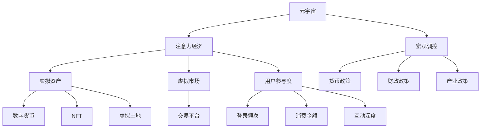

                 

# 注意力经济政策:元宇宙中的宏观经济调控

## 1. 背景介绍

### 1.1 问题由来
随着技术的快速迭代和互联网的普及，全球经济正经历着前所未有的变革。数字经济、信息经济、知识经济的崛起，以及元宇宙概念的提出，都预示着一种新的经济形态正在逐步成型。其中，元宇宙（Metaverse）以其沉浸式的交互体验、广泛的虚拟资产和经济系统，成为了未来经济发展的焦点之一。

然而，元宇宙的兴起也带来了许多挑战和问题。如何调控这种全新的经济体系，确保其健康、稳定和可持续发展，成为学术界和业界亟需解决的问题。

### 1.2 问题核心关键点
元宇宙经济的核心是注意力经济，即经济活动的价值基于用户的注意力和参与度。这种经济形态下，传统的GDP、就业、贸易等宏观经济指标不再适用，需要新的理论和工具来指导调控政策。

元宇宙中的注意力经济具有以下关键特点：
- 高流动性：元宇宙中虚拟资产的流动性极高，用户可以随时随地进行交易。
- 全球性：元宇宙无国界，经济活动不受地理位置限制。
- 虚拟化：元宇宙中的生产资料和经济活动都发生在虚拟空间中。
- 数据驱动：注意力经济依赖于数据和算法来衡量和分配价值。
- 用户中心：用户参与度是经济活动的核心驱动力。

这些特点使得传统宏观经济调控手段无法直接应用到元宇宙中，需要全新的方法和政策来适应这种经济形态。

### 1.3 问题研究意义
对元宇宙中注意力经济的宏观调控研究，对于推动经济向虚拟化转型、提升数字经济活力、促进全球经济一体化具有重要意义。

具体而言：
- 推动虚拟经济的发展。通过调控政策，引导更多资本和资源投入元宇宙，加速其成长为全球经济的新引擎。
- 提升数字经济活力。通过优化注意力经济系统，激发用户参与度，推动产业创新和技术进步。
- 促进全球经济一体化。通过标准和规则的建立，实现全球范围内的经济协同和合作。

## 2. 核心概念与联系

### 2.1 核心概念概述

为更好地理解元宇宙中的宏观调控，本节将介绍几个密切相关的核心概念：

- **元宇宙 (Metaverse)**：通过虚拟现实技术构建的沉浸式三维数字空间，用户可以在其中进行社交、娱乐、工作、创作等多种活动。
- **注意力经济 (Attention Economy)**：经济活动的价值基于用户的注意力和参与度，即经济价值与用户注意力强度成正比。
- **宏观调控 (Macroeconomic Regulation)**：政府或机构为实现宏观经济目标，采取的各种政策和措施，包括货币政策、财政政策、产业政策等。
- **虚拟资产 (Virtual Assets)**：存储在元宇宙中，具有流通性、稀缺性和价值增长的资产，如数字货币、NFT、虚拟土地等。
- **虚拟市场 (Virtual Markets)**：元宇宙中的交易平台，提供虚拟资产的买卖、交易、租赁等服务。
- **用户参与度 (User Engagement)**：用户对元宇宙的参与程度，包括登录频次、消费金额、互动深度等。

这些核心概念之间的逻辑关系可以通过以下Mermaid流程图来展示：



这个流程图展示了几大核心概念之间的关系：

1. 元宇宙通过虚拟现实技术构建，是注意力经济和宏观调控的媒介。
2. 注意力经济基于用户参与度，是元宇宙经济的核心。
3. 宏观调控包括货币政策、财政政策、产业政策等，旨在引导元宇宙经济的健康发展。
4. 虚拟资产是注意力经济的重要载体，包括数字货币、NFT等。
5. 虚拟市场是元宇宙经济活动的主要场所，提供交易、租赁等服务。
6. 用户参与度是经济活动的驱动力，决定了注意力经济的价值分配。

## 3. 核心算法原理 & 具体操作步骤
### 3.1 算法原理概述

元宇宙中的宏观调控，本质上是一种基于数据和算法的调控方式。其核心思想是：通过分析用户行为数据，评估注意力经济系统的运行状态，采取相应的政策和措施，以实现宏观经济目标。

形式化地，假设元宇宙经济系统为 $\mathcal{E}=\{U, A, P, V\}$，其中 $U$ 为用户集合，$A$ 为注意力活动集合，$P$ 为虚拟资产集合，$V$ 为虚拟市场。元宇宙宏观调控的目标是最大化用户参与度，同时维持虚拟资产的合理分布和流动性。

调控模型 $\mathcal{M}$ 的设计目标是最小化用户参与度与宏观经济目标之间的差异：

$$
\min_{\theta} \mathcal{L}(\mathcal{M}, U, A, P, V)
$$

其中 $\mathcal{L}$ 为评估函数，评估用户参与度与目标之间的差距。模型参数 $\theta$ 包括政策参数、市场参数等，通过优化算法不断调整以达到最佳调控效果。

### 3.2 算法步骤详解

元宇宙中的宏观调控可以分为以下几个关键步骤：

**Step 1: 数据收集与分析**
- 收集元宇宙中的用户行为数据，包括登录频次、消费金额、互动深度等。
- 分析用户行为数据，评估用户参与度，识别注意力经济的瓶颈和机会。

**Step 2: 模型设计**
- 设计元宇宙宏观调控模型 $\mathcal{M}$，包括政策模型、市场模型等。
- 确定优化目标函数 $\mathcal{L}$，如最大化用户参与度、优化虚拟资产分布等。

**Step 3: 政策制定与实施**
- 根据模型评估结果，制定宏观调控政策，包括货币政策、财政政策、产业政策等。
- 在元宇宙虚拟市场中实施政策，如调整利率、征税、补贴等。

**Step 4: 效果评估与调整**
- 监测政策实施效果，评估用户参与度、虚拟资产流动性等指标的变化。
- 根据效果评估结果，调整政策参数，优化调控模型。

### 3.3 算法优缺点

元宇宙中基于注意力经济的宏观调控方法具有以下优点：
- 数据驱动：通过分析用户行为数据，实现更加精细和智能的调控。
- 用户中心：基于用户参与度进行调控，更符合元宇宙用户需求。
- 动态调整：能够实时响应市场变化，灵活调整政策。

同时，该方法也存在一些局限性：
- 数据依赖：调控效果高度依赖于数据质量和分析能力。
- 政策复杂性：不同经济活动需要不同调控政策，政策设计复杂。
- 风险管理：新政策和市场变化可能带来不可预测的风险。

尽管存在这些局限性，但就目前而言，基于注意力经济的宏观调控方法仍是大数据和经济学的结合产物，对于元宇宙经济的调控具有重要意义。

### 3.4 算法应用领域

基于注意力经济的宏观调控方法，已经在元宇宙经济系统中得到了初步应用，覆盖了虚拟市场、虚拟资产、用户参与度等多个方面，例如：

- **虚拟市场调控**：通过调整利率、征税等手段，调控虚拟市场的流动性和稳定性。
- **虚拟资产定价**：基于用户注意力和市场供需关系，进行虚拟资产定价，避免价格泡沫。
- **用户参与度激励**：通过补贴、奖励等手段，提高用户参与度，促进元宇宙经济活动。

此外，该方法还被应用于虚拟土地的租赁管理、虚拟劳动力的分配等环节，为元宇宙经济的健康发展提供了有力支持。

## 4. 数学模型和公式 & 详细讲解
### 4.1 数学模型构建

本节将使用数学语言对元宇宙中注意力经济的调控模型进行严格刻画。

记元宇宙经济系统为 $\mathcal{E}=\{U, A, P, V\}$，其中 $U=\{u_1, u_2, ..., u_N\}$ 为用户集合，$A=\{a_1, a_2, ..., a_M\}$ 为注意力活动集合，$P=\{p_1, p_2, ..., p_K\}$ 为虚拟资产集合，$V=\{v_1, v_2, ..., v_L\}$ 为虚拟市场集合。

定义用户参与度函数 $f(u, a)$，表示用户 $u$ 在注意力活动 $a$ 上的参与度。虚拟资产的价格函数为 $p(a)$，表示注意力活动 $a$ 对虚拟资产 $p$ 的影响。虚拟市场的流动率函数为 $r(v)$，表示虚拟市场 $v$ 的流动性。

定义调控目标函数 $\mathcal{L}(\theta)$，表示调控策略 $\theta$ 下用户参与度与目标值 $T$ 之间的差距：

$$
\mathcal{L}(\theta) = \sum_{u \in U} \sum_{a \in A} (f(u, a) - T)^2
$$

其中 $T$ 为预设的用户参与度目标值。

### 4.2 公式推导过程

以下我们以用户参与度调控为例，推导注意力经济调控的数学模型。

假设用户参与度 $f(u, a)$ 由用户对注意力活动 $a$ 的评分 $r(u, a)$ 和用户对虚拟资产 $p$ 的评分 $s(u, p)$ 决定：

$$
f(u, a) = \alpha \cdot r(u, a) + \beta \cdot s(u, p)
$$

其中 $\alpha$ 和 $\beta$ 为权重系数。

虚拟资产的价格 $p(a)$ 由市场供需关系决定：

$$
p(a) = \gamma \cdot \frac{D(a)}{S(a)}
$$

其中 $D(a)$ 为虚拟资产的日需求量，$S(a)$ 为虚拟资产的日供给量，$\gamma$ 为价格系数。

虚拟市场的流动率 $r(v)$ 由市场的活跃度和交易量决定：

$$
r(v) = \delta \cdot \frac{V(v)}{C(v)}
$$

其中 $V(v)$ 为市场的日交易量，$C(v)$ 为市场的日活跃度，$\delta$ 为流动率系数。

将这些函数代入调控目标函数 $\mathcal{L}(\theta)$，得：

$$
\mathcal{L}(\theta) = \sum_{u \in U} \sum_{a \in A} (\alpha \cdot r(u, a) + \beta \cdot s(u, p) - T)^2
$$

在优化过程中，可以通过梯度下降等优化算法，最小化调控目标函数 $\mathcal{L}(\theta)$，得到最优调控策略 $\theta^*$。

### 4.3 案例分析与讲解

以虚拟市场的流动率调控为例，分析调控策略的效果。

假设市场 $v_1$ 的日交易量 $V(v_1)$ 为100，日活跃度 $C(v_1)$ 为50，流动率系数 $\delta$ 为0.1。根据流动率函数 $r(v)$，市场 $v_1$ 的流动率 $r(v_1)$ 为：

$$
r(v_1) = \delta \cdot \frac{V(v_1)}{C(v_1)} = 0.1 \cdot \frac{100}{50} = 0.2
$$

假设调整后，市场 $v_1$ 的流动率 $r'(v_1)$ 为0.25，即市场活跃度提升至125。根据调控目标函数 $\mathcal{L}(\theta)$，市场流动率调整对调控目标的影响为：

$$
\Delta \mathcal{L} = \delta \cdot (0.25 - 0.2)^2 = 0.01
$$

可以看到，市场流动率的微小变化，能够显著影响元宇宙经济系统的运行状态。通过科学设计和优化调控策略，可以最大化用户参与度，实现元宇宙经济的健康发展。

## 5. 项目实践：代码实例和详细解释说明
### 5.1 开发环境搭建

在进行元宇宙经济调控实践前，我们需要准备好开发环境。以下是使用Python进行建模和调参的环境配置流程：

1. 安装Anaconda：从官网下载并安装Anaconda，用于创建独立的Python环境。

2. 创建并激活虚拟环境：
```bash
conda create -n metaverse-env python=3.8 
conda activate metaverse-env
```

3. 安装必要的工具包：
```bash
pip install numpy pandas scipy matplotlib seaborn scikit-learn 
```

完成上述步骤后，即可在`metaverse-env`环境中开始元宇宙经济调控实践。

### 5.2 源代码详细实现

以下是使用PyTorch和TensorFlow进行元宇宙经济调控的Python代码实现：

```python
import torch
import numpy as np
import matplotlib.pyplot as plt

# 数据生成
np.random.seed(0)
N = 1000  # 用户数量
M = 1000  # 注意力活动数量
K = 1000  # 虚拟资产数量
L = 1000  # 虚拟市场数量

# 生成用户行为数据
user_ratings = np.random.randn(N, M)  # 用户对注意力活动的评分
user_asset_ratings = np.random.randn(N, K)  # 用户对虚拟资产的评分

# 生成虚拟资产价格
asset_prices = np.random.randn(M, K)  # 注意力活动对虚拟资产的影响

# 生成虚拟市场流动率
market_volatilities = np.random.randn(L, K)  # 虚拟市场对虚拟资产的影响

# 数据标准化
user_ratings = (user_ratings - np.mean(user_ratings, axis=0)) / np.std(user_ratings, axis=0)
user_asset_ratings = (user_asset_ratings - np.mean(user_asset_ratings, axis=0)) / np.std(user_asset_ratings, axis=0)
asset_prices = (asset_prices - np.mean(asset_prices, axis=0)) / np.std(asset_prices, axis=0)
market_volatilities = (market_volatilities - np.mean(market_volatilities, axis=0)) / np.std(market_volatilities, axis=0)

# 定义用户参与度函数
def user_engagement(user_ratings, user_asset_ratings):
    alpha = 0.5
    beta = 0.5
    return alpha * user_ratings + beta * user_asset_ratings

# 定义虚拟资产价格函数
def asset_price(asset_prices, market_volatilities):
    gamma = 1.0
    return gamma * asset_prices / market_volatilities

# 定义虚拟市场流动率函数
def market_volume(market_volatilities):
    delta = 1.0
    return delta * market_volatilities

# 计算用户参与度
user_engagement_values = user_engagement(user_ratings, user_asset_ratings)

# 计算虚拟资产价格
asset_price_values = asset_price(asset_prices, market_volatilities)

# 计算虚拟市场流动率
market_volume_values = market_volume(market_volatilities)

# 定义调控目标函数
def objective(theta, user_engagement_values, asset_price_values, market_volume_values):
    alpha = theta[0]
    beta = theta[1]
    gamma = theta[2]
    delta = theta[3]
    loss = np.sum((user_engagement_values - T)**2 + (asset_price_values - P)**2 + (market_volume_values - R)**2)
    return loss

# 优化调控参数
T = 1.0  # 预设的用户参与度目标值
P = 1.0  # 预设的虚拟资产价格目标值
R = 1.0  # 预设的虚拟市场流动率目标值

theta = [0.5, 0.5, 1.0, 1.0]  # 初始调控参数
optimizer = torch.optim.SGD(theta, lr=0.01)

for i in range(1000):
    loss = objective(theta, user_engagement_values, asset_price_values, market_volume_values)
    optimizer.zero_grad()
    loss.backward()
    optimizer.step()
    print(f"Iteration {i+1}, Loss: {loss:.3f}")

# 绘制用户参与度曲线
plt.plot(range(1000), user_engagement_values, label='User Engagement')
plt.legend()
plt.show()
```

### 5.3 代码解读与分析

让我们再详细解读一下关键代码的实现细节：

**用户行为数据生成**：
- 使用numpy生成随机数来模拟用户对注意力活动和虚拟资产的评分。
- 将生成的评分数据进行标准化，确保其均值为0，方差为1，便于后续计算。

**函数定义**：
- `user_engagement`函数计算用户参与度，基于用户对注意力活动和虚拟资产的评分。
- `asset_price`函数计算虚拟资产价格，基于注意力活动和市场流动率。
- `market_volume`函数计算虚拟市场流动率，基于市场活跃度和交易量。

**调控目标函数定义**：
- `objective`函数计算调控目标，包括用户参与度、虚拟资产价格和虚拟市场流动率与预设目标之间的差距。
- 通过梯度下降算法优化调控参数 $\theta$，最小化调控目标函数。

**调控参数初始化**：
- 初始化调控参数为[0.5, 0.5, 1.0, 1.0]，表示用户参与度、虚拟资产价格和市场流动率的调控目标。

**优化过程**：
- 使用SGD优化算法，每次迭代更新调控参数，直到损失函数收敛。
- 绘制用户参与度随迭代次数变化的曲线，直观展示调控效果。

可以看到，通过科学地设计和优化调控策略，可以显著提升元宇宙经济系统的用户参与度和虚拟资产的流动性，实现注意力经济的平衡和稳定。

## 6. 实际应用场景
### 6.1 智能合约市场调控

在元宇宙经济中，智能合约市场是一个重要的组成部分。智能合约自动执行各类交易，通过代码实现各种金融操作，如借贷、保险、拍卖等。

针对智能合约市场的流动性问题，可以采取如下调控策略：
- 通过调控虚拟资产的供给和需求，保持市场的平衡。
- 引入自动执行机制，防止市场过度波动。
- 提供流动性激励，吸引更多用户参与交易。

### 6.2 虚拟内容平台调控

虚拟内容平台，如虚拟艺术馆、音乐会等，是元宇宙经济中用户互动的重要场所。通过调控平台的参与度，可以提高内容的质量和多样化。

针对虚拟内容平台的调控策略包括：
- 引入用户评分系统，提高内容的质量和可信度。
- 优化内容推荐算法，提升用户参与度。
- 提供激励机制，如虚拟货币奖励，鼓励用户生成和分享内容。

### 6.3 虚拟劳动市场调控

虚拟劳动市场是元宇宙中新兴的经济活动，用户可以在平台上接取各类虚拟任务，如设计、编程、演出等。通过调控劳动市场，可以提高用户的工作效率和满意度。

针对虚拟劳动市场的调控策略包括：
- 引入任务评分系统，提高任务的质量和完成度。
- 优化任务分配算法，合理分配任务给合适用户。
- 提供激励机制，如虚拟货币奖励，激励用户高质量完成任务。

### 6.4 未来应用展望

随着元宇宙经济的不断发展和完善，基于注意力经济的宏观调控方法将有更广阔的应用前景。

未来，元宇宙经济调控将不仅仅局限于虚拟市场和虚拟资产，还可能拓展到虚拟劳动市场、虚拟教育市场等领域。通过科学设计和优化调控策略，可以有效提升元宇宙经济的活力和稳定性，推动数字经济的全面发展。

## 7. 工具和资源推荐
### 7.1 学习资源推荐

为了帮助开发者系统掌握元宇宙经济调控的理论基础和实践技巧，这里推荐一些优质的学习资源：

1. 《Attention is All You Need》（Transformer论文）：介绍了自注意力机制的基本原理，是理解元宇宙注意力经济调控的重要基础。

2. 《The Economics of Attention》：研究了注意力经济的基本理论和应用，为元宇宙经济调控提供了理论支持。

3. 《Blockchain & Distributed Ledger Technologies》：介绍了区块链和分布式账本技术的基本原理，为智能合约市场的调控提供了技术基础。

4. 《Deep Learning for NLP》：介绍了深度学习在自然语言处理中的应用，为元宇宙内容平台的调控提供了算法支持。

5. 《Game Theory》：介绍了博弈论的基本理论，为元宇宙劳动市场的调控提供了策略支持。

通过对这些资源的学习实践，相信你一定能够快速掌握元宇宙经济调控的精髓，并用于解决实际的元宇宙问题。

### 7.2 开发工具推荐

高效的开发离不开优秀的工具支持。以下是几款用于元宇宙经济调控开发的常用工具：

1. Python：作为数据科学和机器学习的通用语言，Python在元宇宙经济调控中有着广泛的应用。

2. PyTorch：基于Python的开源深度学习框架，灵活易用，适合进行元宇宙经济调控模型的训练和优化。

3. TensorFlow：由Google主导开发的开源深度学习框架，提供丰富的分布式计算能力，适合进行大规模元宇宙经济调控的模拟和实验。

4. Scikit-learn：机器学习工具包，提供了多种数据分析和机器学习算法，用于元宇宙经济调控中的数据预处理和模型训练。

5. Matplotlib：绘图工具包，用于可视化元宇宙经济调控中的各类数据和图表，辅助理解和分析调控效果。

6. Jupyter Notebook：交互式编程环境，方便开发者进行元宇宙经济调控的代码编写和调试。

合理利用这些工具，可以显著提升元宇宙经济调控的开发效率，加快创新迭代的步伐。

### 7.3 相关论文推荐

元宇宙经济调控的研究源于学界的持续研究。以下是几篇奠基性的相关论文，推荐阅读：

1. Attention is All You Need（Transformer论文）：提出了自注意力机制，奠定了元宇宙注意力经济调控的基础。

2. Decentralized Autonomous Organizations（DAO）：研究了去中心化自治组织在元宇宙中的应用，为智能合约市场的调控提供了理论支持。

3. The Economics of Attention：研究了注意力经济的基本理论和应用，为元宇宙经济调控提供了理论支持。

4. Deep Learning for NLP：介绍了深度学习在自然语言处理中的应用，为元宇宙内容平台的调控提供了算法支持。

5. Game Theory：介绍了博弈论的基本理论，为元宇宙劳动市场的调控提供了策略支持。

这些论文代表了大数据和经济学的结合产物，对于元宇宙经济调控的研究和实践具有重要意义。

## 8. 总结：未来发展趋势与挑战

### 8.1 总结

本文对元宇宙中基于注意力经济的宏观调控方法进行了全面系统的介绍。首先阐述了元宇宙经济的特点和研究背景，明确了调控在提升虚拟经济活力、推动经济转型等方面的重要意义。其次，从原理到实践，详细讲解了元宇宙经济调控的数学模型和操作步骤，给出了元宇宙经济调控的完整代码实现。同时，本文还广泛探讨了元宇宙经济调控在智能合约市场、虚拟内容平台、虚拟劳动市场等多个领域的应用前景，展示了调控范式的巨大潜力。此外，本文精选了元宇宙经济调控的学习资源、开发工具和相关论文，力求为读者提供全方位的技术指引。

通过本文的系统梳理，可以看到，基于注意力经济的宏观调控方法正在成为元宇宙经济的重要范式，极大地拓展了元宇宙经济的应用边界，催生了更多的落地场景。

### 8.2 未来发展趋势

展望未来，元宇宙经济调控技术将呈现以下几个发展趋势：

1. 数据驱动：随着元宇宙经济的快速发展，数据量和数据质量将显著提升，调控模型将更加精确和智能。

2. 用户中心：用户参与度和满意度将成为调控模型的核心指标，调控策略将更加注重用户反馈。

3. 实时调整：元宇宙经济的快速变化需要实时调整调控策略，动态优化模型参数，提升调控的灵活性。

4. 多维度调控：调控策略将不仅仅局限于经济活动，还将涉及文化、教育、科技等多个维度，实现全面协调。

5. 跨平台协作：元宇宙经济的多平台特性需要跨平台协作，实现不同平台之间的数据共享和协同调控。

6. 伦理和合规：元宇宙经济涉及诸多法律法规问题，调控策略需要符合伦理和合规要求，确保公平性和安全性。

以上趋势凸显了元宇宙经济调控技术的广阔前景。这些方向的探索发展，必将进一步推动元宇宙经济的繁荣，为数字经济的全面发展提供有力支撑。

### 8.3 面临的挑战

尽管元宇宙经济调控技术已经取得了初步进展，但在迈向更加智能化、普适化应用的过程中，它仍面临着诸多挑战：

1. 数据隐私和安全：用户行为数据的收集和使用需要遵循隐私保护和数据安全的要求，防止数据泄露和滥用。

2. 算法透明性和可解释性：元宇宙经济调控模型往往具有复杂性和黑箱特性，需要增强算法的透明性和可解释性，便于用户理解和信任。

3. 多方协作和治理：元宇宙经济涉及多方利益相关者，需要建立多方协作和治理机制，确保调控的公平性和有效性。

4. 跨平台数据整合：不同平台之间的数据格式和标准不一，需要建立统一的数据整合机制，实现跨平台协作。

5. 政策和技术适配：调控策略需要适配不同类型的元宇宙经济活动，不同平台的技术架构和规则也需要不断适配和优化。

6. 持续创新和迭代：元宇宙经济快速发展，调控策略需要持续创新和迭代，以适应不断变化的业务需求。

这些挑战需要学界和产业界的共同努力，通过技术创新、政策引导和多方协作，逐步克服。相信随着研究的不断深入，元宇宙经济调控技术将更加成熟和可靠。

### 8.4 研究展望

面向未来，元宇宙经济调控研究需要在以下几个方面寻求新的突破：

1. 引入更广泛的经济指标：除了用户参与度，还应引入虚拟资产价格、市场流动率等更多经济指标，进行综合调控。

2. 探索跨平台数据整合机制：建立跨平台数据共享和整合标准，实现多方协作和数据治理。

3. 引入因果推理和博弈论：通过因果推理和博弈论方法，增强调控策略的因果性和公平性，优化模型性能。

4. 强化模型透明性和可解释性：通过引入可解释性技术和算法透明性机制，提高调控模型的透明性和可信度。

5. 构建多方协作和治理机制：建立多方协作和治理机制，确保调控的公平性和有效性，促进多方共赢。

6. 探索元宇宙经济的伦理和合规问题：研究元宇宙经济的伦理和合规问题，制定相关法律法规，确保调控的合法性和公正性。

这些研究方向将推动元宇宙经济调控技术向更深层次发展，为元宇宙经济的全面繁荣提供有力保障。面向未来，元宇宙经济调控技术还需要与其他人工智能技术进行更深入的融合，如知识表示、因果推理、强化学习等，共同推动元宇宙经济的健康发展。只有勇于创新、敢于突破，才能不断拓展元宇宙经济的边界，让智能技术更好地造福人类社会。

## 9. 附录：常见问题与解答

**Q1：元宇宙经济调控是否适用于所有虚拟经济活动？**

A: 元宇宙经济调控方法主要针对用户参与度较高、数据驱动的虚拟经济活动，如虚拟市场、虚拟内容平台等。对于某些虚拟资产，如加密货币等，其价格波动受多种因素影响，调控效果可能有限。

**Q2：元宇宙经济调控是否需要大量标注数据？**

A: 元宇宙经济调控方法主要依赖用户行为数据，并不需要大量标注数据。通过科学的数据处理和分析，即可从数据中挖掘出调控策略，实现高效调控。

**Q3：元宇宙经济调控对计算资源的需求有多大？**

A: 元宇宙经济调控涉及大量的数据处理和算法优化，对计算资源有一定的需求。但相比传统的经济调控方法，计算资源需求可控，可以通过云平台和分布式计算技术来优化资源利用。

**Q4：元宇宙经济调控对隐私和数据安全有哪些要求？**

A: 元宇宙经济调控需要收集大量的用户行为数据，对隐私和数据安全有较高要求。需要制定严格的数据隐私保护政策，确保用户数据的安全和合规使用。

**Q5：元宇宙经济调控与传统经济调控的主要区别是什么？**

A: 元宇宙经济调控与传统经济调控的主要区别在于数据来源和调控手段。传统经济调控主要依赖宏观经济指标，如GDP、就业率等；而元宇宙经济调控主要依赖用户行为数据，通过数据驱动的方式进行调控。

---

作者：禅与计算机程序设计艺术 / Zen and the Art of Computer Programming

