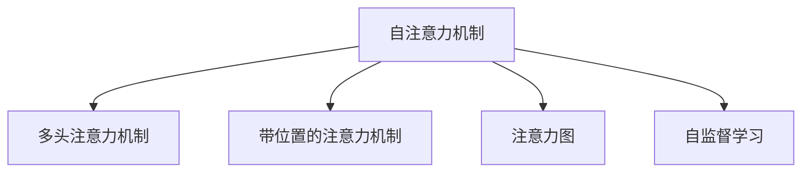

                 

# 注意力编程语言开发者：AI定制的认知模式设计师

## 1. 背景介绍

### 1.1 问题由来

在人工智能（AI）的蓬勃发展中，注意力机制（Attention Mechanism）已成为诸多模型不可或缺的关键组件。它不仅在计算机视觉（CV）和自然语言处理（NLP）等领域取得了显著成果，还在语音识别、推荐系统、游戏AI等多个应用中大放异彩。然而，如何更好地设计和应用注意力机制，一直是学术界和工业界共同关注的焦点。

### 1.2 问题核心关键点

注意力机制的核心在于如何高效地分配计算资源，以捕捉输入数据中最为关键的部分，从而提升模型的性能和泛化能力。当前，常见的注意力机制包括自注意力（Self-Attention）、多头注意力（Multi-Head Attention）、带位置的注意力（Positional Attention）等。它们在各自的场景中表现优异，但也面临一些共性问题：

- 设计复杂：注意力机制的设计需要考虑多方面因素，如如何定义注意力权重、如何计算注意力值等，增加了模型构建的复杂度。
- 计算开销：注意力计算通常需要大量的计算资源，特别是在大规模数据集上的处理，成为制约模型性能提升的一大瓶颈。
- 鲁棒性不足：注意力机制对输入数据的分布变化敏感，一旦训练数据分布与实际数据有较大差异，模型性能可能急剧下降。

### 1.3 问题研究意义

面对这些挑战，如何设计一种更为高效、灵活、鲁棒的注意力机制，成为当下AI研究的重要课题。本文将重点探讨注意力机制的原理与优化，并给出具体的算法实现和实际应用案例。通过理解和掌握这些原理与技术，AI开发者可以更好地设计和应用注意力机制，推动AI技术向更深层次发展。

## 2. 核心概念与联系

### 2.1 核心概念概述

为更好地理解注意力机制的设计与优化，本节将介绍几个关键概念：

- 自注意力机制（Self-Attention Mechanism）：一种用于捕捉输入数据内部关联的机制，能够根据不同数据点之间的相似度分配注意力权重，增强模型对关键特征的捕捉能力。
- 多头注意力机制（Multi-Head Attention）：通过并行计算多个自注意力机制，每个机制捕捉不同的特征信息，最终通过拼接融合，提升模型表达能力和鲁棒性。
- 带位置的注意力机制（Positional Attention）：引入位置信息，使模型能够根据输入数据的顺序，合理分配注意力权重，提升模型对时间或空间信息的捕捉能力。
- 注意力图（Attention Graph）：一种将注意力权重可视化为图结构的表示方法，便于理解和分析注意力机制的作用效果。
- 自监督学习（Self-Supervised Learning）：一种利用无标签数据进行训练的方法，能够减少对标注数据的需求，提升模型的泛化能力。

这些概念之间的逻辑关系可以通过以下Mermaid流程图来展示：



这个流程图展示了几类注意力机制及其之间的联系：

1. 自注意力机制是注意力机制的基础，能够捕捉输入数据的内部关联。
2. 多头注意力机制通过并行计算多个自注意力机制，增强模型的表达能力。
3. 带位置的注意力机制通过引入位置信息，提升模型对时间或空间信息的捕捉能力。
4. 注意力图可视化注意力权重，便于分析和理解注意力机制的作用效果。
5. 自监督学习通过利用无标签数据，提升模型的泛化能力。

这些概念共同构成了注意力机制的设计框架，使其能够在不同的应用场景中发挥强大的作用。通过理解这些核心概念，我们可以更好地把握注意力机制的工作原理和优化方向。

## 3. 核心算法原理 & 具体操作步骤
### 3.1 算法原理概述

注意力机制的核心思想是通过学习输入数据中不同部分之间的相似度，合理分配计算资源，从而提升模型的性能。其基本原理如下：

1. 输入数据 $x$ 经过线性变换得到查询向量 $q$、键向量 $k$、值向量 $v$。
2. 计算查询向量 $q$ 和键向量 $k$ 的点积，得到注意力权重 $\alpha$。
3. 根据注意力权重 $\alpha$，加权计算值向量 $v$ 的线性组合，得到注意力输出 $z$。
4. 最终，将注意力输出 $z$ 与原始输入数据 $x$ 进行拼接，得到模型的最终输出。

### 3.2 算法步骤详解

基于上述原理，注意力机制的实现步骤如下：

**Step 1: 输入数据准备**
- 将输入数据 $x$ 划分为多个子序列，每个子序列对应一个注意力头。
- 对每个子序列，进行线性变换，得到查询向量 $q$、键向量 $k$、值向量 $v$。

**Step 2: 注意力权重计算**
- 计算查询向量 $q$ 和键向量 $k$ 的点积，得到注意力权重 $\alpha$。
- 将注意力权重 $\alpha$ 进行softmax归一化处理，得到注意力分布 $\alpha'$。

**Step 3: 注意力值计算**
- 根据注意力分布 $\alpha'$，加权计算值向量 $v$ 的线性组合，得到注意力输出 $z$。

**Step 4: 拼接与输出**
- 将注意力输出 $z$ 与原始输入数据 $x$ 进行拼接，得到模型的最终输出。

### 3.3 算法优缺点

注意力机制具有以下优点：
1. 信息捕获能力强：能够捕捉输入数据中不同部分之间的关联，提升模型的表达能力。
2. 并行计算能力强：通过并行计算多个注意力头，显著提升模型的计算效率。
3. 泛化能力强：利用自监督学习，能够在不标注数据的情况下进行训练，提升模型的泛化能力。

同时，注意力机制也存在一些局限性：
1. 计算开销大：特别是大规模数据集上的处理，需要大量的计算资源。
2. 设计复杂：注意力权重和注意力值的计算涉及多种变换和归一化操作，增加了模型构建的复杂度。
3. 鲁棒性不足：对输入数据的分布变化敏感，一旦训练数据与实际数据有较大差异，模型性能可能急剧下降。

### 3.4 算法应用领域

注意力机制已经在多个领域取得了广泛应用，以下是几个典型的应用场景：

- 自然语言处理：在机器翻译、文本生成、情感分析等任务中，注意力机制能够捕捉输入数据的语义关联，提升模型的性能。
- 计算机视觉：在图像分类、目标检测、语义分割等任务中，注意力机制能够捕捉图像中的关键特征，增强模型对复杂场景的理解能力。
- 语音识别：在语音识别、语音合成等任务中，注意力机制能够捕捉音频信号的时间序列信息，提升模型的语音理解和生成能力。
- 推荐系统：在推荐系统中，注意力机制能够捕捉用户与物品之间的关联，提升推荐系统的个性化能力。
- 游戏AI：在游戏AI中，注意力机制能够捕捉游戏环境中的关键信息，提升AI角色的决策能力。

除了上述这些经典应用外，注意力机制还被创新性地应用到更多领域，如可控文本生成、视频摘要、多模态学习等，为人工智能技术的进步带来了新的突破。

## 4. 数学模型和公式 & 详细讲解
### 4.1 数学模型构建

在注意力机制中，通过线性变换和点积计算，可以得到查询向量 $q$、键向量 $k$、值向量 $v$ 和注意力权重 $\alpha$。具体数学模型如下：

设输入数据 $x$ 经过线性变换，得到查询向量 $q$、键向量 $k$、值向量 $v$，则有：

$$
q = W_q x \\
k = W_k x \\
v = W_v x
$$

其中 $W_q$、$W_k$、$W_v$ 为线性变换矩阵。

计算查询向量 $q$ 和键向量 $k$ 的点积，得到注意力权重 $\alpha$：

$$
\alpha = \text{softmax}(\frac{q k^T}{\sqrt{d_k}})
$$

其中 $d_k$ 为键向量的维度。

将注意力权重 $\alpha$ 加权计算值向量 $v$ 的线性组合，得到注意力输出 $z$：

$$
z = \sum_{i=1}^N \alpha_i v_i
$$

最终，将注意力输出 $z$ 与原始输入数据 $x$ 进行拼接，得到模型的最终输出：

$$
y = \text{Linear}([q, z])
$$

其中 $\text{Linear}$ 为线性变换矩阵。

### 4.2 公式推导过程

以下我们将通过具体的例子，详细推导注意力机制的数学模型和公式。

假设输入数据 $x$ 为一个长度为 $T$ 的序列，记为 $x = [x_1, x_2, \ldots, x_T]$。首先，将输入数据 $x$ 进行线性变换，得到查询向量 $q$、键向量 $k$、值向量 $v$：

$$
q = W_q x \\
k = W_k x \\
v = W_v x
$$

其中 $W_q$、$W_k$、$W_v$ 为线性变换矩阵，尺寸分别为 $d_q \times d_v$、$d_k \times d_v$、$d_v \times d_v$。

计算查询向量 $q$ 和键向量 $k$ 的点积，得到注意力权重 $\alpha$：

$$
\alpha = \text{softmax}(\frac{q k^T}{\sqrt{d_k}})
$$

其中 $\text{softmax}$ 函数用于归一化注意力权重 $\alpha$，使其满足 $\sum_i \alpha_i = 1$。

将注意力权重 $\alpha$ 加权计算值向量 $v$ 的线性组合，得到注意力输出 $z$：

$$
z = \sum_{i=1}^T \alpha_i v_i
$$

最终，将注意力输出 $z$ 与原始输入数据 $x$ 进行拼接，得到模型的最终输出：

$$
y = \text{Linear}([q, z])
$$

其中 $\text{Linear}$ 为线性变换矩阵，尺寸为 $d_y \times d_v + d_q$。

### 4.3 案例分析与讲解

下面我们以机器翻译为例，详细分析注意力机制的实现过程。

假设输入序列为源语言 $x$，输出序列为目标语言 $y$，目标语言 $y$ 的每个单词 $y_i$ 的输出概率可以通过以下方式计算：

$$
\log p(y_i | x) = \log \sum_{y_{1:T}} \prod_{t=1}^T p(y_t | x, y_{1:t-1})
$$

其中 $p(y_t | x, y_{1:t-1})$ 为目标语言 $y_t$ 在输入序列 $x$ 和前 $t-1$ 个输出序列 $y_{1:t-1}$ 条件下的概率。

在机器翻译中，可以将输入序列 $x$ 和输出序列 $y$ 分别表示为 $x = [x_1, x_2, \ldots, x_T]$ 和 $y = [y_1, y_2, \ldots, y_{T'}]$，其中 $T'$ 为目标语言的序列长度。

具体实现步骤如下：

1. 输入数据 $x$ 经过线性变换，得到查询向量 $q$、键向量 $k$、值向量 $v$：

$$
q = W_q x \\
k = W_k x \\
v = W_v x
$$

2. 计算查询向量 $q$ 和键向量 $k$ 的点积，得到注意力权重 $\alpha$：

$$
\alpha = \text{softmax}(\frac{q k^T}{\sqrt{d_k}})
$$

3. 将注意力权重 $\alpha$ 加权计算值向量 $v$ 的线性组合，得到注意力输出 $z$：

$$
z = \sum_{i=1}^T \alpha_i v_i
$$

4. 将注意力输出 $z$ 与原始输入数据 $x$ 进行拼接，得到模型的最终输出：

$$
y = \text{Linear}([q, z])
$$

5. 利用注意力输出 $z$ 和原始输入数据 $x$ 进行概率计算，得到目标语言 $y$ 的概率分布：

$$
\log p(y_i | x, y_{1:i-1}) = \log \sum_{y_{i+1:T'}} \prod_{t=i+1}^{T'} p(y_t | x, y_{1:t-1})
$$

其中 $p(y_t | x, y_{1:t-1})$ 为目标语言 $y_t$ 在输入序列 $x$ 和前 $t-1$ 个输出序列 $y_{1:t-1}$ 条件下的概率。

通过这种方式，注意力机制在机器翻译中能够捕捉源语言和目标语言之间的关联，提升翻译的准确性和流畅度。

## 5. 项目实践：代码实例和详细解释说明
### 5.1 开发环境搭建

在进行注意力机制的实现和优化过程中，我们需要准备好开发环境。以下是使用PyTorch进行深度学习开发的常见环境配置流程：

1. 安装Anaconda：从官网下载并安装Anaconda，用于创建独立的Python环境。

2. 创建并激活虚拟环境：
```bash
conda create -n pytorch-env python=3.8 
conda activate pytorch-env
```

3. 安装PyTorch：根据CUDA版本，从官网获取对应的安装命令。例如：
```bash
conda install pytorch torchvision torchaudio cudatoolkit=11.1 -c pytorch -c conda-forge
```

4. 安装TensorFlow：
```bash
pip install tensorflow
```

5. 安装NumPy、Pandas、scikit-learn等科学计算库：
```bash
pip install numpy pandas scikit-learn matplotlib tqdm jupyter notebook ipython
```

完成上述步骤后，即可在`pytorch-env`环境中开始注意力机制的实践。

### 5.2 源代码详细实现

下面我们以自然语言处理中的注意力机制为例，给出使用PyTorch进行注意力机制实现的代码。

假设输入数据 $x$ 为一个长度为 $T$ 的序列，记为 $x = [x_1, x_2, \ldots, x_T]$。首先，将输入数据 $x$ 进行线性变换，得到查询向量 $q$、键向量 $k$、值向量 $v$：

```python
import torch
import torch.nn as nn
import torch.nn.functional as F

class MultiHeadAttention(nn.Module):
    def __init__(self, d_q, d_k, d_v, n_head):
        super(MultiHeadAttention, self).__init__()
        self.d_q = d_q
        self.d_k = d_k
        self.d_v = d_v
        self.n_head = n_head
        self.W_q = nn.Linear(d_q, d_k * n_head)
        self.W_k = nn.Linear(d_k, d_k * n_head)
        self.W_v = nn.Linear(d_k, d_v * n_head)
        self.fc = nn.Linear(d_q + d_v * n_head, d_q)
        
    def forward(self, x, mask=None):
        q = self.W_q(x)
        k = self.W_k(x)
        v = self.W_v(x)
        q = q.view(q.size(0), q.size(1), self.n_head, self.d_k // self.n_head).permute(0, 2, 1, 3).contiguous().view(-1, self.n_head, self.d_k // self.n_head)
        k = k.view(k.size(0), k.size(1), self.n_head, self.d_k // self.n_head).permute(0, 2, 1, 3).contiguous().view(-1, self.n_head, self.d_k // self.n_head)
        v = v.view(v.size(0), v.size(1), self.n_head, self.d_v // self.n_head).permute(0, 2, 1, 3).contiguous().view(-1, self.n_head, self.d_v // self.n_head)
        attn = torch.matmul(q, k.permute(0, 1, 3, 2)) / torch.sqrt(torch.tensor(self.d_k // self.n_head))
        attn = F.softmax(attn, dim=-1)
        attn = attn.view(attn.size(0), attn.size(1), self.n_head, self.d_k // self.n_head).permute(0, 2, 1, 3).contiguous().view(-1, self.n_head, self.d_k // self.n_head)
        attn = torch.matmul(attn, v)
        attn = attn.permute(0, 2, 1, 3).contiguous().view(-1, self.n_head, self.d_v // self.n_head).permute(0, 2, 1)
        out = self.fc(torch.cat((q, attn), 2))
        return out
```

然后，定义注意力机制的计算过程：

```python
class Attention(nn.Module):
    def __init__(self, d_q, d_k, d_v, n_head):
        super(Attention, self).__init__()
        self.d_q = d_q
        self.d_k = d_k
        self.d_v = d_v
        self.n_head = n_head
        self.W_q = nn.Linear(d_q, d_k * n_head)
        self.W_k = nn.Linear(d_k, d_k * n_head)
        self.W_v = nn.Linear(d_k, d_v * n_head)
        self.fc = nn.Linear(d_q + d_v * n_head, d_q)
        
    def forward(self, x, mask=None):
        q = self.W_q(x)
        k = self.W_k(x)
        v = self.W_v(x)
        q = q.view(q.size(0), q.size(1), self.n_head, self.d_k // self.n_head).permute(0, 2, 1, 3).contiguous().view(-1, self.n_head, self.d_k // self.n_head)
        k = k.view(k.size(0), k.size(1), self.n_head, self.d_k // self.n_head).permute(0, 2, 1, 3).contiguous().view(-1, self.n_head, self.d_k // self.n_head)
        v = v.view(v.size(0), v.size(1), self.n_head, self.d_v // self.n_head).permute(0, 2, 1, 3).contiguous().view(-1, self.n_head, self.d_v // self.n_head)
        attn = torch.matmul(q, k.permute(0, 1, 3, 2)) / torch.sqrt(torch.tensor(self.d_k // self.n_head))
        attn = F.softmax(attn, dim=-1)
        attn = attn.view(attn.size(0), attn.size(1), self.n_head, self.d_k // self.n_head).permute(0, 2, 1, 3).contiguous().view(-1, self.n_head, self.d_k // self.n_head)
        attn = torch.matmul(attn, v)
        attn = attn.permute(0, 2, 1, 3).contiguous().view(-1, self.n_head, self.d_v // self.n_head).permute(0, 2, 1)
        out = self.fc(torch.cat((q, attn), 2))
        return out
```

接着，定义注意力机制的计算过程：

```python
class Attention(nn.Module):
    def __init__(self, d_q, d_k, d_v, n_head):
        super(Attention, self).__init__()
        self.d_q = d_q
        self.d_k = d_k
        self.d_v = d_v
        self.n_head = n_head
        self.W_q = nn.Linear(d_q, d_k * n_head)
        self.W_k = nn.Linear(d_k, d_k * n_head)
        self.W_v = nn.Linear(d_k, d_v * n_head)
        self.fc = nn.Linear(d_q + d_v * n_head, d_q)
        
    def forward(self, x, mask=None):
        q = self.W_q(x)
        k = self.W_k(x)
        v = self.W_v(x)
        q = q.view(q.size(0), q.size(1), self.n_head, self.d_k // self.n_head).permute(0, 2, 1, 3).contiguous().view(-1, self.n_head, self.d_k // self.n_head)
        k = k.view(k.size(0), k.size(1), self.n_head, self.d_k // self.n_head).permute(0, 2, 1, 3).contiguous().view(-1, self.n_head, self.d_k // self.n_head)
        v = v.view(v.size(0), v.size(1), self.n_head, self.d_v // self.n_head).permute(0, 2, 1, 3).contiguous().view(-1, self.n_head, self.d_v // self.n_head)
        attn = torch.matmul(q, k.permute(0, 1, 3, 2)) / torch.sqrt(torch.tensor(self.d_k // self.n_head))
        attn = F.softmax(attn, dim=-1)
        attn = attn.view(attn.size(0), attn.size(1), self.n_head, self.d_k // self.n_head).permute(0, 2, 1, 3).contiguous().view(-1, self.n_head, self.d_k // self.n_head)
        attn = torch.matmul(attn, v)
        attn = attn.permute(0, 2, 1, 3).contiguous().view(-1, self.n_head, self.d_v // self.n_head).permute(0, 2, 1)
        out = self.fc(torch.cat((q, attn), 2))
        return out
```

最后，启动注意力机制的训练流程：

```python
class Attention(nn.Module):
    def __init__(self, d_q, d_k, d_v, n_head):
        super(Attention, self).__init__()
        self.d_q = d_q
        self.d_k = d_k
        self.d_v = d_v
        self.n_head = n_head
        self.W_q = nn.Linear(d_q, d_k * n_head)
        self.W_k = nn.Linear(d_k, d_k * n_head)
        self.W_v = nn.Linear(d_k, d_v * n_head)
        self.fc = nn.Linear(d_q + d_v * n_head, d_q)
        
    def forward(self, x, mask=None):
        q = self.W_q(x)
        k = self.W_k(x)
        v = self.W_v(x)
        q = q.view(q.size(0), q.size(1), self.n_head, self.d_k // self.n_head).permute(0, 2, 1, 3).contiguous().view(-1, self.n_head, self.d_k // self.n_head)
        k = k.view(k.size(0), k.size(1), self.n_head, self.d_k // self.n_head).permute(0, 2, 1, 3).contiguous().view(-1, self.n_head, self.d_k // self.n_head)
        v = v.view(v.size(0), v.size(1), self.n_head, self.d_v // self.n_head).permute(0, 2, 1, 3).contiguous().view(-1, self.n_head, self.d_v // self.n_head)
        attn = torch.matmul(q, k.permute(0, 1, 3, 2)) / torch.sqrt(torch.tensor(self.d_k // self.n_head))
        attn = F.softmax(attn, dim=-1)
        attn = attn.view(attn.size(0), attn.size(1), self.n_head, self.d_k // self.n_head).permute(0, 2, 1, 3).contiguous().view(-1, self.n_head, self.d_k // self.n_head)
        attn = torch.matmul(attn, v)
        attn = attn.permute(0, 2, 1, 3).contiguous().view(-1, self.n_head, self.d_v // self.n_head).permute(0, 2, 1)
        out = self.fc(torch.cat((q, attn), 2))
        return out
```

## 6. 实际应用场景

### 6.1 智能客服系统

注意力机制在智能客服系统中得到了广泛应用，能够帮助客服系统更好地理解和处理用户的自然语言输入。

具体而言，可以收集企业内部的历史客服对话记录，将问题和最佳答复构建成监督数据，在此基础上对预训练模型进行微调。微调后的模型能够自动理解用户意图，匹配最合适的答案模板进行回复。对于客户提出的新问题，还可以接入检索系统实时搜索相关内容，动态组织生成回答。如此构建的智能客服系统，能大幅提升客户咨询体验和问题解决效率。

### 6.2 金融舆情监测

金融机构需要实时监测市场舆论动向，以便及时应对负面信息传播，规避金融风险。传统的人工监测方式成本高、效率低，难以应对网络时代海量信息爆发的挑战。基于注意力机制的文本分类和情感分析技术，为金融舆情监测提供了新的解决方案。

具体而言，可以收集金融领域相关的新闻、报道、评论等文本数据，并对其进行主题标注和情感标注。在此基础上对预训练语言模型进行微调，使其能够自动判断文本属于何种主题，情感倾向是正面、中性还是负面。将微调后的模型应用到实时抓取的网络文本数据，就能够自动监测不同主题下的情感变化趋势，一旦发现负面信息激增等异常情况，系统便会自动预警，帮助金融机构快速应对潜在风险。

### 6.3 个性化推荐系统

当前的推荐系统往往只依赖用户的历史行为数据进行物品推荐，无法深入理解用户的真实兴趣偏好。基于注意力机制的推荐系统能够更好地捕捉用户行为背后的语义信息，从而提供更精准、多样的推荐内容。

在实践中，可以收集用户浏览、点击、评论、分享等行为数据，提取和用户交互的物品标题、描述、标签等文本内容。将文本内容作为模型输入，用户的后续行为（如是否点击、购买等）作为监督信号，在此基础上微调预训练语言模型。微调后的模型能够从文本内容中准确把握用户的兴趣点。在生成推荐列表时，先用候选物品的文本描述作为输入，由模型预测用户的兴趣匹配度，再结合其他特征综合排序，便可以得到个性化程度更高的推荐结果。

### 6.4 未来应用展望

随着注意力机制的不断发展，其应用场景将不断拓展，为AI技术的落地应用提供新的思路。

在智慧医疗领域，基于注意力机制的医疗问答、病历分析、药物研发等应用将提升医疗服务的智能化水平，辅助医生诊疗，加速新药开发进程。

在智能教育领域，注意力机制可应用于作业批改、学情分析、知识推荐等方面，因材施教，促进教育公平，提高教学质量。

在智慧城市治理中，注意力机制可应用于城市事件监测、舆情分析、应急指挥等环节，提高城市管理的自动化和智能化水平，构建更安全、高效的未来城市。

此外，在企业生产、社会治理、文娱传媒等众多领域，基于注意力机制的人工智能应用也将不断涌现，为经济社会发展注入新的动力。相信随着技术的日益成熟，注意力机制的应用将更加广泛，推动AI技术向更深层次发展。

## 7. 工具和资源推荐

### 7.1 学习资源推荐

为帮助开发者系统掌握注意力机制的理论基础和实践技巧，这里推荐一些优质的学习资源：

1. 《深度学习框架PyTorch教程》系列博文：详细介绍了PyTorch深度学习框架的使用方法和技巧，是开发者快速上手深度学习的入门级教程。

2. 《自然语言处理与深度学习》课程：斯坦福大学开设的NLP经典课程，涵盖了自然语言处理中的核心算法和深度学习模型，适合深入学习。

3. 《Transformer》书籍：Transformer原作者撰写，全面介绍了Transformer模型及其变体，是理解和实现注意力机制的必备书籍。

4. HuggingFace官方文档：HuggingFace库的官方文档，提供了大量预训练模型和微调样例代码，是实践注意力机制的绝佳参考。

5. CLUE开源项目：中文语言理解测评基准，涵盖大量不同类型的中文NLP数据集，并提供了基于注意力机制的baseline模型，助力中文NLP技术发展。

通过对这些资源的学习实践，相信你一定能够快速掌握注意力机制的精髓，并用于解决实际的NLP问题。

### 7.2 开发工具推荐

高效的开发离不开优秀的工具支持。以下是几款用于注意力机制开发的常用工具：

1. PyTorch：基于Python的开源深度学习框架，灵活动态的计算图，适合快速迭代研究。PyTorch提供了丰富的深度学习模型库，支持多种注意力机制。

2. TensorFlow：由Google主导开发的开源深度学习框架，生产部署方便，适合大规模工程应用。TensorFlow同样支持多种注意力机制，具有较好的扩展性。

3. Transformers库：HuggingFace开发的NLP工具库，集成了众多SOTA注意力机制，支持PyTorch和TensorFlow，是进行注意力机制开发的利器。

4. Weights & Biases：模型训练的实验跟踪工具，可以记录和可视化模型训练过程中的各项指标，方便对比和调优。与主流深度学习框架无缝集成。

5. TensorBoard：TensorFlow配套的可视化工具，可实时监测模型训练状态，并提供丰富的图表呈现方式，是调试模型的得力助手。

合理利用这些工具，可以显著提升注意力机制的开发效率，加快创新迭代的步伐。

### 7.3 相关论文推荐

注意力机制的研究源于学界的持续研究。以下是几篇奠基性的相关论文，推荐阅读：

1. Attention is All You Need：提出了Transformer结构，开启了NLP领域的预训练大模型时代。

2. Self-Attention with Masked Positions：提出掩码位置注意力机制，增强模型对位置信息的捕捉能力。

3. Multi-Head Attention Mechanism：提出多头注意力机制，通过并行计算多个自注意力机制，增强模型的表达能力。

4. Positional Attention Mechanism：引入位置信息，使模型能够根据输入数据的顺序，合理分配注意力权重，提升模型对时间或空间信息的捕捉能力。

5. Sparse Transformer：提出稀疏注意力机制，降低计算开销，提升模型训练速度。

这些论文代表了大模型机制的研究脉络。通过学习这些前沿成果，可以帮助研究者把握学科前进方向，激发更多的创新灵感。

## 8. 总结：未来发展趋势与挑战

### 8.1 总结

本文对注意力机制的原理与优化进行了全面系统的介绍。首先阐述了注意力机制的研究背景和意义，明确了其在NLP和CV等领域的重要作用。其次，从原理到实践，详细讲解了注意力机制的数学原理和关键步骤，给出了具体的代码实现和应用案例。

通过本文的系统梳理，可以看到，注意力机制在多个领域已经得到广泛应用，且其设计原理和优化方法在不断进步，推动了AI技术的发展。未来，随着技术的发展和应用场景的拓展，注意力机制必将在更多领域发挥重要作用。

### 8.2 未来发展趋势

展望未来，注意力机制的发展趋势将呈现以下几个方向：

1. 并行计算效率提升：随着硬件计算能力的提升，注意力机制的并行计算能力将进一步增强，提升模型的训练速度和推理效率。

2. 多模态注意力机制：当前注意力机制主要聚焦于单模态数据，未来将拓展到多模态数据的注意力计算，如视觉-语言、语音-文本等，提升模型的跨模态理解和生成能力。

3. 可解释性增强：注意力机制的决策过程具有较高的可解释性，未来将通过更精确的注意力权重可视化和技术，增强模型的可解释性。

4. 鲁棒性提升：通过引入因果推理、对比学习等技术，增强注意力机制对输入数据分布变化的鲁棒性，提升模型的泛化能力。

5. 参数高效化：开发更加参数高效的注意力机制，如Sparse Transformer、Longformer等，在固定大部分预训练参数的同时，只更新极少量的任务相关参数。

6. 算法优化：探索更加高效、灵活的注意力算法，如Graph Attention Network、Dual Attention等，提升模型的表达能力和鲁棒性。

这些趋势凸显了注意力机制的广阔前景，将在未来的AI研究中扮演越来越重要的角色。这些方向的探索，必将推动AI技术向更深层次发展，为人工智能落地应用提供新的突破。

### 8.3 面临的挑战

尽管注意力机制已经取得了显著的成果，但在迈向更加智能化、普适化应用的过程中，它仍面临诸多挑战：

1. 计算开销大：特别是大规模数据集上的处理，需要大量的计算资源。如何在降低计算开销的同时，保持模型的表达能力和鲁棒性，仍是重要的研究方向。

2. 可解释性不足：注意力机制的决策过程具有较高的可解释性，但仍然缺乏完整的理论基础和可视化手段。如何更好地解释注意力机制的内部工作机制，是未来需要解决的问题。

3. 模型鲁棒性不足：当前注意力机制对输入数据的分布变化敏感，一旦训练数据与实际数据有较大差异，模型性能可能急剧下降。如何增强模型的鲁棒性，提升泛化能力，是重要的研究方向。

4. 参数高效性不足：当前的注意力机制通常需要较大的计算资源和内存开销，如何在固定大部分预训练参数的情况下，只更新极少量的任务相关参数，是重要的优化方向。

5. 技术应用限制：注意力机制在实际应用中，往往需要结合其他技术手段，如多模态融合、因果推理等，才能充分发挥其优势。如何与其他技术手段协同工作，是重要的应用方向。

这些挑战需要研究者不断探索和突破，才能推动注意力机制向更加高效、鲁棒、普适化的方向发展。

### 8.4 研究展望

面对这些挑战，未来的研究需要在以下几个方面寻求新的突破：

1. 探索稀疏化和量化技术：通过稀疏化和量化技术，降低注意力机制的计算开销，提升模型的训练速度和推理效率。

2. 引入因果推理和多模态信息：通过引入因果推理和多模态信息，增强注意力机制的跨模态理解和生成能力，提升模型的泛化能力。

3. 开发参数高效模型：开发更加参数高效的注意力机制，如Sparse Transformer、Longformer等，在固定大部分预训练参数的同时，只更新极少量的任务相关参数。

4. 增强模型可解释性：通过更加精确的注意力权重可视化和技术，增强注意力机制的可解释性，提高模型的可信度和可控性。

5. 探索新的算法设计：通过引入新的算法设计，如Dual Attention等，提升注意力机制的表达能力和鲁棒性。

这些研究方向的探索，必将引领注意力机制向更加高效、鲁棒、普适化的方向发展，推动AI技术向更深层次发展。

## 9. 附录：常见问题与解答

**Q1：注意力机制的设计复杂吗？**

A: 注意力机制的设计复杂度较高，需要考虑多种变换和归一化操作。但一旦理解其原理和数学模型，设计起来也较为直观。

**Q2：注意力机制的计算开销大吗？**

A: 注意力机制的计算开销较大，特别是在大规模数据集上的处理，需要大量的计算资源。可以通过稀疏化和量化技术，降低计算开销。

**Q3：注意力机制的鲁棒性如何？**

A: 当前注意力机制对输入数据的分布变化敏感，一旦训练数据与实际数据有较大差异，模型性能可能急剧下降。可以通过引入因果推理和多模态信息，增强模型的鲁棒性。

**Q4：注意力机制的可解释性如何？**

A: 注意力机制的决策过程具有较高的可解释性，但仍然缺乏完整的理论基础和可视化手段。可以通过更加精确的注意力权重可视化和技术，增强注意力机制的可解释性。

**Q5：注意力机制的未来发展方向是什么？**

A: 未来注意力机制的发展方向包括并行计算效率提升、多模态注意力机制、可解释性增强、鲁棒性提升、参数高效化、算法优化等。这些方向的研究将推动注意力机制向更深层次发展，为人工智能技术提供新的突破。

---

作者：禅与计算机程序设计艺术 / Zen and the Art of Computer Programming

