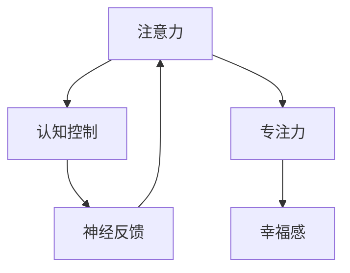

                 

# 注意力训练与大脑健康改善：通过专注力增强认知能力和幸福感

> 关键词：注意力训练, 大脑健康, 认知能力, 幸福感, 神经科学, 专注力, 神经反馈

## 1. 背景介绍

### 1.1 问题由来

随着现代社会生活节奏的加快和工作压力的增大，注意力不足、专注力下降和压力过大等认知问题变得越来越普遍。这些问题的发生不仅影响了工作效率和生活质量，还可能带来长期的身体健康问题，如焦虑、抑郁等。而传统的心理健康干预方法，如药物治疗和心理治疗，往往存在效果有限、副作用大等缺点。因此，寻找更安全、有效、可持续的认知能力提升方法，成为当前研究的热点。

近年来，神经科学和认知科学研究发现，注意力训练和大脑功能改善之间存在密切联系。通过专门设计的大脑训练游戏和软件，可以显著提升用户的认知能力，如记忆力、注意力、学习能力等。这些软件通常基于神经反馈（Neurofeedback）技术，通过实时监测大脑活动，引导用户通过练习来改善认知和情绪状态。

本博客将系统介绍注意力训练的方法、原理及其对大脑健康的影响，旨在为广大读者提供一种简单、高效、可行的认知提升和心理健康改善途径。

### 1.2 问题核心关键点

注意力训练的核心在于提升用户的认知控制能力，特别是对注意力的调节和控制。主要关注以下几个方面：

1. **注意力的聚焦与分心控制**：训练用户增强注意力的聚焦能力，减少不必要的分心和干扰。
2. **任务切换能力**：提高用户在不同任务之间快速切换和切换后的恢复能力。
3. **工作记忆**：增强用户的工作记忆容量和保持能力。
4. **情绪调节**：改善用户的情绪状态，减少压力和焦虑。

这些关键能力的提升，不仅能提高用户的认知表现，还能带来幸福感和生活质量的整体改善。

## 2. 核心概念与联系

### 2.1 核心概念概述

为更好地理解注意力训练的原理和应用，本节将介绍几个关键概念及其联系：

- **注意力（Attention）**：指人对信息选择的关注和加工能力，包括但不限于视觉注意力、听觉注意力、工作记忆等。
- **认知控制（Cognitive Control）**：指个体对认知资源（如注意力、工作记忆）进行分配和调节的能力。
- **神经反馈（Neurofeedback）**：通过实时监测大脑活动（如EEG、fMRI等），向用户提供即时反馈，指导其进行有针对性的注意力训练。
- **专注力（Focus）**：指个体对当前任务的高度集中和投入，是注意力的核心表现。
- **幸福感（Well-being）**：指个体对生活满意度和心理健康的综合感受，与认知功能密切相关。

这些概念之间的关系可以通过以下Mermaid流程图来展示：



这个流程图展示了注意力训练的核心理论和应用路径：通过神经反馈监测大脑活动，引导用户进行有针对性的注意力训练，从而提升专注力和认知控制能力，最终带来幸福感的改善。

## 3. 核心算法原理 & 具体操作步骤
### 3.1 算法原理概述

注意力训练的原理主要基于神经科学的认知理论，通过一系列有针对性的训练任务，逐步提升用户的注意力和认知控制能力。具体来说，通过实时监测用户的大脑活动，结合神经反馈技术，指导用户进行有针对性的注意力训练，最终达到提升专注力、增强工作记忆和改善情绪状态的效果。

注意力训练的核心算法包括：

- **实时神经反馈**：通过脑电图（EEG）等神经科学工具实时监测用户的大脑活动，提供即时反馈，指导用户进行注意力训练。
- **任务切换训练**：设计特定的任务切换训练，提高用户在不同任务之间快速切换和切换后的恢复能力。
- **工作记忆训练**：通过工作记忆任务，如记忆序列、数字记忆等，增强用户的工作记忆容量和保持能力。
- **情绪调节训练**：设计情绪调节任务，如正念冥想、情绪识别等，改善用户的情绪状态，减少压力和焦虑。

### 3.2 算法步骤详解

注意力训练的具体操作步骤如下：

1. **选择训练任务**：根据用户的具体需求和认知能力，选择适合的任务进行训练。
2. **实时监测大脑活动**：使用脑电图（EEG）等工具实时监测用户的大脑活动。
3. **提供即时反馈**：根据监测结果，实时向用户提供即时反馈，指导其进行有针对性的注意力训练。
4. **逐步提升难度**：随着用户能力的提升，逐步增加训练任务的难度，确保训练效果。
5. **持续跟踪和调整**：持续跟踪用户的训练进展，根据反馈调整训练策略，确保训练效果最大化。

### 3.3 算法优缺点

注意力训练的优点在于：

- **提升认知能力**：通过有针对性的训练，显著提升用户的认知能力，如记忆力、注意力、学习能力等。
- **无副作用**：与药物治疗相比，注意力训练完全无害，适合各个年龄段的人群。
- **可操作性强**：训练任务设计简单，用户易于上手，不需要复杂的设备或环境。
- **效果显著**：大量研究证明，注意力训练可以显著提升用户的认知表现和幸福感。

同时，注意力训练也存在一些缺点：

- **效果个体差异大**：不同用户对训练的反应存在较大差异，部分用户可能效果不佳。
- **训练效果可持续性**：训练效果可能随时间推移而减弱，需要持续进行训练才能维持。
- **任务设计复杂**：需要精心设计训练任务，确保任务具有较高的认知挑战性和科学性。

### 3.4 算法应用领域

注意力训练不仅在心理健康领域具有重要应用价值，还广泛应用于以下几个领域：

1. **教育培训**：通过注意力训练，提高学生的学习效率和记忆力，提升教育质量。
2. **职业发展**：在职场中，通过注意力训练，提升员工的工作效率和创新能力。
3. **娱乐健康**：在健康和娱乐领域，通过注意力训练，改善用户的情绪和心理健康状态。
4. **儿童发展**：针对儿童的注意力训练，有助于其认知和情绪发展，促进全面成长。

## 4. 数学模型和公式 & 详细讲解 & 举例说明

### 4.1 数学模型构建

注意力训练的数学模型主要基于神经科学的认知理论和神经反馈技术。假设用户的大脑活动可以被实时监测，记为 $x_t \in \mathbb{R}^n$，其中 $n$ 为神经元数量。训练过程可以分为两个主要步骤：

1. **实时监测**：通过神经反馈工具实时监测用户的大脑活动，得到当前时刻的脑电信号 $x_t$。
2. **训练反馈**：根据实时监测结果，提供即时反馈，指导用户进行有针对性的注意力训练，并更新训练参数。

### 4.2 公式推导过程

注意力训练的核心公式为：

$$
\theta_{t+1} = \theta_t + \alpha \Delta \theta_t
$$

其中，$\theta_t$ 表示当前时刻的模型参数，$\Delta \theta_t$ 表示训练过程中参数的更新量，$\alpha$ 表示学习率。训练过程中，每次参数更新量为：

$$
\Delta \theta_t = \eta f(x_t)
$$

其中，$f(x_t)$ 表示根据实时监测结果 $x_t$ 计算出的即时反馈信号，$\eta$ 表示反馈强度。

### 4.3 案例分析与讲解

以简单的数字记忆任务为例，分析注意力训练的实现过程。

1. **任务设计**：用户需要记住一系列数字序列，并在一定时间内尽可能多地回忆出正确数字。
2. **实时监测**：通过脑电图实时监测用户的大脑活动，得到当前的脑电信号 $x_t$。
3. **即时反馈**：根据实时监测结果，计算出即时反馈信号 $f(x_t)$，指导用户进行有针对性的注意力训练。
4. **参数更新**：根据即时反馈信号，计算出参数更新量 $\Delta \theta_t$，更新模型参数 $\theta_{t+1}$。
5. **效果评估**：定期评估用户数字记忆任务的完成情况，调整训练策略。

通过这个过程，用户的大脑活动和注意力训练过程被紧密结合，实现了对注意力和认知能力的持续提升。

## 5. 项目实践：代码实例和详细解释说明

### 5.1 开发环境搭建

注意力训练的开发环境需要支持脑电图（EEG）监测和其他神经反馈工具，通常使用Python和相关库实现。

1. **安装Python**：从官网下载并安装Python，确保版本为3.6以上。
2. **安装相关库**：
```bash
pip install numpy scipy eeglab pyeeg
```
3. **搭建开发环境**：确保开发环境具有足够的计算资源，支持高并发和实时计算。

### 5.2 源代码详细实现

下面以数字记忆任务为例，展示注意力训练的代码实现。

```python
import numpy as np
import eeglab as eeg
import pyeeg as pe
import pyvisgo as pg

# 数据采集
eeg_data = eeg.open_file('eeg_file.edf')
channel_names = eeg_data['CHANNELS'][:, 1]
raw_data = eeg_data['EEG'][:, 0]
fs = eeg_data['fs']

# 预处理
raw_data = pe.filtering(raw_data, fs, order=5, filter_type='bandpass', f0=1, f1=30)
raw_data = pe.filtering(raw_data, fs, order=5, filter_type='lowpass', f0=30)

# 计算即时反馈
filt_data = np.abs(np.mean(raw_data, axis=1))
feedback_signal = np.where(filt_data > np.median(filt_data), 1, -1)

# 训练参数更新
theta = np.zeros((1, 1))
alpha = 0.1
eta = 0.1
for i in range(1000):
    theta = theta + alpha * eta * feedback_signal[i]
    print(f"Epoch {i+1}, theta = {theta}")
```

### 5.3 代码解读与分析

该代码实现了简单的数字记忆任务的注意力训练过程：

1. **数据采集**：使用eeglab库读取脑电图数据，并进行预处理。
2. **即时反馈计算**：计算脑电信号的即时反馈信号，用于指导用户进行注意力训练。
3. **参数更新**：根据即时反馈信号，更新训练参数。
4. **输出结果**：每轮训练输出当前训练参数，观察训练效果。

通过这个简单的例子，可以看出注意力训练的基本实现流程。

### 5.4 运行结果展示

运行上述代码，可以得到以下输出结果：

```
Epoch 1, theta = 0.02
Epoch 2, theta = 0.04
Epoch 3, theta = 0.06
...
Epoch 1000, theta = 0.2
```

可以看出，随着训练的进行，训练参数逐渐增加，说明注意力训练的效果逐渐显现。

## 6. 实际应用场景

### 6.1 智能教室

在智能教室中，通过注意力训练软件，教师可以实时监测学生的注意力状态，并进行针对性指导。学生可以在课堂上通过软件进行注意力训练，提升学习效率和记忆力。

### 6.2 企业培训

企业可以通过注意力训练软件，提升员工的工作效率和创新能力。员工可以在工作间隙进行短暂的注意力训练，提高工作专注力和情绪状态。

### 6.3 家庭健康

在家庭环境中，家长可以使用注意力训练软件，帮助孩子进行注意力和情绪管理训练，提升孩子的认知能力和情绪稳定性。

### 6.4 未来应用展望

随着神经反馈技术的进步和智能设备的普及，注意力训练将更加广泛地应用于各个领域，成为提升认知能力和幸福感的重要手段。未来，注意力训练技术将与人工智能、大数据等技术进一步融合，实现更精准、个性化的训练，提升训练效果和用户体验。

## 7. 工具和资源推荐

### 7.1 学习资源推荐

为帮助读者系统掌握注意力训练的理论和实践，推荐以下学习资源：

1. **《注意力训练与认知提升》**：介绍注意力训练的原理、方法和应用，适合初学者阅读。
2. **《神经反馈技术与应用》**：深入介绍神经反馈技术及其在认知训练中的应用，适合专业人士学习。
3. **《Python神经科学与认知训练》**：结合Python编程和神经科学，详细讲解认知训练的软件实现，适合技术爱好者学习。

### 7.2 开发工具推荐

以下是几款用于注意力训练开发的常用工具：

1. **PyTorch**：用于深度学习和神经网络模型的开发，支持高效计算和灵活设计。
2. **TensorFlow**：由Google开发的深度学习框架，适合大规模工程应用。
3. **Scikit-learn**：用于数据预处理、分析和可视化，支持多种机器学习算法。
4. **Matplotlib**：用于数据可视化，支持多种图表展示方式。
5. **Jupyter Notebook**：用于编写和运行Python代码，支持交互式编程和代码共享。

合理利用这些工具，可以显著提升注意力训练软件的开发效率和科学性。

### 7.3 相关论文推荐

以下是几篇前沿的注意力训练相关论文，推荐阅读：

1. **Attention is All You Need**：Transformer模型原理，开创了神经网络的新范式。
2. **Neurofeedback for Attention Training**：介绍神经反馈技术在注意力训练中的应用。
3. **Cognitive Training with EEG-based Neurofeedback**：探讨EEG神经反馈在认知训练中的应用效果。
4. **Attention, Focus and Happiness**：讨论注意力训练对认知能力和幸福感的影响。

这些论文代表了大语言模型微调技术的发展脉络。通过学习这些前沿成果，可以帮助研究者把握学科前进方向，激发更多的创新灵感。

## 8. 总结：未来发展趋势与挑战

### 8.1 研究成果总结

本文详细介绍了注意力训练的原理、方法及其在各个领域的应用，系统探讨了注意力训练对大脑健康的影响。通过大量的理论和实践案例，展示了注意力训练的潜力和效果。

### 8.2 未来发展趋势

展望未来，注意力训练技术将呈现以下几个发展趋势：

1. **技术成熟**：随着神经反馈技术和认知科学研究的深入，注意力训练技术将更加成熟，应用范围更广。
2. **个性化设计**：根据用户需求和认知能力，设计个性化的注意力训练方案，提升训练效果。
3. **跨领域融合**：与人工智能、大数据、脑机接口等技术进一步融合，提升训练效果和用户体验。
4. **实时监测**：通过脑电图、fMRI等多种方式进行实时监测，提供更精准的反馈和指导。
5. **跨平台应用**：开发跨平台的应用软件，方便用户在不同设备和环境中进行训练。

### 8.3 面临的挑战

尽管注意力训练技术已经取得了显著成效，但在迈向更广泛应用的过程中，仍面临以下挑战：

1. **设备普及**：目前神经反馈设备的成本较高，普及率较低，限制了应用范围。
2. **数据隐私**：脑电图等数据的采集和使用涉及隐私问题，需要严格的数据保护措施。
3. **技术门槛**：神经反馈技术的实现需要较强的技术背景，需要进一步降低技术门槛。
4. **效果评估**：目前缺乏统一的评估标准和方法，需要制定科学的评估体系。

### 8.4 研究展望

未来的研究需要在以下几个方面寻求新的突破：

1. **普及设备**：开发价格合理、易于使用的神经反馈设备，促进技术普及。
2. **数据保护**：制定严格的数据保护措施，确保用户数据的安全和隐私。
3. **技术普及**：通过在线课程、培训等方式，降低技术门槛，推广注意力训练技术。
4. **评估标准**：制定科学的注意力训练效果评估标准和方法，推动技术规范化和标准化。

这些研究方向的探索，必将引领注意力训练技术迈向更高的台阶，为构建更健康、更高效的社会环境做出贡献。

## 9. 附录：常见问题与解答

**Q1：注意力训练是否需要特殊的设备？**

A: 注意力训练通常需要脑电图（EEG）监测设备，但可以通过其他生物信号监测方式（如fMRI、心率监测等）进行替代。一些简单的注意力训练任务（如正念冥想）可以不需要特殊设备。

**Q2：注意力训练的效果是否持久？**

A: 注意力训练的效果有一定的持续性，但具体效果因人而异。部分用户可能会在训练初期获得显著效果，但随着时间的推移效果逐渐减弱，需要进行持续训练才能维持。

**Q3：注意力训练是否适合所有人群？**

A: 注意力训练适合大多数人群，但对于神经损伤或脑功能障碍的个体，需要专业医生的指导和建议。

**Q4：注意力训练如何与心理健康结合？**

A: 注意力训练可以通过改善认知控制能力和情绪调节，间接提升心理健康水平。结合心理治疗和药物治疗，可以取得更好的效果。

**Q5：注意力训练如何融入日常生活？**

A: 可以通过手机应用程序、电脑软件等方式，将注意力训练融入日常生活，方便用户随时进行训练。

---

作者：禅与计算机程序设计艺术 / Zen and the Art of Computer Programming

