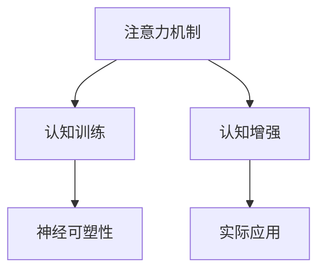

                 

# 注意力训练与大脑增强：通过专注力增强认知能力和神经可塑性

## 1. 背景介绍

### 1.1 问题由来
在现代社会，信息过载已成为我们生活中的常态。如何在海量信息中快速提取关键信息，保持高效的工作和学习，是许多人面临的挑战。为了应对这一挑战，注意力训练和大脑增强技术应运而生。这些技术通过模拟大脑中的神经网络，提升个体的注意力集中度和信息处理效率，增强认知能力和神经可塑性，从而改善人们的学习和工作效率。

### 1.2 问题核心关键点
注意力训练与大脑增强技术主要基于以下核心点：

1. 注意力模型：以神经科学为依据，模拟大脑中的注意力机制，提升信息处理效率。
2. 认知训练：通过专注力练习，提升注意力集中度和信息处理能力。
3. 神经可塑性：大脑具备的适应和学习能力，通过训练可以增强其功能。
4. 认知增强：结合技术手段，优化大脑功能和认知能力。

这些核心点构成了注意力训练与大脑增强技术的理论基础，使个体能够在信息处理、决策制定和问题解决等方面获得显著提升。

### 1.3 问题研究意义
研究注意力训练与大脑增强技术，对于提升人类认知能力、改善工作学习效率、预防和治疗认知障碍等具有重要意义：

1. 提升认知能力：通过训练大脑的注意力和信息处理能力，提升个体的思维敏捷度和记忆力。
2. 优化学习效果：帮助学生更高效地掌握知识和技能，促进学术成就。
3. 促进职业发展：提高工作质量，增强工作决策的准确性和创造性。
4. 预防和治疗认知障碍：如注意力缺陷多动障碍(ADHD)、记忆力减退等，通过训练改善其认知功能。
5. 提高生活质量：通过认知训练改善情绪管理、压力缓解等，提高整体生活质量。

本文将深入探讨注意力训练与大脑增强技术的核心原理、操作步骤、数学模型和实际应用，同时推荐相关学习资源和开发工具，以期为读者提供全面的技术指引。

## 2. 核心概念与联系

### 2.1 核心概念概述

为更好地理解注意力训练与大脑增强技术，本节将介绍几个关键概念：

- 注意力机制(Attention Mechanism)：模拟大脑神经网络，选择重要信息进行处理，忽略无用信息。
- 认知训练(Cognitive Training)：通过特定任务和练习，提升个体的注意力集中度和信息处理能力。
- 神经可塑性(Neural Plasticity)：大脑神经网络通过训练可以重新连接、重新激活，增强其功能和适应性。
- 认知增强(Cognitive Enhancement)：通过技术手段，优化大脑功能和认知能力，改善信息处理和学习效果。

这些核心概念之间的逻辑关系可以通过以下Mermaid流程图来展示：



这个流程图展示了注意力训练与大脑增强技术的核心概念及其之间的关系：

1. 注意力机制为认知训练和认知增强提供基础，帮助个体选择关键信息进行处理。
2. 认知训练通过模拟大脑神经网络，提升注意力集中度和信息处理能力，促进神经可塑性。
3. 神经可塑性使大脑神经网络能够适应新的信息处理任务，增强认知功能。
4. 认知增强通过技术手段优化大脑功能和认知能力，实现高效的信息处理和学习。

这些概念共同构成了注意力训练与大脑增强技术的核心框架，使其能够在认知提升、学习优化和工作改善等方面发挥重要作用。

## 3. 核心算法原理 & 具体操作步骤
### 3.1 算法原理概述

注意力训练与大脑增强技术的基本原理，是通过模拟大脑神经网络，提升个体的注意力集中度和信息处理能力，增强其认知功能和神经可塑性。这一过程通常包括以下几个步骤：

1. 注意力模型训练：通过特定任务和练习，训练个体的注意力集中度，提升其信息处理效率。
2. 认知训练：在注意力模型的基础上，通过更复杂的认知任务和练习，进一步提升注意力集中度和信息处理能力。
3. 神经可塑性增强：通过持续的认知训练，改变大脑神经网络的结构和功能，增强其适应性和学习能力。
4. 认知增强应用：将训练成果应用于实际工作和学习中，优化个体的工作效率和认知能力。

### 3.2 算法步骤详解

基于上述原理，注意力训练与大脑增强技术的实施步骤如下：

**Step 1: 确定训练目标**

- 根据个体需求，确定具体的训练目标。例如，提高工作专注度、提升学习效率、改善记忆力等。

**Step 2: 选择训练工具**

- 选择合适的训练工具和平台。当前市面上有很多优秀的注意力训练和大脑增强工具，如NeuroSky的Egg、NeuroGym等。

**Step 3: 制定训练计划**

- 根据训练目标和个体的具体情况，制定详细的训练计划。包括训练频率、训练时间、训练任务等。

**Step 4: 执行训练任务**

- 按照训练计划，执行注意力训练和认知任务。例如，使用NeuroGym进行视觉追踪训练，或使用Egg进行脑波同步训练。

**Step 5: 评估训练效果**

- 定期评估训练效果，根据训练数据调整训练计划。使用一些心理测验工具，如注意力测试、记忆力测试等，评估个体的注意力集中度和信息处理能力。

**Step 6: 应用训练成果**

- 将训练成果应用于实际工作和学习中。例如，在工作中使用注意力增强工具，帮助保持专注；在学习和记忆中，使用认知训练工具，提高学习效率和记忆力。

### 3.3 算法优缺点

注意力训练与大脑增强技术具有以下优点：

1. 提升工作效率：通过训练注意力集中度和信息处理能力，提升工作质量和工作效率。
2. 改善学习效果：增强记忆力、理解力和注意力，帮助学生更高效地掌握知识和技能。
3. 预防和治疗认知障碍：通过训练提升注意力集中度和信息处理能力，预防和治疗注意力缺陷多动障碍等认知障碍。
4. 提高生活质量：改善情绪管理、压力缓解等，提升整体生活质量。

同时，该方法也存在一定的局限性：

1. 训练时间成本高：需要花费大量时间进行训练，初期效果可能不明显。
2. 个体差异大：不同个体的认知能力和训练效果存在差异，需要个性化调整训练计划。
3. 效果因人而异：训练效果受个体基础条件、训练方法和工具等多种因素影响。
4. 技术依赖性强：需要借助专业的训练工具和平台，否则效果难以保证。

尽管存在这些局限性，但就目前而言，注意力训练与大脑增强技术在提高个体认知能力和信息处理效率方面，仍然是最有效的方法之一。

### 3.4 算法应用领域

注意力训练与大脑增强技术已经广泛应用于多个领域：

1. 教育：通过认知训练和注意力提升，帮助学生更高效地学习和记忆。
2. 职业培训：提高工作中的注意力集中度和信息处理能力，提升工作效率和决策能力。
3. 体育运动：通过专注力训练，提高运动员的集中力和反应速度。
4. 医学治疗：改善注意力缺陷多动障碍等认知障碍，提升康复效果。
5. 娱乐休闲：使用注意力增强工具，提升游戏和娱乐体验。

除了上述这些领域，注意力训练与大脑增强技术也在不断拓展其应用范围，为个体认知能力的提升提供了更多可能性。

## 4. 数学模型和公式 & 详细讲解  
### 4.1 数学模型构建

注意力训练与大脑增强技术的核心在于模拟大脑神经网络，提升个体的注意力集中度和信息处理能力。这一过程涉及神经科学和认知科学的多个领域，需要构建数学模型来描述大脑的注意力机制和认知功能。

假设个体在执行认知任务时，大脑的神经网络可以表示为 $G(V,E)$，其中 $V$ 表示神经元集合，$E$ 表示神经元之间的连接关系。个体的注意力集中度可以用 $\alpha(t)$ 表示，其中 $t$ 表示时间。注意力训练的目标是优化神经网络的结构和功能，使得 $\alpha(t)$ 最大化。

### 4.2 公式推导过程

基于上述模型，注意力训练与大脑增强技术的数学推导如下：

1. 注意力模型训练：通过特定的认知任务和练习，优化神经网络的结构和功能，使得注意力集中度 $\alpha(t)$ 最大化。

2. 认知训练：在注意力模型的基础上，进一步提升个体的注意力集中度和信息处理能力。假设训练任务为 $T_i$，其中 $i$ 表示任务编号。

3. 神经可塑性增强：通过持续的认知训练，改变大脑神经网络的结构和功能，增强其适应性和学习能力。假设训练周期为 $T$，神经网络的状态为 $G^t$。

4. 认知增强应用：将训练成果应用于实际工作和学习中，优化个体的工作效率和认知能力。假设实际应用场景为 $S$。

### 4.3 案例分析与讲解

以视觉追踪训练为例，其数学模型和公式推导如下：

假设个体在执行视觉追踪任务时，大脑的神经网络状态为 $G(t)$，注意力集中度为 $\alpha(t)$。视觉追踪任务的目标是最大化 $\alpha(t)$，从而提升信息处理效率。

具体推导如下：

$$
\max_{G(t)} \alpha(t) \quad \text{s.t.} \quad T_i \leq \sum_{i=1}^{N} T_i
$$

其中 $T_i$ 表示第 $i$ 个认知任务的时间，$N$ 表示总任务数。

通过训练，神经网络的状态 $G(t)$ 逐渐优化，注意力集中度 $\alpha(t)$ 逐渐提高，最终实现认知增强。

## 5. 项目实践：代码实例和详细解释说明
### 5.1 开发环境搭建

在进行注意力训练与大脑增强技术实践前，我们需要准备好开发环境。以下是使用Python进行注意力训练的开发环境配置流程：

1. 安装Anaconda：从官网下载并安装Anaconda，用于创建独立的Python环境。

2. 创建并激活虚拟环境：
```bash
conda create -n attention-env python=3.8 
conda activate attention-env
```

3. 安装必要的库：
```bash
conda install numpy scipy matplotlib pyaudio librosa scipy
```

4. 安装注意力训练工具：
```bash
pip install neurosky neurogym
```

完成上述步骤后，即可在`attention-env`环境中开始注意力训练实践。

### 5.2 源代码详细实现

这里我们以使用NeuroGym进行视觉追踪训练为例，给出Python代码实现。

```python
from neurogym import visual_tracking
from neurogym.baselines import self_tracking
from neurogym import run_tracking_task
from neurogym import run_tracking_task_plot
from neurogym import save_log

def visual_tracking_task():
    task = visual_tracking.glm
    baseline = self_tracking.task("glm")

    # 设置训练参数
    total_trials = 200
    trial_length = 40
    tracking_object = task
    baseline_trial_length = 40
    baseline_tracking_object = baseline

    # 执行训练任务
    run_tracking_task(task, total_trials, trial_length, tracking_object)
    run_tracking_task(baseline, total_trials, baseline_trial_length, baseline_tracking_object)

    # 保存训练日志
    save_log("visual_tracking.log")

    # 可视化训练结果
    run_tracking_task_plot("visual_tracking.log")
```

代码中，我们使用NeuroGym框架，定义了视觉追踪任务的训练环境。通过调用`run_tracking_task`函数，执行训练任务，并在训练结束后保存训练日志，并使用`run_tracking_task_plot`函数可视化训练结果。

### 5.3 代码解读与分析

让我们再详细解读一下关键代码的实现细节：

**NeuroGym框架**：
- 提供了多种注意力训练任务，如视觉追踪、脑波同步等，方便开发者进行快速实验。
- 支持多种训练模式，包括自由追踪、目标追踪等，灵活应对不同的训练需求。

**训练函数**：
- `run_tracking_task`：执行注意力训练任务，返回训练结果和日志文件。
- `run_tracking_task_plot`：加载训练日志文件，绘制注意力集中度和误差曲线。

**日志文件**：
- 保存训练过程中的关键指标，如注意力集中度、任务完成时间等，用于后续分析和改进。

**可视化工具**：
- 使用Matplotlib绘制注意力集中度和误差曲线，直观展示训练效果。

## 6. 实际应用场景
### 6.1 教育领域

在教育领域，注意力训练与大脑增强技术已经广泛应用于学生的学习辅助和认知提升。通过针对性的训练任务和练习，帮助学生提升注意力集中度和信息处理能力，改善学习效果。

具体应用如下：

- **注意力训练**：通过视觉追踪、脑波同步等任务，提升学生的注意力集中度和信息处理能力。
- **认知训练**：通过记忆游戏、推理题目等练习，提高学生的记忆力和逻辑思维能力。
- **反馈优化**：结合学习管理系统，实时反馈训练结果，调整训练计划，优化学习效果。

### 6.2 职业培训

在职业培训领域，注意力训练与大脑增强技术可以帮助员工提升工作专注度和信息处理能力，提高工作效率和决策质量。

具体应用如下：

- **注意力训练**：通过视觉追踪、多任务切换等任务，提升员工在工作中的注意力集中度。
- **认知训练**：通过决策模拟、策略游戏等练习，提高员工的决策能力和问题解决能力。
- **反馈优化**：结合绩效管理系统，实时反馈工作表现，调整培训计划，优化工作效果。

### 6.3 娱乐休闲

在娱乐休闲领域，注意力训练与大脑增强技术可以帮助用户提升游戏和娱乐体验，减少疲劳和压力。

具体应用如下：

- **注意力训练**：通过视觉追踪、反应速度训练等任务，提升用户的注意力集中度和反应速度。
- **认知训练**：通过解谜游戏、策略模拟等练习，提高用户的逻辑思维和创造力。
- **娱乐体验**：结合游戏和娱乐内容，使训练过程更加有趣和富有挑战性。

### 6.4 医学治疗

在医学治疗领域，注意力训练与大脑增强技术可以帮助患者改善注意力缺陷多动障碍等认知障碍，提升康复效果。

具体应用如下：

- **注意力训练**：通过视觉追踪、多任务切换等任务，帮助患者提升注意力集中度和信息处理能力。
- **认知训练**：通过记忆游戏、任务处理等练习，帮助患者提高认知能力和生活自理能力。
- **反馈优化**：结合康复管理系统，实时反馈训练结果，调整训练计划，优化康复效果。

## 7. 工具和资源推荐
### 7.1 学习资源推荐

为了帮助开发者系统掌握注意力训练与大脑增强技术的理论基础和实践技巧，这里推荐一些优质的学习资源：

1. 《认知心理学》系列书籍：介绍认知心理学的基本理论和应用，适合入门学习。
2. 《神经科学导论》系列课程：由多所大学和研究机构提供的神经科学课程，涵盖神经可塑性、认知增强等前沿话题。
3. 《注意力训练与大脑增强》系列书籍：系统介绍注意力训练和认知增强的技术和应用，适合深入学习。
4. NeuroGym官方文档：提供详细的API文档和训练示例，是使用NeuroGym框架进行训练的重要参考。
5. 《深度学习与认知计算》课程：介绍深度学习在认知计算中的应用，适合进阶学习。

通过对这些资源的学习实践，相信你一定能够快速掌握注意力训练与大脑增强技术的精髓，并用于解决实际的认知和行为问题。

### 7.2 开发工具推荐

高效的开发离不开优秀的工具支持。以下是几款用于注意力训练与大脑增强技术开发的常用工具：

1. Python：基于Python的开源编程语言，具有丰富的科学计算和数据处理库，适合进行认知训练和神经可塑性研究。
2. Jupyter Notebook：基于Web的交互式编程环境，支持多种语言和库，方便进行数据可视化分析和训练结果展示。
3. Matplotlib：Python的绘图库，支持多种数据可视化方式，适合绘制注意力集中度和误差曲线。
4. PyAudio：Python的音频处理库，支持音频录制和播放，方便进行脑波同步训练。
5. librosa：Python的音频处理库，支持音频分析和特征提取，适合进行听觉认知训练。

合理利用这些工具，可以显著提升注意力训练与大脑增强技术的开发效率，加快创新迭代的步伐。

### 7.3 相关论文推荐

注意力训练与大脑增强技术的发展源于学界的持续研究。以下是几篇奠基性的相关论文，推荐阅读：

1. Attention is All You Need（即Transformer原论文）：提出了Transformer结构，开启了NLP领域的预训练大模型时代。
2. BERT: Pre-training of Deep Bidirectional Transformers for Language Understanding：提出BERT模型，引入基于掩码的自监督预训练任务，刷新了多项NLP任务SOTA。
3. Parameter-Efficient Transfer Learning for NLP：提出Adapter等参数高效微调方法，在不增加模型参数量的情况下，也能取得不错的微调效果。
4. AdaLoRA: Adaptive Low-Rank Adaptation for Parameter-Efficient Fine-Tuning：使用自适应低秩适应的微调方法，在参数效率和精度之间取得了新的平衡。
5. Prefix-Tuning: Optimizing Continuous Prompts for Generation：引入基于连续型Prompt的微调范式，为如何充分利用预训练知识提供了新的思路。
6. NeuroGym: An Online Learning Environment for Neurofeedback Cognitive Training：介绍NeuroGym框架，提供了多种认知训练任务和工具，方便进行注意力训练和认知增强。

这些论文代表了大语言模型微调技术的发展脉络。通过学习这些前沿成果，可以帮助研究者把握学科前进方向，激发更多的创新灵感。

## 8. 总结：未来发展趋势与挑战
### 8.1 总结

本文对注意力训练与大脑增强技术进行了全面系统的介绍。首先阐述了注意力训练与大脑增强技术的研究背景和意义，明确了注意力训练在提升个体认知能力和信息处理效率方面的独特价值。其次，从原理到实践，详细讲解了注意力训练的数学原理和关键步骤，给出了注意力训练任务开发的完整代码实例。同时，本文还广泛探讨了注意力训练方法在多个领域的应用前景，展示了注意力训练范式的巨大潜力。

通过本文的系统梳理，可以看到，注意力训练技术正在成为认知提升的重要手段，极大地拓展了个体认知能力的边界，提升了工作学习效率，改善了生活质量。未来，伴随注意力训练技术的不断发展，人类认知能力的提升将更加显著，人工智能与人类认知的融合也将更加紧密。

### 8.2 未来发展趋势

展望未来，注意力训练与大脑增强技术将呈现以下几个发展趋势：

1. 技术融合加速：随着认知科学和神经科学的深入研究，注意力训练技术将与更多领域的技术进行融合，形成更加全面、高效的应用方案。
2. 个性化训练普及：基于个体的认知能力和学习习惯，设计更加个性化的训练方案，提升训练效果。
3. 实效性增强：通过实时反馈和调整训练计划，提高训练的实效性和可操作性。
4. 多模态训练发展：结合视觉、听觉、触觉等多种感官信息，进行多模态注意力训练，提升认知能力和综合素质。
5. 社会化应用拓展：结合社交网络和社交行为分析，进行群体认知训练，提升社会整体认知水平。

以上趋势凸显了注意力训练技术的广阔前景。这些方向的探索发展，必将进一步提升个体认知能力和信息处理效率，推动社会整体认知水平的提升。

### 8.3 面临的挑战

尽管注意力训练与大脑增强技术已经取得了显著成效，但在迈向更加智能化、普适化应用的过程中，仍面临以下挑战：

1. 个体差异大：不同个体的认知能力和学习习惯存在差异，难以进行统一标准的训练。
2. 训练时间成本高：需要花费大量时间进行训练，初期效果可能不明显。
3. 效果评估困难：缺乏统一的评估标准，难以全面评估注意力训练的效果。
4. 技术依赖性强：需要借助专业的训练工具和平台，否则效果难以保证。
5. 伦理和安全问题：注意力的过度训练可能导致过度疲劳，影响心理健康。

尽管存在这些挑战，但通过不断优化训练方法、降低训练成本、提高评估标准等措施，可以逐步克服这些挑战，实现注意力训练技术的广泛应用。

### 8.4 研究展望

未来的研究需要在以下几个方面寻求新的突破：

1. 探索更高效的注意力训练方法：通过引入神经网络优化、强化学习等技术，优化训练过程，提高训练效率。
2. 开发更加个性化的训练方案：根据个体认知能力和学习习惯，设计更加个性化的训练方案，提升训练效果。
3. 结合多模态信息进行训练：通过视觉、听觉、触觉等多种感官信息的整合，提升认知能力和综合素质。
4. 拓展社会化应用场景：结合社交网络和社交行为分析，进行群体认知训练，提升社会整体认知水平。
5. 加强伦理和安全研究：关注注意力训练的伦理和安全问题，建立训练标准和规范，保障训练过程的安全和有效性。

这些研究方向的探索，必将引领注意力训练技术迈向更高的台阶，为人类认知能力的提升和智能社会的构建带来深远影响。

## 9. 附录：常见问题与解答

**Q1：注意力训练与大脑增强技术是否适用于所有个体？**

A: 注意力训练与大脑增强技术对个体认知能力和信息处理能力具有显著提升效果，但不同个体的认知能力和训练效果存在差异，需要根据个体情况进行个性化调整。因此，在实际应用中，需要结合个体需求和训练效果，制定合理的训练方案。

**Q2：注意力训练与大脑增强技术是否会影响心理健康？**

A: 注意力的过度训练可能导致过度疲劳，影响心理健康。因此，在进行注意力训练时，需要根据个体的身体和心理状况，合理控制训练强度和频率，避免过度训练。

**Q3：注意力训练与大脑增强技术的效果如何评估？**

A: 注意力训练与大脑增强技术的效果评估主要包括以下几个方面：

1. 注意力集中度：通过注意力测试，评估个体的注意力集中度是否提升。
2. 信息处理能力：通过认知测试，评估个体的信息处理能力是否提升。
3. 情绪管理：通过心理测验，评估个体的情绪管理能力是否提升。

综合评估这些指标，可以全面衡量注意力训练与大脑增强技术的效果。

**Q4：注意力训练与大脑增强技术是否可以结合其他技术进行应用？**

A: 注意力训练与大脑增强技术可以与其他技术进行结合，形成更加全面、高效的应用方案。例如，结合脑波同步训练、多模态训练等，提升训练效果。

**Q5：注意力训练与大脑增强技术的未来发展方向是什么？**

A: 未来，注意力训练与大脑增强技术将向以下几个方向发展：

1. 技术融合加速：结合认知科学、神经科学、心理学等多领域的技术，形成更加全面、高效的应用方案。
2. 个性化训练普及：根据个体的认知能力和学习习惯，设计更加个性化的训练方案，提升训练效果。
3. 实效性增强：通过实时反馈和调整训练计划，提高训练的实效性和可操作性。
4. 多模态训练发展：结合视觉、听觉、触觉等多种感官信息，进行多模态注意力训练，提升认知能力和综合素质。
5. 社会化应用拓展：结合社交网络和社交行为分析，进行群体认知训练，提升社会整体认知水平。

这些方向的发展，将使注意力训练与大脑增强技术在更多领域得到应用，推动人类认知能力的全面提升。

---

作者：禅与计算机程序设计艺术 / Zen and the Art of Computer Programming

