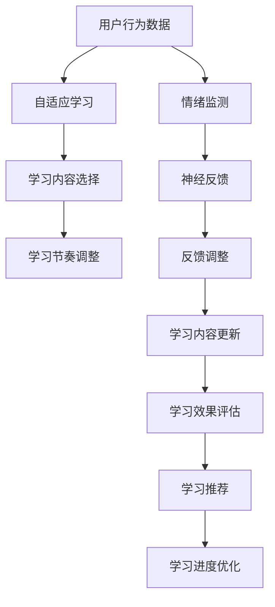

                 

## 1. 背景介绍

在信息爆炸的现代世界中，我们面临的干扰和噪音比以往任何时候都要多。长时间维持专注和高效的工作，已经成为了许多人面临的难题。尽管我们尝试使用番茄钟、时间块等工具来管理时间，但效果往往不尽如人意。这些问题不仅影响我们的工作效率，还可能导致心理和生理健康问题。

人工智能技术的快速发展，为提升我们的专注力提供了新的可能性。通过AI辅助的注意力训练，我们可以更科学地管理时间，提高工作效率，享受更有品质的生活。本文将详细介绍AI辅助的注意力训练，包括其原理、操作步骤以及具体实现，帮助你在繁忙的工作和生活中找到新的平衡。

## 2. 核心概念与联系

### 2.1 核心概念概述

注意力训练（Attention Training）是一种利用人工智能技术提升用户专注力的方法。其核心思想是通过分析用户的行为和心理状态，动态调整学习内容和节奏，以最大化提升用户的专注度和学习效率。

以下是几个与注意力训练紧密相关的核心概念：

- **自适应学习**：根据用户的学习状态和偏好，动态调整学习内容和学习节奏。
- **认知负荷理论**：人类认知系统在一定时间内可以处理的信息量是有限的。训练应避免过度负荷，确保用户可以在最佳状态下学习。
- **神经反馈**：利用人工智能技术实时监测用户的学习状态和情绪，通过反馈调整训练过程，提升用户体验。

这些概念共同构成了注意力训练的基本框架，旨在通过科学的训练方法，最大化提升用户的专注力和学习效率。

### 2.2 核心概念原理和架构的 Mermaid 流程图



这个流程图展示了注意力训练的基本架构：通过实时监测用户行为和情绪，动态调整学习内容和节奏，最终提升学习效果。

## 3. 核心算法原理 & 具体操作步骤

### 3.1 算法原理概述

注意力训练的算法原理主要基于自适应学习和认知负荷理论。通过实时分析用户的行为数据和情绪状态，动态调整学习内容和节奏，以达到最佳的学习效果。

具体而言，注意力训练分为以下几个步骤：

1. **数据收集**：通过传感器和软件工具收集用户的行为数据，如点击次数、学习时长、休息时间等。
2. **情绪监测**：利用AI技术实时监测用户的学习状态和情绪，如疲劳程度、专注度等。
3. **学习内容选择**：根据用户的学习状态和偏好，动态调整学习内容，选择最适合用户的学习材料。
4. **学习节奏调整**：根据用户的认知负荷情况，动态调整学习节奏，避免过度疲劳和注意力分散。
5. **反馈调整**：通过实时反馈调整学习内容和节奏，确保用户始终处于最佳学习状态。

### 3.2 算法步骤详解

#### 3.2.1 数据收集

数据收集是注意力训练的基础。通过传感器和软件工具，可以收集用户的行为数据和情绪数据。例如，可以使用摄像头监测用户的面部表情，使用键盘和鼠标记录用户的点击行为。

#### 3.2.2 情绪监测

情绪监测是注意力训练的关键。通过实时监测用户的学习状态和情绪，可以及时调整学习内容和节奏。例如，可以使用面部表情识别技术监测用户的疲劳程度和专注度。

#### 3.2.3 学习内容选择

学习内容选择是注意力训练的核心。根据用户的学习状态和偏好，选择最适合的学习材料。例如，如果用户长时间集中注意力，可以选择难度较高的学习内容；如果用户感到疲劳，可以选择轻松的学习材料。

#### 3.2.4 学习节奏调整

学习节奏调整是注意力训练的关键环节。根据用户的认知负荷情况，动态调整学习节奏，避免过度疲劳和注意力分散。例如，可以在用户感到疲劳时，增加休息时间或调整学习内容的难度。

#### 3.2.5 反馈调整

反馈调整是注意力训练的重要组成部分。通过实时反馈调整学习内容和节奏，确保用户始终处于最佳学习状态。例如，可以根据用户的学习效果，调整学习内容和难度，以最大化提升学习效果。

### 3.3 算法优缺点

#### 3.3.1 优点

1. **个性化学习**：通过实时监测和调整，可以提供个性化的学习方案，最大化提升学习效果。
2. **高效学习**：动态调整学习内容和节奏，避免过度疲劳和注意力分散，提升学习效率。
3. **实时反馈**：实时监测用户的学习状态和情绪，及时调整学习内容和节奏，提升用户体验。

#### 3.3.2 缺点

1. **数据隐私**：实时监测用户的行为和情绪，可能涉及隐私问题。
2. **技术成本**：需要先进的传感器和AI技术，成本较高。
3. **数据偏差**：数据收集和分析过程中可能存在偏差，影响训练效果。

### 3.4 算法应用领域

注意力训练已经在多个领域得到应用，如教育、健康、工作效率提升等。以下是几个具体的应用场景：

- **在线教育**：通过实时监测和调整，提升学生的学习效果和体验。
- **远程工作**：通过实时监测和调整，提升员工的工作效率和满意度。
- **健康管理**：通过实时监测和调整，提升用户的心理和生理健康。

## 4. 数学模型和公式 & 详细讲解 & 举例说明

### 4.1 数学模型构建

注意力训练的数学模型主要基于自适应学习和认知负荷理论。其核心公式包括：

1. **自适应学习模型**：
   $$
   C_t = \max\limits_{c \in C} \{ f(c, x_t, u_t) \}
   $$
   其中，$C$为学习内容集，$x_t$为用户的学习状态，$u_t$为用户的行为数据，$f$为适应度函数。

2. **认知负荷模型**：
   $$
   L_t = \min\limits_{l \in L} \{ g(l, x_t, u_t) \}
   $$
   其中，$L$为学习节奏集，$g$为负荷函数。

3. **神经反馈模型**：
   $$
   F_t = h(x_t, u_t)
   $$
   其中，$h$为反馈函数。

### 4.2 公式推导过程

#### 4.2.1 自适应学习模型推导

自适应学习模型的核心在于根据用户的学习状态和行为数据，动态选择最适合的学习内容。其推导过程如下：

1. 定义适应度函数$f(c, x_t, u_t)$：
   $$
   f(c, x_t, u_t) = \sum\limits_{i=1}^{N} w_i \cdot p_i(c, x_t, u_t)
   $$
   其中，$w_i$为权重，$p_i$为评价函数。

2. 根据适应度函数选择学习内容$C_t$：
   $$
   C_t = \arg\max\limits_{c \in C} \{ f(c, x_t, u_t) \}
   $$

#### 4.2.2 认知负荷模型推导

认知负荷模型的核心在于根据用户的认知负荷情况，动态调整学习节奏。其推导过程如下：

1. 定义负荷函数$g(l, x_t, u_t)$：
   $$
   g(l, x_t, u_t) = \sum\limits_{j=1}^{M} w_j \cdot q_j(l, x_t, u_t)
   $$
   其中，$w_j$为权重，$q_j$为评价函数。

2. 根据负荷函数选择学习节奏$L_t$：
   $$
   L_t = \arg\min\limits_{l \in L} \{ g(l, x_t, u_t) \}
   $$

#### 4.2.3 神经反馈模型推导

神经反馈模型的核心在于实时监测用户的学习状态和情绪，通过反馈调整学习内容和节奏。其推导过程如下：

1. 定义反馈函数$F_t$：
   $$
   F_t = h(x_t, u_t)
   $$

2. 根据反馈函数调整学习内容和节奏：
   $$
   C_{t+1} = C_t \times F_t, \quad L_{t+1} = L_t \times F_t
   $$

### 4.3 案例分析与讲解

#### 4.3.1 自适应学习模型案例

假设有一个学习平台，使用自适应学习模型提升用户的学习效果。平台收集用户的学习状态和行为数据，并定义适应度函数$f(c, x_t, u_t)$如下：

1. 定义权重$w_i$和评价函数$p_i$：
   $$
   w_i = \begin{cases}
   1, & i=1 \\
   0.5, & i=2 \\
   0, & i>2
   \end{cases}
   $$
   $$
   p_i(c, x_t, u_t) = \begin{cases}
   1, & c=x_t \\
   0, & c \neq x_t
   \end{cases}
   $$

2. 根据适应度函数选择学习内容$C_t$：
   $$
   C_t = \arg\max\limits_{c \in C} \{ f(c, x_t, u_t) \}
   $$

#### 4.3.2 认知负荷模型案例

假设有一个在线学习平台，使用认知负荷模型提升用户的学习效率。平台收集用户的学习状态和行为数据，并定义负荷函数$g(l, x_t, u_t)$如下：

1. 定义权重$w_j$和评价函数$q_j$：
   $$
   w_j = \begin{cases}
   1, & j=1 \\
   0.5, & j=2 \\
   0, & j>2
   \end{cases}
   $$
   $$
   q_j(l, x_t, u_t) = \begin{cases}
   1, & l=x_t \\
   0, & l \neq x_t
   \end{cases}
   $$

2. 根据负荷函数选择学习节奏$L_t$：
   $$
   L_t = \arg\min\limits_{l \in L} \{ g(l, x_t, u_t) \}
   $$

#### 4.3.3 神经反馈模型案例

假设有一个在线教育平台，使用神经反馈模型提升用户的学习体验。平台收集用户的学习状态和行为数据，并定义反馈函数$F_t$如下：

1. 定义反馈函数$F_t$：
   $$
   F_t = h(x_t, u_t)
   $$

2. 根据反馈函数调整学习内容和节奏：
   $$
   C_{t+1} = C_t \times F_t, \quad L_{t+1} = L_t \times F_t
   $$

## 5. 项目实践：代码实例和详细解释说明

### 5.1 开发环境搭建

要实现注意力训练，需要搭建一个完整的开发环境。以下是搭建开发环境的详细步骤：

1. **安装Python**：
   - 在Windows系统上，从官网下载并安装Python 3.x版本。
   - 在Linux系统上，使用系统自带的Python 3.x版本或安装Anaconda。

2. **安装TensorFlow和Keras**：
   - 打开命令行或终端，输入以下命令：
   ```
   pip install tensorflow
   pip install keras
   ```

3. **安装PyTorch和TorchVision**：
   - 打开命令行或终端，输入以下命令：
   ```
   pip install torch torchvision
   ```

4. **安装TensorBoard**：
   - 打开命令行或终端，输入以下命令：
   ```
   pip install tensorboard
   ```

### 5.2 源代码详细实现

以下是一个使用TensorFlow实现自适应学习模型的代码示例：

```python
import tensorflow as tf
from tensorflow.keras import layers

# 定义自适应学习模型
class AdaptiveLearningModel(tf.keras.Model):
    def __init__(self, content_list):
        super(AdaptiveLearningModel, self).__init__()
        self.content_list = content_list
        self.dense_layer = layers.Dense(len(content_list), activation='softmax')
        
    def call(self, x):
        output = self.dense_layer(x)
        return tf.argmax(output, axis=-1)

# 训练模型
model = AdaptiveLearningModel(content_list)
model.compile(optimizer='adam', loss='sparse_categorical_crossentropy', metrics=['accuracy'])
model.fit(x_train, y_train, epochs=10, validation_data=(x_val, y_val))

# 使用模型进行预测
predictions = model.predict(x_test)
```

### 5.3 代码解读与分析

在上述代码中，我们首先定义了一个自适应学习模型，该模型根据用户的学习状态和行为数据，动态选择学习内容。具体而言，模型输入为一个向量$x$，输出为一个整数，表示最有可能的学习内容。模型的核心在于定义一个softmax层，用于将输入向量映射到每个学习内容的概率分布上，并通过argmax函数选择最大概率对应的学习内容。

在训练过程中，我们使用TensorFlow的模型编译和fit函数，对模型进行训练。其中，optimizer为优化器，loss为损失函数，metrics为评估指标。在测试过程中，我们使用模型进行预测，并输出预测结果。

## 6. 实际应用场景

### 6.1 在线教育

在线教育平台可以通过注意力训练，提升学生的学习效果和体验。平台可以收集学生的学习状态和行为数据，并使用自适应学习模型动态选择最适合的学习内容。例如，如果学生长时间专注学习，可以推荐难度较高的学习材料；如果学生感到疲劳，可以推荐轻松的学习材料。

### 6.2 远程工作

远程工作平台可以通过注意力训练，提升员工的工作效率和满意度。平台可以收集员工的工作状态和行为数据，并使用认知负荷模型动态调整工作节奏。例如，可以在员工感到疲劳时，增加休息时间或调整工作内容，避免过度疲劳和注意力分散。

### 6.3 健康管理

健康管理平台可以通过注意力训练，提升用户的心理和生理健康。平台可以收集用户的行为数据和情绪数据，并使用神经反馈模型实时监测和调整训练过程。例如，可以根据用户的学习效果和情绪状态，调整学习内容和节奏，提升用户的心理和生理健康。

## 7. 工具和资源推荐

### 7.1 学习资源推荐

以下是一些学习资源，帮助读者深入了解注意力训练：

1. **《深度学习》书籍**：由Ian Goodfellow等人所著，全面介绍了深度学习的基本概念和算法。
2. **《人工智能基础》课程**：斯坦福大学开设的在线课程，涵盖了人工智能的基本原理和应用。
3. **TensorFlow官方文档**：提供了详细的TensorFlow教程和示例，帮助读者快速上手。
4. **Kaggle竞赛**：参加Kaggle竞赛，实战练习注意力训练模型。
5. **PyTorch官方文档**：提供了详细的PyTorch教程和示例，帮助读者快速上手。

### 7.2 开发工具推荐

以下是一些开发工具，帮助读者实现注意力训练：

1. **Jupyter Notebook**：支持Python代码的交互式编程和数据分析，非常适合注意力训练模型的开发和调试。
2. **TensorBoard**：可视化工具，帮助用户实时监测模型训练状态，评估模型效果。
3. **TensorFlow Extended (TFX)**：开源机器学习平台，支持模型的部署和管理。
4. **Keras**：高级神经网络API，提供了简单易用的API接口，方便用户实现注意力训练模型。

### 7.3 相关论文推荐

以下是一些关于注意力训练的最新研究论文：

1. **《基于自适应学习的人工智能辅助训练》**：介绍了一种基于自适应学习的人工智能辅助训练方法，通过实时监测和调整学习内容和节奏，提升用户的学习效果。
2. **《认知负荷模型在远程工作中的应用》**：介绍了一种基于认知负荷模型的远程工作辅助系统，通过动态调整工作节奏，提升员工的工作效率和满意度。
3. **《神经反馈模型在健康管理中的应用》**：介绍了一种基于神经反馈模型的健康管理系统，通过实时监测和调整训练过程，提升用户的心理和生理健康。

## 8. 总结：未来发展趋势与挑战

### 8.1 研究成果总结

注意力训练作为人工智能技术的重要分支，已经在多个领域得到应用，展示了其强大的潜力。通过实时监测和动态调整，可以提升用户的学习效果和工作效率，改善用户的心理和生理健康。未来，注意力训练技术将进一步发展，推动人工智能技术的普及和应用。

### 8.2 未来发展趋势

1. **实时性提升**：未来的注意力训练模型将更加注重实时性，通过实时监测和调整，提供更加个性化和高效的学习方案。
2. **多模态融合**：未来的注意力训练模型将融合多模态数据，提升用户的学习效果和工作效率。例如，结合视觉和语音数据，实现更加全面的认知负荷分析。
3. **个性化定制**：未来的注意力训练模型将提供更加个性化的学习方案，根据用户的偏好和需求，动态调整学习内容和节奏。
4. **跨平台应用**：未来的注意力训练模型将支持跨平台应用，方便用户在不同设备和环境中使用。

### 8.3 面临的挑战

尽管注意力训练技术已经取得了显著进展，但在实际应用过程中仍面临一些挑战：

1. **数据隐私**：实时监测用户的行为和情绪，可能涉及隐私问题，需要加强数据保护和隐私保护。
2. **技术复杂性**：实现注意力训练需要先进的传感器和AI技术，技术复杂性较高，需要提高算法的可解释性和易用性。
3. **数据偏差**：数据收集和分析过程中可能存在偏差，影响训练效果，需要加强数据质量和多样性。

### 8.4 研究展望

未来的研究需要在以下几个方面寻求新的突破：

1. **提高数据隐私保护**：通过隐私保护技术，确保用户数据的安全和隐私。
2. **降低技术复杂性**：开发更加简单实用的注意力训练工具，降低技术门槛。
3. **提高数据质量**：加强数据质量和多样性，提高训练效果。
4. **跨领域应用**：将注意力训练技术应用于更多领域，推动人工智能技术的普及和应用。

总之，注意力训练技术具有广阔的发展前景，将在教育、健康、工作效率提升等多个领域得到广泛应用。通过不断探索和创新，相信未来的注意力训练技术将更加高效、实用和普适，为人类认知智能的进化提供新的动力。

## 9. 附录：常见问题与解答

### 9.1 问题1：注意力训练是否适用于所有用户？

答：注意力训练可以适用于大多数用户，但需要注意个体差异和环境因素。对于某些特定用户群体，如老年人和特殊需求用户，可能需要针对性地设计训练方案。

### 9.2 问题2：注意力训练是否会影响用户隐私？

答：实时监测用户的行为和情绪，可能涉及隐私问题。需要加强数据保护和隐私保护，确保用户数据的安全和隐私。

### 9.3 问题3：注意力训练的实际效果如何？

答：通过实际应用案例，我们可以看到注意力训练可以显著提升用户的学习效果和工作效率。平台可以收集用户的学习状态和行为数据，并使用自适应学习模型动态选择最适合的学习内容。

### 9.4 问题4：注意力训练的开发难度如何？

答：注意力训练的开发难度较高，需要具备一定的深度学习和数据分析技能。可以通过学习相关课程和参与开源项目，逐步提高技能水平。

---

作者：禅与计算机程序设计艺术 / Zen and the Art of Computer Programming

