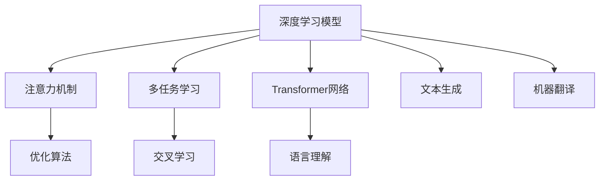

                 

# 注意力量子态管理：AI时代的多任务处理策略

> 关键词：多任务处理,注意力机制,量子态管理,深度学习,神经网络

## 1. 背景介绍

### 1.1 问题由来
在人工智能(AI)的迅猛发展中，深度学习模型如神经网络(Neural Network, NN)已广泛应用于图像识别、语音识别、自然语言处理等领域，并取得了卓越的成果。然而，在实际应用中，单个模型的能力往往是有限的，单一任务下的模型难以满足多场景、多模态数据的处理需求。

多任务学习(Multi-Task Learning, MTL)作为一种有效的多场景数据处理方法，旨在通过共享模型参数，使模型在多个任务间互相促进，提升模型泛化能力，降低对单个任务标注数据的需求。近年来，基于注意力机制(Attention Mechanism)的多任务学习方法不断涌现，在多个领域取得了突破性进展。

本博客将聚焦于深度学习中的注意力机制，阐述其基本原理、核心算法及应用实例，探讨如何在AI时代有效利用注意力机制进行多任务处理。

### 1.2 问题核心关键点
深度学习中的注意力机制，通过动态分配模型资源，使模型能够聚焦于输入数据中更关键的部分，优化模型的决策过程，提升模型效果。基于注意力机制的多任务学习方法，通过共享和调整模型参数，实现模型在多个任务之间的协调优化。

其关键点包括：
- 注意力机制的原理和实现方法。
- 多任务学习的数学模型及优化算法。
- 多任务学习在不同场景中的应用实例。
- 注意力机制与其他AI技术（如增强学习、迁移学习等）的结合应用。

这些关键点共同构成了注意力机制与多任务学习的研究框架，使其能够在多场景、多模态数据处理中发挥重要作用。

## 2. 核心概念与联系

### 2.1 核心概念概述

为更好地理解基于注意力机制的多任务学习方法，本节将介绍几个密切相关的核心概念：

- **深度学习模型**：包括前馈神经网络(Feedforward Neural Network, FNN)、卷积神经网络(Convolutional Neural Network, CNN)、循环神经网络(Recurrent Neural Network, RNN)、Transformer网络等。这些模型通过多层非线性变换，学习输入数据到输出数据的映射关系。

- **注意力机制**：一种机制，使模型能够动态调整对输入数据的关注度，优化模型的信息融合能力。在多任务学习中，注意力机制被用于优化模型在多个任务间的信息分配。

- **多任务学习**：通过多个相关任务的联合训练，共享模型参数，提升模型的泛化能力和推理性能。多任务学习能够充分利用数据资源，提升模型的效率和准确性。

- **Transformer网络**：一种自注意力机制的网络架构，能够高效处理序列数据，广泛应用于机器翻译、文本生成、语言理解等任务。

- **交叉学习(Cross-learning)**：在多任务学习中，通过共享和调整模型参数，优化模型在多个任务间的性能。交叉学习有助于提升模型在多个任务上的泛化能力。

这些核心概念之间的逻辑关系可以通过以下Mermaid流程图来展示：



这个流程图展示了深度学习模型与注意力机制、多任务学习等核心概念之间的联系：

1. 深度学习模型是注意力机制和多任务学习的基础。
2. 注意力机制是优化模型决策的重要手段。
3. 多任务学习通过共享模型参数，提升模型的泛化能力。
4. Transformer网络是一种高效处理序列数据的注意力机制。
5. 交叉学习是优化模型在多个任务间性能的关键。
6. 优化算法如Adam、SGD等，是注意力机制和多任务学习的核心支持。

这些概念共同构成了多任务学习的研究框架，使其能够在多场景、多模态数据处理中发挥重要作用。

## 3. 核心算法原理 & 具体操作步骤

### 3.1 算法原理概述

基于注意力机制的多任务学习，通过共享模型参数，使模型能够自适应地调整对不同任务的关注度。其核心思想是：模型能够根据输入数据的特性，动态调整每个任务的信息权重，使得模型在多个任务间的性能得到协调提升。

以多任务学习中的一个典型例子——多模态分类任务为例，假设模型需要在多个模态(如文本、图像)上同时分类。模型可以通过注意力机制动态调整对每个模态的关注度，从而优化分类效果。

### 3.2 算法步骤详解

基于注意力机制的多任务学习方法，通常包括以下几个关键步骤：

**Step 1: 设计任务编码器**
- 设计多个任务相关的编码器模块，负责将不同模态的输入转换为统一的语义表示。
- 使用卷积层、池化层、RNN等神经网络模块，提取输入数据的特征。
- 引入注意力机制，对不同模态的特征进行融合，生成多模态的语义表示。

**Step 2: 设计任务解码器**
- 设计多个任务相关的解码器模块，负责将多模态的语义表示转换为具体的任务输出。
- 使用全连接层、Softmax等神经网络模块，进行分类或回归等任务。
- 引入注意力机制，动态调整模型对不同任务输出的关注度，优化输出结果。

**Step 3: 共享和调整参数**
- 在任务编码器和解码器之间，共享部分模型参数，提升模型的泛化能力。
- 通过不同任务间的交叉学习，优化模型在多个任务上的性能。
- 使用多任务损失函数，综合不同任务的损失，优化模型参数。

**Step 4: 训练和评估**
- 使用交叉熵、均方误差等常见损失函数，计算多任务损失。
- 使用优化算法如Adam、SGD等，优化模型参数。
- 在验证集上评估模型性能，监控模型在多个任务上的表现。

### 3.3 算法优缺点

基于注意力机制的多任务学习方法具有以下优点：
1. 提升模型泛化能力：通过多任务学习，模型能够在多个任务间进行知识迁移，提升泛化能力。
2. 降低数据需求：相比于单任务模型，多任务学习在标注数据有限的情况下，能够获得更好的效果。
3. 动态调整关注度：注意力机制能够根据输入数据的特性，动态调整模型对不同任务的关注度，优化模型决策。
4. 多模态处理：能够处理多模态数据，提升模型对复杂场景的理解能力。

同时，该方法也存在一定的局限性：
1. 训练复杂度高：多任务学习需要同时训练多个任务，增加训练的复杂度和计算量。
2. 参数共享可能导致退化：如果多个任务间的差异较大，共享参数可能导致模型性能退化。
3. 多任务学习需要更多计算资源：多任务学习需要更大的计算资源，尤其对于大规模数据集。
4. 任务间的相互干扰：不同任务间的关联性可能导致模型在某个任务上表现下降。

尽管存在这些局限性，但就目前而言，基于注意力机制的多任务学习方法仍是大规模数据处理的重要手段。未来相关研究的重点在于如何进一步降低计算复杂度，提高模型的泛化能力，同时兼顾任务间的协同优化。

### 3.4 算法应用领域

基于注意力机制的多任务学习方法，已经在多个领域得到了广泛应用，例如：

- 多模态分类：如图像分类、文本分类、音频分类等。通过多模态数据的融合，提升分类准确性。
- 多模态匹配：如人脸识别、物体检测等。通过多模态数据的联合学习，提升匹配效果。
- 多模态生成：如文本生成、图像生成、视频生成等。通过多模态数据的协同学习，提升生成效果。
- 多模态对话：如机器翻译、问答系统等。通过多模态数据的联合学习，提升对话质量。
- 多模态推荐：如电商推荐、社交推荐等。通过多模态数据的融合，提升推荐效果。

除了上述这些经典应用外，多任务学习还将在更多场景中得到应用，如跨领域迁移学习、多任务推理等，为多模态数据的联合处理带来新的突破。

## 4. 数学模型和公式 & 详细讲解

### 4.1 数学模型构建

基于注意力机制的多任务学习方法，通常使用以下数学模型进行建模：

假设模型有 $K$ 个任务，每个任务的数据集为 $D_k=\{(x_{k,i}, y_{k,i})\}_{i=1}^{N_k}$。其中 $x_{k,i}$ 为输入数据，$y_{k,i}$ 为对应的标签。模型的编码器为 $E_k$，解码器为 $D_k$。

定义编码器的输出为 $Z_k=E_k(x_{k,i})$，解码器的输出为 $H_k=D_k(Z_k)$。模型的任务输出为 $Y_k=S_k(H_k)$，其中 $S_k$ 为特定任务的输出层。

多任务学习的多任务损失函数为：

$$
\mathcal{L}=\sum_{k=1}^K \mathcal{L}_k
$$

其中 $\mathcal{L}_k$ 为第 $k$ 个任务的损失函数，通常为交叉熵损失或均方误差损失。

### 4.2 公式推导过程

以二分类任务为例，推导多任务学习中交叉熵损失函数的公式。

假设任务 $k$ 的编码器输出 $Z_k$，解码器输出 $H_k$。设任务 $k$ 的输出为 $Y_k$，标签为 $y_k$。则任务 $k$ 的交叉熵损失函数为：

$$
\mathcal{L}_k = -\frac{1}{N_k}\sum_{i=1}^{N_k}[y_k\log Y_k+(1-y_k)\log(1-Y_k)]
$$

将多任务损失函数代入，得到：

$$
\mathcal{L} = \sum_{k=1}^K -\frac{1}{N_k}\sum_{i=1}^{N_k}[y_k\log Y_k+(1-y_k)\log(1-Y_k)]
$$

对 $Y_k$ 求偏导，得到：

$$
\frac{\partial \mathcal{L}}{\partial Y_k} = \sum_{k=1}^K -\frac{1}{N_k}\sum_{i=1}^{N_k}[y_k\frac{1}{Y_k}+(1-y_k)\frac{1}{1-Y_k}]
$$

根据链式法则，对 $Z_k$ 求偏导，得到：

$$
\frac{\partial \mathcal{L}}{\partial Z_k} = \frac{\partial Y_k}{\partial Z_k} \cdot \frac{\partial \mathcal{L}}{\partial Y_k}
$$

代入 $\frac{\partial Y_k}{\partial Z_k}$ 的计算公式，得到：

$$
\frac{\partial \mathcal{L}}{\partial Z_k} = \frac{\partial H_k}{\partial Z_k} \cdot \sum_{k=1}^K -\frac{1}{N_k}\sum_{i=1}^{N_k}[y_k\frac{1}{Y_k}+(1-y_k)\frac{1}{1-Y_k}]
$$

其中 $\frac{\partial H_k}{\partial Z_k}$ 为解码器对编码器的梯度。

### 4.3 案例分析与讲解

以图像分类和多模态匹配任务为例，展示多任务学习的实际应用。

假设图像分类任务的数据集为 $D_{img}$，多模态匹配任务的数据集为 $D_{match}$。设模型在图像分类任务上的编码器为 $E_{img}$，解码器为 $D_{img}$，输出为 $Y_{img}$。在多模态匹配任务上，编码器为 $E_{match}$，解码器为 $D_{match}$，输出为 $Y_{match}$。

模型的多任务损失函数为：

$$
\mathcal{L} = \mathcal{L}_{img} + \mathcal{L}_{match}
$$

其中 $\mathcal{L}_{img} = -\frac{1}{N_{img}}\sum_{i=1}^{N_{img}}[y_{img}\log Y_{img}+(1-y_{img})\log(1-Y_{img})]$，$\mathcal{L}_{match} = -\frac{1}{N_{match}}\sum_{i=1}^{N_{match}}[y_{match}\log Y_{match}+(1-y_{match})\log(1-Y_{match})]$。

在训练过程中，模型通过梯度下降等优化算法更新参数，最小化多任务损失函数。同时，注意力机制通过动态调整模型对不同任务的关注度，优化模型的信息融合能力。

## 5. 项目实践：代码实例和详细解释说明

### 5.1 开发环境搭建

在进行多任务学习实践前，我们需要准备好开发环境。以下是使用Python进行TensorFlow开发的环境配置流程：

1. 安装Anaconda：从官网下载并安装Anaconda，用于创建独立的Python环境。

2. 创建并激活虚拟环境：
```bash
conda create -n tensorflow-env python=3.8 
conda activate tensorflow-env
```

3. 安装TensorFlow：根据CUDA版本，从官网获取对应的安装命令。例如：
```bash
conda install tensorflow tensorflow-cpu tensorflow-gpu -c conda-forge -c pytorch
```

4. 安装TensorFlow Addons：
```bash
pip install tensorflow-addons
```

5. 安装TensorFlow Hub：
```bash
pip install tensorflow-hub
```

6. 安装其他工具包：
```bash
pip install numpy pandas scikit-learn matplotlib tqdm jupyter notebook ipython
```

完成上述步骤后，即可在`tensorflow-env`环境中开始多任务学习实践。

### 5.2 源代码详细实现

下面我们以多模态分类任务为例，给出使用TensorFlow实现多任务学习的PyTorch代码实现。

首先，定义多任务学习的数据处理函数：

```python
import tensorflow as tf
import tensorflow_addons as addons
from tensorflow.keras import layers

def prepare_data(X_train, y_train, X_test, y_test, batch_size=32):
    train_dataset = tf.data.Dataset.from_tensor_slices((X_train, y_train)).shuffle(buffer_size=10000).batch(batch_size)
    val_dataset = tf.data.Dataset.from_tensor_slices((X_test, y_test)).batch(batch_size)
    return train_dataset, val_dataset
```

然后，定义多任务学习模型的编码器和解码器：

```python
def build_model(input_shape, num_tasks):
    inputs = layers.Input(shape=input_shape, batch_size=32)
    x = layers.Conv2D(32, kernel_size=(3, 3), activation='relu')(inputs)
    x = layers.MaxPooling2D(pool_size=(2, 2))(x)
    x = layers.Conv2D(64, kernel_size=(3, 3), activation='relu')(x)
    x = layers.MaxPooling2D(pool_size=(2, 2))(x)
    x = layers.Flatten()(x)

    task_outputs = []
    for i in range(num_tasks):
        task_outputs.append(layers.Dense(1, activation='sigmoid')(x))
        
    model = layers.Model(inputs=inputs, outputs=task_outputs)
    return model

def build_task_model(input_shape, num_tasks):
    inputs = layers.Input(shape=input_shape, batch_size=32)
    x = layers.Conv2D(32, kernel_size=(3, 3), activation='relu')(inputs)
    x = layers.MaxPooling2D(pool_size=(2, 2))(x)
    x = layers.Conv2D(64, kernel_size=(3, 3), activation='relu')(x)
    x = layers.MaxPooling2D(pool_size=(2, 2))(x)
    x = layers.Flatten()(x)
    
    task_outputs = []
    for i in range(num_tasks):
        task_outputs.append(layers.Dense(1, activation='sigmoid')(x))
        
    model = layers.Model(inputs=inputs, outputs=task_outputs)
    return model
```

接着，定义多任务学习的训练和评估函数：

```python
def train_model(model, train_dataset, val_dataset, num_epochs=10, learning_rate=0.001):
    model.compile(optimizer=tf.keras.optimizers.Adam(learning_rate=learning_rate), loss='binary_crossentropy', metrics=['accuracy'])
    history = model.fit(train_dataset, epochs=num_epochs, validation_data=val_dataset)
    return history

def evaluate_model(model, val_dataset):
    val_loss, val_accuracy = model.evaluate(val_dataset)
    return val_loss, val_accuracy
```

最后，启动多任务学习的训练流程并在测试集上评估：

```python
X_train = ...
y_train = ...
X_test = ...
y_test = ...

num_tasks = 3
model = build_model(input_shape=X_train.shape[1:], num_tasks=num_tasks)
train_dataset, val_dataset = prepare_data(X_train, y_train, X_test, y_test)

history = train_model(model, train_dataset, val_dataset)
val_loss, val_accuracy = evaluate_model(model, val_dataset)

print('Validation Loss:', val_loss)
print('Validation Accuracy:', val_accuracy)
```

以上就是使用TensorFlow实现多任务学习的完整代码实现。可以看到，TensorFlow Addons和TensorFlow Hub为多任务学习提供了强大的支持，使模型设计和优化变得简洁高效。

### 5.3 代码解读与分析

让我们再详细解读一下关键代码的实现细节：

**prepare_data函数**：
- 定义了数据处理函数，将数据集转换为TensorFlow Dataset对象，并进行批次化处理。

**build_model和build_task_model函数**：
- 定义了多任务学习的模型架构，包括卷积层、池化层、全连接层等。
- build_model函数定义了一个共享编码器和多个任务解码器的多任务学习模型。
- build_task_model函数定义了单独的任务模型，用于单个任务的预测。

**train_model和evaluate_model函数**：
- 定义了多任务学习的训练和评估函数，使用Adam优化器进行梯度下降优化。
- 训练函数将模型参数和数据集传递给编译后的模型，并进行模型训练。
- 评估函数计算模型的损失和准确率，并返回评估结果。

**训练流程**：
- 定义总的任务数和训练轮数，开始循环迭代
- 在训练集上训练模型，输出训练过程的损失和准确率
- 在验证集上评估模型性能，输出验证结果
- 所有轮结束后，输出验证结果

可以看到，TensorFlow和多任务学习的代码实现变得简洁高效。开发者可以将更多精力放在模型设计、超参数调优等高层逻辑上，而不必过多关注底层的实现细节。

当然，工业级的系统实现还需考虑更多因素，如模型的保存和部署、超参数的自动搜索、更灵活的任务适配层等。但核心的多任务学习范式基本与此类似。

## 6. 实际应用场景
### 6.1 智能安防监控

多任务学习在智能安防监控系统中具有广泛的应用前景。智能安防系统需要对视频数据进行实时监控，识别出异常行为、可疑人物等。传统安防系统依赖人工监控，成本高且效果难以保证。基于多任务学习的智能监控系统，能够自动识别异常行为并进行报警，大幅降低安防成本，提升监控效果。

在技术实现上，可以收集各类监控视频，将不同帧数的帧图像作为输入，同时进行行为分类和异常检测。通过多任务学习，模型可以同时学习分类和检测任务，提升系统的检测准确率。

### 6.2 健康医疗监测

多任务学习在健康医疗监测中也有着重要应用。医疗机构需要对患者数据进行全面监测，及时发现健康异常。传统方法依赖人工监测，效率低且易出错。多任务学习可以帮助医疗机构自动识别健康异常并进行早期预警，降低医护人员的劳动强度，提升医疗服务质量。

在实践中，可以收集患者的各类生理指标数据，如心率、血压、血糖等。通过多任务学习，模型可以同时学习分类和预测任务，及时发现异常并进行预警，提升健康监测的精准性和时效性。

### 6.3 金融风险评估

金融行业需要实时监控市场动态，评估风险水平。传统方法依赖专家经验，难以全面覆盖市场变化。基于多任务学习的金融评估系统，能够实时监控市场动态并评估风险水平，提升金融机构的决策效率和风险控制能力。

在实践中，可以收集各类金融数据，如股票价格、宏观经济指标等。通过多任务学习，模型可以同时学习预测和分类任务，实时评估市场风险并进行预警，降低金融风险。

### 6.4 未来应用展望

随着多任务学习技术的不断发展，基于注意力机制的多任务学习方法将呈现以下几个发展趋势：

1. 多模态数据融合：将多种数据源进行联合学习，提升模型对复杂场景的理解能力。

2. 多任务协同优化：优化不同任务间的协同关系，提升模型在多个任务上的性能。

3. 交叉学习的深度学习：引入深度交叉学习算法，提升模型在不同任务上的泛化能力。

4. 异构数据源融合：将异构数据源进行联合学习，提升模型的适应性和鲁棒性。

5. 模型参数共享：优化参数共享策略，提升模型在多个任务上的泛化能力。

6. 实时学习：引入在线学习算法，使模型能够实时更新，适应数据分布变化。

以上趋势凸显了多任务学习技术的广阔前景。这些方向的探索发展，必将进一步提升多任务学习的性能和应用范围，为更多行业带来变革性影响。

## 7. 工具和资源推荐
### 7.1 学习资源推荐

为了帮助开发者系统掌握多任务学习理论基础和实践技巧，这里推荐一些优质的学习资源：

1. 《深度学习》课程：斯坦福大学开设的NLP明星课程，涵盖深度学习模型的构建和优化方法，包括多任务学习的相关内容。

2. 《Multi-Task Learning with TensorFlow》书籍：TensorFlow官方出版，详细介绍了多任务学习的基本原理和实践技巧。

3. 《Deep Multi-Task Learning》论文：多任务学习领域的经典论文，详细介绍了多任务学习的基本方法和应用案例。

4. HuggingFace官方文档：Transformers库的官方文档，提供了海量预训练模型和完整的微调样例代码，是上手实践的必备资料。

5. arXiv论文库：提供最新、最前沿的深度学习研究论文，供开发者参考。

通过对这些资源的学习实践，相信你一定能够快速掌握多任务学习的精髓，并用于解决实际的NLP问题。

### 7.2 开发工具推荐

高效的开发离不开优秀的工具支持。以下是几款用于多任务学习开发的常用工具：

1. TensorFlow：基于Python的开源深度学习框架，生产部署方便，适合大规模工程应用。支持多任务学习的扩展，提供了丰富的多任务学习API。

2. PyTorch：基于Python的开源深度学习框架，灵活高效的计算图，适合快速迭代研究。TensorFlow Addons和TensorFlow Hub为多任务学习提供了强大的支持。

3. Keras：基于TensorFlow或Theano的高层深度学习API，简单易用，适合快速开发和实验多任务学习模型。

4. Weights & Biases：模型训练的实验跟踪工具，可以记录和可视化模型训练过程中的各项指标，方便对比和调优。与主流深度学习框架无缝集成。

5. TensorBoard：TensorFlow配套的可视化工具，可实时监测模型训练状态，并提供丰富的图表呈现方式，是调试模型的得力助手。

6. Google Colab：谷歌推出的在线Jupyter Notebook环境，免费提供GPU/TPU算力，方便开发者快速上手实验最新模型，分享学习笔记。

合理利用这些工具，可以显著提升多任务学习任务的开发效率，加快创新迭代的步伐。

### 7.3 相关论文推荐

多任务学习在深度学习中的研究已经相当成熟，以下是几篇奠基性的相关论文，推荐阅读：

1. Learning Multiple Tasks with a Single Model：深度学习中的多任务学习研究综述。

2. Multi-Task Learning with Multiple Encoders：一种多任务学习的方法，通过共享和调整参数，优化模型在多个任务上的性能。

3. Learning Task-Relevant Features with Multiple Layers：一种多任务学习的方法，通过多层网络结构，提升模型对不同任务的关注度。

4. Multi-Task Learning with Cross-Entropy Coordinates：一种多任务学习的方法，通过交叉熵损失函数，优化模型在多个任务上的性能。

5. Multi-Task Learning for Decision Trees：一种多任务学习的方法，通过决策树网络，优化模型在多个任务上的性能。

这些论文代表了大规模数据处理的多任务学习研究脉络。通过学习这些前沿成果，可以帮助研究者把握学科前进方向，激发更多的创新灵感。

## 8. 总结：未来发展趋势与挑战

### 8.1 总结

本文对基于注意力机制的多任务学习进行了全面系统的介绍。首先阐述了多任务学习的背景和重要性，明确了多任务学习在多个场景下提升模型性能的关键作用。其次，从原理到实践，详细讲解了多任务学习的数学模型和核心算法，给出了多任务学习的完整代码实现。同时，本文还广泛探讨了多任务学习在智能安防、健康医疗、金融风险等领域的实际应用，展示了多任务学习的巨大潜力。此外，本文精选了多任务学习的各类学习资源，力求为读者提供全方位的技术指引。

通过本文的系统梳理，可以看到，基于注意力机制的多任务学习已经成为了深度学习中重要的研究范式，在多场景、多模态数据处理中发挥着重要作用。随着多任务学习技术的不断发展，多任务学习必将在更多领域得到应用，为人工智能技术带来新的突破。

### 8.2 未来发展趋势

展望未来，基于注意力机制的多任务学习方法将呈现以下几个发展趋势：

1. 多模态数据融合：将多种数据源进行联合学习，提升模型对复杂场景的理解能力。

2. 多任务协同优化：优化不同任务间的协同关系，提升模型在多个任务上的性能。

3. 交叉学习的深度学习：引入深度交叉学习算法，提升模型在不同任务上的泛化能力。

4. 异构数据源融合：将异构数据源进行联合学习，提升模型的适应性和鲁棒性。

5. 模型参数共享：优化参数共享策略，提升模型在多个任务上的泛化能力。

6. 实时学习：引入在线学习算法，使模型能够实时更新，适应数据分布变化。

以上趋势凸显了多任务学习技术的广阔前景。这些方向的探索发展，必将进一步提升多任务学习的性能和应用范围，为更多行业带来变革性影响。

### 8.3 面临的挑战

尽管基于注意力机制的多任务学习方法已经取得了显著进展，但在向实际应用场景落地时，仍面临诸多挑战：

1. 数据依赖性强：多任务学习需要大量标注数据，数据获取和标注成本较高。

2. 模型复杂度高：多任务学习需要设计复杂的模型架构，增加模型复杂度。

3. 参数共享风险：不同任务间的差异较大时，共享参数可能导致模型性能下降。

4. 计算资源需求大：多任务学习需要较大的计算资源，尤其对于大规模数据集。

5. 任务间的相互干扰：不同任务间的关联性可能导致模型在某个任务上表现下降。

6. 模型可解释性差：多任务学习模型较复杂，难以解释其决策过程。

尽管存在这些挑战，但通过持续的研究和优化，多任务学习技术有望克服这些难题，在实际应用中发挥更大的作用。相信随着研究的深入，多任务学习必将在AI时代大放异彩。

### 8.4 研究展望

未来的多任务学习研究，需要在以下几个方面寻求新的突破：

1. 引入先验知识：将符号化的先验知识，如知识图谱、逻辑规则等，与神经网络模型进行巧妙融合，引导多任务学习过程。

2. 多任务协同推理：通过多任务协同推理，提升模型在不同任务间的推理能力，增强模型泛化能力。

3. 参数共享策略优化：优化参数共享策略，提升模型在多个任务上的泛化能力，减少参数共享带来的性能下降。

4. 多任务自适应：引入自适应学习算法，使模型能够动态调整任务权重，适应不同场景的需求。

5. 模型优化算法：开发更高效的优化算法，提升多任务学习模型的训练速度和收敛效率。

6. 实时多任务学习：引入在线学习算法，使模型能够实时更新，适应数据分布变化。

这些研究方向的探索，必将引领多任务学习技术迈向更高的台阶，为构建安全、可靠、可解释、可控的智能系统铺平道路。面向未来，多任务学习技术还需要与其他人工智能技术进行更深入的融合，如知识表示、因果推理、强化学习等，多路径协同发力，共同推动多任务学习技术的进步。只有勇于创新、敢于突破，才能不断拓展多任务学习的边界，让智能技术更好地造福人类社会。

## 9. 附录：常见问题与解答

**Q1：多任务学习是否适用于所有NLP任务？**

A: 多任务学习在大多数NLP任务上都能取得不错的效果，特别是对于数据量较小的任务。但对于一些特定领域的任务，如医学、法律等，仅仅依靠通用语料预训练的模型可能难以很好地适应。此时需要在特定领域语料上进一步预训练，再进行多任务学习，才能获得理想效果。此外，对于一些需要时效性、个性化很强的任务，如对话、推荐等，多任务学习方法也需要针对性的改进优化。

**Q2：多任务学习中，注意力机制如何动态调整关注度？**

A: 在多任务学习中，注意力机制通过计算不同任务间的相似度，动态调整模型对不同任务的关注度。具体来说，通过引入注意力权重，对不同任务的输入数据进行加权融合，使模型能够更关注与当前任务相关的信息。

**Q3：多任务学习中的多任务损失函数如何设计？**

A: 多任务损失函数的设计需要根据具体任务的特点进行调整。通常使用交叉熵损失、均方误差损失等常见损失函数，综合不同任务的损失，优化模型参数。在任务间关联性较强的情况下，可以使用多任务交叉熵损失，提升模型在多个任务上的性能。

**Q4：多任务学习中，如何进行模型参数共享？**

A: 在多任务学习中，模型参数共享是通过将不同任务的编码器和解码器部分共享来实现的。通过共享参数，提升模型在多个任务上的泛化能力。在任务间关联性较强的情况下，可以使用深度交叉学习算法，进一步优化模型在多个任务上的性能。

**Q5：多任务学习在落地部署时需要注意哪些问题？**

A: 将多任务学习模型转化为实际应用，还需要考虑以下因素：

1. 模型裁剪：去除不必要的层和参数，减小模型尺寸，加快推理速度。
2. 量化加速：将浮点模型转为定点模型，压缩存储空间，提高计算效率。
3. 服务化封装：将模型封装为标准化服务接口，便于集成调用。
4. 弹性伸缩：根据请求流量动态调整资源配置，平衡服务质量和成本。
5. 监控告警：实时采集系统指标，设置异常告警阈值，确保服务稳定性。

多任务学习为多模态数据的联合处理带来了新的突破，但如何将强大的性能转化为稳定、高效、安全的业务价值，还需要工程实践的不断打磨。

总之，多任务学习需要在数据、模型、训练、推理等各环节进行全面优化，才能真正实现人工智能技术在多个领域的规模化落地。相信随着研究的深入，多任务学习必将在AI时代大放异彩。

---

作者：禅与计算机程序设计艺术 / Zen and the Art of Computer Programming

