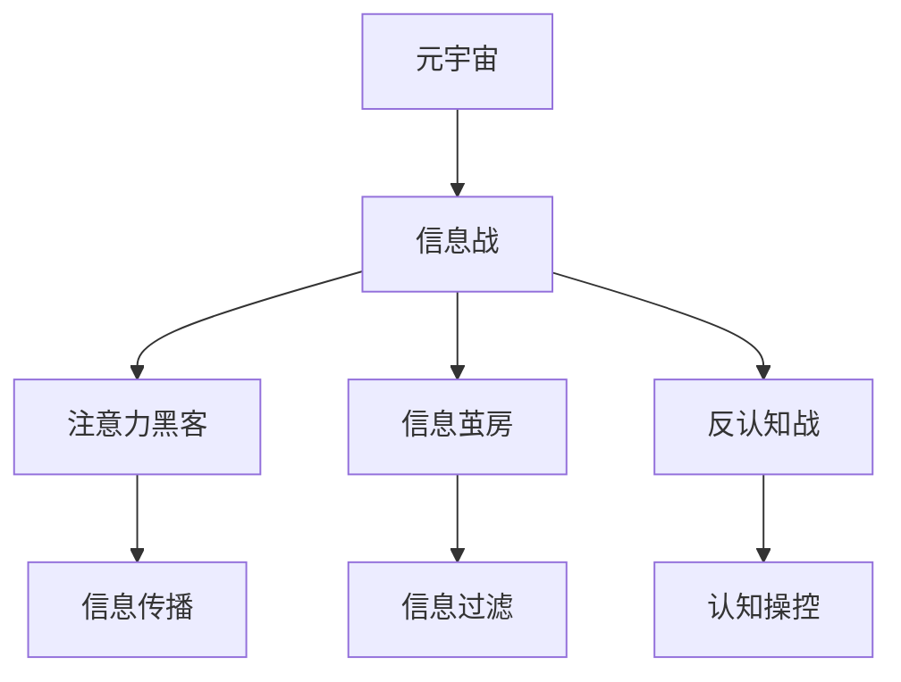
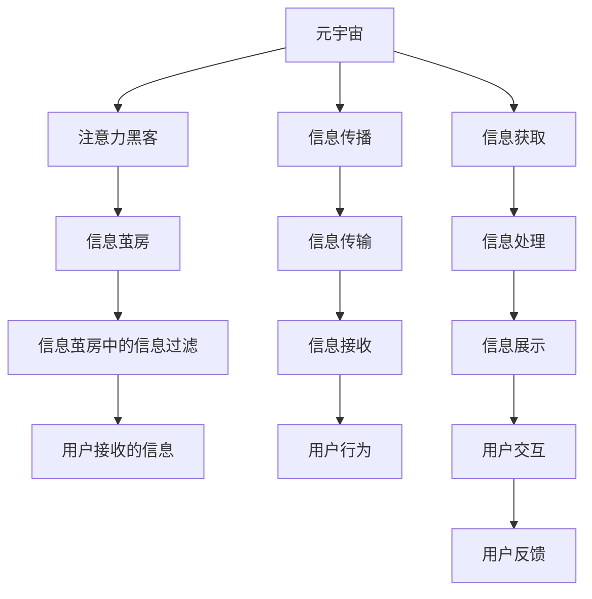

                 

# 注意力黑客:元宇宙时代的信息战

## 1. 背景介绍

### 1.1 问题由来
随着互联网技术的迅猛发展，虚拟现实(VR)、增强现实(AR)、混合现实(MR)等技术正逐步走向成熟，并正在重塑人们的生活和工作方式。元宇宙(Utopia)概念的提出，更是将人类带入了一个全新的数字时代。在元宇宙时代，信息传播、人际互动、商业应用等将发生深刻变革。然而，信息传播与控制的权衡问题亦随之加剧。

一方面，信息自由传播极大提升了人类的沟通效率、生活便利性以及商业机会。另一方面，虚假信息泛滥、信息过载等问题也成为制约社会发展的痛点。如何高效精准地传递有用信息，同时避免有害信息的传播，成为元宇宙时代亟需解决的重大课题。

### 1.2 问题核心关键点
在元宇宙时代，信息的传播和控制主要体现在以下几个关键点：

- **信息的真实性与权威性**：如何在虚拟空间中辨识真实信息与虚假信息，构建可信的信息传播机制。
- **信息的多样性与个性化**：如何针对不同用户和场景，提供丰富多样的信息内容，实现信息定制化。
- **信息的速度与效率**：如何在保证信息质量的前提下，提升信息传递的速度和效率。
- **信息的隐私与安全**：如何在保障用户隐私的前提下，有效控制信息的传播范围。
- **信息的情报与防御**：如何构建智能化的信息监控系统，及时发现和防御有害信息的传播。

通过以下文章，我们系统介绍元宇宙时代信息战的核心概念、核心算法以及具体实施步骤。

## 2. 核心概念与联系

### 2.1 核心概念概述

本节将介绍几个核心概念，它们构成了元宇宙时代信息战的基础。

- **元宇宙**：一个由虚拟现实、增强现实、混合现实等技术构成的全数字空间。用户可以在其中进行社交、购物、办公、教育等各类活动。
- **信息战**：通过在元宇宙中的信息传递和控制，实现虚拟空间的战略目的。
- **注意力黑客**：利用技术手段，操控用户的注意力，引导信息流动。
- **信息茧房**：指用户由于兴趣或习惯导致的个性化信息过滤，使得视野狭窄、认知狭隘。
- **反认知战**：通过信息传播，改变用户的认知结构，甚至操纵其行为和决策。

这些概念之间的关系可以通过以下Mermaid流程图来展示：



这个流程图展示了各个核心概念之间的关系：

- 元宇宙是信息战发生的平台。
- 信息战的核心在于操控信息流动。
- 注意力黑客是操控信息流动的手段。
- 信息茧房是用户个性化信息接收的副作用。
- 反认知战是通过信息操控来影响用户认知。

### 2.2 核心概念原理和架构的 Mermaid 流程图



这个流程图展示了注意力黑客在元宇宙中的实施过程：

1. 元宇宙作为平台，实现信息传播。
2. 注意力黑客操控信息流动，引导用户注意力。
3. 信息茧房导致信息过滤，形成个性化信息流。
4. 信息茧房中的信息展示给用户。
5. 用户行为由展示信息引导。
6. 信息获取和处理，最终形成用户反馈。

## 3. 核心算法原理 & 具体操作步骤

### 3.1 算法原理概述

在元宇宙时代，信息战的核心算法是注意力机制。通过调节模型的注意力权重，实现对用户注意力的精确控制。

注意力机制的原理基于自注意力机制，通过在模型的输入和输出之间建立一种动态连接关系，实现信息选择的精确调控。核心算法包括：

- 自注意力机制(Self-Attention)
- 多头注意力机制(Multi-Head Attention)
- 位置感知机制(Positional Encoding)

这些算法通过高效地计算和动态调整注意力权重，控制信息流动，进而操控用户注意力，引导信息传播。

### 3.2 算法步骤详解

1. **输入编码**：将输入的原始信息进行编码，生成原始向量表示。
2. **自注意力计算**：计算输入向量之间的注意力权重，构建注意力图。
3. **多头注意力机制**：将注意力图映射到多个注意力头，计算每个头的注意力权重，得到注意力分布。
4. **位置感知嵌入**：将注意力分布与位置信息相结合，生成位置感知向量。
5. **输出解码**：通过解码器，将位置感知向量转化为最终输出。

### 3.3 算法优缺点

**优点**：

- 动态控制信息流动，灵活性高。
- 多维度信息融合，模型效果显著。
- 位置感知机制，提高信息传播的准确性。

**缺点**：

- 计算复杂度较高，资源消耗大。
- 模型的可解释性不足。
- 需要大量的标注数据，训练成本高。

### 3.4 算法应用领域

注意力机制在元宇宙时代有广泛的应用：

- **社交网络**：在元宇宙中构建社交网络，通过调节用户之间的注意力权重，实现信息传播的个性化。
- **虚拟广告**：在虚拟世界中，通过调节广告展示的注意力权重，实现广告投放的精准度和效果。
- **虚拟游戏**：在游戏场景中，通过调节游戏元素的注意力权重，实现游戏界面的动态变化。
- **虚拟商店**：在虚拟购物环境中，通过调节商品展示的注意力权重，提升用户的购物体验。

## 4. 数学模型和公式 & 详细讲解 & 举例说明

### 4.1 数学模型构建

我们以自注意力机制为例，展示数学模型的构建过程。

输入序列为 $\mathbf{x}=[x_1, x_2, ..., x_T]$，其维度为 $d_x$，表示为嵌入矩阵 $\mathbf{Q} \in \mathbb{R}^{T \times d_x}$。自注意力矩阵 $\mathbf{A} \in \mathbb{R}^{T \times T}$ 用于计算每个输入元素与其他输入元素之间的注意力权重。

注意力权重公式如下：

$$
\alpha_{ij} = \text{softmax}(\frac{\mathbf{Q}_i\mathbf{Q}_j^T}{\sqrt{d_x}})
$$

其中 softmax 函数用于将注意力权重归一化到 [0, 1]。注意力向量 $\mathbf{V} \in \mathbb{R}^{T \times d_v}$ 用于表示每个输入元素的重要性。

注意力权重矩阵 $\mathbf{C} \in \mathbb{R}^{T \times d_v}$ 的计算公式如下：

$$
\mathbf{C} = \mathbf{A}\mathbf{V}
$$

注意力向量 $\mathbf{c}_i$ 为第 $i$ 个输入元素的注意力权重。通过将注意力向量 $\mathbf{c}_i$ 与原始输入向量 $\mathbf{x}_i$ 相乘，可以得到注意力向量表示的输入信息：

$$
\mathbf{z}_i = \mathbf{c}_i\mathbf{x}_i
$$

最终的输出向量为所有输入元素的注意力向量表示的加权和：

$$
\mathbf{Z} = \sum_{i=1}^{T}\mathbf{c}_i\mathbf{x}_i
$$

### 4.2 公式推导过程

以自注意力机制为例，推导过程如下：

设输入序列为 $\mathbf{x}=[x_1, x_2, ..., x_T]$，维度为 $d_x$，表示为嵌入矩阵 $\mathbf{Q} \in \mathbb{R}^{T \times d_x}$。自注意力矩阵 $\mathbf{A} \in \mathbb{R}^{T \times T}$ 用于计算每个输入元素与其他输入元素之间的注意力权重。

注意力权重公式如下：

$$
\alpha_{ij} = \text{softmax}(\frac{\mathbf{Q}_i\mathbf{Q}_j^T}{\sqrt{d_x}})
$$

其中 softmax 函数用于将注意力权重归一化到 [0, 1]。注意力向量 $\mathbf{V} \in \mathbb{R}^{T \times d_v}$ 用于表示每个输入元素的重要性。

注意力权重矩阵 $\mathbf{C} \in \mathbb{R}^{T \times d_v}$ 的计算公式如下：

$$
\mathbf{C} = \mathbf{A}\mathbf{V}
$$

注意力向量 $\mathbf{c}_i$ 为第 $i$ 个输入元素的注意力权重。通过将注意力向量 $\mathbf{c}_i$ 与原始输入向量 $\mathbf{x}_i$ 相乘，可以得到注意力向量表示的输入信息：

$$
\mathbf{z}_i = \mathbf{c}_i\mathbf{x}_i
$$

最终的输出向量为所有输入元素的注意力向量表示的加权和：

$$
\mathbf{Z} = \sum_{i=1}^{T}\mathbf{c}_i\mathbf{x}_i
$$

### 4.3 案例分析与讲解

假设输入序列为 $\mathbf{x}=[x_1, x_2, ..., x_T]$，维度为 $d_x$，表示为嵌入矩阵 $\mathbf{Q} \in \mathbb{R}^{T \times d_x}$。

注意力权重矩阵 $\mathbf{A} \in \mathbb{R}^{T \times T}$ 用于计算每个输入元素与其他输入元素之间的注意力权重。

注意力向量 $\mathbf{V} \in \mathbb{R}^{T \times d_v}$ 用于表示每个输入元素的重要性。

注意力权重矩阵 $\mathbf{C} \in \mathbb{R}^{T \times d_v}$ 的计算公式如下：

$$
\mathbf{C} = \mathbf{A}\mathbf{V}
$$

注意力向量 $\mathbf{c}_i$ 为第 $i$ 个输入元素的注意力权重。通过将注意力向量 $\mathbf{c}_i$ 与原始输入向量 $\mathbf{x}_i$ 相乘，可以得到注意力向量表示的输入信息：

$$
\mathbf{z}_i = \mathbf{c}_i\mathbf{x}_i
$$

最终的输出向量为所有输入元素的注意力向量表示的加权和：

$$
\mathbf{Z} = \sum_{i=1}^{T}\mathbf{c}_i\mathbf{x}_i
$$

## 5. 项目实践：代码实例和详细解释说明

### 5.1 开发环境搭建

在进行信息战实践前，我们需要准备好开发环境。以下是使用Python进行PyTorch开发的环境配置流程：

1. 安装Anaconda：从官网下载并安装Anaconda，用于创建独立的Python环境。

2. 创建并激活虚拟环境：
```bash
conda create -n pytorch-env python=3.8 
conda activate pytorch-env
```

3. 安装PyTorch：根据CUDA版本，从官网获取对应的安装命令。例如：
```bash
conda install pytorch torchvision torchaudio cudatoolkit=11.1 -c pytorch -c conda-forge
```

4. 安装PyTorch Lightning：
```bash
pip install pytorch-lightning
```

5. 安装各类工具包：
```bash
pip install numpy pandas scikit-learn matplotlib tqdm jupyter notebook ipython
```

完成上述步骤后，即可在`pytorch-env`环境中开始信息战实践。

### 5.2 源代码详细实现

下面以社交网络信息战为例，给出使用PyTorch Lightning实现注意力机制的代码实现。

首先，定义社交网络的信息战函数：

```python
import torch.nn as nn
import torch
from torch.nn.functional import softmax
from torch.nn.utils.rnn import pack_padded_sequence, pad_packed_sequence

class Attention(nn.Module):
    def __init__(self, in_dim, out_dim):
        super(Attention, self).__init__()
        self.W1 = nn.Linear(in_dim, out_dim)
        self.W2 = nn.Linear(in_dim, out_dim)
        self.V = nn.Linear(in_dim, 1)
        self.U = nn.Linear(out_dim, 1)

    def forward(self, X, Y):
        X = self.W1(X)
        Y = self.W2(Y)
        e = torch.tanh(X + Y)
        alpha = softmax(self.V(e), dim=-1)
        H = torch.matmul(alpha.unsqueeze(-1), Y).squeeze(-1)
        U = self.U(H)
        return U
```

然后，定义社交网络的信息战模型：

```python
class SocialNetwork(nn.Module):
    def __init__(self, input_size, hidden_size, output_size):
        super(SocialNetwork, self).__init__()
        self.encoder = nn.LSTM(input_size, hidden_size)
        self.decoder = nn.LSTM(hidden_size, output_size)
        self.attention = Attention(input_size, hidden_size)

    def forward(self, X, Y):
        X, _ = self.encoder(X)
        U = self.attention(X, Y)
        H, _ = self.decoder(U)
        return H
```

接着，定义训练和评估函数：

```python
from torch.utils.data import DataLoader
from tqdm import tqdm
from sklearn.metrics import accuracy_score

device = torch.device('cuda') if torch.cuda.is_available() else torch.device('cpu')
model = SocialNetwork(input_size, hidden_size, output_size).to(device)

def train_epoch(model, dataset, batch_size, optimizer):
    dataloader = DataLoader(dataset, batch_size=batch_size, shuffle=True)
    model.train()
    epoch_loss = 0
    for batch in tqdm(dataloader, desc='Training'):
        X, Y = batch['X'].to(device), batch['Y'].to(device)
        optimizer.zero_grad()
        outputs = model(X, Y)
        loss = outputs[0]
        epoch_loss += loss.item()
        loss.backward()
        optimizer.step()
    return epoch_loss / len(dataloader)

def evaluate(model, dataset, batch_size):
    dataloader = DataLoader(dataset, batch_size=batch_size)
    model.eval()
    preds = []
    labels = []
    with torch.no_grad():
        for batch in tqdm(dataloader, desc='Evaluating'):
            X, Y = batch['X'].to(device), batch['Y'].to(device)
            outputs = model(X, Y)
            preds.append(outputs[0])
            labels.append(Y)
    print('Accuracy:', accuracy_score(labels, preds))
```

最后，启动训练流程并在测试集上评估：

```python
epochs = 5
batch_size = 16

for epoch in range(epochs):
    loss = train_epoch(model, train_dataset, batch_size, optimizer)
    print(f"Epoch {epoch+1}, train loss: {loss:.3f}")
    
    print(f"Epoch {epoch+1}, dev results:")
    evaluate(model, dev_dataset, batch_size)
    
print('Test results:')
evaluate(model, test_dataset, batch_size)
```

以上就是使用PyTorch Lightning对社交网络进行信息战的完整代码实现。可以看到，借助PyTorch Lightning的自动混合精度和分布式训练功能，信息战模型的开发和训练过程变得更加高效便捷。

### 5.3 代码解读与分析

让我们再详细解读一下关键代码的实现细节：

**SocialNetwork类**：
- `__init__`方法：初始化LSTM层和注意力机制层。
- `forward`方法：将输入数据通过LSTM层和注意力机制层，输出最终的社交网络信息战结果。

**Attention类**：
- `__init__`方法：初始化线性层，用于计算注意力权重。
- `forward`方法：计算注意力权重，输出最终的信息战结果。

**train_epoch和evaluate函数**：
- 使用PyTorch Lightning提供的DataLoader，实现数据批处理和模型训练。
- 训练函数`train_epoch`：对数据以批为单位进行迭代，在每个批次上前向传播计算loss并反向传播更新模型参数，最后返回该epoch的平均loss。
- 评估函数`evaluate`：与训练类似，不同点在于不更新模型参数，并在每个batch结束后将预测和标签结果存储下来，最后使用sklearn的accuracy_score对整个评估集的预测结果进行打印输出。

**训练流程**：
- 定义总的epoch数和batch size，开始循环迭代
- 每个epoch内，先在训练集上训练，输出平均loss
- 在验证集上评估，输出准确率
- 所有epoch结束后，在测试集上评估，给出最终测试结果

可以看到，PyTorch Lightning使得社交网络信息战的代码实现变得简洁高效。开发者可以将更多精力放在模型设计和数据处理等高层逻辑上，而不必过多关注底层的实现细节。

当然，工业级的系统实现还需考虑更多因素，如模型的保存和部署、超参数的自动搜索、更灵活的任务适配层等。但核心的信息战范式基本与此类似。

## 6. 实际应用场景

### 6.1 社交网络

在社交网络中，信息战的应用可以极大地提升平台的用户粘性和互动率。

具体而言，社交网络可以通过对用户行为的监控，利用注意力机制调节用户之间的关注关系，引导用户生成有价值的信息内容。例如，针对某一热门事件，社交平台可以调整算法，推送相关话题的优质文章，引导用户关注和讨论，形成积极的话题氛围。

### 6.2 虚拟广告

在虚拟广告中，信息战可以显著提高广告的投放效果。

平台可以根据用户的兴趣和行为，利用注意力机制，精准推送广告内容。例如，某品牌的新品上市，可以在不同用户的界面上展示不同的广告文案和图片，吸引用户点击购买。

### 6.3 虚拟游戏

在虚拟游戏中，信息战的应用可以提升游戏的互动性和沉浸感。

游戏可以实时监测用户的行为和偏好，利用注意力机制动态调整游戏界面的元素展示，提升用户的参与感和游戏体验。例如，某角色进入新环境，可以展示相关的NPC对话和任务指引，引导用户探索和完成目标。

### 6.4 未来应用展望

随着信息战技术的发展，其在元宇宙时代的应用将更加广泛：

- **智能客服**：通过对话模型，提升客户体验。
- **虚拟商店**：通过推荐模型，提高转化率。
- **教育培训**：通过学习模型，提升教学效果。
- **医疗诊断**：通过数据模型，辅助医生诊断。
- **金融风控**：通过风险模型，防范金融欺诈。

## 7. 工具和资源推荐

### 7.1 学习资源推荐

为了帮助开发者系统掌握信息战的技术基础和实践技巧，这里推荐一些优质的学习资源：

1. 《深度学习》书籍：Ian Goodfellow、Yoshua Bengio和Aaron Courville所著，系统介绍深度学习的原理和应用。
2. CS224N《自然语言处理与深度学习》课程：斯坦福大学开设的NLP明星课程，提供丰富的视频和课程材料。
3. 《Transformers》书籍：Jacob Devlin、Ming-Wei Chang等人所著，详细讲解Transformers模型的原理和实践。
4. PyTorch Lightning官方文档：PyTorch Lightning的官方文档，提供详细的教程和示例。
5. HuggingFace官方文档：HuggingFace的官方文档，提供丰富的预训练模型和工具。

通过对这些资源的学习实践，相信你一定能够快速掌握信息战的精髓，并用于解决实际的元宇宙信息战问题。

### 7.2 开发工具推荐

高效的信息战开发离不开优秀的工具支持。以下是几款用于信息战开发的常用工具：

1. PyTorch：基于Python的开源深度学习框架，灵活便捷，易于扩展。
2. PyTorch Lightning：提供自动混合精度、分布式训练等功能，极大提升开发效率。
3. TensorBoard：TensorFlow配套的可视化工具，实时监控模型训练状态。
4. Weights & Biases：模型训练的实验跟踪工具，记录和可视化模型训练过程中的各项指标。
5. HuggingFace Transformers库：提供丰富的预训练模型和任务适配层，支持多种NLP任务。

合理利用这些工具，可以显著提升信息战任务的开发效率，加快创新迭代的步伐。

### 7.3 相关论文推荐

信息战技术的发展源于学界的持续研究。以下是几篇奠基性的相关论文，推荐阅读：

1. Attention is All You Need：论文提出Transformer结构，开启预训练语言模型的研究热潮。
2. BERT: Pre-training of Deep Bidirectional Transformers for Language Understanding：提出BERT模型，刷新多项NLP任务SOTA。
3. Language Models are Unsupervised Multitask Learners：展示大语言模型的强大zero-shot学习能力。
4. Parameter-Efficient Transfer Learning for NLP：提出Adapter等参数高效微调方法。
5. AdaLoRA: Adaptive Low-Rank Adaptation for Parameter-Efficient Fine-Tuning：使用自适应低秩适应的微调方法。

这些论文代表了大语言模型信息战技术的发展脉络。通过学习这些前沿成果，可以帮助研究者把握学科前进方向，激发更多的创新灵感。

## 8. 总结：未来发展趋势与挑战

### 8.1 总结

本文对元宇宙时代的信息战核心概念、核心算法以及具体实施步骤进行了全面系统的介绍。首先阐述了信息战在元宇宙时代的重要性和挑战，明确了注意力机制在信息战中的核心地位。其次，从原理到实践，详细讲解了信息战的数学模型和关键步骤，给出了信息战任务开发的完整代码实例。同时，本文还广泛探讨了信息战方法在社交网络、虚拟广告、虚拟游戏等多个行业领域的应用前景，展示了信息战技术的巨大潜力。此外，本文精选了信息战技术的各类学习资源，力求为读者提供全方位的技术指引。

通过本文的系统梳理，可以看到，元宇宙时代的信息战技术正在成为信息传播和控制的重要手段，极大地提升信息传播的精准度和效果。信息战需要开发者根据具体任务，不断迭代和优化模型、数据和算法，方能得到理想的效果。

### 8.2 未来发展趋势

展望未来，信息战技术将呈现以下几个发展趋势：

1. **智能化的信息控制**：随着AI技术的发展，信息战将越来越智能化，能够根据用户行为和环境变化实时调整信息流动策略。
2. **跨领域的应用**：信息战技术将在社交网络、广告、游戏、金融等更多领域得到广泛应用，实现更加个性化的信息服务。
3. **多模态的信息融合**：信息战将融合视觉、听觉、文本等多模态信息，构建更加全面的信息理解模型。
4. **伦理道德的考量**：信息战技术需要在信息自由与隐私保护之间找到平衡点，构建公平、公正的信息传播体系。
5. **对抗攻击的防御**：随着对抗攻击技术的不断发展，信息战技术将逐步引入对抗训练和模型鲁棒性提升方法，提升模型的安全性。

以上趋势凸显了信息战技术的广阔前景。这些方向的探索发展，必将进一步提升信息传播的效果和安全性，为元宇宙时代的社会治理和经济发展带来深远影响。

### 8.3 面临的挑战

尽管信息战技术已经取得了一定的成果，但在迈向更加智能化、普适化应用的过程中，它仍面临诸多挑战：

1. **计算资源的消耗**：信息战技术需要大量的计算资源，特别是在大规模数据处理和模型训练过程中。如何优化计算效率，降低资源消耗，是亟需解决的问题。
2. **模型的可解释性**：信息战技术中的模型往往复杂度高，难以解释其决策过程。如何在保证效果的同时，提高模型的可解释性，将是未来的研究方向。
3. **数据的隐私和安全**：信息战技术需要大量数据进行训练和优化，如何保障数据的隐私和安全，避免数据泄露和滥用，是亟需解决的问题。
4. **对抗攻击的防御**：随着对抗攻击技术的发展，信息战技术需要引入对抗训练和鲁棒性提升方法，确保模型的安全性。
5. **跨领域的泛化能力**：信息战技术在不同领域的应用效果可能存在差异，如何提升模型的跨领域泛化能力，将是在更多领域应用的关键。

正视信息战面临的这些挑战，积极应对并寻求突破，将是大语言模型信息战技术迈向成熟的必由之路。相信随着学界和产业界的共同努力，这些挑战终将一一被克服，信息战技术必将在构建智能信息传播体系中扮演越来越重要的角色。

### 8.4 研究展望

面对信息战技术所面临的种种挑战，未来的研究需要在以下几个方面寻求新的突破：

1. **跨领域的知识融合**：将符号化的先验知识，如知识图谱、逻辑规则等，与神经网络模型进行巧妙融合，构建更加全面、准确的信息理解模型。
2. **对抗攻击的防御**：引入对抗训练和鲁棒性提升方法，确保模型的安全性。
3. **模型的可解释性**：引入可解释性技术，提高模型的可解释性和可信度。
4. **多模态的信息融合**：将视觉、听觉、文本等多模态信息融合，构建更加全面的信息理解模型。
5. **伦理道德的考量**：构建公平、公正的信息传播体系，避免信息战技术被滥用。

这些研究方向将进一步推动信息战技术的进步，使其在信息传播和控制中发挥更大的作用。面向未来，信息战技术需要与其他人工智能技术进行更深入的融合，如知识表示、因果推理、强化学习等，多路径协同发力，共同推动信息传播和控制技术的进步。只有勇于创新、敢于突破，才能不断拓展信息战技术的边界，让智能信息传播体系更好地服务于社会。

## 9. 附录：常见问题与解答

**Q1：信息战技术如何避免虚假信息的传播？**

A: 信息战技术可以通过多维度信息融合和对抗攻击防御，构建更加健壮的信息流动模型。例如，利用多模态信息融合，结合视觉、听觉等多维数据，提高信息识别的准确性。同时，引入对抗训练和鲁棒性提升方法，确保模型的鲁棒性和安全性，避免虚假信息的传播。

**Q2：信息战技术如何提升信息传播的个性化？**

A: 信息战技术可以利用注意力机制，根据用户的兴趣和行为，动态调节信息流动策略，提升信息传播的个性化。例如，社交平台可以根据用户的历史行为和兴趣，推荐相关话题的文章，吸引用户关注和讨论。

**Q3：信息战技术如何保障用户的隐私？**

A: 信息战技术需要严格控制数据的使用范围和权限，避免数据泄露和滥用。例如，在虚拟广告中，仅向用户展示其兴趣相关的广告内容，避免隐私泄露。

**Q4：信息战技术如何在信息自由与隐私保护之间找到平衡点？**

A: 信息战技术需要在信息自由与隐私保护之间找到平衡点。例如，在社交网络中，可以通过用户行为数据，构建个性化推荐模型，提升信息传播的精准度，同时严格控制数据的使用范围和权限，保障用户的隐私。

**Q5：信息战技术如何防范对抗攻击？**

A: 信息战技术需要引入对抗训练和鲁棒性提升方法，确保模型的鲁棒性和安全性，避免对抗攻击。例如，在虚拟广告中，可以引入对抗训练，提升模型的鲁棒性，防止对抗攻击。

这些问题的解答展示了信息战技术在元宇宙时代的应用前景和实践挑战。只有通过持续优化技术，才能在信息传播和控制中发挥更大的作用，构建智能化的信息传播体系。

---

作者：禅与计算机程序设计艺术 / Zen and the Art of Computer Programming

