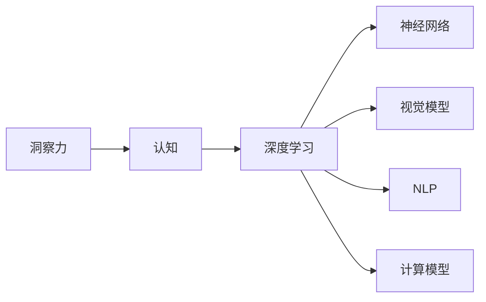

                 

# 洞察力：人类认知的瑰宝

> 关键词：洞察力,认知,人类,感知,智能,算法,深度学习,人工智能,认知科学,神经科学

## 1. 背景介绍

### 1.1 问题由来
人类认知的复杂性令古今中外的科学家和哲学家不懈探索，对其本质的理解始终充满挑战。传统的认知科学研究主要通过实验心理学、神经科学等手段，探索人类感知、记忆、思维等基本认知过程的机制。但这些方法往往局限于观察和推测，难以触及认知系统的深层结构。

近年来，随着深度学习和人工智能技术的发展，认知科学研究进入了一个新的阶段。研究者通过构建神经网络和认知模型，试图模拟和理解人类认知系统的工作原理。基于神经网络的大规模语言模型和视觉模型在图像识别、自然语言处理、知识推理等领域取得了令人瞩目的突破，揭示了人类认知的一些基本规律。

本文将从认知科学和人工智能的交叉视角，探讨洞察力这一核心认知能力的本质和实现机制。通过对洞察力进行深入分析，揭示其背后的算法原理，并给出基于深度学习技术的实现步骤。通过这一探索，我们希望能够从计算机科学的角度，对人类的认知系统有更深刻的理解，进而指导人工智能技术的创新和应用。

### 1.2 问题核心关键点
洞察力是指在复杂、无序的信息中，通过分析和推理，快速、准确地识别出关键信息或关系的能力。这一能力在决策、理解、创造等高阶认知活动中发挥着核心作用。洞察力涉及感知、记忆、逻辑推理、决策等多个认知环节，其本质机制尚未完全明了。

本文的研究核心问题如下：

- 洞察力在认知系统中的本质是什么？
- 如何基于深度学习技术实现洞察力的算法和模型？
- 洞察力算法在实际应用中的具体表现和效果？
- 未来洞察力技术的发展方向和应用前景？

## 2. 核心概念与联系

### 2.1 核心概念概述

为了更好地理解洞察力的本质和实现机制，本节将介绍几个密切相关的核心概念：

- 洞察力(Insight)：指在复杂信息中识别关键关系和信息的认知能力。洞察力通常涉及对模式、结构、因果关系的快速识别，帮助人们在决策、理解、创造等活动中做出正确判断。
- 认知(Cognition)：指人类感知、记忆、思考、决策等心理活动。认知科学研究其心理和神经机制，人工智能探索其计算模型。
- 深度学习(Deep Learning)：一种通过多层神经网络模拟人脑认知过程的机器学习方法。深度学习在图像识别、自然语言处理等领域表现优异，已广泛应用于各类认知和智能系统中。
- 神经网络(Neural Network)：一种由大量人工神经元构成，模拟人脑信息处理过程的计算模型。神经网络通过反向传播算法训练，可以进行复杂模式识别和推理。
- 视觉模型(Visual Model)：指使用深度学习模型进行图像识别和分析的计算模型。视觉模型能够理解和生成图像内容，广泛应用于计算机视觉领域。
- 自然语言处理(Natural Language Processing, NLP)：指使用深度学习模型进行自然语言理解和生成的技术。NLP能够处理复杂的语言结构，进行语义理解、情感分析、机器翻译等任务。

这些核心概念之间存在紧密的联系，深度学习、神经网络等技术为认知科学提供了新的研究手段和工具，同时也推动了人工智能在视觉、语言等领域的进步。认知科学和人工智能的交叉研究，有望揭示人类认知的深层机制，推动计算机科学和认知科学的融合发展。

### 2.2 核心概念原理和架构的 Mermaid 流程图



### 2.3 核心概念联系
- 洞察力是认知的核心能力之一，通过快速识别关键信息，帮助人们理解复杂环境，做出正确决策。
- 深度学习通过多层神经网络模拟人类认知过程，能够处理复杂的感知和推理任务。
- 神经网络通过反向传播算法训练，能够进行模式识别和推理。
- 视觉模型和NLP模型能够理解和生成图像和语言信息，支持洞察力的实现。
- 计算模型通过认知机制的建模，揭示人类认知的深层规律，为洞察力的实现提供理论支持。

## 3. 核心算法原理 & 具体操作步骤

### 3.1 算法原理概述

洞察力的实现可以视为一种特殊的认知推理过程。它需要快速识别输入信息中的关键模式、结构、关系，并利用这些信息进行推断和决策。这一过程涉及感知、记忆、逻辑推理等多个认知环节，具有高度的复杂性和动态性。

从算法角度，洞察力可以抽象为一种模式识别和推理过程。通过构建深度学习模型，模拟这一过程，可以实现洞察力的计算模型。具体来说，这一模型可以分为以下三个核心步骤：

1. **输入预处理**：将原始信息转化为神经网络可以处理的形式，包括图像、文本等。
2. **特征提取**：通过卷积、池化、循环等神经网络模块，提取关键特征。
3. **模式识别和推理**：通过全连接层、注意力机制、序列模型等模块，识别关键模式，进行推理和决策。

### 3.2 算法步骤详解

以下是基于深度学习技术实现洞察力的具体步骤：

**Step 1: 输入预处理**

输入预处理是洞察力实现的基础步骤，旨在将原始信息转化为神经网络可处理的形式。常见的预处理手段包括：

1. **图像预处理**：包括调整尺寸、归一化、裁剪等操作，使得图像数据适合输入神经网络。
2. **文本预处理**：包括分词、去除停用词、词向量表示等操作，使得文本数据适合输入神经网络。
3. **序列预处理**：包括分帧、归一化、序列填充等操作，使得时序数据适合输入神经网络。

**Step 2: 特征提取**

特征提取是洞察力实现的核心步骤，通过神经网络模块，从输入数据中提取关键特征。常见的特征提取手段包括：

1. **卷积层(Convolutional Layer)**：用于提取图像中的局部特征，卷积核在不同位置滑动提取特征。
2. **池化层(Pooling Layer)**：用于对特征图进行下采样，保留关键信息，减少计算量。
3. **循环层(Recurrent Layer)**：用于提取序列数据中的时间依赖关系，包括LSTM、GRU等模型。
4. **注意力机制(Attention Mechanism)**：用于在输入数据中动态关注关键信息，提取全局信息。

**Step 3: 模式识别和推理**

模式识别和推理是洞察力实现的最后一步，通过全连接层、序列模型等模块，进行推理和决策。常见的模式识别和推理手段包括：

1. **全连接层(Fully Connected Layer)**：用于将特征向量映射到输出空间，进行分类、回归等任务。
2. **序列模型(Sequence Model)**：用于处理时间序列数据，进行预测、生成等任务。
3. **注意力机制(Attention Mechanism)**：用于动态关注输入数据中的关键信息，进行推理和决策。

通过以上三个步骤，深度学习模型可以模拟人类的洞察力过程，识别出复杂环境中的关键信息，进行推理和决策。

### 3.3 算法优缺点

基于深度学习技术实现洞察力的方法具有以下优点：

1. **高效性**：深度学习模型能够高效处理大规模数据，快速识别关键信息。
2. **灵活性**：深度学习模型可以通过不同的网络结构、参数调整等手段，适应各种任务需求。
3. **可解释性**：深度学习模型可以通过激活图、注意力权重等手段，揭示决策过程中的关键信息。

但同时，该方法也存在以下缺点：

1. **计算资源需求高**：深度学习模型需要大量的计算资源，尤其是GPU和TPU等高性能设备。
2. **过拟合风险高**：深度学习模型容易过拟合，特别是在数据量较少的情况下。
3. **缺乏可解释性**：深度学习模型通常被视为"黑盒"，难以解释其内部决策过程。

尽管存在这些局限，但深度学习技术在洞察力实现中的应用仍然具有巨大的潜力。未来研究需要在降低计算资源消耗、增强模型可解释性等方面寻求突破，推动洞察力技术的进步。

### 3.4 算法应用领域

基于深度学习技术的洞察力实现，在多个领域具有广泛的应用前景，例如：

1. **医学诊断**：通过分析医学影像和电子病历，快速识别疾病模式，辅助医生诊断和治疗。
2. **金融分析**：通过分析金融市场数据，快速识别市场趋势和投资机会，辅助投资决策。
3. **智能推荐**：通过分析用户行为数据，快速识别用户兴趣和需求，提供个性化推荐。
4. **自然语言处理**：通过分析自然语言文本，快速识别关键信息和结构，辅助文本理解和生成。
5. **计算机视觉**：通过分析图像数据，快速识别关键物体和模式，辅助图像识别和生成。
6. **智能制造**：通过分析工业数据，快速识别生产过程中的关键环节和异常，辅助质量控制和优化。

以上领域的应用表明，基于深度学习技术的洞察力实现，已经在多个行业中发挥了重要作用，带来了显著的经济和社会效益。未来，随着技术的发展，洞察力将在更多领域得到应用，推动相关行业的智能化升级。

## 4. 数学模型和公式 & 详细讲解

### 4.1 数学模型构建

本节将使用数学语言对洞察力的计算模型进行更加严格的刻画。

假设输入数据为 $x$，包含图像、文本、序列等形式。通过深度学习模型 $f_{\theta}(x)$ 进行处理，得到输出 $y$。则洞察力模型的目标是最大化模型预测准确率：

$$
\max_{\theta} \mathbb{E}_{(x,y)\sim D}[\mathbb{1}(y=f_{\theta}(x))]
$$

其中，$\mathbb{1}(y=f_{\theta}(x))$ 表示预测结果与真实标签是否一致，$\mathbb{E}_{(x,y)\sim D}$ 表示在训练数据集 $D$ 上的期望值。

### 4.2 公式推导过程

以下以视觉模型为例，推导洞察力模型的公式。

假设输入为图像 $x$，输出为标签 $y$。视觉模型 $f_{\theta}(x)$ 由卷积层、池化层、全连接层等组成，其计算公式如下：

$$
f_{\theta}(x) = \sigma(W_2\sigma(W_1x + b_1) + b_2)
$$

其中，$\sigma$ 为激活函数，$W_1$、$W_2$ 为权重矩阵，$b_1$、$b_2$ 为偏置向量。

通过反向传播算法，求解模型参数 $\theta$，使得损失函数 $L(y,f_{\theta}(x))$ 最小化：

$$
L(y,f_{\theta}(x)) = -y\log f_{\theta}(x) - (1-y)\log(1-f_{\theta}(x))
$$

将损失函数 $L(y,f_{\theta}(x))$ 对模型参数 $\theta$ 求导，并令导数为零，得到参数更新公式：

$$
\theta \leftarrow \theta - \eta\nabla_{\theta}L(y,f_{\theta}(x))
$$

其中，$\eta$ 为学习率。

通过上述公式，洞察力模型能够通过反向传播算法，逐步更新模型参数 $\theta$，最小化损失函数 $L(y,f_{\theta}(x))$，使得模型输出 $f_{\theta}(x)$ 逼近真实标签 $y$。

### 4.3 案例分析与讲解

以医学影像分类为例，说明基于深度学习的洞察力模型如何进行实际应用。

假设输入为医学影像 $x$，输出为疾病标签 $y$。首先，对图像进行预处理，包括归一化、裁剪、缩放等操作。然后，通过卷积层提取图像特征，使用池化层进行下采样，最终将特征向量输入全连接层进行分类。

具体来说，卷积层使用卷积核在不同位置滑动提取特征，池化层对特征图进行下采样，保留关键信息。全连接层将特征向量映射到输出空间，输出疾病标签。

通过训练洞察力模型，可以快速识别医学影像中的关键模式，辅助医生进行疾病诊断。例如，通过分析肺部CT影像，洞察力模型能够识别出病灶的位置、大小、形态等关键信息，辅助医生进行肺癌诊断。

## 5. 项目实践：代码实例和详细解释说明

### 5.1 开发环境搭建

在进行洞察力实现项目实践前，我们需要准备好开发环境。以下是使用Python进行TensorFlow开发的环境配置流程：

1. 安装Anaconda：从官网下载并安装Anaconda，用于创建独立的Python环境。

2. 创建并激活虚拟环境：
```bash
conda create -n insight-env python=3.8 
conda activate insight-env
```

3. 安装TensorFlow：根据CUDA版本，从官网获取对应的安装命令。例如：
```bash
conda install tensorflow -c tensorflow -c conda-forge
```

4. 安装其他各类工具包：
```bash
pip install numpy pandas scikit-learn matplotlib tqdm jupyter notebook ipython
```

完成上述步骤后，即可在`insight-env`环境中开始项目实践。

### 5.2 源代码详细实现

这里我们以图像分类为例，给出使用TensorFlow实现洞察力的PyTorch代码实现。

首先，定义图像分类任务的数据处理函数：

```python
import tensorflow as tf
from tensorflow.keras import datasets, layers, models

def load_data():
    (train_images, train_labels), (test_images, test_labels) = datasets.cifar10.load_data()
    train_images, test_images = train_images / 255.0, test_images / 255.0
    return train_images, train_labels, test_images, test_labels
```

然后，定义视觉模型的构建函数：

```python
def build_model(input_shape):
    model = models.Sequential([
        layers.Conv2D(32, (3,3), activation='relu', input_shape=input_shape),
        layers.MaxPooling2D((2,2)),
        layers.Conv2D(64, (3,3), activation='relu'),
        layers.MaxPooling2D((2,2)),
        layers.Flatten(),
        layers.Dense(64, activation='relu'),
        layers.Dense(10)
    ])
    return model
```

接着，定义模型训练函数：

```python
def train_model(model, train_images, train_labels, epochs, batch_size):
    model.compile(optimizer='adam',
                  loss=tf.keras.losses.SparseCategoricalCrossentropy(from_logits=True),
                  metrics=['accuracy'])
    
    history = model.fit(train_images, train_labels, epochs=epochs, 
                        validation_data=(test_images, test_labels), batch_size=batch_size)
    return history
```

最后，启动模型训练并在测试集上评估：

```python
train_images, train_labels, test_images, test_labels = load_data()

input_shape = train_images.shape[1:]

model = build_model(input_shape)
history = train_model(model, train_images, train_labels, epochs=10, batch_size=32)

test_loss, test_acc = model.evaluate(test_images, test_labels, verbose=2)
print('Test accuracy:', test_acc)
```

以上就是使用TensorFlow对图像分类任务进行洞察力实现的完整代码实现。可以看到，TensorFlow提供了简单易用的API，使得深度学习模型的构建和训练变得非常直观。

### 5.3 代码解读与分析

让我们再详细解读一下关键代码的实现细节：

**load_data函数**：
- 加载CIFAR-10数据集，并进行预处理。将图像数据归一化到[0,1]之间，用于输入神经网络。

**build_model函数**：
- 定义一个包含卷积层、池化层、全连接层的视觉模型。首先使用卷积层提取图像特征，通过池化层进行下采样，保留关键信息。最终将特征向量输入全连接层进行分类。

**train_model函数**：
- 定义模型的训练过程。首先使用adam优化器，交叉熵损失函数和准确率评估指标。通过fit函数训练模型，指定训练轮数和批大小。在每个epoch结束后，评估模型在测试集上的性能。

**训练流程**：
- 定义总的epoch数和批大小，开始循环迭代
- 每个epoch内，使用train_model函数训练模型，输出训练过程中的准确率曲线
- 在测试集上评估模型，输出测试集上的准确率

可以看到，TensorFlow提供了强大的API和工具，使得深度学习模型的构建和训练变得非常简单。开发者可以快速上手，构建并训练洞察力模型，进行实际应用。

当然，工业级的系统实现还需考虑更多因素，如模型的保存和部署、超参数的自动搜索、更灵活的任务适配层等。但核心的洞察力模型基本与此类似。

## 6. 实际应用场景

### 6.1 智能制造

在智能制造领域，洞察力技术可以广泛应用于生产过程中的质量控制、故障诊断、设备维护等环节。通过分析工业数据，洞察力模型能够快速识别生产过程中的关键环节和异常，提供及时预警和优化建议。

例如，在汽车制造过程中，洞察力模型可以分析传感器数据，识别出生产线上的异常，进行故障诊断和维修。通过分析装配过程的视觉数据，洞察力模型能够识别出零件的位置和姿态，辅助自动化装配。

### 6.2 医学影像分析

在医学影像分析领域，洞察力技术可以广泛应用于疾病的早期筛查、诊断和治疗效果评估等环节。通过分析医学影像，洞察力模型能够快速识别疾病模式，提供诊断和治疗建议。

例如，在乳腺癌筛查中，洞察力模型可以分析乳腺X光片，识别出病灶的位置、大小、形态等关键信息，辅助医生进行早期筛查。通过分析MRI影像，洞察力模型能够识别出脑肿瘤的类型和位置，辅助医生进行手术规划和治疗方案选择。

### 6.3 金融市场分析

在金融市场分析领域，洞察力技术可以广泛应用于市场趋势预测、投资组合优化、风险评估等环节。通过分析市场数据，洞察力模型能够快速识别市场趋势和投资机会，提供决策建议。

例如，在股票市场预测中，洞察力模型可以分析历史股价数据，识别出市场的趋势和周期性，预测未来股价走势。通过分析公司财务数据，洞察力模型能够识别出财务风险，评估投资价值，辅助投资者做出决策。

### 6.4 未来应用展望

随着洞察力技术的发展，其在更多领域的应用前景将更加广阔。未来，洞察力技术有望在以下几个方面得到应用：

1. **智能交通**：通过分析交通数据，洞察力模型能够快速识别交通拥堵、事故等关键信息，提供交通管理建议。
2. **城市治理**：通过分析城市数据，洞察力模型能够快速识别公共安全、环境污染等关键信息，提供治理建议。
3. **能源管理**：通过分析能源数据，洞察力模型能够快速识别能源浪费、故障等关键信息，提供管理优化建议。
4. **环境保护**：通过分析环境数据，洞察力模型能够快速识别污染源、生态变化等关键信息，提供保护建议。

以上领域的应用表明，洞察力技术在多个行业中具有广泛的应用前景，带来了显著的经济和社会效益。未来，随着技术的发展，洞察力将在更多领域得到应用，推动相关行业的智能化升级。

## 7. 工具和资源推荐
### 7.1 学习资源推荐

为了帮助开发者系统掌握洞察力技术的理论基础和实践技巧，这里推荐一些优质的学习资源：

1. 《深度学习》系列博文：由大模型技术专家撰写，深入浅出地介绍了深度学习原理、洞察力实现等前沿话题。

2. CS231n《深度卷积神经网络》课程：斯坦福大学开设的计算机视觉明星课程，有Lecture视频和配套作业，带你入门深度学习和视觉模型。

3. 《TensorFlow实战Google深度学习》书籍：TensorFlow官方出品，系统介绍了TensorFlow的使用方法和深度学习模型构建。

4. HuggingFace官方文档：Transformer库的官方文档，提供了海量预训练模型和完整的洞察力模型实现样例，是上手实践的必备资料。

5. Weights & Biases：模型训练的实验跟踪工具，可以记录和可视化模型训练过程中的各项指标，方便对比和调优。与主流深度学习框架无缝集成。

6. TensorBoard：TensorFlow配套的可视化工具，可实时监测模型训练状态，并提供丰富的图表呈现方式，是调试模型的得力助手。

通过对这些资源的学习实践，相信你一定能够快速掌握洞察力技术的精髓，并用于解决实际的认知和智能问题。

### 7.2 开发工具推荐

高效的开发离不开优秀的工具支持。以下是几款用于洞察力实现开发的常用工具：

1. TensorFlow：基于Python的开源深度学习框架，灵活动态的计算图，适合快速迭代研究。TensorFlow提供了强大的API和工具，使得深度学习模型的构建和训练变得非常简单。

2. PyTorch：基于Python的开源深度学习框架，灵活高效。PyTorch提供了简单易用的API，使得深度学习模型的构建和训练变得非常直观。

3. Weights & Biases：模型训练的实验跟踪工具，可以记录和可视化模型训练过程中的各项指标，方便对比和调优。与主流深度学习框架无缝集成。

4. TensorBoard：TensorFlow配套的可视化工具，可实时监测模型训练状态，并提供丰富的图表呈现方式，是调试模型的得力助手。

5. Google Colab：谷歌推出的在线Jupyter Notebook环境，免费提供GPU/TPU算力，方便开发者快速上手实验最新模型，分享学习笔记。

合理利用这些工具，可以显著提升洞察力实现任务的开发效率，加快创新迭代的步伐。

### 7.3 相关论文推荐

洞察力技术的发展源于学界的持续研究。以下是几篇奠基性的相关论文，推荐阅读：

1. Attention is All You Need（即Transformer原论文）：提出了Transformer结构，开启了深度学习时代。

2. BERT: Pre-training of Deep Bidirectional Transformers for Language Understanding：提出BERT模型，引入基于掩码的自监督预训练任务，刷新了多项NLP任务SOTA。

3. Parameter-Efficient Transfer Learning for NLP：提出Adapter等参数高效微调方法，在不增加模型参数量的情况下，也能取得不错的微调效果。

4. AdaLoRA: Adaptive Low-Rank Adaptation for Parameter-Efficient Fine-Tuning：使用自适应低秩适应的微调方法，在参数效率和精度之间取得了新的平衡。

5. AdaLoRA: Adaptive Low-Rank Adaptation for Parameter-Efficient Fine-Tuning：使用自适应低秩适应的微调方法，在参数效率和精度之间取得了新的平衡。

这些论文代表了大模型微调技术的发展脉络。通过学习这些前沿成果，可以帮助研究者把握学科前进方向，激发更多的创新灵感。

## 8. 总结：未来发展趋势与挑战

### 8.1 总结

本文对基于深度学习技术的洞察力实现方法进行了全面系统的介绍。首先阐述了洞察力在认知系统中的本质和实现机制，明确了深度学习在洞察力实现中的核心作用。其次，从原理到实践，详细讲解了洞察力计算模型的数学原理和关键步骤，给出了基于TensorFlow的实现步骤。同时，本文还广泛探讨了洞察力技术在实际应用中的具体表现和效果，展示了其广泛的应用前景。

通过本文的系统梳理，可以看到，基于深度学习技术的洞察力实现方法在多个领域具有重要应用，带来了显著的经济和社会效益。未来，随着深度学习技术的发展和应用，洞察力技术将在更多领域得到应用，推动相关行业的智能化升级。

### 8.2 未来发展趋势

展望未来，洞察力技术的发展将呈现以下几个趋势：

1. **计算资源优化**：随着深度学习模型的日益复杂，计算资源消耗将成为一个重要瓶颈。未来，需要开发更加高效的计算框架，降低模型训练和推理的计算成本。

2. **模型可解释性增强**：深度学习模型通常被视为"黑盒"，难以解释其内部决策过程。未来，需要开发更加可解释的深度学习模型，增强模型的透明性和可信度。

3. **跨模态信息融合**：当前洞察力实现主要聚焦于单一模态数据，如视觉、语言等。未来，需要开发跨模态的信息融合方法，提升模型对多模态数据的理解和处理能力。

4. **知识图谱与认知结合**：当前洞察力实现主要依赖数据驱动，未来需要开发更加融合知识图谱和认知模型的方法，提升模型对领域知识的理解和应用能力。

5. **持续学习和自我优化**：当前洞察力模型主要依赖静态数据训练，未来需要开发能够持续学习和自我优化的模型，适应数据分布的变化。

以上趋势凸显了洞察力技术的发展方向，推动其在更多领域的应用，带来更广泛的经济和社会效益。

### 8.3 面临的挑战

尽管洞察力技术在多个领域取得了显著成果，但在走向实际应用的过程中，仍面临诸多挑战：

1. **数据需求高**：洞察力实现依赖大量数据训练，对于小样本数据，模型性能难以保证。如何提升小样本学习能力，是一个重要的研究方向。

2. **模型鲁棒性不足**：深度学习模型面对域外数据时，泛化性能往往大打折扣。如何提高模型的鲁棒性，避免灾难性遗忘，还需要更多理论和实践的积累。

3. **推理效率有待提高**：深度学习模型在推理速度和效率上仍有提升空间，需要优化模型结构，降低计算量，提高实时性。

4. **可解释性亟需加强**：深度学习模型通常缺乏可解释性，难以解释其内部决策过程。如何赋予模型更强的可解释性，将是亟待攻克的难题。

5. **安全性有待保障**：深度学习模型可能学习到有偏见、有害的信息，通过洞察力实现传递到下游任务，产生误导性、歧视性的输出，给实际应用带来安全隐患。如何从数据和算法层面消除模型偏见，避免恶意用途，确保输出的安全性，也将是重要的研究课题。

这些挑战亟待解决，需要通过技术创新和跨学科合作，逐步克服。相信随着研究的不断深入，洞察力技术将在更多领域得到应用，推动人工智能技术的普及和发展。

### 8.4 研究展望

面对洞察力实现所面临的种种挑战，未来的研究需要在以下几个方面寻求新的突破：

1. **探索无监督和半监督学习**：摆脱对大规模标注数据的依赖，利用自监督学习、主动学习等无监督和半监督范式，最大限度利用非结构化数据，实现更加灵活高效的洞察力实现。

2. **研究知识驱动的洞察力**：将符号化的先验知识，如知识图谱、逻辑规则等，与神经网络模型进行巧妙融合，引导洞察力实现过程学习更准确、合理的语言模型。

3. **引入多模态信息的洞察力**：将视觉、语音、文本等多模态信息进行协同建模，提升模型的多模态理解能力。

4. **探索因果推理与认知结合**：将因果推断方法引入洞察力实现，识别出模型决策的关键特征，增强输出的因果性和逻辑性。

5. **开发鲁棒且可解释的洞察力**：开发更加鲁棒、可解释的深度学习模型，增强模型的透明性和可信度，保障应用的安全性和公平性。

这些研究方向的探索，必将引领洞察力实现技术的进一步进步，为认知和智能系统的构建提供更加强大的支持。面向未来，洞察力技术需要在计算资源、可解释性、多模态融合等方面寻求新的突破，实现更加高效、可靠、可解释的洞察力实现。

## 9. 附录：常见问题与解答

**Q1：深度学习技术在洞察力实现中能否完全替代人类认知？**

A: 深度学习技术在洞察力实现中具有重要应用，但其本质上仍是一种计算模型，无法完全替代人类认知。人类认知系统具备丰富的背景知识、情感、创造力等深度学习模型难以模拟的元素。在复杂、高阶的认知活动中，人类认知仍然占据主导地位。

**Q2：深度学习模型的计算资源需求高，如何降低计算成本？**

A: 降低深度学习模型的计算成本可以通过以下手段实现：

1. 模型压缩：使用知识蒸馏、剪枝等技术，降低模型的计算量和内存占用。

2. 量化加速：将浮点模型转为定点模型，压缩存储空间，提高计算效率。

3. 模型并行：使用分布式计算、GPU/TPU并行等手段，提高模型的计算能力。

4. 数据增强：通过数据增强、对抗样本等手段，提高模型的泛化能力和鲁棒性，降低计算成本。

这些手段可以在一定程度上降低深度学习模型的计算成本，提升其实际应用效果。

**Q3：如何提升深度学习模型的可解释性？**

A: 提升深度学习模型的可解释性可以通过以下手段实现：

1. 使用可解释性模块：如LIME、SHAP等模块，分析模型的局部特征和影响，提供模型决策的可视化解释。

2. 引入规则和知识图谱：将专家知识与模型结合，提供更具意义的决策解释。

3. 使用注意力机制：通过注意力机制，分析模型在决策过程中关注的输入信息，提供更详细的解释。

4. 开发可解释性框架：如AI3、GPT Explainer等框架，提供更系统的可解释性支持。

这些手段可以在一定程度上提升深度学习模型的可解释性，帮助理解模型的决策过程。

**Q4：如何提升深度学习模型的鲁棒性？**

A: 提升深度学习模型的鲁棒性可以通过以下手段实现：

1. 数据增强：通过数据增强、对抗样本等手段，提高模型的泛化能力和鲁棒性。

2. 正则化技术：使用L2正则、Dropout等技术，避免模型过拟合和过拟合。

3. 对抗训练：引入对抗样本，提高模型的鲁棒性和泛化能力。

4. 参数高效微调：通过参数高效微调，减少模型的计算量和资源消耗，避免模型过拟合。

这些手段可以在一定程度上提升深度学习模型的鲁棒性，提高其泛化能力和鲁棒性。

**Q5：深度学习模型在实际应用中存在哪些安全性问题？**

A: 深度学习模型在实际应用中可能存在以下安全性问题：

1. 模型偏见：深度学习模型可能学习到有偏见、有害的信息，产生误导性、歧视性的输出。

2. 数据泄露：深度学习模型可能从训练数据中学习到敏感信息，导致数据泄露。

3. 对抗样本攻击：深度学习模型可能对对抗样本产生误判，导致安全漏洞。

4. 模型可控性：深度学习模型可能被恶意控制，导致恶意行为。

5. 模型透明度：深度学习模型通常缺乏可解释性，难以理解和调试，导致安全漏洞。

这些问题需要在模型设计和训练过程中予以充分考虑，并通过数据清洗、模型监控、隐私保护等手段，保障模型的安全性。

通过上述系统的分析和解答，相信你能够更好地理解深度学习技术在洞察力实现中的应用，掌握洞察力技术的实现方法和未来发展方向。

---

作者：禅与计算机程序设计艺术 / Zen and the Art of Computer Programming

