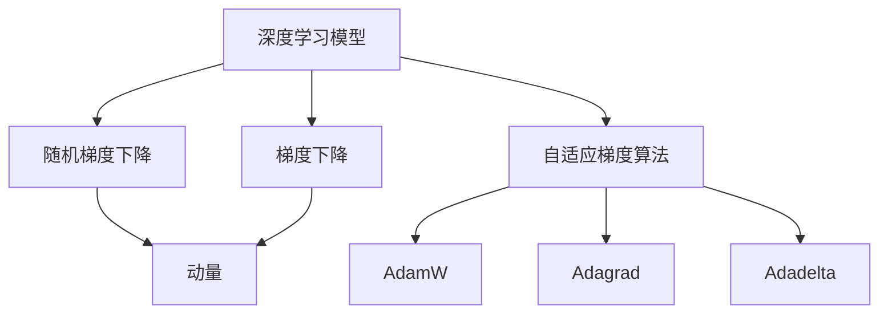

                 

# 深度学习优化算法：从初始化到AdamW

> 关键词：深度学习, 优化算法, 初始化, 梯度下降, AdamW, 学习率, 超参数, 学习率衰减, 自适应, 优化器

## 1. 背景介绍

### 1.1 问题由来

深度学习的发展依赖于优化的进步，高效的优化算法能够极大地提升模型的训练速度和收敛稳定性。在深度学习模型的训练过程中，优化算法的选择和参数配置对模型的性能和训练效果有着至关重要的影响。本文将系统介绍深度学习中常用的优化算法，以及它们的基本原理、实现步骤和应用场景。特别地，我们将聚焦于AdamW优化器，分析其优点、缺点及应用领域，以期为读者提供全面的指导。

### 1.2 问题核心关键点

深度学习模型的优化算法，是机器学习中最为核心的技术之一。优化算法通过计算梯度，调整模型参数，使得损失函数最小化。常见的优化算法包括梯度下降(GD)、随机梯度下降(SGD)、动量(Momentum)、自适应梯度算法(Adagrad、Adadelta、Adam等)。其中，Adam算法以其高效性和稳定性，成为目前最常用的优化算法。本文将从基本优化算法原理出发，逐步深入到AdamW优化器，并分析其优化效果和应用场景。

### 1.3 问题研究意义

掌握深度学习优化算法，对于提升模型训练效果、加快模型开发进度具有重要意义。优化的目标，不仅是更快地找到损失函数的最小值，还应兼顾模型的稳定性、泛化性能和计算效率。AdamW优化器作为优化的新宠，因其自适应和鲁棒性而被广泛应用。在实际应用中，通过合理选择和配置优化器，可以大幅提升模型的训练效率和性能，从而加速AI技术的落地应用。

## 2. 核心概念与联系

### 2.1 核心概念概述

为更好地理解优化算法的工作原理，本节将介绍几个密切相关的核心概念：

- **深度学习模型**：由多层神经网络组成的模型，通过反向传播算法计算梯度，调整参数，使得损失函数最小化。
- **梯度下降**：一种基于导数信息的优化算法，通过不断迭代调整模型参数，减小损失函数。
- **随机梯度下降(SGD)**：每次使用一个样本计算梯度，更新模型参数，降低计算成本，但可能导致收敛过程不稳定。
- **动量(Momentum)**：引入动量项，加速收敛过程，避免在平坦区域震荡。
- **自适应梯度算法(Adagrad, Adadelta, Adam等)**：自适应地调整每个参数的学习率，实现更高效的收敛。

### 2.2 核心概念原理和架构的 Mermaid 流程图(Mermaid 流程节点中不要有括号、逗号等特殊字符)


## 3. 核心算法原理 & 具体操作步骤
### 3.1 算法原理概述

自适应梯度算法通过动态调整每个参数的学习率，使得梯度较大的参数学习率较小，梯度较小的参数学习率较大，从而提高训练效率和稳定性。常见的自适应梯度算法包括Adagrad、Adadelta、Adam等。Adam算法由Kingma和Bengio提出，结合了动量和自适应梯度的优点，成为当前最流行的优化算法之一。

### 3.2 算法步骤详解

Adam算法具体步骤如下：
1. 初始化参数 $\theta$ 和动量项 $\text{mv}=\text{mv}_0=\textbf{0}$。
2. 计算梯度 $\text{g}_t = \nabla_{\theta} \mathcal{L}(\theta)$。
3. 更新动量项：$\text{mv}_t = \beta_1\text{mv}_{t-1} + (1-\beta_1)g_t$。
4. 计算偏差修正项：$\hat{g}_t = \frac{g_t}{1-\beta_1^t}$。
5. 更新参数：$\theta_t = \theta_{t-1} - \frac{\eta \hat{g}_t}{\sqrt{\text{mv}_t + \epsilon}}$。

其中，$\beta_1$ 和 $\beta_2$ 是动量和偏差修正项的衰减系数，通常取值为 $0.9$ 和 $0.999$。$\eta$ 为学习率，$\epsilon$ 为数值稳定性项，一般取一个很小的值，如 $10^{-8}$。

### 3.3 算法优缺点

Adam算法的主要优点包括：
1. 高效性：结合动量和自适应梯度的优点，收敛速度较快。
2. 稳定性：自适应地调整每个参数的学习率，避免了因梯度衰减过快导致的震荡。
3. 鲁棒性：通过偏差修正项，消除了动量项的累积误差，提高了算法的稳定性。

Adam算法的主要缺点包括：
1. 内存占用大：需要额外存储动量项和偏差修正项，增加了内存开销。
2. 参数初始化敏感：对学习率和动量项的初始值较为敏感，需要精细调参。
3. 对大批量数据适应性差：对于超大规模数据集，可能会出现计算资源不足的情况。

### 3.4 算法应用领域

Adam算法因其高效和稳定，广泛应用于图像识别、自然语言处理、语音识别等多个领域。特别地，AdamW算法通过权重衰减和截断范数，进一步提升了Adam算法的性能，适用于更大规模的深度学习任务。

## 4. 数学模型和公式 & 详细讲解 & 举例说明

### 4.1 数学模型构建

AdamW算法的基本原理与Adam算法类似，但增加了权重衰减和截断范数，以避免梯度爆炸。

令 $\theta$ 为模型参数，$\text{mv}_t$ 为动量项，$\eta_t$ 为学习率，$\epsilon$ 为数值稳定性项，$\lambda$ 为权重衰减系数。AdamW算法的更新公式为：

$$
\theta_{t+1} = \theta_t - \frac{\eta_t}{\sqrt{\text{mv}_t + \epsilon}}\left(\hat{g}_t + \frac{\lambda}{\beta_2}(\theta_t - \theta_{t-1})\right)
$$

其中，$\hat{g}_t$ 为偏差修正项，$\text{mv}_t$ 为动量项，$g_t$ 为梯度项。

### 4.2 公式推导过程

AdamW算法在Adam算法的基础上，增加了一个截断范数项，用于限制梯度的大小。推导过程如下：

1. 计算梯度 $\text{g}_t = \nabla_{\theta} \mathcal{L}(\theta)$。
2. 更新动量项：$\text{mv}_t = \beta_1\text{mv}_{t-1} + (1-\beta_1)g_t$。
3. 计算偏差修正项：$\hat{g}_t = \frac{g_t}{1-\beta_1^t}$。
4. 更新参数：$\theta_t = \theta_{t-1} - \frac{\eta_t \hat{g}_t}{\sqrt{\text{mv}_t + \epsilon}}$。

在AdamW算法中，截断范数项 $\frac{\lambda}{\beta_2}(\theta_t - \theta_{t-1})$ 用于限制梯度大小，防止梯度爆炸。其中，$\lambda$ 为权重衰减系数，$\beta_2$ 为动量项衰减系数。

### 4.3 案例分析与讲解

以手写数字识别任务为例，分析AdamW算法的应用。

1. 首先，收集MNIST手写数字数据集，并进行数据预处理。
2. 定义深度卷积神经网络模型，包含卷积层、池化层、全连接层等。
3. 使用AdamW算法进行模型训练，设置学习率 $\eta=0.001$，动量项衰减系数 $\beta_1=0.9$，动量项衰减系数 $\beta_2=0.999$，权重衰减系数 $\lambda=0.001$。
4. 在训练过程中，动态调整学习率，防止过拟合。
5. 评估模型在测试集上的准确率，并对比其他优化算法的效果。

## 5. 项目实践：代码实例和详细解释说明
### 5.1 开发环境搭建

在进行优化算法实践前，我们需要准备好开发环境。以下是使用Python进行TensorFlow开发的环境配置流程：

1. 安装Anaconda：从官网下载并安装Anaconda，用于创建独立的Python环境。

2. 创建并激活虚拟环境：
```bash
conda create -n tf-env python=3.8 
conda activate tf-env
```

3. 安装TensorFlow：根据CUDA版本，从官网获取对应的安装命令。例如：
```bash
conda install tensorflow -c tf -c conda-forge
```

4. 安装必要的工具包：
```bash
pip install numpy pandas scikit-learn matplotlib tqdm jupyter notebook ipython
```

完成上述步骤后，即可在`tf-env`环境中开始优化算法实践。

### 5.2 源代码详细实现

下面我们以手写数字识别任务为例，给出使用TensorFlow实现AdamW优化的完整代码实现。

首先，定义模型和优化器：

```python
import tensorflow as tf
from tensorflow.keras import layers

model = tf.keras.Sequential([
    layers.Conv2D(32, (3, 3), activation='relu', input_shape=(28, 28, 1)),
    layers.MaxPooling2D((2, 2)),
    layers.Flatten(),
    layers.Dense(128, activation='relu'),
    layers.Dense(10, activation='softmax')
])

optimizer = tf.keras.optimizers.AdamW(lr=0.001, decay=0.001, clipnorm=1.0)
```

接着，定义训练和评估函数：

```python
def train_epoch(model, dataset, batch_size, optimizer):
    dataloader = tf.data.Dataset.from_tensor_slices(dataset)
    dataloader = dataloader.batch(batch_size, drop_remainder=True).shuffle(buffer_size=1024).repeat()
    model.compile(optimizer=optimizer, loss='sparse_categorical_crossentropy', metrics=['accuracy'])
    model.fit(dataloader, epochs=1, validation_split=0.2)
    
def evaluate(model, dataset, batch_size):
    dataloader = tf.data.Dataset.from_tensor_slices(dataset)
    dataloader = dataloader.batch(batch_size, drop_remainder=True).shuffle(buffer_size=1024).repeat()
    model.evaluate(dataloader, verbose=0)
```

最后，启动训练流程并在测试集上评估：

```python
epochs = 10
batch_size = 128

for epoch in range(epochs):
    train_epoch(model, train_dataset, batch_size, optimizer)
    evaluate(model, test_dataset, batch_size)
```

以上就是使用TensorFlow实现AdamW优化的完整代码实现。可以看到，TensorFlow提供了强大的自动微分和优化器封装功能，使得优化算法的实现变得简洁高效。

### 5.3 代码解读与分析

让我们再详细解读一下关键代码的实现细节：

**定义模型和优化器**：
- `Sequential`模型定义了模型结构，包含卷积层、池化层、全连接层等。
- `AdamW`优化器定义了学习率、动量项衰减系数、权重衰减系数等参数。

**训练和评估函数**：
- 使用`tf.data.Dataset`封装了数据集，并进行了批处理和数据增强。
- `compile`方法定义了损失函数、优化器和评价指标。
- `fit`方法进行了模型的训练，并自动调整学习率。
- `evaluate`方法对模型进行了评估，输出准确率。

**训练流程**：
- 循环训练多个epoch，每个epoch内先训练后评估。
- 设置合适的epoch数和batch size，以平衡训练速度和效果。
- 使用`evaluate`方法在测试集上评估模型，输出最终的性能指标。

通过上述代码实现，可以看到，TensorFlow封装了优化器的实现细节，使得我们只需专注于模型的设计和训练流程，而不必过多关注底层优化算法的实现。

当然，工业级的系统实现还需考虑更多因素，如模型的保存和部署、超参数的自动搜索、更灵活的任务适配层等。但核心的优化算法基本与此类似。

## 6. 实际应用场景
### 6.1 图像识别

AdamW算法在图像识别领域有广泛应用。特别是在计算机视觉领域，如图像分类、目标检测、语义分割等任务中，AdamW算法的高效性和稳定性使得其成为优化的首选。

以图像分类为例，AdamW算法能够通过自适应地调整每个参数的学习率，加速模型收敛，提高训练效率和泛化性能。在实际应用中，我们可以将AdamW算法与数据增强、模型剪枝等技术结合，进一步提升模型性能。

### 6.2 自然语言处理

AdamW算法在自然语言处理领域同样表现出色。在机器翻译、文本分类、情感分析等任务中，AdamW算法能够通过自适应地调整每个参数的学习率，避免梯度衰减过快导致的震荡。同时，AdamW算法在多任务学习、序列建模等场景中也有广泛应用。

### 6.3 强化学习

AdamW算法在强化学习中也得到了应用。在基于深度强化学习的环境中，AdamW算法能够通过自适应地调整每个参数的学习率，加速模型收敛，提高学习效率和稳定性。在实际应用中，AdamW算法与其他优化算法结合使用，能够进一步提升强化学习算法的性能。

### 6.4 未来应用展望

随着深度学习的发展，优化算法将扮演越来越重要的角色。AdamW算法作为当前最流行的优化算法之一，将在未来的深度学习任务中继续发挥重要作用。

在计算力不断提升的背景下，AdamW算法能够应对更大规模、更复杂的数据集，实现更加高效、稳定的训练。同时，AdamW算法的自适应特性，也将使其在模型剪枝、知识蒸馏等模型压缩和迁移学习中发挥重要作用。

## 7. 工具和资源推荐
### 7.1 学习资源推荐

为了帮助开发者系统掌握深度学习优化算法，这里推荐一些优质的学习资源：

1. 《深度学习》系列书籍：由深度学习专家Ian Goodfellow、Yoshua Bengio和Aaron Courville撰写，全面介绍了深度学习的基本概念和常用算法。
2. 《TensorFlow官方文档》：TensorFlow的官方文档，提供了详尽的API文档和样例代码，是学习TensorFlow的重要资源。
3. 《PyTorch官方文档》：PyTorch的官方文档，提供了丰富的示例和教程，帮助开发者掌握PyTorch。
4. 《深度学习优化算法》课程：斯坦福大学开设的课程，详细讲解了梯度下降、动量、Adam等优化算法的基本原理和实现细节。
5. 《强化学习基础》课程：由Coursera提供，介绍了强化学习的基本概念和常用算法，包括深度强化学习。

通过对这些资源的学习实践，相信你一定能够全面掌握深度学习优化算法，并用于解决实际的深度学习问题。

### 7.2 开发工具推荐

高效的开发离不开优秀的工具支持。以下是几款用于深度学习优化的常用工具：

1. TensorFlow：由Google主导开发的开源深度学习框架，生产部署方便，适合大规模工程应用。
2. PyTorch：由Facebook主导开发的开源深度学习框架，灵活动态的计算图，适合快速迭代研究。
3. Keras：高层次的深度学习API，提供简单易用的接口，适合快速搭建和调试模型。
4. MXNet：由Amazon主导开发的深度学习框架，支持多种编程语言，适合大规模分布式训练。
5. JAX：Google开发的自动微分库，支持向量化和分布式计算，适用于高性能模型训练。

合理利用这些工具，可以显著提升深度学习优化的开发效率，加快创新迭代的步伐。

### 7.3 相关论文推荐

深度学习优化算法的不断发展，离不开学界的持续研究。以下是几篇奠基性的相关论文，推荐阅读：

1. Kingma and J. Ba. "Adam: A Method for Stochastic Optimization." International Conference on Learning Representations, 2015.
2. Reddi et al. "On the Convergence of Adam and beyond." International Conference on Learning Representations, 2018.
3. Duchi et al. "Adaptive Subgradient Methods for Online Learning and Stochastic Optimization." Journal of Machine Learning Research, 2011.
4. Tieleman and T. Hinton. "Lecture 6.5 - RMSprop." University of Toronto, 2012.
5. Polyak. "Some methods of speeding up the convergence of iteration methods." USSR Computational Mathematics and Mathematical Physics, 1964.

这些论文代表了大规模优化算法的发展脉络。通过学习这些前沿成果，可以帮助研究者把握学科前进方向，激发更多的创新灵感。

## 8. 总结：未来发展趋势与挑战

### 8.1 总结

本文对深度学习优化算法，特别是AdamW算法的原理和实现进行了详细讲解。从基本优化算法概述到具体实现步骤，我们系统地介绍了深度学习优化的核心概念和实际应用。通过理论与实践相结合的方式，希望能够为读者提供全面的指导。

### 8.2 未来发展趋势

展望未来，深度学习优化算法将呈现以下几个发展趋势：

1. 自适应优化：随着深度学习任务多样性的增加，自适应优化算法将扮演越来越重要的角色。未来的优化算法将更加灵活，能够根据不同的任务和数据特点进行自适应调整。
2. 分布式优化：深度学习模型的规模不断扩大，分布式优化算法将得到广泛应用。未来的优化算法将更加高效，能够在多台机器上进行并行计算。
3. 稀疏优化：在处理大规模稀疏数据时，稀疏优化算法将发挥重要作用。未来的优化算法将更加适应稀疏数据，提高训练效率。
4. 结合新算法：未来的优化算法将更加融合新算法思想，如强化学习、自适应学习率等，进一步提升模型的收敛速度和泛化性能。
5. 结合新硬件：随着新硬件的不断出现，未来的优化算法将更加适应不同硬件平台，提高计算效率和模型性能。

以上趋势凸显了深度学习优化算法的广阔前景。这些方向的探索发展，必将进一步提升深度学习模型的性能和训练效率，推动人工智能技术的普及应用。

### 8.3 面临的挑战

尽管深度学习优化算法已经取得了显著成果，但在迈向更加智能化、普适化应用的过程中，它仍面临着诸多挑战：

1. 超参数调优：深度学习优化算法中的超参数调优是一个复杂且耗时的过程。如何高效地进行超参数搜索，是优化算法中的一个重要挑战。
2. 模型稳定性：深度学习模型在训练过程中容易过拟合，如何提高模型的稳定性和泛化性能，是优化算法中的另一个重要挑战。
3. 计算资源：随着模型规模的不断扩大，深度学习训练所需的计算资源也在不断增加。如何在有限的资源下，提高模型的训练效率和性能，是优化算法中的关键问题。
4. 模型解释性：深度学习模型通常是"黑盒"系统，难以解释其内部工作机制和决策逻辑。如何提高模型的解释性和可理解性，是优化算法中的重要研究方向。
5. 模型鲁棒性：深度学习模型在面对域外数据时，泛化性能往往大打折扣。如何提高模型的鲁棒性，避免过拟合，是优化算法中的重要研究方向。

### 8.4 研究展望

面对深度学习优化算法所面临的挑战，未来的研究需要在以下几个方面寻求新的突破：

1. 自动化超参数调优：通过自动化算法和高效搜索策略，降低超参数调优的复杂度，提高模型训练的效率和性能。
2. 提升模型稳定性：通过新的优化算法和正则化技术，提高模型的稳定性和泛化性能，减少过拟合风险。
3. 优化计算资源利用：通过分布式优化和稀疏优化等方法，提高计算资源利用率，提升模型的训练效率和性能。
4. 增强模型解释性：通过可解释性优化算法和可视化工具，提高模型的解释性和可理解性，增强模型的可信度。
5. 提高模型鲁棒性：通过新的优化算法和数据增强技术，提高模型的鲁棒性，增强模型在域外数据上的泛化能力。

这些研究方向的探索，必将引领深度学习优化算法走向更高的台阶，为构建更加稳定、高效、可解释的深度学习模型铺平道路。面向未来，深度学习优化算法需要与其他人工智能技术进行更深入的融合，如知识表示、因果推理、强化学习等，多路径协同发力，共同推动深度学习技术的进步。只有勇于创新、敢于突破，才能不断拓展深度学习模型的边界，让智能技术更好地造福人类社会。

## 9. 附录：常见问题与解答

**Q1：深度学习优化算法有哪些？**

A: 深度学习优化算法包括梯度下降、随机梯度下降、动量、自适应梯度算法（Adagrad、Adadelta、Adam等）。其中，Adam算法因其高效和稳定，成为当前最常用的优化算法。

**Q2：深度学习优化算法的基本原理是什么？**

A: 深度学习优化算法通过计算梯度，调整模型参数，使得损失函数最小化。常见的优化算法包括梯度下降、随机梯度下降、动量、自适应梯度算法等。其中，Adam算法结合了动量和自适应梯度的优点，是当前最流行的优化算法。

**Q3：Adam算法和AdamW算法的区别是什么？**

A: Adam算法和AdamW算法的主要区别在于AdamW算法加入了权重衰减和截断范数，用于避免梯度爆炸，提高模型的稳定性和鲁棒性。

**Q4：深度学习优化算法在实际应用中需要注意哪些问题？**

A: 深度学习优化算法在实际应用中需要注意超参数调优、模型稳定性、计算资源利用、模型解释性和模型鲁棒性等问题。

**Q5：如何选择合适的优化算法？**

A: 选择合适的优化算法需要考虑模型结构、数据特点、任务要求等因素。通常，对于大规模数据集，AdamW算法因其高效和稳定，成为优化的首选。而对于小型数据集，则可以考虑使用更简单的优化算法，如SGD或动量算法。

---

作者：禅与计算机程序设计艺术 / Zen and the Art of Computer Programming

