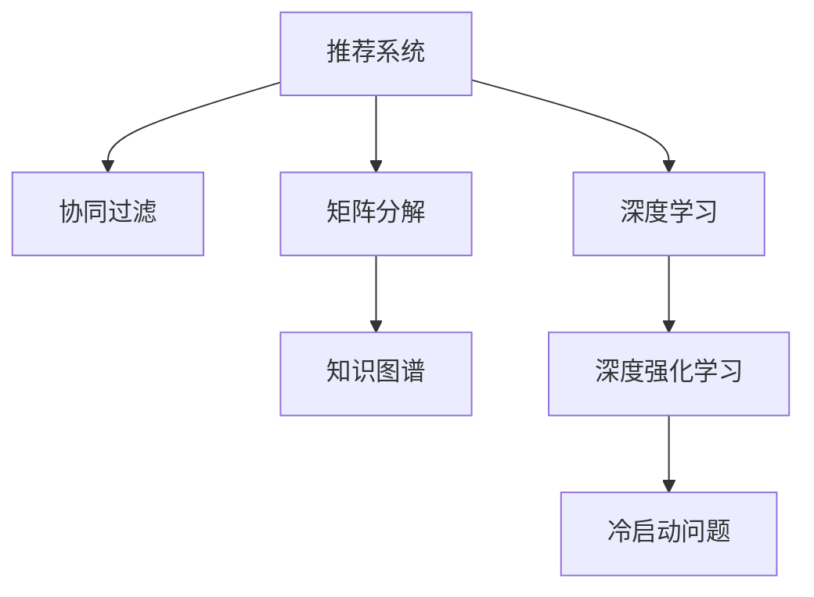

                 

# 深度学习如何革新传统推荐算法

> 关键词：推荐系统,深度学习,协同过滤,知识图谱,深度强化学习,冷启动问题,非个性化推荐

## 1. 背景介绍

推荐系统是信息时代的关键技术，广泛应用于电子商务、新闻推送、视频娱乐等多个领域。传统推荐算法主要基于用户历史行为、物品特征等，利用协同过滤、矩阵分解等方法推荐物品，取得了不俗的效果。然而，随着用户行为数据量的指数级增长，推荐系统面临数据稀疏性、算法泛化性、多样性保障等诸多挑战。深度学习技术的大规模应用，为推荐系统带来了革命性的变革，使其具备了处理复杂高维数据、实现动态模型训练、增强推荐效果等优势。

## 2. 核心概念与联系

### 2.1 核心概念概述

为更好地理解深度学习在推荐系统中的应用，本节将介绍几个密切相关的核心概念：

- 推荐系统(Recommender System)：指基于用户和物品信息，推荐合适物品的系统。推荐系统是信息时代的重要技术，广泛应用于电商、媒体、社交等各个领域。

- 协同过滤(Collaborative Filtering)：指基于用户历史行为或物品相似性，为用户推荐物品的推荐方法。包括基于用户的协同过滤、基于物品的协同过滤等。

- 矩阵分解(Matrix Factorization)：指将用户-物品评分矩阵分解为低维用户嵌入和物品嵌入的矩阵分解方法，如SVD、ALS等。

- 深度学习(Deep Learning)：指基于深度神经网络的机器学习范式，通过多层非线性映射处理复杂高维数据。

- 知识图谱(Knowledge Graph)：指利用图结构描述实体和关系的知识表示方法，在推荐系统中用于实体对齐、属性预测等。

- 深度强化学习(Deep Reinforcement Learning)：指利用深度神经网络，通过奖励机制训练智能体进行决策的强化学习范式。

这些核心概念之间的逻辑关系可以通过以下Mermaid流程图来展示：



这个流程图展示了一些关键概念之间的关联关系：

1. 推荐系统通过协同过滤、矩阵分解等方法，基于用户行为数据或物品特征，为用户推荐物品。
2. 深度学习提供了更加强大的表达能力和处理能力，通过多层非线性映射，提升推荐效果。
3. 知识图谱在推荐系统中用于实体对齐、属性预测等，可以增强推荐系统的泛化能力和知识丰富度。
4. 深度强化学习通过奖励机制训练智能体进行决策，在个性化推荐中有着广泛的应用。
5. 冷启动问题指新用户或物品无法获得足够历史行为数据的问题，通过深度学习等方法可以有效缓解。

## 3. 核心算法原理 & 具体操作步骤

### 3.1 算法原理概述

深度学习在推荐系统中的应用，主要体现在以下几个方面：

1. **多维数据表示**：传统协同过滤方法只能基于用户行为数据进行推荐，难以处理物品特征等其他高维数据。深度学习通过多层非线性映射，能够有效处理高维复杂数据，提升推荐系统的泛化能力和推荐效果。

2. **动态模型训练**：深度学习模型可以实时动态地更新参数，反映最新用户行为和物品特征的变化，实现动态推荐。

3. **推荐多样性**：深度学习可以通过正则化技术，避免推荐结果的过度拟合，保证推荐的多样性。

4. **冷启动问题**：深度学习可以通过迁移学习、基于内容的推荐等方法，缓解新用户或物品的冷启动问题。

5. **跨领域知识融合**：知识图谱可以提供领域知识，与深度学习模型结合，实现跨领域知识的融合，提升推荐系统的精准性和可解释性。

6. **强化学习优化**：深度强化学习可以通过奖励机制训练智能体进行决策，实现个性化推荐，增强推荐系统的灵活性和动态性。

### 3.2 算法步骤详解

基于深度学习的推荐系统，通常包括以下几个关键步骤：

**Step 1: 数据预处理**
- 收集用户行为数据、物品特征数据等，构建用户-物品评分矩阵。
- 对数据进行标准化、归一化、分词等预处理，去除噪声，保证数据质量。

**Step 2: 特征工程**
- 提取用户和物品的高维特征，如历史行为、兴趣标签、图片特征等。
- 将特征表示为高维向量，输入到深度学习模型中。

**Step 3: 模型训练**
- 选择合适的深度学习模型，如神经网络、卷积神经网络、循环神经网络等。
- 将用户-物品评分矩阵输入模型进行训练，学习用户和物品的表示。

**Step 4: 模型优化**
- 采用正则化技术，如L2正则、Dropout、Early Stopping等，避免过拟合。
- 使用Adam、SGD等优化算法，最小化损失函数，优化模型参数。

**Step 5: 推荐预测**
- 将新用户或物品的特征输入到模型中，得到推荐结果。
- 根据模型输出，为用户推荐合适物品。

**Step 6: 实时反馈和迭代**
- 收集用户反馈，根据反馈调整模型参数，进行模型迭代。
- 实时更新模型，保持模型与用户行为和物品特征的同步。

### 3.3 算法优缺点

基于深度学习的推荐系统具有以下优点：

1. **处理复杂高维数据**：深度学习能够高效处理高维数据，提升推荐系统的泛化能力。

2. **动态模型更新**：深度学习模型可以动态更新，反映最新用户行为和物品特征的变化，实现动态推荐。

3. **推荐效果提升**：深度学习通过多层非线性映射，提升推荐效果，特别是对长尾物品的推荐效果更佳。

4. **跨领域知识融合**：深度学习与知识图谱结合，可以实现跨领域知识的融合，增强推荐系统的精准性。

5. **算法鲁棒性增强**：深度学习模型具有较强的鲁棒性，能够避免过拟合，提升推荐的多样性。

同时，基于深度学习的推荐系统也存在一些局限：

1. **计算资源需求高**：深度学习模型参数量庞大，计算资源需求高，部署成本较高。

2. **训练时间长**：深度学习模型训练时间长，特别是大规模模型的训练，需要大量的计算资源。

3. **数据质量要求高**：深度学习模型对数据质量要求高，需要确保数据干净、准确，否则会影响模型效果。

4. **冷启动问题**：新用户或物品难以获得足够的历史行为数据，深度学习模型需要解决冷启动问题。

5. **模型可解释性差**：深度学习模型往往是"黑盒"系统，难以解释其内部工作机制和决策逻辑。

### 3.4 算法应用领域

基于深度学习的推荐系统，已经广泛应用于各个领域，例如：

- 电商推荐：基于用户历史行为和物品属性，推荐商品。如亚马逊的推荐系统，通过深度学习模型提升推荐效果。

- 新闻推荐：基于用户阅读历史和兴趣标签，推荐新闻文章。如今日头条的推荐系统，通过深度学习模型实现个性化推荐。

- 视频推荐：基于用户观看历史和视频属性，推荐视频内容。如Netflix的推荐系统，通过深度学习模型提升推荐效果。

- 音乐推荐：基于用户听歌历史和歌曲属性，推荐音乐。如Spotify的推荐系统，通过深度学习模型实现个性化推荐。

## 4. 数学模型和公式 & 详细讲解  
### 4.1 数学模型构建

本节将使用数学语言对深度学习在推荐系统中的应用进行更加严格的刻画。

记用户-物品评分矩阵为 $X \in \mathbb{R}^{N \times M}$，其中 $N$ 为物品数，$M$ 为用户数。设用户 $i$ 对物品 $j$ 的评分向量为 $X_{i,j} \in \mathbb{R}^D$，其中 $D$ 为特征维度。

定义深度学习模型为 $f: \mathbb{R}^D \rightarrow \mathbb{R}$，即将物品特征向量映射为评分预测值。

设模型参数为 $\theta$，损失函数为 $L(X, f(\theta))$，则推荐模型的目标是最小化损失函数：

$$
\theta^* = \mathop{\arg\min}_{\theta} L(X, f(\theta))
$$

其中，$L$ 为交叉熵损失函数，定义为：

$$
L(X, f(\theta)) = -\frac{1}{N} \sum_{i=1}^N \sum_{j=1}^M X_{i,j} \log f(X_{i,j};\theta)
$$

### 4.2 公式推导过程

以下是详细推导过程：

1. **交叉熵损失函数推导**：

   设用户 $i$ 对物品 $j$ 的实际评分为 $X_{i,j}$，深度学习模型预测评分为 $\hat{X}_{i,j} = f(X_{i,j};\theta)$。则交叉熵损失函数为：

   $$
   L(X, f(\theta)) = -\frac{1}{N} \sum_{i=1}^N \sum_{j=1}^M X_{i,j} \log f(X_{i,j};\theta)
   $$

2. **梯度计算**：

   模型参数 $\theta$ 的梯度为：

   $$
   \nabla_{\theta}L(X, f(\theta)) = -\frac{1}{N} \sum_{i=1}^N \sum_{j=1}^M X_{i,j} \nabla_{\theta}f(X_{i,j};\theta)
   $$

   其中 $\nabla_{\theta}f(X_{i,j};\theta)$ 为深度学习模型的梯度，可通过反向传播算法高效计算。

3. **模型更新**：

   采用优化算法（如Adam、SGD等）更新模型参数：

   $$
   \theta \leftarrow \theta - \eta \nabla_{\theta}L(X, f(\theta))
   $$

   其中 $\eta$ 为学习率。

4. **正则化处理**：

   引入正则化技术，如L2正则、Dropout等，避免过拟合：

   $$
   \theta \leftarrow \theta - \eta (\nabla_{\theta}L(X, f(\theta)) + \lambda \theta)
   $$

   其中 $\lambda$ 为正则化系数，通常取 $1e-4$ 左右。

## 5. 项目实践：代码实例和详细解释说明
### 5.1 开发环境搭建

在进行深度学习推荐系统开发前，我们需要准备好开发环境。以下是使用Python进行TensorFlow开发的环境配置流程：

1. 安装Anaconda：从官网下载并安装Anaconda，用于创建独立的Python环境。

2. 创建并激活虚拟环境：
```bash
conda create -n tf-env python=3.7 
conda activate tf-env
```

3. 安装TensorFlow：根据CUDA版本，从官网获取对应的安装命令。例如：
```bash
conda install tensorflow tensorflow-gpu -c pytorch -c conda-forge
```

4. 安装Pandas、NumPy等常用库：
```bash
pip install pandas numpy
```

5. 安装TensorBoard：用于可视化模型训练过程，方便调试。

完成上述步骤后，即可在`tf-env`环境中开始开发实践。

### 5.2 源代码详细实现

这里我们以协同过滤模型为例，给出使用TensorFlow对用户-物品评分矩阵进行预测的代码实现。

首先，定义模型结构：

```python
import tensorflow as tf
from tensorflow.keras.layers import Input, Dense, Embedding, Flatten, Concatenate

# 定义模型输入
user_input = Input(shape=(num_users,))
item_input = Input(shape=(num_items,))

# 定义用户特征和物品特征
user_embed = Embedding(num_users, embedding_dim)(user_input)
item_embed = Embedding(num_items, embedding_dim)(item_input)

# 定义用户特征和物品特征的表示
user_feat = Flatten()(user_embed)
item_feat = Flatten()(item_embed)

# 定义交叉特征
cross_feat = Concatenate()([user_feat, item_feat])

# 定义交叉特征的表示
x = Dense(512, activation='relu')(cross_feat)

# 定义评分预测层
rating_pred = Dense(1, activation='sigmoid')(x)

# 定义模型
model = tf.keras.Model(inputs=[user_input, item_input], outputs=[rating_pred])

# 编译模型
model.compile(optimizer='adam', loss='binary_crossentropy')
```

然后，定义数据处理函数：

```python
import numpy as np

def data_generator(X, y, batch_size=32, num_epochs=10):
    for epoch in range(num_epochs):
        for i in range(0, len(X), batch_size):
            X_batch = X[i:i+batch_size]
            y_batch = y[i:i+batch_size]
            yield X_batch, y_batch
```

接着，训练模型：

```python
batch_size = 32
num_epochs = 10

# 训练模型
history = model.fit(data_generator(X_train, y_train, batch_size=batch_size, num_epochs=num_epochs),
                   validation_data=data_generator(X_test, y_test, batch_size=batch_size, num_epochs=num_epochs))

# 评估模型
score = model.evaluate(data_generator(X_test, y_test, batch_size=batch_size, num_epochs=1))
print('Test loss:', score[0])
```

以上就是使用TensorFlow对协同过滤模型进行训练的完整代码实现。可以看到，TensorFlow提供了丰富的组件和工具，使得模型构建和训练变得非常便捷。

### 5.3 代码解读与分析

让我们再详细解读一下关键代码的实现细节：

**data_generator函数**：
- 定义了数据生成器，用于逐批次加载训练集和测试集数据，方便模型训练和评估。

**模型结构**：
- 定义了用户特征和物品特征的Embedding层，用于将用户和物品的ID转换为向量表示。
- 定义了用户特征和物品特征的Flatten层，将向量表示展开成一维数组。
- 定义了交叉特征，将用户和物品特征进行拼接。
- 定义了交叉特征的Dense层，用于处理特征信息，得到评分预测值。

**模型训练**：
- 使用Adam优化算法进行模型训练，损失函数为二分类交叉熵损失函数。
- 使用evaluage函数评估模型在测试集上的表现，输出模型损失。

## 6. 实际应用场景
### 6.1 电商推荐

基于深度学习的电商推荐系统，可以为用户推荐最合适的商品，提升购物体验和销售额。电商推荐系统通常基于用户历史行为数据和物品属性信息，通过深度学习模型预测用户对每个商品的评分，从而生成推荐列表。

在技术实现上，可以收集用户浏览、点击、购买等行为数据，提取商品属性信息，构建用户-物品评分矩阵。利用深度学习模型对评分矩阵进行训练，得到用户和物品的表示。在生成推荐列表时，使用模型对用户特征和物品特征进行评分预测，选择评分最高的物品作为推荐结果。

### 6.2 新闻推荐

基于深度学习的新闻推荐系统，能够根据用户的阅读历史和兴趣标签，推荐相关新闻文章，提升阅读体验。新闻推荐系统通常基于用户阅读行为数据和文章属性信息，通过深度学习模型预测用户对每篇文章的评分，从而生成推荐列表。

在技术实现上，可以收集用户阅读行为数据，提取文章属性信息，构建用户-文章评分矩阵。利用深度学习模型对评分矩阵进行训练，得到用户和文章的表示。在生成推荐列表时，使用模型对用户特征和文章特征进行评分预测，选择评分最高的文章作为推荐结果。

### 6.3 视频推荐

基于深度学习的视频推荐系统，能够根据用户的观看历史和视频属性，推荐合适视频内容，提升观看体验。视频推荐系统通常基于用户观看行为数据和视频属性信息，通过深度学习模型预测用户对每个视频的评分，从而生成推荐列表。

在技术实现上，可以收集用户观看行为数据，提取视频属性信息，构建用户-视频评分矩阵。利用深度学习模型对评分矩阵进行训练，得到用户和视频的表示。在生成推荐列表时，使用模型对用户特征和视频特征进行评分预测，选择评分最高的视频作为推荐结果。

### 6.4 音乐推荐

基于深度学习的音乐推荐系统，能够根据用户的听歌历史和歌曲属性，推荐合适音乐内容，提升听歌体验。音乐推荐系统通常基于用户听歌行为数据和歌曲属性信息，通过深度学习模型预测用户对每首歌曲的评分，从而生成推荐列表。

在技术实现上，可以收集用户听歌行为数据，提取歌曲属性信息，构建用户-歌曲评分矩阵。利用深度学习模型对评分矩阵进行训练，得到用户和歌曲的表示。在生成推荐列表时，使用模型对用户特征和歌曲特征进行评分预测，选择评分最高的歌曲作为推荐结果。

## 7. 工具和资源推荐
### 7.1 学习资源推荐

为了帮助开发者系统掌握深度学习在推荐系统中的应用，这里推荐一些优质的学习资源：

1. 《推荐系统实战》一书：由深度学习专家撰写，全面介绍了推荐系统的经典算法、模型优化、实时推荐等话题，深入浅出，适合入门学习。

2. CS448《推荐系统》课程：斯坦福大学开设的推荐系统课程，有Lecture视频和配套作业，带你入门推荐系统领域的基本概念和经典模型。

3. 《深度学习》一书：DeepMind深度学习专家撰写，全面介绍了深度学习的理论基础和实践技巧，覆盖了从基础到前沿的各个方面，适合进阶学习。

4. arXiv论文预印本：arXiv是计算机科学的预印本服务器，收录了大量推荐系统的前沿论文，适合深度学习和推荐系统的研究者参考。

5. Kaggle竞赛：Kaggle举办了诸多推荐系统竞赛，汇集了世界顶级的数据科学家和算法工程师，共同探讨推荐系统的前沿技术，适合实践学习。

通过对这些资源的学习实践，相信你一定能够快速掌握深度学习在推荐系统中的应用，并用于解决实际的推荐问题。

### 7.2 开发工具推荐

高效的开发离不开优秀的工具支持。以下是几款用于深度学习推荐系统开发的常用工具：

1. TensorFlow：由Google主导开发的开源深度学习框架，生产部署方便，适合大规模工程应用。提供了丰富的组件和工具，方便开发者进行深度学习模型的开发和训练。

2. PyTorch：基于Python的开源深度学习框架，灵活动态的计算图，适合快速迭代研究。提供了丰富的组件和工具，方便开发者进行深度学习模型的开发和训练。

3. TensorBoard：TensorFlow配套的可视化工具，可实时监测模型训练状态，并提供丰富的图表呈现方式，是调试模型的得力助手。

4. Jupyter Notebook：开源的交互式笔记本工具，支持多种编程语言，方便开发者进行代码的编写、测试和展示。

5. Scikit-learn：开源的机器学习库，提供了丰富的数据处理、特征工程、模型评估等工具，适合深度学习推荐系统的数据预处理和模型评估。

合理利用这些工具，可以显著提升深度学习推荐系统的开发效率，加快创新迭代的步伐。

### 7.3 相关论文推荐

深度学习在推荐系统中的应用源于学界的持续研究。以下是几篇奠基性的相关论文，推荐阅读：

1. Collaborative Filtering for Implicit Feedback Datasets（NCF论文）：提出了基于神经网络的协同过滤方法，利用多层非线性映射提升推荐效果。

2. Factorization Machines with libFM: Implementation of a Library for Factorization Machine Learning for Large-scale Data（FM论文）：提出了一种基于FM模型的推荐方法，利用矩阵分解提升推荐效果。

3. Deep Feature Crossing：A Scalable Approach to Ad-click Prediction（DeepCross论文）：提出了一种基于深度学习的特征交叉方法，通过多层非线性映射提升广告点击率预测效果。

4. Neural Factorization Machines（NFM论文）：提出了一种基于深度学习的因子分解模型，利用深度神经网络提升推荐效果。

5. Winning the 1%: ImageNet Label Noise Tolerance（W&L论文）：提出了一种基于深度学习的方法，利用对抗训练提升图像分类模型的鲁棒性。

这些论文代表了大模型微调技术的发展脉络。通过学习这些前沿成果，可以帮助研究者把握学科前进方向，激发更多的创新灵感。

## 8. 总结：未来发展趋势与挑战

### 8.1 总结

本文对基于深度学习的推荐系统进行了全面系统的介绍。首先阐述了推荐系统的背景和深度学习技术的应用，明确了深度学习在推荐系统中的重要性。其次，从原理到实践，详细讲解了深度学习在推荐系统中的应用方法，给出了推荐系统开发的完整代码实例。同时，本文还广泛探讨了深度学习推荐系统在电商、新闻、视频、音乐等多个行业领域的应用前景，展示了深度学习技术的巨大潜力。此外，本文精选了深度学习推荐系统的各类学习资源，力求为读者提供全方位的技术指引。

通过本文的系统梳理，可以看到，基于深度学习的推荐系统正在成为推荐系统的重要范式，极大地提升了推荐效果和应用范围。未来，伴随深度学习技术的不断发展，推荐系统将在更多的领域得到应用，为人类生产生活方式带来深刻影响。

### 8.2 未来发展趋势

展望未来，深度学习在推荐系统中的应用将呈现以下几个发展趋势：

1. **跨领域知识融合**：深度学习与知识图谱结合，可以实现跨领域知识的融合，增强推荐系统的精准性和可解释性。

2. **多模态推荐**：深度学习可以处理多模态数据，如文本、图像、视频等，实现视觉、语音等多模态信息与文本信息的协同建模。

3. **深度强化学习**：深度强化学习通过奖励机制训练智能体进行决策，在个性化推荐中有着广泛的应用，能够提升推荐系统的灵活性和动态性。

4. **冷启动问题解决**：深度学习可以通过迁移学习、基于内容的推荐等方法，缓解新用户或物品的冷启动问题，提升推荐系统的鲁棒性。

5. **可解释性和可控性增强**：深度学习模型往往是"黑盒"系统，难以解释其内部工作机制和决策逻辑。如何赋予深度学习模型更强的可解释性和可控性，将是重要的研究方向。

6. **数据隐私和安全保障**：深度学习模型面临数据隐私和安全保障的挑战，如何在保障用户隐私的前提下，进行推荐系统的设计和应用，将是重要的研究方向。

以上趋势凸显了深度学习在推荐系统中的广阔前景。这些方向的探索发展，必将进一步提升推荐系统的性能和应用范围，为人类生产生活方式带来更深远的影响。

### 8.3 面临的挑战

尽管深度学习在推荐系统中的应用取得了显著进展，但在迈向更加智能化、普适化应用的过程中，它仍面临着诸多挑战：

1. **计算资源需求高**：深度学习模型参数量庞大，计算资源需求高，部署成本较高。

2. **训练时间长**：深度学习模型训练时间长，特别是大规模模型的训练，需要大量的计算资源。

3. **数据质量要求高**：深度学习模型对数据质量要求高，需要确保数据干净、准确，否则会影响模型效果。

4. **冷启动问题**：新用户或物品难以获得足够的历史行为数据，深度学习模型需要解决冷启动问题。

5. **模型可解释性差**：深度学习模型往往是"黑盒"系统，难以解释其内部工作机制和决策逻辑。

6. **数据隐私和安全保障**：深度学习模型面临数据隐私和安全保障的挑战，如何在保障用户隐私的前提下，进行推荐系统的设计和应用，将是重要的研究方向。

### 8.4 研究展望

面对深度学习推荐系统所面临的挑战，未来的研究需要在以下几个方面寻求新的突破：

1. **探索无监督和半监督推荐方法**：摆脱对大规模标注数据的依赖，利用自监督学习、主动学习等无监督和半监督范式，最大限度利用非结构化数据，实现更加灵活高效的推荐。

2. **研究参数高效和计算高效的推荐方法**：开发更加参数高效的推荐方法，在固定大部分预训练参数的同时，只更新极少量的任务相关参数。同时优化推荐模型的计算图，减少前向传播和反向传播的资源消耗，实现更加轻量级、实时性的部署。

3. **引入更多先验知识**：将符号化的先验知识，如知识图谱、逻辑规则等，与深度学习模型进行巧妙融合，引导推荐过程学习更准确、合理的推荐知识。同时加强不同模态数据的整合，实现视觉、语音等多模态信息与文本信息的协同建模。

4. **结合因果分析和博弈论工具**：将因果分析方法引入推荐模型，识别出模型决策的关键特征，增强推荐结果的因果性和逻辑性。借助博弈论工具刻画人机交互过程，主动探索并规避推荐模型的脆弱点，提高系统稳定性。

5. **纳入伦理道德约束**：在推荐模型训练目标中引入伦理导向的评估指标，过滤和惩罚有偏见、有害的输出倾向。同时加强人工干预和审核，建立推荐系统的监管机制，确保推荐结果符合人类价值观和伦理道德。

这些研究方向的探索，必将引领深度学习推荐系统技术迈向更高的台阶，为构建安全、可靠、可解释、可控的智能推荐系统铺平道路。面向未来，深度学习推荐系统还需要与其他人工智能技术进行更深入的融合，如知识表示、因果推理、强化学习等，多路径协同发力，共同推动智能推荐系统的进步。只有勇于创新、敢于突破，才能不断拓展深度学习推荐系统的边界，让智能技术更好地造福人类社会。

## 9. 附录：常见问题与解答

**Q1：推荐系统如何使用深度学习模型进行预测？**

A: 推荐系统使用深度学习模型进行预测的主要步骤如下：
1. 收集用户行为数据和物品属性信息，构建用户-物品评分矩阵。
2. 对数据进行标准化、归一化、分词等预处理，去除噪声，保证数据质量。
3. 提取用户和物品的高维特征，如历史行为、兴趣标签、图片特征等，将其表示为高维向量。
4. 定义深度学习模型，将用户和物品的表示作为输入，输出评分预测值。
5. 选择评分预测值最高的物品作为推荐结果。

**Q2：深度学习推荐系统面临的主要挑战是什么？**

A: 深度学习推荐系统面临的主要挑战包括：
1. 计算资源需求高，部署成本较高。
2. 训练时间长，特别是大规模模型的训练，需要大量的计算资源。
3. 数据质量要求高，需要确保数据干净、准确，否则会影响模型效果。
4. 冷启动问题，新用户或物品难以获得足够的历史行为数据。
5. 模型可解释性差，难以解释其内部工作机制和决策逻辑。
6. 数据隐私和安全保障，如何在保障用户隐私的前提下，进行推荐系统的设计和应用。

**Q3：推荐系统如何缓解冷启动问题？**

A: 推荐系统缓解冷启动问题的方法包括：
1. 利用基于内容的推荐，即根据物品属性信息进行推荐，避免冷启动问题。
2. 利用迁移学习，即在新领域进行预训练后，将预训练模型微调，进行推荐。
3. 利用深度学习模型的泛化能力，即在大量数据上进行预训练，提高推荐模型的鲁棒性。
4. 利用用户画像，即收集用户的兴趣标签、行为特征等，进行个性化推荐。

这些方法可以结合使用，根据具体应用场景选择合适的缓解策略。

**Q4：推荐系统如何实现多模态信息融合？**

A: 推荐系统实现多模态信息融合的方法包括：
1. 利用深度学习模型，将不同模态的信息转换为高维向量表示，进行特征融合。
2. 利用知识图谱，将不同模态的信息进行对齐，形成统一的知识表示。
3. 利用多模态编码器，将不同模态的信息进行协同编码，提高推荐的精准性和多样性。

以上方法可以结合使用，根据具体应用场景选择合适的多模态融合策略。

**Q5：推荐系统如何实现可解释性和可控性增强？**

A: 推荐系统实现可解释性和可控性增强的方法包括：
1. 利用LIME、SHAP等模型可解释性工具，解释推荐模型的决策逻辑。
2. 利用强化学习，训练推荐系统进行动态决策，增强系统的灵活性和动态性。
3. 利用对抗训练，提升推荐系统的鲁棒性，避免模型脆弱。
4. 利用公平性评估指标，过滤和惩罚有偏见、有害的输出倾向。

这些方法可以结合使用，根据具体应用场景选择合适的可解释性和可控性增强策略。

---

作者：禅与计算机程序设计艺术 / Zen and the Art of Computer Programming

