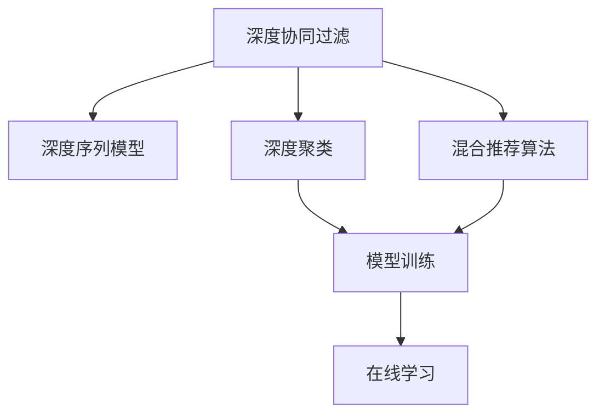

                 

# 深度学习驱动的商品推荐系统设计

> 关键词：深度学习, 推荐系统, 协同过滤, 内容推荐, 混合推荐算法, 模型训练, 在线学习, 商品推荐, 多模态数据, 推荐系统评价指标, 用户行为分析, 商品特征分析, 冷启动问题, 推荐算法优化

## 1. 背景介绍

### 1.1 问题由来

随着电子商务的飞速发展，商品推荐系统（Recommendation System, RS）成为了各大电商平台的核心竞争力。优秀的推荐系统能显著提升用户购物体验，提高平台交易转化率，降低用户流失率。然而，构建一个高性能的商品推荐系统绝非易事。它不仅需要处理海量用户数据和商品数据，还需准确捕捉用户和商品的动态特征，以提供精细化的推荐服务。

### 1.2 问题核心关键点

商品推荐系统核心在于利用用户历史行为和商品属性特征，预测用户对商品的兴趣程度，从而精准推荐商品。传统推荐算法主要包括基于协同过滤、基于内容过滤等。但这些算法都面临冷启动问题、数据稀疏性等挑战。

近年来，深度学习技术在推荐系统中逐步崭露头角，如深度协同过滤（Deep Matrix Factorization）、深度聚类、深度序列模型等，推动了推荐系统性能的大幅提升。但深度学习算法通常对计算资源要求较高，且参数复杂、不易解释，面临诸多实际应用中的难题。

### 1.3 问题研究意义

研究深度学习驱动的商品推荐系统，对于提升电商平台用户粘性、增加交易额、提高市场竞争力具有重要意义：

1. 精准推荐：深度学习能捕捉用户行为和商品属性的深层次特征，提升推荐精准度。
2. 用户体验：通过个性化推荐，提升用户体验，增加用户满意度和平台忠诚度。
3. 用户增长：通过推荐系统的优化，增加新用户的转化率，扩大用户基础。
4. 市场竞争力：通过提升推荐精度和个性化水平，提升平台在市场上的竞争力。

## 2. 核心概念与联系

### 2.1 核心概念概述

为更好地理解深度学习驱动的商品推荐系统，本节将介绍几个关键概念：

- **深度协同过滤**（Deep Collaborative Filtering）：一种基于深度学习模型的协同过滤推荐方法，通过学习用户行为与商品属性之间的关系，推荐用户可能感兴趣的商品。
- **深度序列模型**（Deep Sequential Model）：一种利用序列数据进行推荐的方法，如RNN、LSTM等，用于预测用户未来的购买行为。
- **深度聚类**（Deep Clustering）：通过深度学习模型进行聚类分析，挖掘用户和商品的隐含特征。
- **混合推荐算法**（Hybrid Recommendation Algorithm）：结合多种推荐方法，取长补短，提升推荐效果。
- **模型训练**（Model Training）：通过大量标注数据，训练推荐模型，优化模型参数，使其具备较好的泛化能力。
- **在线学习**（Online Learning）：在模型上线后，不断更新模型，以适应数据分布的变化，保持推荐精度。

这些核心概念之间的关系可以通过以下Mermaid流程图来展示：



这个流程图展示了几类深度学习推荐方法之间的逻辑关系：

1. 深度协同过滤、深度序列模型、深度聚类等是常见的深度推荐方法，在训练阶段通过用户行为和商品属性进行特征提取和模型优化。
2. 混合推荐算法可以结合这些方法的优势，提升推荐效果。
3. 模型训练是推荐系统构建的基础，通过大量标注数据训练模型。
4. 在线学习在模型上线后不断更新，保持推荐精度。

## 3. 核心算法原理 & 具体操作步骤
### 3.1 算法原理概述

深度学习驱动的商品推荐系统，本质上是通过深度学习模型捕捉用户行为和商品属性之间的关系，预测用户对商品的兴趣程度，从而实现个性化推荐。常见的算法框架包括：

- **深度协同过滤**：通过矩阵分解，将用户与商品之间的关系映射到低维空间，预测用户对商品的评分。
- **深度序列模型**：利用时间序列数据，预测用户未来的购买行为，推荐可能感兴趣的商品。
- **深度聚类**：通过聚类算法挖掘用户和商品的隐含特征，从而提升推荐精度。

### 3.2 算法步骤详解

深度学习驱动的商品推荐系统一般包括以下几个关键步骤：

**Step 1: 数据准备**

- 收集用户行为数据，如浏览、点击、购买、评分等。
- 收集商品属性数据，如价格、分类、标签等。
- 清洗和预处理数据，构建训练集、验证集和测试集。

**Step 2: 模型设计**

- 选择合适的深度学习模型架构，如神经网络、深度矩阵分解、RNN/LSTM等。
- 定义模型的输入和输出，输入为用户和商品特征，输出为推荐结果。
- 确定模型超参数，如学习率、批大小、迭代轮数等。

**Step 3: 模型训练**

- 使用训练集对模型进行训练，最小化预测结果与真实标签之间的损失函数。
- 周期性在验证集上评估模型性能，避免过拟合。
- 使用梯度下降等优化算法更新模型参数。

**Step 4: 模型评估**

- 在测试集上对训练好的模型进行评估，使用推荐系统评价指标如准确率、召回率、F1-score等。
- 通过A/B测试，比较新模型的推荐效果与旧模型。

**Step 5: 模型部署**

- 将训练好的模型部署到线上环境，接受用户行为数据。
- 实时计算推荐结果，更新推荐页面。
- 设置监控机制，实时监测模型性能和业务指标。

### 3.3 算法优缺点

深度学习驱动的商品推荐系统具有以下优点：

1. 高效捕捉用户和商品的深层次特征。
2. 可以处理海量数据，提升推荐精度。
3. 能够处理冷启动问题，推荐新用户新商品。
4. 可以动态更新模型，适应数据分布的变化。

同时，该方法也存在一些局限性：

1. 对数据质量要求高，需要清洗和预处理大量数据。
2. 对计算资源要求较高，训练和推理过程较慢。
3. 模型复杂，难以解释和调试。
4. 数据隐私和安全问题，用户行为数据需要严格保护。

尽管如此，深度学习技术仍是大数据时代下推荐系统的主流选择，其带来的性能提升和个性化服务是传统推荐算法难以匹敌的。未来，随着技术进步和硬件优化，深度学习推荐系统的性能和应用范围将不断拓展。

### 3.4 算法应用领域

基于深度学习的商品推荐系统已经在电商、视频、音乐等诸多领域得到了广泛应用，取得了显著的效果：

- 电商推荐：如Amazon、京东等，通过深度协同过滤、深度序列模型等方法，推荐用户可能感兴趣的商品。
- 视频推荐：如YouTube、Netflix，通过深度学习模型预测用户对视频的兴趣，实现精准推荐。
- 音乐推荐：如Spotify，通过深度学习模型分析用户听歌行为，推荐个性化音乐。
- 广告推荐：如Facebook、Google Ads，通过深度学习模型精准匹配用户需求和广告内容。

除了上述这些主流应用外，深度学习推荐系统还被创新性地应用到更多场景中，如个性化搜索结果、智能音箱推荐、推荐内容扩展等，为不同领域带来了颠覆性的创新。

## 4. 数学模型和公式 & 详细讲解  
### 4.1 数学模型构建

本节将使用数学语言对深度学习驱动的商品推荐系统进行更加严格的刻画。

记用户行为数据为 $X=\{x_1, x_2, ..., x_n\}$，其中 $x_i \in \mathbb{R}^d$ 表示第 $i$ 个用户的特征向量。记商品属性数据为 $Y=\{y_1, y_2, ..., y_m\}$，其中 $y_j \in \mathbb{R}^k$ 表示第 $j$ 个商品的特征向量。记用户与商品之间的关系矩阵为 $M \in \mathbb{R}^{n \times m}$，其中 $M_{ij} \in [0,1]$ 表示用户 $i$ 对商品 $j$ 的评分。

定义深度推荐模型的损失函数为：

$$
\mathcal{L}(\theta) = \frac{1}{N} \sum_{i=1}^N \sum_{j=1}^M (M_{ij} - h_\theta(x_i, y_j))^2
$$

其中 $h_\theta(x_i, y_j)$ 为模型在用户 $i$ 和商品 $j$ 上的预测评分，$\theta$ 为模型参数。

在训练过程中，通过梯度下降等优化算法最小化上述损失函数，更新模型参数 $\theta$，使得模型预测评分逼近真实评分。

### 4.2 公式推导过程

以深度协同过滤为例，推导矩阵分解模型的损失函数。

记用户 $i$ 和商品 $j$ 的关系矩阵为 $M_{ij} \in [0,1]$，模型参数为 $W \in \mathbb{R}^{n \times k}$ 和 $V \in \mathbb{R}^{m \times k}$，其中 $k$ 为分解后的维度。模型的预测评分 $h_\theta(x_i, y_j)$ 定义为：

$$
h_\theta(x_i, y_j) = W^T\sigma(V y_j)
$$

其中 $\sigma$ 为激活函数，如ReLU、Sigmoid等。损失函数定义为：

$$
\mathcal{L}(W,V) = \frac{1}{N} \sum_{i=1}^N \sum_{j=1}^M (M_{ij} - W^T\sigma(V y_j))^2
$$

通过求解上述损失函数的最小值，得到最优的参数 $W$ 和 $V$，从而得到用户与商品之间的关系矩阵的分解形式。

### 4.3 案例分析与讲解

以Amazon推荐系统为例，分析深度学习驱动的推荐算法在实际应用中的实现。

Amazon推荐系统采用了深度协同过滤和深度序列模型相结合的方法。对于用户的浏览、点击、购买等行为，采用深度协同过滤模型进行个性化推荐。对于用户的搜索行为，采用深度序列模型预测用户未来的搜索兴趣，推荐相关商品。

具体实现中，Amazon使用深度学习框架TensorFlow进行模型训练和推理。对于深度协同过滤模型，采用多任务学习框架Keras，同时优化多任务损失函数。对于深度序列模型，采用RNN/LSTM等模型，预测用户未来的搜索行为。

Amazon推荐系统还引入了在线学习机制，实时更新模型参数，提升推荐精度。此外，Amazon还采用了多模态数据融合技术，将用户行为数据、商品属性数据、社交网络数据等整合在一起，提升推荐效果。

## 5. 项目实践：代码实例和详细解释说明
### 5.1 开发环境搭建

在进行深度学习驱动的商品推荐系统开发前，我们需要准备好开发环境。以下是使用Python进行TensorFlow和Keras开发的环境配置流程：

1. 安装Anaconda：从官网下载并安装Anaconda，用于创建独立的Python环境。

2. 创建并激活虚拟环境：
```bash
conda create -n tf-env python=3.8 
conda activate tf-env
```

3. 安装TensorFlow：根据CUDA版本，从官网获取对应的安装命令。例如：
```bash
conda install tensorflow -c tf
```

4. 安装Keras：
```bash
pip install keras
```

5. 安装各类工具包：
```bash
pip install numpy pandas scikit-learn matplotlib tqdm jupyter notebook ipython
```

完成上述步骤后，即可在`tf-env`环境中开始项目实践。

### 5.2 源代码详细实现

这里我们以深度协同过滤推荐模型为例，给出使用TensorFlow和Keras进行模型训练的PyTorch代码实现。

首先，定义模型结构：

```python
import tensorflow as tf
from tensorflow.keras.layers import Input, Embedding, Dense, Activation
from tensorflow.keras.models import Model

user_input = Input(shape=(d,), name='user_input')
item_input = Input(shape=(k,), name='item_input')

user_embeddings = Embedding(n, k)(user_input)
item_embeddings = Embedding(m, k)(item_input)
interaction = tf.multiply(user_embeddings, item_embeddings)
prediction = Dense(1, activation='sigmoid')(interaction)
model = Model(inputs=[user_input, item_input], outputs=prediction)
model.compile(optimizer='adam', loss='binary_crossentropy', metrics=['accuracy'])
```

然后，加载并预处理数据：

```python
import numpy as np
import pandas as pd

train_data = pd.read_csv('train_data.csv')
test_data = pd.read_csv('test_data.csv')

train_data = train_data.dropna().reset_index(drop=True)
test_data = test_data.dropna().reset_index(drop=True)

user_ids = train_data['user_id']
item_ids = train_data['item_id']
interactions = train_data['rating'] > 0
train_dataset = train_data.interaction_id

# 用户和商品的嵌入
user_embeddings = model.layers[1].embeddings.numpy()
item_embeddings = model.layers[2].embeddings.numpy()

# 训练集和测试集的构建
train_dataset = tf.data.Dataset.from_tensor_slices(train_dataset)
train_dataset = train_dataset.shuffle(buffer_size=10000).batch(batch_size)

test_dataset = tf.data.Dataset.from_tensor_slices(test_dataset)
test_dataset = test_dataset.batch(batch_size)
```

最后，启动训练流程并评估模型：

```python
epochs = 10
batch_size = 128

for epoch in range(epochs):
    history = model.fit(train_dataset, epochs=1, validation_data=test_dataset, verbose=2)
    test_loss, test_accuracy = model.evaluate(test_dataset)
    print(f'Epoch {epoch+1}, Test Loss: {test_loss:.4f}, Test Accuracy: {test_accuracy:.4f}')
    
print('Test Results:')
predictions = model.predict(test_dataset)
```

以上就是使用TensorFlow和Keras进行深度协同过滤推荐模型训练的完整代码实现。可以看到，通过构建适当的深度学习模型和选择合适的损失函数，我们可以快速搭建并训练商品推荐系统。

### 5.3 代码解读与分析

让我们再详细解读一下关键代码的实现细节：

**模型定义**：
- `Input`：定义用户和商品的输入层，分别输入用户行为数据和商品属性数据。
- `Embedding`：将用户和商品的数据映射到低维空间，实现高维数据的降维。
- `Dense`：连接用户和商品的低维向量，计算内积，得到预测评分。
- `Activation`：对预测评分进行激活，如Sigmoid函数，输出预测概率。
- `Model`：将模型封装成Keras模型，支持模型的保存和部署。

**数据预处理**：
- 加载并清洗数据，去掉缺失值和异常值。
- 将用户行为数据转换为矩阵形式，如将评分转换为二值形式。
- 使用TensorFlow的`Dataset`进行数据批处理和分片，以提高训练效率。

**训练和评估**：
- 使用`fit`函数进行模型训练，设置训练轮数和批量大小。
- 在测试集上评估模型性能，输出损失和准确率。

通过以上代码，我们可以看到深度协同过滤推荐模型构建和训练的基本流程。

## 6. 实际应用场景
### 6.1 电商平台推荐

深度学习驱动的商品推荐系统在电商平台中的应用最为典型。如Amazon、京东、淘宝等电商巨头，通过深度协同过滤、深度序列模型等方法，对用户和商品进行精准推荐，显著提升了平台的用户粘性和交易额。

具体应用中，电商平台会根据用户的历史行为、浏览记录、评分等数据，构建用户和商品的低维特征向量，送入深度学习模型进行预测。对于用户的浏览和点击行为，采用深度协同过滤模型进行个性化推荐。对于用户的搜索行为，采用深度序列模型预测用户未来的搜索兴趣，推荐相关商品。

此外，电商平台还引入了多模态数据融合技术，将用户行为数据、商品属性数据、社交网络数据等整合在一起，提升推荐效果。

### 6.2 视频推荐

视频推荐系统是深度学习推荐系统的另一大应用场景。如YouTube、Netflix等视频平台，通过深度学习模型预测用户对视频的兴趣，实现精准推荐。

具体应用中，视频推荐系统会根据用户的历史观看行为、点赞、评分等数据，构建用户和视频的低维特征向量，送入深度学习模型进行预测。对于用户的浏览和点击行为，采用深度协同过滤模型进行个性化推荐。对于用户的搜索行为，采用深度序列模型预测用户未来的搜索兴趣，推荐相关视频。

此外，视频推荐系统还引入了多模态数据融合技术，将用户行为数据、视频属性数据、社交网络数据等整合在一起，提升推荐效果。

### 6.3 个性化搜索结果

个性化搜索结果推荐系统是深度学习推荐系统的又一重要应用。如百度、Google等搜索引擎，通过深度学习模型预测用户对搜索结果的兴趣，实现精准推荐。

具体应用中，个性化搜索结果推荐系统会根据用户的搜索历史、浏览记录、点击行为等数据，构建用户和搜索结果的低维特征向量，送入深度学习模型进行预测。对于用户的浏览和点击行为，采用深度协同过滤模型进行个性化推荐。对于用户的搜索行为，采用深度序列模型预测用户未来的搜索兴趣，推荐相关搜索结果。

此外，个性化搜索结果推荐系统还引入了多模态数据融合技术，将用户行为数据、搜索结果属性数据、社交网络数据等整合在一起，提升推荐效果。

### 6.4 未来应用展望

随着深度学习技术的不断发展，基于深度学习的推荐系统将在更多领域得到应用，为各行各业带来变革性影响。

在智慧医疗领域，通过深度学习推荐系统，可以为医生推荐最优的治疗方案，提升医疗服务质量。

在智能教育领域，通过深度学习推荐系统，可以为学生推荐个性化的学习资源，提升学习效率。

在智能制造领域，通过深度学习推荐系统，可以为工厂推荐最优的生产流程，提升生产效率。

此外，在智慧城市治理、智慧农业、智慧交通等诸多领域，基于深度学习的推荐系统也将不断涌现，为各行各业带来颠覆性创新。

## 7. 工具和资源推荐
### 7.1 学习资源推荐

为了帮助开发者系统掌握深度学习驱动的商品推荐系统的理论基础和实践技巧，这里推荐一些优质的学习资源：

1. 《深度学习》书籍：Ian Goodfellow等人合著的经典教材，全面介绍了深度学习的基本概念和算法。
2. 《TensorFlow实战深度学习》书籍：Manning出版社出品，实战性较强的TensorFlow教程。
3. 《Keras官方文档》：Keras官方文档，详细介绍了Keras的使用方法和最佳实践。
4. CS229《机器学习》课程：斯坦福大学开设的机器学习课程，提供了丰富的理论和算法资源。
5. 深度学习推荐系统：腾讯AI Lab开源的深度学习推荐系统课程，覆盖推荐系统原理和算法。

通过对这些资源的学习实践，相信你一定能够快速掌握深度学习驱动的商品推荐系统的精髓，并用于解决实际的推荐问题。

### 7.2 开发工具推荐

高效的开发离不开优秀的工具支持。以下是几款用于深度学习推荐系统开发的常用工具：

1. TensorFlow：由Google主导开发的深度学习框架，生产部署方便，适合大规模工程应用。
2. PyTorch：基于Python的开源深度学习框架，灵活动态的计算图，适合快速迭代研究。
3. Keras：由François Chollet开发的深度学习框架，提供了高层次的API，适合快速搭建模型。
4. Jupyter Notebook：交互式的编程环境，支持多种语言和工具集成，便于开发者快速调试和展示。

合理利用这些工具，可以显著提升深度学习推荐系统的开发效率，加快创新迭代的步伐。

### 7.3 相关论文推荐

深度学习推荐系统的研究源于学界的持续研究。以下是几篇奠基性的相关论文，推荐阅读：

1. Netflix Prize Challenge：Netflix公司于2006年发起的一场全球范围的推荐系统竞赛，推动了推荐系统研究的飞速发展。
2. Factorization Machines for Recommender Systems：推荐系统领域的经典论文，提出FM算法，广泛应用于电商推荐系统。
3. Deep Matrix Factorization：将深度学习引入推荐系统，提升模型性能的开创性工作。
4. Multi-Task Learning for Hierarchical Matrix Factorization：利用多任务学习提升推荐系统性能的深度学习模型。
5. Attention-Based Recommender Systems：引入注意力机制，提升推荐系统精准度的深度学习模型。

这些论文代表了大数据时代下推荐系统的发展脉络。通过学习这些前沿成果，可以帮助研究者把握学科前进方向，激发更多的创新灵感。

## 8. 总结：未来发展趋势与挑战
### 8.1 总结

本文对深度学习驱动的商品推荐系统进行了全面系统的介绍。首先阐述了深度学习在推荐系统中的应用背景和意义，明确了推荐系统构建的核心目标和关键步骤。其次，从原理到实践，详细讲解了深度协同过滤、深度序列模型等推荐方法，给出了推荐系统开发的完整代码实例。同时，本文还广泛探讨了推荐系统在电商、视频、搜索结果等众多领域的应用前景，展示了深度学习技术的强大生命力。

通过本文的系统梳理，可以看到，深度学习推荐系统正在成为推荐系统领域的核心范式，极大地提升了推荐精准度和个性化水平。未来，伴随深度学习技术的不断演进和硬件优化，推荐系统将在更多领域得到应用，为各行各业带来颠覆性创新。

### 8.2 未来发展趋势

展望未来，深度学习驱动的商品推荐系统将呈现以下几个发展趋势：

1. 模型规模持续增大。随着算力成本的下降和数据规模的扩张，深度学习推荐模型的参数量还将持续增长。超大模型能更全面地捕捉用户和商品的深层次特征，提升推荐精度。

2. 数据融合技术日趋多样。除了传统的用户行为数据和商品属性数据，未来推荐系统还将引入更多维度的数据，如社交网络数据、多模态数据等，提升推荐系统的综合性能。

3. 在线学习成为常态。深度学习推荐模型能够不断更新，适应数据分布的变化，保持推荐精度。未来推荐系统将更多地利用在线学习机制，实时调整模型参数。

4. 模型融合方法不断进步。推荐系统将更多地结合多任务学习和注意力机制，提升模型的多任务处理能力和推荐精度。

5. 模型解释性逐步增强。推荐系统将更多地引入可解释性技术，如模型蒸馏、特征重要性分析等，提升模型透明性和可理解性。

6. 多模态推荐系统逐步普及。推荐系统将更多地利用多模态数据，如文本、图像、视频等，提升推荐系统对现实世界的建模能力。

以上趋势凸显了深度学习推荐系统的广阔前景。这些方向的探索发展，必将进一步提升推荐系统的性能和应用范围，为各行各业带来颠覆性创新。

### 8.3 面临的挑战

尽管深度学习推荐系统已经取得了瞩目成就，但在迈向更加智能化、普适化应用的过程中，它仍面临诸多挑战：

1. 数据质量瓶颈。推荐系统对数据质量要求高，数据清洗和预处理工作量巨大，难以保证数据的一致性和完整性。

2. 计算资源需求高。深度学习推荐模型通常参数量大，计算资源消耗高，训练和推理过程较慢。

3. 模型复杂度高。深度学习模型复杂，难以解释和调试，导致模型难以维护和优化。

4. 数据隐私问题。用户行为数据涉及隐私，需要严格保护，推荐系统必须遵守数据隐私法律法规。

5. 实时性问题。深度学习推荐系统需要实时处理用户数据，对系统架构和计算资源提出了更高要求。

6. 模型鲁棒性问题。推荐系统面临冷启动问题，难以处理新用户和新商品，需要引入多模态数据和迁移学习等技术。

尽管存在这些挑战，但深度学习推荐系统仍是大数据时代下推荐系统的主流选择，其带来的性能提升和个性化服务是传统推荐算法难以匹敌的。未来，随着技术进步和硬件优化，深度学习推荐系统的性能和应用范围将不断拓展。

### 8.4 研究展望

面对深度学习推荐系统所面临的挑战，未来的研究需要在以下几个方面寻求新的突破：

1. 探索轻量级推荐模型。优化模型结构，减小模型参数量，提升推荐系统的实时性和可部署性。

2. 研究多模态推荐技术。融合多种模态数据，提升推荐系统的泛化能力和综合性能。

3. 引入元学习和迁移学习。利用元学习技术，加速推荐系统的学习和更新过程。利用迁移学习技术，提升新任务和新用户的推荐精度。

4. 引入用户隐私保护技术。设计隐私友好的推荐系统，保护用户隐私。

5. 研究推荐系统的可解释性。提升推荐系统的透明性和可理解性，让用户能够信任和接受推荐结果。

这些研究方向的探索，必将引领深度学习推荐系统迈向更高的台阶，为各行各业带来更智能、更个性化、更安全的推荐服务。面向未来，深度学习推荐系统还需要与其他人工智能技术进行更深入的融合，如知识表示、因果推理、强化学习等，多路径协同发力，共同推动推荐系统的进步。只有勇于创新、敢于突破，才能不断拓展推荐系统的边界，让智能技术更好地服务于各行各业。

## 9. 附录：常见问题与解答

**Q1：推荐系统如何处理新用户和新商品？**

A: 推荐系统可以通过多模态数据融合和迁移学习技术，处理新用户和新商品。

对于新用户，可以收集新用户的行为数据，如搜索、浏览等，利用深度学习模型进行训练，获得新用户的兴趣特征。还可以利用用户画像数据、社交网络数据等，进一步提升推荐精度。

对于新商品，可以收集新商品的属性数据、用户评价数据等，利用深度学习模型进行训练，获得新商品的特征向量。还可以利用商品关系网络数据，进一步提升推荐精度。

**Q2：推荐系统如何优化模型参数？**

A: 推荐系统可以通过多任务学习和在线学习技术，优化模型参数。

多任务学习可以将多个推荐任务合并为一个多任务学习任务，优化多个任务的参数。可以通过多任务损失函数，如Focal Loss、Triplet Loss等，提升模型性能。

在线学习可以实时更新模型参数，适应数据分布的变化。可以通过随机梯度下降等优化算法，不断更新模型参数。

**Q3：推荐系统如何提升推荐效果？**

A: 推荐系统可以通过数据增强、模型融合、多模态数据融合等技术，提升推荐效果。

数据增强可以引入对抗样本、生成样本等，增加训练数据的多样性，提升模型泛化能力。

模型融合可以结合多种推荐算法，取长补短，提升推荐效果。可以采用模型蒸馏、堆叠等技术，融合多种模型。

多模态数据融合可以融合多种模态数据，提升推荐系统的综合性能。可以融合文本、图像、音频等多种模态数据，提升推荐精度。

**Q4：推荐系统如何平衡推荐精度和召回率？**

A: 推荐系统可以通过调整损失函数和模型参数，平衡推荐精度和召回率。

可以采用不同的损失函数，如Binary Cross-Entropy Loss、Mean Squared Error Loss等，平衡推荐精度和召回率。

可以通过调整模型参数，如学习率、批大小、正则化系数等，平衡推荐精度和召回率。可以采用Grid Search、Random Search等方法，寻找最优参数组合。

**Q5：推荐系统如何评估推荐效果？**

A: 推荐系统可以使用多种评价指标，如准确率、召回率、F1-score、AUC等，评估推荐效果。

准确率可以衡量推荐系统的预测精度，即推荐正确的商品数量占推荐总数的比例。

召回率可以衡量推荐系统对用户兴趣的覆盖率，即推荐系统的推荐结果中，正确商品数量占真实商品数量的比例。

F1-score可以综合考虑准确率和召回率，衡量推荐系统的综合性能。

AUC可以衡量推荐系统的排名性能，即推荐系统推荐的商品对用户的重要性排序。

通过这些评价指标，可以全面评估推荐系统的推荐效果，并进行优化。

---

作者：禅与计算机程序设计艺术 / Zen and the Art of Computer Programming

