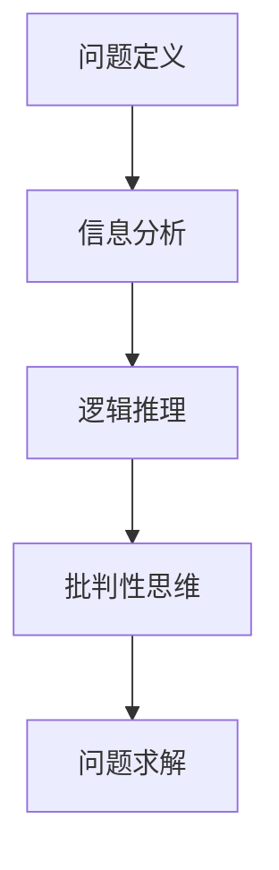

                 

# 深度思考的意义:洞察问题的本质

> 关键词：深度思考, 问题理解, 批判性思维, 问题求解, 逻辑推理, 算法优化

## 1. 背景介绍

### 1.1 问题由来
在当今这个信息爆炸的时代，人们每天都在面对无数的问题和挑战。从日常生活中的琐事，到企业发展中的重大决策，都需要我们深入思考，寻找解决方案。然而，面对复杂多变的问题，人们往往容易陷入“乱花渐欲迷人眼”的困惑中，难以找到问题的本质，从而影响了决策的科学性和有效性。

### 1.2 问题核心关键点
深度思考是一种思考问题的深度和广度，通过深度思考，人们能够超越表象，洞察问题的本质，从而找到最有效的解决方案。其核心关键点在于：
1. 问题定义：准确理解问题的本质，明确问题的边界和目标。
2. 信息分析：全面收集和整理与问题相关的信息，找出问题的本质。
3. 逻辑推理：运用逻辑推理的方法，逐步缩小问题范围，直至找到解决方案。
4. 批判性思维：对已有的假设和推理进行批判性思考，防止逻辑谬误。
5. 问题求解：在全面理解和分析问题后，寻找并验证最有效的解决方案。

### 1.3 问题研究意义
深度思考对于个体和组织的发展具有重要意义：
1. 提升决策质量：深度思考能够帮助我们深入理解问题本质，找到更科学、合理的解决方案，从而提升决策质量。
2. 培养创新能力：深度思考能够激发我们的创造力，帮助我们突破思维定式，寻找创新的解决方案。
3. 提高工作效率：通过深度思考，我们能够找到问题的最优解，避免重复劳动，提高工作效率。
4. 增强自我认知：深度思考能够帮助我们更清晰地认识自我，提升自我管理能力。

## 2. 核心概念与联系

### 2.1 核心概念概述

为了更好地理解深度思考的原理和应用，本节将介绍几个密切相关的核心概念：

- **问题定义**：指对问题进行准确描述，明确问题的核心需求和关键要素。
- **信息分析**：指全面收集和整理与问题相关的信息，包括数据、事实、经验和知识等。
- **逻辑推理**：指运用逻辑和推理的方法，逐步缩小问题范围，最终找到问题的本质和解决方案。
- **批判性思维**：指对已有的假设和推理进行质疑和分析，避免逻辑谬误和偏见。
- **问题求解**：指在全面理解和分析问题后，寻找并验证最有效的解决方案。

这些核心概念之间的逻辑关系可以通过以下Mermaid流程图来展示：



这个流程图展示了深度思考的各个步骤：从问题的定义到信息分析，从逻辑推理到批判性思维，最终解决问题求解。

## 3. 核心算法原理 & 具体操作步骤

### 3.1 算法原理概述

深度思考本质上是一种算法化的思考方式，其核心思想是通过系统的步骤和逻辑推理，逐步缩小问题范围，直至找到问题的本质和解决方案。其算法原理包括以下几个关键步骤：

1. **问题定义**：明确问题的边界和目标，将其转化为可操作的形式。
2. **信息分析**：全面收集和整理与问题相关的信息，找出问题的本质。
3. **逻辑推理**：运用逻辑推理的方法，逐步缩小问题范围，直至找到解决方案。
4. **批判性思维**：对已有的假设和推理进行质疑和分析，避免逻辑谬误和偏见。
5. **问题求解**：在全面理解和分析问题后，寻找并验证最有效的解决方案。

### 3.2 算法步骤详解

以下是深度思考的详细操作步骤：

**Step 1: 问题定义**
- 明确问题的核心需求和关键要素，将其转化为可操作的形式。
- 将问题拆分为多个子问题，以便于逐步分析和解决。

**Step 2: 信息分析**
- 全面收集和整理与问题相关的信息，包括数据、事实、经验和知识等。
- 对信息进行分类和筛选，找出与问题最相关的部分。

**Step 3: 逻辑推理**
- 运用逻辑推理的方法，逐步缩小问题范围，直至找到问题的本质。
- 采用归纳法、演绎法、类比法等逻辑方法，分析问题的各个维度。

**Step 4: 批判性思维**
- 对已有的假设和推理进行质疑和分析，避免逻辑谬误和偏见。
- 运用逆向思维、假设检验等方法，验证推理的正确性。

**Step 5: 问题求解**
- 在全面理解和分析问题后，寻找并验证最有效的解决方案。
- 通过实验验证、数据分析等方法，评估解决方案的可行性和有效性。

### 3.3 算法优缺点

深度思考的算法原理具有以下优点：
1. 系统性：通过系统的步骤和逻辑推理，能够全面、深入地分析问题，避免片面和盲区。
2. 科学性：运用逻辑推理和批判性思维，能够保证推理的正确性和可行性。
3. 可操作性：通过明确问题定义和信息分析，能够将复杂问题转化为可操作的形式，便于解决。

同时，该算法也存在一定的局限性：
1. 复杂度高：深度思考涉及多个步骤和维度，计算量大，需要时间和精力投入。
2. 依赖数据：信息分析的质量和数量直接影响深度思考的效果，需要高质量的数据支持。
3. 逻辑推理限制：逻辑推理方法有一定的局限性，可能无法解决非逻辑性问题。

尽管存在这些局限性，但就目前而言，深度思考仍是解决复杂问题的重要范式。未来相关研究的重点在于如何进一步提高算法的效率和灵活性，同时兼顾科学性和可操作性。

### 3.4 算法应用领域

深度思考的算法原理在各个领域都有广泛的应用，例如：

- 企业管理：在企业决策、项目管理和团队协作中，深度思考能够帮助管理者全面理解问题，做出科学决策。
- 科学研究：在科学实验设计和数据分析中，深度思考能够帮助研究人员深入理解问题，发现新的科学规律。
- 工程技术：在产品设计和系统优化中，深度思考能够帮助工程师全面分析问题，提升产品和系统的质量。
- 医学领域：在诊断和治疗中，深度思考能够帮助医生全面理解患者情况，制定最佳诊疗方案。
- 教育领域：在教学设计和课程开发中，深度思考能够帮助教师全面分析学生需求，设计有效的教学方案。

这些领域中，深度思考已经成为解决问题的重要工具和方法。通过深度思考，我们能够更科学、系统地分析和解决各种复杂问题。

## 4. 数学模型和公式 & 详细讲解 & 举例说明

### 4.1 数学模型构建

在深度思考中，我们通常使用数学模型来描述问题的结构和特征。以下是一个典型的数学模型构建过程：

1. **问题定义**：将问题转化为数学形式，定义变量和方程。
2. **信息分析**：收集和整理与问题相关的数据，建立数据模型。
3. **逻辑推理**：运用数学推理的方法，逐步缩小问题范围，找到问题的本质。
4. **批判性思维**：对已有的假设和推理进行质疑和分析，验证推理的正确性。
5. **问题求解**：在全面理解和分析问题后，求解数学模型，找到问题的最优解。

### 4.2 公式推导过程

以一个简单的线性回归问题为例，展示数学模型和公式推导过程。

假设有一组数据 $(x_i, y_i)$，其中 $i=1,2,\dots,n$，我们需要建立线性回归模型来预测 $y$ 的值。

设线性回归模型的形式为：

$$
y = \beta_0 + \beta_1 x + \epsilon
$$

其中 $\beta_0$ 和 $\beta_1$ 为模型的参数，$\epsilon$ 为误差项。

根据最小二乘法，我们可以建立损失函数：

$$
L(\beta_0, \beta_1) = \frac{1}{2n}\sum_{i=1}^n (y_i - (\beta_0 + \beta_1 x_i))^2
$$

通过求解上述最小化问题，我们可以找到最优的 $\beta_0$ 和 $\beta_1$，使模型的预测误差最小。

### 4.3 案例分析与讲解

以一个实际案例为例，展示深度思考在项目管理中的应用：

某软件公司需要开发一个新的应用程序，项目团队面临多个子问题，如需求分析、技术架构设计、团队协作等。

**Step 1: 问题定义**
- 确定项目目标和需求，明确项目的核心要素。
- 将项目拆分为多个子问题，如需求分析、技术架构设计、团队协作等。

**Step 2: 信息分析**
- 全面收集和整理与项目相关的信息，包括客户需求、技术文档、团队成员经验等。
- 对信息进行分类和筛选，找出与项目最相关的部分。

**Step 3: 逻辑推理**
- 运用逻辑推理的方法，逐步缩小问题范围，找到项目的关键点。
- 采用归纳法、演绎法、类比法等逻辑方法，分析项目的各个维度。

**Step 4: 批判性思维**
- 对已有的假设和推理进行质疑和分析，避免逻辑谬误和偏见。
- 运用逆向思维、假设检验等方法，验证推理的正确性。

**Step 5: 问题求解**
- 在全面理解和分析问题后，寻找并验证最有效的解决方案。
- 通过实验验证、数据分析等方法，评估解决方案的可行性和有效性。

通过深度思考，项目团队能够全面、系统地分析项目问题，制定科学的解决方案，提高项目成功率。

## 5. 项目实践：代码实例和详细解释说明

### 5.1 开发环境搭建

在进行深度思考实践前，我们需要准备好开发环境。以下是使用Python进行深度思考的开发环境配置流程：

1. 安装Anaconda：从官网下载并安装Anaconda，用于创建独立的Python环境。

2. 创建并激活虚拟环境：
```bash
conda create -n myenv python=3.8
conda activate myenv
```

3. 安装必要的Python包：
```bash
pip install numpy scipy pandas matplotlib seaborn jupyter notebook
```

4. 安装Python科学计算库：
```bash
conda install scipy
```

完成上述步骤后，即可在`myenv`环境中开始深度思考实践。

### 5.2 源代码详细实现

下面我们以一个简单的线性回归问题为例，展示使用Python进行深度思考的代码实现。

首先，定义数据集：

```python
import numpy as np

# 生成随机数据
x = np.random.randn(100)
y = 2 * x + np.random.randn(100) * 0.1

# 可视化数据
import matplotlib.pyplot as plt
plt.scatter(x, y)
plt.xlabel('x')
plt.ylabel('y')
plt.title('Linear Regression Data')
plt.show()
```

然后，定义线性回归模型：

```python
from sklearn.linear_model import LinearRegression

# 定义模型
model = LinearRegression()

# 拟合数据
model.fit(x.reshape(-1, 1), y)
```

接着，输出模型参数：

```python
# 输出模型参数
print('Intercept:', model.intercept_)
print('Slope:', model.coef_[0])
```

最后，可视化模型的拟合结果：

```python
# 可视化拟合结果
plt.scatter(x, y)
plt.plot(x, model.predict(x.reshape(-1, 1)), color='red')
plt.xlabel('x')
plt.ylabel('y')
plt.title('Linear Regression Fit')
plt.show()
```

以上代码展示了使用Python进行深度思考的线性回归问题求解过程。可以看到，通过深度思考，我们能够将复杂问题转化为可操作的形式，并使用科学的方法求解。

### 5.3 代码解读与分析

让我们再详细解读一下关键代码的实现细节：

**数据生成**：使用NumPy生成随机数据，并使用Matplotlib可视化数据。

**模型定义**：使用Scikit-learn库中的LinearRegression模型，定义线性回归模型。

**模型拟合**：使用fit方法拟合模型，将数据集作为输入，输出最优的模型参数。

**参数输出**：通过模型参数属性，输出线性回归模型的截距和斜率。

**拟合结果可视化**：使用Matplotlib可视化拟合结果，将模型预测的直线与原始数据进行对比。

通过这段代码，我们可以看到深度思考在数据建模和问题求解中的应用。在实际应用中，我们还需要结合具体问题，灵活运用各种数学工具和方法，才能更好地解决复杂问题。

## 6. 实际应用场景

### 6.1 项目管理

在项目管理中，深度思考能够帮助团队全面、系统地分析项目问题，制定科学的解决方案，提高项目成功率。

具体而言，项目团队可以从以下几个方面应用深度思考：
1. **需求分析**：通过深度思考，全面理解客户需求，明确项目的核心要素和边界。
2. **技术架构设计**：运用逻辑推理，设计高效、可维护的技术架构，降低项目风险。
3. **团队协作**：通过批判性思维，发现团队协作中的问题，制定有效的沟通和协调策略。
4. **风险管理**：运用数据和逻辑分析，识别项目中的潜在风险，制定应对措施。

### 6.2 科学研究

在科学研究中，深度思考能够帮助研究人员全面理解问题，发现新的科学规律，推动科学进步。

具体而言，研究人员可以从以下几个方面应用深度思考：
1. **数据收集和整理**：通过全面收集和整理数据，找出与问题最相关的部分。
2. **假设验证和推理**：运用逻辑推理，验证假设的正确性，寻找新的科学规律。
3. **问题求解**：通过批判性思维，发现问题的关键点，制定有效的实验方案。
4. **结果分析**：运用数据和逻辑分析，分析实验结果，验证科学规律。

### 6.3 工程技术

在工程技术中，深度思考能够帮助工程师全面分析问题，提升产品和系统的质量，满足用户需求。

具体而言，工程师可以从以下几个方面应用深度思考：
1. **需求分析**：通过深度思考，全面理解用户需求，设计高效、用户友好的产品。
2. **技术架构设计**：运用逻辑推理，设计高效、可扩展的技术架构，提升系统性能。
3. **测试和优化**：通过批判性思维，发现系统中的问题，制定有效的测试和优化策略。
4. **用户反馈**：运用数据和逻辑分析，分析用户反馈，持续改进产品和系统。

### 6.4 未来应用展望

随着深度思考算法的不断发展，其在各个领域的应用前景将更加广阔。

在未来，深度思考有望在以下领域取得新的突破：
1. **人工智能**：在AI模型的训练和优化中，深度思考能够帮助科学家全面理解问题，设计更高效、更通用的算法。
2. **金融科技**：在金融风控和投资决策中，深度思考能够帮助金融从业者全面理解市场变化，制定更科学、更稳健的投资策略。
3. **医疗健康**：在疾病诊断和治疗中，深度思考能够帮助医生全面理解患者情况，制定最佳诊疗方案。
4. **教育科技**：在在线教育和知识共享中，深度思考能够帮助教师全面理解学生需求，设计更有效的教学方案。
5. **环境保护**：在环境保护和可持续发展中，深度思考能够帮助科学家全面理解环境变化，制定更科学、更有效的环保措施。

## 7. 工具和资源推荐

### 7.1 学习资源推荐

为了帮助开发者系统掌握深度思考的理论基础和实践技巧，这里推荐一些优质的学习资源：

1. 《深度思考的艺术》系列博文：由深度思考专家撰写，深入浅出地介绍了深度思考原理、方法和应用。
2. 《批判性思维》课程：斯坦福大学开设的批判性思维课程，有Lecture视频和配套作业，教你如何系统思考问题。
3. 《科学思维导论》书籍：介绍了科学思维的基本概念和逻辑方法，适合深入学习。
4. Coursera深度思考课程：Coursera平台上提供的深度思考课程，涵盖多个领域的深度思考方法。
5. GitHub深度思考项目：GitHub上提供的深度思考项目，包括代码实现和详细文档，是学习深度思考的好材料。

通过对这些资源的学习实践，相信你一定能够快速掌握深度思考的精髓，并用于解决实际的复杂问题。

### 7.2 开发工具推荐

高效的开发离不开优秀的工具支持。以下是几款用于深度思考开发的常用工具：

1. Jupyter Notebook：Python的交互式笔记本，支持代码实现、数据可视化和分析，适合深度思考实践。
2. RStudio：R语言的集成开发环境，支持数据可视化、统计分析和机器学习，适合深度思考在数据科学中的应用。
3. Tableau：数据可视化工具，支持复杂的数据分析和大数据处理，适合深度思考在商业分析和决策中的应用。
4. Matplotlib和Seaborn：Python的可视化库，支持各种数据可视化，适合深度思考在数据分析中的应用。
5. TensorFlow和PyTorch：深度学习框架，支持复杂模型的训练和优化，适合深度思考在AI领域的应用。

合理利用这些工具，可以显著提升深度思考的开发效率，加快创新迭代的步伐。

### 7.3 相关论文推荐

深度思考的研究源于学界的持续研究。以下是几篇奠基性的相关论文，推荐阅读：

1. 《深度思考与问题解决》：探讨深度思考的原理和方法，强调逻辑推理和批判性思维的重要性。
2. 《科学发现中的深度思考》：讨论深度思考在科学研究中的应用，提出科学发现的深度思考模型。
3. 《批判性思维与深度思考》：分析批判性思维和深度思考的关系，探讨其在问题解决中的作用。
4. 《人工智能中的深度思考》：介绍深度思考在人工智能领域的应用，提出AI模型的深度思考范式。
5. 《未来思考：深度思考的未来发展方向》：探讨深度思考的未来发展趋势和应用前景，提出未来思考的挑战和机遇。

这些论文代表了大深度思考研究的发展脉络。通过学习这些前沿成果，可以帮助研究者把握学科前进方向，激发更多的创新灵感。

## 8. 总结：未来发展趋势与挑战

### 8.1 总结

本文对深度思考的原理和应用进行了全面系统的介绍。首先阐述了深度思考的背景和意义，明确了深度思考在问题理解、信息分析、逻辑推理、批判性思维和问题求解中的核心作用。其次，从原理到实践，详细讲解了深度思考的算法原理和操作步骤，给出了深度思考任务开发的完整代码实例。同时，本文还广泛探讨了深度思考方法在项目管理、科学研究、工程技术等多个领域的应用前景，展示了深度思考算法的巨大潜力。此外，本文精选了深度思考技术的各类学习资源，力求为读者提供全方位的技术指引。

通过本文的系统梳理，可以看到，深度思考作为一种思考问题的深度和广度，已经成为解决复杂问题的重要工具和方法。深度思考能够帮助个体和组织全面、系统地分析问题，制定科学的解决方案，提升决策质量和效率。在未来，随着深度思考算法的不断演进和应用领域的不断拓展，相信深度思考将成为构建智能系统的核心工具，为人类认知智能的进化带来深远影响。

### 8.2 未来发展趋势

展望未来，深度思考的算法原理将呈现以下几个发展趋势：

1. 系统性增强：深度思考将更加注重系统性，全面、系统地分析问题，避免片面和盲区。
2. 科学性提高：深度思考将更加注重科学性，运用更多的科学方法和工具，提高推理的正确性和可行性。
3. 自动化加强：深度思考将更加注重自动化，利用AI和大数据技术，提升问题求解的效率和精度。
4. 跨领域融合：深度思考将更加注重跨领域融合，结合不同领域的知识和工具，解决更复杂的综合问题。
5. 人机协同：深度思考将更加注重人机协同，结合人类智慧和机器能力，提升问题求解的效果。

这些趋势凸显了深度思考算法的广阔前景。这些方向的探索发展，必将进一步提升深度思考系统的性能和应用范围，为人类认知智能的进化带来深远影响。

### 8.3 面临的挑战

尽管深度思考算法已经取得了瞩目成就，但在迈向更加智能化、普适化应用的过程中，它仍面临着诸多挑战：

1. 计算资源限制：深度思考涉及复杂的计算和推理，需要大量的计算资源和时间投入，制约了算法的应用范围。
2. 数据质量问题：深度思考对数据的质量和数量要求较高，数据质量不高或数据不足会导致问题求解的偏差和错误。
3. 逻辑推理难度：深度思考的逻辑推理方法具有一定的复杂性，可能难以处理非线性、非确定性问题。
4. 人机交互问题：深度思考需要与人机交互，可能存在理解不足和误导性输出。
5. 跨领域应用限制：深度思考在跨领域应用时，可能面临知识整合和协同的挑战。

这些挑战需要进一步研究和解决，才能使深度思考算法更好地应用于各个领域。

### 8.4 研究展望

面对深度思考所面临的挑战，未来的研究需要在以下几个方面寻求新的突破：

1. 数据融合与知识图谱：通过数据融合和知识图谱，提高深度思考的数据质量和知识整合能力，提升问题求解的准确性和全面性。
2. 自动推理与AI辅助：利用自动推理和AI技术，提升深度思考的逻辑推理能力和自动化水平，减少人工干预和计算成本。
3. 人机协同与智能交互：结合人机协同和智能交互技术，提升深度思考的交互效果和用户体验，增强系统的智能性。
4. 跨领域应用与融合：结合不同领域的知识和工具，提升深度思考的跨领域应用能力，解决更复杂的综合问题。
5. 伦理与安全：在深度思考算法中加入伦理和安全约束，确保算法的可解释性和安全性，防止误导性输出。

这些研究方向的探索，必将引领深度思考算法迈向更高的台阶，为构建安全、可靠、可解释、可控的智能系统铺平道路。面向未来，深度思考算法还需要与其他人工智能技术进行更深入的融合，如知识表示、因果推理、强化学习等，多路径协同发力，共同推动自然语言理解和智能交互系统的进步。只有勇于创新、敢于突破，才能不断拓展深度思考算法的边界，让智能技术更好地造福人类社会。

## 9. 附录：常见问题与解答

**Q1: 深度思考与直觉思维有什么区别？**

A: 深度思考与直觉思维是两种不同的思维方式。深度思考是一种系统、科学、逻辑的思考方式，通过全面、系统地分析问题，找到最优解决方案。而直觉思维则是一种快速、跳跃、非系统的思考方式，依赖于经验、情感和潜意识，可能缺乏科学依据。在实际问题求解中，深度思考和直觉思维应结合使用，以获得更全面、更准确的解决方案。

**Q2: 如何提高深度思考的能力？**

A: 提高深度思考的能力需要从多个方面入手：
1. 学习系统性思维方法，如逻辑推理、批判性思维等。
2. 多阅读、多思考，积累丰富的知识储备。
3. 多实践、多总结，通过不断的实践和总结，提升思维能力。
4. 多交流、多协作，与他人交流、协作，获取不同的视角和思路。
5. 保持好奇心，对问题保持探索和质疑的精神。

**Q3: 深度思考与数据分析有什么区别？**

A: 深度思考和数据分析是两种不同的思考方式。深度思考是一种全面、系统、逻辑的思考方式，通过分析问题的各个维度，找到最优解决方案。而数据分析则是一种以数据为基础的思考方式，通过数据挖掘和统计分析，发现问题的规律和趋势。在实际问题求解中，深度思考和数据分析应结合使用，以获得更全面、更准确的解决方案。

**Q4: 深度思考与AI技术的区别？**

A: 深度思考和AI技术是两种不同的思维方式。深度思考是一种全面、系统、逻辑的思考方式，通过分析问题的各个维度，找到最优解决方案。而AI技术则是一种基于算法的自动化思考方式，通过机器学习、深度学习等技术，实现自动化的推理和决策。在实际问题求解中，深度思考和AI技术应结合使用，以获得更全面、更准确的解决方案。

这些问题的解答，希望能为你提供更深刻的思考和理解，帮助你在实际问题求解中更好地应用深度思考算法。

