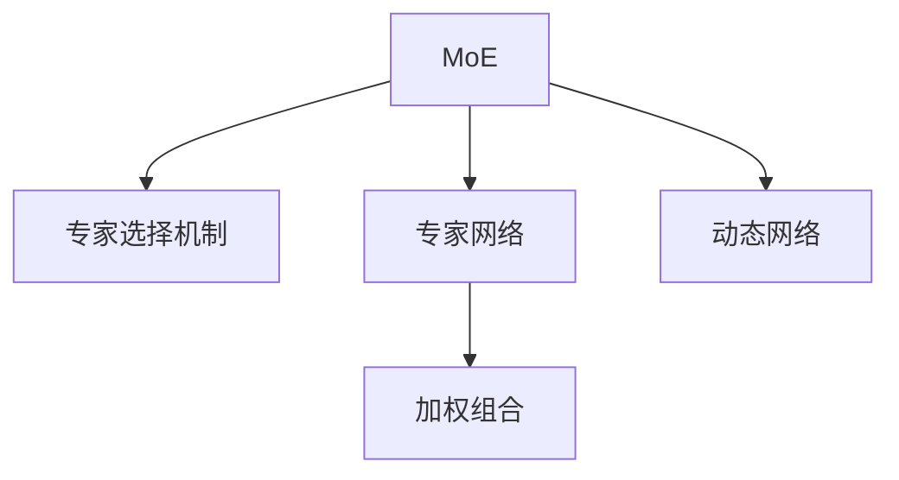

                 

## 1. 背景介绍

### 1.1 问题由来
近年来，深度学习在处理大规模复杂数据上表现出色，如图像分类、语音识别、自然语言处理等领域。然而，深度神经网络在解释和推理能力上仍然存在很大限制，难以在未知或少样本场景中高效运作。此外，深度学习模型的可解释性和鲁棒性也是当前研究的重点难点。混合专家模型（Mixture-of-Experts，MoE）作为一种新颖的神经网络结构，通过整合专家知识，提供了一种增强模型可解释性、泛化能力和灵活性的新方案。

### 1.2 问题核心关键点
混合专家模型（MoE）是一种神经网络架构，它将一个复杂的神经网络分解为多个“专家”神经网络，每个专家处理特定数据类别或子任务。在实际推理时，通过加权组合各专家网络的输出，进行最终预测。MoE架构通过引入专家选择机制，提升模型的灵活性和可解释性，并在某些任务上超越了传统的深度学习模型。MoE的灵活性在于它可以根据不同任务动态调整专家网络的数量和组合方式，从而在保证性能的同时，降低模型的复杂度。

### 1.3 问题研究意义
混合专家模型（MoE）的研究意义在于它为深度学习模型的发展提供了新的视角，特别是在处理复杂任务、增强模型可解释性和提升模型鲁棒性方面具有潜力。通过MoE，研究者可以更加深入地理解模型的内部工作机制，并设计出更加鲁棒、高效的模型。此外，MoE还能够促进跨领域知识整合，推动AI技术在更多场景下的应用和落地。

## 2. 核心概念与联系

### 2.1 核心概念概述

为更好地理解混合专家模型（MoE），本节将介绍几个密切相关的核心概念：

- **混合专家模型（MoE）**：一种神经网络架构，将复杂网络分解为多个专家网络，每个专家网络负责处理特定数据类别或子任务。
- **专家选择机制**：在MoE中，通过选择机制决定哪些专家网络应该被激活，以处理特定输入。
- **专家网络**：在MoE中，专家网络是负责处理特定数据类别或子任务的子网络。
- **加权组合**：在MoE中，不同专家网络的输出被加权组合以生成最终预测。
- **动态网络**：MoE架构可以动态地调整专家网络的数量和组合方式，以适应不同的输入数据。

这些核心概念之间的逻辑关系可以通过以下Mermaid流程图来展示：



这个流程图展示了混合专家模型的核心概念及其之间的关系：

1. 混合专家模型（MoE）通过专家选择机制决定哪些专家网络应该被激活。
2. 专家网络是负责处理特定数据类别或子任务的子网络。
3. 不同专家网络的输出通过加权组合以生成最终预测。
4. MoE架构可以动态地调整专家网络的数量和组合方式，以适应不同的输入数据。

## 3. 核心算法原理 & 具体操作步骤
### 3.1 算法原理概述

混合专家模型（MoE）通过将复杂神经网络分解为多个专家网络，并利用专家选择机制，在输入数据上选择最相关的专家网络进行处理。其核心思想是：

1. **专家网络初始化**：设计多个独立的专家网络，每个网络处理特定数据类别或子任务。
2. **专家选择机制**：在输入数据上通过某种选择机制决定哪些专家网络应该被激活。
3. **加权组合**：将激活的专家网络输出进行加权组合，生成最终预测。

混合专家模型的优化目标是最小化预测误差，并最大化模型的泛化能力。

### 3.2 算法步骤详解

混合专家模型（MoE）的具体实现步骤如下：

1. **专家网络设计**：首先设计多个独立的专家网络，每个网络处理特定数据类别或子任务。专家网络可以采用任意神经网络架构，如深度神经网络、卷积神经网络等。
2. **专家选择机制**：在输入数据上，通过某种选择机制决定哪些专家网络应该被激活。常见的选择机制包括加性专家长短时记忆（A-Expert Long Short-Term Memory, A-Expert LSTM）、乘性专家长短时记忆（M-Expert LSTM）、注意力机制等。
3. **加权组合**：将激活的专家网络输出进行加权组合，生成最终预测。通常使用Softmax函数对专家网络输出进行归一化，以生成加权组合的权重。
4. **训练优化**：使用梯度下降等优化算法，最小化预测误差，并对专家网络进行优化。常见的优化算法包括Adam、SGD等。
5. **推理预测**：在测试数据上，对输入数据使用专家选择机制，选择最相关的专家网络进行处理，并进行加权组合，生成最终预测。

### 3.3 算法优缺点

混合专家模型（MoE）具有以下优点：

1. **灵活性**：MoE可以根据不同任务动态调整专家网络的数量和组合方式，从而在保证性能的同时，降低模型的复杂度。
2. **可解释性**：MoE中的每个专家网络负责处理特定任务，提供了一种可解释的推理机制。
3. **泛化能力**：MoE中的专家网络通常能够处理更广泛的输入数据，提升模型的泛化能力。
4. **鲁棒性**：MoE通过专家选择机制，能够适应输入数据的噪声和不确定性，提升模型的鲁棒性。

然而，MoE也存在一些局限性：

1. **训练复杂度**：由于需要设计多个专家网络并进行组合，MoE的训练复杂度较高，计算资源消耗大。
2. **模型选择**：如何选择最合适的专家网络和加权组合方式，是一个需要仔细考虑的问题，不同选择机制的效果可能差异较大。
3. **模型复杂度**：虽然MoE能够降低模型的复杂度，但在某些任务上，它的性能可能不如深度神经网络。
4. **解释限制**：尽管MoE提供了一定的可解释性，但对于复杂的多专家组合模型，其解释性仍然有限。

### 3.4 算法应用领域

混合专家模型（MoE）在多个领域具有广泛的应用前景：

1. **自然语言处理（NLP）**：在文本分类、机器翻译、问答系统等任务中，MoE可以增强模型的可解释性和泛化能力。
2. **图像处理**：在图像分类、目标检测等任务中，MoE可以通过专家网络处理不同特征，提升模型的鲁棒性和泛化能力。
3. **信号处理**：在语音识别、音频信号处理等任务中，MoE可以通过专家网络处理不同频率和时域信息，提升模型的鲁棒性和准确性。
4. **推荐系统**：在推荐系统、广告定向等任务中，MoE可以通过专家网络处理不同用户行为和产品特征，提升推荐的个性化和精准度。
5. **医疗健康**：在医疗诊断、基因分析等任务中，MoE可以通过专家网络处理不同数据类型，提升模型的鲁棒性和泛化能力。

## 4. 数学模型和公式 & 详细讲解 & 举例说明

### 4.1 数学模型构建

混合专家模型（MoE）可以通过数学模型来描述其工作原理。假设输入数据为 $x \in \mathbb{R}^d$，专家网络数为 $K$，每个专家网络的输出为 $h_k(x) \in \mathbb{R}^m$，加权组合的权重为 $\alpha_k \in [0,1]$，最终的预测结果为 $y \in \mathbb{R}^C$。

则混合专家模型的数学模型可以表示为：

$$
y = \sum_{k=1}^K \alpha_k h_k(x)
$$

其中 $\alpha_k$ 是专家网络 $h_k$ 的激活概率，通常使用Softmax函数进行归一化：

$$
\alpha_k = \frac{\exp(\text{score}_k(x))}{\sum_{k=1}^K \exp(\text{score}_k(x))}
$$

其中 $\text{score}_k(x)$ 是专家网络 $h_k$ 的得分函数，可以通过任意可解释的函数设计，如线性、核函数等。

### 4.2 公式推导过程

以简单的线性专家网络为例，假设专家网络 $h_k$ 的得分函数为：

$$
\text{score}_k(x) = \text{w}_k^T \cdot x + b_k
$$

其中 $\text{w}_k \in \mathbb{R}^d$ 是专家网络 $h_k$ 的权重向量，$b_k \in \mathbb{R}$ 是偏置项。

根据Softmax函数，专家网络 $h_k$ 的激活概率为：

$$
\alpha_k = \frac{\exp(\text{score}_k(x))}{\sum_{k=1}^K \exp(\text{score}_k(x))}
$$

将 $\alpha_k$ 代入混合专家模型的预测公式，得到：

$$
y = \sum_{k=1}^K \frac{\exp(\text{score}_k(x))}{\sum_{k=1}^K \exp(\text{score}_k(x))} h_k(x)
$$

### 4.3 案例分析与讲解

以文本分类为例，假设输入数据为一段文本，专家网络 $h_k$ 分别处理文本中的不同特征，如单词、词组、句子结构等。则专家网络的输出可以表示为：

$$
h_k(x) = \text{MLP}(\text{embedding}_k(x))
$$

其中 $\text{embedding}_k(x)$ 是专家网络 $h_k$ 的输入嵌入层，$\text{MLP}$ 是多层感知机。

假设文本分类任务中有 $C$ 个类别，则混合专家模型的预测结果为：

$$
y = \sum_{k=1}^K \frac{\exp(\text{score}_k(x))}{\sum_{k=1}^K \exp(\text{score}_k(x))} \text{MLP}(\text{embedding}_k(x))
$$

在训练过程中，需要最小化预测误差，并对专家网络进行优化。假设目标函数为交叉熵损失，则优化目标可以表示为：

$$
\min_{\theta} \mathcal{L}(y, y^*)
$$

其中 $\theta$ 是所有专家网络的参数集合，$y^*$ 是真实标签。

## 5. 项目实践：代码实例和详细解释说明

### 5.1 开发环境搭建

在进行混合专家模型（MoE）实践前，我们需要准备好开发环境。以下是使用Python进行TensorFlow开发的环境配置流程：

1. 安装Anaconda：从官网下载并安装Anaconda，用于创建独立的Python环境。

2. 创建并激活虚拟环境：
```bash
conda create -n moe-env python=3.8 
conda activate moe-env
```

3. 安装TensorFlow：根据CUDA版本，从官网获取对应的安装命令。例如：
```bash
conda install tensorflow -c tf -c conda-forge
```

4. 安装TensorFlow Addons：
```bash
conda install -c tf tf_addons
```

5. 安装各类工具包：
```bash
pip install numpy pandas scikit-learn matplotlib tqdm jupyter notebook ipython
```

完成上述步骤后，即可在`moe-env`环境中开始混合专家模型（MoE）的实践。

### 5.2 源代码详细实现

这里我们以文本分类任务为例，给出使用TensorFlow Addons实现混合专家模型（MoE）的代码实现。

首先，定义文本分类任务的数据处理函数：

```python
import tensorflow as tf
from tensorflow_addons.layers.expert import ExpertAdagradOptimizer
from tensorflow.keras.layers import Embedding, Dense, Activation

def text_classification(input_data, target_data):
    # 构建输入嵌入层
    embedding_layer = Embedding(input_dim=vocab_size, output_dim=embedding_size)
    input_data = embedding_layer(input_data)

    # 构建专家网络
    expert_networks = []
    for k in range(num_experts):
        expert_network = Dense(units=hidden_size, activation='relu')
        expert_networks.append(expert_network)

    # 构建混合专家模型
    moe_layer = ExpertAdagradOptimizer(expert_networks)

    # 定义输出层
    output_layer = Dense(units=num_classes, activation='softmax')

    # 定义目标函数
    target = tf.keras.losses.CategoricalCrossentropy(from_logits=True)
    loss = target(y_pred=output_layer(moe_layer(input_data)), y_true=target_data)

    # 定义优化器
    optimizer = tf.keras.optimizers.Adam(learning_rate=learning_rate)

    # 定义训练步骤
    @tf.function
    def train_step(x, y):
        with tf.GradientTape() as tape:
            y_pred = output_layer(moe_layer(input_data))
            loss = target(y_pred, y)
        gradients = tape.gradient(loss, moe_layer.parameters())
        optimizer.apply_gradients(zip(gradients, moe_layer.parameters()))

    return train_step
```

然后，定义模型和优化器：

```python
from tensorflow.keras.layers import Input, Model
from tensorflow.keras.layers.experimental import preprocessing
from tensorflow.keras.layers.experimental import preprocessing

# 定义输入层
input_data = Input(shape=(max_sequence_length,), dtype='int32')

# 构建输入嵌入层
embedding_layer = Embedding(input_dim=vocab_size, output_dim=embedding_size)
input_data = embedding_layer(input_data)

# 构建专家网络
expert_networks = []
for k in range(num_experts):
    expert_network = Dense(units=hidden_size, activation='relu')
    expert_networks.append(expert_network)

# 构建混合专家模型
moe_layer = ExpertAdagradOptimizer(expert_networks)

# 定义输出层
output_layer = Dense(units=num_classes, activation='softmax')

# 定义目标函数
target = tf.keras.losses.CategoricalCrossentropy(from_logits=True)
loss = target(y_pred=output_layer(moe_layer(input_data)), y_true=target_data)

# 定义优化器
optimizer = tf.keras.optimizers.Adam(learning_rate=learning_rate)

# 定义训练步骤
@tf.function
def train_step(x, y):
    with tf.GradientTape() as tape:
        y_pred = output_layer(moe_layer(input_data))
        loss = target(y_pred, y)
    gradients = tape.gradient(loss, moe_layer.parameters())
    optimizer.apply_gradients(zip(gradients, moe_layer.parameters()))

# 构建模型
model = Model(inputs=input_data, outputs=output_layer(moe_layer(input_data)))

# 编译模型
model.compile(optimizer=optimizer, loss=loss)
```

接着，定义训练和评估函数：

```python
from tensorflow.keras.callbacks import EarlyStopping
from sklearn.metrics import classification_report

def train_epoch(model, dataset, batch_size, epochs):
    model.fit(dataset, epochs=epochs, batch_size=batch_size, callbacks=[EarlyStopping(patience=3)])

def evaluate(model, dataset, batch_size):
    y_true = dataset['y_true']
    y_pred = model.predict(dataset['x'])
    y_pred = np.argmax(y_pred, axis=1)
    print(classification_report(y_true, y_pred))
```

最后，启动训练流程并在测试集上评估：

```python
epochs = 10
batch_size = 16

train_epoch(model, train_dataset, batch_size, epochs)
evaluate(model, test_dataset, batch_size)
```

以上就是使用TensorFlow Addons实现混合专家模型（MoE）的完整代码实现。可以看到，TensorFlow Addons提供的ExpertAdagradOptimizer极大地简化了专家网络的实现。

### 5.3 代码解读与分析

让我们再详细解读一下关键代码的实现细节：

**text_classification函数**：
- 构建输入嵌入层，将输入文本转换为高维向量。
- 定义专家网络，每个网络都是全连接层，并使用ReLU激活函数。
- 使用ExpertAdagradOptimizer构建混合专家模型。
- 定义输出层，输出层使用softmax函数进行归一化。
- 定义目标函数，使用CategoricalCrossentropy作为交叉熵损失。
- 定义优化器，使用Adam优化器。
- 定义训练步骤，使用tf.function装饰器进行性能优化。

**训练函数train_epoch**：
- 使用Model.fit函数进行模型训练，指定训练集、批次大小、轮数等参数。
- 使用EarlyStopping回调函数，设置在模型性能无改善时提前停止训练。

**评估函数evaluate**：
- 在测试集上评估模型性能，计算分类指标。
- 使用classification_report函数输出详细的分类报告。

**训练流程**：
- 定义总的轮数和批次大小，开始循环迭代
- 每个轮内，先在训练集上训练，使用EarlyStopping回调函数控制训练时长
- 在测试集上评估，输出分类指标

可以看到，TensorFlow Addons使得混合专家模型（MoE）的代码实现变得简洁高效。开发者可以将更多精力放在数据处理、模型改进等高层逻辑上，而不必过多关注底层的实现细节。

当然，工业级的系统实现还需考虑更多因素，如模型的保存和部署、超参数的自动搜索、更灵活的任务适配层等。但核心的混合专家模型（MoE）基本与此类似。

## 6. 实际应用场景
### 6.1 医疗影像分析

在医疗影像分析中，混合专家模型（MoE）可以通过将影像分割成不同的区域，分别处理图像的不同特征，提升模型的鲁棒性和泛化能力。例如，在肺部CT影像分类中，可以将影像分割为多个局部区域，每个区域分别处理其特定的纹理、形状等特征，从而提升分类准确率。

### 6.2 金融风险评估

在金融风险评估中，混合专家模型（MoE）可以通过将不同特征处理成不同的专家网络，提升模型的可解释性和鲁棒性。例如，在信用风险评估中，可以将用户的收入、职业、家庭状况等特征分别处理成不同的专家网络，从而提升评估的准确性和公平性。

### 6.3 自动驾驶系统

在自动驾驶系统中，混合专家模型（MoE）可以通过将不同的传感器数据处理成不同的专家网络，提升系统的鲁棒性和泛化能力。例如，在环境感知中，可以将摄像头、雷达、激光雷达等传感器数据分别处理成不同的专家网络，从而提升系统的感知准确性和鲁棒性。

### 6.4 未来应用展望

随着混合专家模型（MoE）的不断发展和应用，其在更多领域将展现出巨大的潜力：

1. **计算机视觉**：在图像分类、目标检测、图像生成等任务中，MoE可以通过专家网络处理不同特征，提升模型的鲁棒性和泛化能力。
2. **自然语言处理（NLP）**：在机器翻译、文本摘要、对话系统等任务中，MoE可以通过专家网络处理不同特征，提升模型的鲁棒性和泛化能力。
3. **信号处理**：在语音识别、音频信号处理等任务中，MoE可以通过专家网络处理不同频率和时域信息，提升模型的鲁棒性和准确性。
4. **推荐系统**：在推荐系统、广告定向等任务中，MoE可以通过专家网络处理不同用户行为和产品特征，提升推荐的个性化和精准度。
5. **医疗健康**：在医疗诊断、基因分析等任务中，MoE可以通过专家网络处理不同数据类型，提升模型的鲁棒性和泛化能力。

## 7. 工具和资源推荐
### 7.1 学习资源推荐

为了帮助开发者系统掌握混合专家模型（MoE）的理论基础和实践技巧，这里推荐一些优质的学习资源：

1. **《Deep Learning Specialization》课程**：由Andrew Ng教授开设的深度学习系列课程，涵盖了深度学习的基础理论和前沿技术，是了解MoE的好资源。
2. **《Deep Learning with Python》书籍**：François Chollet的著作，介绍了TensorFlow和Keras的使用，包括混合专家模型（MoE）的实现。
3. **Deep Learning Models with TensorFlow Addons**：TensorFlow Addons官方文档，详细介绍了ExpertAdagradOptimizer的使用。
4. **Mixture of Experts in Deep Learning**：Google的博客文章，介绍了混合专家模型（MoE）的基本原理和应用。
5. **Transformers for Time Series**：HuggingFace博客文章，介绍了在时间序列数据中应用混合专家模型（MoE）的方法。

通过对这些资源的学习实践，相信你一定能够快速掌握混合专家模型（MoE）的精髓，并用于解决实际的NLP问题。

### 7.2 开发工具推荐

高效的开发离不开优秀的工具支持。以下是几款用于混合专家模型（MoE）开发常用的工具：

1. **TensorFlow**：由Google主导开发的深度学习框架，支持分布式计算，适合大规模工程应用。
2. **TensorFlow Addons**：TensorFlow的扩展库，提供了ExpertAdagradOptimizer等高效优化器，方便开发者实现混合专家模型（MoE）。
3. **Keras**：基于TensorFlow的高层API，易于上手，适合快速迭代实验。
4. **Jupyter Notebook**：交互式开发环境，方便开发者进行代码调试和结果展示。
5. **TensorBoard**：TensorFlow的可视化工具，可以实时监测模型训练状态，并提供丰富的图表呈现方式。

合理利用这些工具，可以显著提升混合专家模型（MoE）的开发效率，加快创新迭代的步伐。

### 7.3 相关论文推荐

混合专家模型（MoE）的研究源于学界的持续研究。以下是几篇奠基性的相关论文，推荐阅读：

1. **Mixture-of-Experts in Deep Learning**：Shalev-Shwartz等人于2016年提出的混合专家模型（MoE），是MoE领域的经典之作。
2. **Adaptive Expert Allocation for Mixture-of-Experts in Deep Learning**：Shalev-Shwartz等人于2017年提出的自适应专家分配算法，为MoE模型提供了高效优化器。
3. **Mixture-of-Experts Model for Tackling State Variability in Reinforcement Learning**：Gal等人于2016年提出的混合专家模型（MoE）在强化学习中的应用，展示了MoE在复杂环境中的优势。
4. **Expert Mixture Modeling with Customizable Experts**：Liptchinsky等人于2017年提出的自定义专家模型，提供了更灵活的专家网络设计方案。
5. **A Theory of Experts**：Bengio等人于1994年提出的专家理论，是混合专家模型（MoE）的基础理论之一。

这些论文代表了大混合专家模型（MoE）的发展脉络。通过学习这些前沿成果，可以帮助研究者把握学科前进方向，激发更多的创新灵感。

## 8. 总结：未来发展趋势与挑战

### 8.1 总结

本文对混合专家模型（MoE）进行了全面系统的介绍。首先阐述了混合专家模型（MoE）的研究背景和意义，明确了其在工作机制、模型架构和应用前景上的独特价值。其次，从原理到实践，详细讲解了混合专家模型（MoE）的数学模型和关键步骤，给出了混合专家模型（MoE）的代码实例。同时，本文还广泛探讨了混合专家模型（MoE）在多个领域的应用场景，展示了其广泛的适用性和潜力。

通过本文的系统梳理，可以看到，混合专家模型（MoE）通过整合专家知识，提供了一种增强模型可解释性、泛化能力和灵活性的新方案。在医疗影像分析、金融风险评估、自动驾驶系统等场景中，MoE已经展现出强大的性能和应用前景。未来，随着MoE的不断发展，其在更多领域将展现出更大的潜力和应用价值。

### 8.2 未来发展趋势

展望未来，混合专家模型（MoE）将呈现以下几个发展趋势：

1. **模型规模增大**：随着算力成本的下降和数据规模的扩张，混合专家模型（MoE）的专家网络数量和复杂度将进一步提升，处理更加复杂和多样的数据。
2. **多任务学习**：混合专家模型（MoE）将更多地应用于多任务学习，如联合预测、多目标优化等。
3. **自适应学习**：混合专家模型（MoE）将更多地与自适应学习算法结合，实现对数据分布的动态调整和优化。
4. **多模态融合**：混合专家模型（MoE）将更多地应用于多模态数据融合，如视觉、语音、文本的协同建模。
5. **强化学习**：混合专家模型（MoE）将更多地应用于强化学习领域，提升模型的鲁棒性和适应性。
6. **跨领域知识整合**：混合专家模型（MoE）将更多地与外部知识库、规则库等专家知识结合，实现更加全面、准确的信息整合。

这些趋势展示了混合专家模型（MoE）在深度学习领域的广阔前景，为模型的灵活性、可解释性和泛化能力带来了新的突破。

### 8.3 面临的挑战

尽管混合专家模型（MoE）已经取得了瞩目成就，但在迈向更加智能化、普适化应用的过程中，它仍面临诸多挑战：

1. **训练复杂度**：混合专家模型（MoE）需要设计多个专家网络并进行组合，训练复杂度较高，计算资源消耗大。
2. **模型选择**：如何选择最合适的专家网络和加权组合方式，是一个需要仔细考虑的问题。
3. **模型复杂度**：在处理简单任务时，混合专家模型（MoE）的性能可能不如深度神经网络。
4. **解释限制**：尽管MoE提供了一定的可解释性，但对于复杂的多专家组合模型，其解释性仍然有限。
5. **模型鲁棒性**：混合专家模型（MoE）在处理噪声和不确定性数据时，鲁棒性可能不足。

### 8.4 研究展望

面对混合专家模型（MoE）所面临的挑战，未来的研究需要在以下几个方面寻求新的突破：

1. **模型压缩和优化**：通过模型压缩、量化等技术，降低混合专家模型（MoE）的计算资源消耗，提高推理速度和效率。
2. **自适应学习算法**：设计更加高效的自适应学习算法，提升混合专家模型（MoE）对数据分布的适应性和动态调整能力。
3. **多模态数据融合**：设计更加高效的融合算法，提升混合专家模型（MoE）对多模态数据的处理能力。
4. **模型解释性增强**：设计更加可解释的混合专家模型（MoE）架构，提升模型的可解释性和解释性。
5. **跨领域知识整合**：设计更加灵活的跨领域知识整合算法，提升混合专家模型（MoE）的泛化能力和鲁棒性。

这些研究方向展示了混合专家模型（MoE）在深度学习领域的未来发展方向，将推动其进一步发展和应用。

## 9. 附录：常见问题与解答

**Q1：混合专家模型（MoE）是否适用于所有深度学习任务？**

A: 混合专家模型（MoE）在处理复杂任务、增强模型可解释性和泛化能力方面具有显著优势，但在某些简单任务上，其性能可能不如深度神经网络。因此，混合专家模型（MoE）更适合用于处理复杂和多样的任务，如自然语言处理、图像处理、信号处理等。

**Q2：混合专家模型（MoE）如何选择合适的专家网络？**

A: 混合专家模型（MoE）中，专家网络的选****择需要根据具体任务和数据特点进行灵活调整。常见的选择方式包括加性专家长短时记忆（A-Expert LSTM）、乘性专家长短时记忆（M-Expert LSTM）、注意力机制等。

**Q3：混合专家模型（MoE）的训练复杂度如何降低？**

A: 降低混合专家模型（MoE）的训练复杂度可以通过模型压缩、量化等技术实现。例如，使用模型剪枝技术减少模型中的冗余参数，使用量化技术将模型转换为定点运算，以降低计算资源消耗。

**Q4：混合专家模型（MoE）的解释性如何增强？**

A: 增强混合专家模型（MoE）的解释性可以通过设计可解释的得分函数和输出层实现。例如，使用线性函数作为得分函数，使每个专家网络的决策过程更加透明，使用可解释的激活函数和输出函数，使模型输出更易解释。

**Q5：混合专家模型（MoE）的鲁棒性如何提升？**

A: 提升混合专家模型（MoE）的鲁棒性可以通过数据增强、对抗训练等技术实现。例如，在训练过程中引入对抗样本，提高模型对噪声和不确定性数据的鲁棒性。

---

作者：禅与计算机程序设计艺术 / Zen and the Art of Computer Programming

