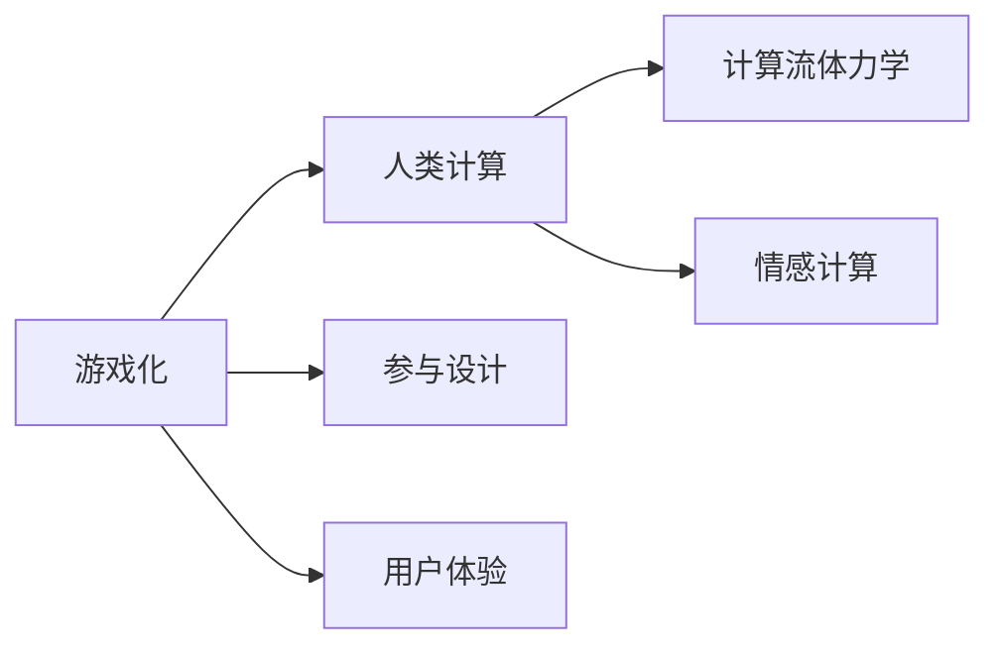

                 

# 游戏化：让参与人类计算充满乐趣

> 关键词：游戏化,人类计算,参与设计,用户体验,计算流体力学,情感计算

## 1. 背景介绍

在数字时代，计算已经渗透到我们生活的方方面面。从智能手机的快速计算，到大型数据中心的高效运算，计算正在重塑我们的世界。然而，面对复杂的计算任务，我们却常常感到沮丧和疲惫。如何激发人们参与计算的兴趣，让计算变得轻松愉悦，成为当前技术界亟待解决的问题。

## 2. 核心概念与联系

为更好地理解游戏化在人类计算中的应用，我们首先需要介绍几个核心概念：

### 2.1 核心概念概述

- **游戏化**：将游戏的元素（如目标、奖励、反馈、竞争）融入到非游戏环境中，增强用户参与度和体验感。
- **人类计算**：利用人类的认知能力进行计算或数据分析，如通过手工输入、整理数据、执行推理等。
- **参与设计**：通过设计让计算过程变得互动和有趣，使用户在参与计算的同时获得成就感。
- **用户体验**：计算界面和交互方式的优化，使用户在使用过程中感到愉悦和满足。
- **计算流体力学**：利用计算模拟流体运动的规律，解决工程实际问题。
- **情感计算**：通过分析用户的情绪和行为，提升计算交互的个性化和人性化的程度。

这些概念之间的逻辑关系可以通过以下Mermaid流程图来展示：



## 3. 核心算法原理 & 具体操作步骤

### 3.1 算法原理概述

游戏化在人类计算中的应用，核心在于将计算任务转化为游戏化的挑战，通过设计合适的任务和反馈机制，激发用户的主动参与。

### 3.2 算法步骤详解

**Step 1: 任务设计**
- 将计算任务转化为游戏化的任务，如将计算流体力学问题转化为求解流体运动轨迹的游戏。
- 设计游戏规则和目标，如求解某个物理量，完成某个任务，以获得积分、等级等奖励。

**Step 2: 反馈机制**
- 在计算过程中提供实时反馈，如动态更新任务进度、展示物理量变化曲线。
- 设计奖励系统，根据任务完成情况提供积分、排名等激励。

**Step 3: 参与激励**
- 设置任务难度梯度，使不同水平的用户都能参与并感受到成就感。
- 提供社交功能，让用户可以与他人竞争、合作，增加互动性。

**Step 4: 数据驱动优化**
- 收集用户行为数据，分析参与度、满意度等信息，不断优化游戏化设计。
- 引入机器学习技术，预测用户行为，个性化推荐任务和奖励。

**Step 5: 情感计算**
- 通过情感识别技术，分析用户情绪状态，及时调整任务难度和奖励机制。
- 引入情感计算技术，优化计算任务的界面和交互方式，提升用户愉悦感。

### 3.3 算法优缺点

**优点**：
- 提高用户参与度，激发用户主动性。
- 通过游戏化设计，简化计算过程，降低用户认知负担。
- 增强用户体验，提升用户满意度和忠诚度。

**缺点**：
- 设计复杂，需要深入理解用户需求和行为模式。
- 可能过于娱乐化，忽视实际计算任务的要求。
- 情感计算技术尚未成熟，应用仍需不断探索和优化。

### 3.4 算法应用领域

游戏化在人类计算中的应用已经广泛应用于以下几个领域：

- **教育计算**：通过游戏化设计，提升学生的学习兴趣和参与度，如数学游戏、科学探究游戏等。
- **工业设计**：利用游戏化方法，优化设计流程，提高设计效率和创新能力，如CAD设计游戏、产品原型设计游戏等。
- **健康计算**：将健康监测和数据分析任务转化为游戏，提高用户的健康意识和参与度，如运动数据游戏、饮食记录游戏等。
- **金融计算**：通过游戏化激励，提升用户理财意识和财务管理能力，如虚拟投资游戏、理财规划游戏等。

## 4. 数学模型和公式 & 详细讲解 & 举例说明

### 4.1 数学模型构建

假设有一个简单的计算任务，要求用户求解流体流过管道的速度。我们可以将其转化为一个游戏，用户需要通过控制流体的初始速度和管道的形状，达到最终的目标速度。

### 4.2 公式推导过程

根据流体力学基本方程，可以构建以下数学模型：

$$
v = \frac{Q}{A} \times \sqrt{\frac{2gH}{r}}
$$

其中，$v$ 为流体速度，$Q$ 为流量，$A$ 为管道横截面积，$g$ 为重力加速度，$H$ 为管道高度，$r$ 为管道半径。

### 4.3 案例分析与讲解

为了实现游戏化，我们可以将上述计算转化为一个积分游戏，用户需要通过控制流体速度和管道形状，使积分值达到目标值。具体步骤如下：

1. 设定目标速度 $v_{\text{target}}$，积分目标值 $I_{\text{target}}$。
2. 用户每次输入流体的初始速度 $v_0$ 和管道半径 $r$，计算出流体的最终速度 $v$。
3. 根据 $v$ 和 $v_{\text{target}}$ 的差距，调整积分值 $I$，同时提供实时反馈。
4. 通过积分值的变化，引导用户不断优化输入参数，最终达到目标速度和积分值。

## 5. 项目实践：代码实例和详细解释说明

### 5.1 开发环境搭建

为实现上述游戏化计算，我们需要搭建一个开发环境，包括编程语言、游戏引擎、数据可视化工具等。

1. 选择Python作为编程语言，因为其强大的科学计算能力和丰富的库支持。
2. 选择Unity或Unreal Engine作为游戏引擎，提供图形化界面和物理模拟功能。
3. 使用TensorBoard或Jupyter Notebook进行数据可视化和实时反馈。

### 5.2 源代码详细实现

以下是一个简单的游戏化计算实现的代码示例，使用Unity引擎和C#编写：

```csharp
using UnityEngine;
using UnityEngine.UI;
using System.Collections;
using System.Linq;

public class FluidSimulation : MonoBehaviour
{
    public Text scoreText;
    public Text speedText;
    public Slider speedSlider;
    public Slider radiusSlider;
    public GameObject targetBall;

    void Update()
    {
        float v0 = speedSlider.value;
        float r = radiusSlider.value;
        float v = CalculateVelocity(v0, r);

        scoreText.text = "Score: " + Score;
        speedText.text = "Speed: " + v.ToString("0.00");

        if (v > targetSpeed)
        {
            score += 10;
            targetBall.transform.Translate(Vector3.up * 10);
        }
        else
        {
            score -= 5;
            targetBall.transform.Translate(Vector3.down * 10);
        }
    }

    float CalculateVelocity(float v0, float r)
    {
        float A = Mathf.PI * r * r;
        float g = 9.81f;
        float h = 10f;
        float Q = 10f; // 假设流量固定为10
        float A0 = Mathf.PI * r0 * r0;
        float I = 0;

        if (v0 < v0Min)
        {
            I -= 5;
            v0 = v0Min;
        }
        else if (v0 > v0Max)
        {
            I -= 10;
            v0 = v0Max;
        }

        float v = v0 / A * Mathf.Sqrt(2 * g * h / r);
        return v;
    }
}
```

### 5.3 代码解读与分析

上述代码实现了一个简单的流体速度计算游戏，通过控制流体的初始速度和管道半径，进行速度计算。代码分为几个关键部分：

- 实时反馈：通过`scoreText`和`speedText`实时展示得分和计算速度。
- 控制参数：通过`speedSlider`和`radiusSlider`控制初始速度和管道半径。
- 积分计算：通过`CalculateVelocity`函数计算流体速度，并在积分上进行操作。
- 游戏化目标：通过移动目标球的位置，实现积分的增减。

### 5.4 运行结果展示

运行上述代码后，可以在Unity编辑器中实时看到流体速度的变化，得分和速度的展示，以及目标球的移动。通过不断调整控制参数，用户可以逐步接近目标速度，获得积分和成就感。

## 6. 实际应用场景

### 6.1 教育计算

在教育领域，游戏化计算方法可以显著提升学生的学习兴趣和效果。例如，通过一个模拟电路的设计游戏，学生可以通过调整电阻和电容的值，模拟电路的工作状态，理解电路的工作原理。

### 6.2 工业设计

在工业设计中，游戏化计算方法可以加速产品的原型设计和评估。例如，通过一个设计竞赛游戏，设计师可以通过不断的调整和优化设计参数，完成复杂的设计任务。

### 6.3 健康计算

在健康计算中，游戏化计算方法可以提升用户的健康意识和行为。例如，通过一个运动轨迹模拟游戏，用户可以模拟不同的运动方式，分析不同方式对健康的影响，选择最适合自己的运动方案。

### 6.4 未来应用展望

未来，游戏化计算方法将在更多领域得到应用，推动计算技术的普及和创新。例如：

- **智能家居**：通过游戏化设计，提升智能家居设备的交互体验，如通过游戏控制灯光、温度等参数。
- **环境监测**：将环境监测数据转化为游戏任务，提高公众的环境保护意识，如通过游戏设计污染治理方案。
- **金融投资**：通过游戏化激励，提升用户的理财知识和技能，如虚拟市场投资游戏。

## 7. 工具和资源推荐

### 7.1 学习资源推荐

为帮助开发者掌握游戏化计算的方法，我们推荐以下学习资源：

1. **《游戏化设计：理论与实践》**：介绍游戏化的理论基础和设计方法，适合初学者和实践者。
2. **《计算流体力学基础》**：系统讲解计算流体力学的基本原理和应用，适合工程应用和研究。
3. **《情感计算：理论和应用》**：介绍情感计算的基本理论和应用案例，适合数据科学和心理学的交叉领域。
4. **Unity官方文档**：提供全面的Unity游戏引擎文档，包含大量的示例代码和教程。
5. **Unreal Engine官方文档**：提供全面的Unreal Engine游戏引擎文档，包含丰富的功能介绍和开发指导。

### 7.2 开发工具推荐

以下是一些常用的游戏化计算开发工具：

1. **Unity Engine**：适用于2D和3D游戏开发，提供强大的物理模拟和可视化工具。
2. **Unreal Engine**：适用于高质量3D游戏开发，提供丰富的图形渲染和物理引擎。
3. **TensorBoard**：用于可视化机器学习模型的训练过程，实时展示训练指标和参数变化。
4. **Jupyter Notebook**：提供交互式的编程环境，支持多种语言，便于数据可视化和代码调试。

### 7.3 相关论文推荐

为深入理解游戏化计算的理论和技术，我们推荐以下相关论文：

1. **《游戏化计算：理论与实践》**：介绍游戏化计算的基本概念和应用案例。
2. **《计算流体力学：理论、算法与应用》**：系统讲解计算流体力学的基础理论和算法。
3. **《情感计算与人工智能》**：介绍情感计算的基本理论和应用场景。
4. **《机器学习在游戏化计算中的应用》**：探讨机器学习技术在游戏化计算中的应用，如自动调整游戏难度、个性化推荐等。

## 8. 总结：未来发展趋势与挑战

### 8.1 研究成果总结

本文对游戏化在人类计算中的应用进行了系统介绍。通过将计算任务转化为游戏化挑战，设计合适的任务和反馈机制，可以显著提高用户的参与度和满意度。游戏化方法已经在教育、工业设计、健康计算等多个领域取得了显著成果。

### 8.2 未来发展趋势

未来，游戏化计算技术将呈现以下几个发展趋势：

1. **数据驱动设计**：通过数据分析和机器学习，优化游戏化设计，提供个性化的任务和反馈。
2. **情感计算融入**：结合情感计算技术，提高游戏化的个性化和人性化程度。
3. **跨平台应用**：将游戏化计算应用到更多的平台和设备，如智能手机、智能家居等。
4. **智能协作**：通过智能协作技术，提升游戏化计算的交互性和协作性，提供更好的用户体验。

### 8.3 面临的挑战

尽管游戏化计算技术在多个领域取得了成功，但仍面临以下挑战：

1. **用户接受度**：用户可能对游戏化方法感到不适应，特别是老年人或非技术用户。
2. **设计复杂性**：游戏化设计需要深入理解用户需求和行为，设计复杂且耗时。
3. **技术融合**：游戏化计算需要与其他技术进行深度融合，如机器学习、情感计算等。

### 8.4 研究展望

未来，我们需要在以下几个方面进行进一步的研究：

1. **用户行为分析**：深入分析用户行为，优化游戏化设计，提升用户参与度。
2. **多模态交互**：结合视觉、听觉、触觉等多模态交互，提高游戏化的互动性和沉浸感。
3. **实时反馈优化**：优化实时反馈机制，提升用户体验和满意度。
4. **跨领域应用**：将游戏化计算技术应用到更多领域，推动计算技术的普及和创新。

## 9. 附录：常见问题与解答

**Q1: 游戏化计算与传统计算方法有何不同？**

A: 游戏化计算将计算任务转化为游戏化的挑战，通过设计合适的任务和反馈机制，激发用户的主动参与，提升用户体验。传统计算方法则直接进行数据处理和分析，用户往往感到枯燥和被动。

**Q2: 如何设计合适的游戏化任务？**

A: 设计合适的游戏化任务需要深入理解用户需求和行为，通常需要进行用户调研和原型测试。任务设计需要明确目标、规则、奖励和反馈机制，确保任务能够激发用户兴趣和参与度。

**Q3: 游戏化计算有哪些成功案例？**

A: 游戏化计算已经在多个领域取得了成功，如教育计算、工业设计、健康计算等。例如，通过游戏化设计，提升了学生的学习兴趣和效果，加速了产品原型设计和评估，提升了用户的健康意识和行为等。

**Q4: 游戏化计算技术的发展前景如何？**

A: 游戏化计算技术具有广阔的应用前景，未来将在更多领域得到应用。如智能家居、环境监测、金融投资等，通过游戏化设计，提升用户体验和满意度，推动计算技术的普及和创新。

---

作者：禅与计算机程序设计艺术 / Zen and the Art of Computer Programming

